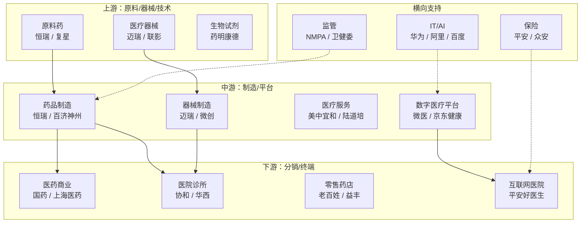

# 生态图谱输出模板 + Mermaid 示例

> 这是 生态图谱分析器 写 `02-ecosystem.md` 的标准结构。

---

## 文件结构

```markdown
# {行业} 生态图谱报告

> 数据时间窗：{time_window}
> 地理范围：{scope}
> 生成时间：{YYYY-MM-DD}

---

## 1. 生态全景图（Mermaid）

\`\`\`mermaid
flowchart TB
    subgraph 上游
        A1[原料供应<br/>公司A<br/>公司B]
        A2[核心组件<br/>公司C]
    end
    subgraph 中游
        B1[核心制造<br/>公司D<br/>公司E]
        B2[平台运营<br/>公司F]
    end
    subgraph 下游
        C1[终端应用<br/>公司G<br/>公司H]
        C2[分销渠道<br/>公司I]
    end
    subgraph 横向支持
        D1[IT / 数据]
        D2[金融 / 资本]
        D3[监管 / 认证]
    end
    A1 --> B1
    A2 --> B1
    B1 --> C1
    B1 --> C2
    D1 -.-> B1
    D2 -.-> B1
    D3 -.-> B1
\`\`\`

---

## 2. 上游（{X} 家代表公司）

### 2.1 {子环节名}：原料 / 组件 / 设备

| 公司 | 定位 | 核心壁垒 | 关键指标 |
|---|---|---|---|
| {公司A} | {一句话定位} | {壁垒} | {指标} |
| {公司B} | ... | ... | ... |

**核心壁垒**：{该子环节的护城河，1-2 句话}

**关键指标**：{如毛利率、产能、CR3}

### 2.2 {子环节名}

（同上）

---

## 3. 中游

（结构同上）

---

## 4. 下游

（结构同上）

---

## 5. 横向支持

### 5.1 IT / 数字化
- {公司}：{定位}

### 5.2 金融 / 资本
- {公司}：{定位}

### 5.3 监管 / 合规
- {机构}：{角色}

---

## 附录：信息缺口

- {环节}：未找到 X 家公司具体名单，参考线索：{...}
```

---

## Mermaid 语法要点

1. 用 `flowchart TB`（自上而下）或 `LR`（左右）
2. 用 `subgraph` 分组（上游/中游/下游/横向支持）
3. 实线 `-->` 表示上下游供应关系
4. 虚线 `-.->` 表示横向支持关系
5. 节点文字用 `<br/>` 换行
6. 避免过深嵌套，复杂时拆成 2-3 个子图

---

## 示例（医疗行业片段）


