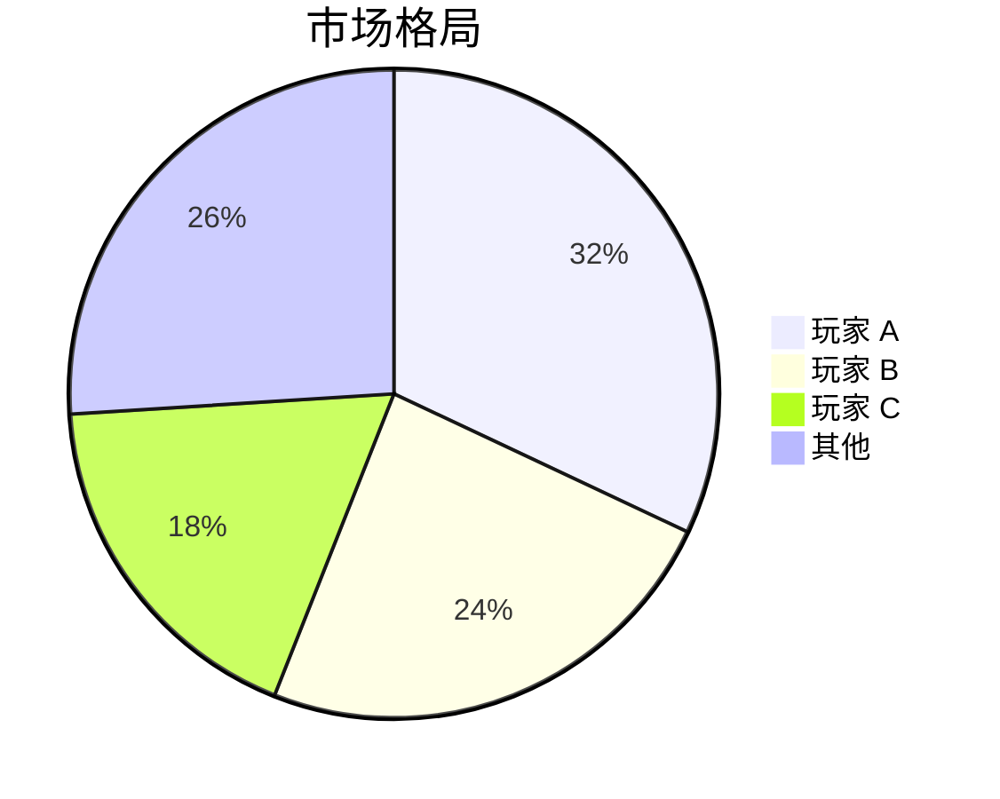

# 报告格式与图表规范

## 颜色系统

| 用途 | 色值 | 说明 |
|------|------|------|
| 主色 | #1F4E79 | 企业蓝，标题、图表主色 |
| 辅助色 | #5B9BD5 | 浅蓝，图表辅助、背景 |
| 强调色 | #E74C3C | 红色，关键风险标注 |
| 正面色 | #27AE60 | 绿色，增长/正面指标 |
| 中性色 | #7F8C8D | 灰色，次要文字 |
| 背景色 | #F8F9FA | 浅灰白，表格背景 |
| 文字色 | #2C3E50 | 深灰蓝，正文 |

## 字体规范

- 标题：思源黑体 / Source Han Sans CN / Noto Sans SC（fallback: Microsoft YaHei）
- 正文：思源宋体 / Source Han Serif CN / Noto Serif SC（fallback: Georgia）
- 数据：Roboto Mono / Source Code Pro（数字等宽）

## 图表规范

### Mermaid 语法嵌入 Markdown

**柱状图（市场对比）**：
````
```mermaid
bar chart
    title 市场对比（亿美元）
    "公司 A": 120
    "公司 B": 85
    "公司 C": 63
```
````

**折线图（趋势）**：
````
```mermaid
line chart
    title 全球市场规模趋势（2020-2025E）
    2020: 340
    2021: 385
    2022: 420
    2023: 475
    2024E: 530
    2025E: 610
```
````

**饼图（市场份额）**：
````

````

## 表格规范

使用 Markdown 标准表格，数据右对齐：
```
| 指标 | 2022 | 2023 | 同比 |
|------|-----:|-----:|-----:|
| 营收 | 120  | 140  | +17% |
```

## 章节编号

- 一级标题：第一章 / 第二章（黑体，居中）
- 二级标题：1.1 / 1.2（左对齐）
- 三级标题：（1）/（2）
