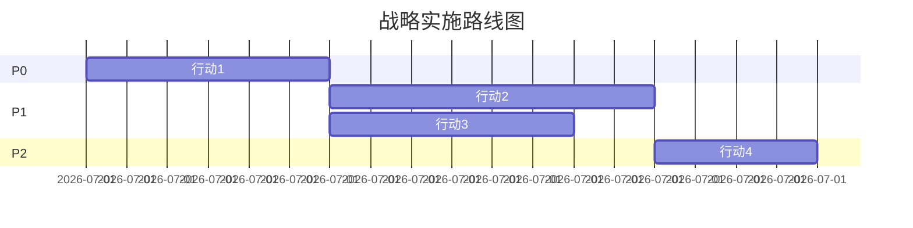

# 连贯性行动

---

## 核心原则

"先做A，再做B，最后做C"是待办清单，可替换。"A让B更有效，B让C更有效，C反过来强化A"是连贯性行动，不可拆解。

---

## Rumelt 链式逻辑

系统的整体表现由**最弱的环节**决定，不是最强的环节。

→ 三个连贯性行动中，必须明确标注：**哪个是当前最弱链路？**
→ 如果指导方针本身没有触及最弱链路，指导方针是无效的。
→ 提升最弱链路对整体效果的提升最大。

**示例**：
- 行动1：AI管家订阅化（弱链路：用户付费意愿低）
- 行动2：安装服务网络开放（弱链路：竞品不配合——结构性障碍）
- 行动3：硬件补贴抢份额（弱链路：资本市场不理解）

最弱链路是行动2 → 指导方针必须直接面对"竞品不配合"这个障碍。

---

## 行动规范

3-5个行动，每个必须包含：

1. **做什么**（一句话说清）
2. **增强关系**（这个行动让哪个其他行动更有效？被哪个行动反哺？）
3. **最弱链路标注**（当前执行这个行动的最大瓶颈是什么？）
4. **代价**（不做这个行动就不会发生的成本或风险——不写代价视为未完成）
5. **实施计划**
   - 先做什么？
   - 依赖什么条件？
   - 6个月里程碑是什么？
   - 18个月验收标准是什么？

---

## 甘特图

行动之间的时序关系必须用Mermaid甘特图可视化：

---

## 退出路线

每个P0行动必须设计退出条件：

- 什么数据表明这个行动应该停止？
- 停止后的退出成本是多少？
- Plan B是什么？

**没有退出路线的行动不是战略行动，是赌博。**
