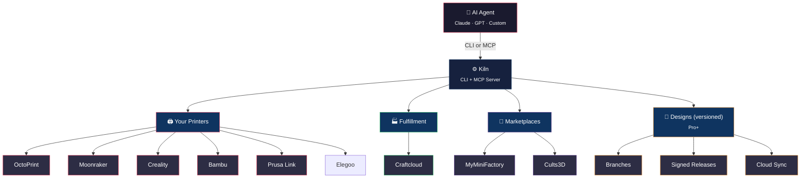
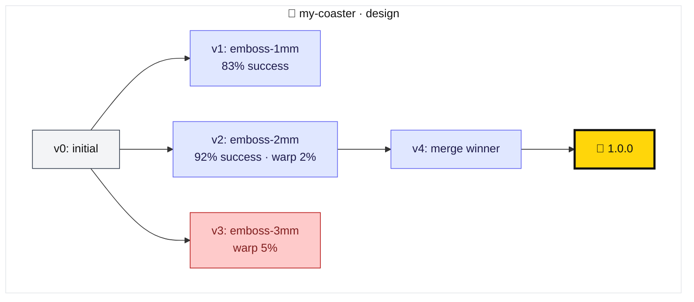

<!-- mcp-name: io.github.codeofaxel/kiln -->
<p align="center">
  <picture>
    <source media="(prefers-color-scheme: light)" srcset="docs/assets/kiln-banner-1280x640-light.svg">
    
  </picture>
</p>

<p align="center">
  <a href="https://pypi.org/project/kiln3d/"></a>
  <a href="https://pypi.org/project/kiln3d/"></a>
  <a href="https://github.com/codeofaxel/Kiln/blob/main/LICENSE"></a>
  <a href="https://github.com/codeofaxel/Kiln/blob/main/SIGNING.md"></a>
</p>

---

**Kiln is an open-source MCP server that lets AI agents (Claude Desktop, Claude Code, Codex, or any custom MCP client) drive real 3D printers end to end — Bambu Lab, Creality, Prusa, Elegoo, Voron, Sovol, AnkerMake, Artillery, FlashForge, QIDI, RatRig, and SparkX, over OctoPrint, Moonraker/Klipper, PrusaLink, and Direct USB.**

In a single conversation, an agent can design a part, slice it, queue it on the right printer, monitor the camera, recover from failures, and ship the result. No human in the middle.

```bash
pip install kiln3d
```

<p align="center">
  
</p>

<p align="center">
  <em>"a coaster with a photo of my dog Ash" — start to finish, from one sentence.</em><br>
  <a href="https://kiln3d.com#demo">Watch the demo →</a>
</p>

<p align="center">
  <sub>Kiln's built in the open. If it made your printing more fun, or just saved you a headache, a ⭐ on the repo helps the next maker find it.</sub>
</p>

## Quick Start

Three steps. Then ask your AI to make something.

**1. Install**

```bash
pip install kiln3d
```

**2. Connect your AI** — one command wires Kiln into Claude Desktop, Claude Code, and Codex:

```bash
kiln signin        # free account — OAuth straight from the terminal
kiln install-mcp   # finds your agents, merges their MCP configs safely
```

Restart your agent and it sees every Kiln tool. Different agent? `kiln install-mcp --print` emits a snippet for any MCP client — or paste it yourself:

<details>
<summary><strong>Manual MCP config (any client, no sign-in needed)</strong></summary>

```json
{
  "mcpServers": {
    "kiln": {
      "command": "python3",
      "args": ["-m", "kiln", "serve"]
    }
  }
}
```

Drop this into Claude Desktop, Claude Code, Codex, Cursor, or any MCP-capable agent. Runs on the free tier until you sign in.
</details>

**3. Ask** — paste a sentence like this into your agent. Kiln does the rest:

> I have a Bambu A1, make me a coaster with my dog's photo on it

That's the whole happy path. The agent invokes Kiln's tools to design, slice, and print — you don't touch a CLI. OS-specific walkthrough (Windows, WSL 2, Linux) at **[kiln3d.com/install](https://kiln3d.com/install)**.

> [!TIP]
> `kiln doctor` runs pre-flight checks on your setup and tells you what to fix. `kiln self-update` upgrades in place when a new release lands.

<details>
<summary><strong>Prefer to drive it yourself? (CLI tour)</strong></summary>

```bash
# Discover printers on your network (mDNS + HTTP probe)
kiln discover

# Add your printer (see the printer table under "Supported Printers")
kiln auth --name my-printer --host http://octopi.local --type octoprint --api-key YOUR_KEY
# Other types:
# kiln auth --name prusa  --host http://192.168.1.100      --type prusalink --api-key YOUR_KEY
# kiln auth --name klipper --host http://192.168.1.100:7125 --type moonraker
# kiln auth --name bambu  --host 192.168.1.100             --type bambu --access-code LAN_CODE --serial SERIAL

kiln status                       # Printer state + job progress
kiln upload model.gcode           # Upload a file
kiln print model.gcode            # Start printing
kiln slice model.stl --print-after  # Slice an STL and print in one step
kiln print *.gcode --queue        # Batch print
kiln wait                         # Monitor a running print
kiln snapshot --save photo.jpg    # Webcam snapshot
kiln history --status completed   # Print history

# Every command supports --json for agent consumption
kiln status --json
```

Global option: `--printer <name>` targets a specific printer per command. The full command reference is in [Project Docs](docs/PROJECT_DOCS.md).
</details>

<details>
<summary><strong>Connect a specific agent (Claude Code, Claude Desktop, env vars)</strong></summary>

**Claude Code** — add to `.claude/settings.json` (project) or `~/.claude/settings.json` (global):

```json
{
  "mcpServers": {
    "kiln": { "command": "kiln", "args": ["serve"] }
  }
}
```

Claude Code uses your `~/.kiln/config.yaml` for printer credentials (set via `kiln setup` or `kiln auth`). No env vars needed if a printer is already configured.

**Claude Desktop** — add to `~/.config/Claude/claude_desktop_config.json`:

```json
{
  "mcpServers": {
    "kiln": {
      "command": "python3",
      "args": ["-m", "kiln", "serve"],
      "env": {
        "KILN_PRINTER_HOST": "http://192.168.1.100",
        "KILN_PRINTER_API_KEY": "your_key",
        "KILN_PRINTER_TYPE": "prusalink"
      }
    }
  }
}
```

Set `KILN_PRINTER_TYPE` to your backend: `octoprint`, `moonraker`, `bambu`, `prusalink`, `elegoo`, or `serial` — or skip env vars entirely if you've run `kiln setup`.

**Any other LLM (OpenRouter)** — Kiln works with any model that supports OpenAI-compatible function calling, not just Claude:

```bash
export KILN_OPENROUTER_KEY=sk-or-...
kiln agent --model openai/gpt-4o
kiln agent --model meta-llama/llama-3.1-70b-instruct --tier essential
```

Tool tiers auto-match model capability: **essential** (16 tools) for smaller models, **standard** (61 tools) for mid-range, **full** (133 tools) for stronger models. All <!-- KILN_MCP_TOOL_COUNT:OLD --> 828 tools are available over MCP via `kiln serve`.
</details>

<details>
<summary><strong>Platform &amp; printer setup notes (Linux/WSL 2, Ethernet-only, Bambu)</strong></summary>

### Prerequisites by printer type

| Printer | `--type` | What you need |
|---------|----------|---------------|
| **Prusa MK4/XL/Mini+** | `prusalink` | IP + API key (Settings › Network › PrusaLink on the LCD) |
| **OctoPrint** (any printer) | `octoprint` | OctoPrint URL + API key (Settings › API) |
| **Klipper/Moonraker** | `moonraker` | Moonraker URL (usually `http://<ip>:7125`) |
| **Creality K1/K2/Hi/Ender V4/V3 KE** | `creality` | IP + `printer_model` (e.g. `creality_k1_max`); probes local Moonraker ports |
| **Bambu Lab** | `bambu` | IP + LAN access code + serial number (all on the LCD) |
| **Elegoo** (SDCP) | `elegoo` | IP only — no auth. Neptune 4 / OrangeStorm Giga use `moonraker`. |
| **Direct USB** (Marlin) | `serial` | USB cable only — no network. Ender 3, Prusa MK3, CR-10, any Marlin/RepRap printer. |

Kiln only needs IP reachability on your LAN. Ethernet-only printers are fully supported.

**Optional tools:** [PrusaSlicer](https://www.prusa3d.com/prusaslicer/) or OrcaSlicer for slicing STL → G-code (`brew install --cask prusaslicer`); [OpenSCAD](https://openscad.org/) for local text-to-3D generation (`brew install openscad`); set `KILN_GEMINI_API_KEY` to enable Gemini-generated geometry.

### Linux / WSL 2

`pipx` installs Kiln into its own isolated environment and puts `kiln` on your PATH. (The pip package is `kiln3d`; the CLI command is `kiln`.)

```bash
sudo apt install pipx && pipx ensurepath
git clone https://github.com/codeofaxel/Kiln.git && cd Kiln
pipx install ./kiln
sudo apt install prusa-slicer openscad   # optional: slicing + generation
kiln verify

# Update / uninstall
git pull && pipx install --force ./kiln
pipx uninstall kiln3d
```

**WSL 2 networking:** WSL 2 uses NAT, so mDNS discovery (`kiln discover`) won't see printers on your home network. Connect directly by IP instead (same as Ethernet-only setups).

### Ethernet-only printers (no Wi-Fi)

Kiln works the same over Ethernet and Wi-Fi — it talks to printer APIs over LAN IP. Verify the printer endpoint responds, then register by IP:

```bash
curl http://<ip>/api/version                              # OctoPrint
curl http://<ip>:7125/server/info                         # Moonraker / Creality (local Moonraker)
curl -H "X-Api-Key: YOUR_KEY" http://<ip>/api/v1/status   # Prusa Link
# Bambu uses MQTT — ensure port 8883 is reachable:  nc -zv <ip> 8883

kiln auth --name my-printer --host http://<ip> --type prusalink --api-key YOUR_KEY
```

If PrusaSlicer isn't on your PATH: `export KILN_SLICER_PATH=/path/to/prusa-slicer`.

### Bambu TLS &amp; webcam

Kiln pins the printer certificate (TOFU) on first connection in `~/.kiln/bambu_tls_pins.json`. Overrides:

```bash
export KILN_BAMBU_TLS_MODE=ca         # strict CA/hostname (usually fails on stock self-signed printers)
export KILN_BAMBU_TLS_MODE=insecure   # legacy, no validation — trusted LANs only
export KILN_BAMBU_TLS_FINGERPRINT=0123abcd...   # explicit SHA-256 pin
```

Webcam capture is model-dependent: **A1, A1 Mini, P1P, P1S** serve frames over TLS+JPEG (no extra software). The **X1 series** (X1C, X1E) serves RTSPS, which Kiln relays via `ffmpeg` — so on an X1, both snapshots *and* the live stream need `ffmpeg` (`brew install ffmpeg` / `sudo apt install ffmpeg`). `can_snapshot` is reported `True` for every Bambu model; on an X1 without `ffmpeg`, the attempt surfaces a clear model-specific error rather than failing silently.
</details>

Paid tiers ([kiln3d.com/pricing](https://kiln3d.com/pricing)) add Git-for-3D versioning, product templates, assembly manuals, fleet workflows, SSO + SCIM, ERP webhooks, and long-term audit logs.

## Why Kiln?

- **One control plane, any printer** — OctoPrint, Moonraker, Creality, Bambu Lab, Prusa Link, Elegoo, Serial. Manage a mixed fleet from one place.
- **No printer? No problem** — Outsource jobs to Craftcloud's 150+ manufacturing services through the hosted proxy, or use direct mode with your own provider credentials.
- **AI-native** — <!-- KILN_MCP_CAPABILITY_COUNT:OLD --> 835 MCP capabilities and <!-- KILN_CLI_COUNT:OLD --> 223 CLI commands built for AI agents. Not a web UI with an API bolted on.
- **Describe it, print it** — Natural-language to physical object pipeline: text or sketch → AI generation → validation → slice → print.
- **Decorate anything** — QR codes, photos, logos, text, SVGs, and procedural textures (tiger stripe, marble, camo, wood grain, honeycomb) embossed or debossed onto any model with one command.
- **Manuals included** — Multi-part prints can generate printable PDF assembly manuals with Bill of Materials, isometric step renders, mating arrows, and pause-and-check verification gates. (Business)
- **Resume, don't restart** — Cancelled or failed print? Resume from the exact layer it stopped on any supported FDM printer. No filament wasted. (Pro)
- **Modify mid-print** — Add decorations, append features, or swap materials on a live print with atomic revert if anything goes wrong. (Pro)
- **Smart material routing** — 25 materials, 45 brand-specific filament profiles (Bambu, Prusament, Polymaker, and more) across 11 material families. Intent-based recommendations with printer capability awareness.
- **Prints don't fail silently** — Cross-printer learning, automatic failure recovery, closed-loop AI generation feedback (failed prints auto-improve future generations), preflight safety checks on every job.
- **Search → Slice → Print** — Search and download 3D models from MyMiniFactory and Cults3D (search only), auto-slice with PrusaSlicer or OrcaSlicer, print — all from one agent conversation.
- **Safety at scale** — 51 named per-printer safety profiles, G-code validation, heater watchdog, tamper-proof audit logs. Enterprise adds encrypted G-code at rest with key rotation, lockable profiles, RBAC, SSO, fleet site grouping, per-project cost tracking, and PostgreSQL HA.

## Supported Printers

| Backend | Status | Printers |
|---------|--------|----------|
| **OctoPrint** | Stable | Any OctoPrint-connected printer (Prusa, Ender, custom) |
| **Moonraker** | Stable | Klipper-based printers (Voron, Ratrig, etc.) |
| **Creality** | Stable when Moonraker is reachable | SPARKX i7, K1/K1 Max/K1C/K1 SE, K2/K2 Pro/K2 Plus/K2 SE, Creality Hi, Ender-3 V4/V3 KE, Ender-5 Max, CR-10 SE via local Moonraker. Older Marlin Creality printers use `serial` or `octoprint`. |
| **Bambu** | Stable | Bambu Lab X1C, X1E, P1S, P1P, P2S, A1, A1 Mini, A2L, H2S (via LAN MQTT) |
| **Prusa Link** | Stable | Prusa MK4, XL, Mini+ (local REST API — type: `prusalink`) |
| **Elegoo** | Stable | Centauri Carbon, Saturn, Mars series (via LAN WebSocket/SDCP). Neptune 4 / OrangeStorm Giga use Moonraker. |
| **Direct USB** | Stable | Any Marlin-based printer over USB (Ender 3, Prusa MK3, CR-10, etc.). No OctoPrint or Klipper needed — just a USB cable. Type: `serial`. |

<!-- BEGIN SUPPORTED PRINTERS (auto-generated by scripts/generate_supported_printers.py) -->
Kiln ships **tuned profiles for 49 models across 12 brands** — Creality, Bambu Lab, Elegoo, Prusa Research, Sovol, Voron, AnkerMake, Artillery, FlashForge, QIDI, RatRig, SparkX. [See the full searchable list →](https://kiln3d.com/printers)
<!-- END SUPPORTED PRINTERS -->

## Architecture



Agents can also outsource jobs through **Craftcloud** fulfillment and search models on **MyMiniFactory** and **Cults3D** (search only). On Pro and up, the design store itself is versioned — branches, signed releases, and cross-machine cloud sync are first-class outputs of the system, not a side database.

## Git for 3D

Designs aren't text, but they need version control. Kiln treats meshes, decorations, and mechanical features as first-class versioned artifacts: branch a design, print variants, merge what works, sign releases with cryptographic proof the mesh hasn't changed.

Three things make this different from `git`:

1. **Outcome-correlated branches.** Every branch is tagged with empirical print results — success rate, warp, adhesion, cost — so cross-branch A/B is automatic, not anecdotal.
2. **3-way semantic mesh merge.** Z-level / pocket / bounding-box conflict zones rendered as visual diffs, not text patches. Manufacturing tolerance, not character offsets.
3. **Signed releases with mesh re-fingerprinting.** Ed25519 signatures over a release manifest pinned to an exact mesh; verification re-computes the fingerprint to detect tamper after release.

Here's what `visualize_branch_tree("my-coaster")` actually emits — the same renderer the workshop, CLI, and your agent see (yellow = signed release, light blue = experiment, light red = branch with failed outcomes):



| Tier | What you get |
|------|-------------|
| Free | Linear local design history (save / diff / rollback) |
| **Pro** | Branch · merge · cherry-pick · Ed25519 signed releases · solo cloud sync |
| **Business** | Team pull requests · approval gates · orgs / teams / scopes |
| **Enterprise** | Audit log export · SSO · step-up authentication on releases · access review |

Patent pending across semantic mesh merge, outcome-correlated branching, and signed-release-with-physical-provenance.

## What Agents Can Do

The Kiln MCP server (`kiln serve`) exposes **<!-- KILN_MCP_TOOL_COUNT:OLD --> 828 tools** to agents, plus prompts and resources for **<!-- KILN_MCP_CAPABILITY_COUNT:OLD --> 835 total MCP capabilities**. Rather than list them all here, agents browse the live catalog with `get_skill_manifest` and ToolSearch-style discovery. A representative slice:

| Theme | Example tools |
|-------|---------------|
| **Control** | `printer_status` · `start_print` · `monitor_print` · `pause_print` · `cancel_print` · `emergency_stop` · `send_gcode` (validated) |
| **Make** | `generate_model` (text → 3D) · `slice_and_print` · `analyze_printability` · `auto_orient_model` · `decorate_surface` (QR/photo/logo/texture) |
| **Find &amp; outsource** | `search_all_models` · `download_and_upload` · `fulfillment_quote` · `fulfillment_order` |
| **Recover &amp; learn** | `retry_print_with_fix` · `resume_interrupted_print` (Pro) · `predict_print_failure` · `get_printer_insights` · `diagnose_print_failure_live` |
| **Versioning** (Pro+) | `save_design_version` · `diff_design_versions` · `get_proven_recipe` · `check_design_regression` |
| **Fleet &amp; safety** | `fleet_status` · `submit_job` · `preflight_check` · `list_safety_profiles` · `validate_gcode_safe` |

The complete tool catalog, grouped by subsystem, lives in **[Project Docs](docs/PROJECT_DOCS.md)**.

<details>
<summary>MCP resources (read-only context for agents)</summary>

| Resource URI | Description |
|---|---|
| `kiln://status` | System-wide snapshot (printers, queue, events) |
| `kiln://printers` | Fleet listing with idle printers |
| `kiln://printers/{name}` | Detailed status for a specific printer |
| `kiln://queue` | Job queue summary and recent jobs |
| `kiln://queue/{job_id}` | Detail for a specific job |
| `kiln://events` | Recent events (last 50) |
</details>

## Capabilities

**Search → download → print.** Kiln searches MyMiniFactory and Cults3D (search only) in one call via `search_all_models`, downloads where supported, and uploads straight to a printer — a full design-to-print loop with no human in the middle. *(Thingiverse is supported but deprecated since its Feb 2026 acquisition by MyMiniFactory; prefer MMF.)* Marketplace access uses free API keys (`KILN_MMF_API_KEY`, `KILN_CULTS3D_USERNAME` + `KILN_CULTS3D_API_KEY`).

**AI model generation.** Set any provider key and it's available instantly — `KILN_MESHY_API_KEY`, `KILN_TRIPO3D_API_KEY`, `KILN_STABILITY_API_KEY`, `KILN_GEMINI_API_KEY` — or use local OpenSCAD with no key. Generated meshes are auto-validated for printability (manifold, triangle count, bounding box) before printing. `kiln generate` renders a 3-view preview by default.

**Slicing.** Wraps PrusaSlicer and OrcaSlicer for headless slicing; auto-detects installed slicers on PATH, macOS app bundles, or via `KILN_SLICER_PATH`. Supports STL, 3MF, STEP, OBJ, AMF with material-aware temps and smart supports.

**Fulfillment (no printer required).** Print through Craftcloud's network — quote, validate address, confirm, order, track — or run alongside your own printers for overflow and specialty materials. Normal users go through the hosted proxy (credentials stay server-side, spend limits enforced); operators can use direct mode with `KILN_FULFILLMENT_PROVIDER=craftcloud` + `KILN_CRAFTCLOUD_API_KEY`.

**Decoration &amp; textures.** Emboss or deboss QR codes, photos, logos, text, and SVGs onto any model face, or apply procedural textures (tiger stripe, marble, camo, wood grain, honeycomb) with a single tool call.

## Pricing

All local printing is **free forever** — status, file management, slicing, fleet control, and printing to your own printers cost nothing. Kiln charges a **5% orchestration fee** on orders placed through external manufacturing services (first 3/month free, $0.25 min / $200 max per order), shown transparently in every quote.

| Tier | Price | Headline |
|------|-------|----------|
| **Free** | $0 | Unlimited local printing, slicing, marketplace search, safety profiles, one printer, design intelligence, linear design history. |
| **Pro** | $49/mo | Git-for-3D branching/signed releases, product templates, procedural textures, mid-print modification, print resume, failure recovery, nozzle-wear tracking, solo cloud sync. |
| **Business** | $199/mo | Commercial use, 3 printers + 3 seats, fleet management, cross-printer learning, QR generation, assembly manuals, team pull requests, approval gates, fulfillment, webhooks. |
| **Enterprise** | Contact us | Large fleets, SSO/SCIM, RBAC, audit trail, encrypted G-code at rest, white-label manuals, 99.9% SLA, on-prem/VPC. |

Full comparison at **[kiln3d.com/pricing](https://kiln3d.com/pricing)**. Run `kiln upgrade` to activate a license key. For provider-routed orders, the provider remains merchant of record; Kiln acts as orchestration infrastructure.

## Safety

Kiln is safety-first infrastructure for controlling physical machines:

- **Pre-flight checks** validate printer state, temperatures, and files before every print
- **G-code validation** blocks dangerous commands (firmware reset, unsafe temperatures)
- **Temperature limits** enforce safe maximums (300 °C hotend, 130 °C bed)
- **Confirmation required** for destructive operations (cancel, raw G-code)
- **Optional authentication** with scope-based API keys for multi-user setups
- **Structured errors** ensure agents always know when something fails

## Packages

This monorepo contains two packages:

| Package | Description | Entry point |
|---------|-------------|-------------|
| **kiln** | CLI + MCP server for multi-printer control (OctoPrint, Moonraker, Creality, Bambu, Prusa Link, Elegoo, Direct USB) | `kiln` or `python -m kiln` |
| **octoprint-cli** | Lightweight standalone CLI for OctoPrint-only setups | `octoprint-cli` |

## Development

```bash
# Create a virtualenv first (required on modern Ubuntu/Debian/WSL)
python3 -m venv .venv && source .venv/bin/activate

pip install -e "./kiln[dev]"
pip install -e "./octoprint-cli[dev]"

cd kiln && python3 -m pytest tests/ -v
cd ../octoprint-cli && python3 -m pytest tests/ -v
```

<details>
<summary><strong>Configuration reference (auth, webhooks, discovery, plugins)</strong></summary>

### Authentication (optional)

Optional API-key auth for MCP tools, disabled by default. Scopes: `read`, `write`, `admin`. Read-only tools never require auth.

```bash
export KILN_AUTH_ENABLED=1
export KILN_AUTH_KEY=your_secret_key
export KILN_MCP_AUTH_TOKEN=your_secret_key   # clients provide their key here
```

### Webhooks

Register HTTP endpoints for real-time event notifications:

```
register_webhook(url="https://example.com/hook", events=["job.completed", "print.failed"])
```

Payloads are signed with HMAC-SHA256 when a secret is provided. Redirects are blocked by default (`KILN_WEBHOOK_ALLOW_REDIRECTS=0`); when enabled, each hop is SSRF-validated and HTTPS→HTTP downgrade is blocked.

### Printer discovery

```bash
kiln discover   # mDNS/Bonjour + HTTP subnet probing
```

Finds OctoPrint, Moonraker/Creality, Bambu, Elegoo, and Prusa Link printers. If discovery returns nothing, register directly by IP with `kiln auth`.

### Third-party plugins

Entry-point plugins are **default-deny** in production (`KILN_PLUGIN_POLICY=strict`). Allow specific plugins with `KILN_ALLOWED_PLUGINS=my_plugin,other_plugin`, or set `KILN_PLUGIN_POLICY=permissive` for temporary migration compatibility.
</details>

<details>
<summary><strong>Modules (for contributors)</strong></summary>

| Module | Description |
|---|---|
| `server.py` | MCP server with tools, resources, and subsystem wiring |
| `printers/` | Printer adapter abstraction (OctoPrint, Moonraker, Creality, Bambu, Prusa Link, Elegoo) |
| `marketplaces/` | Model marketplace adapters (MyMiniFactory, Cults3D, Thingiverse, metadata-only sources) |
| `slicer.py` | Slicer integration (PrusaSlicer, OrcaSlicer) with auto-detection |
| `registry.py` | Fleet registry for multi-printer management |
| `queue.py` | Priority job queue with status tracking |
| `scheduler.py` | Background job dispatcher with history-based smart routing |
| `events.py` | Pub/sub event bus with history |
| `persistence.py` | SQLite storage for jobs, events, and settings |
| `webhooks.py` | Event-driven webhook delivery with HMAC signing |
| `auth.py` | Optional API key authentication with scope-based access |
| `discovery.py` | Network printer discovery (mDNS + HTTP probe) |
| `generation/` | Text-to-model generation providers (Meshy, Tripo3D, Stability AI, Gemini Deep Think, OpenSCAD) with auto-discovery, mesh validation, and printability analysis |
| `consumer.py` | Consumer workflow for non-printer users (address validation, material recommendations, timeline/price estimation, onboarding) |
| `cost_estimator.py` | Print cost estimation from G-code analysis |
| `materials.py` | Multi-material and spool tracking |
| `material_catalog.py` | Material brand catalog, properties, and purchase-link metadata |
| `material_inventory.py` | Fleet material inventory and assignment tracking |
| `bed_leveling.py` | Automated bed leveling trigger system |
| `streaming.py` | MJPEG webcam streaming proxy |
| `cloud_sync.py` | Cloud sync for printer configs and job history |
| `plugin_loader.py` | Internal tool-plugin discovery and registration |
| `plugins/` | Focused MCP tool modules loaded by the plugin loader |
| `gcode.py` | G-code safety validator with per-printer limits |
| `gcode_interceptor.py` | Rule-based G-code interception and safety rewriting |
| `safety_profiles.py` | Bundled safety database (51 named printer models, temps/feedrates/flow) |
| `slicer_profiles.py` | Bundled slicer profiles (auto-generates .ini files per printer) |
| `printer_intelligence.py` | Printer knowledge base (firmware quirks, materials, failure modes) |
| `pipelines.py` | Pre-validated print pipelines (quick_print, calibrate, benchmark) |
| `assembly.py` | Multi-part assembly validation and manual planning support |
| `design_versions.py` | Local design history, version records, diffs, and rollback primitives |
| `mesh_validation_pipeline.py` | Multi-gate printability validation pipeline |
| `model_visualizer.py` | Local model preview rendering |
| `tool_schema.py` | OpenAI function-calling schema converter (MCP → OpenAI format) |
| `tool_tiers.py` | Tool tier definitions (essential/standard/full) for model capability matching |
| `agent_loop.py` | Generic agent loop for any OpenAI-compatible API (OpenRouter, direct, etc.) |
| `openrouter.py` | OpenRouter integration with model catalog and auto-tier detection |
| `data/` | Bundled JSON databases (safety profiles, slicer profiles, printer intelligence) |
| `gateway/` | External-provider integration gateway *(as integrations launch)* |
| `heater_watchdog.py` | Auto-cooldown watchdog for idle heaters |
| `wallets.py` | Crypto wallet configuration (Solana/Ethereum for donations and fees) |
| `pro_tool_manifest.json` | Public manifest for kiln-pro tool discovery and REST proxy stubs |
| `decoration_quota.py` | Free-tier decoration quota tracking and tier resolution hooks |
| `cli/` | Click CLI with <!-- KILN_CLI_COUNT:OLD --> 223 commands and JSON output |
| `deploy/` | Kubernetes manifests and Helm chart for on-prem Enterprise deployment |

kiln-pro ([kiln3d.com](https://kiln3d.com)) extends public Kiln with paid-tier REST serving, billing, licensing, SSO, RBAC, G-code encryption, uptime reporting, team administration, and project-cost workflows. Public Kiln exposes only the interface/proxy surface for those capabilities; the private implementation stays in kiln-pro.
</details>

## Documentation

| Document | Description |
|----------|-------------|
| [Project Docs](docs/PROJECT_DOCS.md) | Complete reference (CLI, MCP tools, adapters, config) |

<details>
<summary>Brand assets</summary>

Logo files live in [`docs/assets/`](docs/assets/) — all vector SVG, scale to any size.

| File | Use |
|------|-----|
| `kiln-banner-1280x640.svg` / `kiln-banner-1280x640-light.svg` | GitHub / social media banner (dark / light scheme) |
| `kiln-logo-dark.svg` / `kiln-logo-light.svg` | Primary mark + wordmark (dark / light bg) |
| `kiln-horizontal-dark.svg` / `kiln-horizontal-light.svg` | Horizontal lockup (dark / light bg) |
| `kiln-logo-dark-notext.svg` | Mark only (dark bg) |
| `kiln-favicon-256.svg` | Favicon / app icon |
| `kiln-logo-transparent.svg` / `kiln-logo-transparent-dark.svg` | Transparent bg (for dark / light UIs) |
| `kiln-pfp-1024.svg` / `kiln-pfp-1024-flat.svg` | Social profile picture, with / without glow (1024×1024) |
| `wallpapers/kiln-wallpaper-iphone-*.svg` | iPhone wallpapers |
| `wallpapers/kiln-wallpaper-macbook-*.svg` | MacBook wallpapers |
</details>

## Support Development

Kiln is free, open-source software. If you find it useful, consider sending a tip:

- **Solana:** `kiln3d.sol`
- **Ethereum:** `kiln3d.eth`

## Positioning

> **Messaging clarification (February 24, 2026):** We clarified wording to remove ambiguity and align with existing intent; no strategy change. Kiln is orchestration and agent infrastructure for fabrication workflows. Kiln does **not** operate a first-party decentralized manufacturing marketplace/network. Kiln integrates with third-party providers and external provider/network adapters as integrations are available.

**Non-goals:** operating a first-party decentralized manufacturing marketplace/network; replacing partner supply-side networks; owning provider marketplaces instead of integrating with them; acting as merchant of record for provider-routed manufacturing orders.

## License

Kiln is a project of **Hadron Labs Inc.**

[AGPL-3.0 License](LICENSE) — open source with copyleft. [Commercial licensing](COMMERCIAL_LICENSE.md) available for companies that need proprietary use.

By contributing, you agree to the [Contributor License Agreement](CONTRIBUTOR_LICENSE_AGREEMENT.md).
