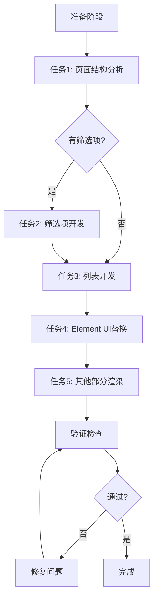

# 三、AI执行流程指南

## 3.1 执行前准备工作

**⚠️ 在开始改造前，AI必须完成以下准备：**

### 步骤1: 环境确认
```bash
# 检查Element UI是否已安装
npm list element-ui

# 如未安装，执行安装
npm i element-ui@2.15.14 -S
```

### 步骤2: 路径验证（⭐新增，必须执行）

**⚠️ 路径验证是生成Custom.vue的前提，验证失败会导致文件无法生成：**

```javascript
// 验证清单（以 ${folderName} 为例）

// 2.1 验证源文件路径（必须存在）
必须存在: src/views/${folderName}/index.vue
// 样式：以 index.vue 内 style src / @import / import 为准逐项验证存在（常见为 assets/index.css）

// 2.2 验证目标路径（将要创建）
目标文件: src/views/${folderName}/Custom.vue

// 2.3 排除根目录混淆（常见问题）
❌ 错误: 读取 ${folderName}/index.vue (根目录)
✅ 正确: 读取 src/views/${folderName}/index.vue

❌ 错误: 在 ${folderName}/Custom.vue 创建 (根目录)
✅ 正确: 在 src/views/${folderName}/Custom.vue 创建
```

**路径验证失败处理：**
| 问题 | 原因 | 解决方案 |
|------|------|---------|
| src/views/${folderName}/ 不存在 | 文件夹名称错误或位置不对 | 检查文件夹名称拼写，确认源文件位置 |
| 根目录存在 ${folderName}/ | 之前可能错误创建 | 以 src/views/ 下的为准，根目录的可能是旧文件 |
| index.vue 不存在 | 源文件缺失 | 确认项目结构是否符合规范 |

**验证示例（以 shushi 为例）：**
```bash
# ✅ 正确验证流程
ls src/views/shushi/index.vue          # 必须存在
# 再据 index.vue 引用确认 css（常见为 assets/index.css）

# ❌ 错误验证（会导致路径混淆）
ls shushi/index.vue                    # 不要以此为准
```

### 步骤3: 读取源文件（唯一稿源）

**生成 Custom.vue 时，只允许读取以下作为页面结构与样式依据：**

```javascript
1. src/views/${folderName}/index.vue     // 入口，源 HTML/结构
2. index.vue 所引用的一切样式文件       // 如 ./assets/index.css；含链式 @import 时仅沿引用链读取
// 图片等资源：以上文件中出现的路径为准，无需读取二进制
```

**禁止**为生成页面而读取：`package.json`、路由、其他视图的 `Custom.vue` / `index.vue`、`create.md` 等（不得以其他文件当模板）。项目级依赖与路由若需改动由用户另行处理。

**⚠️ 读取前确认：**
- [ ] 已验证 `src/views/${folderName}/index.vue` 存在
- [ ] 已根据 index.vue 验证其所引用的每个样式文件存在
- [ ] 确认不是在根目录的 `${folderName}/` 下读取

### 步骤4: 理解源文件结构
在读取源文件后，AI应该：
1. **识别页面布局** - 确定是单栏、双栏还是多栏布局
2. **识别重复结构** - 找出需要循环渲染的部分
3. **识别交互元素** - 找出按钮、输入框等可替换为Element UI的元素
4. **识别样式特征** - 记录关键样式值（颜色、尺寸、间距）

## 3.2 开发执行原则（⭐核心重要）

**🎯 执行顺序严格要求：**

```
准备阶段 → 任务1 → 任务2 → 任务3 → 任务4 → 任务5 → 验证阶段
     ↓       ↓       ↓       ↓       ↓       ↓         ↓
   必须      必须    可选    必须    必须    必须      必须
```

**⚠️ 关键原则（必须遵守）：**

| 原则 | 说明 | 违反后果 |
|------|------|---------|
| 📋 顺序执行 | 严格按任务1→2→3→4→5顺序 | 代码结构混乱 |
| ✅ 立即验证 | 每完成一个任务立即验证 | 错误累积难修复 |
| 🎨 像素级匹配 | 使用开发者工具对比验证 | 视觉效果不一致 |
| 🔗 同步生成 | template、data、methods同时完成 | 功能不完整 |
| ❌ 禁止分步 | 不能只写template不写methods | 运行报错 |
| 📝 规范命名 | 所有class使用规范命名 | 代码难维护 |

## 3.3 组件与方法同步生成（⭐关键要求）

**❌ 错误的做法（禁止）：**
```vue
<!-- 步骤1: 只写template -->
<template>
  <el-input v-model="inputValue" @change="handleInputChange" placeholder="请输入" />
</template>

<!-- 步骤2: 稍后再写methods -->
<script>
export default {
  methods: {
    // 这时才写handleInputChange方法
  }
}
</script>
```

**✅ 正确的做法（必须）：**
```vue
<template>
  <el-input v-model="inputValue" @change="handleInputChange" placeholder="请输入" />
</template>

<script>
export default {
  data() {
    return {
      inputValue: ''
    }
  },
  methods: {
    handleInputChange() {
      console.log('输入值已变更')
    }
  }
}
</script>
```

**完整的组件替换流程：**

```
1. 识别原HTML元素
   ↓
2. 选择对应的Element UI组件
   ↓
3. 同时完成以下三项（不能分开）：
   ├─ 编写template代码
   ├─ 在data()中定义所需数据
   └─ 在methods中实现所有事件处理
   ↓
4. 编写样式覆盖代码
   ↓
5. 测试功能和样式
   ↓
6. 确认无误后继续下一个
```

## 3.3.1 可点击的按钮须绑定点击方法

**规则：** 页面中所有可点击的按钮（包括「上传」「预览」「确定」「取消」「智能合成」等），必须在 template 中绑定 `@click`，并在 `methods` 中实现对应的点击方法。

**示例：**
```vue
<template>
  <div class="custom_upload_row">
    <span class="custom_btn_label">上传图片</span>
    <div class="custom_btn_upload" @click="handleUploadImage">上传</div>
    <div class="custom_btn_preview" @click="handlePreview">预览</div>
  </div>
</template>

<script>
export default {
  methods: {
    handleUploadImage() {
      // 执行上传图片逻辑
    },
    handlePreview() {
      // 执行预览逻辑
    }
  }
}
</script>
```

**要点：**
- 每个可点击的按钮/区域必须有 `@click="handleXxx"`，且 `handleXxx` 在 `methods` 中已实现
- 方法命名建议：`handle` + 按钮功能（如 `handleUploadImage`、`handlePreview`、`handleDialogConfirm`）

## 3.4 命名规范应用流程

**步骤1: 识别源文件中的错误命名**
- _1, _2, _3, _91, _94 等数字后缀
- group_1, box_2, text_3 等
- image-wrapper_1 等（连字符+序号）

**步骤2: 理解元素实际用途**
- group_1 → 是页面头部 → custom_header_container
- text_1 → 是标题文字 → custom_title_text
- box_91 → 是列表项 → custom_list_item

**步骤3: 应用命名规范**
- 命名公式：`custom_[功能]_[内容]_[特征]`，**仅用下划线 `_` 连接，class 中不得出现任何数字**（序位用 first、second、left、right 等英文词）。

**⚠️ 任务5 Class 重命名为必须步骤**：禁止保留源 class 并引用 index.css，禁止只改 template 不改样式。必须建立映射表 → 更新 template → 复制源 CSS 到 Custom.vue 并更新选择器 → 移除对 index.css 的引用。详见 **`data/class-naming.md`** 第二部分的强制要求与修复流程。

**⚠️ 任务4 Element UI 替换为必须步骤**：禁止整页仅用 div+@click 而不用任何 Element 组件。凡存在按钮、多选、单选、输入、分页、弹窗等，须按映射表替换为 el-button、el-checkbox、el-radio-group+el-radio、el-input 等，并用 ::v-deep 做样式匹配。单选用 el-radio 替换（样式与源页一致、选中/悬停主题色）；开关不替换，保留原生 DOM。详见 **`data/element-ui-style.md`**、**`data/recognition-and-fix.md`**（含任务4 强制要求与修复流程）。

## 3.5 验证检查流程

**每完成一个任务后，必须执行：**
1. 视觉效果检查 - 打开开发者工具对比源文件，确认尺寸、颜色、间距完全一致
2. 功能检查 - 测试所有交互功能，确认无console报错
3. 代码质量检查 - class命名是否规范，是否有未使用的代码，data和methods是否完整
4. 继续下一任务 - 只有通过以上检查才能继续

## 3.6 开发流程图


