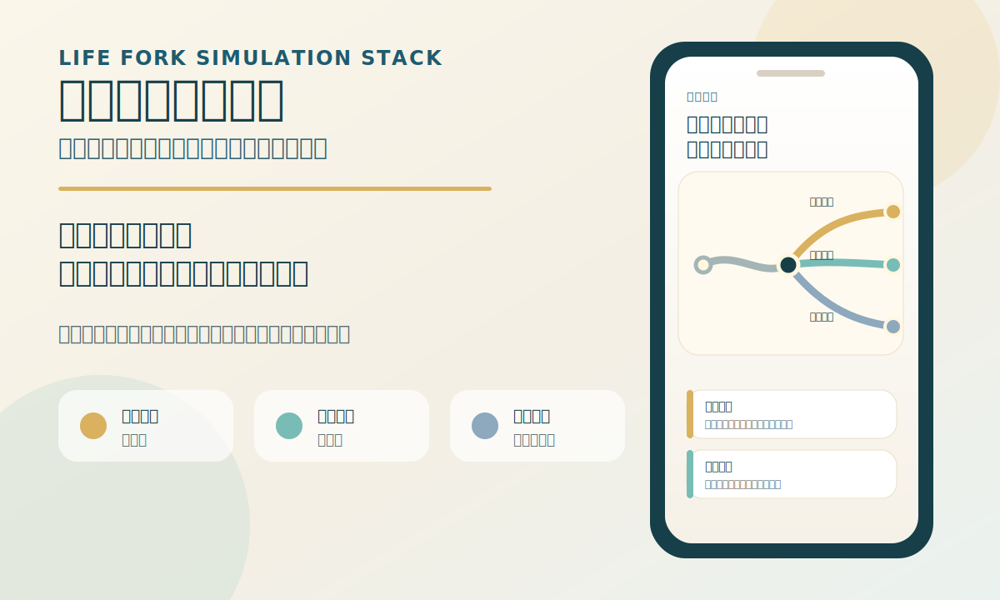

# 人生岔路模拟栈

你可以把它叫作：**如果当年 / 人生岔路复盘**。

这个 Skill 用来复盘那些你偶尔会想起的选择：

- 如果当年去了北京，会怎样？
- 如果留学后没有回国，会怎样？
- 如果那年买了房，会怎样？
- 如果当年进了体制，会怎样？
- 如果没有离开上一家公司，会怎样？
- 如果 2023 年认真做 AI，会怎样？

它不会替你判断当年对错，也不会给你一个确定答案。它会帮你把那份说不清的遗憾拆开：当年放下了什么，保住了什么，后来哪些变化打到你身上，今天还能补回哪一部分。



## 你能得到什么

默认会生成一份用户能看懂的复盘报告，通常包含：

- 一句判词：先说中你真正放不下的点。
- 分叉图：把现实结果、假设结果、回补结果放到一张图里。
- 三种结果卡：每种结果分别写它给你的、它拿走的、最大的误判。
- 事件冲击卡：把年份、生活场景、现实代价、情绪代价、误判点和今天验证写清楚。
- 30 天验证实验：给 4 周低成本动作，把后悔变成现实反馈。
- 继续解释层：补充多角度判断、外部环境、还缺哪些信息，以及报告不能替你决定什么。

如果环境支持文件输出，还可以生成移动端友好的 HTML 用户报告，适合保存、转发给自己或之后继续补充信息。

## 你可以怎么问

直接把你的想法说出来就行，不需要填长表。

```text
我想复盘一件事。

我 2016 年英国硕士毕业后回了深圳，后来一直做品牌、市场、内容相关工作。现在 35 岁了，偶尔会想，如果当年我没有回国，留在英国找工作，或者后来去了新加坡/香港，我会不会变成另一个人。

我真正纠结的是：我是否太早回到了熟悉的中文环境里，错过了一个更国际化、更独立的自己。

你先不要问一大堆问题。如果必须问，就先问 3 个最关键的问题。然后帮我复盘：我当年到底放弃了什么，保住了什么，今天还有哪些东西可以补回来。
```

也可以更短：

```text
我懒得填。就想知道，如果当年去了北京，我会不会过得更好。你先跑一个简单版。
```

Skill 会先按已知信息跑一版。信息不够时，会把假设说清楚，并在结尾列 3-5 个最值得补的信息。

## 最少需要给什么

给 4 个信息就能开始：

1. 当年选择点：例如“如果当年去了北京”。
2. 实际选择：例如“最后留在深圳”。
3. 想复盘的假设结果：例如“去北京”。
4. 当前困扰：例如“十年后还在想这件事”。

如果你愿意多说一点，可以补充：

- 当年大概是哪一年、几岁、在哪个城市。
- 当时的行业、岗位、收入压力和家庭情况。
- 今天最卡的是职业、钱、关系、健康、身份感，还是不甘。

## 它会怎么看这件事

它会先找出你真正的分叉动作：

- 留下：当年没有离开某个城市、组织、关系或生活半径。
- 离开：当年离开了某个系统。
- 回流：曾经出去，后来回来。
- 错过：看见过机会，但没有行动。
- 延迟：想做，但一直拖到窗口变弱。
- 押注：把资源压在房子、行业、公司、城市、关系或技术上。
- 撤退：从高压、高风险、高可能性选择退回低风险选择。
- 转向：从一个身份、行业、城市或系统切到另一个系统。
- 被迫中断：因为疫情、家庭、健康、裁员、签证、政策、现金流等外部冲击被打断。

然后会把你的问题拆成三种结果：

| 结果 | 它回答什么 |
| --- | --- |
| 现实结果 | 你实际走过的选择，给了你什么，也拿走了什么。 |
| 假设结果 | 你没走的选择，在什么条件下可能成立，又会带来哪些代价。 |
| 回补结果 | 今天还能通过作品、关系、能力、节奏或现实反馈补回哪一部分。 |

## 它适合什么场景

- 复盘没走的城市：北京、上海、深圳、杭州、老家、海外。
- 复盘没走的职业：体制、大厂、创业、留在老公司、离开老公司。
- 复盘没做的机会：AI、内容、个人品牌、出海、转岗。
- 复盘买房、没买房、换城、回国、留在海外这类长期选择。
- 复盘重复出现的行为模式，例如拖延、总沉默、工作不可见、只收藏工具不行动。

## 它不做什么

- 不做命运推断。
- 不做心理诊断。
- 不做投资、法律、医疗建议。
- 不替你做离职、转行、买房、婚恋、移民等重大决定。
- 不把假设结果写成确定事实。
- 不用宏观事件制造焦虑。

## 输出形式

基础输出：

- Markdown 报告，适合在对话里继续追问和修改。

增强输出：

- HTML 用户报告，适合手机和电脑浏览。
- 材料有限版报告，适合用户只给一句话或暂时不想补信息时先跑一版。
- 深度版报告，适合用户愿意提供更多个人、职业、家庭、健康、现金流和外部环境信息时使用。

## 文件里有什么

普通使用时只需要读 `SKILL.md`。下面文件用于增强报告质量、生成 HTML、提供样例和维护校验。

```text
life-fork-simulation-stack/
  SKILL.md
  README.md
  assets/
    demo-preview.svg
  agents/
    openai.yaml
  references/
    agent-simulation-stack.md
    archetype-composer.md
    archetype-tension-axes.md
    anti-generic-writing-rules.md
    bug-taxonomy.md
    era-event-timeline-2008-2026.md
    event-impact-framework.md
    event-shock-engine.md
    first-response-protocol.md
    html-report-delivery.md
    insight-specificity-standard.md
    life-archetype-library.md
    life-fork-grammar.md
    life-scene-library.md
    magic-score-rubric.md
    onboarding-question-flow.md
    report-quality-rubric.md
    report-style-guide.md
    safety-boundaries.md
    topic-question-bank.md
    verdict-rewrite-patterns.md
  templates/
    bug-report.md
    choice-sandbox.md
    delivery-pack.md
    intake.md
    life-fork-report.md
    life-fork-simulation-report.md
    quality-scorecard.md
  scripts/
    render_html_report.py
    validate_dialogue_event_agent_flow.py
    validate_html_first_skill.py
    validate_magic_score.py
    validate_report_specificity.py
    validate_report_structure.py
    validate_skill_package.py
  examples/
    city-choice-beijing.md
    html-render-fixture.md
    low-information-report.md
    magic-score-regression.md
    real-dialogue-flows.md
    stable-job-left.md
    study-abroad-no-return.md
    system-career-choice.md
```

## 安装后怎么用

把这个文件夹放到支持 `SKILL.md` 的 Skills 目录后，打开对话直接说你想复盘的选择即可。

你可以从一句话开始：

```text
我想复盘一下，如果当年去了北京，我会不会过得更好。先按我现在给的信息跑一版。
```

如果你的环境支持文件输出，可以加一句：

```text
最后请整理成一份移动端友好的 HTML 用户报告。
```

这个 Skill 更适合帮你看清遗憾、代价和可补回的部分。涉及离职、投资、医疗、法律、婚恋、移民等重大事项时，请把它当作复盘工具和提问工具，再结合现实中的专业意见。
