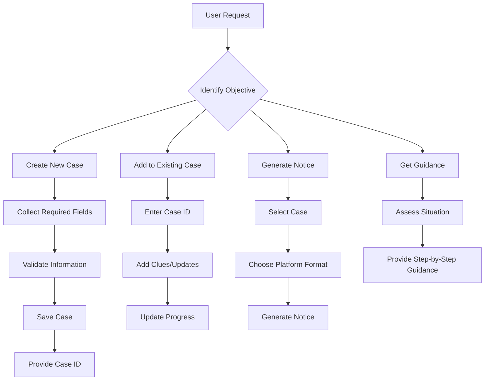

# Field Definitions and Workflow Guidelines

## Field Definitions

### Required Fields

#### name
- **Description**: Full name of the missing person
- **Format**: String (preferably full legal name)
- **Example**: "Zhang Wei", "Li Xiaoming"
- **Notes**: Use the name as it appears on official documents when possible

#### age
- **Description**: Age at time of disappearance
- **Format**: Integer (years)
- **Example**: 25, 67, 14
- **Notes**: For children under 1 year, use months (e.g., "8 months")

#### gender
- **Description**: Gender of missing person
- **Format**: String ("male", "female", "other", "prefer not to say")
- **Example**: "male", "female"
- **Notes**: Respect individual gender identity when known

#### lastSeenDate
- **Description**: Date when person was last seen
- **Format**: YYYY-MM-DD
- **Example**: "2026-03-15"
- **Notes**: Use the most specific date known

#### lastSeenLocation
- **Description**: Location where person was last seen
- **Format**: String (address, landmark, or general area)
- **Example**: "123 Main Street, Beijing", "Central Park, Shanghai"
- **Notes**: Be as specific as possible while respecting privacy

### Optional Fields

#### phone
- **Description**: Contact phone number
- **Format**: String with country code
- **Example**: "+86 13800138000"
- **Privacy Note**: Use with caution in public notices

#### birthDate
- **Description**: Date of birth
- **Format**: YYYY-MM-DD
- **Example**: "2001-05-20"
- **Notes**: Useful for age verification

#### idNumber
- **Description**: Identification number
- **Format**: String (national ID format)
- **Privacy Warning**: Never include in public notices

#### height
- **Description**: Height in centimeters
- **Format**: Integer
- **Example**: 175, 162
- **Notes**: Approximate height is acceptable

#### clothing
- **Description**: Clothing at time of disappearance
- **Format**: String (detailed description)
- **Example**: "Blue jeans, white t-shirt with red logo, black sneakers"
- **Notes**: Include colors, brands, and distinctive features

#### distinguishingFeatures
- **Description**: Distinctive physical characteristics
- **Format**: String or array
- **Example**: "Scar on left cheek, tattoo of dragon on right arm"
- **Notes**: Include scars, tattoos, birthmarks, disabilities

#### circumstances
- **Description**: Circumstances of disappearance
- **Format**: String (detailed narrative)
- **Example**: "Left home for work at 8 AM, didn't return, phone goes straight to voicemail"
- **Notes**: Include any known conflicts, mental state, planned activities

#### possibleDestinations
- **Description**: Possible locations person might go
- **Format**: Array of strings
- **Example**: ["Parents' home in Shanghai", "Friend's apartment in Beijing", "Favorite park"]
- **Notes**: Include regular haunts, friends, family locations

#### familyContacts
- **Description**: Family contact information
- **Format**: Array of objects with name, relationship, phone
- **Example**: [{"name": "Li Fang", "relationship": "Mother", "phone": "+86 13900139000"}]
- **Privacy Note**: For internal use only, not for public distribution

## Workflow Guidelines

### 1. Initial Case Creation Workflow

### 2. Risk Assessment Matrix

| Risk Level | Indicators | Immediate Actions |
|------------|------------|-------------------|
| **High Risk** | • Minor under 14 • Elderly with dementia • Mental health crisis • Self-harm threats • Missing > 48 hours | 1. Contact police immediately 2. Do not wait 3. Provide all information to authorities 4. Follow official guidance |
| **Medium Risk** | • Adult missing 24-48 hours • Known conflicts • Unusual behavior before disappearance • No contact with close family | 1. Contact police 2. Gather detailed information 3. Alert close contacts 4. Begin local search |
| **Low Risk** | • Adult missing < 24 hours • Regular communication patterns • Known whereabouts possibilities • No immediate danger signs | 1. Contact friends/family 2. Check regular locations 3. Wait reasonable time 4. Document information |

### 3. Notice Generation Guidelines

#### General Notice (All Platforms)
- Include: Name, age, photo (if available), last seen details
- Exclude: Home address, ID numbers, sensitive family information
- Tone: Factual, urgent but not alarmist

#### Social Media Specifics:
- **WeChat**: Concise, include contact method, use appropriate hashtags
- **Weibo**: Include relevant topics, use clear images, provide updates
- **Douyin**: Short video format preferred, clear visuals, contact info

#### Official Channels:
- Follow police template requirements
- Include case number when available
- Use formal language

### 4. Information Verification Checklist

Before generating any public notice, verify:
- [ ] All facts are confirmed by at least one reliable source
- [ ] No sensitive personal information is included
- [ ] Contact information is valid and monitored
- [ ] Photo permissions are obtained
- [ ] Family/authorities are informed

### 5. Progressive Disclosure Protocol

**Phase 1 (Initial)**: Basic information to close network
**Phase 2 (24 hours)**: Expanded details to local community
**Phase 3 (48+ hours)**: Full public notice with authorities' guidance
**Phase 4 (Resolution)**: Update notices, respect privacy in resolution

## Data Management Best Practices

### Storage Security
- Local JSON files with basic access controls
- Regular backups of case data
- Secure handling of sensitive information

### Privacy Protection
- Default to minimal information disclosure
- Obtain consent for photo sharing
- Respect family wishes regarding publicity

### Information Accuracy
- Timestamp all entries
- Source all information
- Regular verification of contact details

## Emergency Protocols

### Immediate Actions Checklist:
1. ✅ Contact local police (dial 110 in China)
2. ✅ Provide all available information
3. ✅ Designate a family spokesperson
4. ✅ Secure personal belongings for evidence
5. ✅ Document all communications

### What NOT to Do:
- ❌ Share unverified information
- ❌ Offer rewards without police guidance
- ❌ Engage with suspicious informants
- ❌ Share sensitive personal details publicly
- ❌ Make assumptions about circumstances

This document should be reviewed and updated regularly based on user feedback and legal requirements.