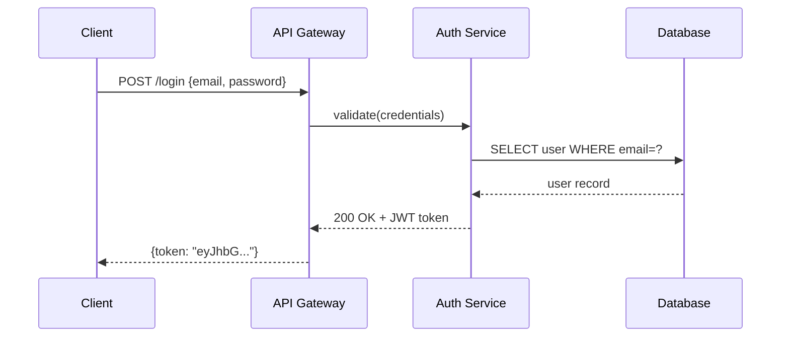
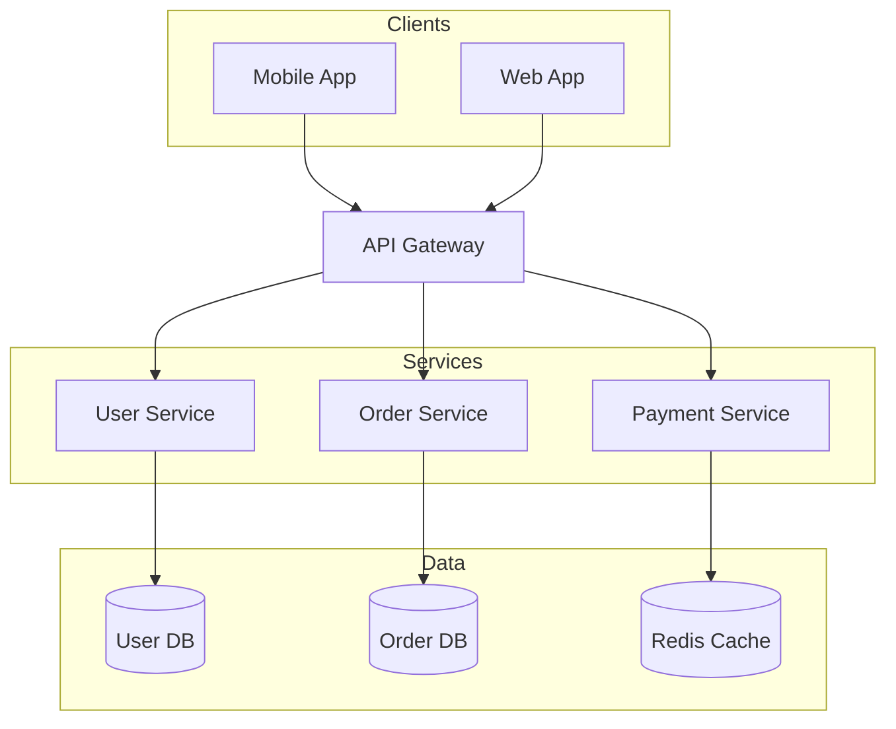
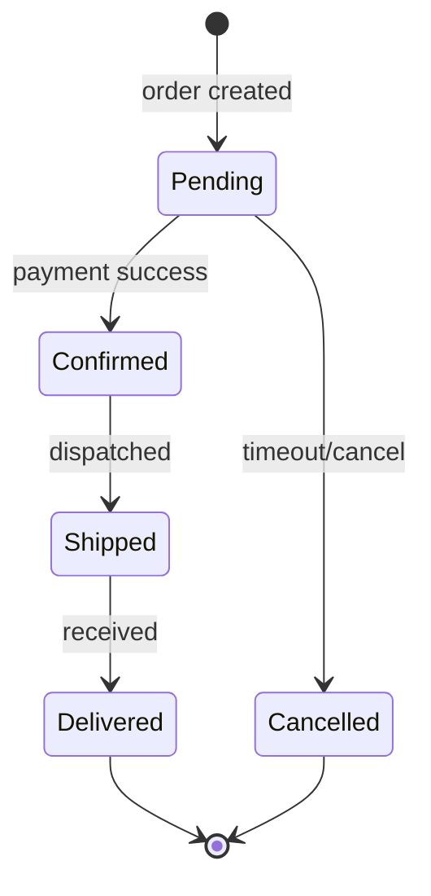

# Mermaid Maker

Turn intent into `.mmd` text, then render it as **themed SVG**, **ASCII**, **PNG**, or **PDF**.

**Key advantage:** text-based syntax with **fully automatic layout** — no x/y coordinates. Source lives in git and embeds in Markdown.

## When to use / when NOT to use

**Use this skill for:** diagrams-as-code with automatic layout (flowchart, sequence, class, state, ER, gantt, mindmap, C4, …) — and for producing polished, themed, or terminal-friendly output from that source.

**Do NOT use it — route elsewhere — for:**
- Pixel-precise placement, custom layout, branded icons, heavy styling → **drawio**.
- A hand-drawn / sketchy aesthetic → **excalidraw** or **tldraw**.
- A freeform whiteboard or freehand strokes → **tldraw**.
- Strict, conventional UML notation → **plantuml**.

## Workflow

1. **Pick diagram type** — from the table below.
2. **Generate** — write the `.mmd` to disk (start from `assets/templates/` if helpful).
3. **Validate** — REQUIRED before export: trial-render with your chosen backend (see **Validation**).
4. **Choose a backend & render/export** — themed SVG / ASCII / batch → beautiful-mermaid; PNG / PDF → mmdc; no install → Kroki (see **Rendering**).
5. **Self-check (vision)** — read the rendered image and fix readability defects automatic layout can't prevent; re-validate + re-export. Max 2 rounds; skip if no vision.
6. **Review loop** — show the image, apply the minimal `.mmd` edit per request, re-export until approved (5-round safety valve).
7. **Report** — tell the user the output file paths.

## Diagram Types

| Type | Keyword | Use for | Syntax |
|------|---------|---------|--------|
| Flowchart | `flowchart TD/LR` | processes, pipelines, decisions | [FLOWCHART.md](reference/FLOWCHART.md) |
| Sequence | `sequenceDiagram` | API calls, message passing | [SEQUENCE.md](reference/SEQUENCE.md) |
| Class | `classDiagram` | OOP models, data structures | [CLASS-ER.md](reference/CLASS-ER.md) |
| ER | `erDiagram` | database schemas | [CLASS-ER.md](reference/CLASS-ER.md) |
| State | `stateDiagram-v2` | state machines, lifecycle | [OTHER-TYPES.md](reference/OTHER-TYPES.md) |
| Gantt | `gantt` | project timelines | [OTHER-TYPES.md](reference/OTHER-TYPES.md) |
| Git Graph | `gitGraph` | branch strategies | [OTHER-TYPES.md](reference/OTHER-TYPES.md) |
| Pie | `pie` | proportions | [OTHER-TYPES.md](reference/OTHER-TYPES.md) |
| Mind Map | `mindmap` | topic breakdowns | [OTHER-TYPES.md](reference/OTHER-TYPES.md) |
| C4 Context | `C4Context` | high-level architecture | [OTHER-TYPES.md](reference/OTHER-TYPES.md) |
| User Journey | `journey` | UX flows | [OTHER-TYPES.md](reference/OTHER-TYPES.md) |

Reusable starters live in `assets/templates/` (flowchart, sequence, state, class, er, gantt, gitgraph).

## Rendering

Pick the backend by what you need to ship. Full flags, install, and troubleshooting are in [RENDERING.md](reference/RENDERING.md).

| Need | Backend | One-line command |
|------|---------|------------------|
| Themed SVG, ASCII, or batch | **beautiful-mermaid** | `node scripts/render.mjs -i d.mmd -o d.svg --theme tokyo-night` |
| PNG or PDF, offline | **mmdc** | `mmdc -i d.mmd -o d.png -w 2048 --backgroundColor white` |
| No install (just curl) | **Kroki** | `curl -X POST -H "Content-Type: text/plain" --data-binary @d.mmd https://kroki.io/mermaid/svg -o d.svg` |

- **ASCII** (terminal / README): `node scripts/render.mjs -i d.mmd -f ascii --use-ascii`
- **Batch** a folder: `node scripts/batch.mjs -i ./diagrams -o ./out --theme dracula -w 4`
- beautiful-mermaid emits **SVG/ASCII only**; for PNG/PDF use mmdc. Its dependency auto-installs on first run.

## Theming

beautiful-mermaid ships 15 themes. Quick picks:
- Dark docs → `tokyo-night` ⭐ · `github-dark` · `dracula`
- Light docs → `github-light` · `zinc-light` · `catppuccin-latte`

List all: `node scripts/themes.mjs`. Full catalog, custom palettes, and a decision tree: [THEMES.md](reference/THEMES.md).
mmdc uses its own standard themes (`default`/`dark`/`neutral`/`forest`) via `--theme`.

## Validation (Required)

**Never export without validating first.** Trial-render with the backend you'll use:
```bash
node scripts/render.mjs -i diagram.mmd -o /tmp/test.svg          # beautiful-mermaid
mmdc -i diagram.mmd -o /tmp/test.png 2>&1                        # mmdc
curl -s -X POST -H "Content-Type: text/plain" --data-binary @diagram.mmd https://kroki.io/mermaid/svg -o /tmp/test.svg && echo Valid || echo Invalid
```
A `Could not find Chrome` error from `mmdc` is a **setup** problem, not a syntax error — don't rewrite valid `.mmd`; fix the browser or validate via another backend.

## Self-Check (vision)

Validation proves syntax is legal — not that the render is *readable*. After exporting, read the image and catch what auto-layout can't prevent (these are about content, not overlaps):

| Check | Look for | Fix |
|---|---|---|
| Label truncation | Node/edge text clipped | Shorten, or wrap with `<br/>` |
| Cramped density | Too many nodes, tangled lines | Flip `TD`↔`LR`, split into `subgraph`s, reduce nodes |
| Wrong orientation | Far too wide or too tall | Change `flowchart TD`↔`LR` (or `direction` in class/state) |
| Edge spaghetti | Many crossing edges | Reorder declarations so connected nodes are adjacent; group with `subgraph` |
| Wrong type | Type doesn't suit content | Switch (`gantt`, `sequenceDiagram`, `stateDiagram-v2`, …) |
| Low contrast | Text blends into fill | Adjust theme / `classDef`, or pick a higher-contrast theme |

Max **2 rounds**; re-validate and re-export after every fix. If vision is unavailable, skip and show the image directly.

## Review Loop

Show the image, collect feedback, apply the **minimal `.mmd` edit**, then re-validate + re-export:

| User request | Edit action |
|---|---|
| Change a label | Edit the node/edge text |
| Add/remove a node or edge | Add/delete the matching line |
| Change a color | Switch `--theme`, or add `classDef` + `class <node> <className>` |
| Change layout direction | Swap `TD`↔`LR`, or set `direction` (class/state) |
| Restructure / group | Wrap related nodes in a `subgraph`, or regenerate |

Overwrite the same `diagram.mmd` / output each round — don't create `v1`, `v2`, …. After 5 rounds, suggest fine-tuning at [mermaid.live](https://mermaid.live).

## Examples

### Example 1 — API authentication (sequence)

Render: `node scripts/render.mjs -i auth-flow.mmd -o auth-flow.svg --theme tokyo-night`

### Example 2 — Microservices architecture (flowchart)

Export PNG: `mmdc -i ecommerce-arch.mmd -o ecommerce-arch.png -w 2048 --backgroundColor white`

### Example 3 — Order lifecycle (state)

ASCII for a README: `node scripts/render.mjs -i order-states.mmd -f ascii --use-ascii`

## Common Mistakes

| Mistake | Fix |
|---------|-----|
| `mmdc` error `Could not find Chrome` | `npx puppeteer browsers install chrome-headless-shell` (or use Kroki) |
| `Cannot find module 'beautiful-mermaid'` | Auto-installs on first run; else `npm install` in the skill root |
| Kroki PDF fails HTTP 400 | Kroki does PNG/SVG only for Mermaid; use mmdc for PDF |
| Wrong arrow in sequence | `->>` request, `-->>` response |
| Special chars in label | Quote it: `A["Label: value"]` |
| Blank / tiny PNG | Add `-w 2048` (mmdc) |
| Participant order wrong | Declare `participant` explicitly at top |
| Subgraph name with spaces | Quote it: `subgraph "My Layer"` |

Full backend flags and troubleshooting: [RENDERING.md](reference/RENDERING.md).
