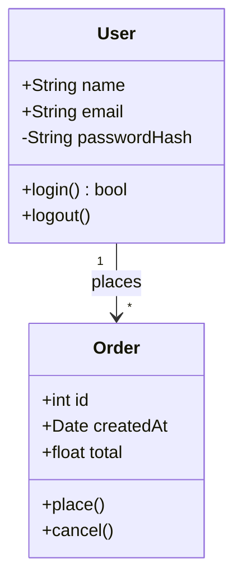
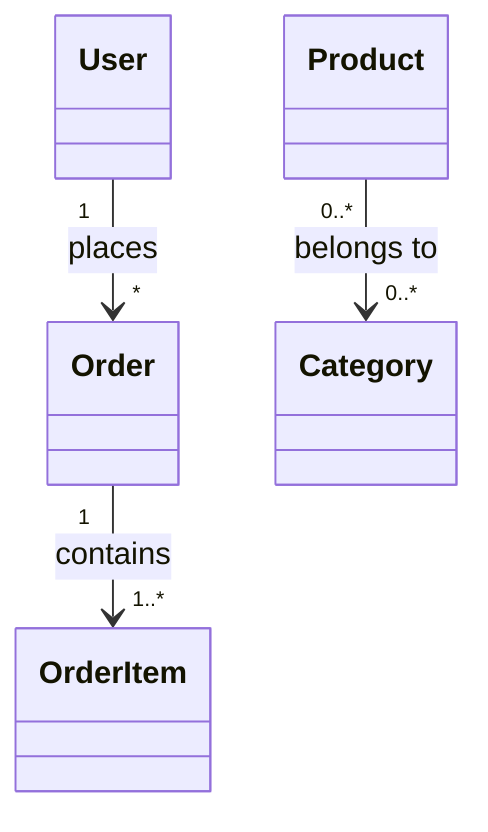
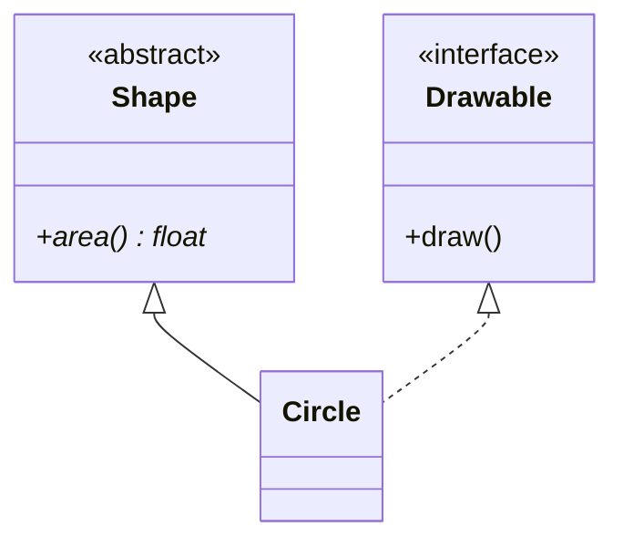
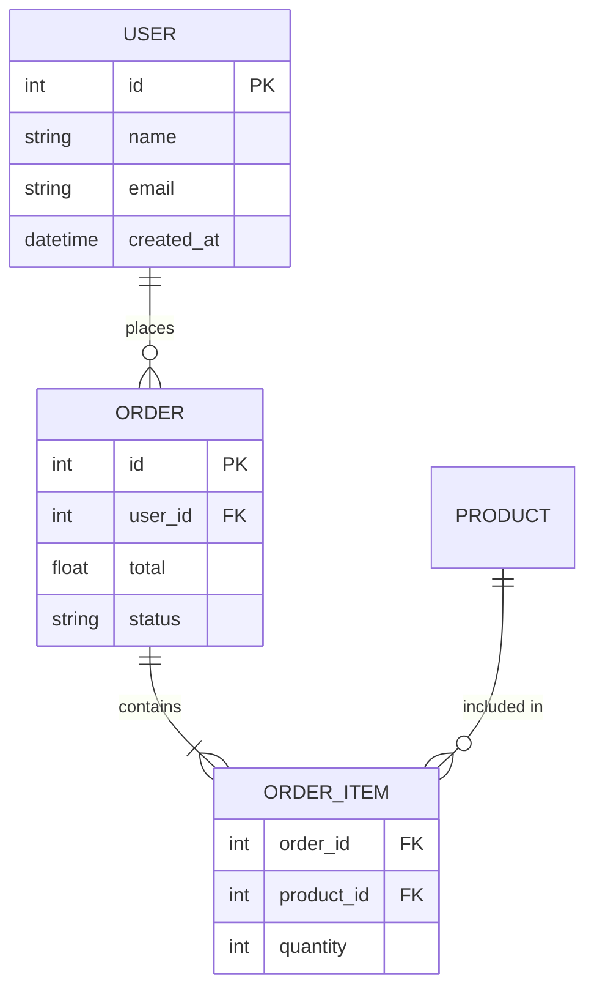
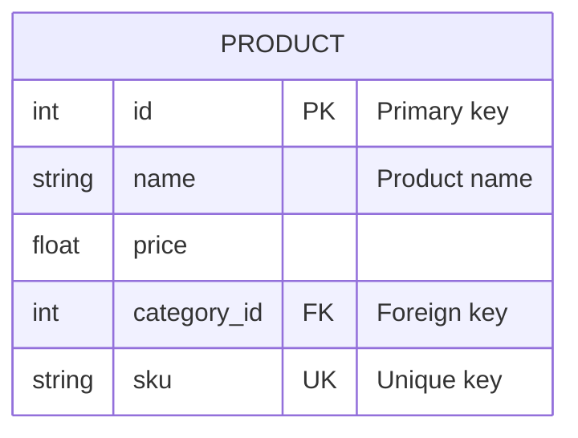

# Class & ER Diagram Syntax

## Class Diagram

### Basic Structure

### Visibility Modifiers

| Symbol | Meaning |
|--------|---------|
| `+` | Public |
| `-` | Private |
| `#` | Protected |
| `~` | Package/Internal |

### Relationships

| Syntax | Type | Meaning |
|--------|------|---------|
| `<\|--` | Inheritance | extends |
| `*--` | Composition | owns (lifecycle) |
| `o--` | Aggregation | has (independent) |
| `-->` | Association | uses |
| `..>` | Dependency | depends on |
| `..\|>` | Realization | implements |

### Cardinality

| Notation | Meaning |
|----------|---------|
| `1` | Exactly one |
| `0..1` | Zero or one |
| `*` | Many |
| `1..*` | One or more |
| `n..m` | Range |

### Abstract Classes & Interfaces

- `<<abstract>>` / `<<interface>>` — stereotype annotation on its own line inside the class.
- A trailing `*` on a method marks it abstract: `+area()* float`.

### Class Best Practices

- Show only the attributes / methods relevant to the diagram's point.
- Use inheritance sparingly; prefer composition for reuse.
- Indicate cardinality on associations; group related classes together.

---

## ER Diagram

### Basic Structure

### Relationship Notation

| Left | Right | Meaning |
|------|-------|---------|
| `\|\|` | `\|\|` | One to one |
| `\|\|` | `o{` | One to zero or many |
| `\|\|` | `\|{` | One to one or many |
| `o\|` | `o{` | Zero or one to zero or many |
| `}o` | `o{` | Zero or many to zero or many |
| `}\|` | `\|{` | One or many to one or many |

The relation reads `LEFT REL--REL RIGHT`, e.g. `CUSTOMER ||--o{ ORDER`.

### Attribute Types

Markers: `PK` (primary), `FK` (foreign), `UK` (unique). Use standard SQL-ish types (`int`, `string`, `decimal`, `date`, `bool`).

### ER Best Practices

- UPPERCASE entity names, snake_case attribute names.
- Always mark `PK` and `FK`; show only essential attributes.
- Keep relationship labels short; limit to ~6–8 entities per diagram.
