# Other Diagram Types

State, git graph, gantt, pie, mind map, C4 context, and user journey.

## State Diagram

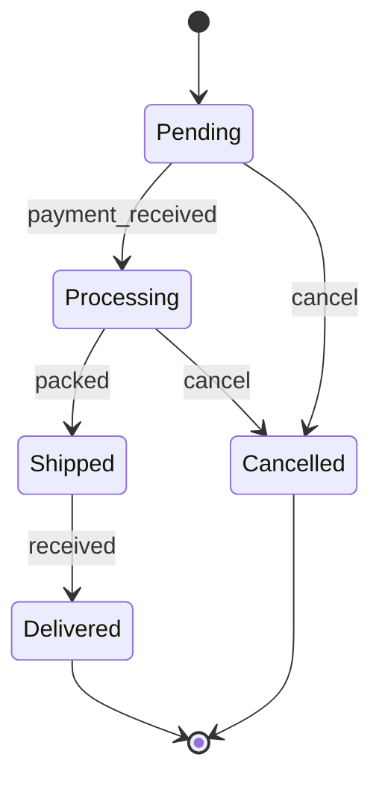

### Composite States

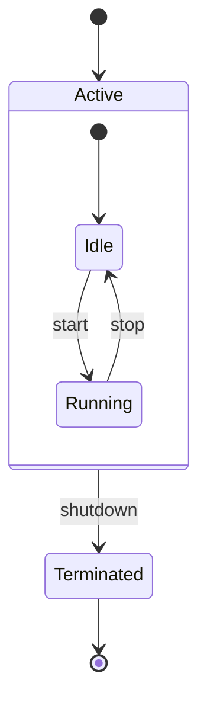

### Choice (Branching)

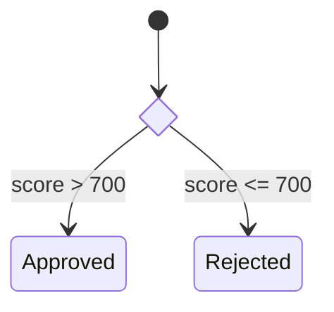

### Concurrency

Use `--` to split a composite state into concurrent regions:
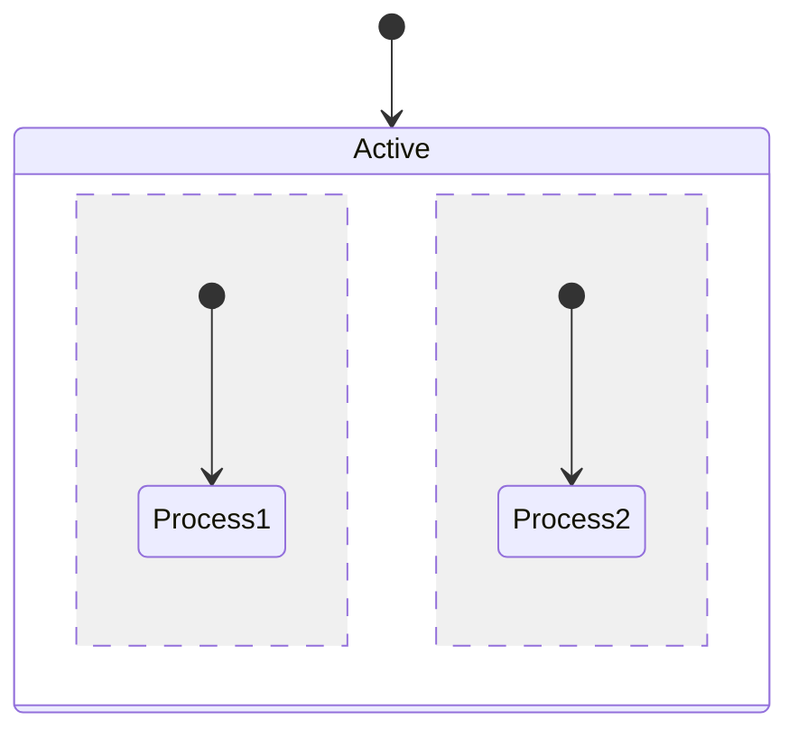

### Notes

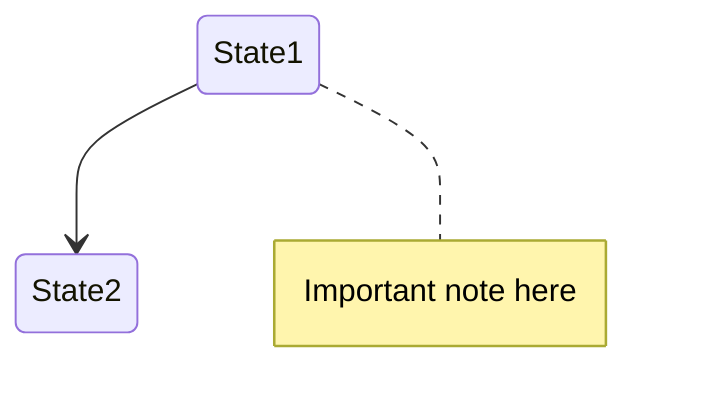

Best practices: start from `[*]`, use clear transition labels, limit composite depth to ~2 levels.

---

## Git Graph

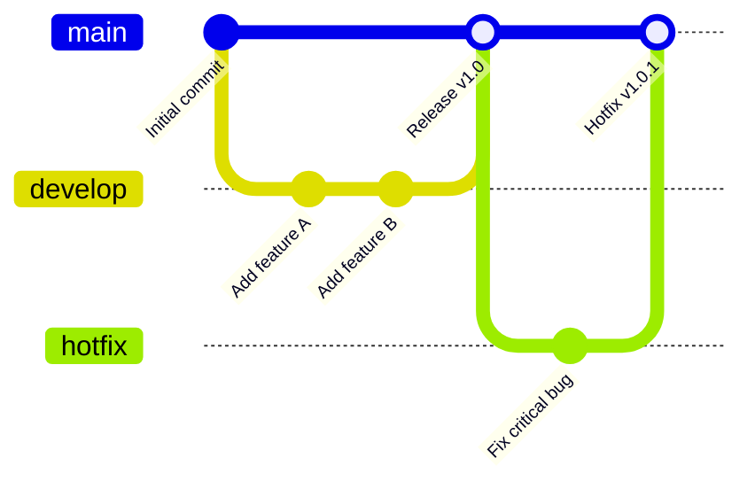

Tag a commit or merge with `tag: "v1.0"`.

---

## Gantt Chart

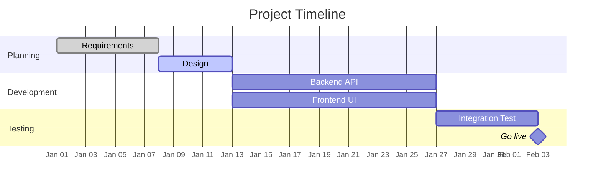

Task states: `done`, `active`, `crit`, or omit for upcoming. `milestone` marks a zero-duration point.

---

## Pie Chart

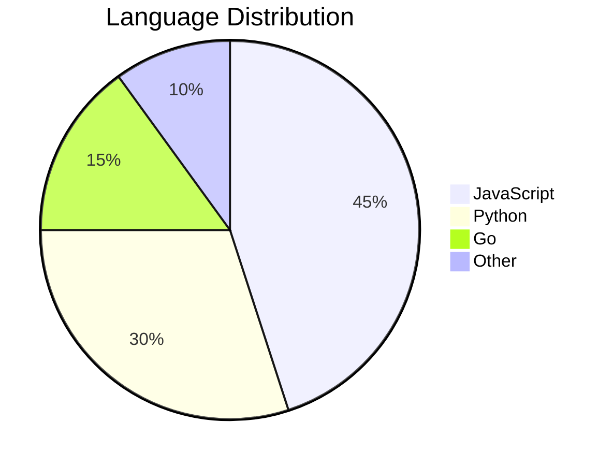

---

## Mind Map

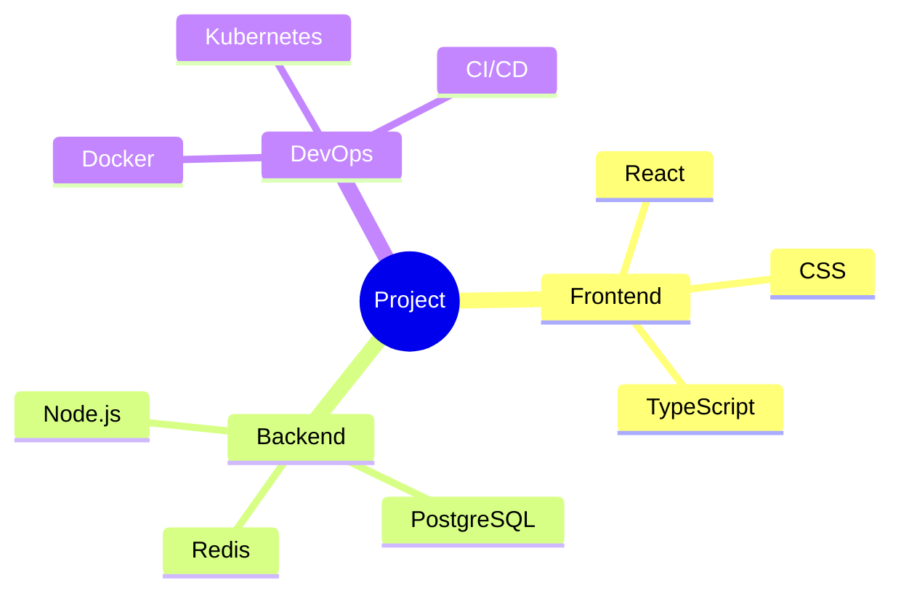

---

## C4 Context Diagram

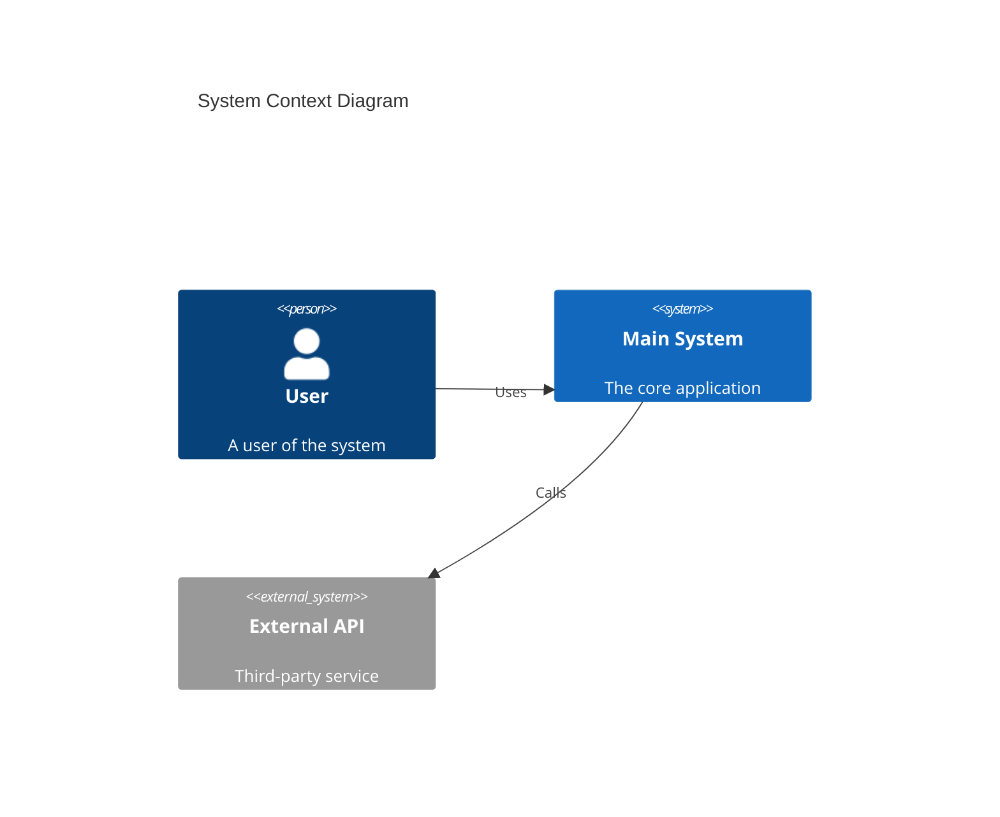

---

## User Journey

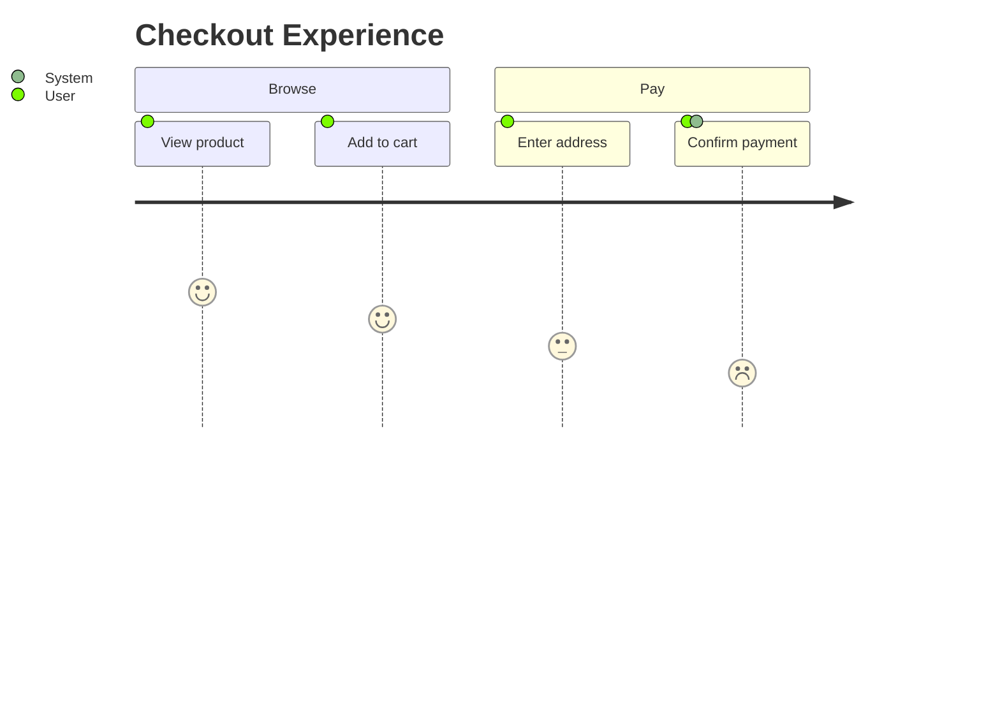

Each step scores satisfaction 1–5, followed by the actors involved.
