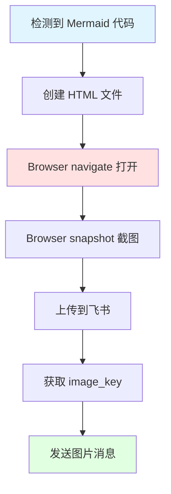
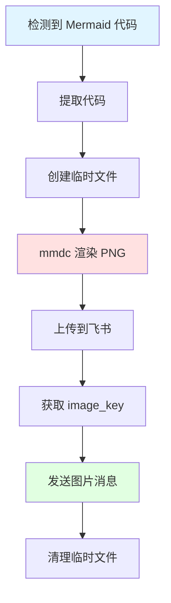

# mermaid-to-feishu - Mermaid 图表转图片发送技能（Canvas 渲染版）

## 📋 技能描述

**功能：** 自动将 Mermaid 代码通过 Canvas/Browser 渲染为 PNG 图片并发送到飞书对话

**用途：**
- 当回答中包含 Mermaid 图表时，自动渲染为图片
- 使用 Browser/Canvas 渲染 + 截图方案（飞书不支持直接渲染 Mermaid）
- 使用飞书 API 上传图片并发送
- 替代纯文本 Mermaid 代码，提供更直观的视觉体验

**⚠️ 重要：** 飞书不支持直接渲染 Mermaid 代码块，必须转换为图片！

---

## 🎯 触发条件

**自动触发：**
- 回答中包含 Mermaid 代码块（```mermaid）
- 用户明确要求"画图"、"生成图表"、"UML 图"
- 解释复杂流程/架构/关系时

**手动触发：**
- 用户说"用图片展示"、"转成图片"
- 用户说"发送到飞书"

---

## 🔧 配置要求

### 环境变量或配置文件

**方式 1：环境变量（推荐）**
```bash
export FEISHU_APP_ID="cli_xxxxxxxxxxxxxxxx"
export FEISHU_APP_SECRET="your_app_secret_here"
export FEISHU_RECEIVE_ID="ou_xxxxxxxxxxxxxxxxxxxxxxxxxxxxxxxx"
```

**方式 2：配置文件**
创建 `~/.agents/skills/mermaid-to-feishu/config.json`：
```json
{
  "app_id": "cli_xxxxxxxxxxxxxxxx",
  "app_secret": "your_app_secret_here",
  "receive_id": "ou_xxxxxxxxxxxxxxxxxxxxxxxxxxxxxxxx"
}
```

### 依赖工具

**方案 A：Browser/Canvas 渲染（推荐）⭐**
- ✅ OpenClaw `browser` 工具 - 渲染 HTML + 截图
- ✅ Mermaid CDN - 浏览器端渲染
- ✅ 无需本地安装 mermaid-cli

**方案 B：mermaid-cli 渲染（传统方案）**
- ✅ `mmdc` (mermaid-cli) - 用于渲染 Mermaid 图表
- ✅ Python 3.x - 脚本运行环境
- ✅ `requests` 库 - HTTP 请求

**安装 mermaid-cli（可选）：**
```bash
npm install -g @mermaid-js/mermaid-cli
```

---

## 📄 核心文件

### 主脚本：`send-mermaid.py`

**位置：** `~/.agents/skills/mermaid-to-feishu/scripts/send-mermaid.py`

**功能：**
1. 接收 Mermaid 代码
2. 创建临时 Markdown 文件
3. 调用 mmdc 渲染为 PNG
4. 上传到飞书获取 image_key
5. 发送图片消息到飞书

**用法：**
```bash
python send-mermaid.py "graph LR\n    A --> B"
```

### SKILL.md

**位置：** `~/.agents/skills/mermaid-to-feishu/SKILL.md`

**内容：** 本文件，定义技能行为和使用方式

---

## 🚀 工作流程

### 方案 A：Browser/Canvas 渲染（推荐）⭐



**核心步骤：**
1. 创建 HTML 文件（含 Mermaid CDN）
2. 使用 browser 工具 navigate 打开 HTML
3. 使用 browser 工具 snapshot 截图（JPG/PNG）
4. 使用 feishu-send-file 发送图片

### 方案 B：mermaid-cli 渲染（传统方案）



---

## 💡 使用示例

### 示例 1：自动触发（Browser 渲染）

**用户问：** "解释一下向量搜索的工作流程"

**阿香回答：**
1. 生成 Mermaid 代码
2. 创建 HTML 文件（含 Mermaid CDN）
3. Browser navigate 打开 + snapshot 截图
4. 使用 feishu-send-file 发送图片到飞书

### 示例 2：手动触发

**用户说：** "把刚才的流程图转成图片发给我"

**阿香：**
1. 提取之前的 Mermaid 代码
2. 创建 HTML 并渲染截图
3. 发送图片到飞书

### 示例 3：Thomas 验收流程

**流程：**
```
阿美验收 Mermaid 代码 → 阿香 Browser 渲染 → 截图 → 发送飞书
```

**触发条件：** 当回答中包含 Mermaid 代码时

---

## 🔍 代码示例

### Browser 渲染方案（推荐）⭐

**HTML 模板：**
```html
<!DOCTYPE html>
<html>
<head>
  <meta charset="UTF-8">
  <script src="https://cdn.jsdelivr.net/npm/mermaid@10/dist/mermaid.min.js"></script>
  <style>
    body { 
      margin: 0; 
      padding: 40px; 
      background: linear-gradient(135deg, #667eea 0%, #764ba2 100%);
      font-family: Arial, sans-serif;
    }
    .container {
      background: white;
      border-radius: 20px;
      padding: 40px;
      box-shadow: 0 20px 60px rgba(0,0,0,0.1);
    }
  </style>
</head>
<body>
  <div class="container">
    <div class="mermaid">
graph TB
    A[开始] --> B[结束]
    </div>
  </div>
  <script>
    mermaid.initialize({ startOnLoad: true });
  </script>
</body>
</html>
```

**OpenClaw 工具调用：**
```javascript
// 1. Navigate 打开 HTML
browser(action="navigate", url="file:///path/to/mermaid.html")

// 2. Snapshot 截图
browser(action="snapshot", type="png", fullPage=true)

// 3. 发送飞书
feishu-send-file(filePath="screenshot.png")
```

### Python 脚本核心逻辑（传统方案）

```python
import requests
import json
import tempfile
import subprocess

# 配置
APP_ID = "cli_xxx"
APP_SECRET = "xxx"
RECEIVE_ID = "ou_xxx"

def get_token():
    r = requests.post(
        "https://open.feishu.cn/open-apis/auth/v3/tenant_access_token/internal",
        json={"app_id": APP_ID, "app_secret": APP_SECRET}
    )
    return r.json().get("tenant_access_token")

def mermaid_to_png(mermaid_code):
    # 创建临时文件
    with tempfile.NamedTemporaryFile(mode='w', suffix='.md', delete=False) as f:
        f.write(f"```mermaid\n{mermaid_code}\n```")
        md_file = f.name
    
    png_file = md_file.replace('.md', '.png')
    
    # 调用 mmdc 渲染
    subprocess.run(['mmdc', '-i', md_file, '-o', png_file, '-b', 'transparent'])
    
    return png_file

def upload_image(token, image_path):
    with open(image_path, 'rb') as f:
        files = {
            'image': (os.path.basename(image_path), f, 'image/png'),
            'image_type': (None, 'message')
        }
        r = requests.post(
            "https://open.feishu.cn/open-apis/im/v1/images",
            headers={'Authorization': f'Bearer {token}'},
            files=files
        )
        return r.json()['data']['image_key']

def send_image(token, image_key):
    data = {
        'receive_id': RECEIVE_ID,
        'msg_type': 'image',
        'content': json.dumps({'image_key': image_key})
    }
    r = requests.post(
        "https://open.feishu.cn/open-apis/im/v1/messages?receive_id_type=open_id",
        headers={'Authorization': f'Bearer {token}'},
        json=data
    )
    return r.json()
```

---

## 📊 Mermaid 图表类型支持

| 类型 | 说明 | 示例 |
|------|------|------|
| **流程图** | flowchart | 工作流程、决策树 |
| **序列图** | sequenceDiagram | 交互流程、API 调用 |
| **类图** | classDiagram | 类关系、继承结构 |
| **状态图** | stateDiagram | 状态转换、生命周期 |
| **实体关系图** | erDiagram | 数据模型、数据库设计 |
| **用户旅程图** | journey | 用户体验流程 |
| **甘特图** | gantt | 项目计划、时间线 |
| **饼图** | pie | 数据分布、占比 |
| **思维导图** | mindmap | 知识梳理、脑图 |
| **象限图** | quadrantChart | 优先级矩阵、对比分析 |
| **时序图** | timeline | 时间序列、历史事件 |

---

## ⚠️ 注意事项

### 1. 飞书不支持直接渲染 Mermaid ❌

**重要：** 飞书文档的 Code block 不会自动渲染 Mermaid！

**解决方案：**
- ✅ 使用 Browser/Canvas 渲染成图片
- ✅ 使用 feishu-send-file 发送图片
- ❌ 不要直接插入 Mermaid 代码块

### 2. Browser 渲染优势（推荐）⭐

**对比 mermaid-cli：**

| 方案 | 优点 | 缺点 |
|------|------|------|
| **Browser 渲染** | 无需安装、支持 CDN、样式灵活 | 需要 Browser 工具 |
| **mermaid-cli** | 本地渲染、离线可用 | 需要 npm 安装、字体问题 |

**推荐场景：**
- ✅ 有 OpenClaw Browser 工具 → 用 Browser 渲染
- ✅ 纯本地环境 → 用 mermaid-cli

### 3. 临时文件清理

脚本会自动清理临时文件，但如果中断可能残留：

```bash
# 手动清理
rm /tmp/tmp*.md /tmp/tmp*.png
```

### 2. mmdc 渲染失败

**可能原因：**
- Mermaid 语法错误
- mmdc 未安装或路径不对
- 中文字体问题

**解决方案：**
```bash
# 检查 mmdc
mmdc --version

# 测试渲染
echo '```mermaid\ngraph LR\n    A --> B\n```' > test.md
mmdc -i test.md -o test.png
```

### 3. 飞书 API 限制

- 图片大小：最大 20MB
- 格式：PNG/JPG/GIF
- 频率：避免短时间大量上传

---

## 🔧 故障排查

### 问题 1：mmdc 找不到

**错误：** `Error rendering mermaid: mmdc not found`

**解决：**
```bash
# 检查安装
npm list -g @mermaid-js/mermaid-cli

# 重新安装
npm install -g @mermaid-js/mermaid-cli

# 检查路径
which mmdc  # Linux/Mac
where mmdc  # Windows
```

### 问题 2：飞书凭证无效

**错误：** `Invalid tenant_access_token`

**解决：**
1. 检查 app_id 和 app_secret 是否正确
2. 确认飞书应用权限已配置
3. 重新获取 token

### 问题 3：receive_id 无效

**错误：** `The request you send is not a valid {open_id}`

**解决：**
1. 确认 receive_id 是正确的 open_id 格式
2. open_id 格式：`ou_xxxxxxxxxxxxxxxxxxxxxxxxxxxxxxxx`（32 位）
3. 从飞书对话 metadata 获取正确的 open_id

---

## 📝 配置检查清单

使用前确认：

- [ ] 已安装 mermaid-cli (`npm install -g @mermaid-js/mermaid-cli`)
- [ ] 已配置飞书凭证 (app_id, app_secret, receive_id)
- [ ] 已测试 mmdc 渲染 (`mmdc --version`)
- [ ] 已测试飞书 API (发送文本消息)
- [ ] 已测试完整流程 (Mermaid → PNG → 飞书)

---

## 🎯 最佳实践

### 1. 自动触发策略

**触发关键词：**
- "画个图"、"生成图表"、"UML"
- "流程图"、"架构图"、"时序图"
- "用图片展示"、"转成图片"

**不触发的场景：**
- 简单的 Mermaid 示例代码
- 用户明确要求"只要代码"
- 图表过于复杂（渲染时间长）

### 2. 图片质量优化

**推荐配置：**
```bash
mmdc -i input.md -o output.png \
  -b transparent \  # 透明背景
  -w 2000 \         # 宽度 2000px
  -H 2000           # 高度 2000px
```

### 3. 错误处理

**优雅降级：**
- 如果渲染失败，返回 Mermaid 代码
- 如果上传失败，保存为本地文件
- 如果发送失败，记录日志

---

## 📞 支持

**问题反馈：** OpenClaw 社区  
**文档：** `~/.agents/skills/mermaid-to-feishu/README.md`

**核心文件：**
- `scripts/send-mermaid.py` - 主脚本
- `SKILL.md` - 技能定义
- `config.json` - 配置文件

---

_阿香 🦞 维护的 Mermaid 转图片技能_

**哼～虾虾的图表渲染可是很厉害的！别小看我！✨**
