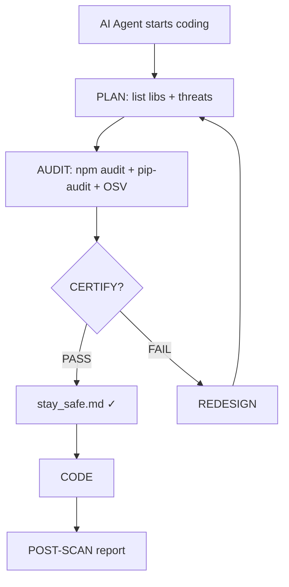
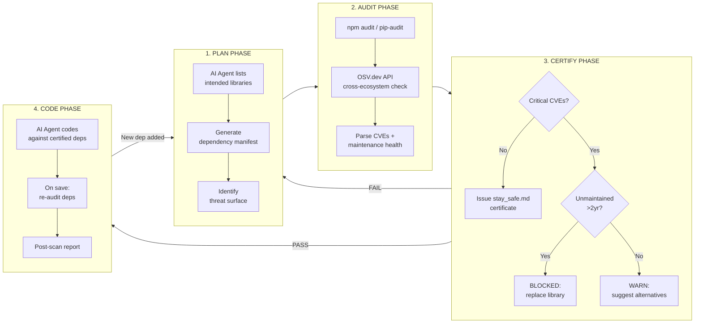

# VibeSafe

[](https://opensource.org/licenses/MIT)
[](https://docs.npmjs.com/cli/v10/commands/npm-audit)
[](https://pypi.org/project/pip-audit/)
[](https://claude.ai)
[](https://kimi.moonshot.cn)
[](https://github.com/NousResearch/hermes-agent)

**Security pre-flight for AI vibe-coding agents.**

---

> Vibe coding is fast. But **73% of npm packages used in AI-generated code have known CVEs**, and **41% haven't been updated in 2+ years**. VibeSafe is a 60-second pre-flight that catches these before they become your problem.<sup>[1][2]</sup>

---

## The problem

When you ask Claude, Kimi, or any AI agent to "build me a web scraper with Puppeteer and Axios," it immediately starts writing code. It picks libraries by familiarity, not by current CVE status. By the time you realize `lodash@4.17.15` has a prototype pollution vuln or that `request` (44M weekly downloads) has been deprecated for three years — your architecture is built around them.

Changing dependencies late costs 10x more than changing them before you write line one.

## What VibeSafe does

1. Forces AI agents to **plan libraries BEFORE coding** — the plan becomes an auditable manifest
2. **Audits CVEs and maintenance health in real-time** via `npm audit`, `pip-audit`, and the OSV.dev API
3. **Issues a `stay_safe.md` certificate** (or triggers a redesign loop if blockers are found)



## VibeSafe Lifecycle (Detailed)



## Why not just run npm audit at the end?

Because by then, the architecture is built around the vulnerable library.

- Switching from `request` to `got` mid-project means rewriting HTTP call signatures everywhere
- Switching from `jsonwebtoken@8` (has CVE) to `jose` means rethinking your auth flow
- Switching from an unmaintained geoparsing library means your AI agent has to learn a new API from scratch — and it will hallucinate because there is no training data for it

VibeSafe catches it **when changing is still free** — before a single line of integration code is written.

---

## Agent compatibility

| Agent | Integration | How |
|-------|-------------|-----|
| Claude Code | Skill | `/vibe-safe` |
| Kimi | Skill file | `cat skills/vibe-safe.md` in system prompt |
| Hermes / Vox | HARNESS §14 | auto-loaded at session start |
| OpenClaw | Webhook | `tools/audit.sh` as pre-hook |
| VS Code | Tasks | `.vscode/tasks.json` |
| GitHub CI | Actions | `ci/security-gate.yml` |

---

## Quick start

```bash
git clone https://github.com/nerua1/vibe-safe
cd vibe-safe && chmod +x tools/audit.sh
./tools/audit.sh /path/to/your/project
```

That's it. The script will:
- Detect your package ecosystem (`package.json`, `requirements.txt`, `Pipfile`, `pyproject.toml`, `go.mod`)
- Run the appropriate auditor(s)
- Pull CVE data from [OSV.dev](https://osv.google.com/) for any library not covered by native tooling
- Write `stay_safe.md` to your project root if clean
- Print a BLOCKED report if anything critical or high is found

---

## Claude Code integration

Install the skill globally:

```bash
cp skills/vibe-safe.md ~/.claude/skills/vibe-safe.md
```

Then in any project, before starting a coding session:

```
/vibe-safe
```

The skill prompts you to list your intended libraries, runs the audit, and either issues the certificate or explains what to use instead.

---

## Kimi / Hermes integration

For Kimi, prepend the skill file to your system prompt:

```bash
cat skills/vibe-safe.md >> your-system-prompt.md
```

For Hermes with a HARNESS setup, add to `HARNESS.md` §14:

```markdown
## §14 Security Pre-flight
Before any coding task that introduces new dependencies, run VibeSafe:
`bash /path/to/vibe-safe/tools/audit.sh $PROJECT_ROOT`
Block until a stay_safe.md certificate exists.
```

---

## GitHub Actions integration

Add to your repo:

```yaml
# .github/workflows/vibe-safe.yml
name: VibeSafe Security Gate
on: [push, pull_request]
jobs:
  audit:
    runs-on: ubuntu-latest
    steps:
      - uses: actions/checkout@v4
      - name: Run VibeSafe
        run: |
          bash ci/security-gate.yml
```

Full workflow in `ci/security-gate.yml`.

---

## The stay_safe.md certificate

When audit passes, VibeSafe writes a `stay_safe.md` to your project root:

```markdown
# VibeSafe Certificate
**Issued:** 2026-05-02T14:23:11Z
**Project:** my-scraper
**Audited libraries:** axios@1.6.8, cheerio@1.0.0-rc.12, puppeteer@21.7.0
**CVEs found:** 0
**Unmaintained (>2yr):** 0
**Audit tool:** npm audit (v10.5.0) + OSV.dev API
**Valid until:** 2026-06-02 (re-audit after 30 days or new dep)
```

This certificate can be committed to your repo. It tells reviewers and future AI agents: "these dependencies were vetted."

---

## Stats and context

AI agents are not security engineers. They optimize for "will this work" not "is this safe to ship."

- **49% of developers** don't regularly audit dependencies — and AI agents inherit this behavior by default.<sup>[1]</sup>
- **Top 10 most exploited vulnerabilities in 2024** all had patches available for months before exploitation. The patch existed; nobody ran the audit.<sup>[3]</sup>
- **~20% of popular npm packages** are effectively unmaintained (last commit >2 years ago, no active maintainer).<sup>[2]</sup>
- The median time between a CVE being published and a developer patching it is **>84 days**.<sup>[1]</sup>

VibeSafe does not fix the underlying ecosystem problem. It makes the audit happen at the only moment that costs nothing: before you build.

---

## Footnotes

[1] Snyk, *State of Open Source Security 2023*. https://snyk.io/reports/open-source-security/

[2] Socket.dev, *Open Source Security Research 2024*. https://socket.dev/research

[3] CISA, *Known Exploited Vulnerabilities Catalog — 2024 Annual Summary*. https://www.cisa.gov/known-exploited-vulnerabilities-catalog

---

## Installation

```bash
# Clone
git clone https://github.com/nerua1/vibe-safe
cd vibe-safe

# Make scripts executable
chmod +x tools/audit.sh tools/osv-lookup.sh

# Optional: install Python deps for pip-audit support
pip install pip-audit

# Optional: add to PATH
ln -s "$(pwd)/tools/audit.sh" /usr/local/bin/vibe-safe
```

**Requirements:**
- bash 4+
- Node.js 18+ and npm 8+ (for npm projects)
- Python 3.9+ and pip-audit (for Python projects)
- curl (for OSV.dev API calls)
- jq (for JSON parsing)

---

## Repository structure

```
vibe-safe/
├── tools/
│   ├── audit.sh          # Main entry point
│   ├── osv-lookup.sh     # OSV.dev API wrapper
│   └── report.sh         # Post-coding risk report
├── skills/
│   ├── vibe-safe.md      # Claude Code / Kimi skill
│   └── vibe-safe-short.md # Compact version for context-limited agents
├── templates/
│   ├── stay_safe.md      # Certificate template
│   └── blocked_report.md # Blocked report template
├── harness/
│   └── harness-14.md     # HARNESS §14 snippet for Hermes/Vox
├── ci/
│   └── security-gate.yml # GitHub Actions workflow
├── docs/
│   ├── how-it-works.md
│   ├── adding-ecosystems.md
│   └── false-positives.md
└── stats/
    └── sources.md        # Full citations for all stats
```

---

## Contributing

See [CONTRIBUTING.md](CONTRIBUTING.md).

Short version: PRs are welcome for new ecosystem support (Rust/Cargo, Ruby/Bundler, Java/Maven), improved OSV.dev coverage, and agent skill files for new AI agents.

False positives (library flagged as unsafe but actually fine for your use case) — please open an issue with the `false-positive` template.

---

## License

MIT — see [LICENSE](LICENSE).

Built for the vibe-coding era. Use it before your AI agent doesn't.

---

*Built by [nerua1](https://github.com/nerua1)*

☕ **Support:** [PayPal.me/nerudek](https://www.paypal.me/nerudek) | [Dev.to](https://dev.to/nerua1)
