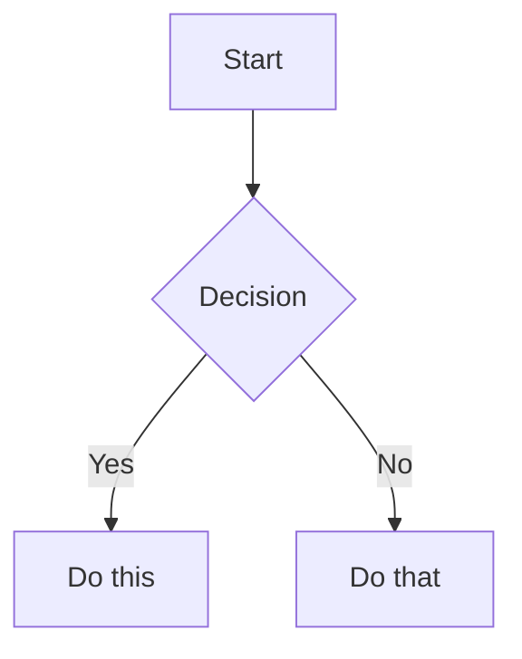

# Obsidian Flavored Markdown Reference

Obsidian extends CommonMark and GFM with wikilinks, embeds, callouts, properties, comments, and other syntax. Standard Markdown (headings, bold, italic, lists, quotes, code blocks, tables) is assumed knowledge.

Full docs: https://help.obsidian.md/obsidian-flavored-markdown

---

## Workflow: Creating an Obsidian Note

1. Add frontmatter with properties (title, tags, aliases) at the top.
2. Write content using standard Markdown, plus Obsidian-specific syntax below.
3. Link related notes using wikilinks (`[[Note]]`) for internal vault connections.
4. Embed content from other notes with `![[embed]]` syntax.
5. Add callouts for highlighted information using `> [!type]` syntax.

> Use `[[wikilinks]]` for notes within the vault; use `[text](url)` for external URLs only.

---

## Internal Links (Wikilinks)

```markdown
[[Note Name]]                          Link to note
[[Note Name|Display Text]]             Custom display text
[[Note Name#Heading]]                  Link to heading
[[Note Name#^block-id]]                Link to block
[[#Heading in same note]]              Same-note heading link
```

Define a block ID by appending `^block-id` to any paragraph.

---

## Embeds

Prefix any wikilink with `!` to embed content inline:

```markdown
![[Note Name]]                         Embed full note
![[Note Name#Heading]]                 Embed section
![[image.png]]                         Embed image
![[image.png|300]]                     Embed image with width
![[document.pdf#page=3]]               Embed PDF page
```

---

## Callouts

```markdown
> [!note]
> Basic callout.

> [!warning] Custom Title
> Callout with a custom title.

> [!faq]- Collapsed by default
> Foldable callout (- collapsed, + expanded).
```

Common types: `note`, `tip`, `warning`, `info`, `example`, `quote`, `bug`, `danger`, `success`, `failure`, `question`, `abstract`, `todo`.

---

## Properties (Frontmatter)

```yaml
---
title: My Note
date: 2024-01-15
tags:
  - project
  - active
aliases:
  - Alternative Name
---
```

Default properties: `tags` (searchable labels), `aliases` (alternative note names), `cssclasses` (CSS classes for styling).

---

## Tags

```markdown
#tag                    Inline tag
#nested/tag             Nested tag with hierarchy
```

Tags can also be defined in frontmatter under the `tags` property.

---

## Comments

```markdown
This is visible %%but this is hidden%% text.

%%
This entire block is hidden in reading view.
%%
```

---

## Obsidian-Specific Formatting

```markdown
==Highlighted text==
```

---

## Math (LaTeX)

```markdown
Inline: $e^{i\pi} + 1 = 0$

Block:
$$
\frac{a}{b} = c
$$
```

---

## Diagrams (Mermaid)

````markdown

````

---

## Footnotes

```markdown
Text with a footnote[^1].

[^1]: Footnote content.
```
