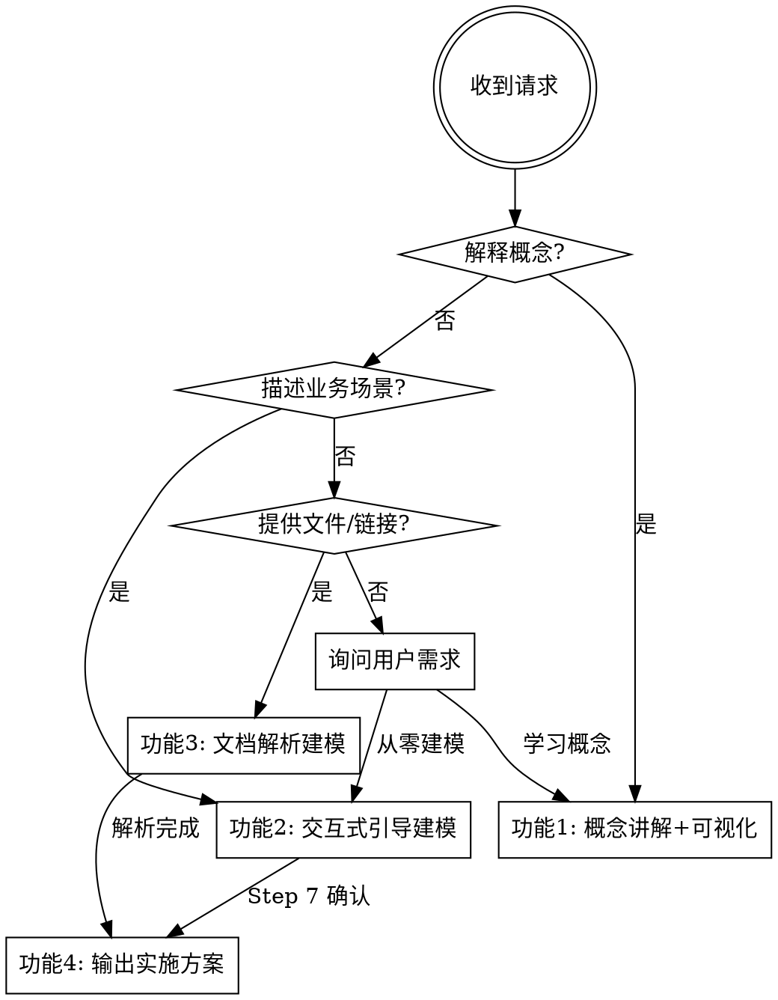

# Palantir Ontology 建模

## 核心心智模型

Ontology 是真实世界的数字孪生——把现实业务编码成机器可理解、AI 可操作的知识图谱。

| 一等公民 | 类比 | 核心作用 | 详细设计原则 |
|---------|------|---------|------------|
| Object Type | 细胞 | 把数据库的表变成"会说话"的业务对象 | `reference/object-type.md` |
| Link Type | 骨架 | 连接对象，赋予关系语义、安全和性能特征 | `reference/link-type.md` |
| Action Type | 肌肉 | 让知识图谱从"只读"变成"可写" | `reference/action-type.md` |
| Function | 大脑 | 原生计算层，将计算能力嵌入知识图谱本身 | `reference/function.md` |
| Interface | 神经系统 | 描述共同能力的身份卡，解决多态建模难题 | `reference/interface.md` |

五者协作关系：

```
Employee --[Link: participates_in]--> Project
    ↑                                     ↑
Action: assign_employee_to_project        |
Function: calculatePerformanceScore       |
Interface: Assignable <───────────────────┘
  （Project 和 Task 都实现，统一"可分配"行为）
```

## 功能路由



## 功能说明

### 功能1：概念讲解 + 可视化

用项目管理场景（Employee / Project / Task）贯穿五个一等公民，每个概念配具体示例：

- **Object Type**：Employee 表 → 4层结构（元数据层：api_name/Display Name/Description/Sink & Cube/Status；属性层：主键用 UUID、普通属性含 Type+Security Metric、派生属性；数据源层：主数据集 + 最多3个补充数据集；安全层：对象级→列级→行级）
- **Link Type**：employee_participates_in_project，M:N，关联表实现，携带 role 属性，8个配置项，3种数据实现方式
- **Action Type**：assign_employee_to_project，7阶段生命周期，7种副作用（Modify/Create/Delete Object、Create/Delete Link 同步事务；Trigger Webhook/Workflow 异步）
- **Function**：calculatePerformanceScore，4种类型（Object Function / Object Set Function / Action Validation Function / Query Function），高频计算配置 TTL 缓存（1-5分钟到永久），Object Function 必须是纯函数
- **Interface**：Assignable，4个部分（元数据、Shared Properties、Shared Links、Implementations），Project 和 Task 都实现，统一"可分配"行为

可视化时：基于 `reference/visualization-template.html` 生成交互 HTML，保存到 `ontology/concept_visualization.html`，告知用户用浏览器打开。

### 功能2：交互式引导建模（0 → 1）

每次只问一个问题，给 A/B/C/D 选项，按 Step 1-8 推进：

```
Step 1 业务领域（供应链/项目管理/CRM/其他）
Step 2 识别实体 → Object Types（4层结构）
Step 3 识别关系 → Link Types（8个配置项 + 3种实现方式）
Step 4 识别操作 → Action Types（7阶段生命周期 + 7种副作用）
Step 5 识别计算 → Functions（4种类型 + 缓存策略）
Step 6 识别多态 → Interfaces（至少 2 个实现者才定义）
Step 7 确认设计 → 触发功能4输出
```

发现审批/追踪等跨类型需求时主动建议 Interface。

### 功能3：文档解析建模

| 输入类型 | 处理方式 |
|---------|---------|
| 飞书文档链接 | 调用 `lark-doc` skill 读取内容 |
| 飞书文件夹链接 | 调用 `lark-drive` skill 批量读取 |
| 本地 `.md` 文件路径 | 直接 Read 读取 |
| 本地文件夹路径 | Glob 扫描所有 `.md` 文件 |
| 本地 PDF 文件 | Read 工具读取（仅适用于文字型 PDF；图片型 PDF 无法提取文字，需改用 PNG 截图） |
| 本地 PNG/图片 | Read 工具读取（视觉识别）；图片超过 2000×2000px 时需先用 Python PIL 切片后再读取 |

提取规则：名词 → Object、动词短语 → Link、用户操作 → Action、计算/统计需求 → Function、多种对象共享行为 → Interface。

**解析前先存原始内容**：读取文档后立即将原始文本保存到 `ontology/{domain}_raw_source.md`，防止上下文压缩导致内容丢失，后续提取和确认步骤都从该文件读取。

向用户确认提取结果后，触发功能4输出。

### 功能4：输出实施方案

设计确认后，生成四类文件到 `ontology/` 目录：

| 文件 | 格式 | 用途 |
|------|------|------|
| `{domain}_ontology.json` | JSON | 机器可读，程序导入 Foundry |
| `{domain}_ontology.md` | Markdown | 人类可读，团队 review |
| `{domain}_ontology.ttl` | OWL/Turtle | 标准本体，可导入 Protégé |
| `{domain}_graph.html` | HTML | 交互可视化 |

**完整格式示例**（JSON / Markdown / OWL/Turtle / HTML GRAPH 数据）见 `reference/example-project-mgmt.md`。

**生成 HTML 可视化**：复制 `reference/visualization-template.html`，将文件顶部的 `GRAPH` 对象替换为当前领域的节点和边数据，保存为 `{domain}_graph.html`。

**引导进入开发：** 输出完成后，告知用户下一步：
1. 在 Foundry Ontology Manager 中按 JSON 文件逐一创建 Object Type
2. 配置 Link Type 数据来源（外键映射 / 关联表）
3. 在 Code Repository 中实现 Function（TypeScript）
4. 在 Action Editor 中配置 Action 副作用和 Validation Function

## 建模五步法

```
Step 1 名词 → Object Type 候选
Step 2 动词短语 → Link Type 候选（先定语义，再定数据实现）
Step 3 用户操作 → Action Type 候选
Step 4 计算/统计需求 → Function 候选
Step 5 多种对象共享行为 → Interface 候选（至少2个实现者才定义）
```
