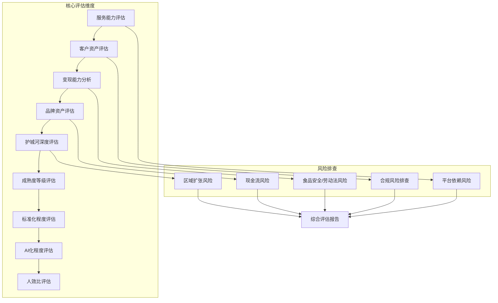
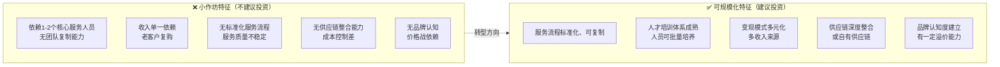

# 服务行业商业尽调技能

## 一、技能介绍

### 1.1 适用场景
本技能适用于服务行业（餐饮、电商、家政、教育培训等）企业投资、并购、孵化前的商业尽职调查，聚焦于评估服务能力、客户资产、变现能力及运营风险。

### 1.2 目标企业类型
- 餐饮服务企业（连锁餐饮、茶饮、轻食等）
- 电商服务商（代运营、MCN电商、直播带货等）
- 家政服务企业（保洁、保姆、月嫂、家电维修等）
- 教育培训企业（K12、职业教育、技能培训等）
- 其他服务行业（美容美发、健身、汽车服务等）

### 1.3 核心价值
- **评估服务能力**：服务质量、服务效率、服务创新的综合评估
- **量化客户资产**：客户规模、客户粘性、客户价值的精准测算
- **验证变现能力**：收入真实性、现金流、盈利可持续性
- **识别运营风险**：平台依赖、合规风险、人效比等关键风险点

---

## 二、尽调框架总览



---

## 三、核心评估模块

### 3.1 服务能力评估

**评估维度：**

| 维度 | 指标 | 数据来源 | 判断标准 |
|-----|------|---------|---------|
| 服务质量 | 客户满意度、投诉率、复购意愿 | 评价数据、内部质检 | 满意度>90%为优秀 |
| 服务效率 | 平均服务时长、响应时间、等待时间 | 运营数据 | 效率提升趋势 |
| 服务创新 | 新服务推出频率、创新项目数量 | 企业提供 | 创新投入占比 |
| 服务人员 | 持证率、培训时长、技能认证 | 培训记录 | 专业资质覆盖率 |

**具体操作：**
1. 调取近3-6个月客户评价数据，统计满意度趋势
2. 随机抽取服务记录，分析服务效率指标
3. 访谈一线服务人员，了解培训体系和服务标准
4. 对比行业标杆，评估服务创新能力

### 3.2 客户资产评估

**评估维度：**

| 维度 | 指标 | 数据来源 | 判断标准 |
|-----|------|---------|---------|
| 客户规模 | 注册客户数、活跃客户数、月活用户 | 会员系统、后台数据 | 多维度去重统计 |
| 客户粘性 | 复购率、活跃频次、留存率 | CRM系统 | 复购率>30%为优质 |
| 客户价值 | ARPU值、LTV值、客户获取成本 | 财务数据 | LTV/CAC>3为健康 |
| 客户结构 | 新老客户占比、高价值客户占比 | 客户分层数据 | 避免过度依赖新客 |

**关键指标计算：**

```
客户月活率 = 月活跃客户数 / 注册客户总数 × 100%
客户留存率 = 期末客户数 / 期初客户数 × 100%
客户复购率 = 重复购买客户数 / 总购买客户数 × 100%
LTV = ARPU × 平均生命周期（月） × 毛利率
```

### 3.3 变现能力分析

**变现模式分类：**

| 模式 | 特征 | 核查重点 |
|-----|------|---------|
| 直面客户收费 | 收入直接来自C端客户 | 定价策略、客户接受度 |
| 平台抽成 | 依赖第三方平台流量 | 平台分成比例、账期 |
| 预付费会员 | 提前收取服务费 | 消耗率、退款率 |
| 加盟费/授权费 | 扩张复制模式 | 加盟商存活率 |
| 供应链差价 | 向上下游延伸 | 供应链控制力 |
| 广告/流量变现 | 私域流量商业化 | 客户接受度 |

**关键指标：**

```
变现效率 = 月均收入 / 月均客户数 × 10000
客单价 = 总收入 / 成交订单数
综合毛利率 = （收入-成本）/ 收入 × 100%
现金流覆盖率 = 经营现金流 / 流动负债 × 100%
```

### 3.4 品牌资产评估

**评估框架：**

| 维度 | 指标 | 核查方式 |
|-----|------|---------|
| 品牌认知 | 品牌搜索指数、社交媒体声量 | 第三方数据平台 |
| 口碑评分 | 各平台评分均值、评价数量 | 大众点评/抖音/美团 |
| 差异化定位 | 差异化卖点、市场独特定位 | 访谈、竞品分析 |
| 品牌溢价 | 定价与行业均值对比 | 价格数据对比 |
| 品牌保护 | 商标注册、著作权登记 | 法律文件审查 |

### 3.5 护城河深度评估

**详见：`references/服务护城河分析框架.md`**

**四大护城河类型：**

| 护城河类型 | 评估要素 | 权重 | 判断标准 |
|-----------|---------|------|---------|
| **服务壁垒** | 服务标准、可复制性、专业资质 | 30% | SOP完善度>80%为强 |
| **规模壁垒** | 门店数量、地理覆盖、市场份额 | 25% | 区域领先为强 |
| **供应链壁垒** | 供应商整合、自有供应链、成本控制 | 25% | 自有供应链为强 |
| **人才壁垒** | 培训体系、人员稳定性、激励机制 | 20% | 核心人员流失率<15%为强 |

### 3.6 成熟度等级评估（SL0-9）

**详见：`references/服务成熟度对标体系.md`**

服务行业成熟度等级：

| 等级 | 阶段名称 | 特征描述 | 规模指标 |
|-----|---------|---------|---------|
| **SL0** | 概念期 | 仅有商业计划，未开始运营 | 无 |
| **SL1** | 单点验证期 | 1家门店/服务点验证服务模型 | 1家 |
| **SL2** | 多点复制期 | 2-5家门店/服务点初步复制 | 2-5家 |
| **SL3** | 区域扩张期 | 区域连锁，5-20家门店 | 5-20家 |
| **SL4** | 跨区发展期 | 跨区域布局，20-50家 | 20-50家 |
| **SL5** | 规模成熟期 | 50-200家，盈利稳定 | 50-200家 |
| **SL6** | 全国布局期 | 全国布局，200-500家 | 200-500家 |
| **SL7** | 生态整合期 | 供应链整合、自有品牌 | 500家+ |
| **SL8** | 平台化运营期 | 赋能加盟、开放平台模式 | 平台化 |
| **SL9** | 行业标准制定者 | 行业龙头、规则制定者 | 绝对领先 |

### 3.7 标准化程度评估

**详见：`references/标准化程度评估框架.md`**

**评估框架：**

| 维度 | 指标 | 判断标准 |
|-----|------|---------|
| 服务流程标准化 | SOP覆盖率、流程执行率 | SOP>90%为优秀 |
| 培训体系 | 培训时长、培训考核通过率 | 月均培训>8小时 |
| 质量控制 | 质检覆盖率、问题整改率 | 质检覆盖100% |
| 数字化程度 | 系统覆盖率、数据采集能力 | 核心流程数字化 |

### 3.8 AI化程度评估

**详见：`references/AI化程度评估框架.md`**

**评估维度：**

| AI应用场景 | 成熟度等级 | 典型应用 |
|-----------|-----------|---------|
| 智能客服 | L0-L4 | 问答机器人、工单分配 |
| 智能调度 | L0-L4 | 订单分配、路径规划 |
| 智能推荐 | L0-L4 | 个性化推荐、精准营销 |
| 智能质检 | L0-L4 | 服务过程监控、语音质检 |
| 智能运营 | L0-L4 | 数据分析、决策支持 |

### 3.9 人效比评估

**详见：`references/人效比评估框架.md`**

**核心指标：**

```
人均营收 = 总营收 / 平均员工人数
人均服务量 = 总服务单量 / 平均员工人数
人均客户数 = 活跃客户数 / 平均员工人数
人效增长率 = （本期人效 - 上期人效）/ 上期人效 × 100%
```

**行业对标：**

| 行业 | 人均营收基准 | 优秀值 |
|-----|-------------|-------|
| 餐饮（快餐） | 15-25万/年 | >30万/年 |
| 餐饮（正餐） | 20-35万/年 | >40万/年 |
| 家政服务 | 8-15万/年 | >20万/年 |
| 教育培训 | 20-40万/年 | >50万/年 |
| 美容美发 | 15-30万/年 | >40万/年 |

### 3.10 风险评估

**详见：`references/合规风险清单.md`**

**服务行业特有风险：**

| 风险类型 | 高发行业 | 风险等级 | 典型案例 |
|---------|---------|---------|---------|
| 食品安全风险 | 餐饮 | 🔴极高 | 食安事件导致品牌受损 |
| 劳动纠纷风险 | 家政/餐饮 | 🟠高 | 服务人员工伤/劳动仲裁 |
| 平台依赖风险 | 电商/外卖 | 🔴高 | 平台政策变化影响收入 |
| 区域扩张风险 | 连锁业态 | 🟠中高 | 跨区域管理失控 |
| 现金流风险 | 预付费模式 | 🔴高 | 资金链断裂跑路 |
| 合规经营风险 | 教育/医疗 | 🟠中高 | 资质不全被处罚 |

---

## 四、数据来源清单

| 数据类型 | 平台/工具 | 获取方式 |
|---------|----------|---------|
| 门店/服务点数据 | 企业提供、实地考察 | 企业授权 |
| 客户数据 | CRM系统、会员系统 | 企业授权 |
| 财务数据 | 财务报表、审计报告 | 企业授权 |
| 评价数据 | 大众点评、美团、抖音 | 公开采集 |
| 运营数据 | 企业内部系统 | 企业授权 |
| 行业数据 | 艾瑞、美团、中国连锁经营协会 | 公开报告 |
| 竞品数据 | 第三方数据平台 | 公开信息 |

---

## 五、执行流程

| 步骤 | 时间 | 内容 | 产出物 |
|-----|------|------|-------|
| Step 1 | 30分钟 | 公开数据采集 | 基础数据分析表 |
| Step 2 | 1小时 | 企业提供材料审核 | 材料完整性报告 |
| Step 3 | 1小时 | 客户数据与财务验证 | 收入真实性报告 |
| Step 4 | 30分钟 | 实地考察/门店走访 | 现场评估报告 |
| Step 5 | 30分钟 | 风险排查 | 风险清单 |
| Step 6 | 1小时 | 综合评估与报告撰写 | 商业尽调报告 |

---

## 六、标准输出模板（必须严格遵循）

### 6.1 商业尽调报告章节结构

**重要**：所有商业尽调报告必须严格遵循以下章节结构，不得擅自增减或调整章节顺序。

```markdown
# [企业名称] 服务行业商业尽调报告

## 一、Executive Summary（执行摘要）
### 1.1 案例定位
### 1.2 核心结论
### 1.3 关键数据速览

## 二、综合评分卡
### 2.1 十维度评分总览
### 2.2 评分等级判定
### 2.3 关键指标摘要

## 三、服务能力评估（权重10%）
### 3.1 服务质量分析
### 3.2 服务效率评估
### 3.3 服务创新能力
### 3.4 本维度评分

## 四、客户资产评估（权重10%）
### 4.1 客户规模数据
### 4.2 客户粘性分析
### 4.3 客户价值评估
### 4.4 本维度评分

## 五、变现能力分析（权重15%）
### 5.1 变现模式结构
### 5.2 核心变现数据
### 5.3 现金流分析
### 5.4 变现瓶颈分析
### 5.5 本维度评分

## 六、品牌资产评估（权重10%）
### 6.1 品牌认知分析
### 6.2 口碑评分评估
### 6.3 差异化定位分析
### 6.4 品牌保护情况
### 6.5 本维度评分

## 七、护城河深度评估（权重15%）
### 7.1 服务壁垒评估
### 7.2 规模壁垒评估
### 7.3 供应链壁垒评估
### 7.4 人才壁垒评估
### 7.5 综合护城河评分
### 7.6 小作坊vs可规模化判断

## 八、成熟度等级评估（权重10%）
### 8.1 SL0-9对照评估
### 8.2 成熟度矩阵分析
### 8.3 发展阶段判定
### 8.4 本维度评分

## 九、标准化程度评估（权重10%）
### 9.1 服务流程标准化
### 9.2 培训体系评估
### 9.3 质量控制体系
### 9.4 本维度评分

## 十、AI化程度评估（权重10%）
### 10.1 AI化评估矩阵
### 10.2 智能应用现状
### 10.3 AI化提升建议
### 10.4 本维度评分

## 十一、人效比评估（权重10%）
### 11.1 人效比核心指标
### 11.2 行业对标分析
### 11.3 人效比提升路径
### 11.4 本维度评分

## 十二、风险评估（贯穿各维度）
### 12.1 风险矩阵总览
### 12.2 核心风险分析
### 12.3 风险应对建议

## 十三、投资建议
### 13.1 综合评估结论
### 13.2 投资亮点
### 13.3 投资风险
### 13.4 投资建议
### 13.5 后续尽调建议

## 十四、附录
### 14.1 数据来源
### 14.2 免责声明

## 十五、下一步人工尽调清单
### 15.1 待核实数据项
### 15.2 待访谈问题清单
### 15.3 异常数据核查要点
```

### 6.2 关键指标一览表（必须包含）

| 指标类别 | 具体指标 | 数值 | 行业对比 | 评估结论 |
|---------|---------|------|---------|---------|
| 服务能力 | 客户满意度 | | vs 行业均值 | |
| 客户资产 | 活跃客户数 | | vs 行业均值 | |
| 变现能力 | 月均收入 | | vs 同规模企业 | |
| 品牌资产 | 口碑评分 | | vs 竞品均值 | |
| 护城河 | 综合评级 | | S/A/B/C/D | |
| 成熟度 | SL等级 | | SL1-SL9 | |
| 标准化 | SOP覆盖率 | | vs 行业均值 | |
| AI化 | AI应用数量 | | S/A/B/C/D | |
| 人效比 | 人均营收 | | vs 行业基准 | |

### 6.3 风险预警清单（必须包含）

| 风险类型 | 风险等级 | 具体描述 | 建议措施 |
|---------|---------|---------|---------|
| 食品安全 | | | |
| 平台依赖 | | | |
| 劳动纠纷 | | | |
| 现金流风险 | | | |
| 区域扩张 | | | |
| 合规经营 | | | |

### 6.4 禁止事项

- ❌ 禁止擅自增减章节
- ❌ 禁止调整章节顺序
- ❌ 禁止修改章节标题
- ❌ 禁止删除必含表格
- ❌ 禁止使用plaintxt/ASCII字符图表（如┌─┐├─┤等）
- ✅ 确有必要时可在第十五章后添加补充附录
- ✅ 必须使用Mermaid图表呈现框架、流程、对比等内容

### 6.5 数据缺失处理原则

实际尽调中，部分数据可能无法获取（如内部运营数据、详细财务数据等），处理方式如下：

- ✅ 数据缺失时标注"暂无信息"，不得虚构或估算
- ✅ 评分处理：缺失项按中间值打分（如10分制打5分，5分制打2.5分）
- ✅ 在评估结论中说明数据缺失对整体判断的影响
- ❌ 禁止因数据缺失而跳过整个评估模块
- ❌ 禁止编造数据填充空项

---

## 七、护城河逻辑分析

**详见：`references/服务护城河分析框架.md`**

### 7.1 护城河评估维度

服务行业的护城河决定了其是否只是"小作坊"，能否获得资本市场认可。

| 护城河类型 | 评估要素 | 权重 | 判断标准 |
|-----------|---------|------|---------|
| **服务壁垒** | 服务标准、SOP体系、专业资质 | 30% | SOP完善度>80%为强 |
| **规模壁垒** | 门店数量、地理覆盖、市场份额 | 25% | 区域领先为强 |
| **供应链壁垒** | 供应商整合、自有供应链、成本优势 | 25% | 自有供应链为强 |
| **人才壁垒** | 培训体系、人员稳定性、激励机制 | 20% | 核心人员流失率<15%为强 |

### 7.2 护城河深度评分

| 等级 | 得分 | 特征描述 | 资本认可度 |
|-----|------|---------|-----------|
| **S级** | 90-100 | 多维护城河叠加，可规模化复制 | 🔥高度认可 |
| **A级** | 80-89 | 核心护城河稳固，有扩展空间 | ✅认可 |
| **B级** | 70-79 | 单一护城河，存在被突破风险 | ⚠️谨慎 |
| **C级** | 60-69 | 护城河薄弱，接近小作坊模式 | ❌不认可 |
| **D级** | <60 | 无护城河，纯价格竞争 | ❌不建议投资 |

### 7.3 小作坊vs可规模化企业判断



---

## 八、成熟度对标体系（SL0-9）

**详见：`references/服务成熟度对标体系.md`**

### 8.1 成熟度等级定义

| 等级 | 阶段名称 | 特征描述 | 规模指标 | 盈利能力 |
|-----|---------|---------|---------|---------|
| **SL0** | 概念期 | 仅有商业计划，无实际运营 | 无 | 无 |
| **SL1** | 单点验证期 | 1家门店验证服务模型 | 1家 | 盈亏平衡附近 |
| **SL2** | 多点复制期 | 2-5家门店初步复制 | 2-5家 | 可能有盈利 |
| **SL3** | 区域扩张期 | 区域连锁，5-20家 | 5-20家 | 逐步盈利 |
| **SL4** | 跨区发展期 | 跨区域布局，20-50家 | 20-50家 | 规模盈利 |
| **SL5** | 规模成熟期 | 50-200家，稳定盈利 | 50-200家 | 稳定盈利 |
| **SL6** | 全国布局期 | 全国布局，200-500家 | 200-500家 | 规模效应显现 |
| **SL7** | 生态整合期 | 供应链整合、自有品牌 | 500家+ | 全产业链盈利 |
| **SL8** | 平台化运营期 | 赋能加盟、开放平台 | 平台化 | 生态收益 |
| **SL9** | 行业标准制定者 | 行业龙头、规则制定者 | 绝对领先 | 行业定价权 |

### 8.2 成熟度评估矩阵

| 评估维度 | SL1-3 | SL4-5 | SL6-7 | SL8-9 |
|---------|-------|-------|-------|-------|
| **商业模式** | 单点验证 | 区域验证 | 全国复制 | 平台生态 |
| **组织能力** | 创始人驱动 | 团队管理 | 公司化运营 | 集团化运营 |
| **数字化能力** | 基础信息化 | 业务数字化 | 数据驱动 | 智能决策 |
| **护城河** | 无/弱 | 初步形成 | 多维叠加 | 生态壁垒 |
| **资本价值** | 低 | 中 | 高 | 极高 |

### 8.3 成熟度与投资建议

| 当前等级 | 投资建议 | 关注要点 |
|---------|---------|---------|
| SL0-1 | 种子轮/天使轮 | 创始团队、服务模型验证 |
| SL2-3 | A轮 | 单店模型验证、区域扩张能力 |
| SL4-5 | B轮 | 规模化复制能力、盈利验证 |
| SL6-7 | C轮+ | 全国布局能力、供应链整合 |
| SL8-9 | IPO/并购 | 行业地位、可持续性 |

---

## 九、行业对标案例库

**详见：`references/行业对标案例库.md`**

### 9.1 餐饮行业标杆

| 企业 | 业态 | 规模 | 核心优势 | 成熟度 |
|-----|------|------|---------|-------|
| 海底捞 | 火锅 | 1300+门店 | 服务标准化、员工激励 | SL9 |
| 瑞幸咖啡 | 咖啡 | 5000+门店 | 数字化运营、供应链整合 | SL9 |
| 喜茶 | 茶饮 | 800+门店 | 品牌溢价、产品创新 | SL7 |
| 半天妖 | 烤鱼 | 1500+门店 | 标准化复制、合伙人模式 | SL8 |

### 9.2 家政行业标杆

| 企业 | 业态 | 规模 | 核心优势 | 成熟度 |
|-----|------|------|---------|-------|
| 天鹅到家 | 综合家政 | 全国覆盖 | 平台化运营、标准培训 | SL8 |
| 58到家 | 综合家政 | 全国覆盖 | 流量优势、品牌认知 | SL8 |
| 泰维峰 | 家政培训 | 区域龙头 | 培训体系、人才输出 | SL5 |

### 9.3 教育培训行业标杆

| 企业 | 业态 | 规模 | 核心优势 | 成熟度 |
|-----|------|------|---------|-------|
| 新东方 | 综合培训 | 全国 | 品牌积累、师资体系 | SL9 |
| 学而思 | K12 | 全国 | 标准化教研、OMO模式 | SL9 |
| 中公教育 | 职教 | 全国 | 课程体系、市场覆盖 | SL8 |

---

## 十、合规风险清单

**详见：`references/合规风险清单.md`**

### 10.1 餐饮行业合规风险

| 风险类型 | 法规依据 | 处罚标准 | 核查方式 |
|---------|---------|---------|---------|
| 食品安全 | 《食品安全法》 | 5万-吊销许可证 | 证照核查、现场检查 |
| 消防合规 | 《消防法》 | 停业整改 | 消防验收报告 |
| 环评合规 | 《环保法》 | 罚款+整改 | 环评批复 |
| 人员资质 | 健康证 | 无证上岗处罚 | 健康证核查 |

### 10.2 家政行业合规风险

| 风险类型 | 法规依据 | 风险点 | 核查方式 |
|---------|---------|-------|---------|
| 劳动法合规 | 《劳动法》《劳动合同法》 | 劳动合同签订、社保缴纳 | 抽查员工合同 |
| 服务人员资质 | 专项资质要求 | 育婴师证等 | 资质证书核查 |
| 消费者保护 | 《消费者权益保护法》 | 虚假宣传、退款难 | 服务协议审查 |
| 平台合规 | 《电子商务法》 | 信息核验义务 | 平台资质核查 |

### 10.3 教育培训行业合规风险

| 风险类型 | 法规依据 | 处罚标准 | 核查方式 |
|---------|---------|---------|---------|
| 办学资质 | 《民办教育促进法》 | 无证办学处罚 | 办学许可证 |
| 预收费合规 | 各地监管政策 | 资金监管要求 | 资金存管核查 |
| 广告合规 | 《广告法》 | 虚假宣传处罚 | 广告内容审查 |
| 课程内容 | 课程审核要求 | 违规内容下架 | 教材审查 |

---

## 十一、References文件清单

| 文件名 | 说明 |
|-------|------|
| `references/服务能力评估框架.md` | 服务能力评估详细框架 |
| `references/客户资产评估框架.md` | 客户资产量化评估方法 |
| `references/变现模式分析框架.md` | 变现模式分类与核查要点 |
| `references/品牌资产评估框架.md` | 品牌资产评估方法 |
| `references/服务护城河分析框架.md` | 护城河评估维度与评分标准 |
| `references/服务成熟度对标体系.md` | SL0-9成熟度等级详解 |
| `references/标准化程度评估框架.md` | 标准化程度评估方法 |
| `references/AI化程度评估框架.md` | AI应用评估矩阵 |
| `references/人效比评估框架.md` | 人效比指标与行业对标 |
| `references/行业对标案例库.md` | 各细分行业标杆案例 |
| `references/合规风险清单.md` | 行业合规风险详解 |

---

## 十二、使用说明

### 12.1 评估启动流程

1. **信息收集**：收集企业基本信息、行业信息、公开数据
2. **材料审核**：审核企业提供的尽调材料完整性
3. **现场考察**：实地走访门店/服务点，验证运营情况
4. **数据交叉验证**：多渠道数据交叉验证收入真实性
5. **综合评估**：基于10个维度进行综合评分

### 12.2 评分标准说明

**评分等级：**
- S级（90-100分）：行业标杆，高度认可
- A级（80-89分）：优秀，建议投资
- B级（70-79分）：良好，谨慎投资
- C级（60-69分）：一般，不建议投资
- D级（<60分）：较差，明确不建议投资

**加权计算：**
```
综合得分 = Σ（各维度得分 × 权重）
其中权重总和 = 100%
```

### 12.3 报告产出要求

- 报告必须包含15个固定章节
- 所有图表必须使用Mermaid格式
- 数据缺失项必须标注"暂无信息"
- 评分缺失项按中间值处理

---

**版本**：v1.0
**更新日期**：2025年
**适用范围**：服务行业商业尽调全流程
