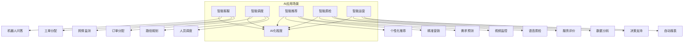
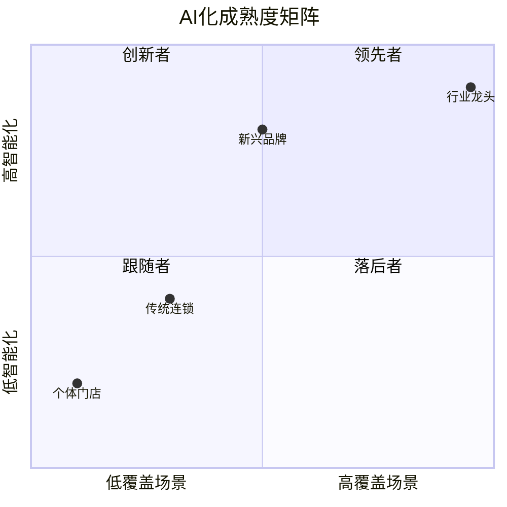
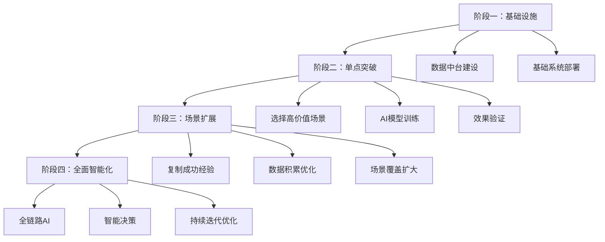

# AI化程度评估框架

## 一、AI化评估体系

AI技术正在深刻改变服务行业的运营效率和客户体验。



## 二、AI应用场景详解

### 2.1 智能客服

**应用场景：**

| 应用场景 | 功能描述 | AI能力要求 |
|---------|---------|-----------|
| 机器人问答 | 7x24自动回答常见问题 | NLP理解 |
| 工单分配 | 自动识别问题类型分配 | 语义分类 |
| 舆情监测 | 实时监测评价/投诉 | 情感分析 |
| 外呼机器人 | 自动回访/满意度调研 | 语音合成 |

**成熟度等级：**

| 等级 | 特征 | 覆盖率 |
|-----|-----|-------|
| L0 | 无智能客服，纯人工 | 0% |
| L1 | 简单FAQ自动回复 | <30% |
| L2 | 机器人+人工协作 | 30-60% |
| L3 | 智能分配+多轮对话 | 60-85% |
| L4 | 全场景AI覆盖+主动服务 | >85% |

**效果评估指标：**

```
机器人拦截率 = 机器人处理量 / 总咨询量 × 100%
平均响应时间 = 总响应时长 / 咨询次数
问题解决率 = 机器人解决量 / 机器人接待量 × 100%
客户满意度 = 满意评价 / 有效评价 × 100%
```

### 2.2 智能调度

**应用场景：**

| 应用场景 | 功能描述 | 行业适用 |
|---------|---------|---------|
| 订单分配 | 自动匹配最优服务人员 | 家政、外卖 |
| 路径规划 | 服务路线优化 | 家政、维修 |
| 时间调度 | 预约时间智能排期 | 美容、教育 |
| 动态调度 | 实时调整任务分配 | 即时服务 |

**成熟度等级：**

| 等级 | 特征 | 效果 |
|-----|-----|-----|
| L0 | 人工派单 | 效率低 |
| L1 | 系统辅助人工派单 | 效率一般 |
| L2 | 规则引擎自动派单 | 效率提升 |
| L3 | AI算法智能派单 | 效率高 |
| L4 | 全链路智能调度优化 | 最优效率 |

**效率提升指标：**

```
调度效率 = 派单时长缩短比例
人员利用率 = 实际服务时长 / 可服务时长 × 100%
路径优化率 = 路径缩短比例
客户等待时间 = 平均预约到服务时长
```

### 2.3 智能推荐

**应用场景：**

| 应用场景 | 功能描述 | 数据基础 |
|---------|---------|---------|
| 个性化推荐 | 基于用户画像推荐服务 | 用户行为数据 |
| 精准营销 | 精准触达目标客户 | 客户标签 |
| 需求预测 | 预测客户需求 | 历史数据 |
| 套餐设计 | 基于偏好设计套餐 | 购买数据 |

**成熟度等级：**

| 等级 | 特征 | 推荐效果 |
|-----|-----|---------|
| L0 | 无推荐 | - |
| L1 | 热销推荐/榜单 | 基础 |
| L2 | 规则推荐 | 一般 |
| L3 | 协同过滤推荐 | 较好 |
| L4 | 深度学习个性化推荐 | 精准 |

**效果评估指标：**

```
推荐点击率 = 推荐点击 / 推荐曝光 × 100%
推荐转化率 = 推荐成交 / 推荐点击 × 100%
客单价提升 = 推荐客单价 / 整体客单价 - 1
复购率提升 = 推荐复购率 - 整体复购率
```

### 2.4 智能质检

**应用场景：**

| 应用场景 | 功能描述 | 技术基础 |
|---------|---------|---------|
| 视频监控 | 服务过程视频智能分析 | 计算机视觉 |
| 语音质检 | 服务通话自动评分 | 语音识别+NLP |
| 文本质检 | 聊天记录自动审查 | NLP |
| 异常预警 | 服务异常自动识别 | 规则+AI |

**成熟度等级：**

| 等级 | 特征 | 覆盖率 |
|-----|-----|-------|
| L0 | 人工抽检 | <5% |
| L1 | 录音抽检 | 5-20% |
| L2 | 语音转文字+规则质检 | 20-50% |
| L3 | AI全量质检+重点复核 | 50-90% |
| L4 | 实时质检+主动干预 | >90% |

**效果评估指标：**

```
质检覆盖率 = 智能质检量 / 总服务量 × 100%
问题检出率 = 检出问题 / 实际问题 × 100%
质检一致性 = AI质检与人工判断一致率
改进闭环率 = 改进完成 / 问题确认 × 100%
```

### 2.5 智能运营

**应用场景：**

| 应用场景 | 功能描述 | 决策支持 |
|---------|---------|---------|
| 数据分析 | 业务数据自动分析 | BI |
| 经营预测 | 收入/客流预测 | 时序预测 |
| 异常诊断 | 数据异常自动诊断 | 异常检测 |
| 决策建议 | AI给出优化建议 | 推荐算法 |

**成熟度等级：**

| 等级 | 特征 | 数据驱动 |
|-----|-----|---------|
| L0 | 手工报表 | 0% |
| L1 | Excel报表 | 少量 |
| L2 | BI系统看板 | 中等 |
| L3 | 自动分析报告 | 较高 |
| L4 | AI辅助决策 | 高 |

## 三、综合AI化评估

### 3.1 评分模型

| AI应用场景 | 权重 | 评分(L0-L4) | 加权得分 |
|-----------|-----|------------|---------|
| 智能客服 | 20% | | |
| 智能调度 | 25% | | |
| 智能推荐 | 20% | | |
| 智能质检 | 15% | | |
| 智能运营 | 20% | | |
| **综合得分** | 100% | | |

### 3.2 AI化等级判定

| 等级 | 得分 | 特征描述 |
|-----|------|---------|
| **S级** | 90-100 | 全场景AI覆盖，行业领先 |
| **A级** | 80-89 | 核心场景AI成熟，有扩展空间 |
| **B级** | 70-79 | 部分场景AI应用，仍有提升 |
| **C级** | 60-69 | 初步尝试AI，效果不明显 |
| **D级** | <60 | 尚未应用AI，纯人工运营 |

### 3.3 AI化成熟度矩阵



## 四、行业AI化差异

### 4.1 各行业AI应用重点

| 行业 | 核心AI应用 | 优先场景 | 实施难点 |
|-----|-----------|---------|---------|
| 餐饮 | 智能点餐、预测备货 | 客流预测、智能推荐 | 场景复杂 |
| 家政 | 智能调度、人员匹配 | 订单分配、路径优化 | 人员管理 |
| 教育 | 智能排课、学情分析 | 个性化推荐、智能质检 | 教学效果 |
| 美容 | 智能预约、客户画像 | 推荐、会员运营 | 服务标准化 |
| 电商 | 智能客服、精准营销 | 客服、推荐 | 数据基础 |

### 4.2 AI投入产出评估

| AI应用 | 投入成本 | 产出效益 | ROI周期 |
|-------|---------|---------|---------|
| 智能客服 | 中 | 高（人力成本节省） | 6-12月 |
| 智能调度 | 高 | 高（效率提升+收益） | 12-18月 |
| 智能推荐 | 高 | 高（客单价+转化） | 12-18月 |
| 智能质检 | 中 | 中（质量稳定） | 12-24月 |
| 智能运营 | 中 | 中（决策效率） | 6-12月 |

## 五、AI化建设建议

### 5.1 建设路径



### 5.2 实施建议

1. **从痛点出发**：优先解决人力成本高、效率低的场景
2. **数据先行**：保证数据质量是AI应用的基础
3. **小步快跑**：从单点验证到规模化推广
4. **持续迭代**：AI需要数据积累和持续优化

### 5.3 核查清单

- [ ] 是否有完整的AI应用规划
- [ ] 数据采集体系是否完善
- [ ] 核心业务系统是否支持AI接入
- [ ] 关键岗位AI应用覆盖情况
- [ ] AI应用效果是否有量化评估
