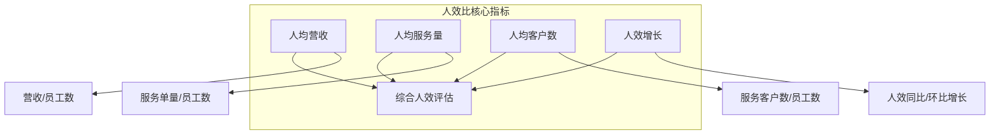
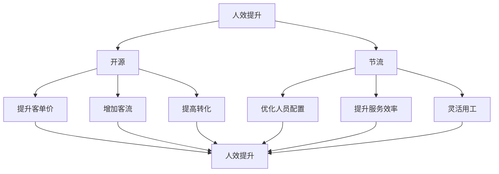

# 人效比评估框架

## 一、人效比评估体系

人效比是衡量服务行业运营效率和盈利能力的关键指标。



## 二、核心评估指标

### 2.1 人均营收

**定义：** 总营收除以平均员工人数

**计算公式：**

```
人均营收 = 总营收 ÷ 平均员工人数

其中：
平均员工人数 = （期初人数 + 期末人数）÷ 2
```

**行业基准：**

| 行业 | 基础基准 | 良好值 | 优秀值 |
|-----|---------|-------|-------|
| 餐饮-快餐 | 15-25万/年 | 25-30万/年 | >30万/年 |
| 餐饮-正餐 | 20-35万/年 | 35-40万/年 | >40万/年 |
| 餐饮-茶饮 | 25-40万/年 | 40-50万/年 | >50万/年 |
| 家政-保洁 | 8-12万/年 | 12-15万/年 | >15万/年 |
| 家政-保姆 | 10-18万/年 | 18-25万/年 | >25万/年 |
| 教育培训 | 20-40万/年 | 40-50万/年 | >50万/年 |
| 美容美发 | 15-30万/年 | 30-40万/年 | >40万/年 |
| 健身 | 12-25万/年 | 25-35万/年 | >35万/年 |

**影响因素：**

| 影响因素 | 对人效的影响 | 改善方向 |
|---------|------------|---------|
| 客单价 | 正相关 | 提升服务价值 |
| 客流量 | 正相关 | 增加获客 |
| 服务效率 | 正相关 | 流程优化 |
| 人员利用率 | 正相关 | 排班优化 |
| 兼职比例 | 正相关 | 灵活用工 |
| 自动化程度 | 正相关 | 工具升级 |

### 2.2 人均服务量

**定义：** 总服务单量除以平均员工人数

**计算公式：**

```
人均服务量 = 总服务单量 ÷ 平均员工人数

日均服务量 = 总服务单量 ÷ 工作天数 ÷ 平均员工人数
```

**行业基准：**

| 行业 | 日均服务量/人 | 月均服务量/人 |
|-----|-------------|-------------|
| 餐饮-快餐 | 30-50单 | 600-1000单 |
| 餐饮-正餐 | 10-20单 | 200-400单 |
| 家政-保洁 | 2-3单 | 40-60单 |
| 家政-收纳 | 1-2单 | 20-40单 |
| 美容-面部 | 4-6单 | 80-120单 |
| 美容-美发 | 3-5单 | 60-100单 |
| 教育-1对1 | 6-10课 | 120-200课 |
| 教育-班课 | 15-30课 | 300-600课 |

### 2.3 人均客户数

**定义：** 活跃客户数除以平均员工人数

**计算公式：**

```
人均客户数 = 活跃客户数 ÷ 平均员工人数

客户/人效 = 月活客户 ÷ 月均员工
```

**评估标准：**

| 行业 | 人均客户数/月 | 评估 |
|-----|-------------|-----|
| 会员制服务 | 50-100人 | 合理 |
| 顾问式服务 | 20-50人 | 合理 |
| 高端定制 | 5-15人 | 合理 |
| 标准化服务 | 100-300人 | 合理 |

### 2.4 人效增长率

**定义：** 人效的同比/环比增长情况

**计算公式：**

```
人效增长率 = （本期人效 - 上期人效） ÷ 上期人效 × 100%
同比增长率 = （本期人效 -去年同期人效） ÷ 去年同期人效 × 100%
环比增长率 = （本期人效 -上期人效） ÷ 上期人效 × 100%
```

**评估标准：**

| 增长率 | 评估 | 说明 |
|-------|-----|-----|
| >20% | ⭐⭐⭐⭐⭐ | 高速增长 |
| 10-20% | ⭐⭐⭐⭐ | 稳健增长 |
| 0-10% | ⭐⭐⭐ | 稳定 |
| -10%-0 | ⭐⭐ | 轻微下滑 |
| <-10% | ⭐ | 明显下滑 |

## 三、人效分析模型

### 3.1 人效拆解模型

```
人均营收 = 客单价 × 人均订单数
         = 客单价 × 人均服务量 × 服务成功率
         
人均服务量 = 工作时长 ÷ 平均服务时长 × 时间利用率
           = 有效工时 ÷ 平均服务时长
```

### 3.2 人效影响因素



### 3.3 人效对标分析

| 对标维度 | 分析内容 |
|---------|---------|
| 时间维度 | 同比/环比/人效趋势 |
| 空间维度 | 与竞品/行业均值对比 |
| 结构维度 | 不同门店/区域/岗位人效差异 |
| 业务维度 | 不同业务线人效差异 |

## 四、人效优化路径

### 4.1 短期优化（1-3月）

| 优化方向 | 具体措施 | 预期效果 |
|---------|---------|---------|
| 排班优化 | 基于峰谷预测排班 | 利用率↑10-15% |
| 交叉培训 | 一人多岗，提升机动性 | 人效↑5-10% |
| 工具升级 | 引入效率工具 | 服务效率↑10% |
| 流程简化 | 减少非服务时间 | 时间利用率↑10% |

### 4.2 中期优化（3-6月）

| 优化方向 | 具体措施 | 预期效果 |
|---------|---------|---------|
| 薪酬激励 | 人效与绩效挂钩 | 积极性↑15% |
| 技能提升 | 系统培训 | 客单价↑5-10% |
| 数字化 | 智能调度 | 人员利用率↑15% |
| 会员运营 | 提高复购 | 人均订单↑10% |

### 4.3 长期优化（6-12月）

| 优化方向 | 具体措施 | 预期效果 |
|---------|---------|---------|
| 自动化 | 引入智能设备 | 替代部分人工 |
| 标准化 | SOP优化+执行 | 一致性↑+人效↑ |
| 品牌升级 | 提升溢价能力 | 客单价↑20%+ |
| 模式创新 | 探索新业态 | 开辟新增长点 |

## 五、评分标准

### 5.1 评分模型

| 评估指标 | 权重 | 评分标准 |
|---------|-----|---------|
| 人均营收 | 40% | vs行业基准 |
| 人均服务量 | 30% | vs行业基准 |
| 人均客户数 | 15% | vs行业基准 |
| 人效增长率 | 15% | 增长趋势 |

### 5.2 人效等级判定

| 等级 | 得分 | 特征描述 |
|-----|------|---------|
| **S级** | 90-100 | 人效行业顶尖，运营效率极高 |
| **A级** | 80-89 | 人效高于行业，竞争力强 |
| **B级** | 70-79 | 人效接近行业均值 |
| **C级** | 60-69 | 人效低于行业，有改善空间 |
| **D级** | <60 | 人效明显落后，运营效率低 |

### 5.3 人效对标表

| 企业 | 行业 | 人均营收 | 成熟度 | 人效评级 |
|-----|-----|---------|-------|---------|
| 海底捞 | 火锅 | 约30万/年 | SL9 | A |
| 瑞幸 | 咖啡 | 约45万/年 | SL9 | S |
| 喜茶 | 茶饮 | 约50万/年 | SL7 | S |
| 半天妖 | 烤鱼 | 约35万/年 | SL8 | A |
| 九毛九 | 面馆 | 约25万/年 | SL6 | B |
| 某区域餐饮 | 正餐 | 约18万/年 | SL4 | C |

## 六、数据采集与核查

### 6.1 数据来源

| 数据项 | 来源 | 核查方式 |
|-------|-----|---------|
| 总营收 | 财务报表 | 审计验证 |
| 平均员工数 | HR系统 | 工资表验证 |
| 服务单量 | 订单系统 | 抽查核对 |
| 活跃客户数 | CRM系统 | 数据验证 |

### 6.2 核查要点

- [ ] 营收数据与税务/银行流水一致
- [ ] 员工人数口径统一（全职/兼职）
- [ ] 服务单量与收银系统匹配
- [ ] 客户数去重且口径一致
- [ ] 人效计算方法与行业可比

### 6.3 异常信号识别

| 异常现象 | 可能问题 | 核查重点 |
|---------|---------|---------|
| 人效异常高 | 数据虚报/统计口径 | 交叉验证 |
| 人效异常低 | 人员冗余/效率低 | 运营诊断 |
| 人效波动大 | 季节性/统计问题 | 时间序列分析 |
| 远超行业 | 模式差异/数据问题 | 深度核查 |
