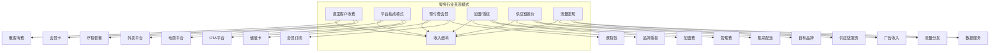
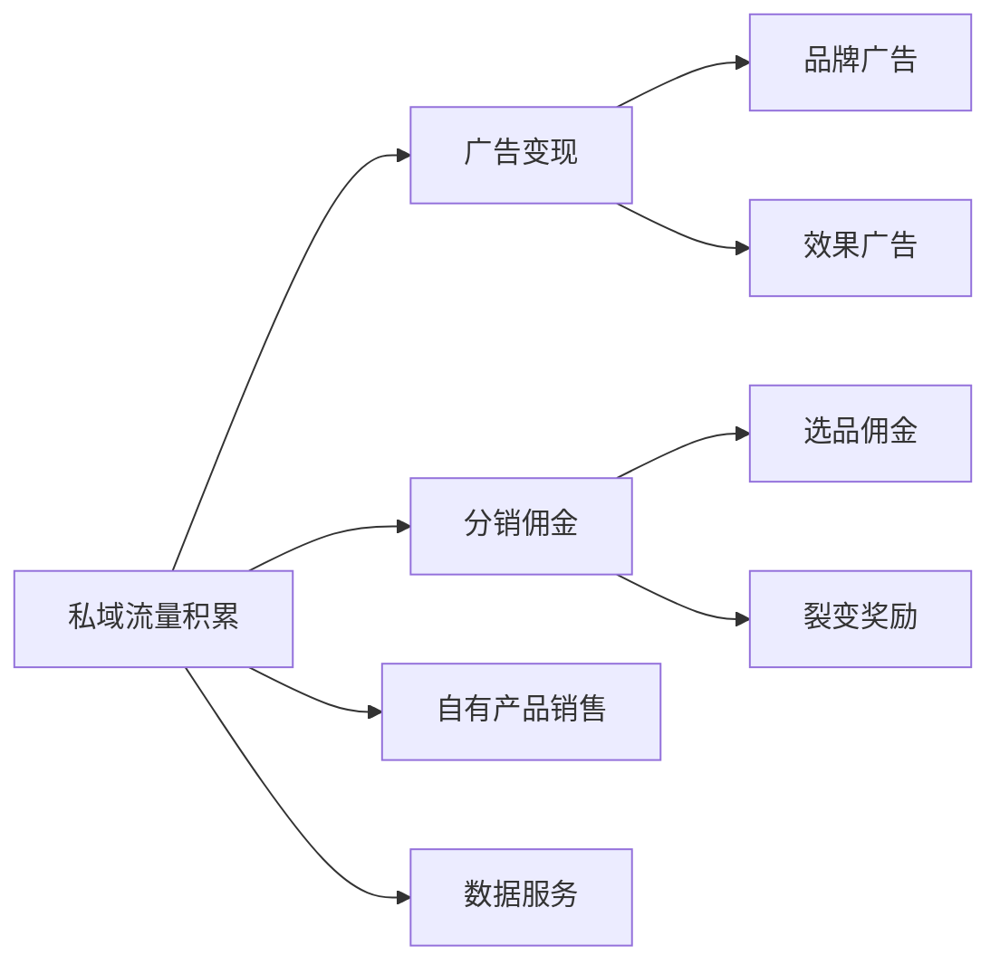
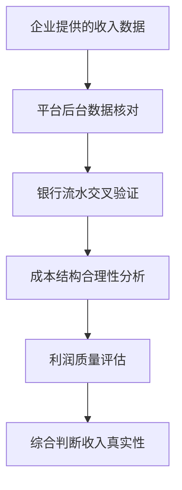

# 变现模式分析框架

## 一、变现模式分类

服务行业的变现模式决定了企业的收入结构、盈利能力和增长空间。

## 二、主流变现模式详解

### 2.1 直面客户收费（C端直接收入）

**模式特征：**
- 收入直接来自终端消费者
- 定价权相对自主
- 品牌溢价能力决定盈利水平

**适用行业：** 餐饮、零售、美容美发、健身、教育培训

**核心指标：**

| 指标 | 计算公式 | 优秀值 |
|-----|---------|-------|
| 客单价 | 总收入/订单数 | 行业领先 |
| 毛利率 | （收入-直接成本）/收入 | >60% |
| 收现率 | 实际收现/应收入 | >98% |

**核查要点：**
- 定价策略是否合理
- 是否有会员折扣体系
- 退换货/退款政策
- 促销活动对收入影响

### 2.2 平台抽成模式

**模式特征：**
- 依赖第三方平台获取流量
- 平台抽成降低毛利
- 账期影响现金流

**适用行业：** 餐饮外卖、电商、美业到家、酒店

**核心指标：**

| 指标 | 计算公式 | 风险阈值 |
|-----|---------|---------|
| 平台抽成率 | 平台费用/GMV | >25%风险高 |
| 平台账期 | 应收账款周转天数 | >30天需关注 |
| 平台依赖度 | 平台收入/总收入 | >60%风险高 |

**成本结构示例（餐饮外卖）：**

| 成本项 | 占比 | 说明 |
|-------|-----|------|
| 食材成本 | 30-35% | 原材料采购 |
| 平台抽成 | 20-25% | 佣金+配送费 |
| 人工成本 | 20-25% | 门店人员 |
| 房租水电 | 10-15% | 门店成本 |
| 其他成本 | 5-10% | 耗材、营销等 |
| 净利润 | 5-10% | 正常水平 |

### 2.3 预付费会员模式

**模式特征：**
- 提前收取服务费用
- 资金沉淀形成现金流
- 消费完成率影响盈利能力

**适用行业：** 教育培训、健身、美容美发、家政

**核心指标：**

| 指标 | 计算公式 | 评估标准 |
|-----|---------|---------|
| 预付费规模 | 期末预收款余额 | 合理范围 |
| 消耗率 | 已消耗/已收款 | >80%为健康 |
| 退款率 | 退款金额/收款金额 | <5%为优秀 |
| 现金流倍数 | 经营现金流/净利润 | 关注资金用途 |

**风险提示：**
- 预付费监管政策趋严
- 资金链断裂风险
- 卷款跑路负面舆情

### 2.4 加盟/授权模式

**模式特征：**
- 通过复制实现快速扩张
- 收入来自加盟商
- 轻资产运营风险共担

**适用行业：** 餐饮、茶饮、便利店、家政、教育培训

**收入来源：**

| 收入类型 | 一次性/ recurring | 占比估算 |
|---------|------------------|---------|
| 加盟费/授权费 | 一次性 | 20-30% |
| 保证金 | 押金（可退） | 10-20% |
| 供应链供货 | recurring | 40-50% |
| 管理费/品牌费 | recurring | 10-20% |
| 培训费 | 一次性 | 5-10% |

**核查要点：**
- 加盟商存活率（>80%为健康）
- 加盟商满意度
- 供应链利润空间
- 品牌管控能力

### 2.5 供应链差价模式

**模式特征：**
- 整合供应链获取差价利润
- 规模化后成本优势明显
- 可延伸至自有品牌

**适用行业：** 餐饮连锁、零售、家政服务

**核心指标：**

| 指标 | 计算公式 | 优秀值 |
|-----|---------|-------|
| 集采规模 | 采购总额 | 规模决定议价 |
| 供应链毛利率 | （供应价-采购价）/供应价 | >15% |
| 库存周转 | 营业成本/平均库存 | >12次/年 |

### 2.6 流量/数据变现

**模式特征：**
- 依托私域流量进行商业化
- 边际成本低，可规模化
- 需要足够的流量基础

**适用行业：** 社区团购、内容电商、SaaS服务

**变现路径：**

## 三、变现效率分析

### 3.1 核心变现指标

| 指标 | 计算公式 | 说明 |
|-----|---------|-----|
| 变现效率 | 月均收入/活跃客户数 | 衡量单客变现能力 |
| ARPU值 | 总收入/付费用户数 | 人均贡献 |
| 付费转化率 | 付费用户/总用户 | 转化能力 |
| 续费率 | 续费用户/到期用户 | 留存变现 |

### 3.2 收入结构健康度评估

| 结构类型 | 特征 | 风险评估 |
|---------|-----|---------|
| 单一收入 | 高度依赖单一来源 | 🔴高风险 |
| 组合收入 | 多元收入组合 | ✅较优 |
| 平台依赖型 | 第三方平台占比高 | 🟠中高风险 |
| 直营为主型 | C端直接收入为主 | ✅较优 |

### 3.3 变现模式评估矩阵

| 模式 | 盈利潜力 | 规模化难度 | 现金流 | 抗风险能力 |
|-----|---------|-----------|-------|-----------|
| 直C收费 | ⭐⭐⭐⭐ | ⭐⭐ | ⭐⭐⭐⭐ | ⭐⭐⭐⭐ |
| 平台抽成 | ⭐⭐ | ⭐⭐⭐⭐ | ⭐⭐ | ⭐⭐ |
| 预付费会员 | ⭐⭐⭐⭐ | ⭐⭐⭐ | ⭐⭐⭐⭐⭐ | ⭐⭐ |
| 加盟授权 | ⭐⭐⭐⭐⭐ | ⭐⭐⭐⭐⭐ | ⭐⭐⭐ | ⭐⭐⭐ |
| 供应链差价 | ⭐⭐⭐⭐⭐ | ⭐⭐⭐⭐ | ⭐⭐⭐⭐ | ⭐⭐⭐⭐ |
| 流量变现 | ⭐⭐⭐ | ⭐⭐ | ⭐⭐⭐ | ⭐⭐ |

## 四、收入真实性核查

### 4.1 核查流程

### 4.2 核查要点

| 核查项 | 关注点 | 异常信号 |
|-------|-------|---------|
| 订单数据 | 订单数量、金额、时间分布 | 凌晨订单、整数金额 |
| 流水核对 | 银行流水与收入匹配 | 流水小于账面收入 |
| 成本匹配 | 成本与收入比例 | 成本异常波动 |
| 税务匹配 | 发票开具与收入 | 税负率异常 |
| 现金收入 | 现金收款占比 | 大额现金难以核查 |

### 4.3 盈利质量评估

| 指标 | 含义 | 判断标准 |
|-----|------|---------|
| 毛利率 | 核心盈利能力 | 需高于行业均值 |
| 净利率 | 最终获利能力 | 需覆盖运营成本 |
| 经营现金流 | 实际现金创造 | 需大于净利润 |
| 非经常性损益 | 非主业收入占比 | 占比高需警惕 |

## 五、变现瓶颈与建议

### 5.1 常见变现瓶颈

| 瓶颈类型 | 表现特征 | 突破路径 |
|---------|---------|---------|
| 客单价瓶颈 | 提价困难 | 提升服务价值、品牌溢价 |
| 频次瓶颈 | 复购率低 | 会员体系、套餐设计 |
| 规模瓶颈 | 扩张边际成本高 | 标准化、可复制化 |
| 渠道瓶颈 | 获客成本高 | 私域运营、口碑裂变 |

### 5.2 变现优化建议

1. **提升客单价**：通过服务升级、套餐组合实现
2. **提高复购**：建立会员体系，增加消费粘性
3. **拓展收入来源**：从单一服务向多元收入转型
4. **降低获客成本**：私域运营、口碑转介绍
5. **优化成本结构**：供应链整合、效率提升
