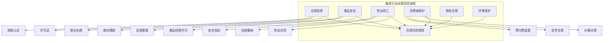
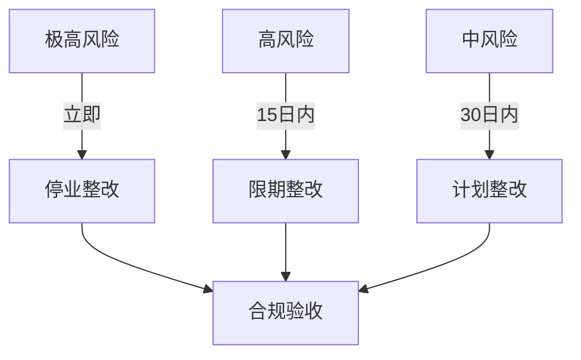

# 合规风险清单

## 一、合规风险总览

服务行业面临多维度合规风险，需要系统性排查。



## 二、餐饮行业合规风险

### 2.1 证照资质风险

| 风险项 | 法规依据 | 处罚标准 | 核查方式 |
|-------|---------|---------|---------|
| 无照经营 | 《无证无照查处办法》 | 责令停止+罚款 | 证照核查 |
| 超范围经营 | 《企业经营范围登记管理规定》 | 责令改正+处罚 | 执照核对 |
| 许可证过期 | 《食品经营许可管理办法》 | 责令改正+罚款 | 有效期核查 |
| 虚假宣传 | 《广告法》 | 罚款+消除影响 | 宣传物料审查 |

**必核证照清单：**

```
□ 营业执照（正副本）
□ 食品经营许可证
□ 消防安全检查合格证
□ 环境影响评价批复（部分业态）
□ 排水许可证（部分业态）
□ 烟草专卖零售许可证（如有）
□ 卫生许可证（部分地区已合并）
```

### 2.2 食品安全风险

| 风险项 | 法规依据 | 处罚标准 | 风险等级 |
|-------|---------|---------|---------|
| 食品过期/变质 | 《食品安全法》 | 5万+罚款，严重吊证 | 🔴极高 |
| 添加剂超标 | 《食品安全法》 | 严重可入刑 | 🔴极高 |
| 后厨卫生不达标 | 《食品安全法》 | 责令整改+罚款 | 🟠高 |
| 食材溯源缺失 | 《食品安全法》 | 责令整改 | 🟡中 |
| 人员无健康证 | 《食品安全法》 | 责令改正 | 🟡中 |
| 食品留样缺失 | 各地监管要求 | 责令改正 | 🟡中 |

**食安风险检查清单：**

```
后厨检查：
□ 整体卫生状况
□ 食品存储温度
□ 食材有效期管理
□ 餐具消毒情况
□ 人员操作规范
□ 索证索票齐全
□ 食品留样规范
□ 废弃物处理
```

### 2.3 消防安全风险

| 风险项 | 法规依据 | 处罚标准 | 核查方式 |
|-------|---------|---------|---------|
| 无消防验收 | 《消防法》 | 责令整改+处罚 | 验收文件 |
| 消防设施损坏 | 《消防法》 | 责令整改 | 现场检查 |
| 堵塞消防通道 | 《消防法》 | 立即整改 | 现场检查 |
| 电气安全隐患 | 《消防法》 | 整改 | 维保记录 |

## 三、家政行业合规风险

### 3.1 劳动用工风险

| 风险项 | 法规依据 | 处罚标准 | 风险等级 |
|-------|---------|---------|---------|
| 不签劳动合同 | 《劳动合同法》 | 双倍工资+补缴 | 🔴极高 |
| 不缴社保 | 《社会保险法》 | 补缴+滞纳金 | 🟠高 |
| 工伤不报 | 《工伤保险条例》 | 赔偿+处罚 | 🔴极高 |
| 超时加班 | 《劳动法》 | 加班费+整改 | 🟠高 |
| 竞业限制违规 | 《劳动合同法》 | 赔偿 | 🟡中 |

**劳动合规核查清单：**

```
劳动合同：
□ 全员签订劳动合同
□ 合同期限合规
□ 合同内容合法
□ 合同备案（如要求）

社保缴纳：
□ 社保开户
□ 全员参保
□ 社保基数合规
□ 公积金缴纳（部分城市）

工资支付：
□ 工资标准合规
□ 加班费计算正确
□ 发放时间准时
□ 工资条发放
```

### 3.2 服务人员资质风险

| 风险项 | 风险描述 | 行业要求 | 核查方式 |
|-------|---------|---------|---------|
| 无健康证 | 携带传染病风险 | 必须持证 | 健康证核查 |
| 无资质认证 | 专业能力不足 | 部分岗位要求 | 证书核查 |
| 背景审查缺失 | 安全风险 | 建议背调 | 背调记录 |
| 保险缺失 | 事故赔偿风险 | 建议购买 | 保险单核查 |

### 3.3 消费者保护风险

| 风险项 | 法规依据 | 风险描述 | 防范措施 |
|-------|---------|---------|---------|
| 预付费跑路 | 《消费者权益保护法》 | 卷款跑路风险 | 资金存管 |
| 虚假宣传 | 《广告法》《消保法》 | 夸大服务效果 | 宣传审核 |
| 服务不满意 | 《消保法》 | 退款纠纷 | 服务协议 |
| 隐私泄露 | 《个人信息保护法》 | 客户信息泄露 | 数据保护 |

## 四、教育培训行业合规风险

### 4.1 办学资质风险

| 风险项 | 法规依据 | 处罚标准 | 风险等级 |
|-------|---------|---------|---------|
| 无办学许可证 | 《民办教育促进法》 | 责令停办+罚款 | 🔴极高 |
| 超范围经营 | 《民办教育促进法》 | 责令改正 | 🟠高 |
| 虚假宣传 | 《广告法》 | 罚款+消除影响 | 🟠高 |
| 师资不合规 | 各地监管要求 | 整改 | 🟡中 |

### 4.2 预收费合规风险

| 风险项 | 法规依据 | 监管要求 | 风险点 |
|-------|---------|---------|-------|
| 收费超期 | 各地监管政策 | 不超过3个月/60课时 | 资金链风险 |
| 资金未存管 | 各地监管政策 | 资金银行存管 | 卷款跑路 |
| 退款难 | 《消保法》 | 15日内退款 | 纠纷风险 |
| 贷款分期 | 监管要求 | 禁止诱导贷款 | 投诉风险 |

### 4.3 课程内容合规

| 风险项 | 风险描述 | 监管要求 | 核查方式 |
|-------|---------|---------|---------|
| 学科类超标 | 超纲教学 | 不得超纲 | 课程大纲 |
| 外教资质 | 无证外教 | 持证上岗 | 资质证书 |
| 教材合规 | 盗版/违规 | 正版+合规 | 教材审查 |
| 境外课程 | 引进课程合规 | 需备案 | 版权证明 |

## 五、共性合规风险

### 5.1 税务合规风险

| 风险项 | 法规依据 | 风险描述 | 核查重点 |
|-------|---------|---------|---------|
| 隐匿收入 | 《税收征管法》 | 偷税漏税 | 银行流水核对 |
| 虚开发票 | 《发票管理办法》 | 虚增成本 | 发票核查 |
| 个税代扣 | 《个人所得税法》 | 未代扣代缴 | 工资表核查 |
| 社保基数 | 《社会保险法》 | 基数不合规 | 社保申报核查 |

### 5.2 广告宣传合规

| 风险项 | 违规案例 | 处罚标准 |
|-------|---------|---------|
| 极限词使用 | "最好"、"第一"等 | 罚款+整改 |
| 虚假宣传 | 与实际不符 | 罚款+消除影响 |
| 绝对化用语 | "100%"等 | 罚款 |
| 医疗效果宣传 | 夸大功效 | 罚款+整改 |
| 价格欺诈 | 先涨后降 | 罚款 |

### 5.3 数据安全合规

| 风险项 | 法规依据 | 适用场景 |
|-------|---------|---------|
| 个人信息泄露 | 《个人信息保护法》 | 收集客户信息 |
| 过度收集 | 《个人信息保护法》 | 超范围收集 |
| 数据出境 | 《数据安全法》 | 跨境传输 |
| 会员数据管理 | 《数据安全法》 | 数据保护 |

## 六、风险评估矩阵

### 6.1 风险等级定义

| 等级 | 等级名称 | 风险描述 | 处置要求 |
|-----|---------|---------|---------|
| 🔴极高 | 重大违规 | 面临停业/吊证/刑责 | 立即整改 |
| 🟠高 | 严重违规 | 面临大额罚款/投诉 | 限期整改 |
| 🟡中 | 一般违规 | 面临小额罚款/整改 | 计划整改 |
| 🟢低 | 轻微问题 | 规范提醒 | 持续改进 |

### 6.2 行业风险热力图

| 风险类型 | 餐饮 | 家政 | 教育 | 美容 |
|---------|-----|------|------|-----|
| 证照资质 | 🔴极高 | 🟠高 | 🔴极高 | 🟡中 |
| 食品安全 | 🔴极高 | - | - | 🟡中 |
| 劳动用工 | 🟠高 | 🔴极高 | 🟠高 | 🟠高 |
| 消费保护 | 🟠高 | 🟠高 | 🔴极高 | 🟠高 |
| 税务合规 | 🟠高 | 🟠高 | 🟠高 | 🟠高 |
| 消防安全 | 🔴极高 | 🟡中 | 🟠高 | 🟡中 |

## 七、合规整改建议

### 7.1 整改优先级



### 7.2 合规建设建议

| 建设阶段 | 内容 | 时间 |
|---------|-----|-----|
| 基础合规 | 证照齐全、制度建立 | 1个月 |
| 运营合规 | 流程规范、培训到位 | 3个月 |
| 持续合规 | 监督机制、持续改进 | 常态化 |

### 7.3 合规管理建议

1. **证照管理**：建立证照台账，定期检查有效期
2. **培训体系**：定期开展合规培训，留存记录
3. **内控机制**：建立合规检查机制，定期自查
4. **应急预案**：制定违规应急响应预案
5. **外部支持**：聘请法律顾问，定期合规审计
