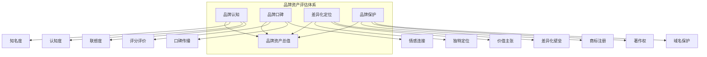
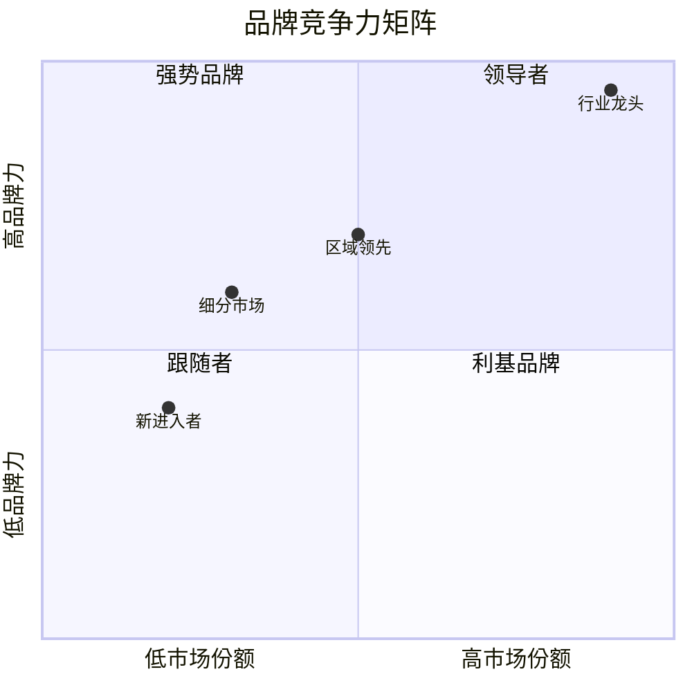

# 品牌资产评估框架

## 一、品牌资产评估体系

品牌资产是服务行业企业的重要无形资产，影响客户决策、价格定位和市场竞争力。



## 二、核心评估维度

### 2.1 品牌认知

**评估指标：**

| 指标 | 定义 | 评估方式 | 优秀值 |
|-----|------|---------|-------|
| 品牌知名度 | 目标人群知晓品牌比例 | 调研数据 | >80% |
| 品牌认知度 | 了解品牌具体信息比例 | 调研数据 | >50% |
| 品牌联想度 | 提到品类联想到品牌比例 | 调研数据 | >30% |
| 搜索指数 | 搜索引擎搜索量 | 百度指数等 | 行业前列 |

**数据来源：**

| 数据源 | 指标 | 可信度 |
|-------|-----|-------|
| 百度指数 | 搜索趋势 | 高 |
| 微信指数 | 社交热度 | 高 |
| 新榜/蝉妈妈 | 内容数据 | 中 |
| 问卷调研 | 主观认知 | 中 |

### 2.2 品牌口碑

**核心指标：**

| 指标 | 含义 | 数据来源 | 优秀值 |
|-----|------|---------|-------|
| 综合评分 | 各平台平均评分 | 公开数据 | >4.5分 |
| 评价数量 | 累计评价总数 | 公开数据 | 行业领先 |
| 好评率 | 好评/总评价 | 平台数据 | >95% |
| 差评率 | 差评/总评价 | 平台数据 | <2% |
| 口碑传播指数 | 正向传播/负向传播 | 舆情监测 | >10:1 |

**各平台评分权重：**

| 平台 | 权重 | 说明 |
|-----|-----|------|
| 美团/大众点评 | 35% | 本地生活核心平台 |
| 抖音 | 25% | 年轻用户聚集 |
| 小红书 | 20% | 种草属性强 |
| 高德/百度地图 | 10% | 地理位置相关 |
| 私域评价 | 10% | 会员反馈数据 |

### 2.3 差异化定位

**定位分析维度：**

| 维度 | 评估问题 | 关键发现 |
|-----|---------|---------|
| 品类定位 | 处于什么细分市场 | 市场规模 |
| 目标客群 | 主要服务哪类客户 | 客户精准度 |
| 价值主张 | 提供什么核心价值 | 差异化程度 |
| 价格定位 | 高/中/低端 | 价格带宽度 |
| 情感连接 | 与客户的情感纽带 | 忠诚度基础 |

**差异化类型评估：**

| 类型 | 举例 | 壁垒强度 | 可持续性 |
|-----|-----|---------|---------|
| 产品差异化 | 独家配方/专利 | ⭐⭐⭐⭐ | ⭐⭐⭐⭐ |
| 服务差异化 | 超预期服务体验 | ⭐⭐⭐ | ⭐⭐⭐⭐⭐ |
| 渠道差异化 | 独家渠道布局 | ⭐⭐⭐ | ⭐⭐ |
| 价格差异化 | 高端定位/性价比 | ⭐⭐ | ⭐⭐ |
| 品牌差异化 | 情感认同/文化符号 | ⭐⭐⭐⭐⭐ | ⭐⭐⭐⭐⭐ |

### 2.4 品牌保护

**保护措施评估：**

| 保护类型 | 评估内容 | 完善程度 |
|---------|---------|---------|
| 商标注册 | 全品类注册情况 | 主标+防御商标 |
| 著作权 | LOGO版权登记 | 软件著作权 |
| 域名保护 | 主流域名注册 | .com/.cn/.商标 |
| 专利保护 | 发明/实用新型专利 | 技术壁垒 |
| 商业秘密 | 配方/工艺保护 | 保密协议 |

**核查清单：**

- [ ] 品牌主标是否全品类注册
- [ ] 是否注册防御商标
- [ ] 核心域名是否自持
- [ ] 是否有专利布局
- [ ] 是否有完善的保密制度

## 三、品牌资产评估模型

### 3.1 品牌价值评估方法

**成本法：**

```
品牌价值 = 历史投入成本 × 系数
系数 = 行业调整系数 × 时间衰减系数
```

**市场法：**

```
品牌价值 = 可比交易案例价格 × 调整系数
参考：同类品牌收购案例
```

**收益法：**

```
品牌价值 = Σ(超额收益 / 折现率)
超额收益 = 实际收益 - 行业基准收益
```

### 3.2 品牌资产评估表

| 评估维度 | 权重 | 评分 | 加权得分 |
|---------|-----|-----|---------|
| 品牌知名度 | 20% | | |
| 品牌口碑 | 30% | | |
| 差异化定位 | 25% | | |
| 品牌保护 | 15% | | |
| 品牌溢价 | 10% | | |
| **综合得分** | 100% | | |

### 3.3 评分标准

| 等级 | 得分 | 特征描述 |
|-----|------|---------|
| **S级** | 90-100 | 全国性知名品牌，溢价能力强 |
| **A级** | 80-89 | 区域性强势品牌，有一定溢价 |
| **B级** | 70-79 | 区域性品牌，知名度有限 |
| **C级** | 60-69 | 本地品牌，认知度较低 |
| **D级** | <60 | 无品牌认知，纯价格竞争 |

## 四、品牌健康度监测

### 4.1 正面信号

| 指标 | 趋势 | 含义 |
|-----|-----|-----|
| 评分提升 | ↑ | 服务质量改善 |
| 好评增长 | ↑ | 客户满意度提升 |
| 搜索指数上升 | ↑ | 品牌热度增加 |
| 媒体正面报道 | ↑ | 品牌影响力扩大 |
| 竞品提及正向 | ↑ | 行业地位提升 |

### 4.2 负面信号

| 指标 | 趋势 | 风险等级 |
|-----|-----|---------|
| 评分下降 | ↓ | 🔴高 |
| 差评增加 | ↑ | 🔴高 |
| 投诉曝光 | 出现 | 🔴极高 |
| 舆情危机 | 出现 | 🔴极高 |
| 商标纠纷 | 出现 | 🟠中高 |
| 仿冒泛滥 | 出现 | 🟠中高 |

### 4.3 品牌竞争力分析



## 五、品牌建设建议

### 5.1 短期提升路径

1. **口碑管理**：提升服务质量，减少差评
2. **评价运营**：主动引导好评，提升评分
3. **内容营销**：社交媒体持续曝光
4. **用户运营**：强化会员情感连接

### 5.2 中长期建设

1. **品牌定位**：明确差异化价值主张
2. **品牌视觉**：统一视觉形象升级
3. **品牌故事**：建立品牌文化内涵
4. **跨界合作**：提升品牌势能

### 5.3 品牌护城河构建

| 护城河类型 | 构建方式 | 效果 |
|-----------|---------|-----|
| 服务护城河 | 超预期服务体验 | 口碑传播 |
| 认知护城河 | 品类代表性品牌 | 首选心智 |
| 情感护城河 | 品牌文化认同 | 忠诚复购 |
| 规模护城河 | 规模降低成本 | 性价比壁垒 |
