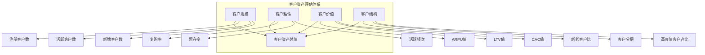

# 客户资产评估框架

## 一、评估框架总览

客户资产是服务行业企业的核心资产，决定了企业的长期价值和增长潜力。



## 二、核心评估维度

### 2.1 客户规模

**核心指标：**

| 指标 | 定义 | 计算公式 | 评估标准 |
|-----|------|---------|---------|
| 注册客户数 | 累计注册/开卡客户总量 | 直接统计 | 规模决定天花板 |
| 月活用户（MAU） | 月度活跃客户数 | 直接统计 | >30%为活跃 |
| 新增客户数 | 期内新增客户数 | 直接统计 | 增长趋势重要 |
| 获客成本（CAC） | 获取新客户的平均成本 | 营销费用/新客数 | 越低越好 |

**关键比率：**
```
月活率 = MAU / 注册客户总数 × 100%
获客成本趋势 = 本期CAC / 上期CAC × 100%
```

### 2.2 客户粘性

**核心指标：**

| 指标 | 定义 | 计算公式 | 优秀值 | 合格值 |
|-----|------|---------|-------|-------|
| 复购率 | 重复消费客户占比 | 复购客户/总客户×100% | >40% | >25% |
| 留存率 | 期末留存客户/期初客户 | 留存客户/期初×100% | >70% | >50% |
| 活跃频次 | 客户平均消费频次 | 总订单/活跃客户 | 行业2倍+ | 行业均值 |
| 活跃间隔 | 客户平均消费间隔 | 总天数/订单数 | 缩短趋势 | 稳定 |

**客户生命周期价值（LTV）计算：**
```
ARPU = 总收入 / 活跃客户数
平均生命周期（月） = 1 / 流失率
LTV = ARPU × 平均生命周期（月）× 毛利率
LTV/CAC比值 = LTV / CAC（>3为健康）
```

### 2.3 客户价值评估

**价值分层模型：**

| 客户层级 | 占比 | 特征 | 贡献度 |
|---------|-----|------|-------|
| 高价值客户 | 10-20% | 高频高消费 | 50-70%收入 |
| 中价值客户 | 30-40% | 中频中消费 | 20-30%收入 |
| 低价值客户 | 40-60% | 低频或一次性 | <20%收入 |
| 流失客户 | - | 超长未消费 | 负贡献 |

**RFM模型应用：**

| 维度 | 定义 | 分析价值 |
|-----|------|---------|
| R（Recency） | 最近一次消费时间 | 判断流失风险 |
| F（Frequency） | 消费频率 | 识别高价值客户 |
| M（Monetary） | 消费金额 | 贡献度评估 |

### 2.4 客户结构分析

**结构指标：**

| 指标 | 理想值 | 风险信号 |
|-----|-------|---------|
| 新客占比 | <40% | >60%过度依赖新客 |
| 老客复购率 | >50% | <30%粘性不足 |
| 高价值客户占比 | >15% | <10%价值不足 |
| 客户集中度 | Top10%<40% | >60%过度集中 |

## 三、客户质量评估

### 3.1 客户画像分析

| 维度 | 餐饮 | 家政 | 教育培训 |
|-----|------|------|---------|
| 主力客群 | 25-40岁 | 25-50岁 | 18-35岁 |
| 消费能力 | 人均50-200元 | 100-500元/次 | 5000-30000元 |
| 决策周期 | 短（即时消费） | 中（1-7天） | 长（1-3月） |
| 复购周期 | 1-4周 | 1-6月 | 6-12月 |

### 3.2 获客渠道分析

| 渠道类型 | 占比 | CAC | 质量评估 |
|---------|-----|-----|---------|
| 自然流量 | - | 0 | 最优 |
| 私域转化 | 20-30% | 低 | 优 |
| 口碑转介绍 | 15-25% | 低 | 优 |
| 平台获客 | 30-50% | 中 | 中 |
| 付费广告 | 10-20% | 高 | 良 |

### 3.3 客户流失分析

| 流失原因 | 占比估算 | 改善措施 |
|---------|---------|---------|
| 服务不满意 | 30% | 提升服务质量 |
| 价格因素 | 25% | 优化定价策略 |
| 距离/便捷性 | 20% | 加密网点布局 |
| 竞品吸引 | 15% | 增强会员粘性 |
| 需求消失 | 10% | 产品矩阵拓展 |

## 四、客户资产评估模型

### 4.1 客户资产价值计算

```
客户资产总值 = Σ(各层级客户数 × 该层级LTV)

高价值客户资产 = 高价值客户数 × 高价值LTV
中价值客户资产 = 中价值客户数 × 中价值LTV
低价值客户资产 = 低价值客户数 × 低价值LTV
```

### 4.2 客户健康度评分

| 维度 | 权重 | 评分标准 |
|-----|------|---------|
| 规模增长 | 20% | 新客增速>20% |
| 粘性保持 | 30% | 复购率>35% |
| 价值提升 | 30% | ARPU增长>10% |
| 结构优化 | 20% | 高价值占比提升 |

### 4.3 评分标准

| 等级 | 得分 | 特征描述 |
|-----|------|---------|
| **S级** | 90-100 | 客户资产丰厚，结构健康，增长可持续 |
| **A级** | 80-89 | 客户基础扎实，有一定粘性壁垒 |
| **B级** | 70-79 | 客户规模尚可，但粘性不足 |
| **C级** | 60-69 | 客户资产薄弱，过度依赖新客 |
| **D级** | <60 | 客户流失严重，缺乏忠诚客户 |

## 五、数据采集与验证

### 5.1 数据来源

| 数据类型 | 来源 | 可信度 |
|---------|-----|-------|
| 注册客户数 | CRM系统 | 高 |
| 消费记录 | 收银/订单系统 | 高 |
| 评价数据 | 第三方平台 | 中 |
| 调研数据 | 问卷调查 | 中 |
| 行业数据 | 公开报告 | 参考 |

### 5.2 交叉验证方法

1. **收入验证**：收入=客户数×ARPU，交叉验证
2. **复购验证**：复购订单数/总客户数
3. **平台数据对比**：与第三方平台数据核对
4. **流水验证**：银行流水与订单数据匹配

### 5.3 异常信号识别

| 异常现象 | 可能问题 | 核查重点 |
|---------|---------|---------|
| 客户数增长但收入持平 | 客单价下降 | 分析客单价趋势 |
| 复购率高但留存率低 | 流失严重 | 流失原因分析 |
| 新客占比过高 | 获客效率低 | CAC趋势分析 |
| 高价值客户流失 | 竞争力下降 | 竞品分析 |
