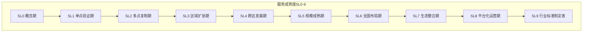
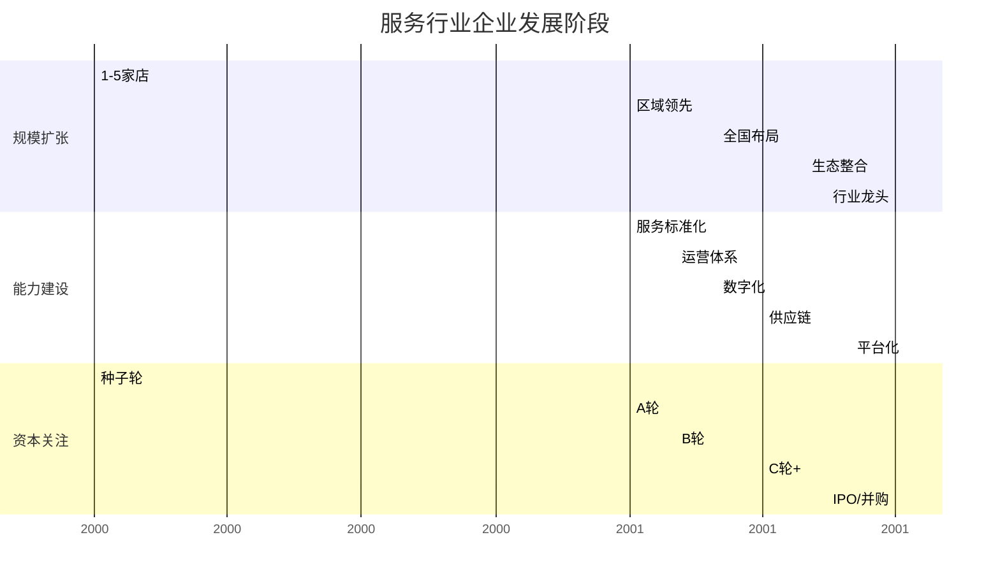
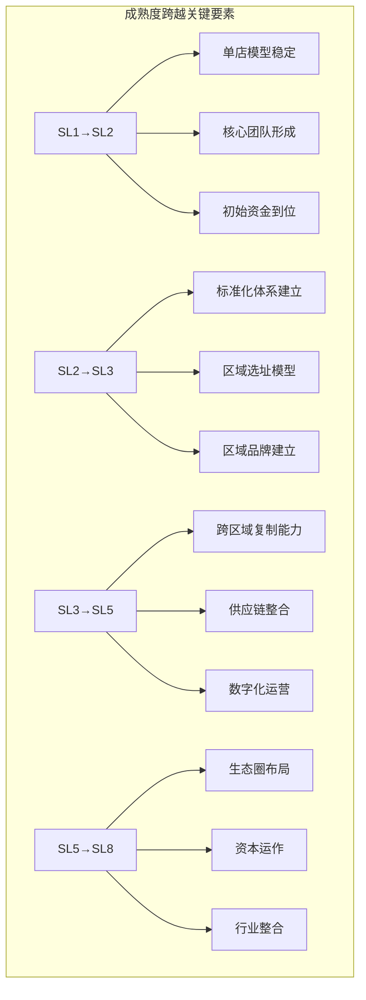

# 服务成熟度对标体系

## 一、成熟度等级体系（SL0-9）

借鉴技术尽调TRL体系和文创尽调CL体系，设计服务行业成熟度等级（Service Level, SL）。

## 二、等级定义详解

### SL0：概念期

| 维度 | 说明 |
|-----|------|
| 阶段特征 | 仅有商业计划书，尚未开始实际运营 |
| 产品/服务 | 无成型服务，仅有构想 |
| 商业模式 | 理论模型，未经验证 |
| 团队规模 | 创始人/创始团队，无实际服务人员 |
| 资金来源 | 种子轮/自有资金 |
| **典型标志** | 无实际服务记录、无客户验证 |

### SL1：单点验证期

| 维度 | 说明 |
|-----|------|
| 阶段特征 | 1家门店/服务点，验证核心服务模型 |
| 产品/服务 | 单店运营，模型打磨中 |
| 商业模式 | 单店经济模型验证 |
| 团队规模 | <20人，创始人亲自参与服务 |
| 盈利能力 | 盈亏平衡附近或小幅亏损 |
| **典型标志** | 1家旗舰店，单店模型尚未稳定 |

### SL2：多点复制期

| 维度 | 说明 |
|-----|------|
| 阶段特征 | 2-5家门店/服务点，初步验证可复制性 |
| 产品/服务 | 服务流程初步标准化 |
| 商业模式 | 2-5家店模型验证 |
| 团队规模 | 20-50人，建立基础管理架构 |
| 盈利能力 | 部分门店可能盈利，整体可能亏损 |
| **典型标志** | 2-5家门店，复制能力初步验证 |

### SL3：区域扩张期

| 维度 | 说明 |
|-----|------|
| 阶段特征 | 区域连锁，5-20家门店，区域领先 |
| 产品/服务 | 服务标准化成熟，品质稳定 |
| 商业模式 | 区域连锁商业模式验证 |
| 团队规模 | 50-200人，建立职能部门 |
| 盈利能力 | 开始盈利，盈利稳定性提升 |
| **典型标志** | 区域市场领先，建立区域品牌认知 |

### SL4：跨区发展期

| 维度 | 说明 |
|-----|------|
| 阶段特征 | 跨区域布局，20-50家门店 |
| 产品/服务 | 多区域服务能力，跨区标准化 |
| 商业模式 | 跨区域运营模式验证 |
| 团队规模 | 200-500人，建立区域管理架构 |
| 盈利能力 | 规模效应显现，盈利能力提升 |
| **典型标志** | 进入2个以上区域市场 |

### SL5：规模成熟期

| 维度 | 说明 |
|-----|------|
| 阶段特征 | 50-200家门店，全国知名，盈利稳定 |
| 产品/服务 | 高度标准化，可全国复制 |
| 商业模式 | 成熟商业模式，稳定盈利 |
| 团队规模 | 500-2000人，公司化运营 |
| 盈利能力 | 稳定盈利，现金流健康 |
| **典型标志** | 全国性品牌，规模化盈利能力验证 |

### SL6：全国布局期

| 维度 | 说明 |
|-----|------|
| 阶段特征 | 全国布局，200-500家门店 |
| 产品/服务 | 全国统一服务标准 |
| 商业模式 | 全国性商业模式 |
| 团队规模 | 2000-5000人，集团化管理 |
| 盈利能力 | 规模效应显著，成本优势明显 |
| **典型标志** | 全国主要城市覆盖 |

### SL7：生态整合期

| 维度 | 说明 |
|-----|------|
| 阶段特征 | 500家+门店，供应链深度整合 |
| 产品/服务 | 自有品牌/自有供应链 |
| 商业模式 | 全产业链布局 |
| 团队规模 | 5000-10000人 |
| 盈利能力 | 产业链利润，生态价值 |
| **典型标志** | 供应链整合，自有品牌 |

### SL8：平台化运营期

| 维度 | 说明 |
|-----|------|
| 阶段特征 | 开放加盟/赋能，平台化运营 |
| 产品/服务 | 品牌+系统+供应链输出 |
| 商业模式 | 平台模式，轻重结合 |
| 团队规模 | 10000+人 |
| 盈利能力 | 平台收益，生态收益 |
| **典型标志** | 加盟/联营模式规模化 |

### SL9：行业标准制定者

| 维度 | 说明 |
|-----|------|
| 阶段特征 | 行业绝对龙头，规则制定者 |
| 产品/服务 | 行业标杆，定义行业标准 |
| 商业模式 | 多元化布局，生态主导 |
| 团队规模 | 10000+人 |
| 盈利能力 | 行业定价权，持续高盈利 |
| **典型标志** | 市场份额绝对领先，行业标准制定者 |

## 三、成熟度评估矩阵

### 3.1 多维度评估对照

| 评估维度 | SL1-2 | SL3-4 | SL5-6 | SL7-8 | SL9 |
|---------|-------|-------|-------|-------|-----|
| **规模指标** | 1-5家 | 5-50家 | 50-500家 | 500-2000家 | 2000家+ |
| **商业模式** | 单点验证 | 区域验证 | 全国复制 | 生态整合 | 平台生态 |
| **组织能力** | 创始人驱动 | 核心团队 | 公司化运营 | 集团化 | 资本运作 |
| **数字化能力** | 无/基础 | 业务信息化 | 数据驱动 | 智能决策 | AI赋能 |
| **品牌能力** | 无认知 | 区域认知 | 全国认知 | 品牌溢价 | 品牌垄断 |
| **护城河** | 无/弱 | 初步形成 | 多维叠加 | 生态壁垒 | 绝对壁垒 |
| **盈利能力** | 亏损/平衡 | 逐步盈利 | 稳定盈利 | 高盈利 | 行业定价权 |
| **资本价值** | 低 | 中 | 高 | 极高 | 顶级 |

### 3.2 发展阶段特征图

## 四、行业对标案例

### 4.1 餐饮行业

| 企业 | 业态 | 门店数 | 成熟度等级 | 发展阶段 |
|-----|------|-------|----------|---------|
| 半天妖烤鱼 | 烤鱼 | 1500+ | SL8 | 平台化运营期 |
| 海底捞 | 火锅 | 1300+ | SL9 | 行业标准制定者 |
| 瑞幸咖啡 | 咖啡 | 5000+ | SL9 | 行业标准制定者 |
| 喜茶 | 茶饮 | 800+ | SL7 | 生态整合期 |
| 费大厨 | 正餐 | 50+ | SL5 | 规模成熟期 |
| 墨爷米粉 | 米粉 | 10+ | SL3 | 区域扩张期 |
| 新面纪 | 面馆 | 1-3家 | SL2 | 多点复制期 |

### 4.2 家政行业

| 企业 | 业态 | 规模 | 成熟度等级 | 发展阶段 |
|-----|------|-----|----------|---------|
| 天鹅到家 | 综合家政 | 全国 | SL8 | 平台化运营期 |
| 58到家 | 综合家政 | 全国 | SL8 | 平台化运营期 |
| 轻喜到家 | 家政 | 全国 | SL6 | 全国布局期 |
| 泰维峰 | 家政培训 | 区域 | SL5 | 规模成熟期 |
| 社区家政 | 社区家政 | 本地 | SL2-3 | 区域扩张期 |

### 4.3 教育培训行业

| 企业 | 业态 | 规模 | 成熟度等级 | 发展阶段 |
|-----|------|-----|----------|---------|
| 新东方 | 综合培训 | 全国 | SL9 | 行业标准制定者 |
| 学而思 | K12 | 全国 | SL9 | 行业标准制定者 |
| 中公教育 | 职教 | 全国 | SL8 | 平台化运营期 |
| 华图教育 | 职教 | 全国 | SL8 | 平台化运营期 |
| 区域龙头 | 区域培训 | 区域 | SL5-6 | 规模成熟期 |

## 五、成熟度与投资建议

### 5.1 各阶段投资建议

| 成熟度 | 投资阶段 | 投资逻辑 | 关注重点 |
|-------|---------|---------|---------|
| SL0-1 | 种子/天使轮 | 团队+方向 | 创始人背景、市场判断 |
| SL2-3 | 天使/A轮 | 模型验证 | 单店模型、复制可行性 |
| SL4-5 | A/B轮 | 规模化验证 | 扩张能力、盈利验证 |
| SL6-7 | B/C轮 | 规模效应 | 竞争优势、壁垒深度 |
| SL8-9 | C轮+/PE | 行业整合 | 市场份额、护城河强度 |

### 5.2 成熟度跨越关键要素

### 5.3 成熟度评估核查清单

**基础信息：**
- [ ] 现有门店/服务点数量
- [ ] 覆盖城市/区域数量
- [ ] 运营年限

**业务验证：**
- [ ] 单店/单点经济模型是否验证
- [ ] 可复制性是否得到验证
- [ ] 跨区域运营能力是否具备

**组织能力：**
- [ ] 标准化体系是否建立
- [ ] 数字化能力是否具备
- [ ] 管理团队是否匹配规模

**财务表现：**
- [ ] 盈利情况（盈利/亏损/平衡）
- [ ] 现金流情况
- [ ] 增长趋势
