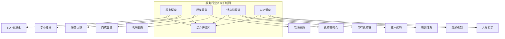
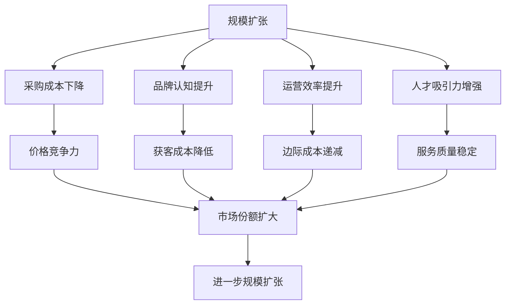
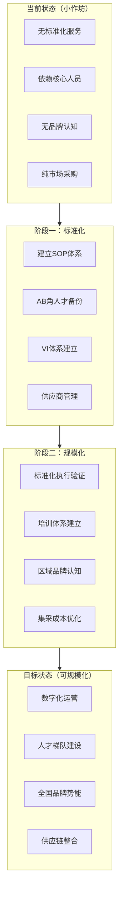

# 服务护城河分析框架

## 一、护城河评估体系

服务行业的护城河决定了企业的竞争壁垒和长期价值创造能力。



## 二、四大护城河详解

### 2.1 服务壁垒（权重30%）

**核心评估要素：**

| 要素 | 指标 | 评估标准 | 权重 |
|-----|-----|---------|-----|
| 服务标准化 | SOP完善程度 | >90%覆盖为优秀 | 40% |
| 专业资质 | 行业资质认证 | 齐全为优秀 | 30% |
| 服务认证 | ISO/行业认证 | 有认证为加分 | 15% |
| 服务品牌 | 服务商标注册 | 有注册为加分 | 15% |

**服务标准化成熟度：**

| 等级 | 特征 | 评估 |
|-----|-----|-----|
| L1 | 无标准化，纯经验服务 | ❌ |
| L2 | 初步标准化，执行不稳定 | ⚠️ |
| L3 | 标准化覆盖>50% | 🟡 |
| L4 | 标准化覆盖>80% | ✅ |
| L5 | 标准化+数字化，可复制 | ⭐ |

**服务壁垒核心指标：**

```
SOP覆盖率 = (已制定SOP的流程数 / 总流程数) × 100%
SOP执行率 = (实际执行SOP次数 / 应执行次数) × 100%
标准执行一致性 = 各门店服务差异度（越低越好）
```

### 2.2 规模壁垒（权重25%）

**核心评估要素：**

| 要素 | 指标 | 评估标准 |
|-----|-----|---------|
| 门店/服务点数量 | 绝对数量 | 区域领先 |
| 地理覆盖范围 | 城市/区域数量 | 全国>区域 |
| 市场份额 | 区域市场占比 | >20%为强势 |
| 网络效应 | 用户/门店协同 | 密度效应 |

**规模效应评估：**



**规模壁垒判断标准：**

| 规模等级 | 门店数量 | 规模壁垒强度 |
|---------|---------|-------------|
| 微型 | 1-3家 | ❌无壁垒 |
| 小型 | 4-10家 | ⚠️弱壁垒 |
| 中型 | 11-50家 | 🟡初步壁垒 |
| 大型 | 51-200家 | ✅规模壁垒 |
| 龙头 | 200家+ | ⭐⭐强壁垒 |

### 2.3 供应链壁垒（权重25%）

**核心评估要素：**

| 要素 | 指标 | 评估标准 |
|-----|-----|---------|
| 供应商整合 | 供应商数量与合作紧密度 | 战略合作>，松散采购 |
| 自有供应链 | 自有工厂/仓储/配送 | 自有为强 |
| 采购规模 | 采购量与议价能力 | 规模决定话语权 |
| 成本优势 | 与竞品成本差异 | 低10%+为优势 |

**供应链整合程度评估：**

| 整合程度 | 特征 | 护城河强度 |
|---------|-----|-----------|
| 纯采购型 | 市场化采购，无议价 | ❌ |
| 合作采购型 | 长期合作，有优惠 | ⚠️ |
| 战略合作型 | 深度绑定，优先供货 | 🟡 |
| 自有供应链 | 自产/自配/自销 | ✅ |
| 平台整合型 | 供应链SaaS对外赋能 | ⭐⭐ |

**餐饮行业供应链壁垒示例：**

| 类型 | 代表企业 | 壁垒特征 |
|-----|---------|---------|
| 中央厨房自建 | 海底捞旗下蜀海 | 生产标准化 |
| 源头直采 | 半天妖烤鱼 | 成本优势 |
| 冷链自配 | 叮咚买菜 | 配送壁垒 |
| 品牌定制 | 喜茶 | 差异化供应 |

### 2.4 人才壁垒（权重20%）

**核心评估要素：**

| 要素 | 指标 | 评估标准 |
|-----|-----|---------|
| 培训体系 | 培训时长/频率/内容 | 系统化为优 |
| 人员稳定性 | 流失率/年 | <20%为优秀 |
| 激励机制 | 薪酬/股权/晋升 | 完善为优 |
| 人才储备 | 人才梯队建设 | 有储备为优 |

**人才流失风险评估：**

| 流失率 | 等级 | 影响 |
|-------|-----|-----|
| <10% | ⭐极低 | 无影响 |
| 10-20% | ✅低 | 可控 |
| 20-35% | 🟡中 | 需关注 |
| 35-50% | 🟠高 | 风险较大 |
| >50% | 🔴极高 | 运营风险 |

**培训体系成熟度：**

| 等级 | 特征 | 评估 |
|-----|-----|-----|
| 无培训 | 上岗即服务 | ❌ |
| 简单培训 | 1-3天入职培训 | ⚠️ |
| 标准培训 | 1周以上系统培训 | 🟡 |
| 认证培训 | 持证上岗，定期复训 | ✅ |
| 学院培训 | 内部培训学院，晋升通道 | ⭐⭐ |

## 三、综合护城河评分

### 3.1 评分模型

| 护城河类型 | 权重 | 评分(0-100) | 加权得分 |
|-----------|-----|-------------|---------|
| 服务壁垒 | 30% | | |
| 规模壁垒 | 25% | | |
| 供应链壁垒 | 25% | | |
| 人才壁垒 | 20% | | |
| **综合得分** | 100% | | |

### 3.2 护城河等级判定

| 等级 | 得分 | 特征描述 | 投资建议 |
|-----|------|---------|---------|
| **S级** | 90-100 | 多维护城河叠加，龙头地位稳固 | 🔥强烈推荐 |
| **A级** | 80-89 | 2-3维护城河，竞争优势明显 | ✅推荐 |
| **B级** | 70-79 | 1-2维护城河，有被复制风险 | ⚠️谨慎 |
| **C级** | 60-69 | 单一护城河或壁垒薄弱 | ❌不推荐 |
| **D级** | <60 | 无明显护城河，纯价格竞争 | ❌明确不推荐 |

### 3.3 护城河结构图

```mermaid
radarChart
    title 护城河雷达图
    "服务壁垒": 85
    "规模壁垒": 70
    "供应链壁垒": 60
    "人才壁垒": 75
    "数据壁垒": 50
    "品牌壁垒": 80
```

## 四、小作坊vs可规模化判断

### 4.1 小作坊特征识别

| 特征维度 | 小作坊表现 | 风险评估 |
|---------|-----------|---------|
| 服务依赖 | 依赖1-2个核心服务人员 | 🔴极高 |
| 复制能力 | 无法复制，扩张即失控 | 🔴极高 |
| 标准化程度 | 无SOP或SOP形同虚设 | 🟠高 |
| 供应链 | 无议价能力，纯市场采购 | 🟠中 |
| 品牌认知 | 无品牌，客户纯价格敏感 | 🟠中 |
| 人才储备 | 无培养体系，人员流动性高 | 🟡中 |

### 4.2 可规模化特征

| 特征维度 | 可规模化表现 | 护城河评估 |
|---------|-------------|-----------|
| 服务标准化 | SOP完善，执行一致 | ✅ |
| 人才体系 | 培训体系+晋升通道 | ✅ |
| 供应链整合 | 自有或战略合作 | ✅ |
| 数字化能力 | 运营数据化，可监控 | ✅ |
| 品牌势能 | 一定品牌认知和溢价 | ✅ |
| 复制模型 | 单店/单点模型验证 | ✅ |

### 4.3 转型路径分析



## 五、行业护城河差异

### 5.1 各行业护城河侧重点

| 行业 | 最强护城河 | 次强护城河 | 壁垒强度 |
|-----|----------|----------|---------|
| 餐饮连锁 | 品牌+供应链 | 服务标准化 | ⭐⭐⭐⭐ |
| 家政服务 | 人才+培训 | 品牌口碑 | ⭐⭐⭐ |
| 教育培训 | 课程+师资 | 品牌口碑 | ⭐⭐⭐⭐ |
| 美容美发 | 服务技术 | 品牌装修 | ⭐⭐⭐ |
| 汽车服务 | 专业设备 | 技术资质 | ⭐⭐⭐ |

### 5.2 新兴业态护城河

| 业态 | 新型护城河 | 特点 |
|-----|----------|-----|
| 共享厨房 | 平台流量 | 依赖平台 |
| 上门服务 | 技师资源 | 人员管理 |
| 订阅服务 | 会员体系 | 复购锁定 |
| 社区服务 | 地理密度 | 规模效应 |
