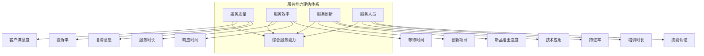

# 服务能力评估框架

## 一、评估维度总览

服务能力是服务行业企业的核心竞争力，直接影响客户体验、口碑传播和复购意愿。

## 二、评估维度详解

### 2.1 服务质量

**核心指标：**

| 指标 | 定义 | 优秀值 | 合格值 | 数据来源 |
|-----|------|-------|-------|---------|
| 客户满意度 | 服务后客户满意度评分 | >95% | >85% | 评价系统 |
| 投诉率 | 投诉单量/总服务单量 | <1% | <3% | 客服系统 |
| 复购意愿 | 客户表示会再次消费的比率 | >80% | >60% | 调研数据 |
| 好评率 | 好评数/总评价数 | >95% | >90% | 评价平台 |

**评估方法：**
1. 调取各平台（大众点评、美团、抖音等）评分数据
2. 统计投诉工单数量及处理时效
3. 通过客户回访或调研获取复购意愿数据
4. 对比行业均值进行横向评估

### 2.2 服务效率

**核心指标：**

| 指标 | 定义 | 优秀值 | 合格值 | 数据来源 |
|-----|------|-------|-------|---------|
| 平均服务时长 | 单次服务平均耗时 | 行业领先 | 行业均值 | 运营系统 |
| 响应时间 | 客户预约到确认时长 | <2小时 | <24小时 | 预约系统 |
| 等待时间 | 客户到店/等待服务时长 | <10分钟 | <30分钟 | 排队系统 |
| 准时率 | 按时完成服务占比 | >98% | >95% | 运营数据 |

**评估方法：**
1. 调取服务工单记录，统计各环节时长
2. 实地观察或抽查门店服务效率
3. 对比行业公开的服务时长标准

### 2.3 服务创新

**核心指标：**

| 指标 | 定义 | 评估标准 |
|-----|------|---------|
| 新服务推出频率 | 年度推出新服务/项目数量 | >3个/年为优秀 |
| 创新投入占比 | 研发/创新投入/营收 | >3%为优秀 |
| 技术应用程度 | 新技术在服务中的应用 | 扫码预约、智能推荐等 |
| 专利/著作权 | 自有知识产权数量 | 有专利为加分项 |

**评估方法：**
1. 访谈管理层了解创新规划
2. 审查研发/创新投入数据
3. 实地考察新服务/技术应用情况

### 2.4 服务人员能力

**核心指标：**

| 指标 | 定义 | 优秀值 | 合格值 |
|-----|------|-------|-------|
| 持证率 | 持有专业资格证书的人员占比 | >90% | >70% |
| 人均培训时长 | 年度培训时长/人 | >40小时 | >20小时 |
| 技能认证率 | 通过内部技能认证的人员占比 | >80% | >60% |
| 人员流失率 | 年度离职人员占比 | <20% | <35% |

**评估方法：**
1. 审查培训记录和证书台账
2. 访谈一线服务人员了解培训感受
3. 调取HR系统人员变动数据

## 三、行业差异化评估要点

### 3.1 餐饮行业

| 评估重点 | 关键指标 | 核查方式 |
|---------|---------|---------|
| 出餐速度 | 平均出餐时间 | 实地测试 |
| 餐品一致性 | 标准化程度 | 多店抽样对比 |
| 食品安全 | 证照、后厨管理 | 现场检查 |
| 服务态度 | 顾客反馈 | 评价数据分析 |

### 3.2 家政行业

| 评估重点 | 关键指标 | 核查方式 |
|---------|---------|---------|
| 清洁效果 | 客户验收满意度 | 回访数据 |
| 工具专业度 | 设备工具配备 | 实地查看 |
| 人员背景 | 身份核验、保险 | 档案抽查 |
| 隐私保护 | 客户信息安全 | 制度核查 |

### 3.3 教育培训行业

| 评估重点 | 关键指标 | 核查方式 |
|---------|---------|---------|
| 教学效果 | 学员满意度、就业率 | 毕业生追踪 |
| 师资水平 | 持证率、教学经验 | 师资档案 |
| 课程设计 | 体系完整性、更新 | 课程大纲审查 |
| 课后服务 | 答疑、作业批改 | 学员调研 |

## 四、综合评分标准

| 等级 | 得分 | 特征描述 |
|-----|------|---------|
| **S级** | 90-100 | 各维度全面领先，客户体验极佳 |
| **A级** | 80-89 | 核心维度优秀，整体服务能力突出 |
| **B级** | 70-79 | 主要维度达标，有提升空间 |
| **C级** | 60-69 | 基本服务能保证，竞争力不足 |
| **D级** | <60 | 服务问题频发，客户体验差 |

## 五、数据采集清单

| 数据项 | 采集方式 | 优先级 |
|-------|---------|-------|
| 各平台评分数据 | 公开数据采集 | 高 |
| 客户投诉记录 | 企业提供 | 高 |
| 服务工单数据 | 企业提供 | 高 |
| 培训记录 | 企业提供 | 中 |
| 人员资质证书 | 现场抽查 | 高 |
| 创新项目清单 | 访谈+资料 | 中 |

## 六、常见问题识别

| 问题类型 | 识别信号 | 风险等级 |
|---------|---------|---------|
| 服务质量下滑 | 评分下降趋势 | 🔴高 |
| 过度依赖头部员工 | 服务能力不稳定 | 🟠中高 |
| 培训流于形式 | 持证率高但实际技能差 | 🟠中高 |
| 投诉处理不当 | 差评率高、舆情危机 | 🔴高 |
| 标准化执行不到位 | 各店服务差异大 | 🟡中 |
