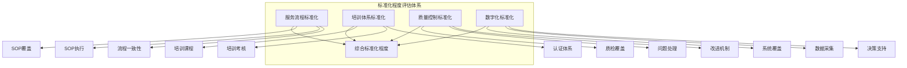
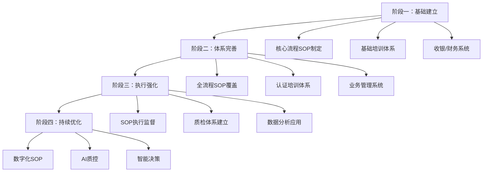

# 标准化程度评估框架

## 一、标准化评估体系

标准化程度是服务行业可规模化的核心基础，决定了复制能力和质量稳定性。



## 二、核心评估维度

### 2.1 服务流程标准化

**SOP体系评估：**

| 评估项 | 指标 | 优秀值 | 合格值 | 评估方法 |
|-------|-----|-------|-------|---------|
| SOP覆盖率 | 已制定SOP的流程/总流程 | >90% | >70% | 流程清单核查 |
| SOP完善度 | SOP内容完整性评分 | >90分 | >70分 | SOP文本审查 |
| SOP执行率 | 实际执行次数/应执行次数 | >95% | >85% | 抽查工单/监控 |
| 流程一致性 | 各门店流程差异度 | <5% | <15% | 多店对比 |

**SOP体系成熟度等级：**

| 等级 | 特征 | 评估 |
|-----|-----|-----|
| L1 | 无SOP，纯经验驱动 | ❌ |
| L2 | 部分SOP，不系统 | ⚠️ |
| L3 | 核心流程有SOP | 🟡 |
| L4 | 完整SOP体系 | ✅ |
| L5 | SOP+数字化融合 | ⭐ |

**服务流程SOP清单（示例）：**

| 流程类别 | 餐饮 | 家政 | 教育 |
|---------|-----|------|-----|
| 接待流程 | 迎宾→点餐→上菜→结账 | 预约→上门→服务→回访 | 咨询→试听→签约→排课 |
| 服务标准 | 出餐时间、温度、口味 | 清洁标准、工具使用 | 教学流程、互动要求 |
| 异常处理 | 投诉处理、退换货 | 返工、投诉处理 | 调课、投诉处理 |
| 收尾流程 | 翻台、消毒、备餐 | 验收、归档、回访 | 课后作业、续费 |

### 2.2 培训体系标准化

**培训体系评估：**

| 评估项 | 指标 | 优秀值 | 合格值 |
|-------|-----|-------|-------|
| 培训课程数 | 体系化培训课程数量 | >20门 | >10门 |
| 培训时长 | 新员工培训时长 | >40小时 | >20小时 |
| 在岗培训 | 年度人均培训时长 | >40小时 | >20小时 |
| 考核通过率 | 培训后考核通过率 | >90% | >75% |
| 持证率 | 持证人员占比 | >90% | >70% |

**培训体系成熟度：**

| 等级 | 特征 | 评估 |
|-----|-----|-----|
| L1 | 无培训，师傅带徒弟 | ❌ |
| L2 | 简单入职培训 | ⚠️ |
| L3 | 系统入职+定期培训 | 🟡 |
| L4 | 内部培训师+认证体系 | ✅ |
| L5 | 培训学院+在线学习 | ⭐ |

**培训体系核心内容：**

```
新人培训体系：
├── 企业文化（4小时）
├── 服务标准SOP（8小时）
├── 技能实操（16小时）
├── 考核认证（8小时）
└── 跟岗实习（按岗位定）

在岗提升体系：
├── 月度技能提升
├── 季度考核认证
├── 年度晋升培训
└── 专项技能培训
```

### 2.3 质量控制标准化

**质量控制体系评估：**

| 评估项 | 指标 | 优秀值 | 合格值 |
|-------|-----|-------|-------|
| 质检覆盖率 | 被质检的服务占比 | >50% | >30% |
| 质检频次 | 人均质检次数/月 | >2次 | >1次 |
| 问题整改率 | 问题整改完成率 | >95% | >85% |
| 客户满意度 | 客户评分 | >4.5分 | >4.0分 |
| 投诉处理时效 | 平均处理时长 | <4小时 | <24小时 |

**质量控制机制：**

| 控制类型 | 方式 | 频率 | 责任部门 |
|---------|-----|-----|---------|
| 神秘顾客 | 暗访体验 | 月度 | 质检部 |
| 视频监控 | 抽查监控 | 实时 | 运营部 |
| 客户回访 | 电话/短信 | 抽样 | 客服部 |
| 现场巡检 | 突击检查 | 不定期 | 区域管理 |
| 同行互检 | 交叉检查 | 季度 | 总部 |

### 2.4 数字化标准化

**数字化能力评估：**

| 评估项 | 指标 | 优秀值 | 合格值 |
|-------|-----|-------|-------|
| 核心系统覆盖 | 核心业务系统化率 | >95% | >80% |
| 数据采集自动化 | 自动采集数据占比 | >90% | >70% |
| 移动端覆盖 | 移动办公覆盖率 | 100% | >80% |
| 数据分析应用 | 数据驱动决策比例 | >70% | >50% |

**数字化成熟度：**

| 等级 | 特征 | 评估 |
|-----|-----|-----|
| L1 | 手工记账，无系统 | ❌ |
| L2 | 基础收银/财务系统 | ⚠️ |
| L3 | 业务系统化 | 🟡 |
| L4 | 数据采集分析 | ✅ |
| L5 | AI辅助决策 | ⭐ |

## 三、综合评分标准

### 3.1 评分模型

| 评估维度 | 权重 | 评分(0-100) | 加权得分 |
|---------|-----|-------------|---------|
| 服务流程标准化 | 35% | | |
| 培训体系标准化 | 25% | | |
| 质量控制标准化 | 25% | | |
| 数字化标准化 | 15% | | |
| **综合得分** | 100% | | |

### 3.2 标准化等级判定

| 等级 | 得分 | 特征描述 | 复制能力 |
|-----|------|---------|---------|
| **S级** | 90-100 | 行业标杆，标准化程度极高 | ⭐⭐⭐⭐⭐ |
| **A级** | 80-89 | 标准化完善，可高质量复制 | ⭐⭐⭐⭐ |
| **B级** | 70-79 | 核心标准化，复制有一定风险 | ⭐⭐⭐ |
| **C级** | 60-69 | 基础标准化，复制质量难保证 | ⭐⭐ |
| **D级** | <60 | 标准化薄弱，难以复制 | ⭐ |

### 3.3 标准化成熟度雷达图

```mermaid
radarChart
    title 标准化成熟度雷达图
    "服务流程": 85
    "培训体系": 70
    "质量控制": 75
    "数字化": 60
    "制度完善": 80
    "执行一致": 70
```

## 四、标准化建设路径

### 4.1 建设阶段



### 4.2 行业标准化重点

| 行业 | 标准化核心 | 难点 | 重点突破 |
|-----|----------|-----|---------|
| 餐饮 | 出品标准化 | 口味一致性 | 中央厨房+标准化操作 |
| 家政 | 服务标准化 | 服务质量主观 | 量化标准+工具规范 |
| 教育 | 教学标准化 | 教学效果差异 | 教案+师训+质检 |
| 美容 | 技术标准化 | 技师手法 | 手法培训+工具标准化 |

## 五、数据采集与核查

### 5.1 核查清单

**SOP体系：**
- [ ] 是否有完整的SOP文档体系
- [ ] SOP是否覆盖核心服务流程
- [ ] SOP更新频率与版本管理
- [ ] SOP执行监督机制

**培训体系：**
- [ ] 是否有体系化培训课程
- [ ] 培训师资质与数量
- [ ] 培训考核机制
- [ ] 培训效果跟踪

**质控体系：**
- [ ] 质检人员配置
- [ ] 质检方式与频率
- [ ] 问题处理流程
- [ ] 改进闭环机制

**数字化：**
- [ ] 核心业务系统清单
- [ ] 数据采集完整度
- [ ] 数据分析应用情况

### 5.2 现场核查要点

1. **门店抽查**：随机抽查2-3家门店，对照SOP进行服务体验
2. **员工访谈**：访谈一线员工，了解培训执行情况
3. **系统演示**：现场演示核心业务系统功能
4. **文档审查**：审查SOP、培训、质检等文档资料
