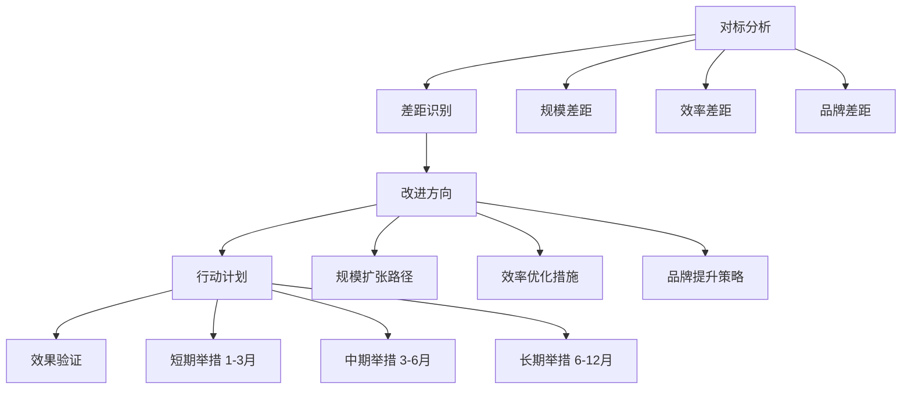

# 行业对标案例库

## 一、餐饮行业标杆

### 1.1 火锅业态

| 企业 | 门店数 | 成熟度 | 核心优势 | 人效 | 模式亮点 |
|-----|-------|-------|---------|-----|---------|
| 海底捞 | 1300+ | SL9 | 服务壁垒、人才培养 | 高 | 师徒制、计件工资 |
| 巴奴毛肚 | 100+ | SL6 | 产品主义、食材壁垒 | 高 | 特色食材+服务升级 |
| 凑凑火锅 | 200+ | SL6 | 场景创新、客单价高 | 高 | 茶饮+火锅复合 |
| 呷哺呷哺 | 500+ | SL7 | 标准化、快餐化 | 中高 | 小火锅+一人食 |

### 1.2 茶饮业态

| 企业 | 门店数 | 成熟度 | 核心优势 | 人效 | 模式亮点 |
|-----|-------|-------|---------|-----|---------|
| 瑞幸咖啡 | 5000+ | SL9 | 数字化、规模壁垒 | 极高 | APP私域+数据驱动 |
| 喜茶 | 800+ | SL7 | 品牌溢价、产品创新 | 高 | 创意营销+新品研发 |
| 霸王茶姬 | 2000+ | SL7 | 品类创新、规模扩张 | 高 | 原叶鲜奶茶 |
| 古茗 | 4000+ | SL8 | 供应链、乡镇下沉 | 高 | 密集布局+供应链 |

### 1.3 快餐业态

| 企业 | 门店数 | 成熟度 | 核心优势 | 人效 | 模式亮点 |
|-----|-------|-------|---------|-----|---------|
| 半天妖烤鱼 | 1500+ | SL8 | 合伙人模式、标准化 | 高 | 投资合伙+标准化 |
| 塔斯汀 | 3000+ | SL7 | 中国汉堡、国潮 | 高 | 本土化创新+低价 |
| 袁记云饺 | 3000+ | SL7 | 生鲜饺子、社区店 | 高 | 现包水饺+社区密集 |
| 紫妹米线 | 500+ | SL5 | 云南特色、区域深耕 | 中 | 区域特色+标准化 |

### 1.4 正餐业态

| 企业 | 门店数 | 成熟度 | 核心优势 | 人效 | 模式亮点 |
|-----|-------|-------|---------|-----|---------|
| 西贝莜面村 | 300+ | SL7 | 品质壁垒、地方特色 | 中高 | 明档厨房+品质 |
| 外婆家 | 100+ | SL6 | 高性价比、标准化 | 中 | 快时尚+高翻台 |
| 绿茶餐厅 | 200+ | SL6 | 杭帮菜、性价比 | 中 | 场景+性价比 |

## 二、家政行业标杆

### 2.1 平台型

| 企业 | 规模 | 成熟度 | 核心优势 | 模式亮点 |
|-----|-----|-------|---------|---------|
| 天鹅到家 | 全国 | SL8 | 品牌、规模、培训 | 平台+自营培训 |
| 58到家 | 全国 | SL8 | 流量、平台整合 | 平台撮合模式 |
| 轻喜到家 | 全国 | SL6 | 标准化、品质 | 自营+标准化 |
| 好慷在家 | 全国 | SL6 | 员工制、服务品质 | 员工制家政 |

### 2.2 垂直型

| 企业 | 规模 | 成熟度 | 核心优势 | 模式亮点 |
|-----|-----|-------|---------|---------|
| 泰维峰 | 区域龙头 | SL5 | 培训体系、人才输出 | 培训+派遣 |
| 51家庭管家 | 全国 | SL5 | 员工制、保险 | 全员工+保险 |
| 好孕妈妈 | 全国 | SL5 | 月嫂、医护 | 专业月嫂+培训 |

## 三、教育培训行业标杆

### 3.1 综合培训

| 企业 | 规模 | 成熟度 | 核心优势 | 模式亮点 |
|-----|-----|-------|---------|---------|
| 新东方 | 全国 | SL9 | 品牌、师资、品类 | 全品类+线上线下 |
| 好未来 | 全国 | SL9 | 教研、师资、技术 | 学而思网校+线下 |
| 中公教育 | 全国 | SL8 | 课程、渠道、师资 | 公考+职教全品类 |

### 3.2 职业教育

| 企业 | 规模 | 成熟度 | 核心优势 | 模式亮点 |
|-----|-----|-------|---------|---------|
| 华图教育 | 全国 | SL8 | 师资、课程、渠道 | 公考+职教 |
| 粉笔教育 | 全国 | SL7 | 线上、技术、师资 | 线上为主+智能 |
| 达内教育 | 全国 | SL6 | IT培训、就业 | 培训+就业 |

### 3.3 素质教育

| 企业 | 规模 | 成熟度 | 核心优势 | 模式亮点 |
|-----|-------|-------|---------|---------|
| 编程猫 | 全国 | SL6 | 课程、师资、技术 | 编程教育 |
| 美术宝 | 全国 | SL6 | 在线美术、1对1 | 在线1对1 |
| 斑马 | 全国 | SL6 | AI互动、幼儿 | AI互动+低龄 |

## 四、美容美发行业标杆

| 企业 | 规模 | 成熟度 | 核心优势 | 模式亮点 |
|-----|-------|-------|---------|---------|
| 东田造型 | 全国 | SL6 | 品牌、技术、高端 | 高端美发+造型 |
| 文峰美容 | 全国 | SL6 | 培训、连锁、自有产品 | 美容+培训+产品 |
| 丝域养发 | 全国 | SL5 | 细分品类、标准化 | 养发细分+连锁 |

## 五、健身行业标杆

| 企业 | 规模 | 成熟度 | 核心优势 | 模式亮点 |
|-----|-------|-------|---------|---------|
| 超级猩猩 | 全国 | SL6 | 团课、标准化、体验 | 团课+按次付费 |
| 乐刻健身 | 全国 | SL7 | 数字化、24小时、月卡 | 数字化+低门槛 |
| 威尔仕 | 全国 | SL6 | 高端、私教、会员 | 高端会籍+私教 |

## 六、关键成功要素分析

### 6.1 餐饮行业成功要素

| 成功要素 | 案例支撑 | 权重 |
|---------|---------|-----|
| 服务标准化 | 海底捞服务SOP | ⭐⭐⭐⭐⭐ |
| 供应链整合 | 半天妖自有供应链 | ⭐⭐⭐⭐⭐ |
| 品牌建设 | 喜茶品牌溢价 | ⭐⭐⭐⭐ |
| 数字化运营 | 瑞幸APP私域 | ⭐⭐⭐⭐⭐ |
| 人才培养 | 海底捞师徒制 | ⭐⭐⭐⭐ |
| 规模效应 | 古茗密集开店 | ⭐⭐⭐⭐ |

### 6.2 家政行业成功要素

| 成功要素 | 案例支撑 | 权重 |
|---------|---------|-----|
| 培训体系 | 天鹅到家培训 | ⭐⭐⭐⭐⭐ |
| 标准化服务 | 好慷员工制 | ⭐⭐⭐⭐ |
| 品牌信任 | 58到家品牌 | ⭐⭐⭐⭐ |
| 技师管理 | 技师留存激励 | ⭐⭐⭐⭐ |
| 数字化调度 | 智能派单系统 | ⭐⭐⭐ |

### 6.3 教育培训成功要素

| 成功要素 | 案例支撑 | 权重 |
|---------|---------|-----|
| 课程研发 | 好未来教研 | ⭐⭐⭐⭐⭐ |
| 师资储备 | 新东方师资 | ⭐⭐⭐⭐⭐ |
| 渠道布局 | 中公渠道下沉 | ⭐⭐⭐⭐ |
| 品牌认知 | 新东方品牌 | ⭐⭐⭐⭐ |
| 运营效率 | 直播双师大班 | ⭐⭐⭐⭐ |

## 七、对标分析模板

### 7.1 被评估企业对标表

| 对标维度 | 被评估企业 | 行业标杆A | 行业标杆B | 差距分析 |
|---------|-----------|----------|----------|---------|
| 门店数量 | | | | |
| 成熟度等级 | | | | |
| 人均营收 | | | | |
| 客单价 | | | | |
| 复购率 | | | | |
| 标准化程度 | | | | |
| 数字化程度 | | | | |
| 品牌评分 | | | | |

### 7.2 提升建议框架

