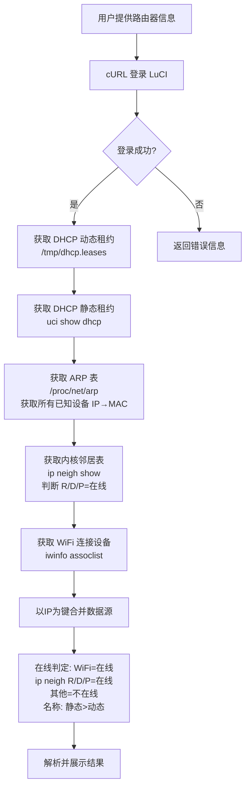

# OpenWRT Router

## 概述

通过 LuCI RPC API 远程管理 OpenWRT 路由器，无需 SSH 或 telnet。使用 curl + HTTP Cookie 认证，通过 `cgi-bin/luci/rpc/sys` 接口执行 shell 命令。

## 原理

### 认证流程

1. 用用户名/密码 POST 登录 LuCI 登录页面
2. 保存返回的 `sysauth` cookie
3. 用 cookie + RPC API 执行命令

### RPC API 地址

```
POST http://<router-ip>/cgi-bin/luci/rpc/sys?auth=<sysauth_token>
```

参数为 JSON: `{"method":"exec","params":["<shell_command>"]}`
返回 JSON: `{"id":null,"result":"<stdout>","error":null}`

## 多路由器管理

支持同时管理多台 OpenWRT 路由器，通过别名（如 "家"、"租房"）来区分。

### 配置方式

在 `TOOLS.md` 中记录路由器信息：

```markdown
### OpenWRT 路由器

- **家** 
  - IP: 192.168.123.1
  - 用户: root
  - 密码: xxx
- **租房**
  - IP: 192.168.125.1  
  - 用户: root
  - 密码: xxx
```

### 使用方式

用户可以说：
- "看看家里路由器的联网情况"
- "租房那边有人蹭网吗"
- "查一下家里的 DHCP 租约"
- "看看租房装了哪些软件"

### 网络打通的情况

如果路由器之间网络已打通（如通过 WireGuard、Tailscale、FRP 等），一台机器就可以直接管理所有路由器，只需切换目标 IP 即可。

## 前置条件

- 需要 `curl` 命令
- 用户提供：路由器 IP、用户名、密码（或记录在 TOOLS.md 中）

## 核心操作

### 1. 登录路由器

```bash
curl -s -m 10 -X POST "http://<router_ip>/cgi-bin/luci/" \
  -d "luci_username=root&luci_password=<password>" \
  -c /tmp/luci_cookies.txt -w "%{http_code}" -o /dev/null
# 返回 302 Found 表示登录成功
```

登录成功后 cookie 文件包含 `sysauth` 或 `sysauth_http` token。

### 2. 执行命令

```bash
SYS_AUTH=$(grep sysauth /tmp/luci_cookies.txt | awk '{print $NF}')
curl -s -m 10 -b /tmp/luci_cookies.txt \
  -H "Content-Type: application/json" \
  -X POST "http://<router_ip>/cgi-bin/luci/rpc/sys?auth=$SYS_AUTH" \
  -d '{"method":"exec","params":["<command>"]}'
```

命令由路由器 shell 执行，支持管道和重定向。如需过滤输出，推荐在后端处理（如 Python/awk），以减少路由器负载。

### 3. 常用命令

#### 查看联网设备（综合查询）

**推荐方式**：同时查询DHCP动态租约、DHCP静态租约、ARP表和WiFi设备，获取完整的联网设备列表（包括名称）。

```bash
# 1. DHCP动态租约 - 显示通过DHCP获取IP的设备
cat /tmp/dhcp.leases

# 2. DHCP静态租约（静态IP绑定） - 显示在路由器中设置了静态IP/备注的设备
uci show dhcp | grep -E "dhcp\.@host\[[0-9]+\]\.(name|ip|mac)="

# 3. ARP表 - 显示所有活跃设备（包括静态IP设备）
cat /proc/net/arp

# 4. WiFi连接设备
iwinfo phy0-ap0 assoclist  # 2.4G
iwinfo phy1-ap0 assoclist  # 5G
```

**设备发现优先级**：
1. **ARP表** - 最全面，显示所有在局域网中活跃的设备（包括静态IP）
2. **DHCP静态租约** - 提供用户在路由器中设置的设备名称/备注（即使设备当前离线也能查到）
3. **WiFi列表** - 显示无线连接设备及信号强度
4. **DHCP动态租约** - 显示通过DHCP获取IP的设备

#### 查看 DHCP 动态租约（通过DHCP获取IP的设备）

```bash
cat /tmp/dhcp.leases
```

输出格式：`租约过期时间 MAC地址 IP地址 主机名`

#### 查看 DHCP 静态租约（手动绑定的静态IP及备注）

```bash
uci show dhcp | grep -E "dhcp\.@host\[[0-9]+\]\.(name|ip|mac)="
```

输出格式：
```
dhcp.@host[0].name='设备名'
dhcp.@host[0].ip='192.168.123.xxx'
dhcp.@host[0].mac='XX:XX:XX:XX:XX:XX'
```

静态租约包含用户在路由器 LuCI → 网络 → DHCP/DNS → 静态地址分配 中配置的所有设备名称（备注），即使设备当前离线也能查到名称。

#### 查看 ARP 表（所有活跃设备）

```bash
cat /proc/net/arp
```

输出格式：`IP地址 硬件类型 标志 MAC地址 掩码 设备`

#### 查看 WiFi 连接设备

```bash
iwinfo <interface> assoclist
```

先用以下命令查看无线接口名：

```bash
iwinfo 2>/dev/null | grep ESSID
# 或
iw dev
```

#### 查看无线接口列表

```bash
ls /sys/class/net/
# 用 grep 过滤 ESSID
iwinfo 2>/dev/null | grep -E "ESSID" 
```

#### 获取系统负载/运行时间

```bash
uptime
cat /proc/loadavg
```

#### 查看活跃连接数

```bash
cat /proc/net/nf_conntrack 2>/dev/null | wc -l
```

### 4. 数据解析示例

从 DHPC 租约拿到纯文本后用 `\u000a`（Python 的 `\n` 换行 Unicode 转义）分隔行：

```json
{"result": "MAC1 IP1 Name1\u000aMAC2 IP2 Name2\u000a"}
```

WiFi assoclist 输出格式：

```
MAC_ADDRESS  -XX dBm / -XX dBm (SNR XX)  XXX ms ago
     RX: XX MBit/s, MCS X, XXMHz     XXX Pkts.
     TX: XX MBit/s, MCS X, XXMHz     XXX Pkts.
```

- `RX` = 接收速率
- `TX` = 发送速率
- `dBm` 越小信号越差（负值）
- `SNR` = 信噪比，越高越好

## 使用流程



### 设备发现策略

为了全面显示联网设备，并为每个IP获取设备名称和准确的在线状态，需要综合使用以下**五种**数据源：

1. **ARP表** (`/proc/net/arp`) - 获取所有已知设备的 `IP ↔ MAC` 对应关系（设备清单）
2. **内核邻居表** (`ip neigh show`) - **用于准确判断在线状态**（REACHABLE/DELAY/PROBE=在线, STALE/FAILED=不在线）
3. **WiFi列表** (`iwinfo assoclist`) - 显示无线连接设备及信号强度（连接WiFi一定在线）
4. **DHCP动态租约** (`/tmp/dhcp.leases`) - 提供通过DHCP获取IP的设备名称
5. **DHCP静态租约** (`uci show dhcp`) - 提供用户在路由器中手动绑定的静态IP及备注名称

**在线/不在线判定规则（重要）**：
| 条件 | 判定 | 说明 |
|------|------|------|
| MAC 在 WiFi assoclist 中 | ✅ **在线** | 设备正连着 WiFi，100% 在线 |
| `ip neigh show` 状态为 **REACHABLE** | ✅ **在线** | 内核确认设备可达（~30秒内） |
| `ip neigh show` 状态为 **DELAY** | ✅ **在线** | 刚从设备收到通信，正在确认 |
| `ip neigh show` 状态为 **PROBE** | ✅ **在线** | 正在主动探测，设备应在线 |
| `ip neigh show` 状态为 **STALE** | ❌ **不在线** | 缓存状态，设备可能已离线数小时 |
| `ip neigh show` 状态为 **FAILED** | ❌ **不在线** | 确认不可达 |
| 其他（INCOMPLETE 等） | ❌ **不在线** | 无响应或未完成 |

> ⚠️ **不用 arp_flags 判断在线**：ARP Flags `0x2` 只是表示 MAC 地址已知，不代表设备当前在线。设备离线后 ARP 缓存可能持续数小时甚至数天。

**合并逻辑**（以IP为主键）：
- 遍历ARP表，获取所有已知设备的 `IP → MAC` 对，作为设备清单
- 遍历`ip neigh show`，标记 REACHABLE/DELAY/PROBE 状态的设备为"在线"
- 遍历WiFi列表，匹配MAC地址，标记为"在线"并记录信号强度
- 解析DHCP动态/静态租约，建立 `IP → 设备名` 映射（静态优先）
- 最终每条记录展示：**IP地址 + 设备名称 + MAC地址 + 在线状态 + 信号强度**

**名称优先级**：
1. DHCP静态租约名称（用户手动填写的备注）
2. DHCP动态租约名称（设备主动上报的主机名）
3. `<未知>`（以上都没有）

### 完整示例（Python）

```python
import json, subprocess, re
from collections import OrderedDict

def router_api(ip, password, cmd):
    # 1. 登录
    subprocess.run(["curl", "-s", "-m", "10", "-X", "POST",
        f"http://{ip}/cgi-bin/luci/",
        "-d", f"luci_username=root&luci_password={password}",
        "-c", "/tmp/luci_cookies.txt"])
    
    # 2. 读取 cookie（注意 cookie 名可能是 sysauth_http 或 sysauth）
    token = None
    with open("/tmp/luci_cookies.txt") as f:
        for line in f:
            if "sysauth" in line:
                token = line.strip().split()[-1]
    
    # 3. 执行命令
    r = subprocess.run(["curl", "-s", "-m", "10", "-b", "/tmp/luci_cookies.txt",
        "-H", "Content-Type: application/json",
        "-X", "POST", f"http://{ip}/cgi-bin/luci/rpc/sys?auth={token}",
        "-d", json.dumps({"method": "exec", "params": [cmd]})],
        capture_output=True, text=True)
    
    return json.loads(r.stdout).get("result", "")

def get_online_devices(ip, password):
    """获取所有设备及在线状态（ARP + ip neigh + 静态租约 + 动态租约 + WiFi）"""
    
    # 1. 获取五路数据
    arp_out = router_api(ip, password, "cat /proc/net/arp")
    neigh_out = router_api(ip, password, "ip neigh show")
    dhcp_out = router_api(ip, password, "cat /tmp/dhcp.leases")
    uci_out = router_api(ip, password, "uci show dhcp")
    # 动态检测所有无线接口并获取关联设备
    wifi_ifaces_raw = router_api(ip, password, "iwinfo 2>/dev/null | grep ESSID | awk '{print $1}'")
    wifi_combined = ""
    for iface in wifi_ifaces_raw.strip().split("\n"):
        iface = iface.strip()
        if iface:
            wifi_combined += router_api(ip, password, f"iwinfo {iface} assoclist") + "\n"
    
    devices = OrderedDict()
    
    # 2. 解析 ARP 表（设备清单：IP → MAC）
    for line in arp_out.strip().split("\n"):
        parts = line.split()
        if len(parts) >= 4 and parts[1] == "0x1":
            ip_addr, mac = parts[0], parts[3]
            if mac != "00:00:00:00:00:00":
                devices[ip_addr] = {"mac": mac.upper(), "name": "<未知>", "signal": "", "online": False}
    
    # 3. 解析 ip neigh（在线状态：REACHABLE/DELAY/PROBE=在线）
    for line in neigh_out.strip().split("\n"):
        parts = line.split()
        if len(parts) >= 4 and parts[1] == "dev":
            ip_addr, state = parts[0], parts[-1]
            if ip_addr in devices and state in ("REACHABLE", "DELAY", "PROBE"):
                devices[ip_addr]["online"] = True
    
    # 4. 解析 DHCP 动态租约（IP → 设备名）
    for line in dhcp_out.strip().split("\n"):
        parts = line.split()
        if len(parts) >= 4:
            mac, ip_addr, name = parts[1].upper(), parts[2], parts[3]
            if ip_addr in devices and devices[ip_addr]["name"] == "<未知>":
                devices[ip_addr]["name"] = name
            elif ip_addr not in devices:
                devices[ip_addr] = {"mac": mac, "name": name, "signal": "", "online": False}
    
    # 5. 解析 DHCP 静态租约（最高优先级）
    host_entries = {}
    for line in uci_out.strip().split("\n"):
        m = re.match(r"dhcp\.@host\[(\d+)]\.(\w+)='(.*)'", line)
        if m:
            idx, key, val = m.groups()
            host_entries.setdefault(idx, {})[key] = val
    for entry in host_entries.values():
        name, ip_addr, mac = entry.get("name", "<未知>"), entry.get("ip"), entry.get("mac", "").upper()
        if ip_addr:
            if ip_addr in devices:
                devices[ip_addr]["name"] = name
                if mac:
                    devices[ip_addr]["mac"] = mac
            else:
                devices[ip_addr] = {"mac": mac, "name": name, "signal": "", "online": False}
    
    # 6. 解析 WiFi 信号（WiFi 在线 = 确定在线）
    wifi_signals = {}
    for line in (wifi_2g + "\n" + wifi_5g).split("\n"):
        m = re.match(r"([0-9A-Fa-f:]{17})\s+(-\d+ dBm)", line)
        if m:
            wifi_signals[m.group(1).upper()] = m.group(2)
    
    for info in devices.values():
        if info["mac"] in wifi_signals:
            info["signal"] = wifi_signals[info["mac"]]
            info["online"] = True  # WiFi 设备一定在线
    
    return devices

# 使用示例
devices = get_online_devices("192.168.123.1", "your_password")
for ip, info in devices.items():
    sig = f"  {info['signal']}" if info['signal'] else ""
    status = "在线" if info["online"] else "不在线"
    print(f"  {status}  {ip:20s}  {info['mac']:17s}  {info['name']:30s}{sig}")
```

## 注意事项

- 密码中含有特殊字符（如 `@`、`#`、`$`）时，curl 的 `-d` 参数需要使用引号包裹
- 某些 OpenWRT 版本可能需要额外的 cookie 路径设置
- Cookie 名可能是 `sysauth_http`（新版 LuCI）或 `sysauth`（旧版），匹配时应使用 `sysauth` 模糊匹配
- 命令由路由器 shell 直接执行，支持管道(`|`)、重定向(`>`)等 shell 操作符
- 执行结果中含 `\u000a` 是 Unicode 换行符转义，需要 Python 的 `decode("unicode_escape")` 或 JSON 反序列化自动处理
- RPC API 返回的 `error` 字段为 `null` 表示成功
- 不是所有 OpenWRT 固件都预装 `iwinfo` 命令（新版可能用 `iw` 替代）
- 静态租约从 `uci show dhcp` 获取（对应 LuCI 界面 → 网络 → DHCP/DNS → 静态地址分配），可提供用户在路由器中填写的设备备注名称
