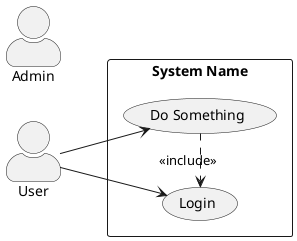
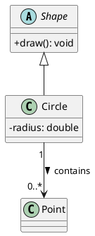
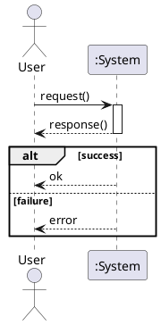
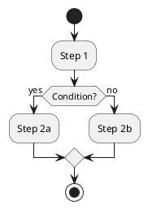
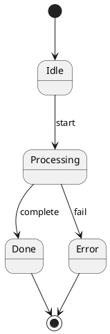
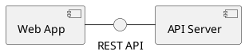
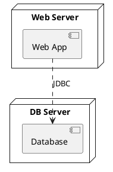
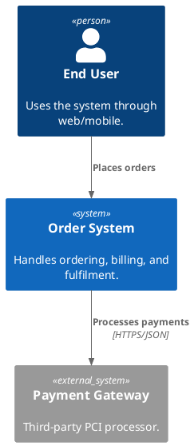

# PlantUML Diagram Generation

## One-Liner

```bash
java -jar ~/tools/plantuml.jar -tpng -charset UTF-8 file.puml
```

## Prerequisites

- **PlantUML jar:** `~/tools/plantuml.jar`
- **Graphviz:** Required for most diagram types. Verify with `dot -V`.
- **Java:** Required runtime. Verify with `java -version`.

If Graphviz is missing, sequence diagrams still render (they use the built-in lambda renderer), but other diagram types will fail.

## Security & Trust Notes

This skill is a local diagram-generation helper. It does not require credentials, account access, production data access, or background automation. It only documents how to write PlantUML source and render it with local Java/Graphviz tooling.

Rendering PlantUML executes the local PlantUML Java jar and, for most non-sequence diagrams, local Graphviz. Treat `.puml` files as source code: review diagrams before rendering when they come from untrusted input, and render inside a controlled workspace.

Most examples use PlantUML's local stdlib. A few optional icon examples in `references/stdlib-guide.md` show external `!include` URLs for AWS/Azure/devicons; those may fetch resources from GitHub at render time. For sensitive/offline environments, mirror icon libraries locally or avoid URL-based includes.

## Quick Start

1. Write `.puml` source file (kebab-case filename).
2. Generate image:
   ```bash
   java -jar ~/tools/plantuml.jar -tpng -charset UTF-8 <file>.puml
   ```
3. PlantUML uses the word after `@startuml` as the output filename (e.g., `@startuml MyDiagram` → `MyDiagram.png`).
4. Attach the resulting PNG/SVG in your reply with a `MEDIA:<absolute-path>` directive line — OpenClaw delivers it.

## Diagram Types & Syntax

- Detailed per-type syntax: [references/syntax-guide.md](references/syntax-guide.md)
- Architecture stdlib (C4, Archimate, AWS, Azure): [references/stdlib-guide.md](references/stdlib-guide.md)
- Shared style include: [references/default-style.iuml](references/default-style.iuml)
- Ready-to-render examples: [examples/](examples/)

### Use Case Diagram



### Class Diagram



### Sequence Diagram



### Activity Diagram



### State Diagram



### Component Diagram



### Deployment Diagram



### C4 Architecture (System Context)



For Container, Component, Dynamic, and Deployment views, see [references/stdlib-guide.md](references/stdlib-guide.md).

## Themes & Shared Style

PlantUML supports built-in themes (set near the top, after `@startuml`):

```plantuml
!theme cerulean-outline   ' clean blue/white
!theme materia            ' material design
!theme plain              ' minimal black/white
!theme spacelab           ' light, professional
```

For consistent styling across diagrams, prefer the shared include:

```plantuml
@startuml MyDiagram
!include /home/guoxh/.openclaw/skills/plantuml/references/default-style.iuml
...
@enduml
```

The include sets sensible defaults: dpi 150, no shadows, professional fonts, consistent colors. Override per-diagram as needed.

## Key Conventions

- **File naming:** Use kebab-case for `.puml` filenames (e.g., `order-system-class.puml`).
- **Diagram label:** Always name `@startuml <PascalCaseName>` — this becomes the output filename.
- **Charset:** Always pass `-charset UTF-8` for CJK content.
- **Format:** Default to `-tpng`. Use `-tsvg` for vector output (zoomable, smaller for line art).
- **Batch:** Pass multiple `.puml` files in one command for efficiency.
- **Output directory:** Default is same directory as source. Use `-o <dir>` to specify a different output directory.
- **Style consistency:** `!include` the shared `default-style.iuml` for professional output.

## Rendering & Delivery Workflow

1. Write the `.puml` file to the workspace.
2. Render:
   ```bash
   java -jar ~/tools/plantuml.jar -tpng -charset UTF-8 <file>.puml
   ```
   Or use the wrapper:
   ```bash
   python3 ~/.openclaw/skills/plantuml/scripts/render.py <file>.puml
   ```
3. Verify the output file exists and is non-zero size:
   ```bash
   ls -la <DiagramName>.png
   ```
4. Attach in your reply by adding a line like:
   ```
   MEDIA:/absolute/path/to/DiagramName.png
   ```
   The directive must start the line as plain text (no markdown wrappers, not inside code fences). OpenClaw delivers the file via the active channel.

## Smoke Test

Verify the toolchain end-to-end after install or update:

```bash
cd ~/.openclaw/skills/plantuml/examples
java -jar ~/tools/plantuml.jar -tpng -charset UTF-8 sequence-sample.puml
ls -la SequenceSample.png   # should exist, non-zero
```

## Troubleshooting

| Problem | Solution |
|---------|----------|
| `Cannot run program "dot"` | Graphviz not installed. Sequence diagrams still work; others need `apt install graphviz`. |
| Empty output file (0 bytes) | Likely a syntax error. Run with `-v` flag to see detailed error output. |
| Smetana `UnsupportedOperationException` | Avoid `-Playout=smetana`; use Graphviz instead. |
| CJK garbled text | Ensure `-charset UTF-8` flag is set and source file is UTF-8. |
| Image too large/small | Add `-DPLANTUML_LIMIT_SIZE=16384` before the jar, or set `skinparam dpi` in source. |
| C4 stdlib not found | Requires PlantUML ≥ 1.2020.x. Verify with `java -jar ~/tools/plantuml.jar -version`. |
| `!include` file not found | Use absolute path or path relative to the `.puml` file. |

## Advanced: Output Size Control

```bash
# Increase max image size (default 4096)
java -DPLANTUML_LIMIT_SIZE=16384 -jar ~/tools/plantuml.jar -tpng -charset UTF-8 file.puml
```

Within the diagram:

```plantuml
skinparam dpi 150
```
