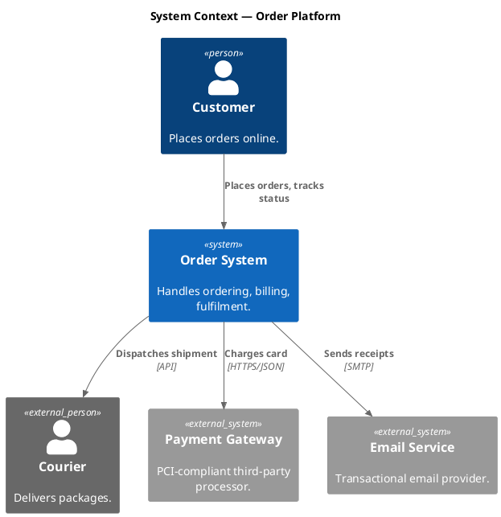
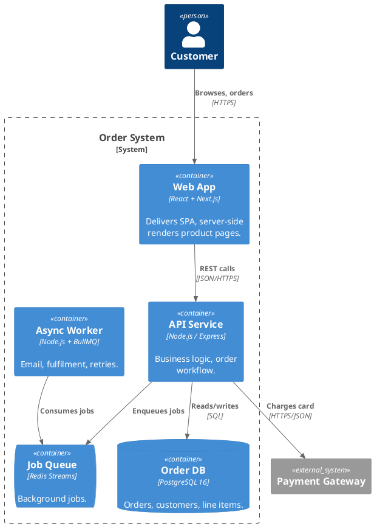
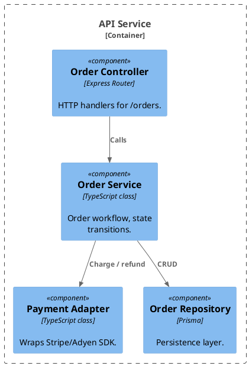
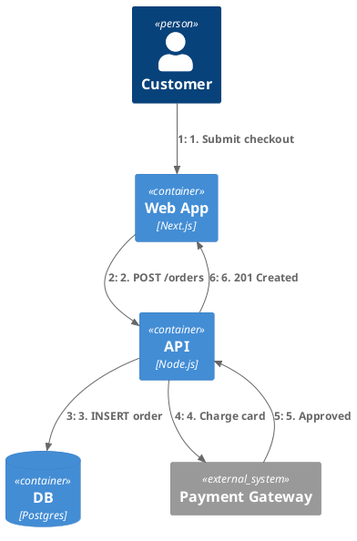

# PlantUML Standard Library Quick Reference

PlantUML ships with curated stdlib paths usable via `!include <name>`. These produce far better-looking architecture diagrams than raw component shapes.

## C4 Model (Simon Brown)

Four zoom levels: System Context → Container → Component → Code. Use the level that matches your audience.

### System Context



### Container



### Component



### Dynamic (sequence-style C4)



## Archimate (Enterprise Architecture)

```plantuml
@startuml ArchimateExample
!include <archimate/Archimate>

title Order Capability Map

Business_Actor(customer, "Customer")
Business_Process(order, "Order Processing")
Business_Service(orderSvc, "Online Ordering")
Application_Component(webApp, "Web Application")
Application_Component(apiApp, "Order API")
Technology_Service(db, "Database Service")
Technology_Node(server, "App Server")

Rel_Used(customer, orderSvc)
Rel_Realization(orderSvc, order)
Rel_Realization(webApp, orderSvc)
Rel_Used(webApp, apiApp)
Rel_Used(apiApp, db)
Rel_Assignment(server, apiApp)
@enduml
```

## AWS Architecture

```plantuml
@startuml AWSExample
!define AWSPuml https://raw.githubusercontent.com/awslabs/aws-icons-for-plantuml/v18.0/dist
!include AWSPuml/AWSCommon.puml
!include AWSPuml/Compute/EC2.puml
!include AWSPuml/Database/RDS.puml
!include AWSPuml/NetworkingContentDelivery/CloudFront.puml
!include AWSPuml/NetworkingContentDelivery/ElasticLoadBalancing.puml

left to right direction

CloudFront(cf, "CDN", "CloudFront")
ElasticLoadBalancing(alb, "ALB", "Application Load Balancer")
EC2(web1, "Web 1", "t3.medium")
EC2(web2, "Web 2", "t3.medium")
RDS(db, "Order DB", "PostgreSQL Multi-AZ")

cf --> alb
alb --> web1
alb --> web2
web1 --> db
web2 --> db
@enduml
```

Note: AWS icons need network access at render time, or pre-cache them locally. See https://github.com/awslabs/aws-icons-for-plantuml.

## Azure Architecture

```plantuml
@startuml AzureExample
!define AzurePuml https://raw.githubusercontent.com/plantuml-stdlib/Azure-PlantUML/release/2-9/dist
!include AzurePuml/AzureCommon.puml
!include AzurePuml/Compute/AzureAppService.puml
!include AzurePuml/Databases/AzureSQLDatabase.puml

AzureAppService(web, "Web App", "App Service Plan B2")
AzureSQLDatabase(db, "Order DB", "S2 Standard")

web --> db : ADO.NET
@enduml
```

## Tupadr3 Devicons (technology icons)

```plantuml
@startuml TechStack
!define DEVICONS https://raw.githubusercontent.com/tupadr3/plantuml-icon-font-sprites/master/devicons2
!include DEVICONS/python.puml
!include DEVICONS/postgresql.puml
!include DEVICONS/redis.puml
!include DEVICONS/nginx.puml

rectangle "<$python>\nAPI" as api
rectangle "<$postgresql>\nDB" as db
rectangle "<$redis>\nCache" as cache
rectangle "<$nginx>\nProxy" as proxy

proxy --> api
api --> db
api --> cache
@enduml
```

## Choosing the Right Stdlib

| Need | Use |
|------|-----|
| Software architecture (4 zoom levels) | C4 |
| Enterprise / business + IT alignment | Archimate |
| Cloud-vendor-specific deployment | AWS / Azure / GCP icons |
| Tech stack illustration with logos | Tupadr3 devicons |
| Generic boxes/lines | Plain `component` / `node` |

## Rendering Notes

- **Local stdlib** (`<C4/...>`, `<archimate/...>`) ships in the jar — no network needed.
- **External icon sets** (AWS, Azure, devicons) fetch from GitHub at render time when rendered exactly as URL-based examples. For sensitive or offline rendering, mirror the icon repos locally and include with reviewed absolute/local paths instead.
- **Untrusted diagrams**: review `.puml` source before rendering. PlantUML supports includes and local rendering helpers; keep untrusted inputs in a controlled workspace.
- **Themes interact with stdlibs**: C4 has its own visual style; avoid mixing `!theme` with `<C4/...>` unless you've tested the combination.
