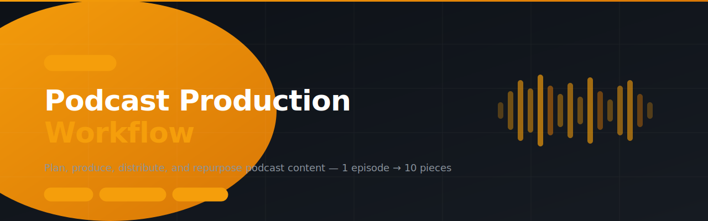

# podcast-production-workflow



> SKILL.md for AI agents — End-to-end podcast workflow from episode planning to Spotify/YouTube publishing and a 1-episode-to-10-pieces repurposing engine. Built for solo creators and Web3 project leads.

---

## Install

```
clawhub skill install podcast-production-workflow
```

Or paste the repo URL directly into your OpenClaw chat and the agent will install it automatically.

---

## What it does

6 modules, all in one skill:

| Module | What it solves |
| --- | --- |
| **Strategy & Content Planning** | Content pillars, episode bank generator, and show identity definition |
| **Pre-Production** | Episode outlines, segment structure, and guest research briefs |
| **Production Assets** | 5 title variants, show notes, timestamps, and YouTube descriptions |
| **Distribution & Publishing** | Spotify, Apple Podcasts, and YouTube publishing checklists |
| **Repurposing Engine** | Turn 1 episode into threads, carousels, clips, newsletters, and more |
| **Podcast Growth & Promotion** | Growth levers by stage — from 0 to 500+ listeners |

---

## Who it's for

Solo podcasters, Web3 project leads, community builders, and content creators who run a podcast as an authority and community-building engine.

---

## File structure

```
podcast-production-workflow/
└── SKILL.md    ← Full skill (6 modules)
```

---

## Built with

- [OpenClaw](https://openclaw.ai)
- [ClawHub](https://clawhub.ai)

---

## License

MIT
