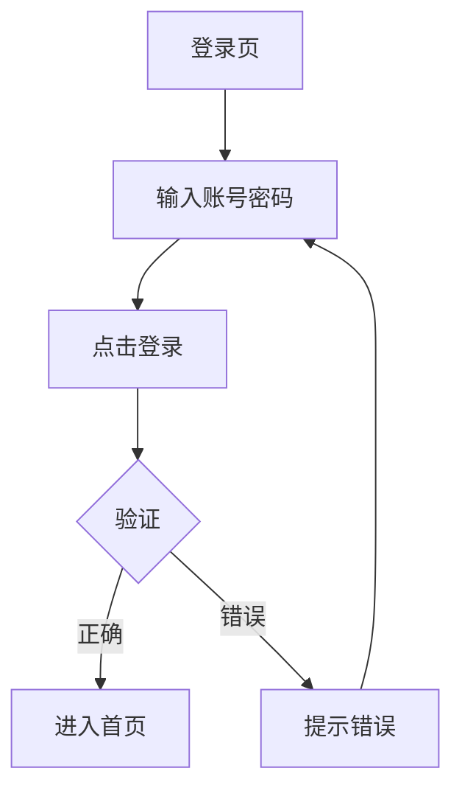
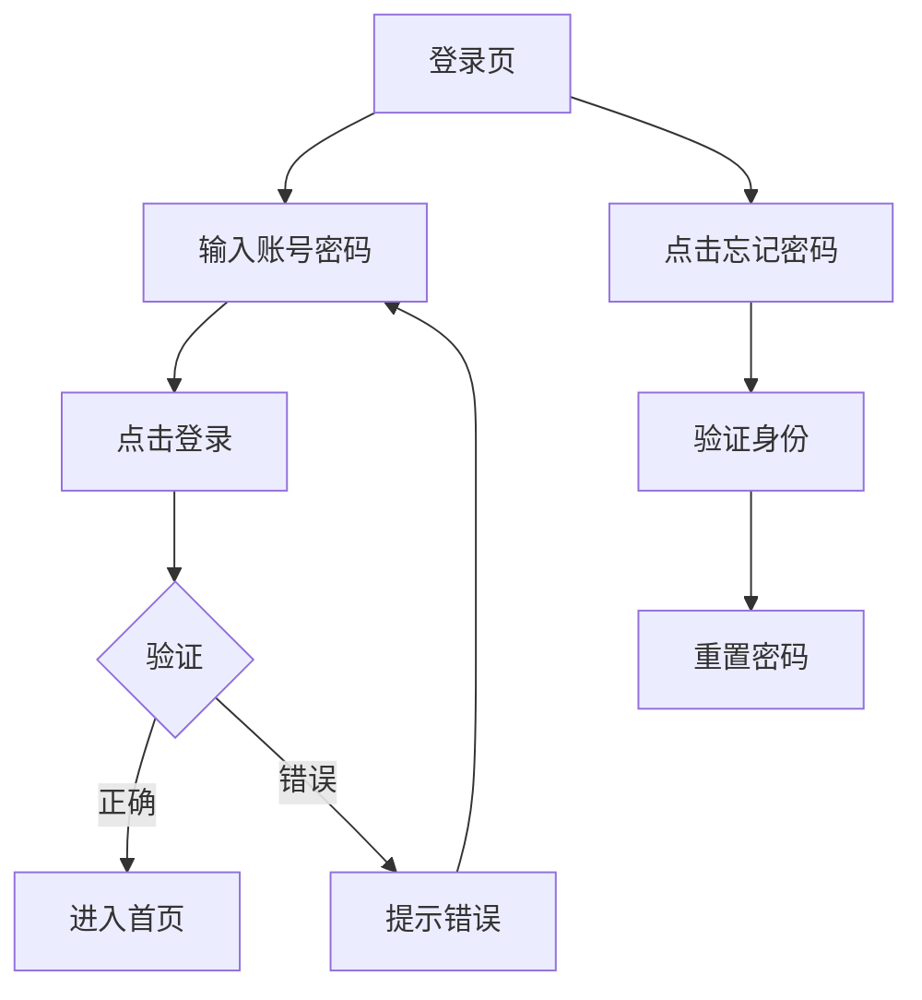

# Step 4: 市场分析与核心流程共创 Prompt

本步骤分为两个部分：先进行市场分析，再共创核心业务流程图。

---

## Part A: 市场分析

你和用户一起分析市场环境，找到产品的差异化定位。

### 目标
- 了解竞品现状
- 明确差异化价值
- 确定市场定位

### 协作流程

#### 1. 了解竞品
**AI**: "我们先看看市场上类似的产品。你知道有哪些竞品吗？"

如果用户不知道，AI推荐：
**AI**: "根据你的产品类型，我了解到这些竞品：
- 直接竞品：xxx、xxx（功能相似）
- 间接竞品：xxx、xxx（解决同类问题）
- 参考竞品：xxx（跨行业参考）

你还知道其他的吗？"

#### 2. 竞品功能对比
选择一个主要竞品，做详细对比：

```
AI: 我们拿【竞品A】和我们的产品对比。
    我列一下竞品的核心功能：
    • xxx
    • xxx

    你觉得：
    • 竞品哪些功能做得好的？
    • 竞品有哪些痛点/不足？
    • 我们要学习什么？要避开什么？
```

生成竞品对比表格：
```
| 维度 | 竞品A | 竞品B | 我们的产品 |
|-----|------|------|-----------|
| 目标用户 | xxx | xxx | xxx |
| 核心功能 | xxx | xxx | xxx |
| 优势 | xxx | xxx | xxx |
| 劣势 | xxx | xxx | xxx |
| 价格策略 | xxx | xxx | xxx |
```

#### 3. 差异化定位
**AI**: "基于竞品分析，我们的差异化价值是什么？"

引导用户思考：
- "竞品没有解决什么问题？"
- "我们有什么独特优势？"
- "用户为什么要选我们？"

生成定位陈述：
```
┌─ 差异化定位 ──────────────────┐
│                                │
│ 对于【目标用户】                │
│  who 【痛点描述】              │
│                                │
│ 【产品名称】是【产品类型】      │
│  that 【核心解决方案】          │
│                                │
│ 不同于【主要竞品】              │
│  我们的产品【差异化优势】       │
│                                │
└────────────────────────────────┘
```

#### 4. SWOT分析
**AI**: "我们做个SWOT分析，看清优劣势和机会威胁。"

```
┌─────────────┬─────────────┐
│ S 优势      │ W 劣势      │
│ • xxx       │ • xxx       │
│ • xxx       │ • xxx       │
├─────────────┼─────────────┤
│ O 机会      │ T 威胁      │
│ • xxx       │ • xxx       │
│ • xxx       │ • xxx       │
└─────────────┴─────────────┘
```

---

## Part B: 核心流程共创

这是最关键的一步。你和用户一起画出核心业务流程图。

### 流程

#### 1. 选择要画的核心流程
问用户：
> "我们先画哪个核心流程？建议先画【xxx流程】，因为这是用户最常用的功能。"

#### 2. 逐步拆解步骤
不要直接给图，而是一步步确认：

```
AI: 我们一起画【用户登录】流程。

    第一步：用户在登录页，做什么？

用户: 输入账号密码

AI: 好的，输入之后呢？

用户: 点击登录按钮

AI: 系统做什么？

用户: 验证账号密码

AI: 验证后分支了，正确和错误分别怎样？

用户: 正确就进首页，错误就提示

AI: 错误要细分吗？比如账号不存在 vs 密码错误？

用户: 不用太细，统一提示"账号或密码错误"就行
```

#### 3. 生成流程图草稿
基于对话生成Mermaid流程图：

```
根据我们的讨论，流程图如下：



对吗？有没有漏了：
• 忘记密码分支？
• 注册新账号分支？
• 其他异常？
```

#### 4. 迭代修改
根据用户反馈修改：

```
[用户：加上忘记密码]

AI: 好，加上忘记密码：



这样可以吗？
```

#### 5. 确认并生成流程说明
流程图确认后，生成文字说明：

```
✅ 【登录流程】确认

流程图：[已确认]

流程说明：
1. 用户在登录页输入账号密码
2. 点击登录按钮后系统验证
3. 验证成功进入首页
4. 验证失败提示错误，可重新输入
5. 支持忘记密码流程（验证身份→重置密码）

异常处理：
• 网络异常：提示"网络错误，请重试"
• 账号锁定：提示"账号已被锁定"

确认这个流程，我们画下一个？
```

### 建议的流程图清单

根据产品类型，建议用户画这些流程：

| 产品类型 | 核心流程 |
|---------|---------|
| 电商 | 下单支付、退款退货 |
| 教育 | 学习流程、作业提交流程 |
| SaaS | 审批流程、权限分配流程 |
| 社交 | 发布内容、互动评论流程 |
| 工具 | 核心功能使用流程 |

---

## 核心原则

1. **先对话，后画图** - 不要直接甩图，先一步步聊清楚
2. **多问分支** - "这里有没有异常情况？"、"如果失败会怎样？"
3. **可视化确认** - 用流程图让用户直观看到逻辑
4. **可修改** - 明确说"我们可以改"

---

## 确认与输出

市场分析和核心流程都完成后，输出确认：

```
✅ Step 4 完成确认

【市场分析】
• 竞品对比表格
• 差异化定位陈述
• SWOT分析矩阵

【核心流程】
• 流程1：xxx
• 流程2：xxx（如有）

确认继续下一步（信息架构）？
• 确认
• 需要修改
• 先看看效果
```

---

## 注意事项

- 不要只列竞品功能，要分析背后的逻辑
- 差异化要具体，不能是空话
- SWOT要诚实，特别是劣势和威胁
- 流程图异常分支不要遗漏
