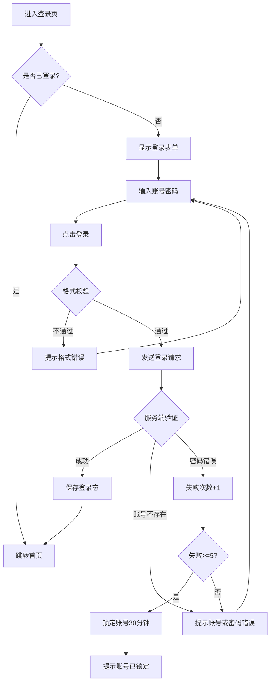
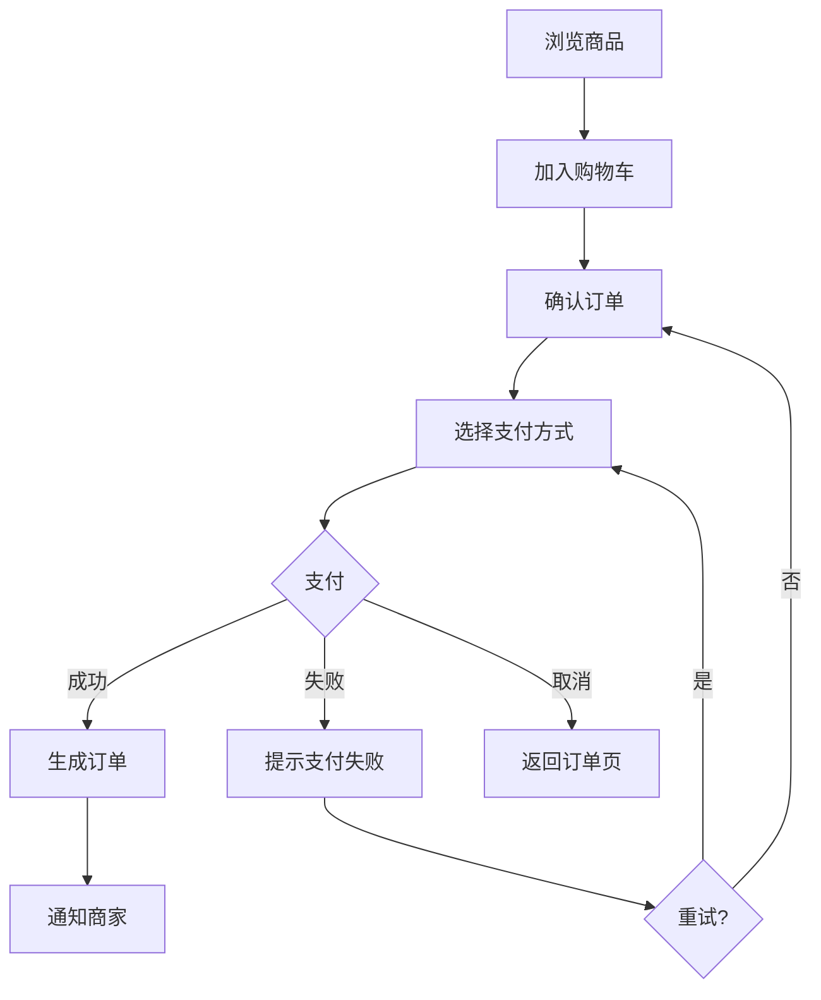
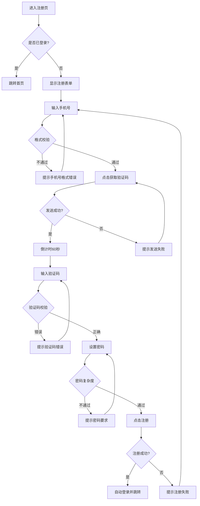
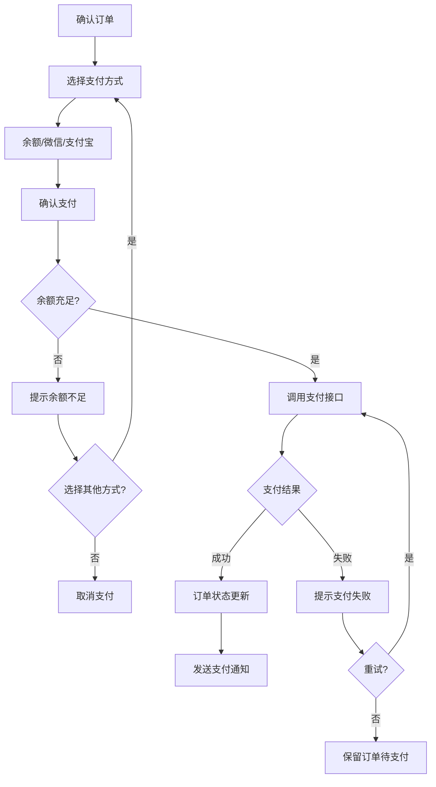

# 快捷指令模板

产品经理在协作过程中可以快速调用的标准回复模板。

---

## 功能规格快速生成

### /login 登录功能
> 完整登录功能规格，含异常处理、埋点、接口定义

### /logout 退出登录
```
【功能编号】F02
【功能名称】退出登录
【优先级】P1

【功能描述】用户主动退出登录或系统自动登出，清除登录态。

【触发条件】
• 用户点击"退出登录"
• Token过期且刷新失败
• 账号在其他设备登录
• 账号被禁用/删除

【详细规则】
1. 主动退出
   • 弹出确认对话框
   • 确认后清除本地Token
   • 发送logout通知服务端
   • 跳转登录页

2. 被动登出
   • 检测到Token失效时弹窗提示
   • 保留当前页面路径，登录后返回
   • 未保存的数据提示用户

【数据埋点】
• logout_click - 点击退出
• logout_success - 退出成功
• logout_auto - 自动登出（含原因）
```

### /forgot-password 忘记密码
```
【功能编号】F03
【功能名称】忘记密码
【优先级】P1

【功能描述】用户忘记密码时通过验证身份重置密码。

【流程】
1. 输入手机号/邮箱 → 验证存在性
2. 发送验证码 → 60秒倒计时
3. 输入验证码 → 验证
4. 设置新密码 → 复杂度校验（不能与旧密码相同）
5. 重置成功 → 跳转登录页

【安全规则】
• 验证码5分钟内有效
• 24小时内最多重置3次
• 重置后所有设备需重新登录
• 发送密码修改成功通知
```

### /search 搜索功能
```
【功能编号】F04
【功能名称】内容搜索
【优先级】P1

【功能描述】用户通过关键词搜索内容，支持筛选和排序。

【搜索规则】
• 输入实时联想（防抖300ms）
• 关键词高亮
• 支持搜索历史（本地存储最近10条）
• 热门搜索推荐

【筛选条件】
• 按分类筛选
• 按价格/时间/评分排序
• 按标签筛选

【结果展示】
• 结果计数
• 分页加载（每页20条）
• 无结果提示+推荐内容

【埋点】
• search_input - 输入关键词
• search_result - 搜索结果（含结果数）
• search_click - 点击结果
```

### /notification 消息通知
```
【功能编号】F05
【功能名称】消息通知
【优先级】P2

【功能描述】系统向用户推送各类通知，支持多终端同步。

【通知类型】
• 系统通知：版本更新、维护公告
• 业务通知：订单状态、物流信息
• 互动通知：评论回复、点赞提醒
• 私信消息：用户间私信

【推送渠道】
• App内：消息中心+红点提醒
• 推送：Push通知（可关闭）
• 短信：重要业务通知
• 邮件：营销和系统通知

【功能点】
• 消息列表（按时间倒序）
• 全部已读
• 删除消息
• 消息设置（开关各类通知）
• 免打扰时段
```

### /register 注册功能

**指令效果**：按标准模板生成完整的登录功能规格

```
【功能编号】F01
【功能名称】用户登录
【优先级】P0

【功能描述】
用户通过手机号/邮箱/用户名 + 密码登录系统，验证身份后获取访问凭证。

【前置条件】
• 用户已注册账号
• 账号状态正常（未锁定/未禁用）
• 网络连接正常

【触发条件】
• 用户主动点击"登录"
• 访问需要登录态的页面时自动跳转
• Token 过期后重新登录

【详细规则】

1. 账号输入规则
   • 支持格式：手机号(11位)、邮箱(含@)、用户名(4-20位字母数字)
   • 自动去除首尾空格
   • 输入时实时格式校验

2. 密码输入规则
   • 长度：8-20位
   • 复杂度：必须包含大小写字母+数字
   • 支持显示/隐藏切换
   • 连续5次错误锁定30分钟

3. 登录流程
   Step 1: 用户输入账号密码
   Step 2: 前端格式校验
   Step 3: 发送登录请求
   Step 4: 服务端验证
   Step 5: 成功则返回 Token，失败则提示错误

4. 异常处理
   • 账号不存在：提示"账号或密码错误"
   • 密码错误：提示"账号或密码错误"，记录失败次数
   • 账号锁定：提示"账号已锁定，请30分钟后重试"
   • 网络异常：提示"网络错误，请检查网络后重试"

【页面元素】
| 元素 | 类型 | 说明 |
|-----|------|------|
| 账号输入框 | Input | 占位符"手机号/邮箱/用户名" |
| 密码输入框 | Input | 占位符"请输入密码"，支持显隐切换 |
| 登录按钮 | Button | 默认禁用，输入完整后启用 |
| 忘记密码 | Link | 跳转密码重置页 |
| 注册账号 | Link | 跳转注册页 |
| 记住我 | Checkbox | 默认勾选，记住登录态7天 |

【接口信息】
POST /api/v1/auth/login
请求：{ account, password, captcha? }
响应：{ accessToken, refreshToken, expiresIn, userInfo }

【数据埋点】
• login_page_view - 登录页浏览
• login_click - 点击登录按钮
• login_success - 登录成功
• login_fail - 登录失败（含失败原因）
```

### /register 注册功能

```
【功能编号】F02
【功能名称】用户注册
【优先级】P0

【功能描述】
新用户通过手机号+验证码注册账号，设置密码后完成注册。

【注册流程】
1. 输入手机号 → 格式校验
2. 点击获取验证码 → 倒计时60秒
3. 输入验证码 → 校验
4. 设置密码 → 复杂度校验
5. 点击注册 → 完成

【密码规则】
• 8-20位
• 必须包含大小写字母+数字
• 可选特殊字符

【接口信息】
POST /api/v1/auth/register
POST /api/v1/auth/send-sms-code
```

### /profile 个人中心

```
【功能编号】F03
【功能名称】个人中心
【优先级】P1

【功能描述】
用户查看和编辑个人资料，管理账号设置。

【页面结构】
• 头部：头像、昵称、ID
• 资料区：编辑个人资料入口
• 功能列表：
  - 我的订单/记录
  - 消息通知
  - 账号安全
  - 设置
  - 帮助与反馈
  - 关于我们
  - 退出登录

【编辑资料】
• 头像上传（支持裁剪）
• 昵称修改（2-20字）
• 性别选择
• 简介编辑
```

---

## 流程图快速生成

### /flow-login



### /flow-order



---

## 数据表快速定义

### /table-user

```
【用户表 user】

| 字段 | 类型 | 约束 | 说明 |
|-----|------|------|------|
| id | BIGINT | PK, AUTO | 主键 |
| username | VARCHAR(50) | UNIQUE | 用户名 |
| phone | VARCHAR(20) | UNIQUE, NULL | 手机号 |
| email | VARCHAR(100) | UNIQUE, NULL | 邮箱 |
| password_hash | VARCHAR(255) | NOT NULL | 密码哈希 |
| avatar | VARCHAR(500) | NULL | 头像URL |
| status | TINYINT | DEFAULT 1 | 0-禁用 1-正常 2-锁定 |
| created_at | DATETIME | NOT NULL | 创建时间 |
| updated_at | DATETIME | NOT NULL | 更新时间 |
| last_login_at | DATETIME | NULL | 最后登录时间 |

索引：
• phone_idx (phone)
• email_idx (email)
• created_at_idx (created_at)
```

### /table-order

```
【订单表 order】

| 字段 | 类型 | 约束 | 说明 |
|-----|------|------|------|
| id | BIGINT | PK | 主键 |
| order_no | VARCHAR(32) | UNIQUE | 订单号 |
| user_id | BIGINT | FK | 用户ID |
| total_amount | DECIMAL(10,2) | NOT NULL | 订单金额 |
| status | TINYINT | DEFAULT 0 | 0-待支付 1-已支付 2-已发货 3-已完成 4-已取消 |
| pay_time | DATETIME | NULL | 支付时间 |
| created_at | DATETIME | NOT NULL | 创建时间 |
```

---

## 测试用例快速生成

### /tc-login

```
【登录功能测试用例】

TC-001: 正常登录
前置：用户已注册，状态正常
步骤：输入正确账号密码 → 点击登录
预期：登录成功，跳转首页，生成Token

TC-002: 密码错误
前置：用户已注册
步骤：输入正确账号+错误密码
预期：提示"账号或密码错误"，不暴露账号是否存在

TC-003: 账号不存在
步骤：输入未注册账号
预期：提示"账号或密码错误"（与密码错误一致）

TC-004: 账号锁定
前置：已连续失败5次
步骤：输入正确账号密码
预期：提示"账号已锁定，请30分钟后重试"

TC-005: 空账号
步骤：账号为空，输入密码
预期：提示"请输入账号"

TC-006: 格式校验-手机号
步骤：输入"123"作为账号
预期：提示"请输入正确的手机号/邮箱/用户名"

TC-007: 记住登录态
步骤：勾选"记住我"后登录
预期：7天内免登录

TC-008: Token过期
前置：Token已过期
步骤：访问需要登录的页面
预期：自动跳转登录页，登录后回到原页面
```

---

## 埋点事件快速定义

### /track-user

```
【用户相关事件】

| 事件ID | 触发时机 | 属性 |
|-------|---------|------|
| app_launch | App启动 | source, version |
| page_view | 页面浏览 | page_name, page_url, referer |
| login_click | 点击登录 | login_type |
| login_success | 登录成功 | duration_ms, login_type |
| login_fail | 登录失败 | fail_reason, fail_count |
| register_click | 点击注册 | source |
| register_success | 注册完成 | register_channel, duration_ms |
| logout | 退出登录 | - |
```

### /track-business

```
【业务相关事件】（以电商为例）

| 事件ID | 触发时机 | 属性 |
|-------|---------|------|
| product_view | 浏览商品 | product_id, category_id |
| add_to_cart | 加入购物车 | product_id, quantity, price |
| cart_view | 查看购物车 | item_count, total_amount |
| checkout_start | 开始结算 | item_count, total_amount |
| checkout_complete | 完成订单 | order_id, amount, pay_method |
| pay_success | 支付成功 | order_id, amount, pay_method |
| pay_fail | 支付失败 | order_id, fail_reason |
```

---

## 新增模板（扩展至20+）

### /flow-register - 注册流程图


### /flow-payment - 支付流程图


### /table-product - 商品表
```
【商品表 product】

| 字段 | 类型 | 约束 | 说明 |
|-----|------|------|------|
| id | BIGINT | PK | 主键 |
| product_no | VARCHAR(32) | UNIQUE | 商品编号 |
| name | VARCHAR(200) | NOT NULL | 商品名称 |
| category_id | BIGINT | FK | 分类ID |
| price | DECIMAL(10,2) | NOT NULL | 售价 |
| original_price | DECIMAL(10,2) | NULL | 原价 |
| stock | INT | DEFAULT 0 | 库存 |
| main_image | VARCHAR(500) | NOT NULL | 主图URL |
| detail | TEXT | NULL | 详情HTML |
| status | TINYINT | DEFAULT 1 | 0-下架 1-上架 2-售罄 |
| created_at | DATETIME | NOT NULL | 创建时间 |
| updated_at | DATETIME | NOT NULL | 更新时间 |

索引：
• category_idx (category_id)
• price_idx (price)
• status_idx (status)
```

### /table-message - 消息表
```
【消息表 message】

| 字段 | 类型 | 约束 | 说明 |
|-----|------|------|------|
| id | BIGINT | PK | 主键 |
| user_id | BIGINT | FK | 接收用户ID |
| type | TINYINT | NOT NULL | 1-系统 2-业务 3-互动 |
| title | VARCHAR(100) | NOT NULL | 消息标题 |
| content | TEXT | NOT NULL | 消息内容 |
| is_read | TINYINT | DEFAULT 0 | 0-未读 1-已读 |
| read_at | DATETIME | NULL | 阅读时间 |
| extra | JSON | NULL | 扩展数据 |
| created_at | DATETIME | NOT NULL | 创建时间 |

索引：
• user_type_idx (user_id, type)
• is_read_idx (is_read)
• created_at_idx (created_at)
```

### /tc-register - 注册测试用例
```
【注册功能测试用例】

TC-R001: 正常注册
前置：手机号未注册
步骤：输入手机号 → 获取验证码 → 输入验证码 → 设置密码 → 点击注册
预期：注册成功，自动登录，跳转首页

TC-R002: 手机号已注册
前置：手机号已注册
步骤：输入已注册手机号 → 获取验证码
预期：提示"该手机号已注册"

TC-R003: 验证码错误
步骤：输入正确手机号 → 输入错误验证码
预期：提示"验证码错误"

TC-R004: 验证码过期
前置：验证码已过期（5分钟后）
步骤：输入过期验证码
预期：提示"验证码已过期，请重新获取"

TC-R005: 密码不符合要求
步骤：输入密码"123"
预期：提示"密码需包含8-20位字母和数字"
```

### /tc-payment - 支付测试用例
```
【支付功能测试用例】

TC-P001: 余额支付成功
前置：用户余额充足
步骤：确认订单 → 选择余额支付 → 确认支付
预期：支付成功，余额扣减正确，订单状态更新

TC-P002: 余额不足
前置：用户余额 < 订单金额
步骤：确认订单 → 选择余额支付 → 确认支付
预期：提示余额不足，引导充值或更换支付方式

TC-P003: 支付超时
步骤：进入支付页 → 等待5分钟不操作
预期：订单自动取消，提示"订单已超时"

TC-P004: 重复支付
前置：订单已支付
步骤：再次调用支付接口
预期：拦截重复支付，提示"订单已支付"
```

### /api-response - 标准接口响应
```
【标准API响应格式】

成功响应：
{
  "code": 200,
  "message": "success",
  "data": { ... },
  "timestamp": 1704067200000,
  "requestId": "req_xxx"
}

错误响应：
{
  "code": 40001,
  "message": "参数错误",
  "data": null,
  "errors": [
    { "field": "phone", "message": "手机号格式不正确" }
  ],
  "timestamp": 1704067200000,
  "requestId": "req_xxx"
}

状态码规范：
• 200 - 成功
• 40001-49999 - 客户端错误（参数、权限等）
• 50001-59999 - 服务端错误
```

### /permission - 权限设计
```
【RBAC权限模型】

角色定义：
• super_admin - 超级管理员（全部权限）
• admin - 管理员（业务管理）
• operator - 运营人员（内容管理）
• user - 普通用户

权限表 permission：
| 资源 | 操作 | 权限码 |
|-----|------|--------|
| user | create | user:create |
| user | read | user:read |
| user | update | user:update |
| user | delete | user:delete |
| order | read | order:read |
| order | update | order:update |

角色权限分配表 role_permission：
| role_id | permission_id |
|---------|---------------|
| 1 | 1 |
| 1 | 2 |
| ... | ... |
```

---

## 使用方式

在对话中，产品经理可以直接说：

- "用标准模板生成登录功能" → AI 识别并输出 /login 模板
- "画一个登录流程图" → AI 输出 /flow-login 流程图
- "用户表怎么设计" → AI 输出 /table-user 结构
- "登录功能测试用例" → AI 输出 /tc-login 用例

AI 也可以主动推荐：
"这个功能很常见，我有标准模板，需要我按模板生成吗？"
