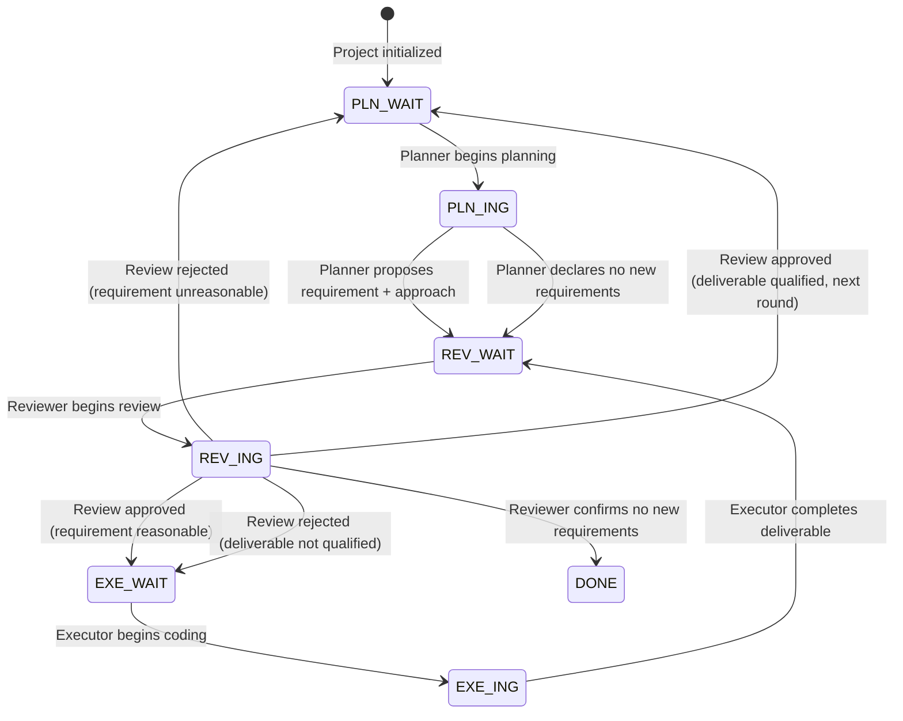

# PRE State System Reference

## Status Code Definitions

Status code format: `ROLE_ABBR_PHASE`, 7 codes total:

| Status Code | Meaning | Declared By |
|-------------|---------|-------------|
| `PLN_WAIT` | Planner should propose the next requirement or declare no new requirements | Reviewer |
| `PLN_ING` | Planner is analyzing goals and code, formulating requirements and approach | Planner |
| `REV_WAIT` | Content awaiting Reviewer's review (requirement / no-new-requirements declaration / deliverable) | Planner / Executor |
| `REV_ING` | Reviewer is conducting review | Reviewer |
| `EXE_WAIT` | Requirement review passed, waiting for Executor to implement | Reviewer |
| `EXE_ING` | Executor is coding the implementation | Executor |
| `DONE` | All project goal requirements have been delivered, no new requirements | Reviewer |

## State Transitions

## Declaration Rules

- Planner declares: `PLN_ING` → `REV_WAIT`
- Executor declares: `EXE_ING` → `REV_WAIT`
- Reviewer declares: `REV_ING` → `EXE_WAIT` / `PLN_WAIT` / `DONE`

`DONE` achievement condition: Planner, under `PLN_WAIT` status, reads the project goals document, determines there are no new requirements, submits a "no new requirements" declaration and declares status `REV_WAIT`. Reviewer reviews this declaration, confirms all project goals have been delivered, then declares `DONE`.

## Three-Role Behavior Matrix

| Status | Planner | Executor | Reviewer |
|--------|---------|----------|----------|
| `PLN_WAIT` | **ACT**: Read goals + code, plan if new requirements exist, otherwise submit declaration | Skip | Skip |
| `PLN_ING` | Continue planning | Skip | Skip |
| `REV_WAIT` | Skip | Skip | **ACT**: Read goals + code + log, begin review |
| `REV_ING` | Skip | Skip | Continue reviewing |
| `EXE_WAIT` | Skip | **ACT**: Read goals + code, begin execution | Skip |
| `EXE_ING` | Skip | Continue executing | Skip |
| `DONE` | Skip | Skip | Skip |

## Status Codes Each Role Can Declare

**Planner can declare**: `PLN_ING`, `REV_WAIT`

**Executor can declare**: `EXE_ING`, `REV_WAIT`

**Reviewer can declare**: `REV_ING`, `EXE_WAIT`, `PLN_WAIT`, `DONE`

## Collaboration Chain

**PLN_WAIT → Planner plans → REV_WAIT → Reviewer reviews requirement → EXE_WAIT → Executor executes → REV_WAIT → Reviewer reviews deliverable → PLN_WAIT (next round)**

`DONE` only occurs during the Reviewer's review of the Planner's planning step.