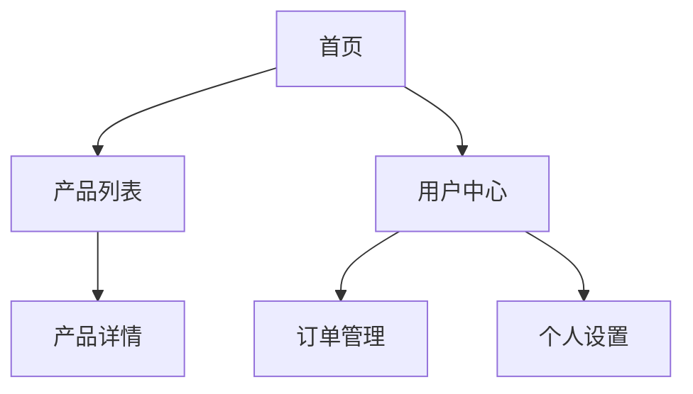
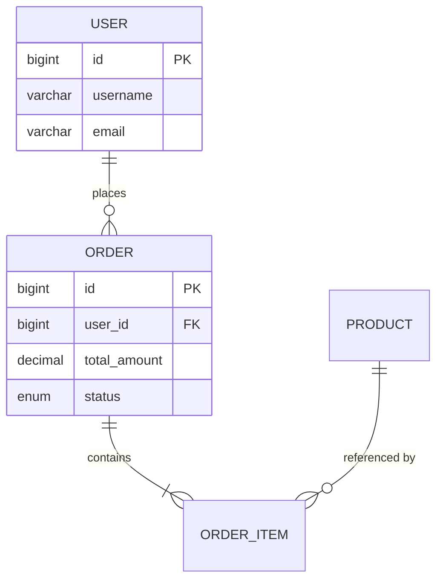

# PRD 文档生成器（AI 编程导向）

## 概述

生成面向 AI 大模型编程的 PRD 文档。核心理念：**每个功能模块自包含**，AI 读完单个功能章节就能直接编码，无需跳转查阅。

与传统 PRD 的区别：
- 每个功能内嵌：实体字段清单、状态机、权限、业务流程图、业务约束
- 流程图全部用 Mermaid（AI 可解析）
- 页面布局用 ASCII 线框图（精确到组件）
- 状态机完整定义（状态、流转、动作矩阵、权限）
- 业务流程推演覆盖正向+异常路径

## 何时使用

- 用户说"写 PRD"、"生成需求文档"、"帮我写产品需求"
- 用户有一个产品想法需要结构化表达
- 用户需要 BRD（Business Requirements Document）或 MRD
- 用户丢来一段产品描述要求整理成正式文档
- 用户明确要求 PRD 能指导 AI 编程

不适用于：纯技术方案（用 plan）、代码实现（用 writing-plans）、公众号文章（用 khazix-writer）

## PRD 标准结构

---

### 第 1 章：文档头部

```markdown
| 字段     | 内容 |
|----------|------|
| 文档标题 | [产品名] 产品需求文档 |
| 版本     | v1.0 |
| 作者     | [PM姓名] |
| 日期     | YYYY-MM-DD |
| 状态     | 草稿 / 评审中 / 已批准 |

## 变更记录
| 版本 | 日期 | 修改人 | 修改内容 |
|------|------|--------|----------|

## 干系人
| 角色 | 姓名 | 职责 |
|------|------|------|
| 产品负责人 | | |
| 技术负责人 | | |
| 设计负责人 | | |
```

---

### 第 2 章：产品概述

- 产品定位（一句话）
- 目标用户画像（含具体场景）
- 核心价值主张
- 商业目标（可量化的指标）
- 产品边界（做什么、不做什么）

---

### 第 3 章：背景与目标

- 市场背景 / 问题陈述
- 项目目标（SMART 原则）
- 成功指标（KPI / North Star Metric）
- **非目标（Scope 外）**—— 明确排除，防止需求蔓延

---

### 第 4 章：用户角色与场景

#### 用户角色定义

```markdown
| 角色ID | 角色名称 | 描述 | 核心诉求 | 使用频率 |
|--------|----------|------|----------|----------|
| U001   | 普通用户 | ... | ... | 每日 |
| U002   | 管理员   | ... | ... | 每周 |
```

#### 用户故事

```
**US-[编号]：[标题]**
- 作为 [用户角色]
- 我想要 [功能描述]
- 以便 [获得的价值]
- 验收标准：
  - [ ] 条件 1
  - [ ] 条件 2
- 优先级：P0 / P1 / P2
- 估点：S / M / L / XL
```

---

### 第 5 章：全局信息架构

#### 站点地图（Mermaid）



#### 导航层级

```markdown
| 层级 | 页面 | URL | 权限 |
|------|------|-----|------|
| L1   | 首页 | / | 公开 |
| L1   | 用户中心 | /user | 登录 |
| L2   | 订单管理 | /user/orders | 登录 |
```

#### 数据模型 ER 图（Mermaid）



---

### 第 6 章：功能需求（核心章节）

**每个功能模块自包含以下全部内容，AI 读完即可编码。**

#### 功能清单总表

```markdown
| 功能ID | 功能名称 | 所属模块 | 优先级 | 用户故事 | 估点 |
|--------|----------|----------|--------|----------|------|
| F001   | 用户注册 | 用户模块 | P0     | US-001   | M    |
| F002   | 用户登录 | 用户模块 | P0     | US-002   | S    |
```

---

#### 功能模块模板（每个功能按此结构输出）

```markdown
## F001 - 用户注册

### 6.1.1 功能描述

用户通过邮箱注册账号，注册成功后可使用平台全部功能。

### 6.1.2 业务流程图（Mermaid）

flowchart TD
    A[填写注册表单] --> B{前端校验}
    B -->|失败| C[提示错误]
    C --> A
    B -->|通过| D[提交注册请求]
    D --> E{后端校验}
    E -->|用户名重复| F[返回错误]
    E -->|邮箱重复| G[返回错误]
    E -->|通过| H[写入数据库]
    H --> I[发送验证邮件]
    I --> J[返回成功]

### 6.1.3 页面布局（ASCII 线框图）

┌─────────────────────────────────────┐
│              [Logo]                  │
├─────────────────────────────────────┤
│                                     │
│         创建您的账号                  │
│                                     │
│  ┌─────────────────────────────┐    │
│  │ 邮箱地址                    │    │
│  │ [________________________] │    │
│  └─────────────────────────────┘    │
│  ┌─────────────────────────────┐    │
│  │ 用户名                      │    │
│  │ [________________________] │    │
│  └─────────────────────────────┘    │
│  ┌─────────────────────────────┐    │
│  │ 密码                        │    │
│  │ [________________________] 👁│    │
│  └─────────────────────────────┘    │
│  ┌─────────────────────────────┐    │
│  │ 确认密码                    │    │
│  │ [________________________] 👁│    │
│  └─────────────────────────────┘    │
│                                     │
│  [ ☐ 我同意服务条款和隐私政策 ]      │
│                                     │
│  [        立即注册        ]         │
│                                     │
│  已有账号？ [登录]                   │
│                                     │
└─────────────────────────────────────┘

- 交互：密码强度实时提示、表单校验即时反馈
- 空态：默认展示，无空态
- 加载态：按钮变为 [⏳ 注册中...]，禁用提交
- 错误态：字段下方红色提示文字，顶部 Toast

### 6.1.4 实体字段清单

#### 实体：User（用户）

| 字段名 | 字段标识 | 数据类型 | 长度/取值 | 默认值 | 来源 | 必填 | 可编辑 | 可展示 | 校验规则 | 说明 |
|--------|----------|----------|-----------|--------|------|------|--------|--------|----------|------|
| 用户ID | id | bigint | - | 自增 | 系统生成 | 是 | 否 | 否 | - | 主键，雪花算法 |
| 用户名 | username | varchar | 3-20字符 | - | 用户输入 | 是 | 注册后不可改 | 是 | ^[a-zA-Z0-9_]{3,20}$ | 唯一索引 |
| 邮箱 | email | varchar | 邮箱格式 | - | 用户输入 | 是 | 是 | 是 | RFC 5322 | 唯一索引 |
| 密码哈希 | password_hash | varchar | 64字符 | - | 系统生成 | 是 | 否 | 否 | - | bcrypt，不可逆 |
| 邮箱验证状态 | email_verified | tinyint | 0,1 | 0 | 系统生成 | 是 | 否 | 否 | 0=未验证 1=已验证 | - |
| 验证令牌 | verify_token | varchar | 64字符 | NULL | 系统生成 | 否 | 否 | 否 | - | 验证后清空 |
| 令牌过期时间 | token_expires_at | datetime | - | NULL | 系统生成 | 否 | 否 | 否 | - | 验证后清空 |
| 状态 | status | tinyint | 0,1,2 | 0 | 系统生成 | 是 | 否 | 是 | 0=待激活 1=正常 2=封禁 | - |
| 创建时间 | created_at | datetime | - | NOW() | 系统生成 | 是 | 否 | 是 | - | 不可变 |
| 更新时间 | updated_at | datetime | - | NOW() | 系统生成 | 是 | 否 | 否 | - | 自动更新 |

#### 字段来源说明

| 来源类型 | 说明 |
|----------|------|
| 用户输入 | 表单/接口传入 |
| 系统生成 | 自动生成，用户不可见 |
| 计算得出 | 由其他字段计算 |

### 6.1.5 状态机

#### 状态列表

| 状态ID | 状态名称 | 状态标识 | 描述 | 是否终态 |
|--------|----------|----------|------|----------|
| S001   | 待激活   | INACTIVE | 已注册未验证邮箱 | 否 |
| S002   | 正常     | ACTIVE   | 邮箱已验证，正常使用 | 否 |
| S003   | 封禁     | BANNED   | 违规被封禁 | 是（可解封） |

#### 状态流转图（Mermaid）

stateDiagram-v2
    [*] --> INACTIVE: 注册成功
    INACTIVE --> ACTIVE: 验证邮箱
    ACTIVE --> BANNED: 管理员封禁
    BANNED --> ACTIVE: 管理员解封
    ACTIVE --> [*]: 注销账号

#### 状态动作能力矩阵

| 操作 \ 状态 | INACTIVE | ACTIVE | BANNED |
|-------------|----------|--------|--------|
| 登录        | ❌（提示验证邮箱）| ✅ | ❌（提示已封禁）|
| 浏览公开页面 | ✅ | ✅ | ✅ |
| 使用核心功能 | ❌ | ✅ | ❌ |
| 修改个人信息 | ✅ | ✅ | ❌ |
| 注销账号    | ✅ | ✅ | ❌ |

#### 状态流转规则

| 触发事件 | 前置状态 | 目标状态 | 触发者 | 前置条件 | 后置动作 |
|----------|----------|----------|--------|----------|----------|
| 点击验证链接 | INACTIVE | ACTIVE | 用户 | token 未过期 | 清空 token，发送欢迎邮件 |
| 管理员封禁 | ACTIVE | BANNED | 管理员 | 填写封禁原因 | 发送通知，强制登出 |
| 管理员解封 | BANNED | ACTIVE | 管理员 | - | 发送通知 |

### 6.1.6 权限设计

#### 功能权限

| 操作 | 游客 | 待激活用户 | 正常用户 | 管理员 |
|------|------|-----------|----------|--------|
| 注册 | ✅ | ❌ | ❌ | ❌ |
| 登录 | ✅ | ✅（但提示验证）| ✅ | ✅ |
| 封禁用户 | ❌ | ❌ | ❌ | ✅ |

#### 数据权限

| 场景 | 规则 |
|------|------|
| 查看用户信息 | 只能查看自己的，管理员可查看所有 |
| 修改用户信息 | 只能修改自己的 |
| 密码字段 | 任何角色都不可查看明文 |

### 6.1.7 业务规则与约束

| 约束ID | 类型 | 描述 | 违反后果 |
|--------|------|------|----------|
| C001 | 唯一性 | 用户名全局唯一 | 提示"该用户名已被占用" |
| C002 | 唯一性 | 邮箱全局唯一 | 提示"该邮箱已注册" |
| C003 | 时效性 | 验证链接 24 小时有效 | 提示"链接已过期，请重新发送" |
| C004 | 幂等性 | 同一邮箱重复注册返回相同提示（不泄露注册状态）| 安全要求 |
| C005 | 安全 | 密码必须 bcrypt 加密存储 | 不可逆 |

### 6.1.8 业务流程推演

#### 正常路径

| 步骤 | 操作者 | 动作 | 系统响应 | 数据变化 |
|------|--------|------|----------|----------|
| 1 | 用户 | 填写表单，点击注册 | 前端校验通过 | - |
| 2 | 用户 | 提交请求 | 检查用户名/邮箱唯一性 | - |
| 3 | 系统 | 校验通过 | 写入 User 表 | status=0, 生成 verify_token |
| 4 | 系统 | 发送验证邮件 | 邮件入队 | - |
| 5 | 用户 | 点击邮件链接 | 验证 token | status=1, 清空 token |
| 6 | 系统 | 注册完成 | 发送欢迎邮件 | - |

#### 异常路径

| 步骤 | 异常类型 | 触发条件 | 系统处理 | 用户提示 | 数据回滚 |
|------|----------|----------|----------|----------|----------|
| 2 | 重复用户名 | DB 唯一约束 | 返回错误 | "用户名已被占用" | 无写入 |
| 2 | 重复邮箱 | DB 唯一约束 | 返回错误（不泄露是否已注册）| "注册失败，请检查输入" | 无写入 |
| 3 | 数据库写入失败 | DB 异常 | 返回错误 | "系统繁忙，请稍后重试" | 无写入 |
| 4 | 邮件发送失败 | SMTP 异常 | 重试 3 次 | 用户无感知 | 数据保留，稍后重试 |
| 5 | token 过期 | 超过 24h | 返回错误 | "链接已过期，请重新发送" | - |
| 5 | token 已使用 | 重复点击 | 返回错误 | "链接已失效" | - |

#### 边界条件

| 场景 | 输入边界 | 预期行为 |
|------|----------|----------|
| 用户名长度 | 2字符 / 21字符 | 校验失败，提示长度要求 |
| 密码强度 | 纯数字 / 无大小写 | 校验失败，提示密码规则 |
| 邮箱格式 | 无@ / 无域名 | 校验失败，提示格式错误 |
| 并发注册 | 同一邮箱同时提交 | 只有一个成功，另一个提示重复 |

### 6.1.9 接口需求（供 AI 参考）

| 接口 | 方法 | 路径 | 请求体 | 响应体 |
|------|------|------|--------|--------|
| 注册 | POST | /api/auth/register | {username, email, password} | {code, message, data: {userId}} |
| 验证邮箱 | GET | /api/auth/verify?token=xxx | - | {code, message} |
| 重发验证 | POST | /api/auth/resend-verify | {email} | {code, message} |

### 6.1.10 验收标准

- [ ] 用户填写邮箱、用户名、密码可成功注册
- [ ] 重复用户名/邮箱给出明确提示
- [ ] 注册后收到验证邮件
- [ ] 点击验证链接后账号激活
- [ ] 过期链接给出提示
- [ ] 弱密码实时校验
- [ ] 注册过程中的错误不泄露已有用户信息
```

---

### 第 7 章：非功能需求

- 性能要求（响应时间、并发量、QPS）
- 安全要求（权限、加密、合规、SQL注入/XSS防护）
- 可用性要求（SLA、灾备、降级方案）
- 兼容性要求（平台、浏览器、分辨率）
- 数据要求（备份策略、数据保留周期、GDPR 合规）

---

### 第 8 章：技术约束

- 已知技术限制
- 依赖的外部系统/API（含接口文档链接）
- 数据迁移需求
- 性能瓶颈预判

---

### 第 9 章：发布策略

- 版本规划（MVP → V1 → V2），每个版本的功能范围
- 灰度/AB 测试方案
- 回滚方案
- 数据迁移方案

---

### 第 10 章：风险与依赖

- 风险清单（概率 × 影响）
- 缓解方案
- 外部依赖（团队、供应商、审批）

---

### 第 11 章：附录

- 术语表
- 参考文档链接
- 竞品分析摘要
- Mermaid 图表索引

---

## 优先级框架

### MoSCoW
- **Must have**：没有这个产品无法上线
- **Should have**：重要但可以延后
- **Could have**：锦上添花
- **Won't have**：本期明确不做

### RICE 评分
- RICE = (Reach × Impact × Confidence) / Effort

---

## 工作流程

```
1. 收集输入 → 用户想法、竞品、数据
2. 澄清需求 → 用结构化问题引导（见下方清单）
3. 生成初稿 → 按标准结构输出，每个功能自包含
4. 审查迭代 → 标注待确认项
```

### 澄清问题（生成前必问）

如果用户输入太模糊，先问清楚：
1. 这个产品解决什么问题？给谁用？
2. 现在是怎么解决的（如果有）？
3. 核心功能是什么？哪些是 MVP 必须有的？
4. 有没有参考产品 / 竞品？
5. 时间线和资源约束？
6. 有哪些核心业务实体？（用户、订单、商品等）
7. 核心业务流程是什么？（下单、支付、发货等）

---

## 输出格式

默认输出 Markdown 格式。所有 Mermaid 图表直接嵌入，AI 编程工具可解析。

---

## 常见错误

| 错误 | 正确做法 |
|------|---------|
| 实体字段清单独立成章 | 每个功能内嵌涉及的实体字段 |
| 状态机独立成章 | 每个功能内嵌相关实体的状态机 |
| 权限独立成章 | 每个功能内嵌权限矩阵 |
| 流程图独立成章 | 每个功能内嵌自己的业务流程图 |
| 功能描述太笼统 | 拆到可验收的粒度 |
| 跳过非目标定义 | 明确写出"本期不做" |
| 验收标准模糊 | 用 Given-When-Then 格式 |
| 忽略异常场景 | 每个功能都写边界条件 |
| 优先级全标 P0 | 用 MoSCoW/RICE 强制排序 |
| 字段清单缺校验规则 | 正则或业务规则必填 |
| 状态机缺超时处理 | 每个非终态必须有超时 |
| 权限只写角色不写数据 | 区分功能权限+数据权限 |
| 业务约束太模糊 | 精确到可编程实现 |
