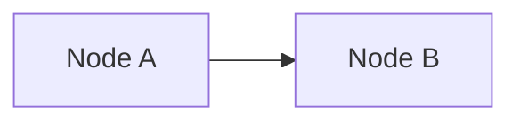
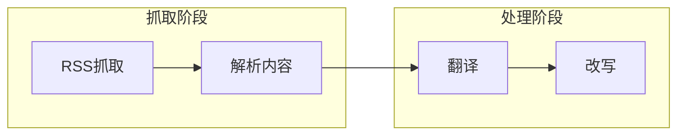
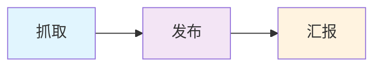

# Flow Design Language — Node Types, Mermaid Syntax & Skill Mapping

This document defines the vocabulary and rules for designing project flows in the project-factory v2 workflow.

---

## Node Types

### trigger
**Meaning:** What starts the workflow.
**Variants:**
- `cron` — scheduled (e.g. daily at 9am)
- `event` — triggered by external event (webhook, API call)
- `manual` — run on demand

**Config fields:** `schedule` (cron expr), `timezone`, or `event_name`

**Skill:** `cron` (OpenClaw cron API)

---

### fetch
**Meaning:** Pull raw data from an external source.
**Variants by source type:**

| Source | Tool | Skill |
|--------|------|-------|
| YouTube video/channel | `yt-dlp` | `summarize` |
| RSS feed | `feedparser` | `summarize` |
| Webpage | `curl` / `jina.ai` | `summarize` |
| API endpoint | `curl` / `requests` | custom |
| Database | `python script` | custom |
| Email | `imaplib` | custom |
| Twitter/X | `xreach` | `Agent-Reach` |
| 小红书 | `mcporter xiaohongshu` | `Agent-Reach` |
| 抖音 | `mcporter douyin` | `Agent-Reach` |

**Config fields:** `source_url`, `source_type`, `auth` (if needed)

---

### filter
**Meaning:** Decide which items pass through based on criteria.
**Variants:**
- `keyword` — simple string/regex match
- `llm-judge` — LLM decides based on a prompt
- `dedup` — skip already-processed items (by ID or hash)

**Config fields:** `filter_type`, `criteria` (keywords/regex/prompt), `state_file` (for dedup)

**Skill:** `regex` / `keyword` (builtin) or LLM for `llm-judge`

---

### rewrite
**Meaning:** Transform or rewrite content for a target platform/audience.
**Variants:**
- `translate` — translate text from one language to another
- `summarize` — condense content
- `restyle` — rewrite in a different tone/voice (e.g. blog → WeChat article)
- `expand` — elaborate on a topic

**Config fields:** `rewrite_type`, `instructions`, `target_language`, `style_guide`

**Skill:** `MiniMax-M2.5` (default), `GPT-4.1` for higher quality

---

### generate
**Meaning:** Create new media or structured content from scratch.
**Variants:**
- `image` — generate an image
- `video` — generate a video
- `text` — generate copy, titles, summaries
- `audio` — generate voiceover or music

**Config fields:** `media_type`, `prompt`, `duration` (video/audio)

**Skill:** `image_generate` / `video_generate` / `tts`

---

### publish
**Meaning:** Deliver the final output to an external platform.
**Variants by platform:**

| Platform | Tool | Skill |
|----------|------|-------|
| 微信公众号 | WeChat MP API | `Agent-Reach` |
| Telegram | Bot API | built-in |
| Email | SMTP / API | built-in |
| Twitter/X | `xreach` | `Agent-Reach` |
| 小红书 | `mcporter` | `Agent-Reach` |
| 网站 | `curl` / SCP | built-in |

**Config fields:** `platform`, `account`, `publish_mode` (draft / immediate / schedule)

**Skill:** `Agent-Reach` (for WeChat/小红书/Twitter), built-in messaging tools

---

### wait
**Meaning:** Pause execution for a duration or until a specific time.
**Variants:**
- `delay` — wait N seconds/minutes
- `until` — wait until specific time

**Config fields:** `duration_seconds` or `target_time`

**Skill:** `sleep` (bash) / `cron` scheduling

---

### condition
**Meaning:** Branch the flow based on a runtime decision.
**Variants:**
- `if-else` — binary branch based on a predicate
- `switch` — multi-branch based on a value
- `llm-router` — LLM decides which branch to take

**Config fields:** `condition_type`, `logic` (predicate/prompt/case list)

**Skill:** `regex` / `keyword` (if-else), LLM (llm-router)

---

### report
**Meaning:** Send a status update to a Telegram topic.
**Variants:**
- `start` — report that the pipeline has started
- `progress` — report intermediate progress
- `success` — report successful completion
- `failure` — report an error with details
- `approval-request` — ask human to approve before continuing

**Config fields:** `report_type`, `thread_key` (report / chat), `detail_level`

**Skill:** `pipeline_reporter` (project script, always generated)

---

### end
**Meaning:** Terminal node — flow completes here.
No config required. Each flow must have at least one `end` node.

---

## Mermaid Syntax Guide

### Basic Flowchart (LR = Left-to-Right; TD = Top-to-Down)



### Decision Node (Diamond / Hexagon)

```mermaid
flowchart LR
    A --> B{{条件判断}}
    B -->|是| C[继续]
    B -->|否| D[结束]]
```

### Subgraph (Group Related Nodes)



### Styling Classes (optional)



---

## Skill Auto-Recommendation Map

```
INPUT NODE TYPE + SOURCE ────────→ RECOMMENDED SKILL
─────────────────────────────────────────────────────
fetch + youtube                  → summarize + yt-dlp
fetch + rss                     → summarize
fetch + webpage                  → summarize
fetch + twitter                 → Agent-Reach (xreach)
fetch + 小红书                   → Agent-Reach (mcporter)
fetch + 抖音                     → Agent-Reach (mcporter)
fetch + github                  → gh CLI / summarize
fetch + 微信公众号               → Agent-Reach (wechat-article-for-ai)

rewrite + 翻译                   → MiniMax-M2.5 (快速/便宜)
rewrite + 高质量改写              → GPT-4.1 (质量优先)
rewrite + 代码                   → Codex / GPT-5.1-codex

generate + 图片                  → image_generate (gemini/gpt-image-2)
generate + 视频                  → video_generate
generate + 语音                  → tts

filter + 关键词/正则              → 内置 regex
filter + AI判断                 → MiniMax-M2.5
filter + 去重                   → 内置 dedup (读取 state file)

publish + 微信公众号             → Agent-Reach (wechat)
publish + Telegram              → 内置 message tool
publish + Twitter/X             → Agent-Reach (xreach)
publish + 小红书                 → Agent-Reach (mcporter)

report                          → pipeline_reporter (自动生成)

condition + if-else             → 内置 bash/python
condition + LLM路由             → MiniMax-M2.5
```

---

## State File Convention

Nodes that need to remember state between runs (e.g. `dedup`, `filter`) should use:

```
data/state/<node_name>_state.json
```

Schema:
```json
{
  "node": "dedup_video",
  "last_run": "2026-04-26T09:00:00+08:00",
  "processed_ids": ["vid_001", "vid_002"],
  "last_cursor": "page_3_token_xyz"
}
```

---

## Flow Naming Convention

- Each non-START/END node should have a short Chinese label
- Node IDs in Mermaid use the label in pinyin or English slug: `FETCH`, `TRANSLATE`, `PUBLISH`
- Avoid generic names like "Step 1", "Process A" — use meaningful names

Good: `VIDEO_FETCH`, `QUALITY_FILTER`, `WECHAT_PUBLISH`
Bad: `NODE_A`, `STEP_1`, `PROCESS`
