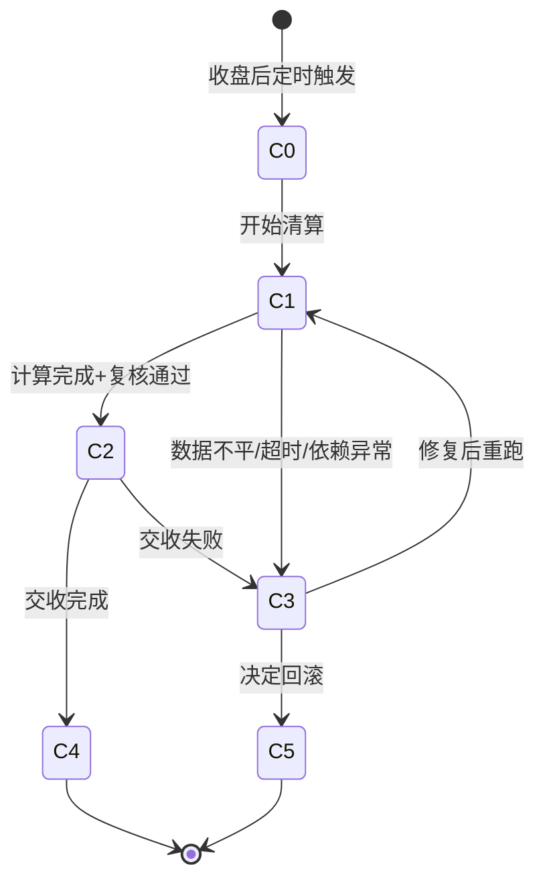

# 清算域（Clearing Domain）

> 本文档覆盖证券清算核心业务对象的状态机、操作规则、异常模式与测试点，适用于 A 股 T+1 清算场景。

---

## 清算批次（Clearing Batch）

### 状态全集
- 待初始化（PendingInit）：交易日结束，清算批次尚未创建
- 数据采集中（DataCollecting）：正在从交易所、柜台系统采集当日成交数据
- 清算计算中（Calculating）：正在执行清算计算（轧差、费用计算、交收指令生成）
- 待复核（PendingReview）：清算计算完成，等待清算员复核
- 已确认（Confirmed）：清算结果已确认，准备执行交收
- 交收中（Settling）：正在执行资金和证券的交收
- 已完成（Completed）：清算交收全部完成（终态）
- 异常挂起（Suspended）：清算过程中发现异常，暂停处理（需人工介入）
- 已回滚（Rolledback）：清算结果被撤销，需重新清算（终态）

### 状态转移规则
| 当前状态 | 触发条件 | 目标状态 | 是否允许 |
|---------|---------|---------|--------|
| 待初始化 | 定时任务触发（通常 15:30） | 数据采集中 | ✅ |
| 数据采集中 | 数据采集完成 | 清算计算中 | ✅ |
| 数据采集中 | 数据源异常 | 异常挂起 | ✅ |
| 清算计算中 | 计算完成 | 待复核 | ✅ |
| 清算计算中 | 计算异常（数据不平） | 异常挂起 | ✅ |
| 待复核 | 清算员确认 | 已确认 | ✅ |
| 待复核 | 清算员驳回 | 异常挂起 | ✅ |
| 已确认 | 开始交收 | 交收中 | ✅ |
| 交收中 | 交收完成 | 已完成 | ✅ |
| 交收中 | 交收失败 | 异常挂起 | ✅ |
| 异常挂起 | 问题修复后重新触发 | 数据采集中 | ✅ |
| 异常挂起 | 决定回滚 | 已回滚 | ✅ |
| 已完成 | 重新清算 | — | ❌ |
| 已完成 | 回滚 | — | ❌ |

### 允许操作
- 触发清算：交易日收盘后，由定时任务或清算员手动触发
- 复核清算结果：清算批次处于「待复核」状态，清算员审核
- 手动重跑：清算批次处于「异常挂起」状态，修复问题后重新触发
- 查询清算进度：任意时刻，任意状态

### 禁止操作（反例知识）
- 在交易时段内触发清算：必须在收盘后执行，防止数据不完整
- 跳过复核直接交收：清算结果必须经过人工复核确认
- 对已完成的清算批次进行回滚：已交收的资金和证券无法自动回滚

### 异常模式
- 数据不平：交易所成交数据与柜台成交数据不一致 → 测试点：验证清算系统的对账机制，差异记录是否完整，是否自动挂起
- 超时：清算计算超过预期时间（>30min） → 测试点：验证超时告警机制和自动挂起逻辑
- 部分交收失败：批量交收中部分账户资金不足 → 测试点：验证部分失败的处理（标记失败账户，其余继续交收）
- 重复触发：定时任务重复触发同一交易日的清算 → 测试点：验证清算批次的唯一性约束（交易日+批次号）
- 依赖系统不可用：中登公司接口不可用 → 测试点：验证降级策略和重试机制

### 测试点模板
- TP-CLR-001：收盘后触发清算，验证完整流程从「待初始化」到「已完成」，总耗时 < 2h（优先级：P0）
- TP-CLR-002：模拟交易所数据与柜台数据不平（差异 1 笔），验证系统自动挂起并生成差异报告（优先级：P0）
- TP-CLR-003：清算计算超时 30min，验证系统自动挂起并发送告警（优先级：P1）
- TP-CLR-004：同一交易日重复触发清算，验证系统拒绝并返回已存在的批次信息（优先级：P1）
- TP-CLR-005：模拟交收过程中 3 个账户资金不足，验证其余账户正常交收，失败账户单独标记（优先级：P0）

### 中间态处理规则
- 「数据采集中」「清算计算中」「交收中」均为中间态
- 数据采集超时阈值：10min；清算计算超时阈值：30min；交收超时阈值：1h
- 各中间态超时后自动转入「异常挂起」，需人工介入
- 清算过程中需记录每个步骤的检查点（checkpoint），支持断点恢复

### 幂等/重试规则
- 清算批次以 交易日期 + 批次序号 作为唯一键，防止重复创建
- 数据采集支持断点续传，已采集的数据不重复拉取
- 交收指令使用 settlementId 作为幂等键，重复执行返回已有结果
- 清算重跑时，先清除上次计算结果，再重新计算（非增量）

---

## 资金冻结解冻（Fund Freeze/Unfreeze）

### 状态全集
- 冻结请求中（FreezeRequested）：收到冻结指令，正在处理
- 已冻结（Frozen）：资金已成功冻结，不可用于其他操作
- 解冻请求中（UnfreezeRequested）：收到解冻指令，正在处理
- 已解冻（Unfrozen）：资金已释放回可用余额（终态）
- 冻结失败（FreezeFailed）：冻结操作失败（余额不足等）（终态）
- 部分解冻（PartiallyUnfrozen）：部分资金已解冻（如部分成交后释放剩余冻结）

### 状态转移规则
| 当前状态 | 触发条件 | 目标状态 | 是否允许 |
|---------|---------|---------|--------|
| 冻结请求中 | 余额充足，冻结成功 | 已冻结 | ✅ |
| 冻结请求中 | 余额不足 | 冻结失败 | ✅ |
| 已冻结 | 委托全部成交，冻结转交收 | 已解冻 | ✅ |
| 已冻结 | 委托撤单，释放冻结 | 已解冻 | ✅ |
| 已冻结 | 部分成交，释放剩余部分 | 部分解冻 | ✅ |
| 部分解冻 | 剩余全部成交或撤单 | 已解冻 | ✅ |
| 已解冻 | 再次冻结 | — | ❌（需新建冻结记录） |
| 冻结失败 | 重试冻结 | — | ❌（需新建冻结记录） |

### 允许操作
- 冻结资金：委托提交时，按委托金额+预估费用冻结
- 解冻资金：委托撤单或清算交收后释放
- 部分解冻：部分成交后，按实际成交金额调整冻结额
- 查询冻结明细：任意时刻

### 禁止操作（反例知识）
- 冻结金额超过账户可用余额：必须校验可用余额（总余额-已冻结金额）
- 解冻金额超过已冻结金额：解冻金额不得大于对应冻结记录的剩余冻结额
- 对已解冻的记录再次解冻：终态不可重复操作

### 异常模式
- 并发冻结：同一账户同时提交多笔委托，并发冻结导致超额 → 测试点：验证冻结操作的原子性（数据库行锁或乐观锁），确保可用余额不会变为负数
- 冻结与解冻竞态：冻结和解冻请求几乎同时到达 → 测试点：验证操作的串行化处理，最终余额正确
- 清算日切：日终清算时冻结记录的状态与实际资金不一致 → 测试点：验证日终对账，冻结总额+可用余额=总余额
- 系统宕机恢复：冻结操作执行一半系统宕机 → 测试点：验证事务回滚机制，不出现资金被冻结但无对应委托的孤立记录

### 测试点模板
- TP-CLR-010：提交买入委托，验证冻结金额=委托数量×委托价格×(1+预估费率)，可用余额相应减少（优先级：P0）
- TP-CLR-011：委托撤单后，验证冻结资金全额释放，可用余额恢复（优先级：P0）
- TP-CLR-012：并发提交 10 笔委托（总金额超过可用余额），验证不出现超额冻结（优先级：P0）
- TP-CLR-013：部分成交后，验证冻结金额按实际成交调整，剩余冻结额正确（优先级：P1）
- TP-CLR-014：日终对账，验证所有账户的 冻结总额+可用余额=总余额（优先级：P0）

### 中间态处理规则
- 「冻结请求中」和「解冻请求中」为中间态，应在 100ms 内完成
- 若中间态持续超过 1s，触发告警，可能存在数据库锁等待
- 冻结操作必须在数据库事务内完成，保证原子性
- 「部分解冻」是稳定中间态，可长期存在直到委托终结

### 幂等/重试规则
- 冻结操作使用 orderId + freezeType 作为幂等键
- 重复冻结请求返回已有冻结记录，不重复扣减
- 解冻操作使用 freezeRecordId 作为幂等键
- 冻结/解冻操作不建议异步重试，应在同步事务中完成

---

## 零股处理（Odd Lot Processing）

### 状态全集
- 待处理（Pending）：检测到零股（不足一手的股份），等待处理
- 处理中（Processing）：正在执行零股卖出或合并处理
- 已卖出（Sold）：零股已通过零股交易通道卖出（终态）
- 已合并（Merged）：零股已与新买入合并为整手（终态）
- 处理失败（Failed）：零股处理失败（终态）
- 保留（Retained）：用户选择保留零股不处理（终态）

### 状态转移规则
| 当前状态 | 触发条件 | 目标状态 | 是否允许 |
|---------|---------|---------|--------|
| 待处理 | 系统自动发起零股卖出 | 处理中 | ✅ |
| 待处理 | 用户选择保留 | 保留 | ✅ |
| 处理中 | 零股卖出成交 | 已卖出 | ✅ |
| 处理中 | 与新买入合并 | 已合并 | ✅ |
| 处理中 | 卖出失败（无对手盘等） | 处理失败 | ✅ |
| 处理失败 | 重新发起处理 | 处理中 | ✅ |
| 已卖出 | 重新处理 | — | ❌ |
| 保留 | 后续再处理 | 待处理 | ✅ |

### 允许操作
- 零股卖出：持有零股时，可通过零股交易通道卖出（A股允许零股卖出，不允许零股买入）
- 查询零股持仓：任意时刻
- 选择保留零股：用户主动选择不处理

### 禁止操作（反例知识）
- 零股买入：A 股市场不允许买入不足一手（100股）的数量，仅允许卖出零股
- 零股参与融资融券：零股不可作为融资融券担保品
- 零股转托管时拆分：零股转托管必须整体转移

### 异常模式
- 送股产生零股：上市公司送股比例导致持仓出现零股 → 测试点：验证送股后零股的自动检测和标记
- 零股卖出无对手盘：零股数量极少（如 1 股），长时间无法成交 → 测试点：验证零股委托的超时处理（当日未成交自动撤单）
- 配股产生零股：配股比例导致零股 → 测试点：验证配股零股的舍入规则（通常舍去不足 1 股的部分）
- 并发处理：同一账户多只股票同时产生零股 → 测试点：验证批量零股处理的并发安全性

### 测试点模板
- TP-CLR-020：10送3产生零股（持有150股→195股，零股95股），验证零股正确标记（优先级：P0）
- TP-CLR-021：提交零股卖出委托（卖出 50 股，不足一手），验证委托正常受理并成交（优先级：P0）
- TP-CLR-022：尝试买入零股数量（如买入 50 股），验证系统拒绝并提示最低买入单位为 100 股（优先级：P0）
- TP-CLR-023：零股卖出当日未成交，验证收盘后自动撤单（优先级：P1）
- TP-CLR-024：零股转托管，验证零股随整手一起转移，不被拆分（优先级：P2）

### 中间态处理规则
- 「处理中」为中间态，零股卖出委托遵循普通委托的生命周期
- 零股卖出委托当日有效，收盘后未成交自动撤单
- 零股检测在清算交收后自动执行，新产生的零股标记为「待处理」

### 幂等/重试规则
- 零股卖出使用 accountId + stockCode + tradeDate 作为幂等键
- 同一交易日同一标的只允许一笔零股卖出委托
- 处理失败后可在下一交易日重新发起
- 零股检测任务幂等执行，重复运行不会产生重复记录

---

## 清算域统一状态机（B6 补强）

> 本节为 B6-1 补强内容，将清算域核心业务对象的状态机、异常模式进行统一抽象，便于测试用例生成引擎直接消费。

### 状态全集（统一抽象）

| 状态码 | 状态名 | 类型 | 说明 |
|--------|--------|------|------|
| C0 | 待清算（PendingClearing） | 初始态 | 交易日结束，等待清算批次创建 |
| C1 | 清算中（Clearing） | 中间态 | 数据采集+轧差计算+费用计算进行中 |
| C2 | 已清算（Cleared） | 稳定态 | 清算计算完成，等待交收 |
| C3 | 异常（Exception） | 异常态 | 清算过程发现问题，暂停处理 |
| C4 | 已交收（Settled） | 终态 | 资金和证券交收完成 |
| C5 | 已回滚（Rolledback） | 终态 | 清算结果被撤销 |

### 状态转移规则（Mermaid 状态图）

### 允许操作（按状态）

| 状态 | 允许操作 | 前置条件 |
|------|---------|----------|
| C0 | 触发清算 | 收盘后，定时任务或手动触发 |
| C1 | 查询进度 | 任意时刻 |
| C2 | 确认交收 | 清算员复核通过 |
| C3 | 重跑/回滚 | 人工介入后决策 |
| C4/C5 | 仅查询 | 终态不可操作 |

### 禁止操作（反例知识）

| 反例编号 | 描述 | 预期系统行为 | 错误码 |
|----------|------|-------------|--------|
| AE-C-001 | 交易时段内触发清算 | 拒绝，数据不完整 | E_MARKET_OPEN |
| AE-C-002 | 跳过复核直接交收 | 拒绝，必须人工确认 | E_REVIEW_REQUIRED |
| AE-C-003 | 对已完成清算回滚 | 拒绝，已交收不可逆 | E_SETTLED_FINAL |
| AE-C-004 | 同一交易日重复触发清算 | 返回已存在批次信息 | E_BATCH_EXISTS |
| AE-C-005 | 资金不足时强制交收 | 标记失败账户，其余继续 | — |

### 异常模式库

| 模式编号 | 模式名称 | 触发条件 | 影响状态 | 检测方法 | 恢复策略 |
|----------|---------|---------|---------|---------|----------|
| EX-C-001 | 数据不平 | 交易所成交数据与柜台不一致 | C1→C3 | 对账差异记录 | 人工核实后补录/修正 |
| EX-C-002 | 零股轧差异常 | 零股卖出后轧差计算产生小数点 | C1 | 舍入规则校验 | 按交易所规则舍去不足1分部分 |
| EX-C-003 | 资金冻结不足 | 交收时账户可用资金不足 | C2→C3 | 交收前资金校验 | 标记失败账户，其余继续交收 |
| EX-C-004 | 清算失败重试 | 计算超时或依赖系统不可用 | C1→C3→C1 | 超时告警(>30min) | 清除上次结果后重新计算（非增量） |
| EX-C-005 | 中登接口不可用 | 中登公司系统维护/网络故障 | C1→C3 | 接口超时检测 | 指数退避重试，最多3次，失败后挂起 |
| EX-C-006 | 并发冻结超额 | 同一账户多笔委托并发冻结 | 资金冻结态 | 可用余额变负数检测 | 数据库行锁保证原子性 |
| EX-C-007 | 日切冻结不一致 | 日终清算时冻结记录与实际资金不匹配 | C1 | 对账检查 | 强制对账修复后继续 |

### 测试点模板（补强）

| 测试点ID | 场景 | 前置条件 | 操作步骤 | 期望结果 | 优先级 |
|----------|------|---------|---------|---------|--------|
| TP-C-B6-001 | 清算失败重试幂等性 | 清算批次处于异常挂起 | 修复后重新触发清算 | 清除旧结果后重新计算，不产生重复数据 | P0 |
| TP-C-B6-002 | 零股轧差舍入规则 | 持有150股，10送3后195股 | 执行清算轧差 | 零肥95股正确标记，轧差金额精确到分 | P0 |
| TP-C-B6-003 | 并发冻结原子性 | 账户可用100万 | 并发提交10笔各冻结20万 | 最多5笔成功，剩余返回余额不足，可用余额≥0 | P0 |
| TP-C-B6-004 | 交收部分失败隔离 | 100个账户待交收，3个资金不足 | 执行批量交收 | 97个正常交收，3个标记失败，不影响整体流程 | P0 |
| TP-C-B6-005 | 日终对账一致性 | 当日有多笔冻结/解冻操作 | 执行日终对账 | 所有账户满足：冻结总额+可用余额=总余额 | P0 |
| TP-C-B6-006 | 中登接口不可用降级 | 模拟中登接口超时 | 触发清算 | 重试3次后挂起，发送告警，不崩溃 | P1 |

---

## 资产托管（Asset Custody）

### 状态全集
- 托管申请中（CustodyApplied）：基金/资管产品提交托管申请
- 账户开立中（AccountOpening）：开立托管账户（资金账户+证券账户）
- 托管生效（CustodyActive）：托管关系正式生效，开始托管服务
- 投资监督中（Monitoring）：对投资行为进行持续监督（持续状态）
- 托管报告期（Reporting）：定期出具托管报告
- 托管终止（CustodyTerminated）：托管关系终止（终态）

### 状态转移规则
| 当前状态 | 触发条件 | 目标状态 | 是否允许 |
|---------|---------|---------|--------|
| 托管申请中 | 审批通过 | 账户开立中 | ✅ |
| 托管申请中 | 审批不通过 | 托管终止 | ✅ |
| 账户开立中 | 账户开立完成 | 托管生效 | ✅ |
| 托管生效 | 产品运作开始 | 投资监督中 | ✅ |
| 投资监督中 | 报告期到达 | 托管报告期 | ✅ |
| 投资监督中 | 产品清盘/到期 | 托管终止 | ✅ |
| 托管报告期 | 报告出具完成 | 投资监督中 | ✅ |
| 投资监督中 | 违规操作触发 | 投资监督中（发出警告） | ✅ |

### 允许操作
- 资金划拨：根据管理人指令执行资金划拨（需校验投资范围）
- 投资监督：监督投资比例、禁投标的、杠杆率等合规指标
- 托管报告：按季度/年度出具托管报告
- 净值复核：复核管理人计算的产品净值
- 信息披露：配合管理人进行信息披露

### 禁止操作（反例知识）
- 未经管理人指令自行划拨资金：托管人无权主动操作托管资产
- 超出投资范围的划拨指令执行：必须校验投资范围后再执行
- 托管报告未经复核发布：托管报告需经过内部复核流程
- 向非约定账户划拨资金：资金只能划入合同约定的对手方账户

### 异常模式
- 投资超限：管理人投资比例超出合同约定（如单只股票超过净资产20%） → 测试点：验证投资监督系统实时检测超限并发出警告
- 禁投标的交易：管理人买入合同禁止投资的标的 → 测试点：验证禁投名单校验在划拨指令执行前拦截
- 资金划拨异常：划拨指令金额超过账户可用余额 → 测试点：验证余额校验和拒绝机制
- 净值差异：托管人复核净值与管理人计算净值差异超阈值 → 测试点：验证差异超过0.01%时触发对账流程

### 测试点模板
- TP-CLR-030：管理人提交资金划拨指令，验证托管人校验投资范围后执行（优先级：P0）
- TP-CLR-031：管理人买入禁投标的，验证托管系统拦截并发出违规警告（优先级：P0）
- TP-CLR-032：单只股票投资比例超过20%，验证投资监督系统实时告警（优先级：P0）
- TP-CLR-033：托管人复核净值与管理人差异超过0.01%，验证触发对账流程（优先级：P0）
- TP-CLR-034：季度末出具托管报告，验证报告内容完整（资产明细、交易记录、投资监督情况）（优先级：P1）

### 中间态处理规则
- 「账户开立中」通常2-3个工作日
- 「托管报告期」通常5-10个工作日完成报告出具
- 投资监督为持续实时监控，异常需在T+1日前通知管理人
- 托管终止需完成资产清算和账户注销

### 幂等/重试规则
- 资金划拨使用 instructionId + tradeDate 作为幂等键
- 投资监督告警使用 productCode + alertType + alertDate 作为幂等键
- 托管报告使用 productCode + reportPeriod 作为幂等键
- 重复划拨指令返回已有结果，不重复执行

---

## 估值对账（Valuation & Reconciliation）

### 状态全集
- 待估值（PendingValuation）：交易日结束，等待估值计算
- 估值计算中（Calculating）：正在执行净值计算
- 估值完成（Calculated）：净值计算完成，等待复核
- 对账中（Reconciling）：与管理人/中登进行数据对账
- 对账一致（Reconciled）：对账结果一致（终态）
- 对账差异（Discrepancy）：对账发现差异，需处理
- 差异已处理（DiscrepancyResolved）：差异查明并处理完成（终态）

### 状态转移规则
| 当前状态 | 触发条件 | 目标状态 | 是否允许 |
|---------|---------|---------|--------|
| 待估值 | 定时任务触发（通常16:00后） | 估值计算中 | ✅ |
| 估值计算中 | 计算完成 | 估值完成 | ✅ |
| 估值计算中 | 计算异常（数据缺失） | 待估值 | ✅（补数据后重算） |
| 估值完成 | 启动对账 | 对账中 | ✅ |
| 对账中 | 数据一致 | 对账一致 | ✅ |
| 对账中 | 发现差异 | 对账差异 | ✅ |
| 对账差异 | 差异查明并修正 | 差异已处理 | ✅ |
| 对账差异 | 需重新估值 | 待估值 | ✅ |

### 允许操作
- 净值计算：按市价法或摊余成本法计算产品净值
- 份额净值计算：单位净值 = 资产净值 / 总份额
- 对账：与管理人、中登、交易所进行多维度对账
- 差异处理：查明差异原因，调整估值或确认数据

### 禁止操作（反例知识）
- 未对账即发布净值：净值必须经过对账确认后才能对外发布
- 使用错误估值方法：货币基金必须用摊余成本法，股票型基金必须用市价法
- 停牌股票使用最新价估值：停牌股票应使用指数收益法或最近交易日收盘价
- 对账差异未处理即结转：差异必须在T+1日前处理完毕

### 异常模式
- 行情数据缺失：部分标的收盘价未获取到 → 测试点：验证数据缺失时的降级策略（使用前一日价格+标记）
- 估值方法切换：产品类型变更导致估值方法需切换 → 测试点：验证估值方法切换的审批流程和历史数据处理
- 大额赎回影响：大额赎回导致净值计算需考虑赎回费归属 → 测试点：验证大额赎回场景下净值计算的准确性
- 对账差异累积：连续多日对账差异未处理 → 测试点：验证差异累积超过阈值时的升级告警

### 测试点模板
- TP-CLR-040：股票型产品估值，验证使用市价法（收盘价×持仓数量）计算正确（优先级：P0）
- TP-CLR-041：货币基金估值，验证使用摊余成本法计算，偏离度<0.5%（优先级：P0）
- TP-CLR-042：停牌股票估值，验证使用指数收益法调整估值（优先级：P0）
- TP-CLR-043：与中登对账，持仓数量一致但市值差异>100元，验证触发差异处理流程（优先级：P0）
- TP-CLR-044：对账差异连续3天未处理，验证系统升级告警至部门负责人（优先级：P1）

### 中间态处理规则
- 「估值计算中」通常30分钟内完成，超时需告警
- 「对账中」通常1-2小时完成，涉及多方数据比对
- 「对账差异」必须在T+1日16:00前处理完毕
- 估值结果需保留历史版本，支持回溯和审计

### 幂等/重试规则
- 估值计算使用 productCode + valuationDate 作为幂等键
- 对账任务使用 productCode + reconcileDate + counterparty 作为幂等键
- 重新估值会覆盖当日已有结果（版本号递增）
- 对账结果不可覆盖，差异处理产生新记录

---

## 多市场清算（Multi-Market Clearing）

### 状态全集
- 待清算（PendingClearing）：各市场交易数据待汇总
- 数据汇总中（Aggregating）：汇总A股、B股、港股通、新三板等多市场数据
- 分市场清算中（MarketClearing）：按市场分别执行清算计算
- 汇总轧差（Netting）：跨市场资金轧差汇总
- 待交收（PendingSettlement）：轧差完成，等待各市场交收
- 交收中（Settling）：各市场按规则执行交收（A股T+1，港股通T+2）
- 已完成（Completed）：所有市场清算交收完成（终态）
- 异常（Exception）：某市场清算异常（需单独处理）

### 状态转移规则
| 当前状态 | 触发条件 | 目标状态 | 是否允许 |
|---------|---------|---------|--------|
| 待清算 | 所有市场收盘 | 数据汇总中 | ✅ |
| 数据汇总中 | 数据汇总完成 | 分市场清算中 | ✅ |
| 数据汇总中 | 某市场数据缺失 | 异常 | ✅ |
| 分市场清算中 | 各市场清算完成 | 汇总轧差 | ✅ |
| 分市场清算中 | 某市场清算异常 | 异常 | ✅ |
| 汇总轧差 | 轧差完成 | 待交收 | ✅ |
| 待交收 | 交收日到达 | 交收中 | ✅ |
| 交收中 | 所有市场交收完成 | 已完成 | ✅ |
| 交收中 | 部分市场交收失败 | 异常 | ✅ |
| 异常 | 修复后重跑 | 数据汇总中 | ✅ |

### 允许操作
- A股清算：T+1交收，净额交收
- B股清算：T+3交收，美元/港币结算
- 港股通清算：T+2交收，涉及汇率换算
- 新三板清算：T+1交收，协议转让/做市转让

### 禁止操作（反例知识）
- 混淆交收周期：A股T+1和港股通T+2不可混用同一交收批次
- 汇率使用错误：港股通必须使用中国人民银行授权的参考汇率
- 跨市场轧差错误：不同币种资金不可直接轧差，需先换算
- 未完成市场单独交收：某市场异常不应阻塞其他市场正常交收

### 异常模式
- 港股通汇率异常：参考汇率获取失败或波动异常 → 测试点：验证汇率异常时的降级策略和人工确认流程
- 跨市场时差：港股通收盘时间与A股不同 → 测试点：验证多市场数据采集的时序控制
- B股外汇结算：B股涉及外汇结算，汇率波动影响 → 测试点：验证外汇结算的汇率锁定机制
- 新三板协议转让：协议转让无集中撮合，清算规则不同 → 测试点：验证协议转让的清算计算逻辑

### 测试点模板
- TP-CLR-050：同一客户同时有A股和港股通交易，验证分市场清算后汇总轧差正确（优先级：P0）
- TP-CLR-051：港股通交易T+2交收，验证交收日期计算正确（跳过非交易日）（优先级：P0）
- TP-CLR-052：港股通汇率获取失败，验证系统使用前一日汇率+标记异常（优先级：P0）
- TP-CLR-053：A股清算正常但港股通清算异常，验证A股正常交收不受影响（优先级：P0）
- TP-CLR-054：B股美元结算，验证汇率换算精度（小数点后4位）（优先级：P1）

### 中间态处理规则
- 「数据汇总中」需等待所有市场数据到齐，港股通数据通常晚于A股
- 「分市场清算中」各市场独立计算，互不阻塞
- 「交收中」按各市场交收周期分批执行
- 异常市场单独处理，不影响其他市场正常流程

### 幂等/重试规则
- 多市场清算使用 tradeDate + marketCode 作为幂等键
- 汇总轧差使用 tradeDate + clientId 作为幂等键
- 各市场交收独立幂等，使用 tradeDate + marketCode + settlementBatchId
- 异常重跑时清除对应市场数据后重新计算

---

## 资金管理（Fund Management）

### 状态全集
- 正常（Normal）：资金头寸充足，流动性正常
- 预警（Warning）：资金头寸接近阈值，需关注
- 紧张（Tight）：资金头寸不足，需调拨
- 调拨中（Transferring）：正在执行跨账户/跨银行资金调拨
- 已调拨（Transferred）：资金调拨完成
- 透支（Overdraft）：资金头寸为负（紧急状态）

### 状态转移规则
| 当前状态 | 触发条件 | 目标状态 | 是否允许 |
|---------|---------|---------|--------|
| 正常 | 头寸降至预警线（如可用<500万） | 预警 | ✅ |
| 预警 | 头寸继续下降至紧张线（如可用<100万） | 紧张 | ✅ |
| 预警 | 头寸恢复 | 正常 | ✅ |
| 紧张 | 发起资金调拨 | 调拨中 | ✅ |
| 紧张 | 头寸变为负数 | 透支 | ✅ |
| 调拨中 | 调拨完成 | 已调拨 | ✅ |
| 已调拨 | 头寸恢复正常 | 正常 | ✅ |
| 透支 | 紧急调拨完成 | 正常 | ✅ |

### 允许操作
- 头寸监控：实时监控各账户资金头寸
- 资金调拨：在自有账户间调拨资金
- 流动性预测：基于历史数据预测未来资金需求
- 银行间拆借：通过银行间市场进行短期资金拆借

### 禁止操作（反例知识）
- 客户资金用于自营：客户资金与自有资金严格隔离
- 超额调拨：调拨金额不得超过源账户可用余额
- 未经审批大额调拨：超过一定金额（如1000万）需审批
- 透支状态下继续交收：透支时应暂停非必要的资金支出

### 异常模式
- 头寸预测偏差：实际资金需求远超预测 → 测试点：验证预测偏差超过20%时的告警机制
- 调拨失败：银行系统故障导致调拨失败 → 测试点：验证调拨失败的重试和备选方案
- 日间透支：盘中交收导致短暂透支 → 测试点：验证日间透支的容忍机制和日终必须回正
- 跨行调拨延迟：跨行转账T+0到账但有延迟 → 测试点：验证调拨到账确认机制

### 测试点模板
- TP-CLR-060：账户可用资金降至预警线以下，验证系统发送预警通知（优先级：P0）
- TP-CLR-061：发起跨行资金调拨500万，验证调拨流程完整（申请→审批→执行→确认）（优先级：P0）
- TP-CLR-062：调拨金额超过源账户可用余额，验证系统拒绝（优先级：P0）
- TP-CLR-063：日终对账发现透支，验证系统触发紧急告警（优先级：P0）
- TP-CLR-064：模拟银行系统故障导致调拨失败，验证自动重试和备选银行切换（优先级：P1）

### 中间态处理规则
- 「调拨中」通常30分钟内完成（同行实时，跨行≤2小时）
- 「预警」和「紧张」需持续监控，每5分钟刷新头寸
- 「透支」为紧急状态，需在2小时内解决
- 日终必须确保所有账户头寸≥0

### 幂等/重试规则
- 资金调拨使用 transferId 作为幂等键
- 头寸告警使用 accountId + alertLevel + alertDate 作为幂等键（同级别当日不重复告警）
- 调拨失败重试最多3次，间隔5min/10min/30min
- 重复调拨请求返回已有结果，不重复执行

---

## 异常处理（Exception Handling）

### 状态全集
- 异常发现（Detected）：系统或人工发现清算异常
- 异常分类（Classified）：异常已分类（交收失败/资金不足/数据不一致）
- 处理中（Processing）：正在处理异常
- 待确认（PendingConfirm）：处理完成，等待确认
- 已解决（Resolved）：异常处理完成（终态）
- 升级处理（Escalated）：异常升级至上级处理

### 状态转移规则
| 当前状态 | 触发条件 | 目标状态 | 是否允许 |
|---------|---------|---------|--------|
| 异常发现 | 系统自动分类 | 异常分类 | ✅ |
| 异常分类 | 分配处理人 | 处理中 | ✅ |
| 异常分类 | 超出处理权限 | 升级处理 | ✅ |
| 处理中 | 处理完成 | 待确认 | ✅ |
| 处理中 | 处理超时（>2h） | 升级处理 | ✅ |
| 待确认 | 确认通过 | 已解决 | ✅ |
| 待确认 | 确认不通过 | 处理中 | ✅ |
| 升级处理 | 上级处理完成 | 待确认 | ✅ |

### 允许操作
- 交收失败处理：补充资金后重新交收
- 数据不一致处理：与交易所/中登对账后修正
- 资金不足处理：通知客户补充资金或强制平仓
- 手工调账：经审批后进行手工账务调整

### 禁止操作（反例知识）
- 未经审批手工调账：所有手工调账必须双人复核
- 异常未处理即关闭：异常必须有明确的处理结果和确认
- 超权限处理：超出个人处理权限的异常必须升级
- 异常信息泄露：异常详情不得向客户透露内部处理细节

### 异常模式
- 交收失败连锁：一个账户交收失败导致对手方也无法交收 → 测试点：验证交收失败的隔离机制，不产生连锁反应
- 异常积压：大量异常同时产生（如系统故障后） → 测试点：验证异常处理的优先级排序和批量处理能力
- 重复异常：同一原因反复产生异常 → 测试点：验证异常去重和根因分析
- 跨日异常：异常跨交易日未处理 → 测试点：验证跨日异常的升级机制和对次日清算的影响

### 测试点模板
- TP-CLR-070：交收失败（资金不足），验证异常自动检测、分类、通知处理人（优先级：P0）
- TP-CLR-071：异常处理超过2小时，验证自动升级至上级（优先级：P0）
- TP-CLR-072：手工调账操作，验证双人复核流程（申请人≠确认人）（优先级：P0）
- TP-CLR-073：同一原因连续3天产生异常，验证系统标记为系统性问题并升级（优先级：P1）
- TP-CLR-074：模拟100笔异常同时产生，验证系统按优先级排序处理，不遗漏（优先级：P1）

### 中间态处理规则
- 「处理中」超过2小时自动升级
- 「待确认」超过4小时自动提醒确认人
- 异常处理全程记录操作日志，支持审计
- 紧急异常（如透支、交收失败）需在30分钟内响应

### 幂等/重试规则
- 异常记录使用 exceptionId 作为幂等键
- 手工调账使用 adjustmentId 作为幂等键
- 重新交收使用 originalSettlementId + retrySeq 作为幂等键
- 异常处理操作不可重复执行，需新建处理记录
