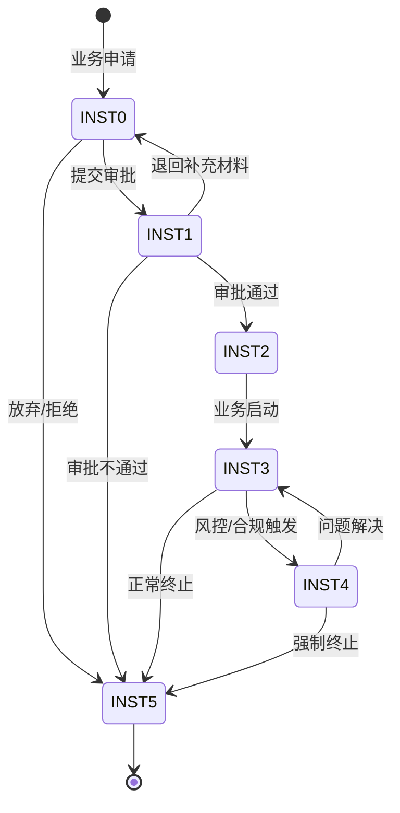

# 机构业务域（Institutional Business Domain）

> 本文档覆盖证券公司机构业务核心流程、客户准入、交易通道、结算模式与测试点，适用于公募/私募基金服务、银行机构服务、大宗交易、场外业务等场景。

---

## 机构客户准入（Institutional Client Onboarding）

### 状态全集
- 意向接洽（Prospecting）：与机构客户初步接触，了解需求
- 资料收集（DataCollection）：收集客户资质材料（营业执照、基金备案证明等）
- 尽职调查（DueDiligence）：对机构客户进行合规尽调
- 内部审批（InternalApproval）：准入审批（合规+业务+风控三方会签）
- 协议签署（ContractSigning）：签署服务协议（交易通道、结算、托管等）
- 系统开通（SystemSetup）：开通交易权限、分配席位、配置参数
- 已生效（Active）：客户准入完成，可正常使用服务（终态-持续状态）
- 已冻结（Frozen）：因合规问题或客户要求暂停服务
- 已注销（Terminated）：客户关系终止（终态）

### 状态转移规则
| 当前状态 | 触发条件 | 目标状态 | 是否允许 |
|---------|---------|---------|--------|
| 意向接洽 | 客户提交资料 | 资料收集 | ✅ |
| 意向接洽 | 客户放弃 | 已注销 | ✅ |
| 资料收集 | 资料齐全 | 尽职调查 | ✅ |
| 尽职调查 | 尽调通过 | 内部审批 | ✅ |
| 尽职调查 | 尽调发现重大风险 | 已注销 | ✅ |
| 内部审批 | 审批通过 | 协议签署 | ✅ |
| 内部审批 | 审批不通过 | 已注销 | ✅ |
| 协议签署 | 协议签署完成 | 系统开通 | ✅ |
| 系统开通 | 权限配置完成 | 已生效 | ✅ |
| 已生效 | 合规问题/客户要求 | 已冻结 | ✅ |
| 已生效 | 客户主动注销 | 已注销 | ✅ |
| 已冻结 | 问题解决 | 已生效 | ✅ |
| 已冻结 | 长期未恢复 | 已注销 | ✅ |
| 已注销 | 重新准入 | — | ❌（需新建流程） |

### 允许操作
- 提交准入申请：机构客户或客户经理发起
- 补充材料：准入过程中补充缺失的资质文件
- 变更服务内容：已生效客户变更交易通道、结算模式等
- 冻结/解冻：合规部门或客户主动操作

### 禁止操作（反例知识）
- 未完成尽调即开通交易权限：必须经过完整准入流程
- 协议未签署即分配席位：法律文件是服务前提
- 已注销客户直接恢复：需重新走准入流程
- 跳过合规审批直接开通：三方会签缺一不可

### 异常模式
- 资料过期：客户提交的营业执照/基金备案证明已过期 → 测试点：验证系统对证照有效期的校验，过期材料拒绝受理
- 审批超时：内部审批超过5个工作日未完成 → 测试点：验证审批超时提醒和升级机制
- 并发准入：同一机构通过不同渠道重复提交准入申请 → 测试点：验证客户唯一性校验（统一社会信用代码去重）
- 冻结期间交易：客户被冻结后仍有未结算的在途交易 → 测试点：验证冻结操作对在途交易的处理（允许结算，禁止新增）

### 测试点模板
- TP-INST-001：机构客户提交准入申请，验证完整流程从「意向接洽」到「已生效」，各环节审批记录完整（优先级：P0）
- TP-INST-002：提交过期营业执照，验证系统拒绝并提示证照已过期（优先级：P0）
- TP-INST-003：同一统一社会信用代码重复提交准入，验证系统拦截并提示已存在（优先级：P0）
- TP-INST-004：冻结已生效客户，验证新委托被拒绝，在途交易正常结算（优先级：P0）
- TP-INST-005：准入审批超过5个工作日，验证系统发送超时提醒给审批人和上级（优先级：P1）

### 中间态处理规则
- 「资料收集」可能持续数天至数周，需跟踪材料完整度
- 「内部审批」通常3-5个工作日，超时需升级
- 「系统开通」通常1-2个工作日，涉及多系统配置
- 「已冻结」为不定期中间态，需定期复查

### 幂等/重试规则
- 准入申请使用 客户统一社会信用代码 + 申请日期 作为幂等键
- 系统开通使用 clientId + serviceType 作为幂等键
- 冻结/解冻操作使用 clientId + operationType + operationDate 作为幂等键
- 重复操作返回当前状态，不产生重复流程

---

## PB 业务（Prime Brokerage）

### 状态全集
- 服务申请（Applied）：私募基金申请PB服务
- 方案定制（Customizing）：根据客户需求定制服务方案（交易、托管、融资、研究）
- 协议签署（ContractSigning）：签署PB服务协议
- 账户开立（AccountSetup）：开立托管账户、交易账户、估值账户
- 服务运行中（Running）：PB服务正常运行（终态-持续状态）
- 服务暂停（Paused）：因合规或风控原因暂停部分服务
- 服务终止（Terminated）：PB服务关系终止（终态）

### 状态转移规则
| 当前状态 | 触发条件 | 目标状态 | 是否允许 |
|---------|---------|---------|--------|
| 服务申请 | 需求确认 | 方案定制 | ✅ |
| 方案定制 | 方案确认 | 协议签署 | ✅ |
| 协议签署 | 签署完成 | 账户开立 | ✅ |
| 账户开立 | 账户全部开立完成 | 服务运行中 | ✅ |
| 服务运行中 | 风控触发/合规问题 | 服务暂停 | ✅ |
| 服务运行中 | 客户主动终止 | 服务终止 | ✅ |
| 服务暂停 | 问题解决 | 服务运行中 | ✅ |
| 服务暂停 | 长期未恢复 | 服务终止 | ✅ |

### 允许操作
- 交易通道服务：提供算法交易、DMA直连、篮子交易等
- 托管服务：资产托管、净值计算、份额登记
- 融资服务：股票质押、收益互换、融资融券
- 研究服务：研报推送、路演安排、专家咨询

### 禁止操作（反例知识）
- 未备案私募使用PB服务：必须验证基金业协会备案状态
- PB账户混用：不同产品的资金和证券必须严格隔离
- 超出协议范围的服务：未签署融资协议不可使用融资功能
- 净值计算未经复核发布：估值结果必须经过复核确认

### 异常模式
- 净值偏差：估值系统计算的净值与管理人自行计算存在偏差 → 测试点：验证净值差异超过阈值（0.1%）时的预警和对账流程
- 预警线触及：产品净值触及预警线（通常0.8） → 测试点：验证预警通知的及时性和后续操作限制
- 止损线触及：产品净值触及止损线（通常0.7） → 测试点：验证强制平仓流程的触发和执行
- 基金清盘：产品规模低于清盘线 → 测试点：验证清盘流程（停止申赎、变现资产、分配收益）

### 测试点模板
- TP-INST-010：私募基金申请PB服务，验证基金业协会备案状态校验（优先级：P0）
- TP-INST-011：PB产品净值跌至0.8（预警线），验证系统发送预警通知给管理人和托管人（优先级：P0）
- TP-INST-012：PB产品净值跌至0.7（止损线），验证触发强制平仓流程（优先级：P0）
- TP-INST-013：估值系统计算净值与管理人差异超过0.1%，验证触发对账流程（优先级：P0）
- TP-INST-014：不同PB产品间尝试资金划转，验证系统拒绝（账户隔离）（优先级：P0）

### 中间态处理规则
- 「方案定制」通常1-2周，需多次沟通确认
- 「账户开立」通常3-5个工作日，涉及多个系统
- 「服务暂停」需在24小时内通知客户并说明原因
- 预警/止损触发后的操作限制需实时生效

### 幂等/重试规则
- PB服务申请使用 fundCode + serviceType 作为幂等键
- 净值计算使用 fundCode + valuationDate 作为幂等键
- 预警/止损通知使用 fundCode + triggerDate + triggerType 作为幂等键
- 强制平仓指令使用 fundCode + triggerDate 作为幂等键，防止重复执行

---

## 大宗交易（Block Trade）

### 状态全集
- 意向申报（IntentDeclared）：买卖双方通过大宗交易平台发布意向
- 意向匹配（IntentMatched）：买卖双方意向匹配成功
- 成交申报（TradeDeclared）：双方确认交易要素，提交成交申报
- 交易所确认（ExchangeConfirmed）：交易所确认大宗交易成交
- 已成交（Executed）：大宗交易完成（终态）
- 申报失败（Failed）：申报被拒绝（终态）
- 已撤回（Withdrawn）：意向或申报被撤回（终态）

### 状态转移规则
| 当前状态 | 触发条件 | 目标状态 | 是否允许 |
|---------|---------|---------|--------|
| 意向申报 | 对手方响应 | 意向匹配 | ✅ |
| 意向申报 | 超时无响应 | 已撤回 | ✅ |
| 意向申报 | 主动撤回 | 已撤回 | ✅ |
| 意向匹配 | 双方确认交易要素 | 成交申报 | ✅ |
| 意向匹配 | 一方放弃 | 已撤回 | ✅ |
| 成交申报 | 交易所确认 | 交易所确认 | ✅ |
| 成交申报 | 交易所拒绝 | 申报失败 | ✅ |
| 交易所确认 | 清算交收完成 | 已成交 | ✅ |
| 已成交 | 撤销 | — | ❌ |

### 允许操作
- 发布意向：在大宗交易时段（15:00-15:30）发布买卖意向
- 确认成交：双方确认价格、数量等交易要素
- 撤回意向：在成交申报前可撤回
- VIP通道：大额交易可使用VIP专属通道

### 禁止操作（反例知识）
- 非大宗交易时段申报：大宗交易有固定时间窗口（收盘后15:00-15:30）
- 价格超出限制：大宗交易价格不得偏离收盘价±10%（A股）
- 数量低于门槛：A股大宗交易单笔不低于30万股或200万元
- 自买自卖：同一实控人控制的账户间不得进行大宗交易

### 异常模式
- 价格偏离：申报价格偏离收盘价超过限制 → 测试点：验证价格校验规则，超限申报被拒绝
- 数量不足：申报数量低于最低门槛 → 测试点：验证数量校验，低于30万股/200万元被拒绝
- 时间窗口边界：在15:30:00精确时刻提交申报 → 测试点：验证时间窗口的精确控制
- 对手方违约：成交确认后对手方资金/证券不足 → 测试点：验证交收失败的处理流程

### 测试点模板
- TP-INST-020：大宗交易时段（15:00-15:30）提交意向申报，验证正常受理（优先级：P0）
- TP-INST-021：非大宗交易时段提交申报，验证系统拒绝（优先级：P0）
- TP-INST-022：申报价格偏离收盘价12%，验证系统拒绝并提示价格超限（优先级：P0）
- TP-INST-023：申报数量20万股（低于30万股门槛），验证系统拒绝（优先级：P0）
- TP-INST-024：VIP通道大额交易（5000万元），验证优先处理和专属服务（优先级：P1）

### 中间态处理规则
- 「意向申报」有效期为当日大宗交易时段，超时自动撤回
- 「意向匹配」后需在15分钟内完成成交申报确认
- 「成交申报」提交后通常1-5分钟内获得交易所确认
- 大宗交易T+1日完成清算交收

### 幂等/重试规则
- 意向申报使用 accountId + stockCode + direction + tradeDate 作为幂等键
- 成交申报使用 buyerOrderId + sellerOrderId 作为幂等键
- 交易所确认为异步回调，使用 blockTradeId 关联
- 重复申报返回已有记录，不产生重复交易

---

## 场外业务（OTC Business）

### 状态全集
- 产品创设（ProductCreation）：设计场外衍生品（收益凭证/场外期权/报价回购）
- 内部审批（InternalApproval）：产品方案经风控和合规审批
- 产品发行（Issued）：产品正式发行，可供客户认购
- 存续期（Outstanding）：产品存续期间，进行估值和风险管理
- 到期结算（Settling）：产品到期，计算收益并结算
- 已终止（Terminated）：产品生命周期结束（终态）
- 提前终止（EarlyTerminated）：因触发条款或双方协商提前终止（终态）

### 状态转移规则
| 当前状态 | 触发条件 | 目标状态 | 是否允许 |
|---------|---------|---------|--------|
| 产品创设 | 审批通过 | 内部审批 | ✅ |
| 内部审批 | 审批通过 | 产品发行 | ✅ |
| 内部审批 | 审批不通过 | 已终止 | ✅ |
| 产品发行 | 认购完成，产品成立 | 存续期 | ✅ |
| 产品发行 | 认购不足，产品不成立 | 已终止 | ✅ |
| 存续期 | 到期日到达 | 到期结算 | ✅ |
| 存续期 | 触发敲入/敲出条款 | 提前终止 | ✅ |
| 存续期 | 双方协商提前终止 | 提前终止 | ✅ |
| 到期结算 | 结算完成 | 已终止 | ✅ |

### 允许操作
- 收益凭证：固定收益型/浮动收益型，挂钩标的（股票/指数/商品）
- 场外期权：个股期权/指数期权，欧式/美式/亚式
- 报价回购：固定期限、固定收益率的回购交易
- 每日估值：对存续期产品进行每日盯市估值

### 禁止操作（反例知识）
- 向不合格投资者销售：场外衍生品仅限专业投资者（金融资产≥500万）
- 超出名义本金限额：单一客户名义本金不得超过净资本的一定比例
- 挂钩标的违规：不得挂钩ST股票、新股等限制标的
- 未经报备开展业务：场外衍生品业务需向证券业协会报备

### 异常模式
- 敲入事件：挂钩标的价格触及敲入障碍 → 测试点：验证敲入事件的实时监测和产品条款变更
- 敲出事件：挂钩标的价格触及敲出障碍 → 测试点：验证敲出后产品提前终止和收益结算
- 估值偏差：场外产品估值与市场公允价值偏差过大 → 测试点：验证估值偏差超阈值的预警
- 对手方违约：交易对手方到期无法履约 → 测试点：验证违约处理流程和风险敞口计算

### 测试点模板
- TP-INST-030：创设收益凭证产品，验证投资者适当性校验（金融资产≥500万）（优先级：P0）
- TP-INST-031：场外期权挂钩标的为ST股票，验证系统拒绝（优先级：P0）
- TP-INST-032：产品存续期内挂钩标的触及敲出价格，验证产品提前终止并计算收益（优先级：P0）
- TP-INST-033：场外产品每日估值，验证估值结果与理论价格偏差<1%（优先级：P0）
- TP-INST-034：产品到期结算，验证收益计算正确（固定收益型：本金×年化收益率×期限/365）（优先级：P0）

### 中间态处理规则
- 「产品创设」通常1-2周，需多次方案调整
- 「存续期」为长期状态，需每日估值和风险监控
- 「到期结算」通常T+2完成资金划转
- 敲入/敲出事件需实时监测，延迟不超过行情推送延迟

### 幂等/重试规则
- 产品创设使用 productCode 作为幂等键
- 每日估值使用 productCode + valuationDate 作为幂等键
- 敲入/敲出事件使用 productCode + eventDate + eventType 作为幂等键
- 到期结算使用 productCode + settlementDate 作为幂等键

---

## 机构业务域统一状态机（B6 补强）

> 本节为 B6-1 补强内容，将机构业务域核心流程的状态机、异常模式进行统一抽象。

### 状态全集（统一抽象）

| 状态码 | 状态名 | 类型 | 说明 |
|--------|--------|------|------|
| INST0 | 申请/接洽（Applied） | 初始态 | 客户或业务发起申请 |
| INST1 | 审批中（Approving） | 中间态 | 内部审批流程进行中 |
| INST2 | 已开通/已发行（Active） | 稳定态 | 服务/产品正式生效 |
| INST3 | 运行中（Running） | 稳定态 | 业务正常运行 |
| INST4 | 异常/暂停（Suspended） | 异常态 | 因风控/合规暂停 |
| INST5 | 已终止（Terminated） | 终态 | 业务关系终止 |

### 状态转移规则（Mermaid 状态图）

### 禁止操作（反例知识）

| 反例编号 | 描述 | 预期系统行为 | 错误码 |
|----------|------|-------------|--------|
| AE-INST-001 | 未备案私募申请PB服务 | 拒绝，提示需先完成备案 | E_FUND_NOT_REGISTERED |
| AE-INST-002 | 不合格投资者购买场外产品 | 拒绝，提示适当性不匹配 | E_INVESTOR_NOT_QUALIFIED |
| AE-INST-003 | 非大宗交易时段申报 | 拒绝，提示不在交易时段 | E_NOT_TRADING_HOURS |
| AE-INST-004 | 冻结客户发起新交易 | 拒绝新委托，允许结算在途 | E_CLIENT_FROZEN |
| AE-INST-005 | PB产品间资金混用 | 拒绝划转，账户隔离 | E_ACCOUNT_ISOLATION |

### 异常模式库

| 模式编号 | 模式名称 | 触发条件 | 影响状态 | 检测方法 | 恢复策略 |
|----------|---------|---------|---------|---------|----------|
| EX-INST-001 | 净值触及预警线 | 产品净值≤0.8 | INST3→INST4 | 每日估值监控 | 通知管理人，限制加仓 |
| EX-INST-002 | 净值触及止损线 | 产品净值≤0.7 | INST3→强制平仓 | 每日估值监控 | 触发强制平仓流程 |
| EX-INST-003 | 大宗交易对手违约 | 交收日资金/券不足 | 交易所确认→失败 | 交收状态监控 | 标记违约，启动追偿 |
| EX-INST-004 | 场外产品敲入/敲出 | 标的价格触及障碍 | 存续期→条款变更/终止 | 实时行情监控 | 按合同条款执行 |
| EX-INST-005 | 客户资质过期 | 营业执照/备案证明到期 | INST3→INST4 | 定期证照检查 | 通知客户更新，限期整改 |

### 测试点模板（补强）

| 测试点ID | 场景 | 前置条件 | 操作步骤 | 期望结果 | 优先级 |
|----------|------|---------|---------|---------|--------|
| TP-INST-B6-001 | 机构准入全流程 | 新机构客户 | 完成从接洽到开通全流程 | 各环节审批记录完整，权限正确配置 | P0 |
| TP-INST-B6-002 | PB产品止损线触发 | 产品净值=0.71 | 次日估值净值=0.69 | 触发强制平仓，通知管理人和托管人 | P0 |
| TP-INST-B6-003 | 大宗交易价格边界 | 收盘价10.00 | 申报价格11.01（偏离>10%） | 系统拒绝，提示价格超限 | P0 |
| TP-INST-B6-004 | 场外期权敲出事件 | 产品存续期，敲出价120 | 标的价格触及120.01 | 产品提前终止，计算并支付收益 | P0 |
| TP-INST-B6-005 | 客户冻结后交易隔离 | 客户已冻结 | 提交新委托 | 新委托被拒，在途交易正常结算 | P0 |
| TP-INST-B6-006 | 并发准入去重 | 同一机构 | 两个渠道同时提交准入 | 第二个申请被拦截，提示已存在 | P1 |
