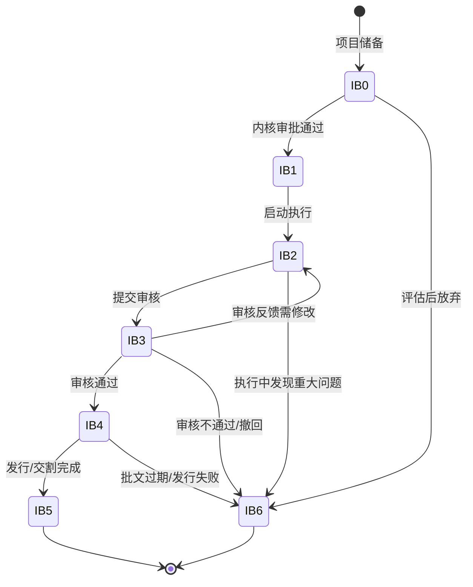

# 投行业务域（Investment Banking Domain）

> 本文档覆盖证券公司投行业务核心流程、项目管理状态机、合规要求与测试点，适用于 IPO、债券承销、并购重组等投行业务场景。

---

## IPO 项目（IPO Project）

### 状态全集
- 项目储备（Pipeline）：潜在项目，尚未正式立项
- 已立项（Initiated）：通过内部立项审批，正式启动辅导
- 辅导备案（Tutoring）：向证监局提交辅导备案，进入辅导期
- 辅导验收（TutoringAccepted）：辅导期结束，通过证监局验收
- 申报材料制作（MaterialPrep）：制作招股说明书等申报材料
- 已申报（Filed）：向交易所/证监会提交申报材料
- 审核问询中（UnderReview）：交易所审核并发出问询函
- 上市委审议（CommitteeReview）：上市委员会审议
- 已注册（Registered）：证监会注册生效（注册制）/ 核准批文（核准制）
- 发行定价（Pricing）：询价、定价、配售
- 已上市（Listed）：股票正式挂牌交易（终态）
- 已终止（Terminated）：项目主动撤回或被否决（终态）
- 中止审查（Suspended）：审核过程中因故中止

### 状态转移规则
| 当前状态 | 触发条件 | 目标状态 | 是否允许 |
|---------|---------|---------|--------|
| 项目储备 | 内部立项审批通过 | 已立项 | ✅ |
| 项目储备 | 评估后放弃 | 已终止 | ✅ |
| 已立项 | 提交辅导备案 | 辅导备案 | ✅ |
| 辅导备案 | 证监局验收通过 | 辅导验收 | ✅ |
| 辅导备案 | 辅导期发现重大问题 | 已终止 | ✅ |
| 辅导验收 | 开始制作申报材料 | 申报材料制作 | ✅ |
| 申报材料制作 | 材料提交交易所 | 已申报 | ✅ |
| 已申报 | 交易所受理并问询 | 审核问询中 | ✅ |
| 已申报 | 主动撤回 | 已终止 | ✅ |
| 审核问询中 | 问询回复完成，提交上市委 | 上市委审议 | ✅ |
| 审核问询中 | 因故中止 | 中止审查 | ✅ |
| 审核问询中 | 主动撤回 | 已终止 | ✅ |
| 上市委审议 | 审议通过 | 已注册 | ✅ |
| 上市委审议 | 审议不通过 | 已终止 | ✅ |
| 已注册 | 启动发行 | 发行定价 | ✅ |
| 已注册 | 注册批文过期未发行 | 已终止 | ✅ |
| 发行定价 | 发行完成，挂牌上市 | 已上市 | ✅ |
| 发行定价 | 发行失败（认购不足） | 已终止 | ✅ |
| 中止审查 | 恢复审查 | 审核问询中 | ✅ |
| 中止审查 | 超期未恢复 | 已终止 | ✅ |
| 已上市 | 回退至任何前序状态 | — | ❌ |
| 已终止 | 重新启动 | — | ❌（需新建项目） |

### 允许操作
- 立项申请：项目团队提交立项材料，经内核委员会审批
- 提交辅导备案：向注册地证监局提交辅导备案登记
- 提交申报材料：向交易所提交招股说明书、保荐书等全套材料
- 回复问询函：在规定时限内（通常30个工作日）回复交易所问询
- 发行定价：通过网下询价确定发行价格
- 撤回申请：项目处于「已申报」至「上市委审议」期间可主动撤回

### 禁止操作（反例知识）
- 未经内核审批直接申报：所有申报材料必须经过内核委员会审议通过
- 辅导期未满即申报：辅导期通常不少于一年（创业板/科创板可缩短）
- 注册批文过期后发行：注册批文有效期12个月，过期需重新注册
- 问询回复超期未提交：超过时限将被中止审查
- 发行价格超出询价区间：发行价必须在有效报价区间内

### 异常模式
- 问询回复超期：项目团队未在30个工作日内回复问询函 → 测试点：验证系统超期预警（提前7天/3天/1天），超期后自动标记中止审查
- 批文即将过期：注册批文12个月有效期即将届满 → 测试点：验证批文到期倒计时提醒，过期后项目状态自动变更
- 发行认购不足：网上网下认购总量不足发行数量70% → 测试点：验证发行失败的处理流程，退款机制
- 辅导期重大变更：辅导期间发行人发生重大资产重组 → 测试点：验证重大事项变更的审批流程和材料更新
- 并行问询：多轮问询同时进行（首轮+落实函） → 测试点：验证多轮问询的状态管理和时限独立计算

### 测试点模板
- TP-IB-001：提交IPO立项申请，验证内核委员会审批流程完整（投票、表决、记录），状态从「项目储备」→「已立项」（优先级：P0）
- TP-IB-002：问询回复截止日前7天，验证系统发送预警通知给项目负责人和质控（优先级：P0）
- TP-IB-003：注册批文有效期满12个月未发行，验证项目状态自动变为「已终止」（优先级：P0）
- TP-IB-004：模拟发行认购不足（认购率60%），验证触发发行失败流程（优先级：P1）
- TP-IB-005：辅导期间提交申报材料，验证系统拦截并提示辅导验收未完成（优先级：P0）

### 中间态处理规则
- 「辅导备案」为长期中间态，通常持续6-12个月
- 「审核问询中」为不定期中间态，可能经历多轮问询（2-5轮）
- 「中止审查」最长持续3个月，超期自动终止
- 「发行定价」为短期中间态，通常1-2周内完成
- 各中间态需记录进入时间，支持时限监控和超期告警

### 幂等/重试规则
- 立项申请使用 projectCode + version 作为幂等键
- 材料提交使用 filingId + submitDate 作为幂等键，重复提交返回已有记录
- 问询回复使用 inquiryId + replyRound 作为幂等键
- 状态变更操作需加分布式锁，防止并发操作导致状态不一致

---

## 债券承销（Bond Underwriting）

### 状态全集
- 项目立项（Initiated）：债券承销项目通过内部立项
- 尽职调查（DueDiligence）：对发行人进行尽职调查
- 方案设计（SchemeDesign）：设计发行方案（品种、期限、规模、利率区间）
- 评级阶段（Rating）：委托评级机构进行信用评级
- 材料申报（Filing）：向交易所/协会提交发行申请材料
- 审核通过（Approved）：监管机构/交易所审核通过
- 簿记建档（Bookbuilding）：投资者申购，确定发行利率
- 缴款发行（Issuance）：投资者缴款，债券正式发行
- 存续期管理（Outstanding）：债券存续期间的持续管理（终态-持续状态）
- 已到期（Matured）：债券到期兑付完成（终态）
- 已终止（Terminated）：项目终止（终态）

### 状态转移规则
| 当前状态 | 触发条件 | 目标状态 | 是否允许 |
|---------|---------|---------|--------|
| 项目立项 | 启动尽调 | 尽职调查 | ✅ |
| 尽职调查 | 尽调完成 | 方案设计 | ✅ |
| 尽职调查 | 发现重大风险 | 已终止 | ✅ |
| 方案设计 | 方案确定，委托评级 | 评级阶段 | ✅ |
| 评级阶段 | 评级完成 | 材料申报 | ✅ |
| 评级阶段 | 评级结果不理想，放弃 | 已终止 | ✅ |
| 材料申报 | 审核通过 | 审核通过 | ✅ |
| 材料申报 | 审核不通过/撤回 | 已终止 | ✅ |
| 审核通过 | 启动簿记建档 | 簿记建档 | ✅ |
| 审核通过 | 批文过期 | 已终止 | ✅ |
| 簿记建档 | 定价成功 | 缴款发行 | ✅ |
| 簿记建档 | 认购不足，发行失败 | 已终止 | ✅ |
| 缴款发行 | 缴款完成，债券上市 | 存续期管理 | ✅ |
| 存续期管理 | 债券到期兑付 | 已到期 | ✅ |
| 存续期管理 | 提前赎回/回售 | 已到期 | ✅ |

### 允许操作
- 簿记建档：在审核通过后的有效期内启动，确定发行利率
- 存续期信息披露：定期报告、评级跟踪、重大事项公告
- 付息兑付：按约定日期支付利息和本金
- 回售/赎回：触发回售/赎回条款时执行

### 禁止操作（反例知识）
- 未经评级直接申报：公开发行债券必须取得信用评级
- 超额发行：实际发行规模不得超过批准额度
- 存续期未披露年报：发行人必须按时披露年度报告
- 簿记建档期间修改发行条款：簿记开始后发行条款不可变更

### 异常模式
- 评级下调：存续期内评级被下调 → 测试点：验证评级变动的预警机制和投资者通知流程
- 发行人违约：发行人未按期付息或兑付 → 测试点：验证违约事件的触发、公告发布、投资者保护机制
- 簿记认购不足：投资者认购量不足计划发行量 → 测试点：验证发行失败的处理（取消发行或缩减规模）
- 批文过期：审核通过后超过有效期未发行 → 测试点：验证批文有效期监控和过期处理

### 测试点模板
- TP-IB-010：债券项目立项，验证内核审批流程（承揽→承做→内核→申报）完整（优先级：P0）
- TP-IB-011：簿记建档认购倍数<1倍，验证触发发行失败流程（优先级：P0）
- TP-IB-012：债券存续期付息日前5个工作日，验证系统发送付息提醒（优先级：P0）
- TP-IB-013：发行人未按期兑付本金，验证系统标记违约并触发投资者通知（优先级：P0）
- TP-IB-014：审核批文有效期满（12个月），验证项目状态变更为已终止（优先级：P1）

### 中间态处理规则
- 「尽职调查」通常持续1-3个月
- 「评级阶段」通常持续2-4周
- 「材料申报」审核周期：公司债（交易所）约2-3个月，企业债（发改委）约3-6个月
- 「存续期管理」为长期持续状态，需定期执行信息披露和付息操作
- 各阶段需记录关键时间节点，支持项目进度跟踪

### 幂等/重试规则
- 簿记建档使用 bondCode + bookbuildingDate 作为幂等键
- 付息指令使用 bondCode + interestDate + period 作为幂等键
- 信息披露使用 bondCode + disclosureType + disclosureDate 作为幂等键
- 重复操作返回已有结果，不产生重复业务动作

---

## 并购重组（M&A / Restructuring）

### 状态全集
- 项目接洽（Approaching）：与客户初步接洽，了解并购意向
- 已立项（Initiated）：通过内部立项审批
- 尽职调查（DueDiligence）：对标的公司进行全面尽调
- 方案设计（SchemeDesign）：设计交易方案（支付方式、定价、业绩承诺）
- 内部审批（InternalApproval）：方案经公司内核委员会审批
- 董事会审议（BoardApproval）：上市公司董事会审议通过
- 股东大会审议（ShareholderApproval）：上市公司股东大会审议通过
- 监管审核（RegulatoryReview）：证监会/交易所审核（重大资产重组需）
- 实施交割（Closing）：交易实施、资产过户、股份登记
- 已完成（Completed）：并购重组全部完成（终态）
- 已终止（Terminated）：项目终止（终态）

### 状态转移规则
| 当前状态 | 触发条件 | 目标状态 | 是否允许 |
|---------|---------|---------|--------|
| 项目接洽 | 签署保密协议，立项 | 已立项 | ✅ |
| 已立项 | 启动尽调 | 尽职调查 | ✅ |
| 尽职调查 | 尽调完成 | 方案设计 | ✅ |
| 尽职调查 | 发现重大风险 | 已终止 | ✅ |
| 方案设计 | 方案确定 | 内部审批 | ✅ |
| 内部审批 | 审批通过 | 董事会审议 | ✅ |
| 内部审批 | 审批不通过 | 方案设计 | ✅（退回修改） |
| 董事会审议 | 审议通过 | 股东大会审议 | ✅ |
| 董事会审议 | 审议不通过 | 已终止 | ✅ |
| 股东大会审议 | 审议通过 | 监管审核 | ✅ |
| 股东大会审议 | 审议不通过 | 已终止 | ✅ |
| 监管审核 | 审核通过/无条件通过 | 实施交割 | ✅ |
| 监管审核 | 有条件通过 | 方案设计 | ✅（修改后重新审议） |
| 监管审核 | 审核不通过 | 已终止 | ✅ |
| 实施交割 | 交割完成 | 已完成 | ✅ |
| 实施交割 | 交割条件未满足 | 已终止 | ✅ |

### 允许操作
- 估值评估：对标的资产进行估值（收益法/市场法/资产基础法）
- 信息披露：停牌公告、重组预案、重组报告书
- 业绩承诺设定：设定标的公司未来3年业绩承诺及补偿方案
- 独立财务顾问意见：出具独立财务顾问报告

### 禁止操作（反例知识）
- 未停牌即披露重组方案：涉及重大资产重组必须先停牌再披露
- 关联方参与表决：关联股东在股东大会中必须回避表决
- 内幕信息知情人交易：项目期间内幕信息知情人禁止买卖相关证券
- 估值方法不合理：评估增值率过高（>500%）需充分说明合理性

### 异常模式
- 停牌超期：重组停牌超过规定期限（通常不超过10个交易日） → 测试点：验证停牌时限监控和强制复牌提醒
- 方案重大调整：审核过程中方案发生重大变更 → 测试点：验证方案变更后的重新审议流程触发
- 业绩承诺未达标：并购完成后标的公司业绩不达承诺 → 测试点：验证业绩补偿计算和执行流程
- 内幕交易核查：监管要求核查项目期间相关人员交易记录 → 测试点：验证内幕信息知情人登记和交易监控

### 测试点模板
- TP-IB-020：并购重组项目立项，验证保密协议签署、利益冲突排查、内核审批完整（优先级：P0）
- TP-IB-021：重组方案提交董事会审议，验证关联董事回避表决机制（优先级：P0）
- TP-IB-022：重组停牌超过10个交易日，验证系统发送强制复牌预警（优先级：P0）
- TP-IB-023：并购完成后业绩承诺期第一年未达标（完成率80%），验证补偿金额计算正确（优先级：P1）
- TP-IB-024：内幕信息知情人在敏感期内有交易记录，验证系统告警（优先级：P0）

### 中间态处理规则
- 「尽职调查」通常持续1-3个月，需跟踪尽调进度
- 「监管审核」为不定期中间态，证监会审核通常2-3个月
- 「实施交割」通常1-2个月，涉及多方协调
- 停牌期间需每5个交易日发布进展公告
- 各审议环节需记录表决结果和反对意见

### 幂等/重试规则
- 项目立项使用 projectCode 作为幂等键
- 信息披露使用 stockCode + disclosureType + disclosureDate 作为幂等键
- 审批流程使用 projectCode + approvalStage + approvalRound 作为幂等键
- 状态变更需记录操作人和时间戳，支持审计追溯

---

## 投行项目管理统一状态机（B6 补强）

> 本节为 B6-1 补强内容，将投行业务域核心项目管理的状态机、异常模式进行统一抽象。

### 状态全集（统一抽象）

| 状态码 | 状态名 | 类型 | 说明 |
|--------|--------|------|------|
| IB0 | 储备/接洽（Pipeline） | 初始态 | 项目尚未正式立项 |
| IB1 | 已立项（Initiated） | 稳定态 | 通过内核审批，正式启动 |
| IB2 | 执行中（InProgress） | 中间态 | 尽调/方案设计/材料制作等执行阶段 |
| IB3 | 审核中（UnderReview） | 中间态 | 监管/交易所审核阶段 |
| IB4 | 已批准（Approved） | 稳定态 | 审核通过，待发行/实施 |
| IB5 | 已完成（Completed） | 终态 | 项目成功完成 |
| IB6 | 已终止（Terminated） | 终态 | 项目终止 |

### 状态转移规则（Mermaid 状态图）

### 禁止操作（反例知识）

| 反例编号 | 描述 | 预期系统行为 | 错误码 |
|----------|------|-------------|--------|
| AE-IB-001 | 未经内核审批直接申报 | 拒绝提交 | E_APPROVAL_REQUIRED |
| AE-IB-002 | 批文过期后启动发行 | 拒绝，提示批文已过期 | E_APPROVAL_EXPIRED |
| AE-IB-003 | 问询回复超期提交 | 标记中止审查 | E_REPLY_OVERDUE |
| AE-IB-004 | 内幕信息知情人交易 | 触发合规告警 | E_INSIDER_TRADING |
| AE-IB-005 | 关联方参与表决 | 拒绝投票，标记回避 | E_CONFLICT_OF_INTEREST |

### 异常模式库

| 模式编号 | 模式名称 | 触发条件 | 影响状态 | 检测方法 | 恢复策略 |
|----------|---------|---------|---------|---------|----------|
| EX-IB-001 | 问询超期 | 30个工作日内未回复 | IB3→中止 | 时限倒计时监控 | 申请延期或撤回 |
| EX-IB-002 | 批文过期 | 12个月内未发行 | IB4→IB6 | 有效期倒计时 | 重新申报 |
| EX-IB-003 | 发行失败 | 认购不足70% | IB4→IB6 | 认购统计 | 调整方案重新发行 |
| EX-IB-004 | 内幕交易 | 知情人敏感期交易 | 任意→合规调查 | 交易监控系统 | 上报监管，配合调查 |
| EX-IB-005 | 评级下调 | 存续期评级变动 | 存续期管理 | 评级跟踪 | 触发投资者通知和风险评估 |

### 测试点模板（补强）

| 测试点ID | 场景 | 前置条件 | 操作步骤 | 期望结果 | 优先级 |
|----------|------|---------|---------|---------|--------|
| TP-IB-B6-001 | 项目全流程状态流转 | 新建IPO项目 | 依次推进各阶段 | 状态按序流转，无跳跃 | P0 |
| TP-IB-B6-002 | 内核审批并发 | 同一项目多人同时审批 | 并发提交审批意见 | 投票结果正确汇总，无重复计票 | P0 |
| TP-IB-B6-003 | 问询时限监控 | 项目处于审核问询中 | 等待至截止日前7/3/1天 | 分级预警通知正确发送 | P0 |
| TP-IB-B6-004 | 项目终止后重启 | 项目已终止 | 尝试修改状态为已立项 | 系统拒绝，需新建项目 | P0 |
| TP-IB-B6-005 | 批文有效期边界 | 批文生效日为365天前 | 第366天尝试启动发行 | 系统拒绝，提示批文已过期 | P1 |
| TP-IB-B6-006 | 多轮问询管理 | 项目收到第3轮问询 | 提交第3轮回复 | 各轮问询独立计时，互不影响 | P1 |
