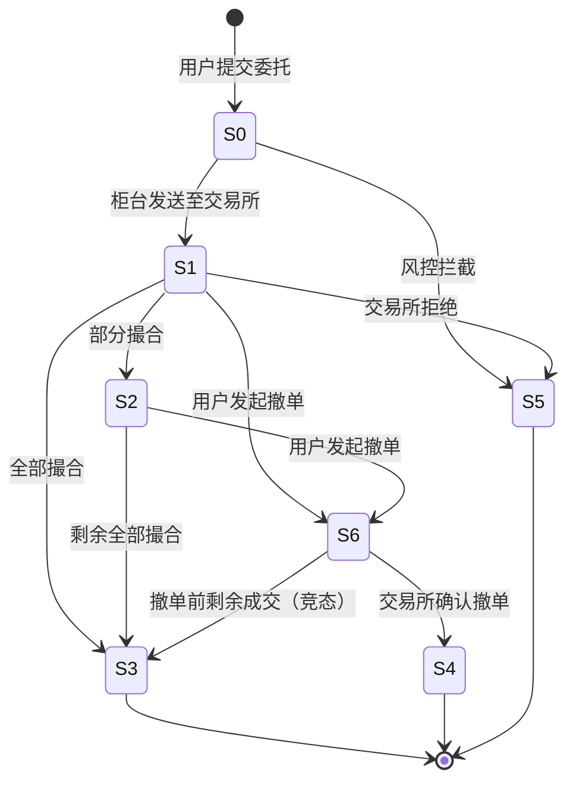

# 交易域（Trade Domain）

> 本文档覆盖证券交易核心业务对象的状态机、操作规则、异常模式与测试点，适用于 A 股现货交易场景。

---

## 限价委托单（Limit Order）

### 状态全集
- 待报（PendingSubmit）：委托已创建，尚未发送至交易所
- 已报（Submitted）：委托已发送至交易所，等待撮合
- 部分成交（PartiallyFilled）：委托已部分撮合成功，剩余数量仍在队列中
- 全部成交（FullyFilled）：委托全部撮合完成（终态）
- 已撤（Cancelled）：委托被成功撤销（终态）
- 废单（Rejected）：委托被交易所拒绝（终态）
- 撤单中（PendingCancel）：撤单请求已发送，等待交易所确认

### 状态转移规则
| 当前状态 | 触发条件 | 目标状态 | 是否允许 |
|---------|---------|---------|--------|
| 待报 | 柜台系统发送至交易所 | 已报 | ✅ |
| 待报 | 风控校验不通过 | 废单 | ✅ |
| 已报 | 交易所撮合部分成交 | 部分成交 | ✅ |
| 已报 | 交易所撮合全部成交 | 全部成交 | ✅ |
| 已报 | 交易所拒绝 | 废单 | ✅ |
| 已报 | 用户发起撤单 | 撤单中 | ✅ |
| 部分成交 | 交易所继续撮合剩余 | 全部成交 | ✅ |
| 部分成交 | 用户发起撤单 | 撤单中 | ✅ |
| 撤单中 | 交易所确认撤单 | 已撤 | ✅ |
| 撤单中 | 撤单前剩余全部成交 | 全部成交 | ✅ |
| 全部成交 | 用户发起撤单 | — | ❌ |
| 已撤 | 用户重新提交 | — | ❌ |
| 废单 | 用户修改后重新提交 | — | ❌ |
| 待报 | 直接跳转全部成交 | — | ❌ |

### 允许操作
- 提交委托：用户已通过身份认证，账户状态正常，资金/持仓充足，在交易时段内
- 撤单：委托处于「已报」或「部分成交」状态，且非集合竞价不可撤单时段
- 查询委托状态：任意时刻，任意状态均可查询
- 修改委托（仅限部分券商支持）：委托处于「已报」状态，实质为撤旧下新

### 禁止操作（反例知识）
- 对已全部成交的委托发起撤单：终态不可逆，系统应返回明确错误码
- 在非交易时段提交限价委托（非预埋单场景）：交易所不接受，应在柜台层拦截
- 提交价格超出涨跌停限制的委托：风控前置校验应拦截，不应到达交易所

### 异常模式
- 超时：委托发送至交易所后长时间无回报（>3s） → 测试点：验证柜台系统的超时重发机制是否触发，是否产生重复委托
- 重复提交：用户快速双击提交按钮，产生两笔相同委托 → 测试点：验证前端防重+后端幂等键（clientOrderId）去重是否生效
- 部分成功：批量委托中部分通过风控、部分被拒 → 测试点：验证批量接口的事务性（全部成功或全部失败 vs 部分成功）
- 网络闪断：委托发送过程中网络中断 → 测试点：验证客户端重连后能否正确同步委托状态
- 竞态条件：撤单请求与成交回报同时到达 → 测试点：验证系统对撤单中状态的并发处理，确保不会出现已撤+已成交的矛盾状态

### 测试点模板
- TP-TRADE-001：提交限价买入委托，价格在涨跌停范围内，验证委托状态从「待报」→「已报」，回报延迟 < 500ms（优先级：P0）
- TP-TRADE-002：对「已报」状态的限价委托发起撤单，验证状态变为「撤单中」→「已撤」，撤单确认延迟 < 1s（优先级：P0）
- TP-TRADE-003：对「全部成交」状态的委托发起撤单，验证系统返回错误码 E_ORDER_FINAL_STATE（优先级：P0）
- TP-TRADE-004：提交价格超出涨跌停限制的限价委托，验证风控拦截并返回明确提示（优先级：P1）
- TP-TRADE-005：模拟网络超时场景（交易所回报延迟 >5s），验证柜台超时处理逻辑（优先级：P1）

### 中间态处理规则
- 「撤单中」为中间态，最长持续时间不超过 30s（交易所撤单确认超时阈值）
- 若超时未收到交易所撤单确认，柜台系统应主动查询委托状态并更新
- 「撤单中」期间禁止用户再次发起撤单操作，前端按钮置灰
- 「部分成交」既是稳定态也可视为中间态，需展示已成交数量和剩余数量

### 幂等/重试规则
- 委托提交接口使用 clientOrderId 作为幂等键，相同 clientOrderId 的重复请求返回首次结果
- 撤单接口使用 originalOrderId 作为幂等键，重复撤单返回当前状态而非报错
- 柜台到交易所的通信超时后，重试前必须先查询委托状态，避免重复报单
- 重试策略：指数退避，最大重试 3 次，间隔 1s/2s/4s

---

## 市价委托单（Market Order）

### 状态全集
- 待报（PendingSubmit）：委托已创建，尚未发送至交易所
- 已报（Submitted）：委托已发送至交易所
- 全部成交（FullyFilled）：委托全部撮合完成（终态）
- 部分成交转撤（PartialFilledCancelled）：部分成交后剩余自动撤销（终态，上交所特有）
- 废单（Rejected）：委托被交易所拒绝（终态）

### 状态转移规则
| 当前状态 | 触发条件 | 目标状态 | 是否允许 |
|---------|---------|---------|--------|
| 待报 | 柜台发送至交易所 | 已报 | ✅ |
| 待报 | 风控校验不通过 | 废单 | ✅ |
| 已报 | 交易所即时撮合全部成交 | 全部成交 | ✅ |
| 已报 | 部分成交后对手盘不足 | 部分成交转撤 | ✅ |
| 已报 | 交易所拒绝（如停牌） | 废单 | ✅ |
| 全部成交 | 用户发起撤单 | — | ❌ |
| 部分成交转撤 | 用户发起撤单 | — | ❌ |

### 允许操作
- 提交市价委托：用户已认证，账户正常，资金充足，仅限连续竞价时段
- 查询委托状态与成交均价：任意时刻

### 禁止操作（反例知识）
- 在集合竞价时段提交市价委托：交易所不接受市价单参与集合竞价
- 对市价委托发起撤单：市价单即时撮合，通常无撤单窗口
- 市价委托指定价格参数：市价单不应携带价格字段，系统应忽略或报错

### 异常模式
- 滑点过大：市场剧烈波动时成交价偏离预期 → 测试点：验证市价保护机制（如最优五档即时成交剩余撤销）是否生效
- 流动性不足：对手盘深度不够导致部分成交 → 测试点：验证「部分成交转撤」状态的资金解冻是否正确
- 超时：市价单发送后无回报 → 测试点：验证市价单的超时处理（市价单不应长时间挂单）
- 重复提交：快速重复提交市价单 → 测试点：验证幂等机制防止重复成交

### 测试点模板
- TP-TRADE-010：连续竞价时段提交市价买入委托，验证即时成交，成交价在当前买一卖一价之间（优先级：P0）
- TP-TRADE-011：集合竞价时段提交市价委托，验证系统拒绝并返回错误码 E_MARKET_ORDER_NOT_ALLOWED（优先级：P0）
- TP-TRADE-012：流动性不足场景下提交市价委托，验证部分成交后剩余自动撤销，资金正确解冻（优先级：P1）
- TP-TRADE-013：验证市价单的最优五档保护机制，成交价不超过第五档价格（优先级：P1）

### 中间态处理规则
- 市价单通常无中间态，从「已报」到终态的转换应在毫秒级完成
- 若「已报」状态持续超过 1s，系统应触发告警，可能存在交易所通信异常
- 上交所市价单（最优五档即时成交剩余撤销）可能产生「部分成交转撤」终态

### 幂等/重试规则
- 使用 clientOrderId 作为幂等键，防止重复提交
- 市价单不建议超时重试（可能导致重复成交），超时后应查询状态确认
- 若确认未成交，可生成新的 clientOrderId 重新提交

---

## 条件单（Conditional Order）

### 状态全集
- 待激活（Pending）：条件单已创建，等待触发条件满足
- 监控中（Monitoring）：系统正在实时监控触发条件（行情价格等）
- 已触发（Triggered）：触发条件满足，正在生成实际委托
- 已转委托（Converted）：已成功生成实际委托单（终态，后续跟踪实际委托）
- 已过期（Expired）：超过有效期未触发（终态）
- 已取消（Cancelled）：用户主动取消条件单（终态）
- 触发失败（TriggerFailed）：触发后生成委托失败（终态）

### 状态转移规则
| 当前状态 | 触发条件 | 目标状态 | 是否允许 |
|---------|---------|---------|--------|
| 待激活 | 系统开始监控 | 监控中 | ✅ |
| 待激活 | 用户取消 | 已取消 | ✅ |
| 监控中 | 触发条件满足 | 已触发 | ✅ |
| 监控中 | 有效期到期 | 已过期 | ✅ |
| 监控中 | 用户取消 | 已取消 | ✅ |
| 已触发 | 成功生成委托 | 已转委托 | ✅ |
| 已触发 | 生成委托失败（资金不足等） | 触发失败 | ✅ |
| 已转委托 | 用户取消条件单 | — | ❌ |
| 已过期 | 用户重新激活 | — | ❌ |

### 允许操作
- 创建条件单：设置触发价格、方向（>=或<=）、委托参数，有效期
- 取消条件单：条件单处于「待激活」或「监控中」状态
- 查询条件单状态及关联委托：任意时刻
- 修改条件单参数：仅在「待激活」或「监控中」状态

### 禁止操作（反例知识）
- 对已触发/已转委托的条件单进行修改：触发后条件单生命周期结束
- 创建触发价格明显不合理的条件单（如负数价格）：前置校验应拦截
- 创建有效期超过系统最大限制（如 90 天）的条件单：应返回参数错误

### 异常模式
- 行情延迟：行情推送延迟导致触发时机偏差 → 测试点：验证条件单触发的行情时间戳校验，是否使用交易所时间而非本地时间
- 触发时资金不足：条件满足但账户资金已被其他委托占用 → 测试点：验证触发失败后的状态流转和用户通知
- 瞬间触发又回落：价格瞬间触及条件后立即回落（闪崩） → 测试点：验证条件单是否正确触发（应触发，因为条件已满足）
- 批量触发：多个条件单同时满足触发条件 → 测试点：验证并发触发时的资金校验和委托生成顺序

### 测试点模板
- TP-TRADE-020：创建条件单（股价>=10.00时买入），推送行情10.01，验证条件单触发并生成委托（优先级：P0）
- TP-TRADE-021：条件单触发时账户资金不足，验证状态变为「触发失败」并发送通知（优先级：P0）
- TP-TRADE-022：条件单有效期到期，验证状态自动变为「已过期」（优先级：P1）
- TP-TRADE-023：同时触发 5 个条件单，验证资金校验的串行化处理，不出现超额委托（优先级：P1）

### 中间态处理规则
- 「已触发」为中间态，从触发到生成委托应在 500ms 内完成
- 若「已触发」状态持续超过 5s，系统应标记为触发失败并告警
- 触发过程中需加分布式锁，防止同一条件单重复触发

### 幂等/重试规则
- 条件单创建使用 clientCondOrderId 作为幂等键
- 触发生成委托的过程内部重试最多 2 次，失败后标记为触发失败
- 条件监控服务重启后，需从数据库恢复所有「监控中」状态的条件单

---

## 夜市委托单（After-Hours Order / Pre-Market Order）

### 状态全集
- 已暂存（Stored）：委托在非交易时段创建，暂存于柜台系统
- 待报（PendingSubmit）：交易日开盘前，系统准备批量发送
- 已报（Submitted）：委托已发送至交易所参与集合竞价
- 全部成交（FullyFilled）：集合竞价或连续竞价中全部成交（终态）
- 部分成交（PartiallyFilled）：部分成交，剩余继续参与连续竞价
- 已撤（Cancelled）：用户在发送前撤销或交易时段内撤单成功（终态）
- 废单（Rejected）：交易所拒绝（终态）

### 状态转移规则
| 当前状态 | 触发条件 | 目标状态 | 是否允许 |
|---------|---------|---------|--------|
| 已暂存 | 交易日开盘前系统批量处理 | 待报 | ✅ |
| 已暂存 | 用户在发送前取消 | 已撤 | ✅ |
| 待报 | 柜台发送至交易所 | 已报 | ✅ |
| 待报 | 风控校验不通过 | 废单 | ✅ |
| 已报 | 集合竞价成交 | 全部成交 | ✅ |
| 已报 | 部分成交 | 部分成交 | ✅ |
| 已报 | 交易所拒绝 | 废单 | ✅ |
| 部分成交 | 剩余全部成交 | 全部成交 | ✅ |
| 部分成交 | 用户撤单 | 已撤 | ✅ |
| 已暂存 | 直接跳转已报 | — | ❌ |

### 允许操作
- 提交夜市委托：非交易时段（通常 17:00-次日 9:15），仅限限价单
- 撤销暂存委托：委托处于「已暂存」状态
- 查询夜市委托列表：任意时刻

### 禁止操作（反例知识）
- 在夜市委托时段提交市价单：夜市委托仅支持限价单
- 修改已进入「待报」状态的夜市委托：批量处理开始后不可修改
- 夜市委托指定 GTC（长期有效）类型：夜市委托仅当日有效

### 异常模式
- 隔夜风险：夜间提交委托后，次日开盘前标的停牌 → 测试点：验证系统在开盘前批量处理时是否校验标的状态，停牌标的委托应标记为废单
- 批量发送失败：开盘前批量发送过程中系统宕机 → 测试点：验证系统恢复后的断点续传机制，已发送的不重复发送
- 资金变动：夜间提交后、次日开盘前资金被其他操作占用 → 测试点：验证开盘前的二次资金校验
- 时间窗口边界：在夜市委托截止时间（如 9:15）的边界提交 → 测试点：验证时间窗口的精确控制

### 测试点模板
- TP-TRADE-030：20:00 提交夜市限价买入委托，验证状态为「已暂存」，次日 9:15 前自动变为「待报」（优先级：P0）
- TP-TRADE-031：夜市委托标的次日停牌，验证委托在批量处理时被标记为废单（优先级：P0）
- TP-TRADE-032：在「已暂存」状态撤销夜市委托，验证资金预冻结释放（优先级：P1）
- TP-TRADE-033：模拟批量发送中途系统重启，验证恢复后正确续传（优先级：P1）

### 中间态处理规则
- 「已暂存」是长时间中间态（可持续数小时），需持久化存储
- 「待报」是短暂中间态，批量处理窗口通常在 9:10-9:15 之间
- 系统需维护夜市委托的处理进度，支持断点续传
- 夜市委托暂存时需预冻结资金，防止次日资金不足

### 幂等/重试规则
- 夜市委托使用 clientOrderId + 交易日期 作为幂等键
- 批量发送过程中单笔失败不影响其他委托，失败的单独重试
- 重试策略：最多 3 次，间隔 500ms，仍失败则标记为废单并通知用户

---

## 撤单请求（Cancel Order Request）

### 状态全集
- 待发送（PendingSubmit）：撤单请求已创建，尚未发送至交易所
- 已发送（Submitted）：撤单请求已发送至交易所
- 撤单成功（Success）：交易所确认撤单成功（终态）
- 撤单失败（Failed）：交易所拒绝撤单（如委托已成交）（终态）
- 超时（Timeout）：撤单请求超时未收到回报（终态，需人工介入）

### 状态转移规则
| 当前状态 | 触发条件 | 目标状态 | 是否允许 |
|---------|---------|---------|--------|
| 待发送 | 柜台发送至交易所 | 已发送 | ✅ |
| 待发送 | 原委托已处于终态 | 撤单失败 | ✅ |
| 已发送 | 交易所确认撤单 | 撤单成功 | ✅ |
| 已发送 | 交易所拒绝（已成交） | 撤单失败 | ✅ |
| 已发送 | 超过 30s 无回报 | 超时 | ✅ |
| 撤单成功 | 再次发起撤单 | — | ❌ |
| 撤单失败 | 再次发起撤单 | — | ❌ |

### 允许操作
- 发起撤单：原委托处于「已报」或「部分成交」状态
- 查询撤单状态：任意时刻

### 禁止操作（反例知识）
- 对同一委托重复发起撤单：前一个撤单请求未到终态时，禁止重复提交
- 在集合竞价不可撤单时段（9:20-9:25）发起撤单：交易所规则禁止
- 对他人委托发起撤单：权限校验必须确保操作人与委托人一致

### 异常模式
- 撤单与成交竞态：撤单请求发送后、确认前，原委托被撮合成交 → 测试点：验证系统正确处理为撤单失败，不影响成交记录
- 网络超时：撤单请求发送后无回报 → 测试点：验证 30s 超时后系统主动查询原委托状态并更新
- 重复撤单：用户快速多次点击撤单 → 测试点：验证防重机制，同一委托同时只有一个撤单请求在途
- 批量撤单：用户一键撤销所有委托 → 测试点：验证批量撤单的并发处理和部分失败的结果汇总

### 测试点模板
- TP-TRADE-040：对「已报」状态委托发起撤单，验证撤单成功后原委托状态变为「已撤」（优先级：P0）
- TP-TRADE-041：对「全部成交」状态委托发起撤单，验证系统返回撤单失败（优先级：P0）
- TP-TRADE-042：9:20-9:25 时段发起撤单，验证系统拦截并提示不可撤单时段（优先级：P0）
- TP-TRADE-043：模拟撤单与成交竞态，验证最终状态一致性（优先级：P1）
- TP-TRADE-044：批量撤单 100 笔委托，验证并发处理性能和结果准确性（优先级：P1）

### 中间态处理规则
- 「已发送」为中间态，最长持续 30s
- 超时后系统自动查询原委托状态：若已成交则标记撤单失败，若仍在挂单则重新发送撤单
- 撤单请求在途期间，前端应禁用该委托的撤单按钮

### 幂等/重试规则
- 撤单请求使用 originalOrderId + cancelSeqNo 作为幂等键
- 同一委托的撤单请求串行处理，不允许并发
- 超时重试前必须查询原委托状态，若已终态则不再重试
- 重试策略：最多 2 次，间隔 2s

---

## 委托生命周期统一状态机（B6 补强）

> 本节为 B6-1 补强内容，将交易域核心委托对象的状态机、异常模式进行统一抽象，便于测试用例生成引擎直接消费。

### 状态全集（统一抽象）

| 状态码 | 状态名 | 类型 | 说明 |
|--------|--------|------|------|
| S0 | 待报（PendingSubmit） | 初始态 | 委托已创建，尚未发送至交易所 |
| S1 | 已报（Submitted） | 稳定态 | 委托已到达交易所，等待撮合 |
| S2 | 部分成交（PartiallyFilled） | 中间态/稳定态 | 部分撮合成功，剩余在队列 |
| S3 | 全部成交（FullyFilled） | 终态 | 全部撮合完成 |
| S4 | 已撤（Cancelled） | 终态 | 委托被成功撤销 |
| S5 | 废单（Rejected） | 终态 | 委托被交易所/风控拒绝 |
| S6 | 撤单中（PendingCancel） | 中间态 | 撤单请求在途，等待确认 |
| S7 | 已暂存（Stored） | 初始态（夜市） | 非交易时段暂存 |

### 状态转移规则（Mermaid 状态图）

### 允许操作（按状态）

| 状态 | 允许操作 | 前置条件 |
|------|---------|----------|
| S0 | 取消（本地删除） | 尚未发送 |
| S1 | 撤单 | 非不可撤单时段（9:20-9:25除外） |
| S2 | 撤单 | 同上 |
| S6 | 无（等待中） | 前端按钮置灰 |
| S3/S4/S5 | 仅查询 | 终态不可操作 |

### 禁止操作（反例知识）

| 反例编号 | 描述 | 预期系统行为 | 错误码 |
|----------|------|-------------|--------|
| AE-001 | 对终态委托发起撤单 | 返回错误，不发送至交易所 | E_ORDER_FINAL_STATE |
| AE-002 | 重复提交相同 clientOrderId | 返回首次结果（幂等） | — |
| AE-003 | 非交易时段提交非预埋单 | 柜台层拦截 | E_MARKET_CLOSED |
| AE-004 | 价格超涨跌停限制 | 风控前置拦截 | E_PRICE_LIMIT |
| AE-005 | 集合竞价时段提交市价单 | 拒绝 | E_MARKET_ORDER_NOT_ALLOWED |
| AE-006 | 9:20-9:25 发起撤单 | 拒绝 | E_CANCEL_NOT_ALLOWED |
| AE-007 | 同一委托并发撤单 | 第二个请求被拒 | E_CANCEL_IN_PROGRESS |

### 异常模式库

| 模式编号 | 模式名称 | 触发条件 | 影响状态 | 检测方法 | 恢复策略 |
|----------|---------|---------|---------|---------|----------|
| EX-T-001 | 重复委托 | 用户快速双击/网络重传 | S0→S1 可能产生两笔 | clientOrderId 幂等键去重 | 后端返回首次结果 |
| EX-T-002 | 幂等键冲突 | 不同业务意图使用相同 clientOrderId | S0 | 唯一索引冲突 | 客户端生成 UUID v4 |
| EX-T-003 | 部分成交后撤单竞态 | 撤单请求与成交回报同时到达 | S2→S6 vs S2→S3 | 数据库行锁+状态版本号 | 以交易所回报为准 |
| EX-T-004 | 超时无回报 | 网络抖动/交易所过载 | S0→S1 卡住 | 3s 超时检测 | 查询后决定重发或标记异常 |
| EX-T-005 | 资金冻结与委托不一致 | 冻结成功但委托发送失败 | S0 + 资金已冻结 | 对账检测 | 自动解冻孤立冻结 |
| EX-T-006 | 批量委托部分失败 | 批量接口中部分风控不通过 | 混合态 | 逐笔结果码 | 返回明细结果，不回滚成功笔 |

### 测试点模板（补强）

| 测试点ID | 场景 | 前置条件 | 操作步骤 | 期望结果 | 优先级 |
|----------|------|---------|---------|---------|--------|
| TP-T-B6-001 | 重复委托幂等验证 | 账户正常，资金充足 | 相同 clientOrderId 提交两次 | 第二次返回首次委托结果，不产生新委托 | P0 |
| TP-T-B6-002 | 撤单与成交竞态 | 委托处于「已报」 | 同时触发撤单和模拟成交回报 | 最终状态唯一（已撤或全成），无矛盾 | P0 |
| TP-T-B6-003 | 部分成交资金冻结一致性 | 买入委托部分成交 | 查询冻结金额 | 冻结额 = 剩余数量 × 委托价 × (1+费率) | P0 |
| TP-T-B6-004 | 超时重发防重复 | 模拟交易所回报延迟 5s | 柜台触发超时重发 | 交易所收到重复报单返回已有结果 | P1 |
| TP-T-B6-005 | 孤立冻结自动解冻 | 冻结成功但委托发送失败 | 等待对账任务执行 | 孤立冻结记录被自动解冻 | P1 |
| TP-T-B6-006 | 批量委托部分失败 | 提交10笔，其中3笔超涨跌停 | 调用批量委托接口 | 7笔成功+3笔返回 E_PRICE_LIMIT | P1 |

---

## 融资融券业务（Margin Trading）

### 业务背景
融资融券（两融）是指投资者向券商借入资金买入证券（融资）或借入证券卖出（融券）的交易行为。两融业务是券商重要的信用业务，涉及担保品管理、维持担保比例监控、强制平仓等核心环节。

### 状态全集（信用账户）
- 待开通（PendingOpen）：客户已申请但未完成两融开通
- 正常（Normal）：信用账户正常使用，维持担保比例≥警戒线
- 关注（Attention）：维持担保比例低于警戒线（通常150%）但高于追保线
- 追保（MarginCall）：维持担保比例低于追保线（通常130%），需追加担保物
- 平仓警告（ForceCloseWarning）：追保期限到期仍未补足，即将强制平仓
- 强制平仓中（ForceLiquidating）：系统正在执行强制平仓
- 冻结（Frozen）：信用账户被冻结（合规原因或客户申请）
- 已了结（Settled）：所有负债已清偿，信用账户关闭（终态）

### 状态转移规则
| 当前状态 | 触发条件 | 目标状态 | 是否允许 |
|---------|---------|---------|--------|
| 待开通 | 审核通过+协议签署 | 正常 | ✅ |
| 正常 | 维持担保比例<150% | 关注 | ✅ |
| 关注 | 维持担保比例<130% | 追保 | ✅ |
| 关注 | 维持担保比例≥150% | 正常 | ✅ |
| 追保 | T+2日内补足至≥150% | 正常 | ✅ |
| 追保 | T+2日到期未补足 | 平仓警告 | ✅ |
| 平仓警告 | 系统发起强制平仓 | 强制平仓中 | ✅ |
| 强制平仓中 | 平仓完成，比例恢复 | 正常 | ✅ |
| 强制平仓中 | 全部负债清偿 | 已了结 | ✅ |
| 正常 | 客户主动了结所有负债 | 已了结 | ✅ |
| 追保 | 直接跳过平仓警告强平 | — | ❌ |

### 核心业务规则

#### 融资买入
- 标的范围：仅限融资标的证券名单内的股票
- 保证金比例：融资保证金比例≥100%（监管最低要求）
- 可融资额度：min(授信额度-已用额度, 可用保证金/融资保证金比例)
- 期限：最长不超过6个月（可展期，展期后总期限不超过合同约定）

#### 融券卖出
- 标的范围：仅限融券标的证券名单内的股票
- 保证金比例：融券保证金比例≥50%（监管最低要求）
- 券源：需有可用券源，券源不足时无法融券
- 还券方式：买券还券（市场买入相同证券归还）或直接还券（以持有证券归还）

#### 维持担保比例
- 计算公式：维持担保比例 = (信用账户总资产) / (融资负债+融券负债)
- 警戒线：150%（各券商可自行设定，不低于监管要求）
- 追保线：130%（各券商可自行设定）
- 平仓线：110%（强制平仓触发线）
- 实时计算：根据持仓市值和负债实时更新

#### 强制平仓
- 触发条件：追保期限到期仍未补足担保物
- 平仓目标：平仓至维持担保比例≥150%
- 平仓顺序：先平融券负债（买券还券），再平融资负债（卖出担保品）
- 平仓限制：不得在集合竞价时段平仓，涨跌停时可能无法平仓

### 异常模式
- 极端行情下维持担保比例急剧下降：开盘即跌停导致无法平仓 → 测试点：验证连续跌停场景下的平仓策略和风险敞口计算
- 融券标的停牌：融券卖出后标的停牌无法买券还券 → 测试点：验证停牌期间融券负债的处理和到期展期机制
- 担保品折算率调整：券商下调担保品折算率导致维持担保比例突变 → 测试点：验证折算率调整后的批量重算和通知
- 集中度超限：单一标的融资/融券集中度超过限制 → 测试点：验证集中度校验的实时性

### 测试点模板
- TP-TRADE-050：融资买入，验证可融资额度=min(授信余额, 可用保证金/保证金比例)（优先级：P0）
- TP-TRADE-051：维持担保比例降至130%以下，验证系统触发追保通知（优先级：P0）
- TP-TRADE-052：追保T+2到期未补足，验证系统发起强制平仓（优先级：P0）
- TP-TRADE-053：融券卖出非标的证券，验证系统拦截（优先级：P0）
- TP-TRADE-054：强制平仓至维持担保比例≥150%后停止，验证平仓数量计算准确（优先级：P1）
- TP-TRADE-055：融资合约到期，验证系统自动发起了结或展期提醒（优先级：P1）

### 幂等/重试规则
- 融资融券委托使用 creditAccountId + clientOrderId 作为幂等键
- 强制平仓指令使用 accountId + triggerDate + seqNo 作为幂等键
- 维持担保比例计算为纯函数，相同持仓和行情产生相同结果
- 追保通知使用 accountId + marginCallDate 作为幂等键，同一追保事件不重复通知

---

## 股票质押业务（Stock Pledge）

### 业务背景
股票质押式回购交易是指符合条件的资金融入方以所持有的股票或其他证券质押，向符合条件的资金融出方融入资金，并约定在未来返还资金、解除质押的交易。

### 状态全集（质押合约）
- 待审批（PendingApproval）：质押申请已提交，等待审批
- 已审批（Approved）：审批通过，等待初始交易
- 初始交易中（InitTrading）：正在执行初始交易（质押登记+资金划转）
- 存续中（Active）：质押合约正常存续
- 预警（Warning）：履约保障比例低于预警线
- 违约（Default）：履约保障比例低于违约线或到期未购回
- 购回中（Repurchasing）：正在执行购回交易（解除质押+资金归还）
- 已了结（Completed）：合约正常了结（终态）
- 违约处置中（Disposing）：违约后正在处置质押股票
- 已处置（Disposed）：违约处置完成（终态）

### 状态转移规则
| 当前状态 | 触发条件 | 目标状态 | 是否允许 |
|---------|---------|---------|--------|
| 待审批 | 审批通过 | 已审批 | ✅ |
| 待审批 | 审批拒绝 | — | ✅（终态：已拒绝） |
| 已审批 | 发起初始交易 | 初始交易中 | ✅ |
| 初始交易中 | 交易完成 | 存续中 | ✅ |
| 存续中 | 履约保障比例<预警线 | 预警 | ✅ |
| 存续中 | 到期日到达，发起购回 | 购回中 | ✅ |
| 预警 | 履约保障比例<违约线或到期未购回 | 违约 | ✅ |
| 预警 | 补充质押后比例恢复 | 存续中 | ✅ |
| 违约 | 发起违约处置 | 违约处置中 | ✅ |
| 违约 | 融入方补足资金 | 购回中 | ✅ |
| 购回中 | 购回完成 | 已了结 | ✅ |
| 违约处置中 | 处置完成 | 已处置 | ✅ |

### 核心业务规则

#### 初始交易
- 质押率：初始交易质押率不超过60%（单只股票）
- 质押股票限制：限售股、ST股票、当日买入股票不可质押
- 融资金额：质押股票市值 × 质押率
- 质押登记：通过中国结算办理质押登记

#### 购回交易
- 到期购回：合约到期日融入方归还本金+利息，解除质押
- 提前购回：融入方可申请提前购回（需融出方同意）
- 延期购回：双方协商延期，总期限不超过3年

#### 履约保障比例
- 计算公式：履约保障比例 = 质押股票市值 / (融资本金+应计利息)
- 预警线：通常160%（各券商自定）
- 违约线：通常140%（各券商自定）
- 补充质押：比例低于预警线时，融入方需补充质押物或部分还款

#### 违约处置
- 处置方式：集中竞价卖出、大宗交易、协议转让
- 处置限制：每日处置数量不超过质押股票的1%
- 处置所得：优先偿还融资本金和利息，剩余返还融入方

### 异常模式
- 质押股票停牌：存续期间质押标的长期停牌 → 测试点：验证停牌期间履约保障比例的计算方式（使用停牌前收盘价）
- 质押股票退市：质押标的触发退市 → 测试点：验证退市场景下的违约处置流程
- 利率调整：合约存续期间基准利率调整 → 测试点：验证浮动利率合约的利息重算
- 限售股解禁：质押的限售股解禁后的处理 → 测试点：验证解禁后质押状态和可处置性的更新

### 测试点模板
- TP-TRADE-060：初始交易，验证质押率不超过60%，融资金额=市值×质押率（优先级：P0）
- TP-TRADE-061：履约保障比例降至预警线以下，验证系统发送预警通知（优先级：P0）
- TP-TRADE-062：到期购回，验证购回金额=本金+应计利息，质押解除（优先级：P0）
- TP-TRADE-063：违约处置，验证每日处置不超过质押股票1%（优先级：P1）
- TP-TRADE-064：限售股质押申请，验证系统拦截（优先级：P0）

---

## 授信风控（Credit Risk Control）

### 业务背景
授信是券商对客户信用业务（融资融券、股票质押等）的额度管理，涉及授信额度计算、审批流程、额度使用和监控等环节。

### 状态全集（授信申请）
- 待评估（PendingAssess）：客户提交授信申请，等待信用评估
- 评估中（Assessing）：系统/人工正在进行信用评估
- 待审批（PendingApproval）：评估完成，等待审批
- 已审批（Approved）：授信审批通过，额度生效
- 已拒绝（Rejected）：授信申请被拒绝（终态）
- 额度冻结（CreditFrozen）：因风险事件冻结授信额度
- 已到期（Expired）：授信额度到期失效（终态）

### 核心业务规则

#### 授信额度计算
- 评估维度：客户资产规模、信用记录、担保品价值、历史交易行为
- 额度模型：基础额度 × 信用系数 × 担保品折算系数
- 额度上限：不超过客户净资产的一定比例（通常200%）
- 集中度限制：单一客户授信不超过券商净资本的一定比例

#### 授信审批流程
- 小额授信（≤500万）：系统自动审批
- 中额授信（500万-5000万）：分公司信用管理部审批
- 大额授信（>5000万）：总部信用管理委员会审批
- 特殊授信：关联方、高风险客户需额外合规审查

#### 额度调整
- 上调额度：需重新评估+审批
- 下调额度：风控部门可直接下调（风险事件触发）
- 临时额度：短期临时增加额度（有效期通常不超过30天）
- 额度冻结：合规/风控事件触发，冻结期间不可使用

### 异常模式
- 额度超用：并发交易导致实际用信超过授信额度 → 测试点：验证额度扣减的原子性和并发控制
- 担保品价值波动：担保品市值大幅下跌导致授信额度需调整 → 测试点：验证担保品价值变动对授信额度的联动影响
- 审批超时：授信审批流程超过规定时限 → 测试点：验证审批超时的自动升级和提醒机制
- 关联授信：集团客户多个子公司分别申请授信 → 测试点：验证集团层面的授信集中度校验

### 测试点模板
- TP-TRADE-070：小额授信申请（300万），验证系统自动审批通过（优先级：P0）
- TP-TRADE-071：授信额度使用，验证可用额度=授信额度-已用额度-冻结额度（优先级：P0）
- TP-TRADE-072：并发融资交易，验证额度扣减不超额（优先级：P0）
- TP-TRADE-073：风险事件触发额度冻结，验证冻结后新交易被拒绝（优先级：P0）
- TP-TRADE-074：授信到期前30天，验证系统发送续期提醒（优先级：P1）

---

## 大宗交易（Block Trading）

### 业务背景
大宗交易是指达到交易所规定的最低限额的证券单笔买卖申报，通过专门的大宗交易系统成交。A股大宗交易在收盘后（15:00-15:30）通过协商或盘后定价方式完成。

### 状态全集（大宗交易申报）
- 意向申报（IntentDeclared）：买卖双方提交交易意向
- 意向匹配（IntentMatched）：买卖双方意向匹配成功
- 成交申报（TradeSubmitted）：双方确认交易要素，提交成交申报
- 已成交（Traded）：交易所确认成交（终态）
- 申报失败（Failed）：申报被交易所拒绝（终态）
- 已撤回（Withdrawn）：一方撤回意向或申报（终态）

### 核心业务规则

#### 申报条件
- 最低限额：A股单笔≥30万股或≥200万元
- 申报时间：15:00-15:30（盘后固定价格交易：15:05-15:30）
- 价格范围：当日收盘价的90%-110%（盘后定价交易以收盘价成交）

#### 定价规则
- 协商成交：买卖双方协商确定价格，在收盘价90%-110%范围内
- 盘后定价：以当日收盘价成交
- 价格偏离：成交价格偏离收盘价超过一定比例需说明原因

#### 锁定期
- 大宗交易买入的股票：次日即可卖出（无锁定期）
- 特殊情况：通过大宗交易减持的，受减持新规约束（如大股东90天内减持不超过2%）
- 协议转让：可能有锁定期约定

### 异常模式
- 意向不匹配：买卖双方价格/数量差异过大无法匹配 → 测试点：验证意向匹配的容差规则和失败处理
- 申报时间超限：15:30后提交申报 → 测试点：验证系统时间窗口的精确控制
- 价格超范围：申报价格超出收盘价90%-110% → 测试点：验证价格范围校验
- 对手方违约：一方确认后另一方撤回 → 测试点：验证单方撤回的处理和通知机制

### 测试点模板
- TP-TRADE-080：大宗交易申报，验证数量≥30万股或金额≥200万元的门槛校验（优先级：P0）
- TP-TRADE-081：申报价格超出收盘价110%，验证系统拒绝（优先级：P0）
- TP-TRADE-082：15:30后提交申报，验证系统拒绝并提示超时（优先级：P0）
- TP-TRADE-083：盘后定价交易，验证成交价格=当日收盘价（优先级：P0）
- TP-TRADE-084：大股东通过大宗交易减持，验证90天2%的减持限制校验（优先级：P1）

---

## 场外交易（OTC Trading）

### 业务背景
场外交易（OTC）是指在交易所之外进行的证券交易，券商OTC业务主要包括柜台市场、收益凭证、场外期权等产品。

### 核心业务对象

#### OTC柜台市场
- 产品类型：收益凭证、资管产品份额、私募基金份额
- 交易方式：报价驱动（做市商制度），非撮合交易
- 投资者门槛：合格投资者（金融资产≥300万或近3年年均收入≥50万）
- 登记结算：通过券商自有登记结算系统

#### 收益凭证
- 定义：券商以自身信用发行的债务融资工具
- 类型：固定收益型、浮动收益型（挂钩标的资产）
- 期限：通常3个月-2年
- 风险等级：固定收益型R2-R3，浮动收益型R3-R5
- 发行限额：余额不超过券商净资本的60%

#### 场外期权
- 定义：在交易所外由券商与客户一对一签署的期权合约
- 参与者：仅限专业投资者（机构客户为主）
- 标的：个股、指数、商品等
- 合规要求：需向中证报价系统报备，个股期权需满足标的筛选条件
- 保证金：买方支付权利金，卖方（券商）需计提风险准备

### 异常模式
- 收益凭证到期兑付：到期日资金兑付延迟 → 测试点：验证到期自动兑付流程和资金到账时效
- 场外期权行权：到期日客户行权但券商对冲头寸不足 → 测试点：验证行权结算流程和对冲管理
- 做市报价异常：做市商报价偏离合理范围 → 测试点：验证报价偏离度监控和异常报价拦截
- 投资者门槛校验：不合格投资者尝试购买OTC产品 → 测试点：验证合格投资者认定的前置校验

### 测试点模板
- TP-TRADE-090：收益凭证申购，验证合格投资者门槛校验（金融资产≥300万）（优先级：P0）
- TP-TRADE-091：收益凭证到期，验证自动兑付本金+收益（优先级：P0）
- TP-TRADE-092：场外期权报备，验证向中证报价系统的报备数据完整性（优先级：P0）
- TP-TRADE-093：OTC产品做市报价，验证买卖价差在合理范围内（优先级：P1）
- TP-TRADE-094：浮动收益凭证到期，验证挂钩标的收益计算准确性（优先级：P1）

---

## 极速交易（Low-Latency Trading）

### 业务背景
极速交易系统面向专业投资者和量化交易机构，提供低延迟的行情订阅和报单通道。核心目标是将委托从客户端到交易所的端到端延迟控制在微秒级别。

### 核心架构要素

#### 低延迟架构
- 网络层：专线接入、内核旁路（Kernel Bypass）、FPGA加速
- 协议层：二进制协议（如STEP/Binary）替代文本协议
- 处理层：无锁队列、内存映射、CPU亲和性绑定
- 存储层：内存数据库、预分配内存池

#### 行情订阅
- Level1行情：最优买卖价+最新成交价，延迟要求<1ms
- Level2行情：十档/全档行情，逐笔成交，延迟要求<5ms
- 快照行情：定时推送（3s/6s间隔）
- 逐笔行情：每笔委托/成交实时推送（数据量大，需高带宽）

#### 报单通道
- 普通通道：通过柜台系统报单，延迟10-50ms
- 极速通道：绕过柜台直连交易所网关，延迟<1ms
- 专用通道：独享物理链路，避免排队延迟
- 报单协议：FIX协议、券商私有二进制协议

#### 订单类型
- 限价单（Limit）：指定价格
- 市价单（Market）：最优价格成交
- FAK（Fill and Kill）：立即成交剩余撤销
- FOK（Fill or Kill）：全部成交或全部撤销
- 冰山单（Iceberg）：仅显示部分数量
- 算法单（Algo）：TWAP/VWAP/POV等算法拆单

### 异常模式
- 行情延迟突增：网络抖动导致行情推送延迟 → 测试点：验证行情延迟监控告警（阈值如>10ms）和降级策略
- 报单通道故障：极速通道不可用需切换至普通通道 → 测试点：验证通道故障检测和自动切换机制
- 流量控制：交易所对单账户报单频率限制（如每秒不超过50笔） → 测试点：验证流控机制和超限拒绝的错误码
- 行情乱序：UDP组播行情包乱序到达 → 测试点：验证行情序号检测和乱序重排机制
- 闪断重连：网络闪断后的快速重连和状态恢复 → 测试点：验证重连后的行情补全和委托状态同步

### 测试点模板
- TP-TRADE-100：极速通道报单，验证端到端延迟<1ms（P99）（优先级：P0）
- TP-TRADE-101：Level2行情订阅，验证行情推送延迟<5ms（优先级：P0）
- TP-TRADE-102：极速通道故障，验证自动切换至普通通道，切换延迟<100ms（优先级：P0）
- TP-TRADE-103：单账户报单频率超过50笔/秒，验证流控拦截（优先级：P0）
- TP-TRADE-104：FOK订单部分无法成交，验证全部撤销（优先级：P0）
- TP-TRADE-105：行情乱序场景，验证序号检测和重排后数据正确性（优先级：P1）
- TP-TRADE-106：网络闪断5s后恢复，验证行情补全和委托状态一致性（优先级：P1）

### 性能基准
| 指标 | 普通通道 | 极速通道 | 说明 |
|------|---------|---------|------|
| 报单延迟（P50） | 10ms | 0.3ms | 客户端到交易所 |
| 报单延迟（P99） | 50ms | 1ms | 尾部延迟 |
| 行情延迟（L1） | 5ms | 0.5ms | 交易所到客户端 |
| 行情延迟（L2） | 10ms | 2ms | 全档行情 |
| 吞吐量 | 1000笔/s | 5000笔/s | 单通道 |
| 可用性 | 99.9% | 99.99% | 年度 |
