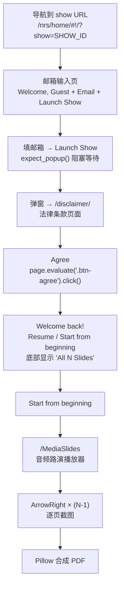

# NetRoadShow 实操记录（2026-05-12 已验证）

基于 KODIT Audio Roadshow Plus（32 slides）实测。

## 已验证完整流程



## 核心数据

- **路演 ID:** 1982744（从弹窗 URL 提取）
- **URL:** `https://www.netroadshow.com/presentation/v2/1982744/MediaSlides`
- **总页数:** 32 slides
- **用户邮箱:** your-email@your-company.com（示例）
- **输出大小:** ~4.8 MB（32 页 1920×1080 截图）

## 关键技术要点

### 弹窗捕获

```
# ✅ 必须用 expect_popup() 阻塞等待
with page.expect_popup() as popup_info:
    page.get_by_text("Launch Show").click()
pp = popup_info.value

# ❌ 不能用 page.on("popup") — 事件触发太晚
```

### disclaimer div 按钮

Agree/Disagree 是 `<div>` 不是 `<button>`，Playwright 标准 click 不触发：

```
# ✅
pp.evaluate('document.querySelector(".btn-agree").click()')

# ❌ page.get_by_text("Agree").click() — 不触发
# ❌ page.locator(".btn-agree").click() — 可能不触发
```

### 翻页

```
page.keyboard.press("ArrowRight")  # 前进一页
```

每次翻页后等 1.5s 让渲染完成再截图。

### 图片数管理

进入 MediaSlides 后第 1 张截图就是 slide 1，按一次 ArrowRight 跳到 slide 2，再截。所以 `N` 张截图 = `N` 次 Keyboard.press 之前各截一次。

### PDF 合成

```
imgs[0].save(path, save_all=True, append_images=imgs[1:], format='PDF', resolution=150)
# format='PDF' 必须显式指定，否则 Pillow 缺 JPEG 支持会报 KeyError
```

## 已知陷阱

| 问题 | 方案 |
|------|------|
| Camofox 无法处理 NetRoadShow | 直接用 Playwright |
| Session taint（失败后账号锁定） | 重建干净浏览器上下文 |
| 密码登录被安全组拦截 | Email-Only 流程（已验证） |
| Angular hash 路由编码 | Playwright 原生支持，无需额外处理 |

## 实测截图

截图尺寸 1920×1080，每张 350-924 KB，JPEG 质量良好。
最终 PDF 可在飞书直接打开预览。
