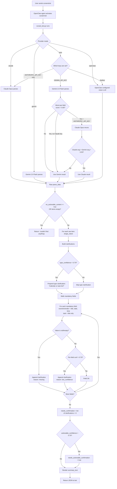
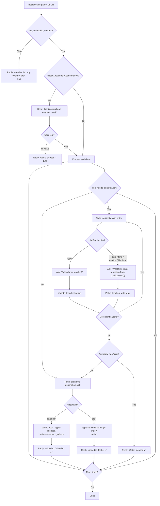

# Scrask decision flow

What happens between "user sends a screenshot" and "item saved in Calendar / Task list."

There are two sides to this flow. The **parser side** (`scripts/scrask_bot.py`) is stateless — it ingests a screenshot, decides what to extract, and emits a JSON intent with clarification questions baked in. The **bot side** (the OpenClaw agent running on Telegram / iMessage / Slack) is the conversation loop — it renders the parser's output, asks the clarification questions, and dispatches each item to the user's installed destination skill.

## Thresholds at a glance

| Threshold                       | Default | Where it gates                                                                 |
|---------------------------------|---------|--------------------------------------------------------------------------------|
| `FALLBACK_THRESHOLD`            | 0.60    | Worst per-field score below this → Claude reruns the parse.                    |
| `FALLBACK_IMPROVEMENT_MIN`      | 0.05    | Claude's result is only kept if its avg confidence beats Gemini by this much.  |
| `ACTIONABLE_THRESHOLD`          | 0.70    | Top-level `actionable_confidence` below this → "Is this actually an event/task?" |
| `TYPE_THRESHOLD`                | 0.70    | Per-item `type_confidence` below this → "Calendar or task list?"               |
| `FIELD_THRESHOLD`               | 0.70    | Per mandatory field: null or below this → targeted field clarification.        |
| `DEFAULT_CONFIDENCE_THRESHOLD`  | 0.75    | Legacy per-item gate. Only kicks in for items with no `confidences{}` block.   |

## 1. Parser side — what `scrask_bot.py` does

## 2. Bot side — what the OpenClaw agent does with the parser output

## 3. End-to-end happy path, narrated

Cleanest case — a meeting invite email screenshot with everything visible:

1. User sends screenshot. Bot acks: "Got it, analyzing…"
2. `scrask_bot.py` runs in auto mode. Gemini parses. Worst per-field score is 0.92. No Claude fallback.
3. `actionable_confidence` = 0.96. Above threshold, so no actionable gate.
4. `shape_intent` walks mandatory fields for `type: event` — title, date, time all present, all above 0.85. No clarifications. `needs_confirmation: false`.
5. Bot reads `needs_confirmation: false`, routes to `calctl` (first available calendar skill). Skill creates the event.
6. Bot replies: "📅 Added to Calendar: **Team Standup** — 2026-03-01 at 09:00"

## 4. End-to-end ambiguous path, narrated

Vague WhatsApp — "lets meet fri":

1. User sends screenshot. Bot acks.
2. Gemini parses. Time confidence is 0.0 (no time visible), date confidence is 0.60. Worst per-field score is 0.0, below 0.60 threshold → Claude reruns.
3. Claude's avg is 0.65, Gemini's was 0.55. Improvement 0.10 ≥ 0.05 → Claude result kept.
4. `actionable_confidence` = 0.85. No actionable gate.
5. `shape_intent` walks mandatory fields for `type: event`:
   - `title` OK (above threshold)
   - `date` below threshold → clarification `reason: low_confidence`
   - `time` is null → clarification `reason: missing`
   - `needs_confirmation: true`
6. Bot reads `clarifications[]` and asks: "I need to confirm: What date is meet on Friday? What time is meet on Friday?"
7. User replies. Bot patches the fields, routes to `calctl`, confirms "📅 Added to Calendar: …"

## 5. End-to-end actionable-gate path, narrated

A flyer that might just be content, not an invite:

1. User sends screenshot. Bot acks.
2. Parser runs. `actionable_confidence` = 0.55. Below 0.70 → `needs_actionable_confirmation: true`.
3. Bot leads with: "🤔 Is this actually an event or task? (55% sure) Reply **yes** to continue, or **no** to skip."
4. User: "no" → "Got it, skipped ✓". Done.
5. User: "yes" → continue into the per-item loop (steps 5 onward from the ambiguous narrative above).

## See also

- [`scripts/scrask_bot.py`](../scripts/scrask_bot.py) — the implementation. `shape_intent` is the most concept-dense function.
- [`SKILL.md`](../SKILL.md) — the bot-side instructions referenced by the OpenClaw agent.
- [`journal/entries/2026-05-25-2023-per-field-confidence-clarifications.md`](../journal/entries/2026-05-25-2023-per-field-confidence-clarifications.md) — why the confidence model is shaped this way.
