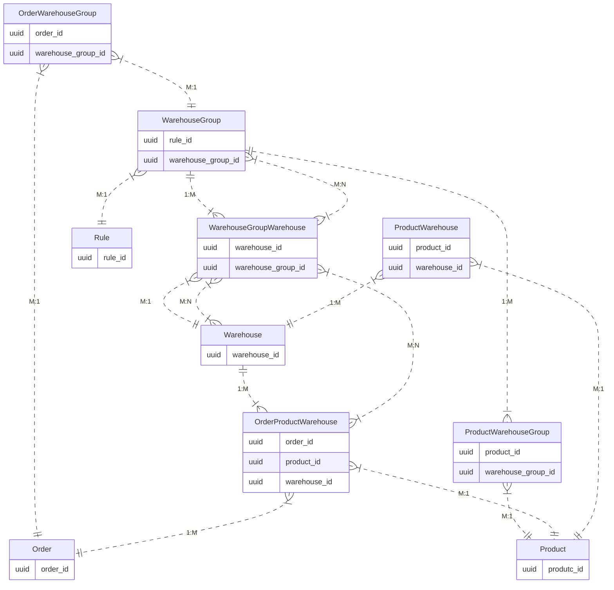

# ADMIN API

Compiled excerpts from the Shopware Developer Documentation snapshot. Prefer live docs at [developer.shopware.com](https://developer.shopware.com/) when in doubt.

---

## Admin API
**Source:** [concepts/api/admin-api.md](https://developer.shopware.com/docs/v6.6/concepts/api/admin-api.md)  
# Admin API

The Admin API provides CRUD operations for every entity within Shopware and is used to build integrations with external systems.

For more information, refer to the [Guides section](../../guides/integrations-api/index.md).

---

---

## API
**Source:** [guides/plugins/plugins/api.md](https://developer.shopware.com/docs/v6.6/guides/plugins/plugins/api.md)  
# API

Commercial plugins are pre-built extensions developed by third-party vendors that offer specific features and integrations. In some cases, commercial plugins may expose their own APIs, which developers can use to interact with the plugin's functionalities allowing customization and integration with other systems.

Overall, commercial plugins and APIs work together to expand the capabilities of the Shopware platform. Commercial plugins offer ready-to-use solutions, while APIs provide the flexibility for developers to build custom integrations and extend the functionality of Shopware even further.

---

---

## Customer-specific Pricing
**Source:** [guides/plugins/plugins/api/customer-specific-pricing.md](https://developer.shopware.com/docs/v6.6/guides/plugins/plugins/api/customer-specific-pricing.md)  
# Customer-specific Pricing

The Customer-specific pricing feature allows massive advances in the pricing model capabilities in the Shopware 6 ecosystem.

The API interface exposed by this module allows the user to operate a set of commands which will enable the granular overriding of prices via an external data repository or ERP system. This is achieved by defining a custom relationship between the current price and the Customer entity.

## Pre-requisites and setup

Customer-specific pricing is part of the Commercial plugin, requiring an existing Shopware 6 installation and the activated Shopware 6 Commercial plugin. This Commercial plugin can be installed as per the [install instructions](../../../../guides/plugins/plugins/plugin-base-guide#install-your-plugin). In addition, the `Custom Prices` feature needs to be activated within the relevant merchant account.

## Working with the API route

To create, alter and/or delete customer-specific prices, you can use the API endpoint `/api/_action/custom-price`. Like with any other admin request in Shopware, you must first authenticate yourself. Therefore, please head over to the
[authentication guide](https://shopware.stoplight.io/docs/admin-api/ZG9jOjEwODA3NjQx-authentication) for details.

Otherwise, the Customer-specific Pricing API interface models itself upon the interface of the [sync API](https://shopware.stoplight.io/docs/admin-api/twpxvnspkg3yu-quick-start-guide), so you will be able to package your requests similarly.

::: info
You can use the route with single `upsert` and `delete` actions or even combine those in a single request: you can pack several different commands inside one sync API request, and each of them is executed in an independent and isolated way
:::

So, it's not surprising that the request body looks like a familiar sync request. In the payload for the `upsert` action, you pass the following data:

* `productId`: The product whose price should be overwritten.
* `customerId`: The customer for whom we will assign a custom price.
* `price`: The new custom price you want to use.

This way, we come to use a payload as seen in the example below:

```json
[
  {
    "action": "upsert",
    "payload": [
      {
        "productId": "0001e32041ac451386bf9b7351c540f3",
        "customerId": "02a3c82b5ca842c492f8656029b2e63e",
        "price": [
          {
            "quantityStart": 1,
            "quantityEnd": null,
            "price": [
              {
                "currencyId": "b7d2554b0ce847cd82f3ac9bd1c0dfca",
                "gross": 682.0,
                "net": 682.0,
                "linked": true
              }
            ]
          }
        ]
      }
    ]
  }
]
```

For the `delete` action, the workflow operation accepts 3 different array of ids: `customerIds`, `productIds`, or `customerGroupIds`. Here, you can specify any combination of these id arrays, with the exception that the API route must have at least one UUID supplied in one of the id arrays (`customerIds`, `productIds`, or `customerGroupIds`)

```json
[
  {
    "action": "delete",
    "payload": [
      {
        "productIds": [
          "0001e32041ac451386bf9b7351c540f3",
          "363a6985f6434a7493b1ef3dabeed40f"
        ],
        "customerIds": [
          "53fc38877a510a47b0e0c44f1615f0c5"
        ],
        "customerGroupIds": []
      }
    ]
  }
]
```

::: info
In case of an error occurs, the response will not return an error code - which is typical for the sync API; instead, any validation errors will be stored within the `errors` key.
:::

::: warning
When working with this route, one difference sets it apart from the familiar `sync` requests: You cannot specify headers to adapt the endpoint's behavior.
:::

## Known caveats or issues

When working with custom prices, there are currently some caveats or issues to keep in mind:

* Price filtering (within the product listing page) will *currently* not support the overridden prices.
* ElasticSearch product mapping does not currently support Customer-specific Pricing data.
* Optional header flags within the core `sync` API are not supported within the provided endpoint (`indexing-behavior, single-operation`). Indexing of any relevant database (product) data is handled on a per-request basis without the need to specify indexing handling.
* The `customerGroupId` parameter within a Customer-specific Pricing API request body is a stub implementation to avoid breaking changes in future versions and is not currently functional. Any data provided for this parameter will not affect the Storefront.

---

---

## Multi-Inventory
**Source:** [guides/plugins/plugins/api/multi-inventory.md](https://developer.shopware.com/docs/v6.6/guides/plugins/plugins/api/multi-inventory.md)  
# Multi-Inventory

## Pre-requisites and setup

### Commercial Plugin

Multi-Inventory is part of the Commercial plugin available along with the Beyond plan. This feature requires:

* Shopware 6 instance
* [Shopware Beyond](https://docs.shopware.com/en/shopware-6-en/features/shopware-beyond) license
* Activated Commercial plugin. Refer to [plugin base guide](../../../../guides/plugins/plugins/plugin-base-guide#install-your-plugin) for installation instructions

### Admin UI

While this feature is supposed to be used by API first, i.e. by ERP systems, it still comes with an user interface for the Administration. Refer to [My extensions](https://docs.shopware.com/en/shopware-6-en/extensions/myextensions) section of shopware docs to explore more about it.

### Admin API

To create, modify or delete Warehouses, WarehouseGroups etc., related to Multi-Inventory, you can access Admin API endpoints described further.

Meanwhile, refer to the following links regarding the general use of the Admin API:

* [Authentication & Authorization](https://shopware.stoplight.io/docs/admin-api/ZG9jOjEwODA3NjQx-authentication)
* [Request, Response and Endpoint Structure](https://shopware.stoplight.io/docs/admin-api/request-and-response-structure)

## Data structure

The Multi-Inventory feature implements a specific data structure for its internal stock handling. The following entity-relationship model visually represents the new entities, as well as the relationships between them and platform entities.



## Working with the API

The following examples contain payloads for typical use-cases of this feature. Basically all new entities fully support the Admin API via sync service or their generic entity endpoints.

### Creating or updating a WarehouseGroup and assigning it to an existing Warehouse

```json

// POST /api/warehouse-group
// PATCH /api/warehouse-group/8cf7736855594501aaf86351e147c61e

{
    "id": "8cf7736855594501aaf86351e147c61e",
    "name": "Group A",
    "description": "Lorem ipsum dolor sit amet, consetetur sadipscing elitr, sed diam nonumy eirmod tempor invidunt ut labore.",
    "priority": 25,
    "ruleId": "93248b220a064424a1f6e90010820ba2",
    "warehouses":  [{
        "id": "4ce2bd36d2824153812fcb6a97f22d22"
    }]
}
```

### Creating or updating a Warehouse and assigning it to an existing WarehouseGroups

```json

// POST /api/warehouse
// PATCH /api/warehouse/4ce2bd36d2824153812fcb6a97f22d22

{
    "id": "4ce2bd36d2824153812fcb6a97f22d22",
    "name": "Warehouse A",
    "groups": [{
        "id": "8cf7736855594501aaf86351e147c61e"
    }, {
        "id": "4154501a3812fcb6a501aaf8c7736855"
    }]
}
```

### Assigning WarehouseGroups to Products, creating ProductWarehouses via association

```json

// POST /api/_action/sync

[{
    "action": "upsert",
    "entity": "product",
    "payload": [{
        "id": "86d38702be7e4ac9a941583933a1c6f5",
        "versionId": "0fa91ce3e96a4bc2be4bd9ce752c3425",
        "warehouseGroups": [{
            "id": "8cf7736855594501aaf86351e147c61e"
        }],
        "warehouses": [{
            "id": "f5c850109fe64c228377cbd369903b75",
            "productId": "86d38702be7e4ac9a941583933a1c6f5",
            "productVersionId": "0fa91ce3e96a4bc2be4bd9ce752c3425",
            "warehouseId":"4ce2bd36d2824153812fcb6a97f22d22",
            "stock": 0
        }]
    }]
}]
```

### Updating ProductWarehouse stocks

You can update `product_warehouse.stock` in batch via SyncApi, or patch a specific entity directly via entity repository.

```json

// POST /api/_action/sync

[{
    "action": "upsert",
    "entity": "product_warehouse",
    "payload": [{
        "id": "f5c850109fe64c228377cbd369903b75",
        "stock": 1500
    }, {
        "id": "228377cbd369903b75f5c850109fe64c",
        "stock": 0
    }]
}]

// PATCH /api/product-warehouse/f5c850109fe64c228377cbd369903b75

{
    "id": "f5c850109fe64c228377cbd369903b75",
    "stock": 1500
}
```

## Concept

::: info
Every described behavior only applies to Products that are assigned to WarehouseGroups and every unrelated Product will use the default Shopware behavior.
:::

### ERP System as Single-Source-of-Truth

Multi-Inventory is intended to be used as an interface between Shopware and your resource management software. This means that Shopware will only calculate the availability of Products based on your Warehouse configuration and changes stocks of a Warehouse when an order is created. This prevents oversales while also making your system the single source of truth - making it easier to maintain both systems at the same time.

### Product Availability

Availability of Products is defined in 2 steps:

* WarehouseGroups can be assigned to Rules (Rule builder)
  * If the rule is invalid, this Group will not be considered in calculating Product availability.
  * Products/Warehouses can still be available via other groups.
  * If multiple rules are valid, WarehouseGroups can be prioritized with their own priority, they are not tied to rule priority.
* Products can have a stock per Warehouse
  * All Warehouses inside an active WarehouseGroup are taken into account for calculating the total stock of a specific Product.
  * Warehouses are unique, but can be assigned to multiple Groups (e.g. all Warehouses in the Group "Germany" can also be in the Group "Europe").

If both conditions are true (e.g. "Customer is in a specific customer group" and "requested stock <= total Product stock of all valid Warehouses"), the requested Product is considered available. This calculation also considers other Product properties like `max_purchase`, `min_purchase`, and `purchase_steps`.

## Caveats

When working with the Multi-Inventory feature, there are some caveats to keep in mind

* We decided to *not* add the functionality of `product.available_stock` to Multi-Inventory. The stock of Products (or rather ProductWarehouses) will now be reduced immediately after an order was placed. It is no longer necessary to set any order state (for Products assigned to WarehouseGroups) to reduce the stock.
  * Order states are still important for any other workflow, e.g. FlowBuilder triggers, or event subscribers in general.
* Multi-Inventory will not recalculate the stock of Products assigned to WarehouseGroups when editing existing orders in any way. The whole stock handling in this regard is supposed to be done by an external ERP system, the information then need to be pushed to your Shopware instance (e.g. by immediate or daily syncs).
* If you decide to stop using Multi-Inventory for certain products (deleting existing data or deactivating the feature), Shopware will fall back into its default behavior. This is especially important when editing existing orders, since the stocks were taken from ProductWarehouse entities. Shopware will use incorrect data or values to increase/decrease Product stocks, if the order originally included ProductWarehouses.

---

---

## resources/api/admin-api-reference.md
**Source:** [resources/api/admin-api-reference.md](https://developer.shopware.com/resources/api/admin-api-reference.md)  
---

---

