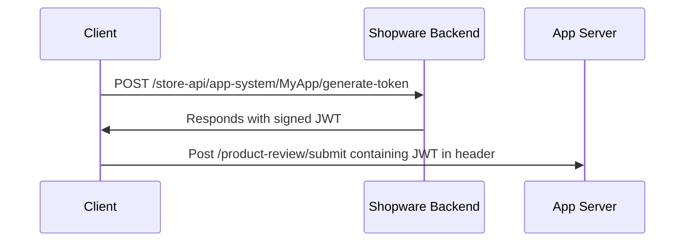

# APP SYSTEM

Compiled excerpts from the Shopware Developer Documentation snapshot. Prefer live docs at [developer.shopware.com](https://developer.shopware.com/) when in doubt.

---

## Apps
**Source:** [guides/plugins/apps.md](https://developer.shopware.com/docs/v6.6/guides/plugins/apps.md)  
# Apps

In Shopware, apps are custom-developed extensions that provide additional functionality and customization options to the e-commerce platform. These apps can be created using the Shopware app SDK, plugin system, or App scripts.
Apps are built to serve various purposes.

* **Extending functionality:** Apps can add new features and capabilities to the Shopware platform. This includes creating custom payment gateways, implementing advanced shipping methods, or enhancing product catalog management.

* **Modifying existing functionality:** Apps can modify or enhance existing functionalities within Shopware. This can involve altering the checkout process, implementing custom pricing rules, customizing the customer management system, or the search functionality.

* **Customizing the user interface:** Apps can customize the Storefront and Administration panel of Shopware to provide a unique and tailored experience. This includes creating custom themes, adding custom blocks or elements to the Storefront, or modifying the appearance and layout of the Administration panel.

* **Integrating with external systems:** Apps can facilitate integration with external systems to allow seamless data synchronization, order management, and cross-platform interactions.

Shopware apps provide a flexible and modular approach to extend and customize the platform according to specific business requirements.

While plugins and themes are also extensions but they differ from apps. To better understand the differences, take a look at the [Overview](../../../guides/plugins/overview) article.

---

---

## App Base Guide
**Source:** [guides/plugins/apps/app-base-guide.md](https://developer.shopware.com/docs/v6.6/guides/plugins/apps/app-base-guide.md)  
*(Body truncated in this bundle; follow the link for the rest.)*

# App Base Guide

## Overview

This guide will walk you through the process of adding your own app to Shopware and configuring it to be able to communicate with your external backend server.

## Prerequisites

If you are not familiar with the app system, take a look at the [App concept](../../../concepts/extensions/apps-concept) first.

## Name your app

Choose a technical name for your application that accurately reflects its plugin functionality.
Specify the name using UpperCamelCase. For instance: "PaymentGatewayApp".

However, throughout this section "MyExampleApp" is used as it serves as an illustrative example of the plugin.

## File structure

To get started with your app, create an `apps` folder inside the `custom` folder of your Shopware dev installation.
In there, create another folder for your application and provide a manifest file in it.

```text
└── custom
    ├── apps
    │   └── MyExampleApp
    │       └── manifest.xml
    └── plugins
```

## Manifest file

The manifest file is the central point of your app.
It defines the interface between your app and the Shopware instance.
It provides all the information concerning your app, as seen in the minimal version below:

::: code-group

```xml [manifest.xml]
<?xml version="1.0" encoding="UTF-8"?>
<manifest xmlns:xsi="http://www.w3.org/2001/XMLSchema-instance" xsi:noNamespaceSchemaLocation="https://raw.githubusercontent.com/shopware/shopware/trunk/src/Core/Framework/App/Manifest/Schema/manifest-2.0.xsd">
    <meta>
        <name>MyExampleApp</name>
        <label>Label</label>
        <label lang="de-DE">Name</label>
        <description>A description</description>
        <description lang="de-DE">Eine Beschreibung</description>
        <author>Your Company Ltd.</author>
        <copyright>(c) by Your Company Ltd.</copyright>
        <version>1.0.0</version>
        <icon>Resources/config/plugin.png</icon>
        <license>MIT</license>
    </meta>
</manifest>
```

:::

::: warning
The name of your app that you provide in the manifest file needs to match the folder name of your app.
:::

The app can now be installed and activated by running the following command:

```bash
bin/console app:install --activate MyExampleApp
```

After activating an app, you might need to clear the cache for the changes to take effect. First try:

```bash
bin/console cache:clear
```

If the changes are still not visible, try:

```bash
bin/console cache:clear:http
```

or

```bash
bin/console cache:clear:all
```

By default, your app files will be [validated](app-base-guide#validation) before installation.
To skip the validation, you may use the `--no-validate` flag.

::: info
Without the `--activate` flag the Apps get installed as inactive.
By executing the `app:activate` command after installation this can be activated, too.
:::

For a complete reference of the manifest file structure, take a look at the [Manifest reference](../../../resources/references/app-reference/manifest-reference).

## Setup (optional)

::: info
Only if your app backend server and Shopware need to communicate, it is necessary that registration is performed during the installation of your app.
This process is called setup.
:::

::: warning
Suppose your app makes use of the Admin Module, Payment Method, Tax providers or Webhook app system features.
In that case, you need to implement the registration, to exchange a secret key; that is later used to authenticate the shops.
:::

During the setup, it is verified that Shopware connects to the right backend server and keys are exchanged to secure all further communications.
During the setup process, your app backend will get credentials that can be used to authenticate against the Shopware API.
Additionally, your app will provide a secret that Shopware will use to sign all further requests it makes to your app backend, allowing you to verify that the incoming requests originate from authenticated Shopware installations.

The setup workflow is shown in the following schema.
Each step will be explained in detail.


::: info
The timeout for the requests against the app server is 5 seconds.
:::

### SDK Integration

Integrating apps into your application can be a daunting task, but with our PHP SDK, the process becomes much easier.
Our SDK simplifies the registration flow and other typical tasks.

* [Official PHP SDK](app-sdks/php/01-getting_started)
* [Official Symfony Bundle](app-sdks/symfony-bundle/index)

If there is no SDK available for your language, you can implement the registration process by yourself.

### Registration request

The registration request is made as a `GET` request against a URL you provide in your app's manifest file.

```xml
<?xml version="1.0" encoding="UTF-8"?>
<manifest xmlns:xsi="http://www.w3.org/2001/XMLSchema-instance"
          xsi:noNamespaceSchemaLocation="https://raw.githubusercontent.com/shopware/shopware/trunk/src/Core/Framework/App/Manifest/Schema/manifest-3.0.xsd">
    <meta>
        ...
    </meta>
    <setup>
        <!-- The URL which will be used for the registration -->
        <registrationUrl>https://my.example.com/registration</registrationUrl>
        <!-- Dev only, the secret that is used to sign the registration request -->
        <secret>mysecret</secret>
    </setup>
</manifest>

```

The following query parameters will be sent with the request:

* `shop-id`: The unique identifier of the shop the app was installed.
* `shop-url`: The URL of the shop, this can later be used to access the Shopware API.
* `timestamp`: The Unix timestamp when the request was created.

Additionally, the request has the following headers:

* `shopware-app-signature`: The signature of the query string
* `sw-version`: The Shopware version of the shop *(since 6.4.1.0)*

An example request looks like this:

```txt
GET https://my.example.com/registration?shop-id=KIPf0Fz6BUkN&shop-url=http%3A%2F%2Fmy.shop.com&timestamp=159239728
shopware-app-signature: a8830aface4ac4a21be94844426e62c77078ca9a10f694737b75ca156b950a2d
sw-version: 6.4.5.0
```

Additionally, the `shopware-app-signature` header will be provided, which contains a cryptographic signature of the query string.\
The secret used to generate this signature is the `app secret`, which is unique per app and will be provided by the Shopware Account if you upload your app to the store.
This secret won't leave the Shopware Account, so it won't even be leaked to the shops installing your app.

::: danger
You and the Shopware Account are the only parties that should know your `app-secret`.
Therefore, make sure you never accidentally publish your `app-secret`.
:::

::: warning
For **local development**, you can specify a `<secret>` in the manifest file that is used for signing the registration request.
However, if an app uses a hard-coded secret in the manifest, it can't be uploaded to the store.

If you are developing a **private app** not published in the Shopware Store, you **must** provide the `<secret>` in case of an external app server.
:::

To verify that the registration can only be triggered by authenticated Shopware shops, you need to recalculate the signature and check that the signatures match.
Thus, you have verified that the sender of the request possesses the `app secret`.

The following code snippet can be used to recalculate the signature:

```php
use Psr\Http\Message\RequestInterface;

/** @var RequestInterface $request */
$queryString = $request->getUri()->getQuery();
$signature = hash_hmac('sha256', $queryString, $appSecret);
```

```php
$verifier = new \Shopware\App\SDK\Authentication\RequestVerifier();
$verifier->authenticateRegistrationRequest($request, new AppConfiguration('AppName', 'AppSecret', 'confirm-url'));
```

The Symfony Bundle handles all verification automatically.

### Registration response

There may be valid cases where the app installation fails because the domain is blocked or some other prerequisite in that shop is not met, in which case you can return the message error as follows:

```json
{
  "error": "The shop URL is invalid"
}
```

When the registration is successful.
To verify that you are also in possession of the `app secret`, you need to provide proof that it is signed with the `app secret` too.
The proof consists of the sha256 hmac of the concatenated `shopId`, `shopUrl`, and your app's name.

The following code snippet can be used to calculate the proof:

```php
use Psr\Http\Message\RequestInterface;

/** @var RequestInterface $request */
$queryString = $request->getUri()->getQuery();
parse_str($queryString, $queryValues);
$proof = \hash_hmac(
    'sha256',
    $queryValues['shop-id'] . $queryValues['shop-url'] . $appname,
    $appSecret
);
```

```php
$signer = new ResponseSigner();
$signer->getRegistrationSignature(new AppConfiguration('AppName', 'AppSecret', 'confirm-url'), $shop);
```

For detailed instructions on signing requests and responses, refer to the app signing guide.

Besides the proof, your app needs to provide a randomly generated secret that should be used to sign every further request from this shop.
Make sure to save the `shopId`, `shopUrl`, and generated secret so that you can associate and use this information later.

::: info
This secret will be called \`shop-secret\` to distinguish it from the \`app-secret\`.
The \`app-secret\` is unique to your app and is used to sign the registration request of every shop that installs your app.
The \`shop-secret\` will be provided by your app during the registration and should be unique for every shop and have a minimum length of 64 characters and maximum length of 255 characters.
:::

The last thing needed in the registration response is a URL to which the confirmation request will be sent.

A sample registration response looks like this:

```json
{
  "proof": "94b42d39280141de84bd6fc8e538946ccdd182e4558f1e690eabb94f924e7bc7",
  "secret": "random secret string",
  "confirmation_url": "https://my.example.com/registration/confirm"
}
```

### Confirmation request

If the proof you provided in the [registration response](app-base-guide#registration-response) matches the one generated on the shop side, the registration is completed.
As a result, your app will receive a `POST` request against the URL specified as the `confirmation_url` of the registration with the following parameters send in the request body:

* `apiKey`: The API key used to authenticate against the Shopware Admin API.
* `secretKey`: The secret key used to authenticate against the Shopware Admin API.
* `timestamp`: The Unix timestamp when the request was created.
* `shopUrl`: The URL of the shop.
* `shopId`: The unique identifier of the shop.

The payload of that request may look like this:

```json
{
  "apiKey":"SWIARXBSDJRWEMJONFK2OHBNWA",
  "secretKey":"Q1QyaUg3ZHpnZURPeDV3ZkpncXdSRzJpNjdBeWM1WWhWYWd0NE0",
  "timestamp":"1592398983",
  "shopUrl":"http:\/\/my.shop.com",
  "shopId":"sqX6cqHi6hbj"
}
```

Make sure that you save the API credentials for that `shopId`.
You can use the `apiKey` and the `secretKey` as `client_id` and `client_secret`, respectively, when you request an OAuth token from the Admin API.

You can find out more about how to use these credentials in our Admin API authentication guide:

::: info
Starting from Shopware version 6.4.1.0, the current Shopware version will be sent as a `sw-version` header.
Starting from Shopware version 6.4.5.0, the current language id of the Shopware context will be sent as a  `sw-context-language` header, and the locale of the user or locale of the context language is available under the `sw-user-language` header.
:::

The request is signed with the `shop-secret` that your app provided in the [registration response](app-base-guide#registration-response) and the signature can be found in the `shopware-shop-signature` header.\
You need to recalculate that signature and check that it matches the provided one to make sure that the request is really sent fro

… **Truncated.** Full document: https://developer.shopware.com/docs/v6.6/guides/plugins/apps/app-base-guide.md


---

## App Scripts
**Source:** [guides/plugins/apps/app-scripts.md](https://developer.shopware.com/docs/v6.6/guides/plugins/apps/app-scripts.md)  
# App Scripts

App Scripts allow your app to include logic that is executed inside the Shopware execution stack. It allows you to build richer extensions that integrate more deeply with Shopware.

::: info
Note that app scripts were introduced in Shopware 6.4.8.0 and are not supported in previous versions.
:::

## Script hooks

The entry point for each script is the so-called "Hooks". You can register one or more scripts inside your app that should be executed whenever a specific hook is triggered.
Through the hook, your script gets access to the data of the current execution context and can react to or manipulate the data in some way.

See the [Hooks reference](../../../../resources/references/app-reference/script-reference/script-hooks-reference) for a complete list of all available.

## Scripts

At the core, app scripts are [twig files](https://twig.symfony.com/) executed in a sandboxed environment. Based on which hook the script is registered to, the script has access to the data of that hook and pre-defined services that can be used to execute your custom logic.

Apps scripts are placed in the `Resources/scripts` directory of your app. For each hook, you want to execute a script on, create a new subdirectory. The name of the subdirectory needs to match the name of the hook.

You can place one or more `.twig` files inside each of these subdirectories, which will be executed when the hook gets triggered.

The file structure of your apps should look like this:

```text
└── DemoApp
    ├── Resources
    │   └── scripts                         // all scripts are stored in this folder
    │       ├── product-page-loaded         // each script in this folder will be executed when the `product-page-loaded` hook is triggered
    │       │   └── my-first-script.twig
    │       ├── cart
    │       │   ├── first-cart-script.twig
    │       │   └── second-cart-script.twig // you can execute multiple scripts per hook
    │       └── ...
    └── manifest.xml
```

### Including scripts

Sometimes scripts can become more complex or you want to extract common functionality. Thus it is handy to split your scripts into smaller parts that can later be included in other scripts.

In order to do that you can compose your reusable scripts into [twig macros](https://twig.symfony.com/doc/3.x/tags/macro.html), put them inside a dedicated `include` folder and then import them using the [twig import functionality](https://twig.symfony.com/doc/3.x/tags/import.html).

```text
└── DemoApp
    ├── Resources
    │   └── scripts                         
    │       ├── include    
    │       │   └── media-repository.twig         // this script may be included into the other scripts
    │       ├── cart
    │       │   ├── first-cart-script.twig
    │       └── ...
    └── manifest.xml
```

Note that app scripts can use the `return` keyword to return values to the caller.

A basic example may look like this:

```twig
// Resources/scripts/include/media-repository.twig

    
    
     

```

```twig
// Resources/scripts/cart/first-cart-script.twig



```

### Interface Hooks

Some "Hooks" describe interfaces this means that your scripts for that hook need to implement one or more functions.
E.g., the `store-api-hook` defines a `cache_key` and a `response` function. Those functions are closely related but are executed separately.
To implement the different functions, you use different twig blocks with the name of the function:

```twig

    // provide a cacheKey for the incoming request



    // produce the response for the request

```

Some functions are optional, whereas others are required. In the above example the `cache_key` function is optional.
That means you can omit that block in your script without an error (but caching for the endpoint won't work in that case).
The `response` function is required, which means that if your script does not provide a `response` block, it will lead to an error.

Note that for each function, you get access to different input data or services, so in the `cache_key` block, you don't necessarily have access to the same data and services as in the `response` block.
The available data and services are described for each hook (or each function in InterfaceHooks) in the [reference documentation](../../../../resources/references/app-reference/script-reference/script-hooks-reference).

### Translation

Inside the app script, you have access to the [Storefront translation mechanism](../../plugins/storefront/add-translations) by using the `|trans`-filter.

```twig



```

### Extended syntax

In addition to the default twig syntax, app scripts can also use a more PHP-flavoured syntax.

#### Equals check with `===`

Instead of using the rather verbose ``, you can use the more dense `===` equality checks.

```twig

    ...

```

Additionally, you can also use the `!==` not equals operator as well.

```twig

    ...

```

#### Loops with `foreach`

Instead of the `for...in` syntax for loops, you can also use a `foreach` tag.

```twig

    {{ entry }}
    

```

#### Instance of checks with `is`

You can use a `is` check to check the type of a variable.

```twig

    ...

```

The following types are supported:

* `true`
* `false`
* `boolean` / `bool`
* `string`
* `scalar`
* `object`
* `integer` / `int`
* `float`
* `callable`
* `array`

#### Type casts with `intval`

You can cast variables into different types with the `intval` filter.

```twig

    {# always evaluates to true #}

```

The following type casts are supported:

* `intval`
* `strval`
* `boolval`
* `floatval`

#### conditions with `&&` and `||`

Instead of using `AND` or `OR` in if-conditions, you can use the `&&` or `||` shorthands.

```twig

    ...

```

#### `return` tag

You can use the `return` tag to return values from inside macros.

```twig
 
     

```

## Available services

Depending on the hook that triggered the execution of your script, you get access to different services you can use inside your scripts, e.g. to access data inside Shopware or to manipulate the cart.
Take a look at the [Hook reference](../../../../resources/references/app-reference/script-reference/script-hooks-reference) to get a complete list of all available services per hook.

Additionally, we added a `ServiceStubs`class that can be used as typehint in your script, so you get auto-completion features of your IDE.

```twig
{# @var services \Shopware\Core\Framework\Script\ServiceStubs #}


```

::: info
The stub class contains all services, but not all of them are available depending on the hook.
:::

## Example Script - loading media entities

Assuming your app adds a [custom field set](../custom-data/custom-fields) for the product entity with a custom media entity select field.

When you want to display the file of the media entity in the [Storefront](../storefront/), it is not easily possible because, in the template's data, you only get the id of the media entity, but not the URL of the media file itself.

For this case, you can add an app script on the `product-page-loaded`
hook, which loads the media entity by id and adds it to the page object so the data is available in templates.

```twig
// Resources/scripts/product-page-loaded/add-custom-media.twig
{# @var services \Shopware\Core\Framework\Script\ServiceStubs #}


{# @var page \Shopware\Storefront\Page\Product\ProductPage #}


    







```

For a more detailed example of how to load additional data, refer to the [data loading guide](./data-loading).

Alternatively, take a look at the [cart manipulation guide](./cart-manipulation) to get an in-depth explanation of how to manipulate the cart with scripts.

## Developing/debugging scripts

You can get information about what scripts were triggered on a specific Storefront page inside the [Symfony debug toolbar](https://symfony.com/doc/current/the-fast-track/en/5-debug.html#discovering-the-symfony-debugging-tools).

::: info
The debug toolbar is only visible if your Shopware installation is in `APP_ENV = dev`. Ensure to set the correct env, e.g., in your `.env` file, when developing app scripts.
:::

You can find all hooks that are triggered and the scripts that are executed for each by clicking on the `script` icon.


That will open the Symfony profiler in the script detail view, where you can see all triggered hooks and the count of the scripts executed for each script at the top.


Additionally, you can use the `debug.dump()` function inside your scripts to dump data to the debug view.
A script like this:

```twig

```

Will dump the page object to the debug view.


---

---

## Manipulate the Cart with App Scripts
**Source:** [guides/plugins/apps/app-scripts/cart-manipulation.md](https://developer.shopware.com/docs/v6.6/guides/plugins/apps/app-scripts/cart-manipulation.md)  
*(Body truncated in this bundle; follow the link for the rest.)*

# Manipulate the Cart with App Scripts

If your app needs to manipulate the cart, you can do so by using the [`cart`](../../../../resources/references/app-reference/script-reference/script-hooks-reference#cart) script hook.

::: info
Note that app scripts were introduced in Shopware 6.4.8.0 and are not supported in previous versions.
:::

## Overview

The cart manipulation in app scripts expands on the general [cart concept](../../../../concepts/commerce/checkout-concept/cart). In that concept, your cart scripts act as another [cart processor](../../../../concepts/commerce/checkout-concept/cart#cart-processors---price-calculation-and-validation).

Your `cart` scripts run whenever the cart is calculated, this means that the script will be executed when an item is added to the cart, when the selected shipping and payment methods change, etc.
You have access to a `cart`-service that provides a [fluent API](https://www.martinfowler.com/bliki/FluentInterface.html) to get data from the cart or to manipulate the cart. For an overview of all data and services that are available, please refer to the [cart hook reference](../../../../resources/references/app-reference/script-reference/script-hooks-reference#cart).

## Prerequisites

To get a better understanding of the cart, please make yourself familiar with the [cart concept](../../../../concepts/commerce/checkout-concept/cart) in general.
We will expand on that concept and refer to ideas defined there in this guide.

## Calculating the cart

If you add line items (products, discounts, etc.) in your `cart`-script it may be necessary to manually recalculate the cart.
After changing the price definitions in the cart, the total prices of the cart are not recalculated automatically. The recalculation will only happen automatically after your whole script is executed.

But if your script depends on updated and recalculated prices, you can recalculate the entire cart manually.

```twig
// Resources/scripts/cart/my-cart-script.twig



```

The `calculate()` call will recalculate the whole cart and update the total prices, etc. For this the complete [`process`-step](../../../../concepts/commerce/checkout-concept/cart#calculation) is executed again.

::: warning
Note that by executing the `process` step, all properties of the cart (e.g. `products()`, `items()`, `price()`) are recreated and thus will return new instances.
This means if your script still holds references to those properties inside variables from before the recalculation, those are outdated after the recalculation.
:::

### Multiple calculations

Your `cart`-script will probably run multiple times per cart whenever the cart is recalculated, e.g., whenever a new product is added to the cart.
This means that you have to check that your script works when it is executed multiple times.

The safest way to ensure is to check the cart to see if your script's action was already taken and only execute it if not.
For example, you could only add a discount to the cart if it doesn't already exist.

```twig
// Resources/scripts/cart/my-cart-script.twig

    

```

An alternative solution would be to mark that you already did perform an action by adding a custom state to the cart.
This way, you can only perform the action if your custom state is not present and additionally, you can remove the state again when you revert your action.

```twig
// Resources/scripts/cart/my-cart-script.twig




    
        {# perform action #}
    



    
        {# revert action #}
    


```

::: info
Note that the state name should be unique, this means you should always use your vendor prefix in the state name.
:::

## Price definitions

In general, Shopware prices consist of gross and net prices and are currency dependent. If you need price definitions in your app scripts (e.g., to add an absolute discount with a specific price), there are multiple ways to do so.

### Price fields inside custom fields

You can define price fields for [custom fields](../custom-data/custom-fields)

::: code-group

```xml [manifest.xml]
<custom-fields>
    <custom-field-set>
        <name>custom_field_test</name>
        <label>Custom field test</label>
        <label lang="de-DE">Zusatzfeld Test</label>
        <related-entities>
            <product/>
            <customer/>
        </related-entities>
        <fields>
            <price name="test_price_field">
                <label>Test price field</label>
            </price>
        </fields>
    </custom-field-set>
</custom-fields>
```

:::

### Price fields inside app config

You can define price fields for [app configuration](../configuration).

```xml
// Resources/config/config.xml
<card>
    <title>Basic configuration</title>
    <title lang="de-DE">Grundeinstellungen</title>
    <name>TestCard</name>
    <input-field type="price">
        <name>priceField</name>
        <label>Test price field</label>
        <defaultValue>null</defaultValue>
    </input-field>
</card>
```

### Manual price definition

The simplest way is to define the price manually and hard code it into your app scripts. We provide a factory method that you can use to create price definitions.
You can specify the `gross` and `net` prices for each currency.

```twig
// Resources/scripts/cart/my-cart-script.twig

```

### Prices inside the app config

As described above, it is also possible to use price fields inside the [app configuration](../configuration). In your cart scripts, you can access those config values over the [`config` service](../../../../resources/references/app-reference/script-reference/miscellaneous-script-services-reference#SystemConfigFacade) and pass them to the same price factory as the manual definitions.

```twig
// Resources/scripts/cart/my-cart-script.twig



```

Note that if you don't provide a default value for your configuration, you should add a null-check, to verify that the config value you want to use was actually configured by the merchant.

## Line items

Inside your cart scripts, you can modify the line items inside the current cart.

### Add product a line item

You can add a new product line item simply by providing the product `id` of the product that should be added.
Additionally, you may provide a quantity as a second parameter if the product should be added with a quantity higher than 1.

```twig
// Resources/scripts/cart/my-cart-script.twig



```

### Add an absolute discount

To add an absolute discount, you can use the `discount()` function, but you have to define a [price definition](#price-definitions) beforehand.
The first argument is the `id` of the line item. You can use that `id`, e.g., to check if the discount was already added to the cart.
The fourth parameter is the label of the discount. You can either use a hard-coded string label or use the `|trans` filter to use a Storefront snippet as the label.

Note that you should check if your discount was already added, as your script may run multiple times.

```twig
// Resources/scripts/cart/my-cart-script.twig



    

```

### Add a relative discount

Adding a relative discount is very similar to adding an absolute discount. Instead of providing a price definition, you can provide a percentage value that should be discounted, and the absolute value will be calculated automatically based on the current total price of the cart.

```twig
// Resources/scripts/cart/my-cart-script.twig
{% do services.cart.discount('my-custom-discount', 'percentage', 10, 'A custom 10% discount') %}
```

### Remove a line item

You can remove line items by providing the `id` of the line item that should be removed.

```twig
// Resources/scripts/cart/my-cart-script.twig
{# first add the product #}

{# then remove it again #}


{# first add the discount #}
{% do services.cart.discount('my-custom-discount', 'percentage', 10, 'A custom 10% discount') %}
{# then remove it again #}

```

## Split line items

It is also possible to split one line item with a quantity of 2 or more.
You can use the `take()` method on the line item that should be split and provide the quantity that should be split from the original line item.
Optionally you can provide the new `id` of the new line item as a second parameter.

Note that the `take()` method won't automatically add the new line item to the cart, but instead, it returns the split line item, so you have to add it to the corresponding line item collection manually in your script.

```twig
// Resources/scripts/cart/my-cart-script.twig



    
    

```

## Add custom data to line items

You can add custom (meta-) data to line items in the cart by manipulating the payload of the cart items.

```twig
// Resources/scripts/cart/my-cart-script.twig

{# Add a custom payload value #}

{# Access the value #}

```

## Add errors and notifications to the cart

Your app script can block the cart's checkout by raising an error.
As the first parameter you have to provide the [snippet key](../../plugins/storefront/add-translations) of the error message that should be displayed to the user.
As the second optional parameter, you can specify a `id` for the error, so you can reference the error later on in your script.
Lastly, you can provide an array of parameters as the optional third parameter if you need to pass parameters to the snippet.

```twig
// Resources/scripts/cart/my-cart-script.twig

    {# add a new error #}
    

    

```

If you only want to display some information to the user during the checkout process, you can also add messages using `warning` and `notice`. Those will be displayed during the checkout process but won't prevent the customer from completing the checkout.

The API is basically the same as for adding errors.

```twig
// Resources/scripts/cart/my-cart-script.twig

```

## Rule based cart scripts

The cart scripts automatically integrate with the [Rule Builder](../../../../concepts/framework/rules) and you can use the full power of the rule builder to only do your cart manipulations if a given rule matches.
For example, you can add an entity-single-select field to your [app's config](../configur

… **Truncated.** Full document: https://developer.shopware.com/docs/v6.6/guides/plugins/apps/app-scripts/cart-manipulation.md


---

## Custom Endpoints with App Scripts
**Source:** [guides/plugins/apps/app-scripts/custom-endpoints.md](https://developer.shopware.com/docs/v6.6/guides/plugins/apps/app-scripts/custom-endpoints.md)  
*(Body truncated in this bundle; follow the link for the rest.)*

# Custom Endpoints with App Scripts

If you want to execute some logic in Shopware and trigger the execution over an HTTP request or need some special data from Shopware over the API, you can create custom API endpoints in your app that allow you to execute a script when a request to that endpoint is made.

## Manipulate HTTP-headers to API responses

::: info
Note that the `response` hook was added in v6.6.10.4 and is not available in earlier versions.
:::

There is a specific `response` script hook, that allows you to manipulate the HTTP-headers of the response via app scripts.
This is especially useful to adjust the security headers to your needs.

To add a custom header to every response, you can do the following:

```twig
// Resources/scripts/response/response.twig

```

Additionally, you can check the current value of a given header and adjust it accordingly:

```twig
// Resources/scripts/response/response.twig

    

```

You also have access to the route name of the current request and to the route scopes to control the headers for specific routes:

```twig
// Resources/scripts/response/response.twig

    

```

The possible route scopes are `storefront`, `store-api`, `api` and `administration`.

## Custom Endpoints

There are specialized script-execution endpoints for the `api`, `store-api` and `storefront` scopes.
Refer to the [API docs](../../../integrations-api/) for more information on the distinction of those APIs.
Those endpoints allow you to trigger the execution of your scripts with an HTTP request against those endpoints.

Custom endpoint scripts need to be located in a folder that is prefixed with the name of the api scope (one of `api-`, `store-api-` or `storefront`).
The remaining part of the folder name is the hook name.
You can specify which script should be executed by using the correct hook name in the URL of the HTTP request.

This means to execute the scripts under `Resources/scripts/api-test-script` you need to call the `/api/script/test-script` endpoint.
Note that all further slashes (`/`) in the route will be replaced by dashes (`-`). To execute the `Resources/scripts/api-test-script` scripts you could also call the `/api/script/test/script` endpoint.

::: warning
To prevent name collisions with other apps, you should always include your vendor prefix or app name as part of the hook name.
The best practice is to add your app name after the API scope prefix and then use it as a REST style resource identifier, e.g., `/api/script/swagMyApp/test-script`.
:::

In your custom endpoint scripts, you get access to the JSON payload of the request (and the query parameters for GET-requests) and have access to the read & write functionality of the [Data Abstraction Layer](../../../../concepts/framework/data-abstraction-layer).
For a complete overview of the available data and service, refer to the [hook reference documentation](../../../../resources/references/app-reference/script-reference/script-hooks-reference#api-hook).

By default, a `204 No Content` response will be sent after your script was executed.
To provide a custom response, you can use the [`response`-service](../../../../resources/references/app-reference/script-reference/custom-endpoint-script-services-reference#scriptresponsefactoryfacade) to create a response and set it as the `response` of the hook:

```twig
// Resources/scripts/api-custom-endpoint/my-example-script.twig


```

You can execute multiple scripts for the same HTTP request by storing multiple scripts in the same order.
Those scripts will be executed in alphabetical order. Remember that later scripts may override the response set by prior scripts.
If you want to prevent the execution of further scripts, you can do so by calling `hook.stopPropagation`:

```twig
// Resources/scripts/api-custom-endpoint/my-example-script.twig

```

### Admin API endpoints

Scripts available over the Admin API should be stored in a folder prefixed with `api-`, so the folder name would be `api-{hook-name}`.
The execution of those scripts is possible over the `/api/script/{hook-name}` endpoint.

This endpoint only allows `POST` requests.

Caching of responses is not supported for Admin API responses.

For a complete overview of the available data and services, refer to the [reference documentation](../../../../resources/references/app-reference/script-reference/script-hooks-reference#api-hook).

### Store API endpoints

Scripts that should be available over the Store API should be stored in a folder prefixed with `store-api-`, so the folder name would be `store-api-{hook-name}`.
The execution of those scripts is possible over the `/store-api/script/{hook-name}` endpoint.

This endpoint allows `POST` and `GET` requests.

This hook is an [Interface Hook](./#interface-hooks). The execution of your logic should be implemented in the `response` block of your script.

```twig
// Resources/scripts/store-api-custom-endpoint/my-example-script.twig

    
    

```

Caching of responses to `GET` requests is supported, but you need to implement the `cache_key` function in your script to provide a cache key for each response.
The cache key you generate should take every permutation of the request, which would lead to a different response into account and should return a unique key for each permutation.
A simple cache key generation would be to generate an `md5`-hash of all the incoming request parameters, as well as your hook's name:

```twig
// Resources/scripts/store-api-custom-endpoint/my-example-script.twig

    
    

    

```

For a complete overview of the available data and services, refer to the [reference documentation](../../../../resources/references/app-reference/script-reference/script-hooks-reference#store-api-hook).

### Storefront endpoints

Scripts available for the Storefront should be stored in a folder prefixed with `storefront-`, so the folder name would be `storefront-{hook-name}`.
The execution of those scripts is possible over the `/storefront/script/{hook-name}` endpoint.
Custom Storefront endpoints can be called by a normal browser request or from javascript via ajax.

This endpoint allows `POST` and `GET` requests.

Caching is supported and enabled by default for `GET` requests.

In addition to providing `JsonResponses` you can also render your own templates:

```twig
// Resources/scripts/storefront-custom-endpoint/my-example-script.twig





```

Additionally, it is also possible to redirect to an existing route:

```twig
// Resources/scripts/storefront-custom-endpoint/my-example-script.twig




```

For a complete overview of the available data and services, refer to the [reference documentation](../../../../resources/references/app-reference/script-reference/script-hooks-reference#storefront-hook).

## Caching

To improve the end-user experience and provide a scalable system, the customer-facing APIs (i.e., `store-api` and `storefront`) offer caching mechanism to cache the response to specific requests and return the response from the cache on further requests instead of computing it again and again on each request.

By default, caching is enabled for custom endpoints, but for `store-api` endpoints you have to generate the cache key in the script.
For `storefront` requests, however, shopware takes care of it so that responses get automatically cached (if the [HTTP-Cache](../../../../concepts/framework/http_cache) is enabled).

### Cache Config

You can configure the caching behavior for each response on the `response`-object in your scripts.

#### Add custom tags to the cache item

To allow fine-grained [cache invalidation](#cache-invalidation) you can tag the response with custom tags and then invalidate certain tags in a `cache-invalidation` script.

```twig




```

#### Disable caching

You can opt out of the caching by calling `cache.disable()`. This means that the response won't be cached.

```twig




```

#### Set the max-age of the cache item

You can specify for how long a response should be cached by calling the `cache.maxAge()` method and passing the number of seconds after which the cache item should expire.

```twig




```

#### Invalidate cache items for specific states

You can specify that the cached response is not valid if one of the given states is present.
For more detailed information on the invalidation states, refer to the [HTTP-cache docs](../../../../concepts/framework/http_cache#sw-states).

```twig




```

### Cache invalidation

To prevent serving stale cache items, the cache needs to be invalidated if the underlying data changes. Therefore, you can add `cache-invalidation` scripts, where you can inspect each write operation in the system and invalidate specific cache items by tag.

In your `cache-invalidation` scripts, you can get the `ids` that were written for a specific entity, e.g., `product_manufacturer`.

```twig
// Resources/scripts/cache-invalidation/my-invalidation-script.twig



    

```

To allow even more fine-grained invalidation, you can filter down the list of written entities by filtering for specific actions that were performed on that entity (e.g., `insert`, `update`, `delete`) and filter by which properties were changed.

```twig
// Resources/scripts/cache-invalidation/my-invalidation-script.twig


 // filter by action = insert
 // filter all entities were 'description` OR `parentId` was changed

    

```

Note that you can also chain the filter operations:

```twig
// Resources/scripts/cache-invalidation/my-invalidation-script.twig




    

```

You can then use the filtered down list of ids to invalidate entity specific tags:

```twig


    



```

For a complete overview of what data an

… **Truncated.** Full document: https://developer.shopware.com/docs/v6.6/guides/plugins/apps/app-scripts/custom-endpoints.md


---

## Load additional data for the Storefront with App Scripts
**Source:** [guides/plugins/apps/app-scripts/data-loading.md](https://developer.shopware.com/docs/v6.6/guides/plugins/apps/app-scripts/data-loading.md)  
# Load additional data for the Storefront with App Scripts

If your app needs additional data in your [customized Storefront templates](../../../plugins/plugins/storefront/customize-templates), you can load that data with app scripts and make it available to your template.

::: info
Note that app scripts were introduced in Shopware 6.4.8.0 and are not supported in previous versions.
:::

## Overview

The app script data loading expands on the general [composite data loading concept](../../../../concepts/framework/architecture/storefront-concept#composite-data-handling) of the storefront.
For each page that is rendered, a hook is triggered, giving access to the current `page` object. The `page` object gives access to all the available data, lets you add data to it, and will be passed directly to the templates.

For a list of all available script hooks that can be used to load additional data, take a look at the [script hook reference](../../../../resources/references/app-reference/script-reference/script-hooks-reference#data-loading).

::: info
Note that all hooks that were triggered during a page rendering are also shown in the [Symfony toolbar](./#developing--debugging-scripts).
This may come in handy if you are searching for the right hook for your script.
:::

For example, if you want to enrich a storefront detail page with additional data, you just set it within a custom app script and attach it to the `page` object.

```twig
// Resources/scripts/product-page-loaded/my-example-script.twig

{# @var page \Shopware\Storefront\Page\Product\ProductPage #}

{# the page object if you access to all the data, e.g., the current product #}




{# it also lets you add data to it, that you can later use in your Storefront templates #}

```

In your Storefront templates, you can read the data again from the `page` object:

```twig
// Resources/views/storefront/page/product-detail/index.html.twig



    <h1>{{ page.getExtension('swagMyAdditionalData').example }}</h1>
    
    {{ parent() }}

```

## Loading data

To load data stored inside Shopware, you can use the `read` features of the [Data Abstraction Layer](../../../../concepts/framework/data-abstraction-layer).
Therefore, in every hook that may be used to load additional data, the `repository` service is available.

The `repository` service provides methods to load exactly the data you need:

* `search()` to load complete entities
* `ids()` to load only the ids of entities, if you don't need all the additional information of the entities
* `aggregate()` to aggregate data if you don't need any data of individual entities but are only interested in aggregated data

All those methods can be used in the same way. First, you pass the entity name the search should be performed on. Next, you pass the criteria that should be used.

```twig

```

### Search criteria

The search criteria define how the search is performed and what data is included.
The criteria object that is used inside the app scripts behaves and looks the same as the [JSON criteria used for the API](../../../integrations-api/general-concepts/search-criteria).

So please refer to that documentation to get an overview of what features can be used inside a criteria object.

The criteria object can be assembled inside scripts as follows:

```twig



```

### `repository` and `store` services

Besides the `repository` service, a separate `store` service is also available that provides the same basic functionality and the same interface.

The `store` service is available for all "public" entities (e.g. `product` and `category`) and will return a Storefront optimized representation of the entities.
This means that, for example, SEO related data is resolved for `products` and `categories`, loaded over the `store` service, but not over the `repository` service.
Additionally, product prices are only calculated using the `store` service.

::: info
The `store` service only loads "public" entities. This means that the entities only include ones that are active and visible for the current sales channel.
:::

One major difference is that when using the `repository` service, your app needs `read` permissions for every entity it reads, whereas you don't need additional permissions for using the `store` service (as that service only searches for "public" data).

Refer to the [App Base Guide](../app-base-guide#permissions) for more information on how permissions work for apps.

The `repository` service exposes the same data as the CRUD-operations of the [Admin API](../../../integrations-api/#backend-facing-integrations---admin-api), whereas the `store` service gives access to the same data as the [Store API](../../../integrations-api/#customer-facing-interactions---store-api).

For a full description of the `repository` and `store` service, take a look at the [services reference](../../../../resources/references/app-reference/script-reference/data-loading-script-services-reference).

## Adding data to the page object

There are two ways to add data to the page object, either with the `addExtension()` or the `addArrayExtension()` methods.
Both methods expect the name under which the extension should be added as the first parameter. Under that name, you can later access the extension in your Storefront template with the `page.getExtension('extensionName')` call.

::: warning
Note that the extension names need to be unique. Therefore always use your vendor prefix as a prefix for the extension name.
:::

The second argument for both methods is the data you want to add as an extension. The `addExtension` method needs to be a `Struct`, meaning you can only add PHP objects (e.g., the collection or entities returned by the `repository` service) directly as extensions.
If you want to add scalar values or add more than one struct in your extension, you can wrap your data in a JSON-like twig object and use the `addArrayExtension` method.

In your **scripts** that would look something like this:

```twig


{# via addExtension #}



{# via addArrayExtension #}


```

You can access the extensions again in your **Storefront templates** like this:

```twig
{# via addExtension #}

    ...




{# via addArrayExtension #}

    ...




<h1>{{ page.getExtension('swagArrayExtension').scalar }}</h1>
```

::: info
Note that you can add extensions not only to the page object but to every struct. Therefore you can also add an extension, e.g., to every product inside the page.
:::

---

---

## App SDKs
**Source:** [guides/plugins/apps/app-sdks.md](https://developer.shopware.com/docs/v6.6/guides/plugins/apps/app-sdks.md)  
# App SDKs

The Shopware app SDK enables you to build applications and plugins that extend the functionality of the Shopware e-commerce platform. It provides the necessary resources and tools to simplify the development process and integrate custom logic into the Shopware environment.

---

---

## JavaScript
**Source:** [guides/plugins/apps/app-sdks/javascript.md](https://developer.shopware.com/docs/v6.6/guides/plugins/apps/app-sdks/javascript.md)  
# JavaScript

The App SDK for JavaScript abstracts and simplifies creating Shopware apps. The SDK uses JavaScript standardized Request/Response objects and therefore is supported to run in Node/Deno/Bun/Cloudflare Workers.

The app SDK provides a context object that grants access to relevant information and services within the Shopware environment. This context is essential for interacting with Shopware's APIs, accessing database entities, and executing various operations.

To ensure secure communication between the application and Shopware, this SDK supports signing mechanisms, allowing developers to validate the authenticity and integrity of requests and responses.

It also includes an HTTP client that simplifies making API requests to Shopware endpoints. It provides methods for handling authentication, executing HTTP requests, and processing responses.

---

---

## Getting Started
**Source:** [guides/plugins/apps/app-sdks/javascript/01-getting_started.md](https://developer.shopware.com/docs/v6.6/guides/plugins/apps/app-sdks/javascript/01-getting_started.md)  
# Getting Started

The app server written in TypeScript and is an open-source project accessible at [app-sdk-js](https://github.com/shopware/app-sdk-js).

## Installation

Install the App PHP SDK via NPM:

```bash
npm install --save @shopware-ag/app-sdk-server
```

After the installation, you can use the SDK in your project. Here is an example:

## Registration process

```javascript
import { AppServer, InMemoryShopRepository } from '@shopware-ag/app-server-sdk'

const app = new AppServer({
  appName: 'MyApp',
  appSecret: 'my-secret',
  authorizeCallbackUrl: 'http://localhost:3000/authorize/callback',
}, new InMemoryShopRepository());

export default {
  async fetch(request) {
    const { pathname } = new URL(request.url);
    if (pathname === '/authorize') {
      return app.registration.authorize(request);
    } else if (pathname === '/authorize/callback') {
      return app.registration.authorizeCallback(request);
    }

    return new Response('Not found', { status: 404 });
  }
};
```

First we create an AppServer instance with the app name, app secret and the authorize callback URL. The `InMemoryShopRepository` is used to store the shops in memory. You can also use a custom repository to store the shops in a database.

With this code, you can register your app with our custom app backend.

```bash
bun run index.js
```

```bash
deno serve index.js
```

Node.JS does not support the `Request` and `Response` objects. You can use [@hono/node-server](https://github.com/honojs/node-server) to run the server.

The recommendation here is to use a Framework like [Hono](https://hono.dev/).

Next, we will look into the [lifecycle handling](./02-lifecycle).

---

---

## Lifecycle
**Source:** [guides/plugins/apps/app-sdks/javascript/02-lifecycle.md](https://developer.shopware.com/docs/v6.6/guides/plugins/apps/app-sdks/javascript/02-lifecycle.md)  
# Lifecycle

The Shopware App System manages the lifecycle of an app.
Shopware will send any change if registered a webhook to our backend server.

To track the state in our Database correctly, we need to implement some lifecycle methods.

## Lifecycle Methods

* `activate`
* `deactivate`
* `uninstall`

The lifecycle registration in the `manifest.xml` would look like this:

```xml
<webhooks>
    <webhook name="appActivate" url="https://app-server.com/app/activate" event="app.activated"/>
    <webhook name="appDeactivated" url="https://app-server.com/app/deactivate" event="app.deactivated"/>
    <webhook name="appDelete" url="https://app-server.com/app/delete" event="app.deleted"/>
</webhooks>
```

## Usage

The implementation is similar to [Registration](./01-getting_started),

```javascript
import { AppServer, InMemoryShopRepository } from '@shopware-ag/app-server-sdk'

const app = new AppServer({
  appName: 'MyApp',
  appSecret: 'my-secret',
  authorizeCallbackUrl: 'http://localhost:3000/authorize/callback',
}, new InMemoryShopRepository());

export default {
  async fetch(request) {
    const { pathname } = new URL(request.url);
    if (pathname === '/authorize') {
      return app.registration.authorize(request);
    } if (pathname === '/authorize/callback') {
      return app.registration.authorizeCallback(request);
    } if (pathname === '/app/activate') {
      return app.registration.activate(request);
    } if (pathname === '/app/deactivate') {
      return app.registration.deactivate(request);
    } if (pathname === '/app/delete') {
      return app.registration.delete(request);
    }

    return new Response('Not found', { status: 404 });
  }
};
```

So, in this case, our backend gets notified of any app change, and we can track the state in our database.

Next, we will look into the [Context resolving](./03-context).

---

---

## Context
**Source:** [guides/plugins/apps/app-sdks/javascript/03-context.md](https://developer.shopware.com/docs/v6.6/guides/plugins/apps/app-sdks/javascript/03-context.md)  
# Context

The ContextResolver helps you to validate the Request, resolve the Shop and provide types for the Context.

## Usage

```javascript
import { AppServer } from '@shopware-ag/app-server-sdk'

const app = new AppServer(/** ... */);

// Resolve the context from the request like iframe
app.contextResolver.fromBrowser(/** Request */);

// Resolve the context from the request like webhook, action button
app.contextResolver.fromAPI(/** Request */);
```

Both methods accepts a Type to specify the context type.

```ts
import { BrowserAppModuleRequest } from '@shopware-ag/app-server-sdk/types'

const ctx = await app.contextResolver.fromBrowser<BrowserAppModuleRequest>(/** Request */);

// This is now typed
console.log(ctx.payload['sw-version']);
```

You can checkout the [types.ts](https://github.com/shopware/app-sdk-js/blob/main/src/types.ts) to see all available types.

If you miss a type, feel free to open a PR or an issue. Otherwise you can also specify the type also in your project.

```ts
type MyCustomWebHook = {
  foo: string;
}

const ctx = await app.contextResolver.fromBrowser<MyCustomWebHook>(/** Request */);

ctx.payload.foo; // This is now typed and the IDE will help you
```

Next, we will look into the [Signing of responses](./04-signing).

---

---

## Signing of responses
**Source:** [guides/plugins/apps/app-sdks/javascript/04-signing.md](https://developer.shopware.com/docs/v6.6/guides/plugins/apps/app-sdks/javascript/04-signing.md)  
# Signing of responses

The Shopware App System requires you to sign your responses to the Shopware server.

The signing is required for all responses that are sent to the Shopware server. The signature is used to verify the authenticity of the response and to ensure that the response was not tampered with.

To sign the response, you can call the signer with `signResponse` method. The signer will sign the response with the provided shop.

```php
import { AppServer } from '@shopware-ag/app-server-sdk'

const app = new AppServer(/** ... */);

// Or you get it from the context resolver
const shop = await app.repository.getShopById('shop-id');

const response = new Response('Hello World', {
    headers: {
        'Content-Type': 'text/plain',
    },
});

const signedResponse = await app.signer.signResponse(response, shop);
```

Next, we will look into the [Making HTTP requests to the Shop](./05-http-client).

---

---

## Making HTTP requests to the Shop
**Source:** [guides/plugins/apps/app-sdks/javascript/05-http-client.md](https://developer.shopware.com/docs/v6.6/guides/plugins/apps/app-sdks/javascript/05-http-client.md)  
# Making HTTP requests to the Shop

The SDK offers a simple HTTP client for sending requests to the Shopware server. You can access the HTTP client when you resolved a context using ContextResolver or create it manually.
The client will automatically fetch the OAuth2 token for the shop and add it to the request.

## Using ContextResolver

```ts
import { AppServer } from '@shopware-ag/app-server-sdk'

const app = new AppServer(/** ... */);

const ctx = await app.contextResolver.fromBrowser<BrowserAppModuleRequest>(/** Request */);

const response = await ctx.httpClient.get<{version: string}>('/_info/version')

console.log(response.body.version)
```

## Creating the client manually

```ts
import { HttpClient } from "@shopware-ag/app-server-sdk"

// Get the shop by repository directly
const shop = ...;

const httpClient = new HttpClient(shop);

const response = await httpClient.get<{version: string}>('/_info/version')

console.log(response.body.version)
```

## Abstraction to EntityRepository

The SDK offers an abstraction to the EntityRepository. This offers a much simpler way to interact with the Shopware API and fetch entities by the generic Shopware API.

```ts
import { HttpClient } from "@shopware-ag/app-server-sdk"
import { EntityRepository } from "@shopware-ag/app-server-sdk/helper/admin-api";
import { Criteria } from "@shopware-ag/app-server-sdk/helper/criteria";

// Get the shop by repository directly
const shop = ...;

const httpClient = new HttpClient(shop);

type Product = {
  id: string;
  name: string;
};

const repository = new EntityRepository<Product>(httpClient, "product");

// Fetch all products
const products = await repository.search(new Criteria());

// Get the first product and print the name
console.log(products.first().name);
// Same as above
console.log(products.data[0].name);

// Fetch a single product

const product = await repository.search(new Criteria(['my-uuid'])).first();

// Product can be null
console.log(product.name);

// Upserts update the given product if found, otherwise creates it
await repository.upsert(['id': 'my-uuid', 'name': 'My Product']);

// This would try to create a product, but fail as not all required fields are provided
await repository.upsert(['name': 'My Product']);

// Delete a product
await repository.delete([{id: 'my-uuid'}]);
```

## Abstraction of Sync API

The Sync API offers to create/update/delete entities in the Shopware API in a batch. This is useful for syncing data from your app to the Shopware API.

The EntityRepository `upsert` and `delete` uses the Sync API under the hood as the traditional API does not support batch operations. You can use also the Sync API directly.

```ts
import { SyncOperation, SyncService } from "@shopware-ag/app-server-sdk/helper/admin-api";

// The same http client as usual
const httpClient = ...;

const syncService = new SyncService(httpClient);

await syncService.sync([
  // the key will be shown in the error response if that failed
  new SyncOperation('my-custom-key', 'product', 'upsert', [{id: 'my-uuid', name: 'My Product'}]),

  // delete a product
  new SyncOperation('my-custom-key', 'product', 'delete', [{id: 'my-uuid'}]),
]);
```

The second argument also allows a ApiContext to be passed to configure the API behaviour like disable indexing, or do it using queue asynchronous, disable triggering of flows, etc.

## Abstraction of Media APIs

The SDK offers helpers to manage the Shopware Media Manager. This allows you to easily upload an media, lookup folders or create new folder.

```ts
import { createMediaFolder, uploadMediaFile, getMediaFolderByName } from '@shopware-ag/app-server-sdk/helper/media';

// The same http client as usual
const httpClient = ...;

// Create a new folder
const folderId = await createMediaFolder(httpClient, 'My Folder', {});

// Create a new folder with parent folder id
const folderId = await createMediaFolder(httpClient, 'My Folder', {parentId: "parent-id"});

// Lookup a folder by name
const folderId = await getMediaFolderByName(httpClient, 'My Folder');

// Lookup a folder by default folder for an entity
// Returns back the folderId to be used when using a media for a product
const folderId = await getMediaDefaultFolderByEntity(httpClient, 'product');

// Upload a file to the media manager
await uploadMediaFile(httpClient, {
    file: new Blob(['my text'], { type: 'text/plain' }),
    fileName: `foo.text`,
    // Optional, a folder id to upload the file to
    mediaFolderId: folderId
});
```

Next, we will look into the [Integrations](./06-integration).

---

---

## Hono
**Source:** [guides/plugins/apps/app-sdks/javascript/06-integration.md](https://developer.shopware.com/docs/v6.6/guides/plugins/apps/app-sdks/javascript/06-integration.md)  
The SDK offers many optional integrations into several JavaScript ecosystems, so you can easily integrate your app into your existing project.

## Hono

The SDK offers a simple integration into the Hono ecosystem. It will register automatically all necessary routes and provide a simple way to interact with the Hono API.

```ts
import { InMemoryShopRepository } from '@shopware-ag/app-server-sdk'
import type {
  AppServer,
  ShopInterface,
  Context,
} from "@shopware-ag/app-server-sdk";
import { Hono } from "hono";
import { configureAppServer } from "@shopware-ag/app-server-sdk/integration/hono";

const app = new Hono();

// You can configure all registered routes here
configureAppServer(app, {
  appName: "Test",
  appSecret: "Test",
  shopRepository: new InMemoryShopRepository(),
});

declare module "hono" {
  interface ContextVariableMap {
    app: AppServer;
    shop: ShopInterface;
    context: Context;
  }
}

export default app;
```

The `configureAppServer` will automatically register following routes:

* `/app/register` - Registration URL
* `/app/register/confirm` - Registration Confirmation
* `/app/activate` - Notify using app.activated webhook
* `/app/deactivate` - Notify using app.deactivated webhook
* `/app/delete` - Notify using app.delete webhook

This could look like this in the `manifest.xml`:

```xml
<setup>
    <registrationUrl>http://localhost:3000/app/register</registrationUrl>
</setup>
<webhooks>
    <webhook name="appActivated" url="http://localhost:3000/app/activate" event="app.activated"/>
    <webhook name="appDeactivated" url="http://localhost:3000/app/deactivate" event="app.deactivated"/>
    <webhook name="appDeleted" url="http://localhost:3000/app/delete" event="app.deleted"/>
</webhooks>
```

Additionally a middleware is configured to automatically validate the incoming requests and resolve the called Shop. This is my default configured to `/app/*` routes.

```ts
import { createNotificationResponse } from "@shopware-ag/app-server-sdk/helper/app-actions";

app.post("/app/action-button", async (c) => {
  const ctx = c.get("context") as Context<SimpleShop, ActionButtonRequest>;

  // Do something with the context, this is typed by second generic argument of Context
  console.log(ctx.payload.data.ids);

  return createNotificationResponse("success", "Yeah, it worked!");
});
```

So in this case the Request will be validated by the shop secret and the shop will be resolved by the shopId in the request. Additionally the response will be signed by the app secret. This is all done by the Integration, so you don't have to worry about it.

## Various Repositories (DynamoDB, Deno KV, Cloudflare KV, Bun SQLite, Better SQLite3)

The SDK offers a ready-to-use Repository for several storage solutions to store the shops.

```bash
npm install --save @aws-sdk/client-dynamodb @aws-sdk/lib-dynamodb
```

```ts
import { DynamoDBRepository } from '@shopware-ag/app-server-sdk/integration/dynamodb';

import { DynamoDBClient } from '@aws-sdk/client-dynamodb';

const client = new DynamoDBClient();

// Usage with Hono
configureAppServer(app, {
  appName: "Test",
  appSecret: "Test",
  shopRepository: new DynamoDBRepository(client, 'my-table-name'),
});

// Without Hono
const appServer = new AppServer(..., new DynamoDBRepository(client, 'my-table-name'));
```

```ts
import { DenoKVRepository } from '@shopware-ag/app-server-sdk/integration/deno-kv';

// Usage with Hono
configureAppServer(app, {
  appName: "Test",
  appSecret: "Test",
  shopRepository: new DenoKVRepository('my-namespace'),
});

// Without Hono
const appServer = new AppServer(..., new DenoKVRepository('my-namespace'));
```

```ts
import { CloudflareShopRepository } from '@shopware-ag/app-server-sdk/integration/cloudflare-kv';

// Usage with Hono
configureAppServer(app, {
  appName: "Test",
  appSecret: "Test",
  shopRepository: new CloudflareShopRepository(env.KV_BINDING),
});

// Without Hono
const appServer = new AppServer(..., new CloudflareShopRepository(env.KV_BINDING));
```

```ts
import { BunSqliteRepository } from '@shopware-ag/app-server-sdk/integration/bun-sqlite';

// Usage with Hono
configureAppServer(app, {
  appName: "Test",
  appSecret: "Test",
  shopRepository: new BunSqliteRepository('my-sqlite.db'),
});

// Without Hono
const appServer = new AppServer(..., new BunSqliteRepository('my-sqlite.db'));
```

The package `better-sqlite3` needs to be installed separately:

```bash
npm install --save better-sqlite3
```

```ts
import { BetterSqlite3Repository } from '@shopware-ag/app-server-sdk/integration/better-sqlite3';

// Usage with Hono
configureAppServer(app, {
  appName: "Test",
  appSecret: "Test",
  shopRepository: new BetterSqlite3Repository('my-sqlite.db'),
});

// Without Hono
const appServer = new AppServer(..., new BetterSqlite3Repository('my-sqlite.db'));
```

Next, we will look into the [External Frontend](./07-external-frontend.md).

---

---

## guides/plugins/apps/app-sdks/javascript/07-external-frontend.md
**Source:** [guides/plugins/apps/app-sdks/javascript/07-external-frontend.md](https://developer.shopware.com/docs/v6.6/guides/plugins/apps/app-sdks/javascript/07-external-frontend.md)  
Some times apps consists of a frontend to render the admin interface using the admin-extension-sdk. Mostly it is easier to create an second application and use that as the frontend. This way you can use the full power of the frontend frameworks like Next.js, Nuxt.js, Angular, React, Vue.js, etc.

To verify that the request is from a registered shop and gather further information from the app-server backend, you can use Hono integration to authenticate the request.

So the idea is that the Browser makes a request against our app server and this verifies the request, sets a cookie and forwards the request to the frontend. The frontend can do then regular ajax requests against the app server and the app server uses the cookie to verify the request.

```ts
import { Hono } from "hono/tiny";
import { configureAppServer } from "@shopware-ag/app-server-sdk/integration/hono";

const app = new Hono();

configureAppServer(app, {
  /** ... */
  appIframeEnable: true,
  appIframeRedirects: {
    '/app/browser': '/client'
  }
});

app.get('/client-api/test', (c) => {
  console.log(c.get('shop').getShopId());

  return c.json({ shopId: c.get('shop').getShopId() });
});
```

Now we can configure in the manifest.xml the URL to `/app/browser` and the app server will verify and afterwards redirect to `/client`.

And in the frontend application we can just do a regular `fetch("/client-api/test")` and the app server will verify the request and return the shopId.

The path `/client-api/*` is automatically protected for you by a Hono middleware. The path `/client-app/*` can be changed in the `configureAppServer` function with `appIframePath`.

---

---

## PHP
**Source:** [guides/plugins/apps/app-sdks/php.md](https://developer.shopware.com/docs/v6.6/guides/plugins/apps/app-sdks/php.md)  
# PHP

The App SDK in PHP is a comprehensive software development kit provided by Shopware for creating custom applications and plugins. It offers a straightforward installation process, and once installed, developers can utilize its lifecycle management features to handle the activation, deactivation, and uninstallation of their applications.

The app SDK provides a context object that grants access to relevant information and services within the Shopware environment. This context is essential for interacting with Shopware's APIs, accessing database entities, and executing various operations.

To ensure secure communication between the application and Shopware, this SDK supports signing mechanisms, allowing developers to validate the authenticity and integrity of requests and responses.

It also includes an HTTP client that simplifies making API requests to Shopware endpoints. It provides methods for handling authentication, executing HTTP requests, and processing responses.

Furthermore, it supports event handling, allowing developers to subscribe to and react to specific events triggered within the Shopware system. This enables the customization and extension of Shopware's functionality by executing custom logic when specific events occur.

Overall, the App SDK in PHP offers installation, lifecycle management, context handling, signing mechanisms, an HTTP client, and event handling capabilities. It provides a robust foundation for developing custom applications and plugins for the Shopware e-commerce platform using PHP.

---

---

## Getting Started
**Source:** [guides/plugins/apps/app-sdks/php/01-getting_started.md](https://developer.shopware.com/docs/v6.6/guides/plugins/apps/app-sdks/php/01-getting_started.md)  
# Getting Started

The app server written in PHP is an open-source project accessible at [app-php-sdk](https://github.com/shopware/app-php-sdk).

## Installation

Install the Shopware APP SDK via composer:

```bash
composer require shopware/app-php-sdk
```

After the package installation, Composer will automatically install the http client if missing.

## Registration process

```php
$app = new AppConfiguration('Foo', 'test', 'http://localhost:6001/register/callback');
// for a repository to save stores implementing \Shopware\App\SDK\Shop\ShopRepositoryInterface, see FileShopRepository as an example
$repository = ...;

// Create a psr 7 request or convert it (HttpFoundation Symfony)
$psrRequest = ...;

// you can also use the AppLifecycle see Lifecycle section
$registrationService = new \Shopware\App\SDK\Registration\RegistrationService($app, $repository);

$response = match($_SERVER['REQUEST_URI']) {
    '/app/register' => $registrationService->register($psrRequest),
    '/app/register/confirm' => $registrationService->registerConfirm($psrRequest),
    default => throw new \RuntimeException('Unknown route')
};

// return the response
```

With this code, you can register your app with our custom app backend.

Next, we will look into the [lifecycle handling](./02-lifecycle).

---

---

## Lifecycle
**Source:** [guides/plugins/apps/app-sdks/php/02-lifecycle.md](https://developer.shopware.com/docs/v6.6/guides/plugins/apps/app-sdks/php/02-lifecycle.md)  
# Lifecycle

The Shopware App System manages the lifecycle of an app.
Shopware will send any change if registered a webhook to our backend server.

To track the state in our Database correctly, we need to implement some lifecycle methods.

## Lifecycle Methods

* `activate`
* `deactivate`
* `uninstall`

The lifecycle registration in the `manifest.xml` would look like this:

```xml
<webhooks>
    <webhook name="appActivate" url="https://app-server.com/app/activate" event="app.activated"/>
    <webhook name="appDeactivated" url="https://app-server.com/app/deactivated" event="app.deactivated"/>
    <webhook name="appDelete" url="https://app-server.com/app/delete" event="app.deleted"/>
</webhooks>
```

## Usage

The implementation is similar to [Registration](./01-getting_started)
and wraps the RegistrationService to inject only one controller for all lifecycle methods.

```php
$app = new AppConfiguration('Foo', 'test', 'http://localhost:6001/register/callback');
// for a repository to save stores implementing \Shopware\App\SDK\Shop\ShopRepositoryInterface, see FileShopRepository as an example
$repository = ...;

// Create a psr 7 request or convert it (HttpFoundation Symfony)
$psrRequest = ...;

$registrationService = new \Shopware\App\SDK\Registration\RegistrationService($app, $repository);
$shopResolver = new \Shopware\App\SDK\Shop\ShopResolver($repository);
$lifecycle = new \Shopware\App\SDK\AppLifecycle($registrationService, $shopResolver, $repository);

$response = match ($_SERVER['REQUEST_URI']) {
    '/app/register' => $lifecycle->register($psrRequest),
    '/app/register/confirm' => $lifecycle->registerConfirm($psrRequest),
    '/app/activate' => $lifecycle->activate($psrRequest),
    '/app/deactivate' => $lifecycle->deactivate($psrRequest),
    '/app/delete' => $lifecycle->delete($psrRequest),
    default => throw new \RuntimeException('Unknown route')
};

// return the response
```

So, in this case, our backend gets notified of any app change, and we can track the state in our database.

Next, we will look into the [Context resolving](./03-context).

---

---

## Context
**Source:** [guides/plugins/apps/app-sdks/php/03-context.md](https://developer.shopware.com/docs/v6.6/guides/plugins/apps/app-sdks/php/03-context.md)  
# Context

The ContextResolver helps you map the Shopware requests to struct classes to work with them more easily.
It also does some validation and checks if the request is valid.

## Usage

```php
$app = new AppConfiguration('Foo', 'test', 'http://localhost:6001/register/callback');
// for a repository to save stores implementing \Shopware\App\SDK\Shop\ShopRepositoryInterface, see FileShopRepository as an example
$repository = ...;

// Create a psr 7 request or convert it (HttpFoundation Symfony)
$psrRequest = ...;

$registrationService = new \Shopware\App\SDK\Registration\RegistrationService($app, $repository);
$shopResolver = new \Shopware\App\SDK\Shop\ShopResolver($repository);

$contextResolver = new \Shopware\App\SDK\Context\ContextResolver();

// Find the actual shop by the request
$shop = $shopResolver->resolveShop($psrRequest);

// Parse the request as a webhook
$webhook = $contextResolver->assembleWebhook($psrRequest, $shop);

$webhook->eventName; // the event name
$webhook->payload; // the event data
```

## Supported requests

* [Webhook](https://github.com/shopware/app-php-sdk/blob/main/src/Context/Webhook/WebhookAction.php) - Webhooks or App lifecycle events
* [ActionButton](https://github.com/shopware/app-php-sdk/blob/main/src/Context/ActionButton/ActionButtonAction.php) - Administration buttons
* [Module](https://github.com/shopware/app-php-sdk/blob/main/src/Context/Module/ModuleAction.php) - Iframe
* [TaxProvider](https://github.com/shopware/app-php-sdk/blob/main/src/Context/TaxProvider/TaxProviderAction.php) - Tax calculation
* [Payment Pay](https://github.com/shopware/app-php-sdk/blob/main/src/Context/Payment/PaymentPayAction.php) - Payment pay action
* [Payment Capture](https://github.com/shopware/app-php-sdk/blob/main/src/Context/Payment/PaymentCaptureAction.php) - Payment capture action
* [Payment Validate](https://github.com/shopware/app-php-sdk/blob/main/src/Context/Payment/PaymentValidateAction.php) - Payment validate action
* [Payment Finalize](https://github.com/shopware/app-php-sdk/blob/main/src/Context/Payment/PaymentFinalizeAction.php) - Payment finalize action

Next, we will look into the [Signing of responses](./04-signing).

---

---

## Signing of responses
**Source:** [guides/plugins/apps/app-sdks/php/04-signing.md](https://developer.shopware.com/docs/v6.6/guides/plugins/apps/app-sdks/php/04-signing.md)  
# Signing of responses

The Shopware App System requires you to sign your responses to the Shopware server.

The signing is required for the following actions:

* ActionButton
* TaxProvider
* Payment

To sign the response, you need to create a `ResponseSigner` and call the `signResponse` method with our PSR 7 Response.

```php
$app = new AppConfiguration('Foo', 'test', 'http://localhost:6001/register/callback');
// for a repository to save stores implementing \Shopware\App\SDK\Shop\ShopRepositoryInterface, see FileShopRepository as an example
$repository = ...;

// Create a psr 7 request or convert it (HttpFoundation Symfony)
$psrRequest = ...;

$shopResolver = new \Shopware\App\SDK\Shop\ShopResolver($repository);

$shop = $shopResolver->resolveShop($psrRequest);

// do something
$response = ....;

$signer = new \Shopware\App\SDK\Authentication\ResponseSigner();
$signer->signResponse($psrResponse, $shop);
```

Next, we will look into the [Making HTTP requests to the Shop](./05-http-client).

---

---

## Making HTTP requests to the Shop
**Source:** [guides/plugins/apps/app-sdks/php/05-http-client.md](https://developer.shopware.com/docs/v6.6/guides/plugins/apps/app-sdks/php/05-http-client.md)  
# Making HTTP requests to the Shop

The SDK offers a simple HTTP client for sending requests to the Shopware server. To utilize it, you will require the Shop entity, which you can obtain by using the `shopResolver` from the current request. Alternatively, you can use the `ShopRepository` to obtain the Shop entity by its ID.

```php
$app = new AppConfiguration('Foo', 'test', 'http://localhost:6001/register/callback');
// for a repository to save stores implementing \Shopware\App\SDK\Shop\ShopRepositoryInterface, see FileShopRepository as an example
$repository = ...;

// Create a psr 7 request or convert it (HttpFoundation Symfony)
$psrRequest = ...;

$shopResolver = new \Shopware\App\SDK\Shop\ShopResolver($repository);

$shop = $shopResolver->resolveShop($psrRequest);

$clientFactory = new Shopware\App\SDK\HttpClient\ClientFactory();
$httpClient = $clientFactory->createClient($shop);

$response = $httpClient->sendRequest($psrHttpRequest);
```

The client will automatically fetch the OAuth2 token for the shop and add it to the request.

## SimpleHttpClient

The SimpleHttpClient is a wrapper around the PSR18 ClientInterface and provides a simple interface to make requests.

```php
$simpleClient = new \Shopware\App\SDK\HttpClient\SimpleHttpClient\SimpleHttpClient($httpClient);

$response = $simpleClient->get('https://shop.com/api/_info/version');
$response->getHeader('Content-Type'); // application/json
$response->ok(); // true when 200 <= status code < 300
$body = $response->json(); // json decoded body
echo $body['version'];

$simpleClient->post('https://shop.com/api/_action/sync', [
    'entity' => 'product',
    'offset' => 0,
    'total' => 100,
    'payload' => [
        [
            'id' => '123',
            'name' => 'Foo',
        ],
    ],
]);

// and the same with put, patch, delete
```

## Testing

The `\Shopware\App\SDK\HttpClient\ClientFactory::factory` method accepts as a second argument a PSR18 ClientInterface.
So you can overwrite the client with a mock client for testing.

```php
$clientFactory = new Shopware\App\SDK\HttpClient\ClientFactory();
$httpClient = $clientFactory->createClient($shop, $myMockClient);
```

Next, we will look into the [Events](./06-events).

---

---

## Events
**Source:** [guides/plugins/apps/app-sdks/php/06-events.md](https://developer.shopware.com/docs/v6.6/guides/plugins/apps/app-sdks/php/06-events.md)  
# Events

The `Shopware\App\SDK\AppLifecycle` and `Shopware\App\SDK\Registration\RegistrationService` class accepts a PSR event dispatcher.
When a PSR Dispatcher is passed, the following events will be fired:

* [BeforeShopActivateEvent](https://github.com/shopware/app-php-sdk/blob/main/src/Event/BeforeShopActivateEvent.php)
* [ShopActivatedEvent](https://github.com/shopware/app-php-sdk/blob/main/src/Event/ShopActivatedEvent.php)
* [BeforeShopDeactivatedEvent](https://github.com/shopware/app-php-sdk/blob/main/src/Event/BeforeShopDeactivatedEvent.php)
* [ShopDeactivatedEvent](https://github.com/shopware/app-php-sdk/blob/main/src/Event/ShopDeactivatedEvent.php)
* [BeforeShopDeletionEvent](https://github.com/shopware/app-php-sdk/blob/main/src/Event/BeforeShopDeletionEvent.php)
* [ShopDeletedEvent](https://github.com/shopware/app-php-sdk/blob/main/src/Event/ShopDeletedEvent.php)
* [BeforeRegistrationCompletedEvent](https://github.com/shopware/app-php-sdk/blob/main/src/Event/BeforeRegistrationCompletedEvent.php)
* [RegistrationCompletedEvent](https://github.com/shopware/app-php-sdk/blob/main/src/Event/RegistrationCompletedEvent.php)

With that event, you can react to several actions during the app lifecycle or a registration process to run your code.

---

---

## App Bundle
**Source:** [guides/plugins/apps/app-sdks/symfony-bundle.md](https://developer.shopware.com/docs/v6.6/guides/plugins/apps/app-sdks/symfony-bundle.md)  
# App Bundle

App Bundle integrates the PHP App SDK for Symfony. This can be accessed at [app-bundle-symfony](https://github.com/shopware/app-bundle-symfony).

## Installation

### With SQL based storage (Doctrine)

```bash
composer require shopware/app-bundle doctrine/orm symfony/doctrine-bridge
```

### With NoSQL based storage (DynamoDB)

```bash
composer require shopware/app-bundle async-aws/async-aws-bundle async-aws/dynamo-db
```

## Quick Start using SQL based storage (Doctrine)

### 1. Create a new Symfony Project (skip if existing)

```bash
composer create-project symfony/skeleton:"6.2.*" my-app
```

### 2. Install the App Bundle in your Symfony Project

```bash
composer require shopware/app-bundle doctrine/orm symfony/doctrine-bridge
```

It is also recommended to install the monolog bundle to have logging:

```bash
composer require logger
```

### 3. Create a new App manifest

Here is an example app manifest

```xml
<?xml version="1.0" encoding="UTF-8"?>
<manifest xmlns:xsi="http://www.w3.org/2001/XMLSchema-instance"
          xsi:noNamespaceSchemaLocation="https://raw.githubusercontent.com/shopware/shopware/trunk/src/Core/Framework/App/Manifest/Schema/manifest-2.0.xsd">
    <meta>
        <name>TestApp</name>
        <label>TestApp</label>
        <label lang="de-DE">TestApp</label>
        <description/>
        <description lang="de-DE"/>
        <author>Your Company</author>
        <copyright>(c) by Your Company</copyright>
        <version>1.0.0</version>
        <icon>Resources/config/plugin.png</icon>
        <license>MIT</license>
    </meta>
    <setup>
        <registrationUrl>http://localhost:8000/app/lifecycle/register</registrationUrl>
        <secret>TestSecret</secret>
    </setup>
    <webhooks>
        <webhook name="appActivated" url="http://localhost:8000/app/lifecycle/activate" event="app.activated"/>
        <webhook name="appDeactivated" url="http://localhost:8000/app/lifecycle/deactivate" event="app.deactivated"/>
        <webhook name="appDeleted" url="http://localhost:8000/app/lifecycle/delete" event="app.deleted"/>
    </webhooks>
</manifest>
```

change the app name and the app secret to your needs
and also adjust the environment variables inside your `.env` file to match them.

By default, the following routes are registered:

* `/app/lifecycle/register` - Register the app
* `/app/lifecycle/activate` - Activate the app
* `/app/lifecycle/deactivate` - Deactivate the app
* `/app/lifecycle/delete` - Delete the app

You can change the prefix by editing the `config/routes/shopware_app.yaml` file.

The registration also dispatches events to react to the different lifecycle events. See APP SDK docs for it

### 4. Connecting Doctrine to a Database

The App Bundle ships with a basic Shop entity to store the shop information. You can extend this entity to store more information about your app if needed.

Symfony configures doctrine to use PostgreSQL by default. Change the `DATABASE_URL` environment variable in your `.env` file if you want to use MySQL.
You can also use SQLite by setting the `DATABASE_URL` to `sqlite:///%kernel.project_dir%/var/app.db` for development.

After choosing your database engine, you need to require two extra composer packages.

```shell
composer req symfony/maker-bundle migrations
```

And create your first migration using `bin/console make:migration` (which is using the `AbstractShop` Class) and apply it to your database with `bin/console doctrine:migrations:migrate`.

### 5. Implement first ActionButtons, Webhooks, Payment

[Check out the official app documentation to learn more about the different integration points with this SDK](/docs/guides/plugins/apps/app-base-guide.md#sdk-integration).

You can also check out the [APP SDK](https://github.com/shopware/app-php-sdk) documentation.

### Optional: Webhook as Symfony Events

The app bundle also registers a generic webhook controller, which dispatches the webhook as a Symfony event.
To use that, register your Shopware webhooks to the generic webhook, which is by default `/app/webhook`.

```xml
<webhook name="productWritten" url="http://localhost:8000/app/webhook" event="product.written"/>
```

With that, you can write a Symfony EventListener/Subscriber to listen to and react to the event.

```php
#[AsEventListener(event: 'webhook.product.written')]
class ProductUpdatedListener
{
    public function __invoke(WebhookAction $action): void
    {
        // handle the webhook
    }
}
```

---

---

## Signing & Verification in the App System
**Source:** [guides/plugins/apps/app-signature-verification.md](https://developer.shopware.com/docs/v6.6/guides/plugins/apps/app-signature-verification.md)  
# Signing & Verification in the App System

To ensure secure communication between Shopware shops and your app server, Shopware signs all outgoing requests using a cryptographic signature.
The signature is generated using [HMAC-SHA256](https://en.wikipedia.org/wiki/HMAC), hashing either the query string or the request body, depending on the request method, with your app secret.
By verifying this signature on your server, you can confirm that the request originates from Shopware and remains unaltered during transmission.
This mechanism safeguards your app against request forgery and unauthorized access.

::: warning
**Breaking Change Considerations**

Shopware may add parameters used for signature generation without considering it a breaking change.
Your app should be flexible enough to handle variations in the signature generation data.

To simplify signature verification and response signing, use our [App PHP SDK](https://github.com/shopware/app-php-sdk) or the [Symfony Bundle](https://github.com/shopware/app-bundle-symfony).

If you are not using these tools, ensure that you base signature generation on all query parameters or the entire request body, rather than selecting specific parameters.
:::

## Prerequisites

You should be familiar with the concept of Apps and their registration flow.

Your app server must be also accessible for the Shopware server.
You can use a tunneling service like [ngrok](https://ngrok.com/) for development.

## Validating requests

::: info
**Query parsing of signature**

Avoid re-parsing and re-encoding the query string for HMAC validation, as parameter order and URL encoding may vary depending on the programming language used.
:::

Shopware signs all requests sent to your app server using a cryptographic signature.
This signature is generated by hashing the request's query string with your app secret.

To ensure the request originates from Shopware, you should verify this signature before processing it.

If you want to do the verification manually, you can use the following code snippets for PHP.

GET requests:

```php
use Psr\Http\Message\RequestInterface;

/** @var RequestInterface $request */
$queryString = $request->getUri()->getQuery();
\parse_str($request->getUri()->getQuery(), $queries);
$compare = $queries['shopware-shop-signature'];

// remove shopware-shop-signature from query string,
// as it is not part of the signature itself
$queryString = \preg_replace(
    \sprintf('/&%s=%s/', 'shopware-shop-signature' ,$compare), '', $queryString
);

// calculate the signature
$signature = hash_hmac('sha256', $queryString, $appSecret);

// validate with compare signature from Shopware
$valid = hash_equals($signature, $compare);
```

POST requests:

```php
use Psr\Http\Message\RequestInterface;

/** @var RequestInterface $request */
$queryString = $request->getUri()->getQuery();
$signature = hash_hmac(
    'sha256',
    $request->getBody()->getContents(),
    $appSecret
);

// reset the stream pointer, so the body can be read again
$request->getBody()->rewind();
$compare = $request->getHeader('shopware-shop-signature')[0];

// validate with compare signature from Shopware
$valid = hash_equals($signature, $compare);
```

With the App PHP SDK, you can use the `RequestVerifier` class to verify the request.

```php
$verifier = new \Shopware\App\SDK\Authentication\RequestVerifier();
$verifier->authenticateRegistrationRequest(
    $request,
    new AppConfiguration('AppName', 'AppSecret', 'register-confirm-url')
);
```

The Symfony Bundle handles all verification automatically.

## Signing responses

Shopware expects a signature in the response to verify that the response is coming from your app server.

```php
use Psr\Http\Message\ResponseInterface;

/** @var ResponseInterface $response */
$body = $response->getBody()->getContents();

// reset the stream pointer, so the body can be read again
$response->getBody()->rewind();

// calculate the signature
$signature = hash_hmac('sha256', $body, $appSecret);

// add the signature to the response
$response = $response->withHeader('shopware-shop-signature', $signature);
```

With the App PHP SDK, you can use the `ResponseSigner` class to sign your responses.

```php

use Shopware\App\SDK\Authentication\ResponseSigner;
use Shopware\App\SDK\Response\PaymentResponse;
use Shopware\App\SDK\Test\MockShop;

/**
 * This is a mock shop for testing purposes
 * You should look this up based on the request with the ShopResolver
 * 
 * @see https://github.com/shopware/app-php-sdk/blob/main/examples/index.php#L43
 * @var Shopware\App\SDK\Test\MockShop $shop
 */
$shop = new MockShop('shopId', 'shopUrl', 'shopSecret');

/** 
 * There are some helper methods to easily create responses for different usages
 * The PaymentResponse::paid() method will create a response
 * that indicates that the payment was successful for example
 * 
 * @see https://github.com/shopware/app-php-sdk/tree/main/src/Response
 * @var Shopware\App\SDK\Response\PaymentResponse $response 
 */
$response = PaymentResponse::paid();

$responseSigner = new ResponseSigner();
$shop = new Shop('shopId', 'shopUrl', 'shopSecret');

// the response will be signed with the shop secret
$response = $responseSigner->sign($response, $shop);
```

The Symfony Bundle handles all signing automatically.

---

---

## Client-App backend communication
**Source:** [guides/plugins/apps/clientside-to-app-backend.md](https://developer.shopware.com/docs/v6.6/guides/plugins/apps/clientside-to-app-backend.md)  
# Client-App backend communication

Direct communication from the browser to the app backend involves generating a JSON Web Token (JWT).
This token contains session-specific information, as [claims](#the-json-web-token), and is securely signed by the shop.
This mechanism ensures a secure exchange of data between the client and the app backend.

::: warning
The JWT can be only generated when in the browser the user is logged-in.
:::

## The Flow



## The JSON Web Token

The JWT contains the following claims:

* `languageId` - the language ID of the current session
* `currencyId` - the currency ID of the current session
* `customerId` - the customer ID of the current session
* `countryId` - the country ID of the current session
* `salesChannelId` - the sales channel ID of the current session

The claims are only set when the app has permission to that specific entity like `sales_channel:read` for `salesChannelId` claim.

The JWT is signed with `SHA256-HMAC` and the secret is the `appSecret` from the app registration and the `issued by` is the shopId also from the registration.

## Generate JSON Web Token

The JWT is generated with a POST request against `/store-api/app-system/{name}/generate-token` or `/app-system/{name}/generate-token`.

For the Storefront usage, there is a HTTP client helper, which handles the token generation and lets you directly call your app backend.

```javascript
import AppClient from 'src/service/app-client.service.ts';

const client = new AppClient('MyAppName');

// the second parameter is 
client.get('https://my-app-backend.com/foo', {
    headers: {}, // the parameters are same as https://developer.mozilla.org/en-US/docs/Web/API/Fetch_API/Using_Fetch
})
client.put('https://my-app-backend.com/foo')
client.post('https://my-app-backend.com/foo')
client.patch('https://my-app-backend.com/foo')
client.delete('https://my-app-backend.com/foo')
```

If you want to generate the JWT yourself, you can use the following code snippet:

```javascript
const response = await fetch('/store-api/app-system/{name}/generate-token', {
    method: 'POST'
});

// send token as 'shopware-app-token' header and shopId as 'shopware-app-shop-id' header to your app server.
const { token, shopId } = await response.json();
```

::: info
Requesting from the browser to the app backend is only possible when your app backend allows [CORS](https://developer.mozilla.org/en-US/docs/Web/HTTP/CORS) requests. Example:

* Access-Control-Allow-Origin: \*
* Access-Control-Allow-Methods: GET, POST, OPTIONS
* Access-Control-Allow-Headers: shopware-app-shop-id, shopware-app-token
  :::

## Validate the JSON Web Token

```php
$shop = $shopResolver->resolveShop($serverRequest);

$storefront = $contextResolver->assembleStorefrontRequest($serverRequest, $shop);

$storefront->claims->getCustomerId();
```

The request from the Storefront to your app server will require that you set up CORS on your application.
We recommend [NelmioCorsBundle](https://symfony.com/bundles/NelmioCorsBundle/current/index.html) for this with allowed headers:
`shopware-app-shop-id, shopware-app-token` and allowed origin `*`.

```php
use Shopware\App\SDK\Context\Storefront\StorefrontAction;
use Symfony\Component\HttpFoundation\Response;
use Symfony\Component\HttpKernel\Attribute\AsController;
use Symfony\Component\Routing\Attribute\Route;

#[AsController]
class StorefrontController {
    #[Route('/storefront/action')]
    public function handle(StorefrontAction $webhook): Response
    {
        // handle action
        
        return new Response(null, 204);
    }
}
```

Fetch the shop by the `shopware-app-shop-id` header and create a JWT verifier with the app secret as `HMAC-SHA256` secret.
Verify the JWT (shopware-app-token) with the verifier.

---

---

## Configuration
**Source:** [guides/plugins/apps/configuration.md](https://developer.shopware.com/docs/v6.6/guides/plugins/apps/configuration.md)  
# Configuration

::: info
Configurations for apps adhere to the same schema as [Plugin Configurations](../plugins/plugin-fundamentals/add-plugin-configuration).
:::

To offer configuration possibilities to your users you can provide a `config.xml` file that describes your configuration options. You can find detailed information about the possibilities and the structure of the `config.xml` in the according documentation page. To include a `config.xml` file in your app put it into the `Resources/config` folder:

```text
...
└── DemoApp
      └── Resources
            └── config  
                  └── config.xml
      └── manifest.xml
```

The configuration page will be displayed in the Administration under `Extensions > My extensions`.
For development purposes you can use the Administration component to configure plugins to provide configuration for your app, therefore use the URL `{APP_URL}/admin#/sw/extension/config/{appName}`.

## Reading the configuration values

The configuration values are saved as part of the `SystemConfig` and you can use the key `{appName}.config.{fieldName}` to identify the values. There are two possibilities to access the configuration values from your app. If you need those values on your app-backend server, you can read them over the API. If you need the configuration values in your Storefront twig templates you can use the `systemConfig()`-twig function.

### Reading the config over the API

To access your apps configuration over the API make a GET request against the `/api/_action/system-config` route. You have to add the prefix for your configuration as the `domain` query parameter. Optionally you can provide a `SalesChannelId`, if you want to read the values for a specific SalesChannel, as the `salesChannelId` query param. The API call will return a JSON-Object containing all of your configuration values. A sample Request and Response may look like this.

```txt
GET /api/_action/system-config?domain=DemoApp.config&salesChannelId=98432def39fc4624b33213a56b8c944d

{
    "DemoApp.config.field1": true,
    "DemoApp.config.field2": "successfully configured"
}
```

::: warning
Keep in mind that your app needs the `system_config:read` permission to access this API.
:::

### Writing the config over the API

To write your app's configuration over the API, make a `POST`request against the `/api/_action/system-config` route.
You have to provide the configurations as JSON object and optionally provide a `salesChannelId` query param, if you want to write the values for a specific Sales Channel.

```txt
POST /api/_action/system-config?salesChannelId=98432def39fc4624b33213a56b8c944d
Content-Type: application/json

{
    "DemoApp.config.field1": true
}
```

::: warning
Keep in mind that your app needs the `system_config:update`, `system_config:create` and `system_config:delete` permission to access this API.
:::

### Reading the config in templates

Inside twig templates you can use the twig function `config` (see [Shopware Twig functions](../../../resources/references/storefront-reference/twig-function-reference)). An example twig template could look like this:

```twig
{{ config('DemoApp.config.field1') }}
```

### Reading the config in app scripts

In app scripts you have access to the [`config` service](../../../resources/references/app-reference/script-reference/miscellaneous-script-services-reference#SystemConfigFacade), that can be used to access config values.

::: info
Note that app scripts were introduced in Shopware 6.4.8.0, and are not supported in previous versions.
:::

The `config` service provides an `app()` method, that can be used to access your app's configuration. When using this method you don't need to provide the `{appName}.config` prefix and your app does not need any additional permissions.

```twig

```

Additionally, you can use the `get()` method, to access any configuration value and not just the ones of your app.

::: warning
Keep in mind that your app needs the `system_config:read` permission to use the `config.get()` method.
:::

```twig

```

For a detailed description about app scripts refer to this [guide](./app-scripts/).

For a full description of the `config` service take a look at the [service's reference](../../../resources/references/app-reference/script-reference/miscellaneous-script-services-reference#servicesconfig-shopwarecoresystemsystemconfigfacadesystemconfigfacade).

---

---

## Content
**Source:** [guides/plugins/apps/content.md](https://developer.shopware.com/docs/v6.6/guides/plugins/apps/content.md)  
# Content

create layouts, and control the visibility of content based on various conditions. It provides a flexible and intuitive system for managing and presenting your store's content, helping you deliver a seamless and engaging customer experience.

The following section guides how to extend Shopware CMS via a custom app.

---

---

## CMS
**Source:** [guides/plugins/apps/content/cms.md](https://developer.shopware.com/docs/v6.6/guides/plugins/apps/content/cms.md)  
# CMS

Shopware allows you to extend the content management capabilities of the platform by adding a custom CMS block from an app. By creating a custom app, you can define and integrate your own unique CMS blocks. These blocks can contain custom content, such as text, images, or HTML, and can be positioned within the CMS layout according to your requirements. Once the app is installed and activated, the custom CMS block becomes available within the Shopware administration panel, empowering you to create engaging and tailored content for your online store.

---

---

## Add custom CMS blocks
**Source:** [guides/plugins/apps/content/cms/add-custom-cms-blocks.md](https://developer.shopware.com/docs/v6.6/guides/plugins/apps/content/cms/add-custom-cms-blocks.md)  
# Add custom CMS blocks

::: info
This functionality is available starting with Shopware 6.4.4.0.

Alternatively, you can [add custom CMS blocks](../../../plugins/content/cms/add-cms-block) using the plugin system, however these will not be available in Shopware cloud stores.
:::

Didn't get in touch with Shopware's Shopping Experiences (CMS) yet? Check out the concept behind it first:

## Prerequisites

This guide is based on our [App Base Guide](../../app-base-guide) and assumes you have already set up an app.

## Overview

Adding custom CMS blocks from an app works a bit differently than [adding them from a plugin](../../../plugins/content/cms/add-cms-block).
Custom CMS blocks are added by providing a `cms.xml` in the `Resources/` directory of your app.
The basic directory structure looks as follows:

```text
├── Resources
│   ├── app
│   │   └── storefront
│   │       └── src
│   │           └── scss
│   │               └── base.scss
│   ├── cms
│   │   └── blocks
│   │       └── swag-image-text-reversed
│   │           ├── preview.html
│   │           └── styles.css
│   ├── views
│   │   └── storefront
│   │       └── block
│   │           └── cms-block-swag-image-text-reversed-component.html.twig
│   └── cms.xml
└── manifest.xml
```

Each CMS block defined within your `cms.xml` must have a directory matching the block's name in `Resources/cms/blocks/`.
In those directories you shape your blocks for the CMS module in the Administration by supplying a `preview.html` containing the template used for displaying a preview.
Styling the preview in the sidebar and the component in the CMS editor is possible from the `styles.css`.

::: info
Due to technical limitations it's not possible to use templating engines (like Twig) or preprocessors (like Sass) for rendering and styling the preview.
:::

The Storefront representations of your blocks reside in `Resources/views/storefront/block/`.

## Defining blocks

As already mentioned above and similar to an app's `manifest.xml`, CMS blocks also require some definition done in the `cms.xml`.
In this example we will define a custom CMS block that will extend the default block `image-text` and reverse its elements:

```xml
// <app root>/Resources/cms.xml
<?xml version="1.0" encoding="utf-8" ?>
<cms xmlns:xsi="http://www.w3.org/2001/XMLSchema-instance" xsi:noNamespaceSchemaLocation="https://raw.githubusercontent.com/shopware/shopware/trunk/src/Core/Framework/App/Cms/Schema/cms-1.0.xsd">
    <blocks>
        <block>
            <!-- A unique technical name for your block. We recommend to use a shorthand prefix for your company, e.g. "Swag" for shopware AG. -->
            <name>swag-image-text-reversed</name>

            <!-- The category your block is associated with. See the XSD for available categories. -->
            <category>text-image</category>

            <!-- Your block's label which will be shown in the CMS module in the Administration. -->
            <label>Two columns, text &amp; boxed image</label>
            <label lang="de-DE">Zwei Spalten, Text &amp; gerahmtes Bild</label>

            <!-- The slots that your block holds which again hold CMS elements. -->
            <slots>
                <!-- A slot requires a unique name and a type which refers to the CMS element it shows. Right now you can only use the CMS elements provided by Shopware but at a later point you will be able to add custom elements too. -->
                <slot name="left" type="text">
                    <!-- The slot requires some basic configuration. The following config-value elements highly depend on which element the slot holds. -->
                    <config>
                        <!-- The following config-value will be interpreted as 'verticalAlign: { source: "static", value: "top"}' in the JavaScript. -->
                        <config-value name="vertical-align" source="static" value="top"/>
                    </config>
                </slot>

                <slot name="right" type="image">
                    <config>
                        <config-value name="display-mode" source="static" value="auto"/>
                        <config-value name="vertical-align" source="static" value="top"/>
                    </config>
                </slot>
            </slots>

            <!-- Each block comes with a default configuration which is pre-filled and customizable when adding a block to a section in the CMS module in the Administration. -->
            <default-config>
                <margin-top>20px</margin-top>
                <margin-right>20px</margin-right>
                <margin-bottom>20px</margin-bottom>
                <margin-left>20px</margin-left>
                <!-- The sizing mode of your block. Allowed values are "boxed" or "full_width". -->
                <sizing-mode>boxed</sizing-mode>
            </default-config>
        </block>
    </blocks>
</cms>
```

Let's have a look at how to configure a CMS block from your app's `cms.xml`:

`<name>` : A **unique** technical name for your block.

`<category>` : Blocks are divided into categories. Available categories can be found in the [plugin guide](../../../plugins/content/cms/add-cms-block#custom-block-in-the-administration).

`<label>` : The **translatable** label will be shown in the Administration.

`<default-config>` : Some default configuration for the block.

`<slots>` : Each block holds slots that configure which element they show.

The full CMS reference is available here:

### Block preview

The preview template for `swag-image-text-reversed` looks like this:

```html
// <app root>/Resources/cms/blocks/swag-image-text-reversed/preview.html
<div class="sw-cms-preview-swag-image-text-reversed">
    <div>
        <h2>Lorem ipsum dolor</h2>
        <p>Lorem ipsum dolor sit amet, consetetur sadipscing elitr.</p>
    </div>

    <!-- Alternatively you might e.g. also use a base64 encoded preview image instead of an external resource. -->
    
</div>
```

::: info
For security reasons you can only use pure HTML in the preview template.
The template will be sanitized from possibly malicious tags like `<script>` or attributes like `:src="assetFilter('/administration/static/img/cms/preview_mountain_small.jpg')"`.
:::

The styling of the preview looks as follows:

```css
// <app root>/Resources/cms/blocks/swag-image-text-reversed/styles.css
/* 
 * Styling of your block preview in the CMS sidebar
 */
.sw-cms-preview-swag-image-text-reversed {
    display: grid;
    grid-template-columns: 1fr 1fr;
    grid-column-gap: 20px;
    padding: 15px;
}

/*
 * Styling of your block in the CMS editor
 * Pattern: sw-cms-block-${block.name}-component
 */
.sw-cms-block-swag-image-text-reversed-component {
    display: grid;
    grid-template-columns: repeat(auto-fit, minmax(195px, 1fr));
    grid-gap: 40px;
}

/*
 * Each slot will have an additional class
 * Pattern: sw-cms-slot-${slot.name}
 */
.sw-cms-block-swag-image-text-reversed-component .sw-cms-slot-left {
    
}

/*
 * Each slot will have an additional class
 * Pattern: sw-cms-slot-${slot.name}
 */
.sw-cms-block-swag-image-text-reversed-component .sw-cms-slot-right {

}
```

The DOM structure of the block in the CMS editor will look like this:

```html
<div class="sw-cms-block-swag-image-text-reversed-component">
    <div class="sw-cms-slot sw-cms-slot-left"></div>
    <div class="sw-cms-slot sw-cms-slot-right"></div>
</div>
```

## Defining slots

Each slot has a **unique** `name` and a `type` that refers to which element it shows.
All available elements can be found in [src/Administration/Resources/app/administration/src/module/sw-cms/elements](https://github.com/shopware/shopware/tree/trunk/src/Administration/Resources/app/administration/src/module/sw-cms/elements).
At a later point you will also be able to define custom elements but for now you can use the elements shipped by Shopware.

The `config` of a slot is very dynamic as it highly depends on which `type` you have chosen.
A good starting point to find out which elements require which configuration is each element's `index.js` in the corresponding directory in [src/Administration/Resources/app/administration/src/module/sw-cms/blocks](https://github.com/shopware/shopware/tree/trunk/src/Administration/Resources/app/administration/src/module/sw-cms/blocks).

## Registering blocks

Unlike adding blocks from a plugin, blocks provided from an app will be automatically registered during runtime - so all you need to take care of is to properly define and configure them.

## Storefront representation

Providing the Storefront representation of your blocks works very similarly as in the [plugin example](../../../plugins/content/cms/add-cms-block#storefront-representation).
In `Resources/views/storefront/block/` a Twig template matching the pattern `cms-block-${block.name}-component.html.twig` is expected.

So in this example, it's sufficient to simply extend the existing `image-text` element:

```twig
// <app root>/Resources/views/storefront/block/cms-block-swag-image-text-reversed-component.html.twig

```

Styling of your blocks in the Storefront can then be done in `Resources/app/storefront/src/scss/base.scss`.

## Further reading

You can further take a look at the [CMS references](../../../../../resources/references/app-reference/cms-reference).

---

---

## Custom data
**Source:** [guides/plugins/apps/custom-data.md](https://developer.shopware.com/docs/v6.6/guides/plugins/apps/custom-data.md)  
# Custom data

You are able to store custom data in Shopware which you can use for your apps. You can store simple data types like strings, numbers, booleans, arrays and objects directly in core tables via [custom fields](custom-fields) or define complete new entities with own associations and lifecycle via [custom entities](custom-entities).

---

---

## Custom entities
**Source:** [guides/plugins/apps/custom-data/custom-entities.md](https://developer.shopware.com/docs/v6.6/guides/plugins/apps/custom-data/custom-entities.md)  
# Custom entities

In addition to [Custom fields](custom-fields), you can create completely own entities in the system, named custom entities.
Unlike [Custom fields](custom-fields), you can generate completely custom data structures with custom relations, which can then be maintained by the admin.
To make use of the custom entities register your entities in your `entities.xml` file, which is located in the `Resources` directory of your app.

```xml
// <app root>/Resources/entities.xml
<?xml version="1.0" encoding="utf-8" ?>
<entities xmlns:xsi="http://www.w3.org/2001/XMLSchema-instance" xsi:noNamespaceSchemaLocation="https://raw.githubusercontent.com/shopware/shopware/trunk/src/Core/System/CustomEntity/Xml/entity-1.0.xsd">
    <entity name="custom_entity_bundle">
        <fields>
            <string name="name" required="true" translatable="true" store-api-aware="true" />
            <price name="discount" required="true" store-api-aware="true"/>
            <many-to-many name="products" reference="product" store-api-aware="true" />
        </fields>
    </entity>
</entities>
```

For a complete reference of the structure of the entities file take a look at the [Custom entity xml reference](../../../../resources/references/app-reference/entities-reference).

## Functionality

All registered entities will get an automatically registered repository. It is also available in the [App scripts](../app-scripts/) section, in case you are allowed to access the repository service inside the hook.

```twig

```

Additionally, to the repository you can also access your custom entities via [Admin api](../../../../concepts/api/admin-api).

```bash
POST /api/search/custom-entity-blog
```

## Using Custom Entities with Custom Fields

::: info
The ability to use custom entities with custom fields is available since Shopware 6.5.1.0.
:::

By default, it is not possible to create a custom field of type "Entity Select", which references a custom entity. However, you can opt in to this behavior. You will need to add the `custom-fields-aware` & `label-property` attributes to your entity definition:

```xml
// Resources/entities.xml
<?xml version="1.0" encoding="utf-8" ?>
<entities xmlns:xsi="http://www.w3.org/2001/XMLSchema-instance" xsi:noNamespaceSchemaLocation="https://raw.githubusercontent.com/shopware/shopware/trunk/src/Core/System/CustomEntity/Xml/entity-1.0.xsd">
    <entity name="custom_entity_bundle" custom-fields-aware="true" label-property="name">
        <fields>
            <string name="name" required="true" translatable="true" store-api-aware="true" />
            <price name="discount" required="true" store-api-aware="true"/>
            <many-to-many name="products" reference="product" store-api-aware="true" />
        </fields>
    </entity>
</entities>
```

To enable the usage of custom fields, the `custom-fields-aware` setting should be set to true. Then, it is necessary to indicate a label field for the entity that will be used when selecting via the custom field. In this example, the `name` field is selected as the `label-property` field. It is important to note that this field must be included in the `fields` section of the entity definition and be of type `string`.

Now you will find your entity in the "Entity Type" select when creating a custom field of type "Entity Select". Without a snippet label for the entity, it will display as `custom_entity_bundle.label`. You can create a snippet to add a label like so:

```javascript
// Resources/app/administration/snippet/en-GB.json
{
  "custom_entity_bundle": {
    "label": "My Custom Entity"
  }
}
```

## Permissions

Unlike core entities, your app directly has full access rights to your own custom entities. However, if your entity has associations that reference core tables,
you need the appropriate [permissions](../../../../resources/references/app-reference/manifest-reference) to load and write these associations.

```xml
<?xml version="1.0" encoding="UTF-8"?>
<manifest xmlns:xsi="http://www.w3.org/2001/XMLSchema-instance"
          xsi:noNamespaceSchemaLocation="https://raw.githubusercontent.com/shopware/shopware/trunk/src/Core/Framework/App/Manifest/Schema/manifest-2.0.xsd">
    <meta>
        <!-- ... -->
    </meta>
    <permissions>
        <read>product</read>
<!--    <read>custom_entity_blog</read>   < permissions for own entities are automatically set  -->
    </permissions>
</manifest>
```

## Shorthand prefix

Since v6.4.15.0 it is possible to also use the `ce_` shorthand prefix for your custom entities to prevent problems with length restrictions of names inside the DB.

```xml
<?xml version="1.0" encoding="utf-8" ?>
<entities xmlns:xsi="http://www.w3.org/2001/XMLSchema-instance" xsi:noNamespaceSchemaLocation="https://raw.githubusercontent.com/shopware/shopware/trunk/src/Core/System/CustomEntity/Xml/entity-1.0.xsd">
    <entity name="ce_bundle">
        <fields>
            ...
        </fields>
    </entity>
</entities>
```

If you use the shorthand in the entity definition, you also need to use it if you use the repository or the API.

```twig

```

```bash
POST /api/search/ce_blog
```

::: warning
Note that you can't rename existing custom entities as that would lead to the deletion of all existing data.
:::

---

---

## Custom Data
**Source:** [guides/plugins/apps/custom-data/custom-fields.md](https://developer.shopware.com/docs/v6.6/guides/plugins/apps/custom-data/custom-fields.md)  
# Custom Data

You can add custom fields to Shopware and thus add your own fields to extending data records. The user is able to modify this fields from within the Shopware Administration.\
To make use of the custom fields, register your custom field sets in your manifest file:

```xml
<?xml version="1.0" encoding="UTF-8"?>
<manifest xmlns:xsi="http://www.w3.org/2001/XMLSchema-instance" xsi:noNamespaceSchemaLocation="https://raw.githubusercontent.com/shopware/shopware/trunk/src/Core/Framework/App/Manifest/Schema/manifest-3.0.xsd">
    <meta>
        ...
    </meta>
    <custom-fields>
        <custom-field-set>
            <name>swag_example_set</name>
            <label>Example Set</label>
            <label lang="de-DE">Beispiel-Set</label>
            <related-entities>
                <order/>
            </related-entities>
            <fields>
                <text name="swag_code">
                    <position>1</position>
                    <label>Example field</label>
                </text>
            </fields>
        </custom-field-set>
    </custom-fields>
</manifest>

```

For a complete reference of the structure of the manifest file, take a look at the [Manifest reference](../../../../resources/references/app-reference/manifest-reference).

For the data needed, please refer to the custom fields in general: At first, you need a custom field set, as [custom fields](../../plugins/framework/custom-field/) in Shopware are organised in sets. Here you need to consider some important fields:

* `name`: A technical name for your set
* `label`: This element provides the label of the text and can be used for defining translations of the label as well.
* `related-entities`: With this element set the entities the custom field set is used in
* `fields`: Finally, the fields are configured in this section.

::: warning
The names of the custom fields are global and therefore should always contain a vendor prefix, like "swag" for "shopware ag", to keep them unique. This holds true for the name of the custom field set, as well as each name of the fields itself.
:::

When defining custom fields in the `<fields>` element, you can configure additional properties of the fields. For example a `placeholder`, `min`, `max` and `step` size of a float field:

```html
<float name="swag_test_float_field">
    <label>Test float field</label>
    <label lang="de-DE">Test-Kommazahlenfeld</label>
    <help-text>This is an float field.</help-text>
    <position>2</position>
    <placeholder>Enter an float...</placeholder>
    <min>0.5</min>
    <max>1.6</max>
    <steps>0.2</steps>
</float>
```

Refer to the [custom field](../../plugins/framework/custom-field/) documentation for further details.

---

---

## Flow Builder
**Source:** [guides/plugins/apps/flow-builder.md](https://developer.shopware.com/docs/v6.6/guides/plugins/apps/flow-builder.md)  
# Flow Builder

Shopware allows you to extend the functionality of the flow builder by adding custom flow actions from an app. By creating a custom app and defining your own flow actions, you can incorporate unique logic and behavior into the flow builder's workflows. This enables you to create more advanced and tailored automation processes within your online store, enhancing the efficiency and customization of your business operations.

---

---

