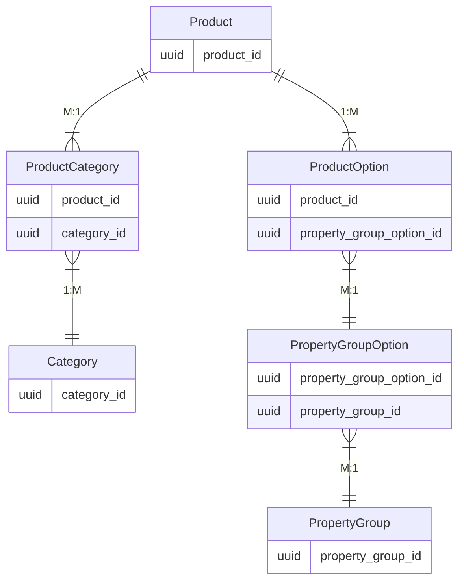
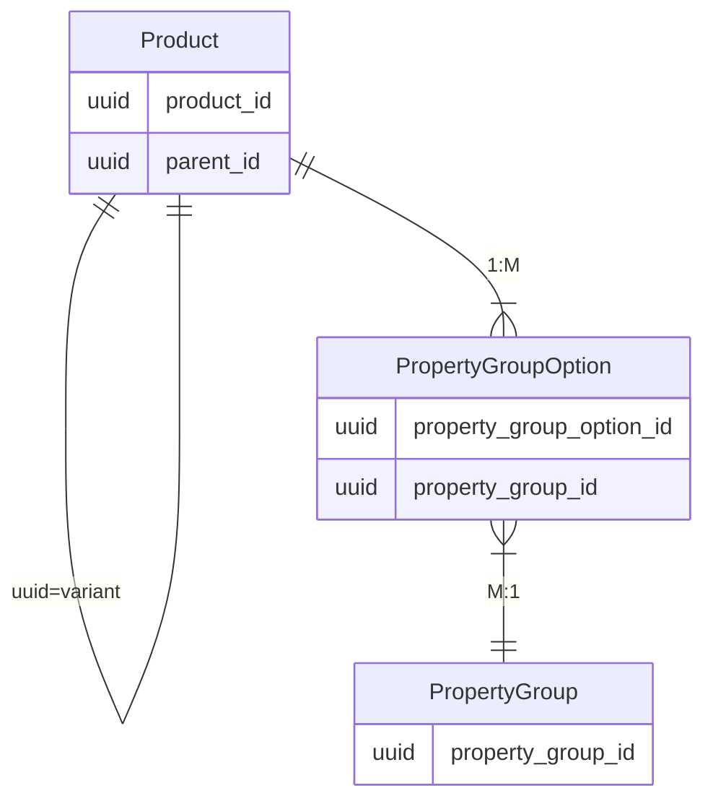

# CATALOG AND SALES CHANNEL

Compiled excerpts from the Shopware Developer Documentation snapshot. Prefer live docs at [developer.shopware.com](https://developer.shopware.com/) when in doubt.

---

## Catalog
**Source:** [concepts/commerce/catalog.md](https://developer.shopware.com/docs/v6.6/concepts/commerce/catalog.md)  
# Catalog

In this section, we will go through the structure that organizes products, prices and everything related to maintaining a **product catalog** within the store.

First, let us understand about products and how they are defined.

---

---

## Categories
**Source:** [concepts/commerce/catalog/categories.md](https://developer.shopware.com/docs/v6.6/concepts/commerce/catalog/categories.md)  
# Categories

Products in Shopware are organized in categories. Categories are represented as a hierarchical tree and they contain products. A product can be contained in multiple categories. Catalog categories provide structure to your catalog content.

There is a single category tree that represents the whole product catalog of your store.

## Product assignments

There are two ways that products can be assigned to a category. Either through an explicit assignment or using a Dynamic Product Group. Explicit assignments are stored in a database table, whereas dynamic groups are a collection of filters that get evaluated at execution time.

## Navigation

Categories also serve as entry points for your store navigation. For every [Sales Channel](sales-channels), you can select a category to be the root of your navigation. Shopware will then build the navigation based on that category's child categories. Parent categories also contain the explicit assignments of their children based on the Inheritance relation between categories.

::: info
Categories can be globally hidden from store navigations based on a hide in navigation flag.
:::

## CMS layouts

Every category has a [CMS layout](../content/shopping-experiences-cms.md) assigned to it. The layout dictates in which way the category will be displayed. It is very useful to centralize the management of CMS pages and hydrate it based on the category configuration.

## Types

In addition to being a product collection and a navigation item, categories can also be used as a *structuring element* (which in itself is not a category that can be visited, but it is visible in the tree) or a *custom link* redirecting to an external resource.

---

---

## Products
**Source:** [concepts/commerce/catalog/products.md](https://developer.shopware.com/docs/v6.6/concepts/commerce/catalog/products.md)  
# Products

Products are sellable entities (physical and digital products) within your shop.

Depending on your setup, Shopware can easily handle thousands of products. However, an upsurge in the product quantity (in millions) needs some tweaks for robust running of the environment as it depends on factors like the number of [categories](../../../concepts/commerce/catalog/categories), [sales channels](../../../concepts/commerce/catalog/sales-channels), [product properties](../../../concepts/commerce/catalog/products#property-groups--options), etc. Every product added to your shop can be made available on one or more [sales channels](../../../concepts/commerce/catalog/sales-channels).

Let's delve into a more detailed understanding of products using the example of garments:

* **Product details**: General information about a Product.

| Title | Product Id | Manufacturer | Prices | .... |
|-------|-----------|--------------|--------|----------|
| Levis Ocean Hoodie | SW1001 | CA | 40 | ... |

* **Product properties**: Product properties encapsulates property groups and options. They are displayed in a table on product details page, in listings, or even be used for filtering. A product can have arbitrarily many property group options.

| Property Group | Property Group Options |
|----------------|-----------------------|
| Size           |  *S*, *M*, *L*, *XL*, etc |
| Color          | *Red*, *Blue*, *Green*, *Black* |
| Material       | *Leather*, *Cotton*, *Jeans* |

* **Category**: Products in Shopware are organized in categories. It is a grouping of products based on characteristics, marketing or search concerns. Categories are represented as a hierarchical tree to form a navigation menu. A product can be contained in multiple categories.

Look at the below condensed overview of relationships between entities - products, categories, options, and property groups are interconnected in the database schema.

* **Product variant**: A sellable product. Products are a self-referencing entity, which is interpreted as a parent-child relationship. Similarly, product variants are also generally mapped to products. This mechanism is used to model variants. This also provides inheritance between field values from parent products to child products.

It is also useful to attach some additional properties to differentiate product variants next to the field inheritance. For that reason, it is critical to understand the difference between *properties* and *options*:

**Properties** are used to model facts about a product, but usually, different product variants share these facts. We can refer to properties as *non variant defining*. They could be useful to represent the following information:

* Product Series / Collection
* Washing Instructions
* Manufacturing country

Opposed to that **options** are considered variant defining, as they are the facts that differ from one product variant to another. Such as

* Shirt Size
* Color
* Container volume

It is important to understand the difference between those two because both provide a relation between the *product* and the *property group option* entity. However only one constitutes to *product variants*.

| Variant | Product | Category | Product Group | Product Group Option |
|---------|---------|----------|---------------|----------------------|
| Variant 1 | Levis Ocean Hoodie | Hoodie & Sweaters | Color | Red |
| Variant 2 | Levis Ocean Hoodie | Hoodie & Sweaters | Color | Black |

## Configurator

When a variant product is loaded for a [Store API](../../api/store-api)-scoped request, Shopware assembles a configurator object which includes all different property groups and the corresponding variants. This way client applications, such as the [Storefront](../../../guides/plugins/plugins/storefront/) or [Composable Frontends](../../../../frontends) can display the different variant options of the product.

The following section is a detailed understanding on category.

---

---

## Sales Channels
**Source:** [concepts/commerce/catalog/sales-channels.md](https://developer.shopware.com/docs/v6.6/concepts/commerce/catalog/sales-channels.md)  
# Sales Channels

Sales channels allow you to operate multiple separate stores from a single Shopware instance.

These stores can have different configurations based on:

* Channel type (Storefront, API consumer, feed export, social channels)
* Appearance ([Themes](../../../guides/plugins/themes/theme-base-guide) for [Storefront](../../../concepts/framework/architecture/storefront-concept) sales channels)
* [Payment methods](../checkout-concept/payments)
* Languages
* Currencies
* Domains
* Prices
* [Products](products) and [Categories](categories)

## Store separation

By using sales channels, you can achieve a logical separation of stores facing customers. They are technically not separated within your store's backend. Any admin user can still see orders, products, prices, etc., from every sales channel.

Usually, sales channels are identified by their URL; however, some clients don't have any URLs, like mobile applications or integrations to other distribution channels, e.g., social media platforms. These integration points can use an *access key* when they [use the API](../../../guides/integrations-api/) to identify the right sales channel.

## Domains

A sales channel can have multiple associated domain configurations. These domains are used to resolve pre-configurations for currencies, snippet sets, and languages based on routes. This way, you can configure various domains such as:

* <https://example.com/>
  * Locale en-GB, British English, Pounds
* <https://example.com/de>
  * Locale de-DE, German, Euro
* <https://example.es/>
  * Locale es-ES, Spanish, Euro

---

---

