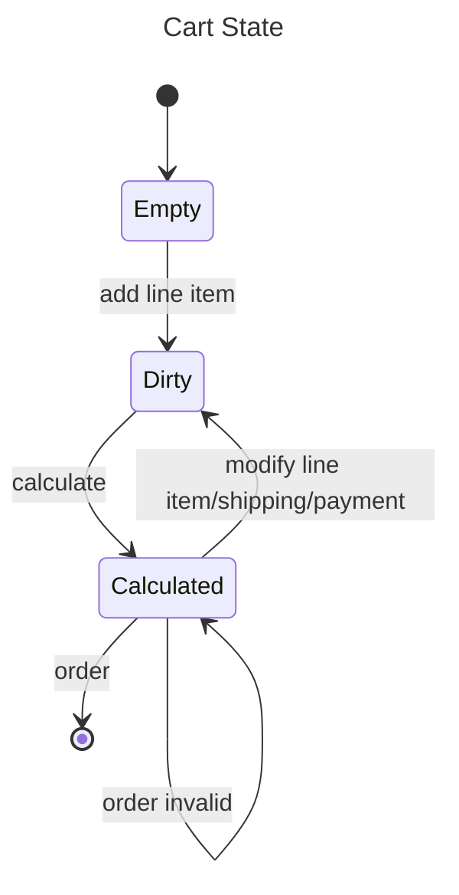
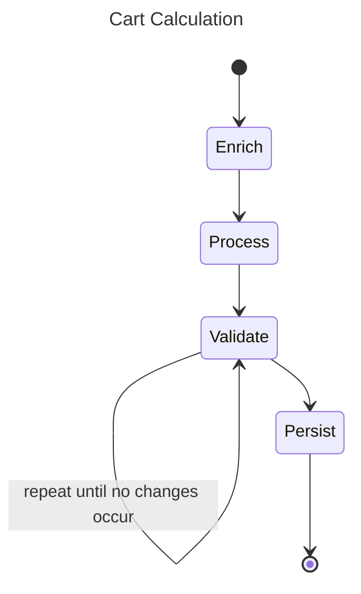
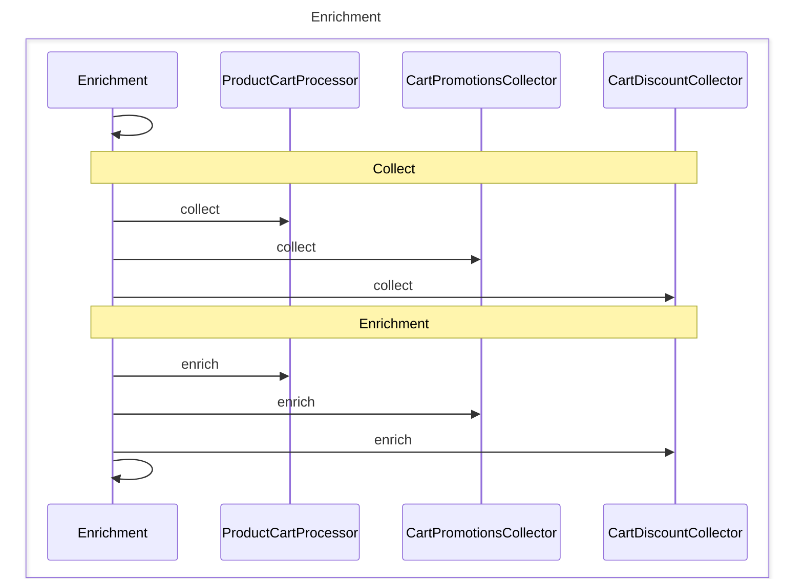
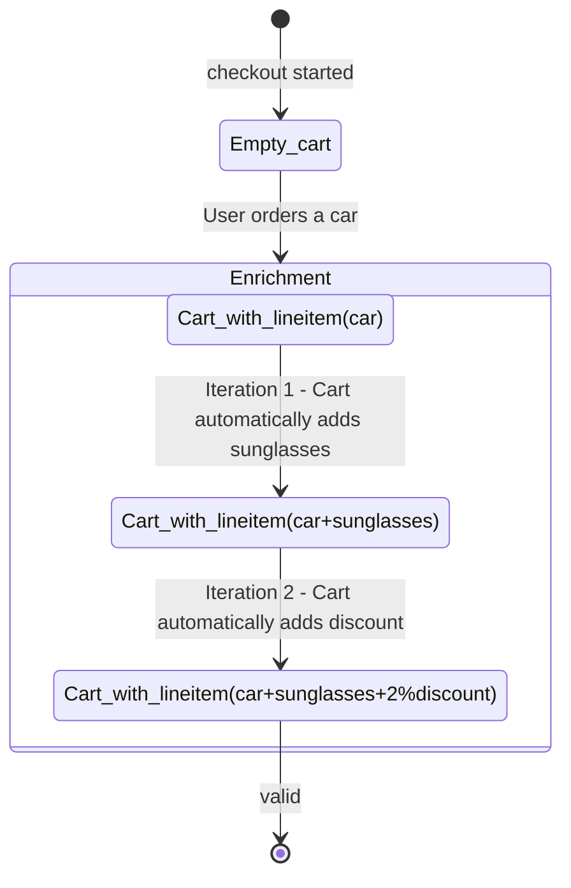
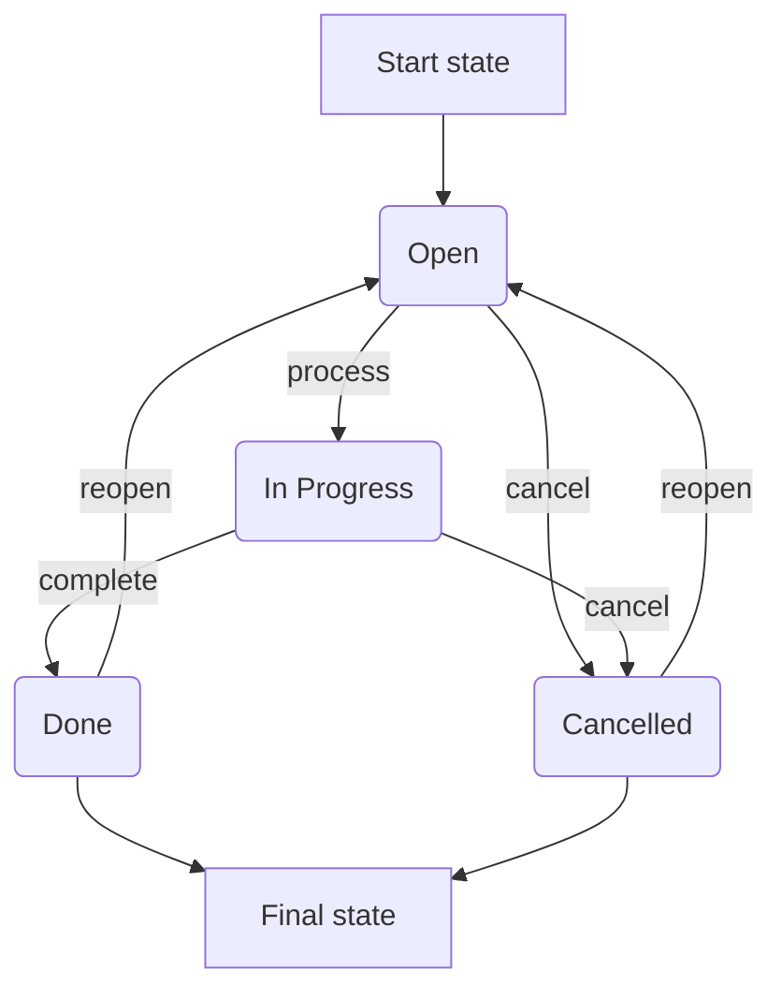
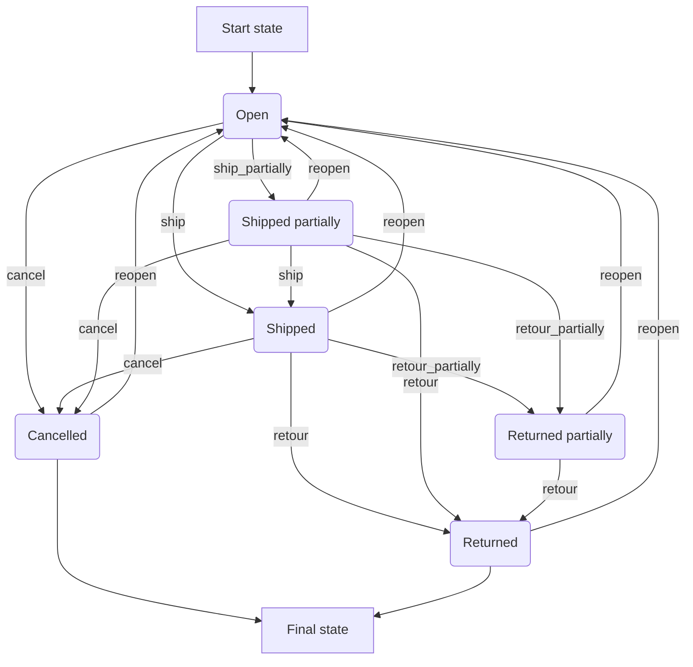

# CHECKOUT CART PAYMENTS

Compiled excerpts from the Shopware Developer Documentation snapshot. Prefer live docs at [developer.shopware.com](https://developer.shopware.com/) when in doubt.

---

## Checkout
**Source:** [concepts/commerce/checkout-concept.md](https://developer.shopware.com/docs/v6.6/concepts/commerce/checkout-concept.md)  
# Checkout

The checkout holds a series of steps to purchase items in your store. The checkout in Shopware deals with the entire process of turning a cart into an order and initiating all associated processes like payment, shipping, etc.

This section further focuses on carts, orders and payment.

---

---

## Cart
**Source:** [concepts/commerce/checkout-concept/cart.md](https://developer.shopware.com/docs/v6.6/concepts/commerce/checkout-concept/cart.md)  
# Cart

Shopping cart management is a central feature of Shopware 6. The shopping cart resides in the checkout bundle and is a central part of the checkout process.

## Design goals

The cart was designed with a few design goals in mind.

### Adaptability

Although many services exist to make working with the cart simple and intuitive, the cart itself can be changed through various processes and adapt to numerous use cases.

### Performance

The cart is designed by identifying key processes and optimizing upon them. Therefore the amount of calculations, queries, and iterations are kept to a minimum, and a clear state management is implemented.

### Abstraction

The cart has very few hard dependencies on other core entities in Shopware 6. Entities such as products, surcharges, or discounts are referenced through interfaces that the line items in the cart reference.

## Cart Struct

`\Shopware\Core\Checkout\Cart\Cart`

An instance of this class represents one single cart. As shown in the diagram below, relations to central Entities of the system are omitted. This allows Shopware 6 to manage multiple carts per user, per sales channel, or across all sales channels. The only identification is a token hash.


This highly mutable data structure is acted upon from requests and calculated and validated through services. It contains:

### Line Items

A line item represents an order position.

* It may be a  shippable good, a download article, or even a bundle of many products.
* Line items contain properties that tell the cart how to handle changes in line items. E.g., *stackable* - quantity can be changed, *removable* - removable through the API, and so on.
* A line item is the main extension point for the cart process. Therefore a promotion, a discount, or a surcharge is also a line item.
* A line item can even contain other line items. So a single order position can be the composition of multiple single line items.

### Transaction

It is the payment in the cart. Contains a payment handler and the amount.

### Delivery

It is a shipment in the cart. It contains a date, a method, a target location, and the line items that should be shipped together.

### Error

Validation errors which prevent ordering from that cart.

### Tax

The calculated tax rate for the cart.

### Price

The price of all line items, including tax, delivery costs, voucher discounts, and surcharges.

## State

Shopware 6 manages the cart's state through different services. The diagram below illustrates the different states the cart can have and the state changes it can go through.



| Cart state | Description|
|------|------------|
| Empty | A cart with no items will have default shipping and payment settings. |
| Dirty | On adding a new line item, the cart undergoes modifications with invalid prices, raw line items, and uncertain delivery validity. Consequently, calculations are necessary.|
| Calculated | After accurate calculations, the cart can be either submitted as an order or may contain errors that need to be addressed. |

## Calculation

Calculating a cart is one of the more costly operations an ecommerce system must support. Therefore the interfaces of the cart are designed as precise and as quick as possible. The calculation is a multi-stage process that revolves around the mutation of the data structure of the cart struct shown in the diagram below:



| Cart calculation state | Description|
|------|------------|
| Enrich | The calculation process in the **enrich state** for line items involves adding images, its descriptions and determining prices |
| Process | During the **process state**, price updates occur, adjustments to shipping and payment are made|
| Validate | In the **validate state**, validation is performed using the rule system and cart changes based on plausibility checks. |
| Persist | The **persist state** is responsible for updating the storage. |

### Cart enrichment

Enrichment secures the *Independence\_ and \_Adaptability* of Shopware 6. As shown in the below code snippet, the cart can create and contain line items that are initially empty and will only be loaded (enriched) during the calculation.

```php
<?php 

use Shopware\Core\Checkout\Cart\Cart;
use Shopware\Core\Checkout\Cart\LineItem\LineItem;

$lineItem = new LineItem(/* ... */);
/** @var $cart Cart */
$cart->getLineItems()->add($lineItem);

$lineItem->getPrice(); // is now null
// enrich the cart
$lineItem->getPrice(); // now set up
```

This process is transparently controlled from the cart but executed through implementations of `\Shopware\Core\Checkout\Cart\CartDataCollectorInterface`. This interface is cut in order to reduce the number of database calls necessary to set up the cart's data structure for **price calculation** and **inspection** (meaning: rendering in a storefront, reading from the API).

A default set of collectors is implemented in Shopware 6, which has a set call order shown in the diagram below.

| Service ID | Task |
| :--- | :--- |
| Shopware\Core\Content\Product\Cart\ProductCartProcessor | Enrich all referenced products |
| Shopware\Core\Checkout\Promotion\Cart\CartPromotionsCollector | Enrich add, remove and validate promotions |
| Shopware\Core\Checkout\Shipping\Cart\ShippingMethodPriceCollector | Handle shipping prices |



## Cart processors - price calculation and validation

After a cart is enriched, the cart is processed. The price information for all individual `LineItems` is now set up to calculate the sums. This happens in the `\Shopware\Core\Checkout\Cart\Processor` class, following these steps:

* The `lineItem` prices are calculated by applying the quantity and the tax rate.
* Deliveries are set up and cost calculated.
* Different cart values are summed up (incl, excl. vat, inc. excl. shipping).

Then the calculation of prices is done, and the cart can be inspected from the rule system.

## Context rules

After the cart has been processed, it is validated against the rules, which can lead to a change in the carts' data, so a revalidation becomes necessary. We can envision a scenario where we sell cars and have the following rules:

* Everybody buying a car gets a pair of sunglasses for free.
* Every cart containing two products gets a discount of 2%.



As you can see in the diagram above, the cart is modified during the enrichment process. The sunglasses are added in the first iteration, and in the second iteration, the discount is added as the cart contains two products. This results in the expected state of one car, one pair of sunglasses, and a two-percent discount.

## Cart storage

Contrary to other entities in the system, the cart is not managed through the [Data Abstraction Layer](/docs/concepts/framework/data-abstraction-layer)(DAL). The cart can only be written and retrieved as a whole. As discussed in the sections, the workload of Shopware 6 can only be performed on the whole object in memory.

## Cart control

The state changes and cart mutation is handled automatically by a facade the `\Shopware\Core\Checkout\Cart\SalesChannel\CartService`. It controls, sets up, and modifies the cart struct.

---

---

## Orders
**Source:** [concepts/commerce/checkout-concept/orders.md](https://developer.shopware.com/docs/v6.6/concepts/commerce/checkout-concept/orders.md)  
# Orders

From a cart instance, an `Order` can be created. The whole structure of the cart is stored in the database. Contrary to the cart, a structure that allows a great degree of freedom and is *calculation optimized*, the order is *workflow optimized*.

## Design goals

### Denormalization

The order itself does not depend on the catalog or the products. The line item with all of its data, as well as all calculated prices, is persisted in the database. Orders only get recalculated when triggered explicitly through the API.

### Workflow dependant

The order state changes in a defined, predictable and configurable way - other state transitions are blocked.

## State management

::: tip
The state machines displayed in the following sections can actually be modified through the API, this is just the default setup.
:::

During the order placement, at least three distinct state machines are started as described in the below diagrams.

These can be used to track the progress during the order process and notify the customer about the current state of the order.

**The order state machine**



**The order transaction state machine**

```mermaid
flowchart TD
START_STATE[Start state] --> 018c4a0eeba171db8f885b1b74f5895f

018c4a0eeba171db8f885b1b74f5895f(Open)
018c4a0eeba171db8f885b1b75b3a3e3(Paid)
018c4a0eeba171db8f885b1b760cc537(Paid partially)
018c4a0eeba171db8f885b1b76166310(Cancelled)
018c4a0eeba171db8f885b1b76cb7f9c(Reminded)
018c4a0eeba171db8f885b1b77a3112c(Refunded)
018c4a0eeba171db8f885b1b77a3112c --> FINAL_STATE[Final state]
018c4a0eeba171db8f885b1b7833adb3(Refunded partially)
018c4a0eff2670648f1f92d85efca4dd(In Progress)
018c4a0eff2670648f1f92d85f9cd806(Failed)
018c4a0f109d7034995df01ceddd9b6a(Authorized)
018c4a0f10bc7230939f1a53ffc3ad22(Chargeback)
018c4a0f2f00710bb4227243818b33ad(Unconfirmed)

018c4a0eeba171db8f885b1b74f5895f -- pay --> 018c4a0eeba171db8f885b1b75b3a3e3
018c4a0eeba171db8f885b1b74f5895f -- pay_partially --> 018c4a0eeba171db8f885b1b760cc537
018c4a0eeba171db8f885b1b74f5895f -- cancel --> 018c4a0eeba171db8f885b1b76166310
018c4a0eeba171db8f885b1b74f5895f -- remind --> 018c4a0eeba171db8f885b1b76cb7f9c
018c4a0eeba171db8f885b1b76cb7f9c -- pay --> 018c4a0eeba171db8f885b1b75b3a3e3
018c4a0eeba171db8f885b1b76cb7f9c -- pay_partially --> 018c4a0eeba171db8f885b1b760cc537
018c4a0eeba171db8f885b1b76cb7f9c -- cancel --> 018c4a0eeba171db8f885b1b76166310
018c4a0eeba171db8f885b1b760cc537 -- remind --> 018c4a0eeba171db8f885b1b76cb7f9c
018c4a0eeba171db8f885b1b760cc537 -- pay --> 018c4a0eeba171db8f885b1b75b3a3e3
018c4a0eeba171db8f885b1b760cc537 -- refund_partially --> 018c4a0eeba171db8f885b1b7833adb3
018c4a0eeba171db8f885b1b760cc537 -- refund --> 018c4a0eeba171db8f885b1b77a3112c
018c4a0eeba171db8f885b1b760cc537 -- cancel --> 018c4a0eeba171db8f885b1b76166310
018c4a0eeba171db8f885b1b75b3a3e3 -- refund_partially --> 018c4a0eeba171db8f885b1b7833adb3
018c4a0eeba171db8f885b1b75b3a3e3 -- refund --> 018c4a0eeba171db8f885b1b77a3112c
018c4a0eeba171db8f885b1b75b3a3e3 -- cancel --> 018c4a0eeba171db8f885b1b76166310
018c4a0eeba171db8f885b1b7833adb3 -- refund --> 018c4a0eeba171db8f885b1b77a3112c
018c4a0eeba171db8f885b1b7833adb3 -- cancel --> 018c4a0eeba171db8f885b1b76166310
018c4a0eeba171db8f885b1b76166310 -- reopen --> 018c4a0eeba171db8f885b1b74f5895f
018c4a0eeba171db8f885b1b76166310 -- refund --> 018c4a0eeba171db8f885b1b77a3112c
018c4a0eeba171db8f885b1b76166310 -- refund_partially --> 018c4a0eeba171db8f885b1b7833adb3
018c4a0eff2670648f1f92d85efca4dd -- reopen --> 018c4a0eeba171db8f885b1b74f5895f
018c4a0eff2670648f1f92d85efca4dd -- fail --> 018c4a0eff2670648f1f92d85f9cd806
018c4a0eff2670648f1f92d85efca4dd -- cancel --> 018c4a0eeba171db8f885b1b76166310
018c4a0eff2670648f1f92d85efca4dd -- paid --> 018c4a0eeba171db8f885b1b75b3a3e3
018c4a0eff2670648f1f92d85efca4dd -- paid_partially --> 018c4a0eeba171db8f885b1b760cc537
018c4a0eff2670648f1f92d85efca4dd -- pay_partially --> 018c4a0eeba171db8f885b1b760cc537
018c4a0eff2670648f1f92d85f9cd806 -- reopen --> 018c4a0eeba171db8f885b1b74f5895f
018c4a0eff2670648f1f92d85f9cd806 -- do_pay --> 018c4a0eff2670648f1f92d85efca4dd
018c4a0eff2670648f1f92d85f9cd806 -- pay --> 018c4a0eeba171db8f885b1b75b3a3e3
018c4a0eff2670648f1f92d85f9cd806 -- fail --> 018c4a0eff2670648f1f92d85f9cd806
018c4a0eff2670648f1f92d85f9cd806 -- paid --> 018c4a0eeba171db8f885b1b75b3a3e3
018c4a0eff2670648f1f92d85f9cd806 -- paid_partially --> 018c4a0eeba171db8f885b1b760cc537
018c4a0eff2670648f1f92d85f9cd806 -- pay_partially --> 018c4a0eeba171db8f885b1b760cc537
018c4a0eeba171db8f885b1b74f5895f -- do_pay --> 018c4a0eff2670648f1f92d85efca4dd
018c4a0eeba171db8f885b1b74f5895f -- fail --> 018c4a0eff2670648f1f92d85f9cd806
018c4a0eeba171db8f885b1b76cb7f9c -- reopen --> 018c4a0eeba171db8f885b1b74f5895f
018c4a0eeba171db8f885b1b76cb7f9c -- do_pay --> 018c4a0eff2670648f1f92d85efca4dd
018c4a0eeba171db8f885b1b760cc537 -- reopen --> 018c4a0eeba171db8f885b1b74f5895f
018c4a0eeba171db8f885b1b760cc537 -- do_pay --> 018c4a0eff2670648f1f92d85efca4dd
018c4a0eeba171db8f885b1b75b3a3e3 -- reopen --> 018c4a0eeba171db8f885b1b74f5895f
018c4a0eeba171db8f885b1b7833adb3 -- reopen --> 018c4a0eeba171db8f885b1b74f5895f
018c4a0eeba171db8f885b1b74f5895f -- paid --> 018c4a0eeba171db8f885b1b75b3a3e3
018c4a0eeba171db8f885b1b74f5895f -- paid_partially --> 018c4a0eeba171db8f885b1b760cc537
018c4a0eff2670648f1f92d85efca4dd -- authorize --> 018c4a0f109d7034995df01ceddd9b6a
018c4a0eeba171db8f885b1b74f5895f -- authorize --> 018c4a0f109d7034995df01ceddd9b6a
018c4a0eeba171db8f885b1b76cb7f9c -- authorize --> 018c4a0f109d7034995df01ceddd9b6a
018c4a0f109d7034995df01ceddd9b6a -- paid --> 018c4a0eeba171db8f885b1b75b3a3e3
018c4a0f109d7034995df01ceddd9b6a -- paid_partially --> 018c4a0eeba171db8f885b1b760cc537
018c4a0f109d7034995df01ceddd9b6a -- fail --> 018c4a0eff2670648f1f92d85f9cd806
018c4a0f109d7034995df01ceddd9b6a -- cancel --> 018c4a0eeba171db8f885b1b76166310
018c4a0eeba171db8f885b1b75b3a3e3 -- chargeback --> 018c4a0f10bc7230939f1a53ffc3ad22
018c4a0eeba171db8f885b1b760cc537 -- chargeback --> 018c4a0f10bc7230939f1a53ffc3ad22
018c4a0f10bc7230939f1a53ffc3ad22 -- paid --> 018c4a0eeba171db8f885b1b75b3a3e3
018c4a0f10bc7230939f1a53ffc3ad22 -- paid_partially --> 018c4a0eeba171db8f885b1b760cc537
018c4a0f10bc7230939f1a53ffc3ad22 -- cancel --> 018c4a0eeba171db8f885b1b76166310
018c4a0eeba171db8f885b1b76166310 -- paid --> 018c4a0eeba171db8f885b1b75b3a3e3
018c4a0eeba171db8f885b1b74f5895f -- process_unconfirmed --> 018c4a0f2f00710bb4227243818b33ad
018c4a0eeba171db8f885b1b76cb7f9c -- process_unconfirmed --> 018c4a0f2f00710bb4227243818b33ad
018c4a0eff2670648f1f92d85f9cd806 -- process_unconfirmed --> 018c4a0f2f00710bb4227243818b33ad
018c4a0eeba171db8f885b1b76166310 -- process_unconfirmed --> 018c4a0f2f00710bb4227243818b33ad
018c4a0eeba171db8f885b1b760cc537 -- process_unconfirmed --> 018c4a0f2f00710bb4227243818b33ad
018c4a0f2f00710bb4227243818b33ad -- paid --> 018c4a0eeba171db8f885b1b75b3a3e3
018c4a0f2f00710bb4227243818b33ad -- paid_partially --> 018c4a0eeba171db8f885b1b760cc537
018c4a0f2f00710bb4227243818b33ad -- fail --> 018c4a0eff2670648f1f92d85f9cd806
018c4a0f2f00710bb4227243818b33ad -- cancel --> 018c4a0eeba171db8f885b1b76166310
018c4a0f2f00710bb4227243818b33ad -- authorize --> 018c4a0f109d7034995df01ceddd9b6a
018c4a0f2f00710bb4227243818b33ad -- reopen --> 018c4a0eeba171db8f885b1b74f5895f
```



**The order delivery state machine**



---

---

## Payments
**Source:** [concepts/commerce/checkout-concept/payments.md](https://developer.shopware.com/docs/v6.6/concepts/commerce/checkout-concept/payments.md)  
# Payments

Shopware 6 payment system is an integral part of the checkout process. A payment is applied to a transaction of an order. As with any order change, this is done through the state machine. At its core, the payment system is composed of payment handlers. These extend Shopware to support multiple different payment types. A list of all payment handlers is stored in the database.

::: info
If you want to directly skip to implementation details, then head to the [Add payment plugin](../../../guides/plugins/plugins/checkout/payment/add-payment-plugin) section.
:::

## Payment flow

The payment and checkout flow consist of two essential steps:

* Placing the order and
* Handling the payment

These steps are outlined in the diagram below:


The diagram above shows the payment flow for headless environments; however, for the single-stack scenario (i.e., when the default Storefront is used) the differences are minor and described in the section below.

If you want to see a specific example of a headless payment using the Store API, head to [API documentation](https://shopware.stoplight.io/docs/store-api/8218801e50fe5-handling-the-payment).

### 1. Select payment method

The first step for a user is to select their desired payment. The current payment method is stored in the user context, which can be manipulated by calling the corresponding route or endpoint (`/store-api/context`).

### 2. Place order

In this step, an order is created. It takes no required parameters but creates the order based on the user's current context and cart. You can add additional information like tracking parameters or comments. Shopware creates the order internally together with an open transaction which acts as a placeholder for the payment.

A transaction contains information like a unique ID, the payment method, or the total amount to be paid. An order can have multiple transactions, but only a single one is created in this step.

#### 2.1 Prepare payment (optional)

Some payment integrations already create a payment reservation or authorization at this point. This totally depends on the specific payment extension and is not standardized by Shopware in any way. However, usually, some type of payment intent or transaction reference is stored in the meantime.

### 3. Handle payment

This step can only be executed after an order has been placed. It starts the payment by determining the correct payment handler for the selected payment method.

::: info
Although from a functional perspective, steps 2 and 3 are separated but in the default Storefront both are initiated in the same request.
:::

#### 3.1 Payment handler

There are two types of payment handlers in Shopware:

* **Synchronous payment**

In this scenario, the payment integration usually makes a request to the payment gateway to execute or authorize the payment. The gateway immediately responds with a status and Shopware can give feedback to the user.

* **Asynchronous payment**

These payments include a user redirect. The redirect target is defined by the payment integration and contains information about the transaction as well as a callback URL for the payment gateway.

The frontend can also define success and error URLs that will be used for the eventual redirect after step 3.3.

In the default Storefront, this redirect takes place automatically. In the headless scenario, Shopware returns the redirect URL within the  API response so that the frontend can perform the redirect.

#### 3.2 Payment execution on gateway (optional)

This step is only executed for asynchronous payments. After being redirected, the user can perform final checks or authorizations on the payment gateway UI. After that, the payment gateway redirects the user to the callback URL provided in step 3.1 along with a parameter indicating the outcome of the payment.

#### 3.3 Payment finalize (optional)

This step is only executed for asynchronous payments. It is triggered by the callback URL (which points to `/payment/finalize-transaction`) that has been provided to the payment gateway in step 3.1. Depending on the payment success, Shopware updates the transaction status and redirects the user to the corresponding finish page from step 3.

::: warning
**Disclaimer**

The actual implementation of payment integrations differs between providers. Therefore, our specification does not include any guidelines about payment states or specific API calls to be made. Some integrations share data between the steps or provide and call upon webhooks after the payment process has been finished. These implementations go beyond our standards.
:::

### Session and state

The session should not be used in headless payment integrations. Read more about [session guidelines](../../../resources/guidelines/code/session-and-state).

### Controllers and API

Do not add any logic inside your controllers and remember to add your Store API routes to the payment, so it can be used in headless scenarios. For Storefront and Store API route integration see the [Add store-api route guide](../../../guides/plugins/plugins/framework/store-api/add-store-api-route)

## Next steps

---

---

## Checkout
**Source:** [guides/plugins/plugins/checkout.md](https://developer.shopware.com/docs/v6.6/guides/plugins/plugins/checkout.md)  
# Checkout

A checkout plugin in Shopware improves the checkout process for customers, offering features like guest checkout, custom fields, multiple payment options, address validation, order summaries, shopping cart, shipping method selection, and promotional code support. It ensures a smooth and efficient checkout experience for customers while providing businesses with the flexibility to meet their specific requirements.

---

---

## Cart
**Source:** [guides/plugins/plugins/checkout/cart.md](https://developer.shopware.com/docs/v6.6/guides/plugins/plugins/checkout/cart.md)  
# Cart

Cart core functions as a plugin in Shopware include adding products to the cart, displaying cart contents, adding discounts to line items, updating cart items, adding custom prices to line items, applying tax rates, proceeding to checkout, persisting cart data, integrating with the checkout process, and validating the cart. While these functions are typically available within the Shopware core system, plugins can enhance and customize them according to specific business requirements or customer preferences.

---

---

## Add Cart Discounts
**Source:** [guides/plugins/plugins/checkout/cart/add-cart-discounts.md](https://developer.shopware.com/docs/v6.6/guides/plugins/plugins/checkout/cart/add-cart-discounts.md)  
# Add Cart Discounts

## Overview

In this guide you'll learn how to create discounts for your cart. In this example, we will create a discount for products that have 'Example' in their name.

## Prerequisites

In order to create cart discounts for your plugin, you first need a plugin as base. Therefore, you can refer to the [Plugin Base Guide](../../plugin-base-guide).

Furthermore you should be familiar with the service registration in Shopware, otherwise head over to our [Add custom service](../../plugin-fundamentals/add-custom-service) guide.

## Creating the processor

To add a discount to the cart, you should use the processor pattern. For this you need to create your own cart processor. We'll start with creating a new class called `ExampleProcessor` in the directory `<plugin root>/src/Core/Checkout`. Our class has to implement `Shopware\Core\Checkout\Cart\CartProcessorInterface` and we have to inject `Shopware\Core\Checkout\Cart\Price\PercentagePriceCalculator` in our constructor. All adjustments are done in the `process` method, where the product items already own a name and a price.

Let's start with the actual example code:

```php
// <plugin root>/src/Core/Checkout/ExampleProcessor.php
<?php declare(strict_types=1);

namespace Swag\BasicExample\Core\Checkout;

use Shopware\Core\Checkout\Cart\Cart;
use Shopware\Core\Checkout\Cart\CartBehavior;
use Shopware\Core\Checkout\Cart\CartProcessorInterface;
use Shopware\Core\Checkout\Cart\LineItem\CartDataCollection;
use Shopware\Core\Checkout\Cart\LineItem\LineItem;
use Shopware\Core\Checkout\Cart\LineItem\LineItemCollection;
use Shopware\Core\Checkout\Cart\Price\PercentagePriceCalculator;
use Shopware\Core\Checkout\Cart\Price\Struct\PercentagePriceDefinition;
use Shopware\Core\Checkout\Cart\Rule\LineItemRule;
use Shopware\Core\System\SalesChannel\SalesChannelContext;

class ExampleProcessor implements CartProcessorInterface
{
    private PercentagePriceCalculator $calculator;

    public function __construct(PercentagePriceCalculator $calculator)
    {
        $this->calculator = $calculator;
    }

    public function process(CartDataCollection $data, Cart $original, Cart $toCalculate, SalesChannelContext $context, CartBehavior $behavior): void
    {
        $products = $this->findExampleProducts($toCalculate);

        // no example products found? early return
        if ($products->count() === 0) {
            return;
        }

        $discountLineItem = $this->createDiscount('EXAMPLE_DISCOUNT');

        // declare price definition to define how this price is calculated
        $definition = new PercentagePriceDefinition(
            -10,
            new LineItemRule(LineItemRule::OPERATOR_EQ, $products->getKeys())
        );

        $discountLineItem->setPriceDefinition($definition);

        // calculate price
        $discountLineItem->setPrice(
            $this->calculator->calculate($definition->getPercentage(), $products->getPrices(), $context)
        );

        // add discount to new cart
        $toCalculate->add($discountLineItem);
    }

    private function findExampleProducts(Cart $cart): LineItemCollection
    {
        return $cart->getLineItems()->filter(function (LineItem $item) {
            // Only consider products, not custom line items or promotional line items
            if ($item->getType() !== LineItem::PRODUCT_LINE_ITEM_TYPE) {
                return false;
            }

            $exampleInLabel = stripos($item->getLabel(), 'example') !== false;

            if (!$exampleInLabel) {
                return false;
            }

            return $item;
        });
    }

    private function createDiscount(string $name): LineItem
    {
        $discountLineItem = new LineItem($name, 'example_discount', null, 1);

        $discountLineItem->setLabel('Our example discount!');
        $discountLineItem->setGood(false);
        $discountLineItem->setStackable(false);
        $discountLineItem->setRemovable(false);

        return $discountLineItem;
    }
}
```

As you can see, all line items of type product containing the string 'example' in their name are fetched. Also, a few information are saved into variables, since we'll need them several times. If no product in the cart matches your condition, we can early return in the `process` method. Afterwards we create a new line item for the new discount. For the latter, we don't want that the line item is stackable and it shouldn't be removable either.

So let's get to the important part, which is the price. For a percentage discount, we have to use the `PercentagePriceDefinition`. It consists of an actual value, the currency precision and, if necessary, some rules to apply to. This definition is required for the cart to tell the core how this price can be recalculated even if the plugin would be uninstalled.

Shopware comes with a called `LineItemRule`, which requires two parameters:

* The operator being used, e.g. `LineItemRule::OPERATOR_EQ` (Equals) or `LineItemRule::OPERATOR_NEQ` (Not equals)
* The identifiers to apply the rule to. Pass the line item identifiers here, in this case the identifiers of the previously filtered products

After adding the definition to the line item, we have to calculate the current price of the discount. Therefore we can use the `PercentagePriceCalculator` of the core. The last step is to add the discount to the new cart which is provided as `Cart $toCalculate`.

That's it for the main code of our custom `CartProcessor`. Now we only have to register it in our `services.xml` using the tag `shopware.cart.processor` and priority `4500`, which is used to get access to the calculation after the [product processor](https://github.com/shopware/shopware/blob/v6.3.4.1/src/Core/Checkout/DependencyInjection/cart.xml#L223-L231) handled the products.

---

---

## Add Cart Items
**Source:** [guides/plugins/plugins/checkout/cart/add-cart-items.md](https://developer.shopware.com/docs/v6.6/guides/plugins/plugins/checkout/cart/add-cart-items.md)  
# Add Cart Items

## Overview

This guide will show you how to create line items like products, promotion and other types and add them to the cart. It will also cover creating a custom LineItemHandler.

## Prerequisites

As most guides, this guide is also built upon the [Plugin base guide](../../plugin-base-guide), but you don't necessarily need that. It will use an example Storefront controller, so if you don't know how to add a custom Storefront controller yet, have a look at our guide about [Adding a custom page](../../storefront/add-custom-page). Furthermore, registering classes or services to the DI container is also not explained here, but it's covered in our guide about [Dependency injection](../../plugin-fundamentals/dependency-injection), so having this open in another tab won't hurt.

## Adding a simple item

For this guide, we will use an example controller, that is already registered. The process of creating such a controller is not explained here, for that case head over to our guide about [Adding a custom page](../../storefront/add-custom-page).

However, having a controller is not a necessity here, it just comes with the advantage of fetching the current cart by adding `\Shopware\Core\Checkout\Cart\Cart` as a method argument, which will automatically be filled by our argument resolver.

If you're planning to use this guide for something else but a controller, you can fetch the current cart with the `\Shopware\Core\Checkout\Cart\SalesChannel\CartService::getCart` method.

So let's add an example product to the cart using code. For that case, you'll need to have access to both the services `\Shopware\Core\Checkout\Cart\LineItemFactoryRegistry` and `\Shopware\Core\Checkout\Cart\SalesChannel\CartService` supplied to your controller or service via [Dependency injection](../../plugin-fundamentals/dependency-injection).

Let's have a look at an example.

```php
// <plugin root>/src/Service/ExampleController.php
<?php declare(strict_types=1);

namespace Swag\BasicExample\Service;

use Shopware\Core\Checkout\Cart\LineItem\LineItem;
use Shopware\Core\Checkout\Cart\LineItemFactoryRegistry;
use Shopware\Core\Checkout\Cart\SalesChannel\CartService;
use Shopware\Core\System\SalesChannel\SalesChannelContext;
use Shopware\Storefront\Controller\StorefrontController;
use Shopware\Storefront\Framework\Routing\StorefrontResponse;
use Symfony\Component\Routing\Attribute\Route;
use Shopware\Core\Checkout\Cart\Cart;

#[Route(defaults: ['_routeScope' => ['storefront']])]
class ExampleController extends StorefrontController
{
    private LineItemFactoryRegistry $factory;

    private CartService $cartService;

    public function __construct(LineItemFactoryRegistry $factory, CartService $cartService)
    {
        $this->factory = $factory;
        $this->cartService = $cartService;
    }

    #[Route(path: '/cartAdd', name: 'frontend.example', methods: ['GET'])]
    public function add(Cart $cart, SalesChannelContext $context): StorefrontResponse
    {
        // Create product line item
        $lineItem = $this->factory->create([
            'type' => LineItem::PRODUCT_LINE_ITEM_TYPE, // Results in 'product'
            'referencedId' => 'myExampleId', // this is not a valid UUID, change this to your actual ID!
            'quantity' => 5,
            'payload' => ['key' => 'value']
        ], $context);

        $this->cartService->add($cart, $lineItem, $context);

        return $this->renderStorefront('@Storefront/storefront/base.html.twig');
    }
}
```

As mentioned earlier, you can just apply the `Cart` argument to your method and it will be automatically filled.

Afterwards you create a line item using the `LineItemFactoryRegistry` and its `create` method. It is mandatory to supply the `type` property, which can be one of the following by default:

* product
* promotion
* credit
* custom

The `LineItemFactoryRegistry` holds a collection of handlers to create a line item of a specific type. Each line item type needs an own handler, which is covered later in this guide. If the type is not supported, it will throw a `\Shopware\Core\Checkout\Cart\Exception\LineItemTypeNotSupportedException` exception.

Other than that, we apply the `referencedId`, which in this case points to the product ID that we want to add. If you were to add a line item of type `promotion`, the `referencedId` would have to point to the respective promotion ID. The `quantity` field just contains the quantity of line items which you want to add to the cart.

Now have a look at the `payload` field, which only contains dummy data in this example. The `payload` field can contain any additional data that you need to attach to a line item in order to properly handle your business logic. E.g. the information about the chosen options of a configurable product are saved in there. Feel free to use this one to apply important information to your line item, that you might have to process later on, e.g. in the template.

You can find a list of all available fields in the [createValidatorDefinition method of the LineItemFactoryRegistry](https://github.com/shopware/shopware/blob/v6.3.5.0/src/Core/Checkout/Cart/LineItemFactoryRegistry.php#L113-L142).

If you now call the route `/cartAdd`, it should add the product with the ID `myExampleId` to the cart, 5 times.

## Create new factory handler

Sometimes you really want to have a custom line item handler, e.g. for your own new entity, such as a bundle entity or alike. For that case, you can create your own line item handler, which will then be available in the `LineItemFactoryRegistry` as a valid `type` option.

You need to create a new class which implements the interface `\Shopware\Core\Checkout\Cart\LineItemFactoryHandler\LineItemFactoryInterface` and it needs to be registered in the DI container with the tag `shopware.cart.line_item.factory`.

```xml
// <plugin root>/src/Resources/config/services.xml
<?xml version="1.0" ?>
<container xmlns="http://symfony.com/schema/dic/services"
           xmlns:xsi="http://www.w3.org/2001/XMLSchema-instance"
           xsi:schemaLocation="http://symfony.com/schema/dic/services http://symfony.com/schema/dic/services/services-1.0.xsd">

    <services>
        <service id="Swag\BasicExample\Service\ExampleHandler">
            <tag name="shopware.cart.line_item.factory" />
        </service>
    </services>
</container>
```

Let's first have a look at an example handler:

```php
// <plugin root>/src/Service/ExampleHandler.php
<?php declare(strict_types=1);

namespace Swag\BasicExample\Service;

use Shopware\Core\Checkout\Cart\LineItem\LineItem;
use Shopware\Core\Checkout\Cart\LineItemFactoryHandler\LineItemFactoryInterface;
use Shopware\Core\System\SalesChannel\SalesChannelContext;

class ExampleHandler implements LineItemFactoryInterface
{
    public const TYPE = 'example';

    public function supports(string $type): bool
    {
        return $type === self::TYPE;
    }

    public function create(array $data, SalesChannelContext $context): LineItem
    {
        return new LineItem($data['id'], self::TYPE, $data['referencedId'] ?? null, 1);
    }

    public function update(LineItem $lineItem, array $data, SalesChannelContext $context): void
    {
        if (isset($data['referencedId'])) {
            $lineItem->setReferencedId($data['referencedId']);
        }
    }
}
```

Implementing the `LineItemFactoryInterface` will force you to also implement three new methods:

* `supports`: A method that is applied a string `$type`. This method has to return a bool whether or not it supports this type.

  In this example, this handler supports the line item type `example`.

* `create`: This method is responsible for actually creating an instance of a `LineItem`. Apply everything necessary for your custom line item type

  here, such as fields, that always have to be set for your case. It is called when the method `create` of the `LineItemFactoryRegistry` is called,

  just like in the example earlier in this guide.

* `update`: This method is called the method `update` of the `LineItemFactoryRegistry` is called. Just as the name suggests, your line item will be updated.

  Here you can define which properties of your line item may actually be updated. E.g. if you really want property X to contain "Y", you can do so here.

Now you'll need to add a processor for your type. Otherwise your item won't be persisted in the cart. A simple processor for our ExampleHandler could look like this:

```php
// <plugin root>/Core/Checkout/Cart/ExampleProcessor.php
<?php declare(strict_types=1);

namespace Swag\BasicExample\Core\Checkout\Cart;

use Swag\BasicExample\Service\ExampleHandler;
use Shopware\Core\Checkout\Cart\Cart;
use Shopware\Core\Checkout\Cart\CartBehavior;
use Shopware\Core\Checkout\Cart\CartProcessorInterface;
use Shopware\Core\System\SalesChannel\SalesChannelContext;
use Shopware\Core\Checkout\Cart\LineItem\CartDataCollection;

class ExampleProcessor implements CartProcessorInterface
{

    public function process(CartDataCollection $data, Cart $original, Cart $toCalculate, SalesChannelContext $context, CartBehavior $behavior): void
    {
        $lineItems = $original->getLineItems()->filterFlatByType(ExampleHandler::TYPE);

        foreach ($lineItems as $lineItem){
            $toCalculate->add($lineItem);
        }
    }
}
```

As you can see, this processor takes an "original cart" as an input and adds all instances of our example type to a second cart, which will actually be persisted.

Of course you can use processors to do much more than this. Have a look at [adding cart processors and collectors](./add-cart-processor-collector).

Now register this processor in your `services.xml` like this:

```html
// <plugin root>/Resources/config/services.xml
...
<services>
    ...
    <service id="Swag\BasicExample\Core\Checkout\Cart\ExampleProcessor">
        <tag name="shopware.cart.processor" priority="4800"/>
    </service>
</services>
```

And that's it. You should now be able to create line items of type `example`.

## Adding nested line item

When implementing nested line items, the plugins have to implement their own processing logic or alternatively extend Shopware's cart processors.

A plugin that reuses core line items can easily call the other processors to handle the nested line items themselves. Refer to [nested line items](../../../../../resources/references/adr/2021-03-24-nested-line-items.md) section of the guide for more information.

---

---

## Add Cart Collector/Processor
**Source:** [guides/plugins/plugins/checkout/cart/add-cart-processor-collector.md](https://developer.shopware.com/docs/v6.6/guides/plugins/plugins/checkout/cart/add-cart-processor-collector.md)  
# Add Cart Collector/Processor

## Overview

In order to change the cart at runtime, you can use a custom [collector](https://github.com/shopware/shopware/blob/v6.3.4.1/src/Core/Checkout/Cart/CartDataCollectorInterface.php)
or a custom [processor](https://github.com/shopware/shopware/blob/v6.3.4.1/src/Core/Checkout/Cart/CartProcessorInterface.php).

Their main purpose is explained in their respective section.

## Collector class

A collector can and should be used to retrieve additional data for the cart, e.g. by querying the database, hence the name "collector".
This could also be querying an API endpoint, querying the database or fetching data in any other way you can think of.

Very often a collector is used to fetch data necessary for a processor.

It has to implement the interface `Shopware\Core\Checkout\Cart\CartDataCollectorInterface` and therefore implement a `collect` method.

But let's have a look at an example collector class.

```php
<?php declare(strict_types=1);

namespace Swag\BasicExample\Core\Checkout\Cart;

use Shopware\Core\Checkout\Cart\Cart;
use Shopware\Core\Checkout\Cart\CartBehavior;
use Shopware\Core\Checkout\Cart\CartDataCollectorInterface;
use Shopware\Core\Checkout\Cart\LineItem\CartDataCollection;
use Shopware\Core\System\SalesChannel\SalesChannelContext;

class CustomCartCollector implements CartDataCollectorInterface
{
    public function collect(CartDataCollection $data, Cart $original, SalesChannelContext $context, CartBehavior $behavior): void
    {
        // Do your stuff in order to collect data, this is just an example method call
        $newData = $this->collectData();

        $data->set('uniqueKey', $newData);
    }
}
```

The `collect` method's parameters are the following:

* `CartDataCollection`: Use this object to save your new cart data. You'll most likely use the `set` method here, which expects
  a unique key and its value. This object will be available in all processors.
* `Cart`: The current cart and its line items.
* `SalesChannelContext`: The current sales channel context, containing information about the currency, the country, etc.
* `CartBehavior`: It contains a cart state, which describes which actions are allowed. E.g. in the [product processor](https://github.com/shopware/shopware/blob/trunk/src/Core/Content/Product/Cart/ProductCartProcessor.php#L33), there's
  a permission to check if the product stock validation should be skipped.

Your collector has to be defined in the service container using the tag `shopware.cart.collector`.

## Processor class

A processor is the class that will actually process the cart and is supposed to apply changes to the cart.
It will most likely use data, that was previously fetched by a collector.

::: warning
Do not query data in the process method, since it may be executed a lot of times. Always use the collect method of a collector for this case!
:::

Your processor class has to implement the interface `Shopware\Core\Checkout\Cart\CartProcessorInterface` and its `process` method.

Let's have a look at an example processor.

```php
<?php declare(strict_types=1);

namespace Swag\BasicExample\Core\Checkout\Cart;

use Shopware\Core\Checkout\Cart\Cart;
use Shopware\Core\Checkout\Cart\CartBehavior;
use Shopware\Core\Checkout\Cart\CartProcessorInterface;
use Shopware\Core\Checkout\Cart\LineItem\CartDataCollection;
use Shopware\Core\System\SalesChannel\SalesChannelContext;

class CustomCartProcessor implements CartProcessorInterface
{
    public function process(CartDataCollection $data, Cart $original, Cart $toCalculate, SalesChannelContext $context, CartBehavior $behavior): void
    {
        $newData = $data->get('uniqueKey');

        // Do stuff to the `$toCalculate` cart with your new data
        foreach ($toCalculate->getLineItems()->getFlat() as $lineItem) {
            $lineItem->setPayload($newData['stuff']);
        }
    }
}
```

The `process` method contains the same parameters as the `collect` method, but there's one main difference:

Next to the `$original` `Cart`, you've got another `Cart` parameter being called `$toCalculate` here.
Make sure to do all the changes on the `$toCalculate` instance, since this is the cart that's going to be considered in the end.

Your processor has to be defined in the service container using the tag `shopware.cart.processor`.

## Next steps

If you want to see a better example on what can be done with a collector and a processor, you might want to have a look at our guide
regarding [Changing the price of an item in the cart](./change-price-of-item).

---

---

## Add Cart Validator
**Source:** [guides/plugins/plugins/checkout/cart/add-cart-validator.md](https://developer.shopware.com/docs/v6.6/guides/plugins/plugins/checkout/cart/add-cart-validator.md)  
# Add Cart Validator

## Overview

The cart in Shopware is constantly being validated by so called "validators". This way we can check for an invalid cart, e.g. for invalid line items (label missing) or an invalid shipping address.

This guide will cover the subject on how to add your own custom cart validator.

## Prerequisites

For this guide, you will need a working plugin, which you learn to create [here](../../plugin-base-guide). Also, you will have to know the [Dependency Injection container](../../plugin-fundamentals/dependency-injection), since that's going to be used in order to register your custom validator.

## Adding a custom cart validator

We'll create several things throughout this guide, in that order:

* The validator itself
* A new exception being thrown by the validator if needed
* Snippets to print a proper error message

### The validator

The validator being created in this example is assuming you've got custom payload data in your line items to validate against. This is just an example and will always result in an error, since the data requested doesn't exist by default, until you add them.

A validator should be placed in the proper domain. That means, that an Address validator should be in a directory `<plugin root>/src/Core/Checkout/Cart/Address`. Since the validator in the following example will be called `CustomCartValidator`, its directory will be `<plugin root>/src/Core/Checkout/Cart/Custom`.

Your validator has to implement the interface `Shopware\Core\Checkout\Cart\CartValidatorInterface`. This forces you to also implement a `validate` method.

But let's have a look at the example validator first:

```php
// <plugin root>/src/Core/Checkout/Cart/Custom/CustomCartValidator.php
<?php declare(strict_types=1);

namespace Swag\BasicExample\Core\Checkout\Cart\Custom;

use Shopware\Core\Checkout\Cart\Cart;
use Shopware\Core\Checkout\Cart\CartValidatorInterface;
use Shopware\Core\Checkout\Cart\Error\ErrorCollection;
use Shopware\Core\System\SalesChannel\SalesChannelContext;
use Swag\BasicExample\Core\Checkout\Cart\Custom\Error\CustomCartBlockedError;

class CustomCartValidator implements CartValidatorInterface
{
    public function validate(Cart $cart, ErrorCollection $errorCollection, SalesChannelContext $salesChannelContext): void
    {
        foreach ($cart->getLineItems()->getFlat() as $lineItem) {
            if (!array_key_exists('customPayload', $lineItem->getPayload()) || $lineItem->getPayload()['customPayload'] !== 'example') {
                $errorCollection->add(new CustomCartBlockedError($lineItem->getId()));

                return;
            }
        }
    }
}
```

As already said, a cart validator has to implement the `CartValidatorInterface` and therefore implement a `validate` method. This method has access to some important parts of the checkout, such as the cart and the current sales channel context. Also you have access to the error collection, which may or may not contain errors from other earlier validators.

In this example we're dealing with the line items and are validating them, so we're iterating over each line item. This example assumes that your line items got a custom payload, called `customPayload`, and it expects a value in there.

If the condition doesn't match and the line item seems to be invalid, you'll have to add a new error to the error collection. You can't just use any exception here, but a class which has to extend from `Shopware\Core\Checkout\Cart\Error\Error`. Most likely you want to create your own error class here, which will be done in the next step.

Important to note is the `return` statement afterwards. If you wouldn't return here, it would add an error to the error collection for each invalid line item, resulting in several errors displayed on the checkout or the cart page. E.g. if you had four invalid items in your cart, four separate errors would be shown. This way, only one message is shown, so it depends on what you're validating and what you want to happen.

#### Registering the validator

One more thing to do is to register your new validator to the [dependency injection container](../../plugin-fundamentals/dependency-injection).

Your validator has to be registered using the tag `shopware.cart.validator`:

```xml
// <plugin root>/src/Resources/config/services.xml
<?xml version="1.0" ?>
<container xmlns="http://symfony.com/schema/dic/services"
           xmlns:xsi="http://www.w3.org/2001/XMLSchema-instance"
           xsi:schemaLocation="http://symfony.com/schema/dic/services http://symfony.com/schema/dic/services/services-1.0.xsd">

    <services>
        <service id="Swag\BasicExample\Core\Checkout\Cart\Custom\CustomCartValidator">
            <tag name="shopware.cart.validator"/>
        </service>
    </services>
</container>
```

### Adding the custom cart error

The custom cart error class will be called `CustomCartBlockedError` and should be located in a `Error` directory in the same domain as the validator. Since the validator was located in the directory `<plugin root>/src/Core/Checkout/Cart/Custom`, the error class will be located in the directory `<plugin root>/src/Core/Checkout/Cart/Custom/Error`.

It has to extend from the abstract class `Shopware\Core\Checkout\Cart\Error\Error`, which asks you to implement a few methods:

* `getId`: Here you have to return a unique ID, since your error will be saved via this ID in the error collection. In this example,

  we'll just use the line item ID here.

* `getMessageKey`: The snippet key of the message to be displayed. In this example it will be `custom-line-item-blocked`, which is important

  for the next section of this guide, for adding the snippets.

* `getLevel`: The kind of error, available are `notice`, `warning` and `error`. Depending on that decision, the error will be printed in a blue,

  yellow or red box respectively. This example will use the error here.

* `blockOrder`: Return a boolean on whether this exception should block the possibility to actually finish the checkout.

  In this case it will be `true`, hence the error level defined earlier. It wouldn't make sense to block the checkout, but only display a notice.

* `blockResubmit`: Optional, return a boolean on whether this exception block the user from trying to finish the checkout again.

  If you want to use it, add the method `blockResubmit(): bool` to your custom error. If you don't, it is `true` by default.

* `getParameters`: You can add custom payload here. Technically any plugin or code could read the errors of the cart and act accordingly.

  If you need extra payload to your error class, this is the place to go.

So now let's have a look at the example error class:

```php
// <plugin root>/src/Core/Checkout/Cart/Custom/Error/CustomCartBlockedError.php
<?php declare(strict_types=1);

namespace Swag\BasicExample\Core\Checkout\Cart\Custom\Error;

use Shopware\Core\Checkout\Cart\Error\Error;

class CustomCartBlockedError extends Error
{
    private const KEY = 'custom-line-item-blocked';

    private string $lineItemId;

    public function __construct(string $lineItemId)
    {
        $this->lineItemId = $lineItemId;
        parent::__construct();
    }

    public function getId(): string
    {
        return $this->lineItemId;
    }

    public function getMessageKey(): string
    {
        return self::KEY;
    }

    public function getLevel(): int
    {
//        return self::LEVEL_NOTICE;
//        return self::LEVEL_WARNING;
        return self::LEVEL_ERROR;
    }

    public function blockOrder(): bool
    {
        return true;
    }

    public function getParameters(): array
    {
        return [ 'lineItemId' => $this->lineItemId ];
    }
}
```

The constructor was overridden so we can ask for the line item ID and save it in a property. Since we already used this class in the validator, we're basically done with that part here.

Only the snippets are missing.

### Adding the snippet

First of all you should know our guide about [adding storefront snippets](../../storefront/add-translations), since that won't be explained in detail here.

You've defined the error key to be `custom-line-item-blocked` in your custom error class `CustomCartBlockedError`. Once your validator finds an invalid line item in your cart, Shopware is going to search for a respective snippet. In the cart, Shopware will be looking for the following snippet key: `checkout.custom-line-item-blocked`. Meanwhile it will be looking for a key `error.custom-line-item-blocked` in the checkout steps. This way you could technically define two different messages for the cart and the following checkout steps.

Now let's have a look at an example snippet file:

```javascript
// <plugin root>/src/Resources/snippet/en\_GB/example.en-GB.json
{
    "checkout": {
        "custom-line-item-blocked": "Example error message for the cart"
    },
    "error": {
        "custom-line-item-blocked": "Example error message for the checkout"
    }
}
```

This way Shopware will find the new snippets in your plugin and display the respective error message.

And that's it, you've now successfully added your own cart validator.

## Next steps

In the examples mentioned above, we're asking for custom line item payloads. This subject is covered in our guide about [adding cart items](add-cart-items), so you might want to have a look at that.

---

---

## Change price of items in cart
**Source:** [guides/plugins/plugins/checkout/cart/change-price-of-item.md](https://developer.shopware.com/docs/v6.6/guides/plugins/plugins/checkout/cart/change-price-of-item.md)  
*(Body truncated in this bundle; follow the link for the rest.)*

# Change price of items in cart

## Overview

This guide will tackle the issue of changing the price of a line item in the cart dynamically. The following example is **not** recommended if you want to add a discount / surcharge to your products. Make sure to check out the guide about [adding a discount into the cart](add-cart-discounts).

::: warning
Changing the price like it's done in the following example should rarely be done and only with great caution. A live-shopping plugin would be a good example about when to actually change an item's price instead of adding a discount / surcharge.
:::

## Prerequisites

This guide is also built upon the [plugin base guide](../../plugin-base-guide), which creates a plugin first. The namespaces used in the examples of this guide match those of the plugin base guide, yet those are just examples.

Furthermore, you should know how to register a service to the [dependency injection container](../../plugin-fundamentals/dependency-injection).

## Changing the price

In order to change a price of an item in the cart, you'll have to use a cart collector and a cart processor. The collector is used to collect all new prices necessary for your line items and therefore provide this data. It will also take care of reducing duplicated requests, but we'll get into that later.

The processor will then take the new prices, calculate them appropriately and apply them to the line items.

While we will start with the collector part, do not be confused later on in this guide, because we'll use the same class for both collecting the prices and processing the cart.

### The collector

So the collector has to collect all prices necessary in order to overwrite a line item.

This guide will not cover where to actually fetch the new prices from, that's up to you. This could e.g. be an [extension of the product entity](../../framework/data-handling/add-complex-data-to-existing-entities), which contains the new price, or an API call from somewhere else, which will return the new price.

Your collector class has to implement the interface `Shopware\Core\Checkout\Cart\CartDataCollectorInterface` and therefore the method `collect`.

Let's have a look at an example:

```php
// <plugin root>/src/Core/Checkout/Cart/OverwritePriceCollector.php
<?php declare(strict_types=1);

namespace Swag\BasicExample\Core\Checkout\Cart;

use Shopware\Core\Checkout\Cart\Cart;
use Shopware\Core\Checkout\Cart\CartBehavior;
use Shopware\Core\Checkout\Cart\CartDataCollectorInterface;
use Shopware\Core\Checkout\Cart\LineItem\CartDataCollection;
use Shopware\Core\Checkout\Cart\LineItem\LineItem;
use Shopware\Core\System\SalesChannel\SalesChannelContext;

class OverwritePriceCollector implements CartDataCollectorInterface
{
    public function collect(CartDataCollection $data, Cart $original, SalesChannelContext $context, CartBehavior $behavior): void
    {
        // get all product ids of current cart
        $productIds = $original->getLineItems()->filterType(LineItem::PRODUCT_LINE_ITEM_TYPE)->getReferenceIds();

        // remove all product ids which are already fetched from the database
        $filtered = $this->filterAlreadyFetchedPrices($productIds, $data);

        // Skip execution if there are no prices to be requested & saved
        if (empty($filtered)) {
            return;
        }

        foreach ($filtered as $id) {
            $key = $this->buildKey($id);

            // Needs implementation, just an example
            $newPrice = $this->doSomethingToGetNewPrice();

            // we have to set a value for each product id to prevent duplicate queries in next calculation
            $data->set($key, $newPrice);
        }
    }

    private function filterAlreadyFetchedPrices(array $productIds, CartDataCollection $data): array
    {
        $filtered = [];

        foreach ($productIds as $id) {
            $key = $this->buildKey($id);

            // already fetched from database?
            if ($data->has($key)) {
                continue;
            }

            $filtered[] = $id;
        }

        return $filtered;
    }

    private function buildKey(string $id): string
    {
        return 'price-overwrite-'.$id;
    }
}
```

So the example class is called `OverwritePriceCollector` here and it implements the method `collect`. This method's parameters are the following:

* `CartDataCollection`: This is the object, that will contain our new data, which is then processed in the processor.

  Here you're going to save the new price. It contains key-value pairs, so we will save the new price as the value, and its key

  being the line item ID. We will prefix a custom string to the line item ID, so our code will not interfere with other collectors,

  that might also save the line item ID as a key.

* `Cart`: Well, the current cart and its line items.

* `SalesChannelContext`: The current sales channel context, containing information about the currency, the country, etc.

* `CartBehavior`: It contains cart permissions, which are not necessary for our example.

Inside of the `collect` method, we're first fetching all **products** from the `Cart`, named `$original`, since we do not want to change the price of a discount or any other custom type of line item.

Now we're calling a method `filterAlreadyFetchedPrices`. So what it does is basically checking if we already saved a new price for a given line item ID to the `CartDataCollector`. We do this, since your collect method may be executed multiple times per request and we want to prevent multiple database requests here. If you do need to request it multiple times because your prices may have changed in between, you can remove that method.

Afterwards we're iterating over all product IDs, that still need to request a new price, and we do so with an example method. The `doSomethingToGetNewPrice` method is just an example and therefore not implemented. **Make sure to replace this part with any kind of actually fetching a new price.**

The last step is to save that new price to the `CartDataCollector`.

And that's it, we're now collecting the prices for our product line items. Registering the class to the [dependency injection container](../../plugin-fundamentals/dependency-injection) will be done in the [last section](change-price-of-item#Registering%20to%20DI%20container) of this guide.

### The processor

The processor now has to fetch the new prices from the `CartDataCollector` and it has to calculate the actual new price of that line item, e.g. due to taxes. For this case, it will need the `Shopware\Core\Checkout\Cart\Price\QuantityPriceCalculator`.

As already mentioned, we'll use the same class for the processor, which we will do by implementing two interfaces. Of course you could split them into separate classes.

Your processor has to implement the interface `Shopware\Core\Checkout\Cart\CartProcessorInterface`, which forces you to implement the `process` method.

But once, again, let's have a look at the example:

```php
// <plugin root>/src/Core/Checkout/Cart/OverwritePriceCollector.php
<?php declare(strict_types=1);

namespace Swag\BasicExample\Core\Checkout\Cart;

use Shopware\Core\Checkout\Cart\Cart;
use Shopware\Core\Checkout\Cart\CartBehavior;
use Shopware\Core\Checkout\Cart\CartDataCollectorInterface;
use Shopware\Core\Checkout\Cart\CartProcessorInterface;
use Shopware\Core\Checkout\Cart\LineItem\CartDataCollection;
use Shopware\Core\Checkout\Cart\LineItem\LineItem;
use Shopware\Core\Checkout\Cart\Price\QuantityPriceCalculator;
use Shopware\Core\Checkout\Cart\Price\Struct\QuantityPriceDefinition;
use Shopware\Core\System\SalesChannel\SalesChannelContext;

class OverwritePriceCollector implements CartDataCollectorInterface, CartProcessorInterface
{
    private QuantityPriceCalculator $calculator;

    public function __construct(QuantityPriceCalculator $calculator) {
        $this->calculator = $calculator;
    }

    public function collect(CartDataCollection $data, Cart $original, SalesChannelContext $context, CartBehavior $behavior): void
    {
        // get all product ids of current cart
        $productIds = $original->getLineItems()->filterType(LineItem::PRODUCT_LINE_ITEM_TYPE)->getReferenceIds();

        // remove all product ids which are already fetched from the database
        $filtered = $this->filterAlreadyFetchedPrices($productIds, $data);

        // Skip execution if there are no prices to be saved
        if (empty($filtered)) {
            return;
        }

        foreach ($filtered as $id) {
            $key = $this->buildKey($id);

            // Needs implementation, just an example
            $newPrice = $this->doSomethingToGetNewPrice();

            // we have to set a value for each product id to prevent duplicate queries in next calculation
            $data->set($key, $newPrice);
        }
    }

    public function process(CartDataCollection $data, Cart $original, Cart $toCalculate, SalesChannelContext $context, CartBehavior $behavior): void
    {
        // get all product line items
        $products = $toCalculate->getLineItems()->filterType(LineItem::PRODUCT_LINE_ITEM_TYPE);

        foreach ($products as $product) {
            $key = $this->buildKey($product->getReferencedId());

            // no overwritten price? continue with next product
            if (!$data->has($key) || $data->get($key) === null) {
                continue;
            }

            $newPrice = $data->get($key);

            // build new price definition
            $definition = new QuantityPriceDefinition(
                $newPrice,
                $product->getPrice()->getTaxRules(),
                $product->getPrice()->getQuantity()
            );

            // build CalculatedPrice over calculator class for overwritten price
            $calculated = $this->calculator->calculate($definition, $context);

            // set new price into line item
            $product->setPrice($calculated);
            $product->setPriceDefinition($definition);
        }
    }

    private function filterAlreadyFetchedPrices(array $productIds, CartDataCollection $data): array
    {
        $filtered = [];

        foreach ($productIds as $id) {
            $key = $this->buildKey($id);

            // already fetched from database?
            if ($data->has($key)) {
                continue;
            }

            $filtered[] = $id;
        }

        return $filtered;
    }

    private function buildKey(string $id): string
    {
        return 'price-overwrite-'.$id;
    }
}
```

First of all, note the second interface we implemented, next to the `CartDataCollectorInterface`. We also added a constructor in order to inject the `QuantityPriceCalculator`.

But now, let's have a look at the `process` method. You should already be familiar with most of its parameters, since they're mostly the same with those of the collector. Yet, there's one main difference: Next to the `$original` `Cart`, you've got another `Cart` parameter being called `$toCalculate`here. Make sure to do all the changes on the `$toCalculate` instance, since this is the cart that's going to be considered in the end. The `$original` one is just there, because it may contain necessary data for the actual cart instance.

Now let's have a look inside the `process` method.

We start by filtering all line items down to only products, just like we did in the `collect` method. Then we're iterating over all products found, building the unique key, which is necessary for fetching the new price from the `CartDataCollector`.

If there's no price to be processed saved in the `CartDataCollector`, there's nothing to do here. Otherwise, we're fetching the new price, we're building a new instance of a `QuantityPriceDefinition` containing the new price. Using that instance, we can calculate the actual new price using the previously injected `QuantityPriceCalculator`.

Only thing left to do now, is to save the newly calculated price to the lin

… **Truncated.** Full document: https://developer.shopware.com/docs/v6.6/guides/plugins/plugins/checkout/cart/change-price-of-item.md


---

## Customize Price Calculation
**Source:** [guides/plugins/plugins/checkout/cart/customize-price-calculation.md](https://developer.shopware.com/docs/v6.6/guides/plugins/plugins/checkout/cart/customize-price-calculation.md)  
# Customize Price Calculation

## Overview

There are cases where you globally want to adjust the calculation of product prices. This can be achieved in Shopware by decorating a single service.

This guide will cover this subject with a short example.

## Prerequisites

As most guides, this guide is also built upon our [plugin base guide](../../plugin-base-guide), but it's not mandatory to use exactly that plugin as a foundation. The examples in this guide use the namespace however.

Furthermore, you'll have to understand service decoration for this guide, so if you're not familiar with that, head over to our guide regarding [adjusting a service](../../plugin-fundamentals/adjusting-service).

## Decorating the calculator

In order to customize the price calculation for products as a whole, you'll have to decorate the service [ProductPriceCalculator](https://github.com/shopware/shopware/blob/trunk/src/Core/Content/Product/SalesChannel/Price/ProductPriceCalculator.php). It comes with a `calculate` method, which you can decorate and therefore customize.

So let's do that real quick. If you're looking for an in-depth explanation, head over to our guide about [adjusting a service](../../plugin-fundamentals/adjusting-service).

Here's an example decorated calculator:

```php
// <plugin root>/src/Service/CustomProductPriceCalculator.php
<?php declare(strict_types=1);

namespace Swag\BasicExample\Service;

use Shopware\Core\Content\Product\SalesChannel\Price\AbstractProductPriceCalculator;
use Shopware\Core\Content\Product\SalesChannel\SalesChannelProductEntity;
use Shopware\Core\System\SalesChannel\SalesChannelContext;

class CustomProductPriceCalculator extends AbstractProductPriceCalculator
{
    /**
     * @var AbstractProductPriceCalculator
     */
    private AbstractProductPriceCalculator $productPriceCalculator;

    public function __construct(AbstractProductPriceCalculator $productPriceCalculator)
    {
        $this->productPriceCalculator = $productPriceCalculator;
    }

    public function getDecorated(): AbstractProductPriceCalculator
    {
        return $this->productPriceCalculator;
    }

    public function calculate(iterable $products, SalesChannelContext $context): void
    {
        /** @var SalesChannelProductEntity $product */
        foreach ($products as $product) {
            $price = $product->getPrice();
            // Just an example!
            // A product can have more than one price, which you also have to consider.
            // Also you might have to change the value of "getCheapestPrice"!
            $price->first()->setGross(100);
            $price->first()->setNet(50);
        }

        $this->getDecorated()->calculate($products, $context);
    }
}
```

So what is done here? The constructor gets passed the inner instance of `AbstractProductPriceCalculator`, most likely the `ProductPriceCalculator` itself. This will be used to call the original `calculate` method later on. You also have to return that instance in your `getDecorated` method.

Inside the overridden `calculate` method, we're iterating over each product and we straight forward set new prices. Of course this is just an example to show how you can now manipulate a product's prices.

Most likely you also want to narrow down which product's prices you want to edit, as in this example we're adjusting every single product and setting them all to the same price. You might want to have a look at the original [calculate method](https://github.com/shopware/shopware/blob/trunk/src/Core/Content/Product/SalesChannel/Price/ProductPriceCalculator.php#L45-L58) to see how calculating a price is done in the core code.

### Registering the decorator

Do not forget to actually register your decoration to the service container, otherwise it will not have any effect.

```xml
// <plugin root>/src/Resources/config/services.xml
<?xml version="1.0" ?>
<container xmlns="http://symfony.com/schema/dic/services"
           xmlns:xsi="http://www.w3.org/2001/XMLSchema-instance"
           xsi:schemaLocation="http://symfony.com/schema/dic/services http://symfony.com/schema/dic/services/services-1.0.xsd">

    <services>
        <service id="Swag\BasicExample\Service\CustomProductPriceCalculator" decorates="Shopware\Core\Content\Product\SalesChannel\Price\ProductPriceCalculator">
            <argument type="service" id="Swag\BasicExample\Service\CustomProductPriceCalculator.inner" />
        </service>
    </services>
</container>
```

## Next steps

Instead of manipulating a product's price, you can also try to add a discount or a surcharge to the cart. This is explained in our guide about [adding cart discounts](add-cart-discounts).

---

---

## Tax provider
**Source:** [guides/plugins/plugins/checkout/cart/tax-provider.md](https://developer.shopware.com/docs/v6.6/guides/plugins/plugins/checkout/cart/tax-provider.md)  
# Tax provider

## Overview

Tax calculations differ from country to country. Especially in the US, the sales tax calculation can be tedious, as the laws and regulations differ from state to state, country-wise, or even based on cities. Therefore, most shops use a third-party service (so-called tax provider) to calculate sales taxes.

With version 6.5.0.0, Shopware allows plugins to integrate custom tax calculations, which could include an automatic tax calculation with a tax provider. A plugin should provide a class extending the `Shopware\Core\Checkout\Cart\TaxProvider\AbstractTaxProvider`, which is called during the checkout to provide new tax rates.

## Prerequisites

Refer to [plugin base guide](../../plugin-base-guide). It is not mandatory to use exactly the same plugin as a foundation.

## Creating a tax provider

Firstly you need to create a class which handles the tax calculation or calls your preferred tax provider. For an easy start, extend your class from `Shopware\Core\Checkout\Cart\TaxProvider\AbstractTaxProvider` and implement the `provide` method.

You may then call a tax provider, which will calculate the taxes for you. For example, we simply apply a hefty 50% tax rate for all line-items in the cart.

```php
// <plugin root>/src/Checkout/Cart/Tax/TaxProvider.php
<?php declare(strict_types=1);

namespace Swag\BasicExample\Checkout\Cart\Tax;

use Shopware\Core\Checkout\Cart\Cart;
use Shopware\Core\Checkout\Cart\LineItem\LineItem;
use Shopware\Core\Checkout\Cart\Tax\Struct\CalculatedTax;
use Shopware\Core\Checkout\Cart\Tax\Struct\CalculatedTaxCollection;
use Shopware\Core\Checkout\Cart\TaxProvider\AbstractTaxProvider;
use Shopware\Core\Checkout\Cart\TaxProvider\Struct\TaxProviderResult;
use Shopware\Core\System\SalesChannel\SalesChannelContext;
use TaxJar\Client;

class TaxProvider extends AbstractTaxProvider
{
    public function provide(Cart $cart, SalesChannelContext $context): TaxProviderResult
    {
        $lineItemTaxes = [];
    
        foreach ($cart->getLineItems() as $lineItem) {
            $taxRate = 50;
            $price = $lineItem->getPrice()->getTotalPrice();
            $tax = $price * $taxRate / 100;

            // shopware will look for the `uniqueIdentifier` property of the lineItem to identify this lineItem even in nested-line-item structures
            $lineItemTaxes[$lineItem->getUniqueIdentifier()] = new CalculatedTaxCollection(
                [
                    new CalculatedTax($tax, $taxRate, $price),
                ]
            );
        }
        
        // you could do the same for deliveries
        // $deliveryTaxes = []; // use the id of the delivery position as keys, if you want to transmit delivery taxes
        
        // foreach ($cart->getDeliveries() as $delivery) {
        //     foreach ($delivery->getPositions() as $position) {
        //         $deliveryTaxes[$delivery->getId()] = new CalculatedTaxCollection(...);
        //         ...
        //     }
        // }
        
        // If you call a tax provider, you will probably get calculated tax sums for the whole cart
        // Use the cartPriceTaxes to let Shopware show the correct sums in the checkout
        // If omitted, Shopware will try to calculate the tax sums itself
        // $cartPriceTaxes = [];
        
        return new TaxProviderResult(
            $lineItemTaxes,
            // $deliveryTaxes,
            // $cartPriceTaxes
        );
    }
}
```

## Registering the tax provider in the DI container

After you have created your tax provider, you need to register it in the DI container. To do so, you need to create a new service in the `services.xml` file and tag the service as `shopware.tax.provider`.

```xml
// <plugin root>/src/Resources/config/services.xml
<?xml version="1.0" ?>

<container xmlns="http://symfony.com/schema/dic/services"
           xmlns:xsi="http://www.w3.org/2001/XMLSchema-instance"
           xsi:schemaLocation="http://symfony.com/schema/dic/services http://symfony.com/schema/dic/services/services-1.0.xsd">

    <services>
        <service id="Swag\BasicExample\Checkout\Cart\Tax\TaxProvider">
            <tag name="shopware.tax.provider" />
        </service>
    </services>
```

## Migrate your tax provider to the database

To let Shopware know of your new tax provider, you will have to persist it to the database. You can do so either via a migration or the entity repository.

### Via migration

You may want to have a look at the [migration guide](../../plugin-fundamentals/database-migrations) to learn more about migrations.

```php
// <plugin root>/src/Migration/MigrationTaxProvider.php
<?php declare(strict_types=1);

namespace SwagTaxProviders\Migration;

use Doctrine\DBAL\Connection;
use Shopware\Core\Defaults;
use Shopware\Core\Framework\Migration\MigrationStep;
use Shopware\Core\Framework\Uuid\Uuid;
use Shopware\Core\System\TaxProvider\Aggregate\TaxProviderTranslation\TaxProviderTranslationDefinition;
use Shopware\Core\System\TaxProvider\TaxProviderDefinition;

class MigrationTaxProvider extends MigrationStep
{
    public function getCreationTimestamp(): int
    {
        return 1662366151;
    }

    public function update(Connection $connection): void
    {
        $ruleId = $connection->fetchOne(
            'SELECT `id` FROM `rule` WHERE `name` = :name',
            ['name' => 'Always valid (Default)']
        );

        $id = Uuid::randomBytes();

        $connection->insert(TaxProviderDefinition::ENTITY_NAME, [
            'id' => $id,
            'identifier' => Swag\BasicExample\Checkout\Cart\Tax\TaxProvider::class, // your tax provider class
            'active' => true,
            'priority' => 1,
            'availability_rule_id' => $ruleId,
            'created_at' => (new \DateTime())->format(Defaults::STORAGE_DATE_TIME_FORMAT),
        ]);
    }

    public function updateDestructive(Connection $connection): void
    {
    }
}
```

### Via repository

You may want to have a look at the [repository guide](../../../../../concepts/framework/data-abstraction-layer#crud-operations) to learn more on how to use the entity repository to manipulate data.

A good place for persisting your tax provider to the database would be the `install` lifecycle method of your plugin.

If you do not know of plugin lifecycle methods yet, please refer to our [plugin lifecycle guide](../../plugin-fundamentals/plugin-lifecycle).

```php
// <plugin root>/src/BasicExample.php
<?php declare(strict_types=1);

namespace SwagBasicExample;

use Shopware\Core\Framework\DataAbstractionLayer\Search\Criteria;
use Shopware\Core\Framework\DataAbstractionLayer\Search\Filter\EqualsFilter;
use Shopware\Core\Framework\Plugin;
use Shopware\Core\Framework\Plugin\Context\InstallContext;
use Shopware\Core\Framework\Uuid\Uuid;

class SwagBasicExample extends Plugin
{
    public function install(InstallContext $installContext): void
    {
        $ruleRepo = $this->container->get('rule.repository');

        // create a rule, which will be used to determine the availability of your tax provider
        // do not rely on specific rules to be always present
        $rule = $ruleRepo->create([
            [
                'name' => 'Cart > 0',
                'priority' => 0,
                'conditions' => [
                    [
                        'type' => 'cart.cartAmount',
                        'operator' => '>=',
                        'value' => 0,
                    ],
                ],
            ],
        ], $installContext->getContext());
        
        $criteria = new Criteria();
        $criteria->addFilter(
            new EqualsFilter('name', 'Cart > 0')
        );

        $ruleId = $ruleRepo->searchIds($criteria, $installContext->getContext())->firstId();

        $taxRepo = $this->container->get('tax_provider.repository');
        $taxRepo->create([
            [
                'id' => Uuid::randomHex(),
                'identifier' => Swag\BasicExample\Checkout\Cart\Tax\TaxProvider::class,
                'priority' => 1,
                'active' => false, // activate this via the `activate` lifecycle method
                'availabilityRuleId' => $ruleId,
            ],
        ], $installContext->getContext());
    }
    
    // do not forget to add an `uninstall` method, which removes your tax providers, when the plugin is uninstalled
    // you also may want to add the `activate` and `deactivate` methods to activate and deactivate the tax providers
}
```

You should now see the new tax provider showing up in the Administration in `Settings > Tax`, where you can change the active state, priority and availability rule manually.

---

---

## Document
**Source:** [guides/plugins/plugins/checkout/document.md](https://developer.shopware.com/docs/v6.6/guides/plugins/plugins/checkout/document.md)  
# Document

Document as a plugin in Shopware refers to the essential capabilities of generating and managing documents within the e-commerce platform. These functions are typically part of the core Shopware system but can be extended or customized using plugins.

---

---

## Add Custom Document Type
**Source:** [guides/plugins/plugins/checkout/document/add-custom-document-type.md](https://developer.shopware.com/docs/v6.6/guides/plugins/plugins/checkout/document/add-custom-document-type.md)  
*(Body truncated in this bundle; follow the link for the rest.)*

# Add Custom Document Type

## Overview

This guide will show you how to add a custom document type to your plugin. This includes adding a new document type to the database, creating a renderer for it, and adding a number range.

## Prerequisites

This guide is built upon the [plugin base guide](../../plugin-base-guide), but of course you can use those examples with any other plugin.

Furthermore, adding a custom document type via your plugin is done by using [plugin database migrations](../../plugin-fundamentals/database-migrations). Since this isn't explained in this guide, you will have to know and understand the plugin database migrations first.

## Adding a custom document type and its own base configuration to the database

Let's start with adding your custom document type to the database, so it's actually available for new document configurations. This is done by adding a plugin database migration. To be precise, we need to add an entry to the database table `document_type` table and an entry for each supported language to the `document_type_translation` table.

Let's have a look at an example migration:

::: code-group

```php [PLUGIN_ROOT/src/Migration/Migration1616677952AddDocumentType.php]
<?php declare(strict_types=1);

namespace Swag\BasicExample\Migration;

use Doctrine\DBAL\Connection;
use Shopware\Core\Defaults;
use Shopware\Core\Framework\Migration\MigrationStep;
use Shopware\Core\Migration\Traits\ImportTranslationsTrait;
use Shopware\Core\Framework\Uuid\Uuid;
use Shopware\Core\Migration\Traits\Translations;

class Migration1616677952AddDocumentType extends MigrationStep
{
    use ImportTranslationsTrait;
    
    final public const TYPE = 'example';
    
    public function getCreationTimestamp(): int
    {
        return 1616677952;
    }

    public function update(Connection $connection): void
    {
        $documentTypeId = Uuid::randomBytes();

        $connection->insert('document_type', [
            'id' => $documentTypeId,
            'technical_name' => self::TYPE,
            'created_at' => (new \DateTime())->format(Defaults::STORAGE_DATE_TIME_FORMAT)
        ]);

        $this->addTranslations($connection, $documentTypeId);
        $this->addDocumentBaseConfig($connection, $documentTypeId);
    }

    public function updateDestructive(Connection $connection): void
    {
    }

    private function addTranslations(Connection $connection, string $documentTypeId): void
    {
        $englishName = 'Example document type name';
        $germanName = 'Beispiel Dokumententyp Name';

        $documentTypeTranslations = new Translations(
            [
                'document_type_id' => $documentTypeId,
                'name' => $germanName,
            ],
            [
                'document_type_id' => $documentTypeId,
                'name' => $englishName,
            ]
        );

        $this->importTranslation(
            'document_type_translation',
            $documentTypeTranslations,
            $connection
        );
    }
    
    private function addDocumentBaseConfig(Connection $connection, string $documentTypeId): void
    {
        $defaultConfig = [
            'displayPrices' => true,
            'displayFooter' => true,
            'displayHeader' => true,
            'displayLineItems' => true,
            'diplayLineItemPosition' => true,
            'displayPageCount' => true,
            'displayCompanyAddress' => true,
            'pageOrientation' => 'portrait',
            'pageSize' => 'a4',
            'itemsPerPage' => 10,
            'companyName' => 'Example Company',
            'taxNumber' => '',
            'vatId' => '',
            'taxOffice' => '',
            'bankName' => '',
            'bankIban' => '',
            'bankBic' => '',
            'placeOfJurisdiction' => '',
            'placeOfFulfillment' => '',
            'executiveDirector' => '',
            'companyAddress' => '',
            'referencedDocumentType' => self::TYPE,
        ];

        $documentBaseConfigId = Uuid::randomBytes();

        $connection->insert(
            'document_base_config',
            [
                'id' => $documentBaseConfigId,
                'name' => self::TYPE,
                'global' => 1,
                'filename_prefix' => self::TYPE . '_',
                'document_type_id' => $documentTypeId,
                'config' => json_encode($defaultConfig, \JSON_THROW_ON_ERROR),
                'created_at' => (new \DateTime())->format(Defaults::STORAGE_DATE_TIME_FORMAT),
            ]
        );
        $connection->insert(
            'document_base_config_sales_channel',
            [
                'id' => Uuid::randomBytes(),
                'document_base_config_id' => $documentBaseConfigId,
                'document_type_id' => $documentTypeId,
                'created_at' => (new \DateTime())->format(Defaults::STORAGE_DATE_TIME_FORMAT),
            ]
        );
    }
}
```

:::

So first, we are creating the new document type with the `technical_name` as "example". Make sure to save the ID here since you are going to need it for the following translations:

Afterwards we're inserting the translations, one for German, one for English. For this we're using the `Shopware\Core\Migration\Traits\ImportTranslationsTrait`, which adds the helper method `importTranslation`. There you have to supply the translation table and an instance of `Shopware\Core\Migration\Traits\Translations`. The latter accepts two constructor parameters:

* An array of German translations, plus the respective ID column
* An array of English translations, plus the respective ID column

  It will then take care of properly inserting those translations.

And the last, We are creating the new document base configuration for the new document type to store some default configurations for our new document type.

After installing your plugin, your new document type should be available in the Administration. However, it wouldn't work yet, since every document type has to come with a respective `AbstractDocumentRenderer`. This is covered in the next section.

## Adding a renderer

The renderer for a document type is responsible for rendering the respective document, including a template. That is why we will have to create a custom renderer for the new type as well, lets call it `ExampleDocumentRenderer`.

We will place it in the same directory as all other default document renderers: `<plugin root>/src/Core/Checkout/Document/Renderer`

Your custom document renderer has to implement the `Shopware\Core\Checkout\Document\Renderer\AbstractDocumentRenderer`, which forces you to implement three methods:

* `getDecorated`: Shall return the decorated service (see decoration pattern adr).
* `supports`: Has to return a string of the document type it supports. We named our document type "**example**", so our renderer has to return "**example**".
* `render`: This needs to return the instance `Shopware\Core\Checkout\Document\Renderer\RendererResult`, which will contain the instance of `Shopware\Core\Checkout\Document\Renderer\RenderedDocument` based on each `orderId`. You will have access to the array of `DocumentGenerateOperation` which contains all respective orderIds, the context and the instance of `Shopware\Core\Checkout\Document\Renderer\DocumentRendererConfig` (additional configuration).

Furthermore, your renderer has to be registered to the [service container](../../plugin-fundamentals/dependency-injection) using the tag `document.renderer`.

Let's have a look at an example renderer:

::: code-group

```php [PLUGIN_ROOT/src/Core/Checkout/Document/Render/ExampleDocumentRenderer.php]
<?php declare(strict_types=1);

namespace Swag\BasicExample\Core\Checkout\Document\Render;

use Shopware\Core\Checkout\Document\Renderer\AbstractDocumentRenderer;
use Shopware\Core\Checkout\Document\Renderer\DocumentRendererConfig;
use Shopware\Core\Checkout\Document\Renderer\RenderedDocument;
use Shopware\Core\Checkout\Document\Renderer\RendererResult;
use Shopware\Core\Checkout\Document\Service\DocumentConfigLoader;
use Shopware\Core\Checkout\Document\Service\DocumentFileRendererRegistry;
use Shopware\Core\Checkout\Document\Struct\DocumentGenerateOperation;
use Shopware\Core\Checkout\Order\OrderEntity;
use Shopware\Core\Defaults;
use Shopware\Core\Framework\Context;
use Shopware\Core\Framework\DataAbstractionLayer\EntityRepository;
use Shopware\Core\Framework\DataAbstractionLayer\Search\Criteria;
use Shopware\Core\Framework\Plugin\Exception\DecorationPatternException;
use Shopware\Core\System\NumberRange\ValueGenerator\NumberRangeValueGeneratorInterface;

class ExampleDocumentRenderer extends AbstractDocumentRenderer
{
    public const DEFAULT_TEMPLATE = '@SwagBasicExample/documents/example_document.html.twig';

    final public const TYPE = 'example';

    /**
     * @internal
     */
    public function __construct(
        private readonly EntityRepository $orderRepository,
        private readonly DocumentConfigLoader $documentConfigLoader,
        private readonly NumberRangeValueGeneratorInterface $numberRangeValueGenerator,
        private readonly DocumentFileRendererRegistry $fileRendererRegistry,
    ) {
    }

    public function supports(): string
    {
        return self::TYPE;
    }

    /**
     * @param array<DocumentGenerateOperation> $operations
     */
    public function render(array $operations, Context $context, DocumentRendererConfig $rendererConfig): RendererResult
    {
        $ids = \array_map(fn (DocumentGenerateOperation $operation) => $operation->getOrderId(), $operations);

        if (empty($ids)) {
            return new RendererResult();
        }

        $result = new RendererResult();

        $criteria = new Criteria($ids);
        $criteria->addAssociation('language');
        $criteria->addAssociation('language.locale');

        $orders = $this->orderRepository->search($criteria, $context)->getEntities();
        foreach ($orders as $order) {
            $orderId = $order->getId();

            try {
                $operation = $operations[$orderId] ?? null;
                if ($operation === null) {
                    continue;
                }

                $config = clone $this->documentConfigLoader->load(self::TYPE, $order->getSalesChannelId(), $context);

                $config->merge($operation->getConfig());

                $number = $config->getDocumentNumber() ?: $this->getNumber($context, $order, $operation);

                $now = (new \DateTime())->format(Defaults::STORAGE_DATE_TIME_FORMAT);

                $config->merge([
                    'documentDate' => $operation->getConfig()['documentDate'] ?? $now,
                    'documentNumber' => $number,
                    'custom' => [
                        'invoiceNumber' => $number,
                    ],
                ]);

                // The document that uploaded by manual
                if ($operation->isStatic()) {
                    $doc = new RenderedDocument($number, $config->buildName(), $operation->getFileType(), $config->jsonSerialize());
                    $result->addSuccess($orderId, $doc);

                    continue;
                }

                $doc = new RenderedDocument(
                    $number,
                    $config->buildName(),
                    $operation->getFileType(),
                    $config->jsonSerialize(),
                );

                // Utilize the DocumentFileRendererRegistry to generate the content, e.g. PDF or HTML
                // This is the recommended approach
                $doc->setTemplate(self::DEFAULT_TEMPLATE);
                $doc->setOrder($order);
                $doc->setContext($context);
                $content = $this->fileRendererRegistry->render($doc);
                $doc->setContent($content);

                // Alternatively you can manually set the content here, e.g. to some XML or CSV content
                // $content = '<?xml ...>...'

… **Truncated.** Full document: https://developer.shopware.com/docs/v6.6/guides/plugins/plugins/checkout/document/add-custom-document-type.md


---

## Add Custom Document
**Source:** [guides/plugins/plugins/checkout/document/add-custom-document.md](https://developer.shopware.com/docs/v6.6/guides/plugins/plugins/checkout/document/add-custom-document.md)  
# Add Custom Document

## Overview

Using the Shopware Administration, you can easily create new documents. This guide will teach you how to achieve the same result, which is creating a new document, using your plugin.

## Prerequisites

This guide is built upon the [plugin base guide](../../plugin-base-guide), but of course you can use those examples with any other plugin.

Furthermore adding a document via your plugin is done by using [plugin database migrations](../../plugin-fundamentals/database-migrations). Since this isn't explained in this guide, you'll have to know and understand the plugin database migrations first.

## Adding a custom document

Documents in Shopware are stored in the database table `document_base_config`. Do not confuse it with the `document` table, which contains the actually generated documents for an order and not the config for them.

Adding a new document is done by adding two entries to the database:

* One entry in the `document_base_config` table, which contains the whole configuration and the documents name
* One or more entries in the `document_base_config_sales_channel` table for each sales channel you want this document to be available

  for

We're doing this via a migration. In the following example migration, a new document named "custom" will be created, which is assigned to the `Storefront` sales channel.

```php
// <plugin root>/src/Migration/Migration1616668698AddDocument.php
<?php declare(strict_types=1);

namespace Swag\BasicExample\Migration;

use Doctrine\DBAL\Connection;
use Shopware\Core\Defaults;
use Shopware\Core\Framework\Migration\MigrationStep;
use Shopware\Core\Framework\Uuid\Uuid;

class Migration1616668698AddDocument extends MigrationStep
{
    public function getCreationTimestamp(): int
    {
        return 1616668698;
    }

    public function update(Connection $connection): void
    {
        $documentConfigId = Uuid::randomBytes();
        $documentTypeId = $this->getDocumentTypeId($connection);

        $connection->insert('document_base_config', [
            'id' => $documentConfigId,
            'name' => 'custom',
            'filename_prefix' => 'custom_',
            'global' => 0,
            'document_type_id' => $documentTypeId,
            'config' => $this->getConfig(),
            'created_at' => (new \DateTime())->format(Defaults::STORAGE_DATE_TIME_FORMAT)
        ]);

        $storefrontSalesChannelId = $this->getStorefrontSalesChannelId($connection);
        if (!$storefrontSalesChannelId) {
            return;
        }

        $connection->insert('document_base_config_sales_channel', [
            'id' => Uuid::randomBytes(),
            'document_base_config_id' => $documentConfigId,
            'sales_channel_id' => $storefrontSalesChannelId,
            'document_type_id' => $documentTypeId,
            'created_at' => (new \DateTime())->format(Defaults::STORAGE_DATE_TIME_FORMAT)
        ]);
    }

    public function updateDestructive(Connection $connection): void
    {
    }

    private function getDocumentTypeId(Connection $connection): string
    {
        $sql = <<<SQL
            SELECT id
            FROM document_type
            WHERE technical_name = "delivery_note"
SQL;
        return $connection->fetchOne($sql);
    }

    private function getConfig(): string
    {
        $config = [
            'displayPrices' => false,
            'displayFooter' => true,
            'displayHeader' => true,
            'displayLineItems' => true,
            'displayLineItemPosition' => true,
            'displayPageCount' => true,
            'displayCompanyAddress' => true,
            'pageOrientation' => 'portrait',
            'pageSize' => 'a4',
            'itemsPerPage' => 10,
            'companyName' => 'Example company',
            'companyAddress' => 'Example company address',
            'companyEmail' => 'custom@example.org'
        ];

        return json_encode($config);
    }

    private function getStorefrontSalesChannelId(Connection $connection): ?string
    {
        $sql = <<<SQL
            SELECT id
            FROM sales_channel
            WHERE type_id = :typeId
SQL;
        $salesChannelId = $connection->fetchOne($sql, [
            'typeId' => Uuid::fromHexToBytes(Defaults::SALES_CHANNEL_TYPE_STOREFRONT)
        ]);

        if (!$salesChannelId) {
            return null;
        }

        return $salesChannelId;
    }
}
```

So it's basically fetching the "Storefront" sales channel ID, and the document type ID of the "Delivery note" document type and then inserts the necessary entries with some example data.

You'll have to provide a `name` and a `filename_prefix` for your custom document. If you create a new document for e.g. a completely new document type, you might want to set `global` to `1`, so it acts like a fallback. Also make sure to have a look at the `getConfig` method here, since it contains important configurations you can set for your custom document.

Basically, that's it already! You can now browse your Administration and use your newly configured document.

## Next steps

You might wonder "But where do I define my custom template for my custom document?". This is done by adding a new document **type**, which is covered in [this guide](add-custom-document-type).

---

---

## Order
**Source:** [guides/plugins/plugins/checkout/order.md](https://developer.shopware.com/docs/v6.6/guides/plugins/plugins/checkout/order.md)  
# Order

Orders in Shopware encompass the essential capabilities related to managing and processing orders within the e-commerce platform, including order placement, order management, order status tracking, order customization, order notifications, and order history. While these functions are typically available within the Shopware core system, plugins offer the flexibility to extend or customize them based on specific business needs.

---

---

## Listen to Order Changes
**Source:** [guides/plugins/plugins/checkout/order/listen-to-order-changes.md](https://developer.shopware.com/docs/v6.6/guides/plugins/plugins/checkout/order/listen-to-order-changes.md)  
# Listen to Order Changes

## Overview

This guide will teach you how to react to order changes, e.g. changes to the ordered line items, or changes to one of the order states.

## Prerequisites

This guide is built upon our [plugin base guide](../../plugin-base-guide) and uses the same namespaces as the said plugin.
Also, since we're trying to listen to an event in this guide, you need to know about [subscribers](../../plugin-fundamentals/listening-to-events).

## Listening to the event

First, you need to know about the several possible order events to find your right order.
You can find them in the [OrderEvents](https://github.com/shopware/shopware/blob/v6.6.9.0/src/Core/Checkout/Order/OrderEvents.php) class.

Let's assume you want to react to general changes to the order itself, then the event `ORDER_WRITTEN_EVENT` is the one to choose.

```php
// <plugin root>/src/Service/ListenToOrderChanges.php
<?php declare(strict_types=1);

namespace Swag\BasicExample\Service;

use Shopware\Core\Checkout\Order\OrderEvents;
use Shopware\Core\Defaults;
use Shopware\Core\Framework\DataAbstractionLayer\Event\EntityWrittenEvent;
use Symfony\Component\EventDispatcher\EventSubscriberInterface;

class ListenToOrderChanges implements EventSubscriberInterface
{
    public static function getSubscribedEvents(): array
    {
        return [
            OrderEvents::ORDER_WRITTEN_EVENT => 'onOrderWritten',
        ];
    }

    public function onOrderWritten(EntityWrittenEvent $event): void
    {
        // Making sure we're only reacting to changes in the live version
        if ($event->getContext()->getVersionId() !== Defaults::LIVE_VERSION) {
            return;
        }

        // Do stuff
    }
}
```

## Reading changeset

Due to performance reasons, a changeset of the write operation is not automatically added to the event parameter.
To force Shopware to generate a changeset, we need to listen to another event.

For this, we're going to use the [PreWriteValidationEvent](https://github.com/shopware/shopware/blob/v6.6.9.0/src/Core/Framework/DataAbstractionLayer/Write/Validation/PreWriteValidationEvent.php), which is triggered **before** the write result set is generated.

```php
// <plugin root>/src/Service/ListenToOrderChanges.php
<?php declare(strict_types=1);

namespace Swag\BasicExample\Service;

use Shopware\Core\Checkout\Order\OrderDefinition;
use Shopware\Core\Checkout\Order\OrderEvents;
use Shopware\Core\Defaults;
use Shopware\Core\Framework\DataAbstractionLayer\Event\EntityWrittenEvent;
use Shopware\Core\Framework\DataAbstractionLayer\Write\Command\ChangeSetAware;
use Shopware\Core\Framework\DataAbstractionLayer\Write\Validation\PreWriteValidationEvent;
use Symfony\Component\EventDispatcher\EventSubscriberInterface;

class ListenToOrderChanges implements EventSubscriberInterface
{
    public static function getSubscribedEvents(): array
    {
        return [
            PreWriteValidationEvent::class => 'triggerChangeSet',
            OrderEvents::ORDER_WRITTEN_EVENT => 'onOrderWritten',
        ];
    }

    public function triggerChangeSet(PreWriteValidationEvent $event): void
    {
        if ($event->getContext()->getVersionId() !== Defaults::LIVE_VERSION) {
            return;
        }

        foreach ($event->getCommands() as $command) {
            if (!$command instanceof ChangeSetAware) {
                continue;
            }
            // $command->getDefinition()->getEntityName() before Shopware 6.6.3.0
            if ($command->getEntityName() !== OrderDefinition::ENTITY_NAME) {
                continue;
            }

            $command->requestChangeSet();
        }

    }

    public function onOrderWritten(EntityWrittenEvent $event): void
    {
        if ($event->getContext()->getVersionId() !== Defaults::LIVE_VERSION) {
            return;
        }

        foreach ($event->getWriteResults() as $result) {
            $changeSet = $result->getChangeSet();

            // Do stuff
        }
    }
}
```

So the `PreWriteValidationEvent` is triggered before the write set is generated.
In its respective listener `triggerChangeSet`, we're first checking if the current command is able to generate a changeset.
E.g., an "insert" command cannot generate a changeset, because nothing has changed - a whole new entity is generated.

Afterward, we're checking which entity is currently being processed.
Since this has an impact on the performance, we only want to generate a changeset for our given scenario.
Make sure to narrow it down as much as possible.
Especially the check for the version is important.
E.g., during editing an order in the admin, a new draft version of the order is created, which will be merged with the live version on save.
But this is probably not the state you want to react to.
So make sure you only cover the live version.

Afterward we execute the method `requestChangeSet` on the command.

Note the changes made to the `onOrderWritten` method, which is now reading the newly generated change set.

---

---

## Using the State Machine
**Source:** [guides/plugins/plugins/checkout/order/using-the-state-machine.md](https://developer.shopware.com/docs/v6.6/guides/plugins/plugins/checkout/order/using-the-state-machine.md)  
# Using the State Machine

## Overview

An order in Shopware consists of three states:

* The order state itself, such as "Is the order open?", its technical name being `order`
* The order transaction state, e.g. "Was it paid?", its technical name being `order_transaction`
* The order delivery state, e.g. "Was it shipped?", its technical name being `order_delivery`

Each of those comes with several possible values, e.g. for the transactions some of those are: "open", "reopen", "cancel", etc. States are connected in a way, that you cannot just jump from each state to each other state, e.g. you can't set the order transaction state to "refunded" when the state was not "paid" yet. Those connections are called `transitions`.

Each of those states can be changed using the [StateMachineRegistry](https://github.com/shopware/shopware/blob/v6.3.4.1/src/Core/System/StateMachine/StateMachineRegistry.php). This guide will cover how to use the state machine and show some examples.

## Transitioning

This section will cover an example for each kind of order state, for the order itself, the transaction (aka payment) and delivery.

For each example you have to inject the `Shopware\Core\System\StateMachine\StateMachineRegistry` into your service using the [Dependency Injection container](../../plugin-fundamentals/dependency-injection).

You then execute the method `transition` on the said `StateMachineRegistry`. It expects two parameters:

* The first being an instance of `Shopware\Core\System\StateMachine\Transition`
* The second is the context (`Shopware\Core\Framework\Context`)

### Transition parameters

Let's have a look at the constructor parameters for the `Transition`:

* The first parameter is the name of the object whose state is to change. As already mentioned in the Overview, possible values here are [order](https://github.com/shopware/shopware/blob/v6.3.4.1/src/Core/Checkout/Order/OrderDefinition.php#L49), [order\_transaction](https://github.com/shopware/shopware/blob/v6.3.4.1/src/Core/Checkout/Order/Aggregate/OrderTransaction/OrderTransactionDefinition.php#L23) or [order\_delivery](https://github.com/shopware/shopware/blob/v6.3.4.1/src/Core/Checkout/Order/Aggregate/OrderDelivery/OrderDeliveryDefinition.php#L31). Since those are basically the name of their respective entity, you can use the constant of those definitions. This ensures, that if Shopware would ever change a state's name, your changes would keep working.
* The second parameter is the ID of the entity. This means the ID of the order, the order transaction or the order delivery entity. You can find those using the respective entities' repositories, find out more about those in general in our guide about [reading data](../../framework/data-handling/reading-data). There will a full example at the end of this guide as well.
* The third parameter is the new state to be transitioned to. E.g. this could be `paid`, if the order is still `open`.
* The last parameter is the name of the `StateMachineStateField`. If you have a look at the [order definition](https://github.com/shopware/shopware/blob/v6.3.4.1/src/Core/Checkout/Order/OrderDefinition.php#L106), you will find the respective field. This is the case for each of those definitions, the [order definition](https://github.com/shopware/shopware/blob/v6.3.4.1/src/Core/Checkout/Order/OrderDefinition.php#L106), the [order transaction](https://github.com/shopware/shopware/blob/v6.3.4.1/src/Core/Checkout/Order/Aggregate/OrderTransaction/OrderTransactionDefinition.php#L60) and the [order delivery](https://github.com/shopware/shopware/blob/v6.3.4.1/src/Core/Checkout/Order/Aggregate/OrderDelivery/OrderDeliveryDefinition.php#L79). Thankfully, this field is always called `stateId` in our default definitions.

So now let's start with the explanations for each state.

### Order state

The order state is plain simple the state of the order. Is it still open, or in progress? Was it cancelled or is it even done? Those are the possible transition values here:

* `reopen`: Will result in "open"
* `process`: Will result in "in\_progress"
* `cancel`: Will result in "cancelled"
* `complete`: Will result in "completed"

Let's see an example on how to set the order state to `process`:

```php
$this->stateMachineRegistry->transition(new Transition(
    OrderDefinition::ENTITY_NAME,
    '<ID here>',
    'process',
    'stateId'
), $context);
```

As described above, this will result in the order being set to "in\_progress".

### Order transaction state

The order transaction state represents the state of the transaction, or the payment if you want so. The possible transition values here are:

* `reopen`: Will result in "open"
* `fail`: Will result in "failed"
* `authorize`: Will result in "authorized"
* `refund_partially`: Will result in "refunded\_partially"
* `refund`: Will result in "refunded"
* `do_pay`: Will result in "in\_progress"
* `paid`: Will result in "paid"
* `paid_partially`: Will result in "paid\_partially"
* `remind`: Will result in "reminded"
* `cancel`: Will result in "cancelled"

Here's an example on how to set the order transaction from `open` to `in_progress` via the `pay` action:

```php
$this->stateMachineRegistry->transition(new Transition(
    OrderTransactionDefinition::ENTITY_NAME,
    '<Order transaction ID here>',
    'do_pay',
    'stateId'
), $context);
```

Afterwards the order transaction will be set to "in\_progress".

### Order delivery state

The order delivery state represents the state of the delivery.

The possible transition values here are:

* `reopen`: Will result in "open"
* `ship`: Will result in "shipped"
* `ship_partially`: Will result in "shipped\_partially"
* `cancel`: Will result in "cancelled"
* `retour`: Will result in "returned"
* `retour_partially`: Will result in "returned\_partially"

The following will be an example on how to set the order delivery state to "shipped" via the `ship` transition:

```php
$this->stateMachineRegistry->transition(new Transition(
    OrderDeliveryDefinition::ENTITY_NAME,
    '<Order delivery ID here>',
    'ship',
    'stateId'
), $context);
```

Afterwards the order delivery will be set to "shipped".

## Finding possible transitions

As already said, you can't switch from each state to each other state. E.g. you can't `reopen` an order, that was never started. Likewise, you can't `refund` a delivery, that was never shipped so far.

In order to find the possible transition available to your current state, you can use the method `getAvailableTransitions` on the `StateMachineRegistry`.

Let's have a look at an example:

```php
$transitions = $this->stateMachineRegistry->getAvailableTransitions(
    OrderDefinition::ENTITY_NAME,
    '<Order ID here>',
    'stateId', 
    $context
);
```

In this example, it is fetching all available order state transitions for the order with the given ID. It will return an array of possible actions. If your order was still "open", this would result in two entries: One for `cancel` and one for `process`.

## Full example

The following will show an example how to set the order delivery state to "shipped" by just knowing the order ID. For this section, we're going to deal with entity repositories, like explained in our guide about [reading data](../../framework/data-handling/reading-data).

```php
public function setOrderDeliveryToShipped(string $orderId, $context): void
{
    $criteria = new Criteria();
    $criteria->addFilter(new EqualsFilter('orderId', $orderId));

    $orderDeliveryEntityId = $this->orderDeliveryRepository->searchIds($criteria, $context)->firstId();

    $this->stateMachineRegistry->transition(new Transition(
        OrderDeliveryDefinition::ENTITY_NAME,
        $orderDeliveryEntityId,
        'ship',
        'stateId'
    ), $context);
}
```

So this example is making use of the repository for the `order_delivery` entity. It was injected previous using the [Dependency injection container](../../plugin-fundamentals/dependency-injection) and its respective ID `order_delivery.repository`.

Then it's creating a new `Criteria` object and adds a filter in order to only search for `order_delivery` entities, whose order ID equals our given order ID.

With that `Criteria` object, you can use the method `searchIds` on the respective repository, followed by the `firstId` method to only get the first ID of the result set.

This ID is then used in the state machine.

Of course you could also use the repository of the `OrderDefinition` here. That would change the logic a bit, but not too much:

```php
public function setOrderDeliveryToShipped(string $orderId, $context): void
{

    $criteria = new Criteria([$orderId]);
    $criteria->addAssociation('deliveries');

    /** @var OrderEntity $orderEntity */
    $orderEntity = $this->orderRepository->search($criteria, $context)->first();
    $orderDeliveryId = $orderEntity->getDeliveries()->first()->getId();

    $this->stateMachineRegistry->transition(new Transition(
        OrderDeliveryDefinition::ENTITY_NAME,
        $orderDeliveryId,
        'ship',
        'stateId'
    ), $context);
}
```

In this case we're using the `Criteria` constructor parameter, which is an array of IDs to filter for. Also we need to add the `deliveries` association here.

After searching for the order, we're using the `getDeliveries` method on the order entity and this way receive the ID of the delivery, which we can then continue to use with the state machine.

::: warning
In those examples, we're using the method `first` on the deliveries. Yet, it's important to note, that there may be more than one delivery or even transaction and using `first` may not always return the right delivery or transaction. In that case, you'll definitely need more filters to find the proper delivery or transaction, e.g. if you want to change the very last delivery, you could use a sorting for this.
:::

And that's it. You should now be able to change all kinds of order states!

## Using the helper

Just one more thing worth noting. There's a [helper class](https://github.com/shopware/shopware/blob/v6.3.4.1/src/Core/Checkout/Order/Aggregate/OrderTransaction/OrderTransactionStateHandler.php) in Shopware, which can take of order transaction states for you.

It comes with a helper method for each of the possible order transaction states and only needs the respective transaction ID and the context.

```php
$this->orderTransactionStateHandler->cancel('<your ID here>', $context);
// $this->orderTransactionStateHandler->refund('<your ID here>', $context);
// $this->orderTransactionStateHandler->fail('<your ID here>', $context);
// $this->orderTransactionStateHandler->paid('<your ID here>', $context);
// $this->orderTransactionStateHandler->payPartially('<your ID here>', $context);
// $this->orderTransactionStateHandler->process('<your ID here>', $context);
// $this->orderTransactionStateHandler->refundPartially('<your ID here>', $context);
// $this->orderTransactionStateHandler->remind('<your ID here>', $context);
// $this->orderTransactionStateHandler->reopen('<your ID here>', $context);
```

---

---

## Payment
**Source:** [guides/plugins/plugins/checkout/payment.md](https://developer.shopware.com/docs/v6.6/guides/plugins/plugins/checkout/payment.md)  
# Payment

Payment feature in Shopware encompasses the essential capabilities related to processing and managing payments within the e-commerce platform, including integrating payment methods, tracking payment status, handling refunds and cancellations, and sending payment notifications. While these functions are typically available within the Shopware core system, plugins offer flexibility to extend or customize them based on specific business requirements, compliance needs, or integration with preferred payment providers.

---

---

## Add Payment Plugin
**Source:** [guides/plugins/plugins/checkout/payment/add-payment-plugin.md](https://developer.shopware.com/docs/v6.6/guides/plugins/plugins/checkout/payment/add-payment-plugin.md)  
*(Body truncated in this bundle; follow the link for the rest.)*

# Add Payment Plugin

::: warning
With Shopware 6.6.5.0, the payment handling was refactored.
Most of this documentation is deprecated and obsolete with 6.7.0.0.

The new payment handling is done via a single `AbstractPaymentHandler`.
Check out the new documentation here: [Add Payment Plugin (>6.7)](/docs/v6.7/guides/plugins/plugins/checkout/payment/add-payment-plugin.html).
:::

## Overview

Payments are an essential part of the checkout process. That's why Shopware 6 offers an easy platform on which you can build payment plugins.

## Prerequisites

The examples mentioned in this guide are built upon our [Plugin base guide](../../plugin-base-guide).

If you want to understand the payment process in detail, head to our [Payment Concept](../../../../../concepts/commerce/checkout-concept/payments).

::: info
Refer to this video on **[Introduction to payment handlers](https://www.youtube.com/watch?v=K58--Pxvudk)** that details you about payment extensions and payment handlers. Also available on our free online training ["Shopware 6 Backend Development"](https://academy.shopware.com/courses/shopware-6-backend-development-with-jisse-reitsma).
:::

## Creating a custom payment handler

To create a payment method with your plugin, you have to add a custom payment handler.

You can create your payment handler by implementing one of the following interfaces:

| Interface                           | DI container tag                    | Usage                                                                                              |
|:------------------------------------|:------------------------------------|:---------------------------------------------------------------------------------------------------|
| SynchronousPaymentHandlerInterface  | `shopware.payment.method.sync`      | Payment can be handled locally, e.g. pre-payment                                                   |
| AsynchronousPaymentHandlerInterface | `shopware.payment.method.async`     | A redirect to an external payment provider is required, e.g. PayPal                                |
| PreparedPaymentHandlerInterface     | `shopware.payment.method.prepared`  | The payment was prepared beforehand and will only be validated and captured by your implementation |
| RefundPaymentHandlerInterface       | `shopware.payment.method.refund`    | The payment allows refund handling                                                                 |
| RecurringPaymentHandlerInterface    | `shopware.payment.method.recurring` | The payment allows recurring payments, e.g. subscriptions                                          |

Depending on the interface, those methods are required:

* `pay`: This method will be called after an order has been placed. You receive a `Shopware\Core\Checkout\Payment\Cart\AsyncPaymentTransactionStruct` or a `Shopware\Core\Checkout\Payment\Cart\SyncPaymentTransactionStruct` which contains the transactionId, order details, the amount of the transaction, a return URL, payment method information and language information. Please be aware, Shopware 6 supports multiple transactions, and you have to use the amount provided and not the total order amount. If you're using the `AsynchronousPaymentHandlerInterface`, the `pay` method has to return a `RedirectResponse` to redirect the customer to an external payment provider. Note: The [AsyncPaymentTransactionStruct](https://github.com/shopware/shopware/blob/v6.3.4.1/src/Core/Checkout/Payment/Cart/AsyncPaymentTransactionStruct.php) contains a return URL. This represents the URL the external payment provider needs to know to redirect your customer back to your shop. If an error occurs while, e.g., calling the API of your external payment provider, you should throw an `AsyncPaymentProcessException`. Shopware 6 will handle this exception and set the transaction to the `cancelled` state. The same happens if you use the `SynchronousPaymentHandlerInterface`: throw a `SyncPaymentProcessException` in an error case.
* `finalize`: The `finalize` method is only required if you implemented the `AsynchronousPaymentHandlerInterface`, returned a `RedirectResponse` in your `pay` method, and the customer has been redirected from the payment provider back to Shopware 6. You must check here if the payment was successful and update the order transaction state accordingly. Similar to the pay action, you can throw exceptions if some error cases occur. Throw the `CustomerCanceledAsyncPaymentException` if the customer canceled the payment process on the payment provider site. If another general error occurs, throw the `AsyncPaymentFinalizeException` e.g., if your call to the payment provider API fails. Shopware 6 will handle these exceptions and set the transaction to the `cancelled` state.
* `validate`: This method will be called before an order was placed and should check if a given prepared payment is valid. The payment handler has to verify the given payload with the payment service because Shopware cannot ensure that the transaction created by the frontend is valid for the current cart. Throw a `ValidatePreparedPaymentException` to fail the validation in your implementation.
* `capture`: This method will be called after an order was placed, but only if the validation did not fail and stop the payment flow before. At this point, the order was created, and the payment handler will be called again to charge the payment. When the charge was successful, the payment handler should update the transaction state to `paid`. The user will be forwarded to the finish page. Throw a `CapturePreparedPaymentException` on any errors to fail the capture process and, the after-order process will be active so that the customer can complete the payment again.
* `refund`: This method is called whenever a successful transaction is claimed to be refunded. The implementation of the refund handler should validate the legitimacy of the refund and call the PSP to refund the given transaction. Throw a `RefundException` to let the refund fail.
* `captureRecurring`: This method is called whenever a recurring payment is charged. At this point, a valid billing agreement with the payment provider should exist. Use some of the other payment methods for handling the initial order and billing agreement. Use this interface only for handling all recurring captures afterward.

All payment handler methods have the `\Shopware\Core\System\SalesChannel\SalesChannelContext` injected, except for the new  `captureRecurring`  method. Note that this class contains nullable properties. If you want to use this information, you must ensure in your code that they are set and not `NULL`.

### Registering the service

Before we're going to have a look at some examples, we need to register our new service to the [Dependency Injection](../../plugin-fundamentals/dependency-injection) container. We'll use a class called `ExamplePayment` here.

```xml
// <plugin root>/src/Resources/config/services.xml
<?xml version="1.0" ?>

<container xmlns="http://symfony.com/schema/dic/services"
           xmlns:xsi="http://www.w3.org/2001/XMLSchema-instance"
           xsi:schemaLocation="http://symfony.com/schema/dic/services http://symfony.com/schema/dic/services/services-1.0.xsd">

    <services>
        <service id="Swag\PaymentPlugin\Service\ExamplePayment">
            <argument type="service" id="Shopware\Core\Checkout\Order\Aggregate\OrderTransaction\OrderTransactionStateHandler"/>
            <tag name="shopware.payment.method.sync" />
<!--        <tag name="shopware.payment.method.async" />-->
<!--        <tag name="shopware.payment.method.prepared" />-->
<!--        <tag name="shopware.payment.method.refund" />-->
        </service>
    </services>
</container>
```

We inject the `OrderTransactionStateHandler` in this example, as it helps change an order's transaction state, e.g. to `paid`. The payment handler has to be marked as such as well; hence the tag `shopware.payment.method.sync`, `shopware.payment.method.async` or `shopware.payment.method.prepared` respectively for a synchronous, an asynchronous or a prepared payment handler.

Now, let's start with the actual examples.

### Synchronous example

The following will be a synchronous example, so that no redirect will happen, and the payment can be handled in the shop. Therefore, you don't have to return a `RedirectResponse` in the `pay` method; no `finalize` method is necessary either.

Therefore, changing the `stateId` of the order should already be done in the `pay` method since there will be no `finalize` method. If you have to execute some logic that might fail, e.g., a call to an external API, you should throw a `SyncPaymentProcessException`. Shopware 6 will handle this exception and set the transaction to the `cancelled` state.

```php
// <plugin root>/src/Service/ExamplePayment.php
<?php declare(strict_types=1);

namespace Swag\BasicExample\Service;

use Shopware\Core\Checkout\Payment\Cart\PaymentHandler\SynchronousPaymentHandlerInterface;
use Shopware\Core\Checkout\Payment\Cart\SyncPaymentTransactionStruct;
use Shopware\Core\Checkout\Order\Aggregate\OrderTransaction\OrderTransactionStateHandler;
use Shopware\Core\Framework\Validation\DataBag\RequestDataBag;
use Shopware\Core\System\SalesChannel\SalesChannelContext;

class ExamplePayment implements SynchronousPaymentHandlerInterface
{
    private OrderTransactionStateHandler $transactionStateHandler;

    public function __construct(OrderTransactionStateHandler $transactionStateHandler)
    {
        $this->transactionStateHandler = $transactionStateHandler;
    }

    public function pay(SyncPaymentTransactionStruct $transaction, RequestDataBag $dataBag, SalesChannelContext $salesChannelContext): void
    {
        $context = $salesChannelContext->getContext();
        $this->transactionStateHandler->paid($transaction->getOrderTransaction()->getId(), $context);
    }
}
```

All it does now is to set the state of the order transaction to `paid`.

### Asynchronous example

In the asynchronous example, the customer gets redirected to an external payment provider, which then, in return, has to redirect your customer back to your shop. Therefore, you must first redirect your customer to the payment provider by returning a `RedirectResponse`.

Also, you need a `finalize` method to properly handle your customer when he was returned to your shop. This is where you check the payment state and set the order transaction state accordingly.

Let's have a look at an example implementation of your custom asynchronous payment handler:

```php
// <plugin root>/src/Service/ExamplePayment.php
<?php declare(strict_types=1);

namespace Swag\BasicExample\Service;

use Shopware\Core\Checkout\Payment\PaymentException;
use Shopware\Core\Checkout\Payment\Cart\AsyncPaymentTransactionStruct;
use Shopware\Core\Checkout\Payment\Cart\PaymentHandler\AsynchronousPaymentHandlerInterface;
use Shopware\Core\Checkout\Payment\Exception\AsyncPaymentProcessException;
use Shopware\Core\Checkout\Payment\Exception\CustomerCanceledAsyncPaymentException;
use Shopware\Core\Checkout\Order\Aggregate\OrderTransaction\OrderTransactionStateHandler;
use Shopware\Core\Framework\Validation\DataBag\RequestDataBag;
use Shopware\Core\System\SalesChannel\SalesChannelContext;
use Symfony\Component\HttpFoundation\RedirectResponse;
use Symfony\Component\HttpFoundation\Request;

class ExamplePayment implements AsynchronousPaymentHandlerInterface
{
    private OrderTransactionStateHandler $transactionStateHandler;

    public function __construct(OrderTransactionStateHandler $transactionStateHandler) {
        $this->transactionStateHandler = $transactionStateHandler;
    }

    /**
     * @throws AsyncPaymentProcessException
     */
    public function pay(AsyncPaymentTransactionStruct $transaction, RequestDataBag $dataBag, SalesChannelContext $salesChannelContext): RedirectResponse
    {
        // Method that sends the return URL to the external gateway and gets a redirect URL ba

… **Truncated.** Full document: https://developer.shopware.com/docs/v6.6/guides/plugins/plugins/checkout/payment/add-payment-plugin.md


---

## Customize Payment Provider
**Source:** [guides/plugins/plugins/checkout/payment/customize-payment-provider.md](https://developer.shopware.com/docs/v6.6/guides/plugins/plugins/checkout/payment/customize-payment-provider.md)  
# Customize Payment Provider

## Overview

In this guide you'll learn how to customize an existing payment provider. In this example we are customizing a `SynchronousPaymentHandler`, but the procedure also applies to `AsynchronousPaymentHandler`.

## Prerequisites

As most guides, this guide is also built upon the [Plugin base guide](../../plugin-base-guide), but you don't necessarily need that. It is helpful to have looked at the guide about [adding a custom payment method](add-payment-plugin) beforehand. Furthermore, decorating a service is also not explained here, but it's covered in our guide about [adjusting a service](../../plugin-fundamentals/adjusting-service), so having this open in another tab won't hurt.

## Customize the payment provider

First, we create a new class that extends from the provider we want to customise. In this example we customise the class `Shopware\Core\Checkout\Payment\Cart\PaymentHandler\DebitPayment` and name our class `ExampleDebitPayment`. The constructor has to accept an instance of `OrderTransactionStateHandler` like the original service and additionally an instance of `DebitPayment` that we want to decorate.

```php
// <plugin root>/src/Service/ExampleDebitPayment.php
<?php declare(strict_types=1);

namespace Swag\BasicExample\Service;

use Shopware\Core\Checkout\Order\Aggregate\OrderTransaction\OrderTransactionStateHandler;
use Shopware\Core\Checkout\Payment\Cart\PaymentHandler\DebitPayment;
use Shopware\Core\Checkout\Payment\Cart\SyncPaymentTransactionStruct;
use Shopware\Core\Framework\Validation\DataBag\RequestDataBag;
use Shopware\Core\System\SalesChannel\SalesChannelContext;

class ExampleDebitPayment extends DebitPayment
{
    private DebitPayment $decorated;

    public function __construct(OrderTransactionStateHandler $transactionStateHandler, DebitPayment $decorated)
    {
        parent::__construct($transactionStateHandler);
        $this->decorated = $decorated;
    }

    public function getDecorated(): DebitPayment
    {
        return $this->decorated;
    }

    public function pay(SyncPaymentTransactionStruct $transaction, RequestDataBag $dataBag, SalesChannelContext $salesChannelContext): void
    {
        // do some custom stuff here

        $this->transactionStateHandler->process($transaction->getOrderTransaction()->getId(), $salesChannelContext->getContext());
    }
}
```

After we've created our customized payment provider class, we have to register it to the DI-container.

```xml
// <plugin root>/src/Resources/config/services.xml
<?xml version="1.0" ?>

<container xmlns="http://symfony.com/schema/dic/services"
xmlns:xsi="http://www.w3.org/2001/XMLSchema-instance"
xsi:schemaLocation="http://symfony.com/schema/dic/services http://symfony.com/schema/dic/services/services-1.0.xsd">

    <services>
        <service id="Swag\BasicExample\Service\ExampleDebitPayment" decorates="Shopware\Core\Checkout\Payment\Cart\PaymentHandler\DebitPayment">
            <argument type="service" id="Shopware\Core\Checkout\Order\Aggregate\OrderTransaction\OrderTransactionStateHandler"/>
            <argument type="service" id="Swag\BasicExample\Service\ExampleDebitPayment.inner"/>
        </service>
    </services>
</container>
```

---

---

