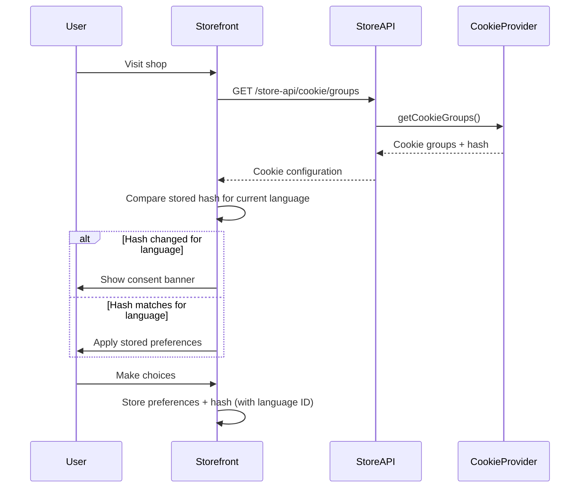

# CONCEPTS ARCHITECTURE

Compiled excerpts from the Shopware Developer Documentation snapshot. Prefer live docs at [developer.shopware.com](https://developer.shopware.com/) when in doubt.

---

## API
**Source:** [concepts/api.md](https://developer.shopware.com/docs/v6.6/concepts/api.md)  
# API

The Shopware API allows developers to interact with and integrate Shopware with other systems and applications. It provides a set of services that enable developers to perform various operations, such as managing products, customers, orders, and shopping carts.The API supports both read and write operations, allowing developers to retrieve information from Shopware and make modifications or additions to the e-commerce platform. By leveraging the Shopware API, developers can extend the functionality of Shopware, integrate it with external systems, and create seamless experiences for managing and operating online stores.

Shopware supports two major functional APIs: the Store API and the Admin API. These APIs serve different purposes. The Store API is designed to interact with the front-end or storefront of a Shopware online store while the Admin API is intended for administrative operations related to managing the back-end of the Shopware platform.

The API documentation provides details on the available endpoints, request/response formats, authentication mechanisms, and data structures. It supports different authentication methods, including token-based authentication and OAuth 2.0, to ensure secure communication between the API client and the Shopware platform.

---

---

## Commerce
**Source:** [concepts/commerce.md](https://developer.shopware.com/docs/v6.6/concepts/commerce.md)  
# Commerce

At core, Shopware is an **ecommerce platform**. If you want to understand the commerce-related concepts of our software, make sure to go here.

::: info
The **Concepts** section does not contain code examples, instead we focus on conveying the concepts and ideas behind the software. If you want more guided, step-by-step tutorials, please head to the [Guides](../../guides/installation/) section.
:::

---

---

## Content
**Source:** [concepts/commerce/content.md](https://developer.shopware.com/docs/v6.6/concepts/commerce/content.md)  
# Content

Shopware 6 has an integrated content management system based upon layouts which is called *Shopping Experiences*. The tool used to compose and manage layouts is part of the [Admin panel](../../framework/architecture/administration-concept) and referred to as *Page Builder*.

---

---

## Cookie Consent Management
**Source:** [concepts/commerce/content/cookie-consent-management.md](https://developer.shopware.com/docs/concepts/commerce/content/cookie-consent-management.md)  
# Cookie Consent Management

## Overview

Shopware provides a cookie consent management system with features designed to support GDPR compliance. The system allows shop administrators and developers to manage cookies transparently and give customers control over their data privacy. It handles cookie categorization, user consent tracking, and automatic re-consent when cookie configurations change.

::: warning
While Shopware provides tools and features to help with GDPR compliance, shop owners are ultimately responsible for ensuring their shop complies with GDPR and other applicable data protection regulations. This includes proper cookie configuration, privacy policies, and legal review of all data processing activities.
:::

::: info
The cookie-hash and re-consent functionality is available starting with Shopware 6.7.3.0.
:::

## How it works

The cookie consent system operates through several integrated components:

1. **Cookie Provider Service**: Collects all cookie definitions from core, plugins, and apps
2. **Store API Endpoint**: Exposes cookie configuration with a configuration hash
3. **Storefront Component**: Manages the cookie consent UI and user preferences
4. **Configuration Hash**: Tracks changes to trigger re-consent when needed

### Cookie Configuration Flow



## Cookie Categories

Cookies in Shopware are organized into four main categories according to GDPR requirements:

### Technically Required

Cookies that are essential for the shop to function (`cookie.groupRequired`). These cookies cannot be disabled by users.

**Examples:**

* Session management
* Shopping cart
* Security tokens
* Language preferences

### Comfort Functions

Cookies that enhance user experience but are not essential for basic functionality (`cookie.groupComfortFeatures`).

**Examples:**

* Video platform cookies (YouTube, Vimeo)
* Social media integrations
* Chat widgets
* Personalized content

### Marketing

Cookies used for marketing and advertising purposes, including tracking user behavior for personalized ads and remarketing (`cookie.groupMarketing`).

**Examples:**

* Marketing pixels (Facebook Pixel, Google Ads)
* Remarketing and advertising cookies
* Conversion tracking
* Affiliate tracking

### Statistics and Tracking

Cookies used for analytics and website optimization purposes (`cookie.groupStatistical`).

**Examples:**

* Google Analytics
* User interaction tracking (Hotjar, Crazy Egg)
* A/B testing
* User behavior analytics

## Configuration Hash Mechanism

The configuration hash is an important feature that helps support GDPR compliance by ensuring users are re-prompted when cookie handling changes.

### Mechanism Details

1. **Hash Generation**: A hash is calculated from all cookie configurations (names, descriptions, expiration times)
2. **Hash Storage**: The hash is stored in the browser as `cookie-config-hash`. The stored value is an object where the language ID is the key and the cookie hash is the value, for example: `{"019ada128cfb711aa7a0d00f476d5961":"998cdcc090e92b3ecdd057241d0fd01f"}`
3. **Change Detection**: On each visit, the current hash is compared with the stored hash for the current language
4. **Re-Consent Trigger**: If hashes differ for the current language, all non-essential cookies are removed and consent is requested again

::: info
**Domain and Language Handling**: Since cookies are stored per domain by the browser, installations using different domains for different languages don't encounter tracking conflicts. The domain itself serves as the primary separator. The language ID within the hash object is specifically designed to address scenarios where multiple languages are served from the same domain, ensuring proper per-language consent tracking.
:::

### When Hash Changes

The configuration hash changes when:

* New cookies are added by plugins/apps
* Existing cookies are modified or removed
* Cookie groups are restructured
* Cookie descriptions or settings change

This ensures users are always informed about changes to cookie handling, maintaining GDPR compliance.

## Cookie Groups vs Individual Cookies

### Individual Cookies

Single cookies that can be accepted or rejected independently.

**Use when:**

* Cookie serves a specific, standalone purpose
* No logical grouping with other cookies
* Maximum granular control needed

### Cookie Groups

Multiple related cookies grouped together for easier management.

**Use when:**

* Multiple cookies serve the same purpose (e.g., video platform)
* Cookies are interdependent
* Simplified user interface is desired

**Example:** YouTube group containing multiple YouTube-related cookies

## Key Cookies Used by the System

The cookie consent system itself uses special cookies:

| Cookie | Purpose | Lifetime |
|--------|---------|----------|
| `cookie-preference` | Stores user's consent choices | 30 days |
| `cookie-config-hash` | Tracks configuration changes per language | 30 days |

### Protected Cookies

Certain cookies are **never removed** by the consent system, even during re-consent:

* `session-*` - Session cookies required for shop functionality
* `timezone` - User's timezone preference

## Technical Implementation

Cookie configurations are defined using structured objects for type safety:

* **`CookieEntry`** - Individual cookie definition
* **`CookieGroup`** - Group of related cookies

This provides better IDE support, type checking, and consistency across implementations.

## Store API Integration

::: info
The Store API endpoint for cookie groups is available starting with Shopware 6.7.3.0.
:::

The cookie consent system exposes its configuration through the Store API endpoint:

**Endpoint:** `GET /store-api/cookie/groups`

This endpoint enables headless implementations, custom frontends, and third-party integrations to retrieve cookie configuration, the configuration hash, and the language ID. The hash is provided as a string, and the language ID is also returned by the endpoint. When stored in the browser's `cookie-config-hash` cookie, both values should be stored as an object where the language ID is the key and the hash is the value, for example: `{"019ada128cfb711aa7a0d00f476d5961":"998cdcc090e92b3ecdd057241d0fd01f"}`

For full API documentation, see the [Store API - Fetch all cookie groups](https://shopware.stoplight.io/docs/store-api/f9c70be044a15-fetch-all-cookie-groups) reference.

## Extension Points

The cookie consent system can be extended in multiple ways:

### For Plugins

Use an event listener to add custom cookies.

### For Apps

Define cookies in your `manifest.xml` file.

### JavaScript Events

React to user consent changes in your custom JavaScript.

## Best Practices

### 1. Categorize Correctly

Place cookies in the appropriate category:

* Only truly essential cookies should be "technically required" (`cookie.groupRequired`)
* User convenience features belong in "comfort functions" (`cookie.groupComfortFeatures`)
* Marketing and advertising cookies belong in "marketing" (`cookie.groupMarketing`)
* Analytics and optimization belong in "statistics and tracking" (`cookie.groupStatistical`)

### 2. Provide Clear Descriptions

Write clear, user-friendly cookie descriptions:

* Explain what the cookie does in simple terms
* Mention what data is collected
* State how long the cookie persists
* Link to privacy policy if relevant

### 3. Set Appropriate Expiration

Choose sensible expiration times:

* Session cookies for temporary data
* Days/weeks for user preferences
* Months/year for long-term settings
* Consider GDPR recommendations

### 4. Handle Consent Changes

Always check consent status before:

* Loading third-party scripts
* Setting marketing or advertising cookies
* Collecting analytics or statistics data
* Storing user behavior data

### 5. Test Re-Consent Flow

When updating cookie configurations:

* Test that hash changes trigger re-consent
* Verify non-essential cookies are removed
* Check that protected cookies remain
* Ensure UI displays correctly

## Features Supporting GDPR Compliance

Shopware's cookie consent system includes several features designed to help shop owners meet GDPR requirements:

* ✅ **Opt-in by default** - Users must actively consent (no pre-checked boxes)
* ✅ **Granular control** - Users can accept/reject individual categories
* ✅ **Re-consent on changes** - Automatic re-prompting when configuration changes
* ✅ **Clear information** - Transparent cookie descriptions and purposes
* ✅ **Easy withdrawal** - Users can change preferences at any time
* ✅ **Configuration tracking** - Hash mechanism ensures change detection
* ✅ **Documented lifecycle** - Full audit trail of cookie changes

::: info
These features provide technical support for GDPR compliance, but shop owners must also ensure they have proper legal documentation (privacy policy, terms of service), data processing agreements, and regular compliance audits. Consult with legal counsel to ensure full compliance with GDPR and other applicable regulations.
:::

---

---

## Shopping Experiences (CMS)
**Source:** [concepts/commerce/content/shopping-experiences-cms.md](https://developer.shopware.com/docs/v6.6/concepts/commerce/content/shopping-experiences-cms.md)  
# Shopping Experiences (CMS)

Shopware comes with an extensive CMS system referred to as *Shopping Experiences* built upon pages or layouts, which can be reused and dynamically hydrated based on their assignments to categories or other entities.

In the following concept, we will take a look at the following aspects:

* Structure of CMS pages
* Hydration of dynamic content
* Separation of content and presentation

We will start by taking a rather abstract approach to content organization and later translate that into more specific applications.

## Structure

Every CMS page or layout (they are really technically the same) is a hierarchical structure made of sections, blocks, elements, and additional configurations within each of those components. An exemplary CMS page printed in JSON would look similar to this:

```json
{
  cmsPage: {
      sections: [{
          blocks: [{
              slots: [{
                  slot: "content",
                  type: "product-listing",
                  /* ... */
              }]
          }, /* ... */]
      }, /* ... */]
  }
}
```

It is a tree where the root node is a **page**. Each page can have multiple **sections**. Each section can contain multiple **blocks**. Each block can have zero or more **slots** where each slot contains exactly one **element**. Easy as that.

Let's go through these structural components in a top-down approach, starting from the biggest element:

### Page

A page serves as a wrapper and contains all content information as well as a `type` which denotes whether it serves as a

* Category/Listing page
* Shop page
* Static page
* Product pages

### Section

Defines a horizontal container segment within your page which can be either:

* Two-Columns which we refer to as `sidebar` and `content` or
* A single column

A section contains blocks that are usually stacked upon each other.

### Block

A block represents a unit usually spanning an entire row which can provide custom layout and stylings. For UI purposes, blocks are clustered into categories such as:

* Text
* Images
* Commerce
* Video

Each block can contain none up to multiple slots. A slot has a name and is just a container for one element. To be more precise, take the following block as an example:

```javascript
block: {
    type: "text-hero",
    slots: [{
        type: "text",
        slot: "content",
        config: {
            content: {
                source: "static",
                value: "Hello World"
            }
        },
    }]
}
```

It is pretty clear what this will look like. There is a block called `text-hero`  containing the text "Hello World". The block is of `type: "text-hero"` and `"type": "text"` here in the nested structure, which displays the text.

Let's take a look at another example:

```javascript
block: {
    type: "text-hero",
    slots: [{
        type: "image",
        slot: "content",
        config: {
            media: {
                source: "static",
                value: "ebc314b11cb74c2080f6f27f005e9c1d"
            }
        },
        data: {
            media: {
                url: "https://my-shop-host.com/media/ab/cd/ef/image.jpg"
            }
        }
    }]
}
```

Here, we still have the `text-hero` block, but it contains an image. That is due to the internal structure of our CMS and the generic nature of blocks. The slots defined by a block are abstract. In the examples shown above, the `text-hero` block only contains one slot, named `content`.

### Elements

Elements are the "primitives" in our tree hierarchy of structural components. Elements have no knowledge of their context and usually just contain very little markup. Ultimately and most importantly, elements are rendered inside the slots of their "parent" blocks.

Types of elements comprise:

* text,
* image,
* product-listing,
* video and more

### Configuration

Every component (section, block, element) contains a configuration that specifies detailed information about how it's supposed to be rendered. Such configuration can contain:

* Product ID
* Mapped field (e.g. category.description)
* Static values
* CSS config (properties, classes)

Static values will be passed to the page as-is. Mapped fields will be resolved at runtime based on the dynamic content hydration - described subsequently.

## Hydration of dynamic content

Whereas the structure of a CMS page remains somewhat static, its content can be dynamic and context-aware. This way, you can, for example, reuse the same layout for multiple category pages where product listing, header image, and description are always loaded based on the category configuration.

### Resolving process

The following diagram illustrates how that works using the example of a category:


Let's go through the steps one by one.

1. **Load category**: This can be initiated through an API call or a page request (e.g., through the Storefront).
2. **Load CMS layout**: Shopware will load the CMS layout associated with the category.
3. **Build resolver context**: This object will be passed on and contains information about the request and the sales channel context.
4. **Assemble criteria for every element**: Every CMS element within the layout has a `type` configuration which determines the correct page resolver to resolve its content. Together with the **resolver context**, the resolver is able to resolve the correct criteria for the element. All criteria are collected in a criteria collection. Shopware will optimize those criteria (e.g. by splitting searches from direct lookups or merging duplicate requests) and execute the resulting queries.
5. **Override slot configuration**: The resulting configuration determine the ultimate configuration of the slots that will be displayed, so Shopware will use it to override the existing configuration.
6. **Respond with CMS page**: Since the page data is finally assembled, it can be passed on to the view layer where it will be interpreted and displayed.

### Extensibility

As you can see, the **element resolvers** play a central role in the whole process of getting the configuration ( by extension, content) of CMS elements.

Shopware allows registering custom resolvers by implementing a corresponding interface, which dictates the following methods:

* `getType() : string` -returns the matching type of elements
* `collect(CmsSlot, ResolverContext) : CriteriaCollection`- prepares the criteria object
* `enrich(CmsSlot, ResolverContext, ElemetDataCollection) : void` - performs additional logic on the data that has been resolved

## Separation of content and presentation

The CMS is designed in a way that doesn't fix it to a single presentation channel (also referred to it as "headless"). What at first might seem like an unnecessary abstraction turns out to give us a lot of flexibility. Each presentation channel can have its own twist on interpreting the content and displaying it to the user. A browser can leverage the [Shopware Storefront](../../../guides/plugins/plugins/storefront/) and display the HTML or use the resulting markup from a single page application that interprets the API responses. A native mobile application can strip out unnecessary blocks and only display texts and images as view components. A smart speaker simply reads out the content of elements with the `voice` type.

By default, Shopware provides the server-side rendered Storefront as a default presentation channel, but [Composable Frontends](../../../../frontends) also supports CMS pages. Using the CMS through the API, you will have full flexibility in how to display your content.

::: info
All this comes at a price: The admin preview of your content is only as representative of your content presentation as your presentation channel resembles it. **A major implication for headless frontends.** For that reason, Shopware PWA has functionality built into the plugin, allowing you to preview content pages in the PWA.
:::

---

---

## Shopping Experiences (CMS)
**Source:** [concepts/commerce/core/shopping-experiences-cms.md](https://developer.shopware.com/docs/v6.4/concepts/commerce/core/shopping-experiences-cms.md)  
# Shopping Experiences (CMS)

Shopware comes with an extensive CMS system (referred to as "Shopping Experiences") built upon pages or layouts which can be reused and dynamically hydrated based on their assignments to categories or other entities.

In the following concept we'll take a look at the following aspects:

* Structure of CMS pages
* Hydration of dynamic content
* Separation of content and presentation

We'll start by taking a rather abstract approach to content organization and later translate that into more specific applications.

## Structure

Every CMS page or layout (they're really technically the same) is a hierarchical structure made of sections, blocks, elements and additional configuration within each of those components. An exemplary CMS page printed in JSON would look similar to this:

```json
{
  cmsPage: {
      sections: [{
          blocks: [{
              slots: [{
                  slot: "content",
                  type: "product-listing",
                  /* ... */
              }]
          }, /* ... */]
      }, /* ... */]
  }
}
```

It is a tree where the root node is a **page**. Each page can have multiple **sections**. Each section can contain multiple **blocks**. Each block can have zero or more **slots** where each slot contains exactly one **element**. Easy as that.

Let's go through these structural components step by step. We do this in a top-down manner, starting from the biggest element or the *tree root*:

### Page

A page serves as a wrapper and contains all content information as well as a `type` which denotes whether it serves as a

* Category / Listing page
* Shop page
* Static page
* (at some point we will support CMS for *Product pages* as well)

### Section

Defines a horizontal container segment within your page which can be either:

* Two-Columns which we refer to as `sidebar` and `content` or
* A single column

A section contains blocks which are usually stacked upon each other.

### Block

A block represents a unit usually spanning an entire row which can provide custom layout and stylings. For UI purposes blocks are clustered into categories such as:

* Text
* Images
* Commerce
* Video

Each block can contain none up to multiple **slots**. A slot has a name and is just a container for one element. To be more clear, I will use an example - take the following block:

```javascript
block: {
    type: "text-hero",
    slots: [{
        type: "text",
        slot: "content",
        config: {
            content: {
                source: "static",
                value: "Hello World"
            }
        },
    }]
}
```

Pretty clear what this will look like - we will have a hero block, containing the text "Hello World". But having `type: "text-hero"` and `"type": "text"` in this nested structure might feel somewhat redundant you might think - of course there will be a text shown.

Let's take a step back and look at another example:

```javascript
block: {
    type: "text-hero",
    slots: [{
        type: "image",
        slot: "content",
        config: {
            media: {
                source: "static",
                value: "ebc314b11cb74c2080f6f27f005e9c1d"
            }
        },
        data: {
            media: {
                url: "https://my-shop-host.com/media/ab/cd/ef/image.jpg"
            }
        }
    }]
}
```

Well, now we still have the `text-hero` block but suddenly it contains an image. That is due to the internal structure of our CMS and the generic nature of blocks. The **slots** defined by a block are abstract. In the examples shown above, the text-hero block only contains one slot, named `content`.

### Elements

Elements are the "primitives" in our tree hierarchical of structural components. Elements have no knowledge of their context and usually just contain very little markup. Ultimately and most importantly, elements are rendered inside the slots of their "parent" blocks.

Types of elements comprise

* text
* image
* product-listing
* video
* and more...

### Configuration

Every component (section, block, element) contains a configuration which specifies detailed information about how it's supposed to be rendered. Such configuration can contain:

* Product ID
* Mapped field (e.g. category.description)
* Static values
* CSS config (properties, classes)

Static values will be passed to the page as-is. Mapped fields will be resolved at runtime based on the dynamic content hydration - described subsequently.

## Hydration of dynamic content

Whereas the structure of a CMS page remains somewhat static, its content can be dynamic and context-aware. This way you can, for example, reuse the same layout for multiple category pages where product listing, header image and description are always loaded based on the category configuration.

### Resolving process

The following diagram illustrates how that works using the example of a category:


Let's go through the steps one by one.

1. **Load category** This can be initiated through an API call or a page request (e.g. through the Storefront).
2. **Load CMS layout** Shopware will load the CMS layout associated with the category.
3. **Build resolver context** This object will be passed on and contains information about the request and the sales channel context.
4. **Assemble criteria for every element** Every CMS element within the layout has a `type` configuration which determines the correct page resolver to resolve its content. Together with the **resolver context** the resolver is be able to resolve the correct criteria for the element. All criterias are collected in a criteria collection. Shopware will optimize those criterias (e.g. by splitting searches from direct lookups or merging duplicate requests) and execute the resulting queries.
5. **Override slot configuration** The resulting configuration determine the ultimate configuration of the slots that will be displayed, so Shopware will use it to override the existing configuration.
6. **Respond with CMS page** Since the page data is finally assembled, it can be passed on to the view layer where it will be interpreted and displayed.

### Extensibility

As you can see, the **element resolvers** play a central role in the whole process of getting the configuration (and by extension, content) of CMS elements.

Shopware allows registering custom resolvers by implementing a corresponding interface, which dictates the following methods:

* `getType() : string` returns the matching type of elements
* `collect(CmsSlot, ResolverContext) : CriteriaCollection`prepares the criteria object
* `enrich(CmsSlot, ResolverContext, ElemetDataCollection) : void` performs additional logic on the data that has been resolved

## Separation of content and presentation

The CMS is designed in a way that doesn't fix it to a single presentation channel (fancy people refer to it as "headless"). What at first might seem like an unnecessary abstraction turns out to give us a lot of flexibility. Each presentation channel can have its own twist on interpreting the content and displaying it to the user. A browser can leverage the [Shopware Storefront](../../../guides/plugins/plugins/storefront/) and display the HTML or use the resulting markup from a single page application that interprets the API responses. A native mobile application can strip out unnecessary blocks and only display texts and images as view components. A smart speaker simply reads out the content of elements with the `voice` type. You name it...

By default, Shopware provides the server-side rendered Storefront as a default presentation channel, but [Shopware PWA](../../../products/pwa) also support CMS pages. Using the CMS through the API you'll have full flexibility of how to display your content.

::: info
All this comes at a price: The admin preview of your content is only as representative of your content presentation as your presentation channel resembles it. **A major implication for headless frontends.** For that reason, Shopware PWA has a functionality built into the plugin, which allows you to preview content pages right in the PWA.
:::

## Further reading

---

---

## Extensions
**Source:** [concepts/extensions.md](https://developer.shopware.com/docs/v6.6/concepts/extensions.md)  
# Extensions

In order to provide users (i.e., developers) with a clear abstraction, Shopware consists of a Core designed in a way that allows for a lot of extensibility without sacrificing maintainability or structural integrity. Some of those concepts were already introduced in the [Frameworks](../framework/) section.

## Apps


Starting with Shopware 6.4.0.0, we introduced a new way to extend Shopware using the newly created app system. Apps are not executed within the process of the Shopware Core but are notified about events via webhooks, which they can register. They can modify and interact with Shopware resources through the [Admin REST API](https://shopware.stoplight.io/docs/admin-api/twpxvnspkg3yu-quick-start-guide).

## Plugins


Plugins are executed within the Shopware Core process and can react to events, execute custom code or extend services. They have direct access to the database and guidelines are in place to ensure update-compatibility, such as a service facade or database migrations.

::: warning
**Plugins and Shopware cloud** - Due to their direct access to the Shopware process and the database, plugins are not supported by Shopware cloud.
:::

## Start Coding

Refer to Guides section to get an [overview of both extension systems and how they differ](../../guides/plugins/overview).

---

---

## Apps
**Source:** [concepts/extensions/apps-concept.md](https://developer.shopware.com/docs/v6.6/concepts/extensions/apps-concept.md)  
# Apps

The app system allows you to extend and modify the functionality and appearance of Shopware. It leverages well defined extension points you can hook into to implement your specific use case.

The app system is designed to be decoupled from Shopware itself. This has two great advantages:

1. **Freedom of choice:** You need to understand only the interface between Shopware and your app to get started with developing your own app. You don't need special knowledge of the inner workings and internal structure of Shopware itself. Additionally, you have the freedom to choose a programming language or framework of your choice to implement your app. This is achieved by decoupling the deployment of Shopware itself and your app and by using the Admin API and webhooks to communicate between Shopware and your app instead of using programming language constructs directly.
2. **Fully cloud compatible:** By decoupling Shopware and your app, your app is automatically compatible for use in a multi-tenant cloud system. Therefore your app can be used within self-hosted shops and shops on [Shopware SaaS](../../products/saas).

The central interface between your app and Shopware is defined by a dedicated manifest file. The manifest is what glues Shopware and your app together. It defines your app's features and how Shopware can connect to it. You can find more information about how to use the manifest file in the [App base Guide](../../guides/plugins/apps/app-base-guide).

## Communication between Shopware and your app

Shopware communicates with your app only exclusively via HTTP-Requests. Therefore you are free to choose a tech stack for your app, as long as you can serve HTTP-Requests. Shopware will notify you of events happening in the shop that your app is interested in by posting to HTTP-Endpoints that you define in the manifest file. While processing these events, your app can use the Shopware API to get additional data that your app needs. A schematic overview of the communication may look like this:


To secure this communication, a registration handshake is performed during the installation of your app. During this registration, it is verified that Shopware talks to the right app backend server, and your app gets credentials used to authenticate against the API. You can read more on the registration workflow in the [App base guide](../../guides/plugins/apps/app-base-guide).

::: info
Notice that this is optional if Shopware and your app don't need to communicate, e.g., because your app provides a [Theme](apps-concept).
:::

## Modify the appearance of the Storefront

Your app can modify the Storefront's appearance by shipping your Storefront assets (template files, javascript sources, SCSS sources, snippet files) alongside your manifest file. You don't need to serve those assets from your external server, as Shopware will rebuild the Storefront upon the installation of your app and will consider your modifications in that process. Find out more about modifying the appearance of the Storefront in the [App Storefront guide](../../guides/plugins/apps/storefront/)

## Integrate payment providers

::: info
This functionality is available starting with Shopware 6.4.1.0.
:::

Shopware provides functionality for your app to be able to integrate payment providers. You can use the synchronous payment to provide payment with a provider that does not require any user interaction, for which you can choose a simple request for approval in the background. You can use an asynchronous payment if you would like to redirect a user to a payment provider. Your app, therefore, provides a URL for redirection. After the user returns to the shop, Shopware will verify the payment status with your app. Find out more about providing payment endpoints in the [App payment guide](../../guides/plugins/apps/payment).

## Execute business logic inside Shopware with App Scripts

::: info
This functionality is available starting with Shopware 6.4.8.0.
:::

[App scripts](../../guides/plugins/apps/app-scripts/) allow your app to execute custom business logic inside the Shopware execution stack. This allows for new use cases, e.g., if you need to load additional data that should be rendered in the Storefront or need to manipulate the cart.

## Add conditions to the Rule Builder

::: info
This functionality is available starting with Shopware 6.4.12.0.
:::

Your app may introduce custom conditions for use in the [Rule builder](../framework/rules). For additional information refer to [Add custom rule conditions](../../guides/plugins/apps/rule-builder/add-custom-rule-conditions) from the guides.

---

---

## Plugins
**Source:** [concepts/extensions/plugins-concept.md](https://developer.shopware.com/docs/v6.6/concepts/extensions/plugins-concept.md)  
# Plugins

Plugins in Shopware are essentially an extension of [Symfony bundles](https://symfony.com/doc/current/bundles.html#creating-a-bundle). Such bundles and plugins can provide their own resources like assets, controllers, services, or tests. To reduce friction when programming plugins for Shopware, there is an abstract [Base class](../../guides/plugins/plugins/plugin-base-guide#create-your-first-plugin), which every plugin extends from the plugin base class. In this class, there are helper methods to initialize parameters like the plugin's name and root path in the dependency injection container. Also, each plugin is represented as a Composer package and may for example, define dependencies this way.

Plugins are deeply integrated into Shopware. You can do nearly everything with plugins, like "new User Provider" or "custom Search Engine".

::: warning
Plugins are not compatible with Shopware cloud stores. To extend Shopware cloud stores, you need an [App](apps-concept).
:::

Learn more about plugins from the [Plugin base guide](../../guides/plugins/plugins/plugin-base-guide)

---

---

## Framework
**Source:** [concepts/framework.md](https://developer.shopware.com/docs/v6.6/concepts/framework.md)  
# Framework

Shopware 6 is not only an ecommerce platform but also a **framework** for developing highly customized shop infrastructures. This section will introduce some of the core concepts that will help you fully understand and leverage Shopware 6's capabilities.

---

---

## Architecture
**Source:** [concepts/framework/architecture.md](https://developer.shopware.com/docs/v6.6/concepts/framework/architecture.md)  
# Architecture

On a high level, Shopware consists of multiple modules that separate the entire code base into logical units. Some modules are independent, and some depend on others.

---

---

## Administration
**Source:** [concepts/framework/architecture/administration-concept.md](https://developer.shopware.com/docs/v6.6/concepts/framework/architecture/administration-concept.md)  
# Administration

In this article, you will get to know the Administration component and learn a lot of its main concepts. Along the way, you  will find answers to the following questions:

* What is the Administration, and what is its main purpose?
* Which technologies are being used?
* How is the Administration structured?
* How is the Administration implemented inside the Platform?
* How is the Administration connected to other components?
* Which parts of the Core are being used?
* What are Modules, Pages, and Components?
* How is the Administration handling Inheritance & ACL?

## Introduction

The Administration component is a Symfony bundle that contains a Single Page Application (SPA) written in JavaScript. It conceptually sits on top of the Core - similar to the [Storefront](storefront-concept) component. The SPA itself provides a rich user interface on top of REST-API-based communication. It communicates with the Core component through the Admin API and is an headless application build on custom components written in [Vue.js](https://vuejs.org/). Similar to the frameworks being used in the Storefront component, the Administration component uses SASS for styling purposes and [Twig.js](https://github.com/twigjs/twig.js/wiki) to offer templating functionalities. By default, Shopware 6 uses the [Vue I18n plugin](https://kazupon.github.io/vue-i18n/) in the Administration to deal with translation. Furthermore, [Webpack](https://webpack.js.org/) is being used to bundle and compile the SPA.

## Main concerns

As mentioned previously, the Administration component provides a SPA that communicates with the Core through the [Admin API](../../../concepts/api/admin-api). To summarize, its main concern is to provide a UI for all administrative tasks for a shop owner in Shopware. To be more precise, it does not contain any business logic. Therefore, there is no functional layering but a flat list of modules structured along the Core component and containing Vue.js web components. Every single communication with the Core can, e.g., be inspected throughout the network activities of your browser's developer tools.

Apart from the arguably most central responsibility of creating the UI itself, which can be reached through `/admin`. The Administration components implement a number of cross-cutting concerns. The most important are:

* **Providing inheritance**: As Shopware 6 offers a flexible extension system to develop own apps, plugins, or themes,  one can override or extend the Administration to fit needs. More information can be found in the [inheritance](administration-concept#inheritance) chapter of this article.

* **Data management**: The Administration displays entities of the Core component and handles the management of this data. So, of course, REST-API access is an important concern of [Pages and views](administration-concept#modules-and-their-components) where necessary. You will find many components working with in-memory representations of API-Data.

* **State management**: In contrast to the Core (Backend), the Administration is a long-running process contained in the browser. Proper state management is key here. There is a router present handling the current page selection. View and component rendering is done locally in relation to their parents. Therefore, each component manages the state of its subcomponents.

## Structure

The main Vue.js application is wrapped inside a Symfony bundle. You will find the specific SPA sources inside the Administration component in a specific sub-directory of `shopware/src/Administration`. Therefore, the SPA's main entry point is: `./Resources/app/administration`. Everything else inside `shopware/src/Administration` can be seen as a wrapped configuration around the SPA. This bundle's main concern is to set up the initial Routing (`/admin`) and the Administration's main template file, which initializes the SPA (`./Resources/views/administration/index.html.twig`) and to provide translation handling.

The `src` directory of the SPA below is structured along the three different use cases the Administration faces - provide common functionality, an application skeleton, and modules.

```bash
<shopware/src/Administration/Resources/app/administration/src/>
|- app
|- core
|- module
```

* `app`: Contains the application basis for the Administration. Generally, you will find framework dependant computational components here.
* `core`: Contains the binding to the Admin API and services.
* `module`: UI and state management of specific view pages, structured along the Core modules. More information on this is detailed below.

## Modules and their components

One module represents a navigation entry in the Administrations main menu. Since the Administration is highly dependent on the Shopware ecommerce Core, the module names reappear in the Administration, though in a slightly different order. The main building block, which the Administration knows, is called `component`, adjacent to web components.

A `component` is the combination of styling, markup, and logic. What a component does will not surprise you if you are already familiar with the [MVC pattern](https://en.wikipedia.org/wiki/Model%E2%80%93view%E2%80%93controller). The role of the model and controller collapses into a single class. The components Twig.js template is generally rendered by a JavaScript (`index.js`) file and includes styling from an SCSS file. A template file also notifies the JavaScript, which then reacts to specific (user) interactions. Furthermore, components can be and often are nested. Our [Component library](https://component-library.shopware.com/) will also give you an overview of our default components.

### General module structure

A `page` represents the entry point or the page that needs to be rendered and encapsulates views. A `view` is a subordinate part of the page that encapsulates components. A `component` can itself encapsulate different components. From this level on, there is no distinction in the directory structure made.

At least one `page` is mandatory in each module. Though views and components can be present in the module, a vast default component library is present to help with default cases.

```bash
|- page1
  |- view1
    |- component1
    |- component2
      |- subcomponent1
      |- …
  |- view2
    |- component3
    |- …
```

### Order module

Having a look at a more practical example, one can look closer at the order module. Typically, you will find this structure alongside other modules, especially when creating pages or views for creating/editing, listing, or viewing a specific entity. Refer to the [Add custom module](../../../guides/plugins/plugins/administration/add-custom-module) article if you want to learn more about adding your custom module with a Shopware plugin.

```bash
<shopware/src/Administration/Resources/app/administration/src/module/sw-order/>
|- acl
|- component
  |- sw-order-address-modal
  |- …
|- page
  |- sw-order-create
  |- sw-order-detail
  |- sw-order-list
|- snippet  
|- state  
|- view
  |- sw-order-create-base
  |- sw-order-details-base
|- index.js
```

## Inheritance

To add new functionality or change the behavior of an existing component through plugins, you can either override or extend a component. The difference between the two methods is `Component.extend()` method creates a new component and `Component.override()` method overwrites the previous behavior of the component.

Within plugins, you do have the following options when it comes to adjusting existing components:

* Override a component's logic
* Extend a component's logic
* Customize a component template with Twig.js
* Extending methods and computed properties

You will find more information about [customizing components](../../../guides/plugins/plugins/administration/customizing-components) of the Administration in the guide.

## ACL in the Administration

The Access Control List (ACL) in Shopware ensures that by default, data can only be created, read, updated, or deleted ( CRUD), once the user has specific privileges for a module. Additionally, one can set up custom roles in the Administrations UI or develop individual privileges with plugins. These roles have finely granular rights, which every shop operator can set up himself and be assigned to users. By default, a module of the Administration has a directory called `acl` included. In this directory, one will find a specific mapping of privileges (permissions for roles; additional permissions) for the default roles: `viewer`, `editor`, `creator`, and `deleter`.

For more information, refer to [Adding permissions](../../../guides/plugins/plugins/administration/add-acl-rules) article.

---

---

## Storefront
**Source:** [concepts/framework/architecture/storefront-concept.md](https://developer.shopware.com/docs/v6.6/concepts/framework/architecture/storefront-concept.md)  
# Storefront

In this article, you will get to know the Storefront component and learn a lot of its main concepts. Along the way, you will find answers to the following questions:

* What is the Storefront component & what is its main purpose?
* What technologies are being used?
* How is the Storefront structured?
* Which parts of other Platform components are being used?
* How does the composite data handling work?
* What is the definition and main purpose of Pages, Pagelets, Controllers, and their corresponding Templates?
* How is the Storefront handling translations?

## Introduction

The Storefront component is a frontend written in PHP. It conceptually sits on top of the Core, similar to the [Administration](administration-concept) component. As the Storefront can be seen as a classical PHP application, it makes use of HTML rendering, JavaScript, and a CSS preprocessor. The Storefront component uses Twig as the templating engine and SASS for styling purposes. The foundation of the Storefront template is based on the Bootstrap framework and, therefore, fully customizable.

## Main concerns

The main concerns that the Storefront component has are listed below. Furthermore, we are diving deeper into these in the following chapters.

* Creating Pages and Pagelets
* Mapping requests to the Core
* Rendering templates
* Provide theming

Contrary to API calls that result in single resource data, a whole page in the Storefront displays multiple different data sets on a single page. Think of partials, which lead to a single page being displayed. Imagine a page that displays the order overview in the customer account environment. There are partials that are generic and will be displayed on almost every Page. These partials include - for example, Header and Footer information wrapped into a `GenericPage` as `Pagelets` (`HeaderPagelet`, `FooterPagelet`). This very generic Page will later be enriched with the specific information you want to display through a separate loader (e.g. a list of orders).

To achieve getting information from a specific resource, the Storefront's second concern is to map requests to the Core. Internally, the Storefront makes use of the [Store API](../../api/store-api) routes to enrich the Page with additional information, e.g., a list of orders, which is being fetched through the order route. Once all needed information is added to the Page, the corresponding page loader returns the Page to a Storefront controller.

Contrary to the Core, which can almost completely omit templating in favor of JSON responses, the Storefront contains a rich set of Twig templates to display a fully functional shop. Another concern of the Storefront is to provide templating with Twig. The page object, which was enriched beforehand, will later be passed to a specific Twig page template throughout a controller. A more detailed look into an example can be found in [Composite data handling](storefront-concept#composite-data-handling).

Last but not least, the Storefront not only contains static templates but also includes a theming engine to modify the rendered templates or change the default layout programmatically with your own [Themes](../../../guides/plugins/themes/) or [Plugins](storefront-concept).

## Structure

Let's have a look at the Storefront's general component structure. When opening this directory, you will find several sub-directories, and a vast part of the functionality of the Storefront component includes templates (`./Resources`). But besides that, there are other directories worth having a look at:

```bash
<Storefront>
|- Controller
|- DependencyInjection
|- Event
|- Framework
|- Migration
|- Page
|- Pagelet
|- Resources
|- Test
|- Theme
|- .gitignore
|- composer.json
|- phpunit.xml.dist
|- README.md
|- Storefront.php
```

Starting at the top of this list, you will find all Storefront controllers inside the `Controller` directory. As said beforehand, a page is being built inside that controller with the help of the corresponding page loaders, Pages, Pagelets, and events, which you will find in the directories: `Pages`, `Pagelets`, and their sub-directories. Each controller method will also give detailed information about its routing with the help of attributes. The directory `DependencyInjection` includes all dependencies which are used in the specific controllers, whereas the `Event` directory includes route request events, and the `Framework` directory, amongst other things, also includes the Routing, Caching, and furthermore. `Migration` and `Test` obviously include migrations and tests for the Storefront component (e.g., tests for each Storefront controller).

As the Storefront theme uses Bootstrap, the template structure inside `./Resources` is a derivative of the Bootstrap starter template. Besides using Twig as the templating engine and SASS as the CSS preprocessor, we are also using Webpack for bundling and transpiling purposes. This templating directory structure is considered the best practice. If you are interested in developing your own themes or plugins, this section will give more information.

## Composite data handling

Composite data loading describes the process of preparing and fetching data for a whole template page worth of content. As a web application, the page rendering process is a central concern of the Storefront. Contrary to solutions through `postDispatch`-Handling or `lazy loading` from templates, the controller actions of the Storefront do a full lookup and handle data loading transparently and fully. The Storefront provides a general solution for this problem - the Page System.

### Pages and Pagelets

The pages in the Storefront component can roughly be categorized into Pages and Pagelets. Although functionally identical, they represent different usages of Page's data. A Page is generally rendered into a full template, whereas a Pagelet is either a part of a Page or accessible through an XHR route, sometimes even both.

A single Page is always a three class namespace:

* The Page-Struct (`GenericPage`) - represents the data
* The PageLoader (`PageLoaderInterface`) - handles the creation of page structs
* The PageEvent (`NestedEvent`) - adds a clean extension point to the pages

### Example: Composition of the account order page

Referring to the example described in the [main concerns chapter](storefront-concept#main-concerns), have a detailed look at the composition of the Storefronts `AccountOrderPage` with Header and Footer information. The composition is handled through the page loaders themselves by triggering the loading of associated data internally. The following example will also be used for any other Page being displayed on the Storefront.

To describe how the composition of the Page works, first get to know what the result of the composition should be.

* By calling a specific route (e.g. `/account/order`), one should receive a specific page in the Storefront.
* This page consists of generic information (e.g. Header, Footer) and detailed information (e.g. a list of orders).
* Detailed information should be fetched throughout the Core component to make use of the [Store API routes](../../api/store-api).

The best entry point to give you a good understanding of how the composition works is the corresponding controller. In our case, it is the `AccountOrderController`. The main and only task of the controller is to assign a page struct to a variable, which will later be passed to a Twig template. The Page is received by the specific `AccountOrderPageLoader`. Additionally, the method attributes of the controller also set routing information like path, name, options, and methods.

Speaking of the page loader (`AccountOrderPageLoader`), which returns the page (`AccountOrderPage`), you will see that we are doing the composition here. At first, a generic page is created by using the `GenericPageLoader`. As described above, this generic Page includes information, which is generic like Header, Footer, and Meta information. This information is wrapped inside our `Pagelets` and displays a specific part of the Page.

Later, the `AccountOrderPage` is created from the generic Page because we also would like to add more information to this Page. Per definition, the `AccountOrderPage` can set and get a list of orders we can receive by calling a Store API route through the `OrderRoute` of our Core component. That said, we make sure that our Storefront uses the same data as we would use by calling the API directly, which is a big advantage.

Once we have set all the necessary information to our page (`AccountOrderPage`) in our page loader (`AccountOrderPageLoader`), we are making usage of our event dispatcher to throw a `PageLoadedEvent`. For each Page, there should be a specific event, which will be thrown to ensure extensibility throughout plugins (`AccountOrderPageLoadedEvent`).

To summarize the composition of a page, have a look at this diagram:


## Translations

Extending or adjusting a **translation** in Shopware 6 can be done by adding your own snippets inside a plugin. Besides that, there is also a set of translations inside our default Storefront component. We have decided to save snippets as JSON files, so it is easy to structure and find snippets you want to change. However, when using pluralization and/or variables, you can expect slight differences between snippets in the Administration and the Storefront. In theory, you can place your snippets anywhere as long as you load your JSON files correctly. However, we recommend that you mirror the core structure of Shopware.

::: info
Storefront snippets can be found in `platform/src/Storefront/Resources/snippet`.
:::

Inside that directory, you will find a specific sub-directory for each language, e.g., `de_DE` following the ISO standard. The localization is done via the exact ISO. In addition to the language, the country of destination is also supplied. By default, two Storefront translations are provided: `de_DE` and `en_GB`. There are, of course, language plugins for other locales available. Inside these JSON files, you will find a simple translation and the possibility to work with variables and pluralization, which are wrapped with the `%` character. The reference of a translated value is used inside our Twig templates by calling the Twig function `trans` and working with interpolations ( e.g. `{{ "general.homeLink"|trans }}`).

---

---

## Elasticsearch
**Source:** [concepts/framework/elasticsearch.md](https://developer.shopware.com/docs/v6.6/concepts/framework/elasticsearch.md)  
# Elasticsearch

Elasticsearch is a NoSQL Database focused on search capabilities to act as a search engine.
The Shopware implementation of Elasticsearch provides an integrated way to improve the performance of product and category searches.
To use Elasticsearch for your shop, take a look at our [Elasticsearch guide](../../guides/hosting/infrastructure/elasticsearch/elasticsearch-setup)

## Concept

### Enabling Elasticsearch for your search

Elasticsearch is only used in searches that are explicitly defined.
This is by default set to the `ProductSearchRoute`, `ProductListingRoute`, and `ProductSuggestRoute`.
To use Elasticsearch on your own searches, make sure to add the Elasticsearch aware state to your criteria.

::: info
If the Elasticsearch query fails, the data is loaded using MySQL. You can disable this behavior by setting the environment variable `SHOPWARE_ES_THROW_EXCEPTION=1`
:::

```php
$criteria = new \Shopware\Core\Framework\DataAbstractionLayer\Search\Criteria();
$context = \Shopware\Core\Framework\Context::createDefaultContext();
// Enables Elasticsearch for this search
$context->addState(\Shopware\Core\Framework\Context::STATE_ELASTICSEARCH_AWARE);

$repository->search($criteria, $context);
```

### ElasticsearchDefinition

To provide Elasticsearch for an entity, a corresponding `ElasticsearchDefinition` needs to be added. Shopware has a definition for the product entity called `ProductElasticsearchDefinition`.
This definition defines the fields provided to Elasticsearch and how they are aggregated.

### ElasticsearchEntitySearcher

The `ElasticsearchEntitySearcher` decorates the `EntitySearcher` to map the entity search to the Elasticsearch structure.
The `ElasticsearchEntitySearcher` returns an `IdSearchResult` hydrated by the `ElasticsearchEntitySearchHydrator` as the `EntitySearcher` does, and this result is used to read the found ids from the database.

### ElasticsearchEntityAggregator

The `ElasticsearchEntityAggregator` does the same as the `ElasticsearchEntitySearcher` for aggregations.

### CriteriaParser

The `CriteriaParser` parses the criteria to an Elasticsearch specific notation.

### ProductSearchBuilder

The product search has a special `ProductSearchBuilder` in the core, and so has the Elasticsearch extension, a corresponding extension for the `ProductSearchBuilder`.
This extension matches the queries of the core `ProductSearchBuilder` to the Elasticsearch notation.

### ProductUpdater

The `ProductUpdater` listens to the `ProductIndexerEvent` and triggers the `ElasticsearchIndexer` on changes to a `ProductEntity`.

## Commands

### es:index:cleanup

The command `es:index:cleanup` deletes outdated Elasticsearch indexes.
The parameter `-f` will skip the confirmation.

### es:create:alias

The command `es:create:alias` refreshes the current Elasticsearch index and sets the alias to the index name without the timestamp (which will make this index the active index).
This will happen automatically when a new index is published, so this command can force the alias creation for testing purposes or if something goes wrong.

### es:index

The command `es:index` re-indexes all configured entities to Elasticsearch.

### es:reset

The `es:reset` command resets all active indices with their respective prefix (`SHOPWARE_ES_INDEX_PREFIX`) in the .env file and clears the queue. This command should only be used if an index is corrupted or needs to be set up from scratch. If multiple Shopware instances are accessing the same Elasticsearch Host, you should consider changing the prefix.

### es:status

The command `es:status` returns the status of all current Elasticsearch indices.

### es:test:analyzer

The command `es:test:analyzer` runs an Elasticsearch analyzer on your indices. For more details on Elasticsearch analyzers, take a look at this [external link](https://www.elastic.co/guide/en/elasticsearch/reference/current/analysis-analyzers.html).

## Customize the Elasticsearch integration

To customize the Elasticsearch integration or add your own fields and entities, refer to the [Elasticsearch extension guide](../../guides/plugins/plugins/elasticsearch/add-product-entity-extension-to-elasticsearch)

---

---

## HTTP Cache
**Source:** [concepts/framework/http_cache.md](https://developer.shopware.com/docs/v6.6/concepts/framework/http_cache.md)  
# HTTP Cache

The HTTP cache allows you to cache responses of the shop system. This means that the next time the same page is requested, the answer can be returned much faster. While the general concept of a cache is quite simple, there are many details to think of in a complex system like a shopping cart. For that reason, the following overview might come in handy for you.

## HTTP cache setup

If you think about a simple web page, you will usually have a setup like this:

* A user that requests a page
* The web application generates a result

So whenever a user requests a page, Shopware will create a result page individually. If you have many users requesting the same pages, it makes sense to have an additional instance in between:

* A user that requests a page
* A reverse proxy cache
* The web application generates a result


The reverse proxy is located between the user and the web application and takes care of any requests to the web application. If a user requests a page that has been requested before, chances are that the reverse proxy can just hand out the same result as before, so the web application will not even be asked.

So a reverse proxy is basically a thin layer between the user and the web application that will try to avoid load on the web application by caching the results. Whenever the web application generates a response for a request, the reverse proxy will save the request and the response to cache storage. Next time the same request comes in, the response will most probably be the same.

## How does it work?

Caching is always about questions like:

* Did I return the same page before?
* Did the content of the page change meanwhile?
* Is this page the same for all customers or will the current customer get another result (e.g. price)?

The Shopware HTTP cache has a variety of mechanisms to answer these questions.

## When will the page be cached?

Set the defaults value of the `_httpCache` key to `true`. Examples for this can be found in the [ProductController](https://github.com/shopware/shopware/blob/trunk/src/Storefront/Controller/ProductController.php#L62).

```php
#[Route(path: '/detail/{productId}', name: 'frontend.detail.page', methods: ['GET'], defaults: ['_httpCache' => true])]
public function index(SalesChannelContext $context, Request $request): Response
```

### Cache Cookies

Shopware uses several client cookies to differentiate the requests. This allows us to save the cache differentiated between clients, e.g., different customer groups or different active rules.

#### sw-currency

This cookie will be set when the non-logged-in customer with an empty cart changes the current currency. Why does Shopware need a separate cookie for currency? It allows us to maximize the cache hits for non-logged-in customers as we separate the cache as less as possible.

#### sw-cache-hash

This cookie replaces the `sw-currency` cookie and contains the active rules and active currency. This cookie will be set when the active rules do not match the default anymore (e.g., customer login/items in cart).

#### sw-states

This cookie describes the current session in simple tags like `cart-filled` and `logged-in`. When the client tags fit the response `sw-invalidation-states` header, the cache will be skipped.

An example of usage for this feature is to save the cache for logged-in customers only.

## Cache invalidation

As soon as a response has been defined as cacheable and the response is written to the cache, it is tagged accordingly. For this purpose, the core uses all cache tags generated during the request or loaded from existing cache entries. The cache invalidation of a Storefront controller route is controlled by the cache invalidation of the Store API routes.

For more information about Store API cache invalidation, you can refer to the [Add Cache for Store API Route Guide](../../guides/plugins/plugins/framework/store-api/add-caching-for-store-api-route).

This is because all data loaded in a Storefront controller, is loaded in the core via the corresponding Store API routes and provided with corresponding cache tags. So the tags of the HTTP cache entries we have in the core consist of the sum of all Store API tags generated or loaded during the request. Therefore, the invalidation of a controller route is controlled over the Store API cache invalidation.

---

---

## In-App purchases (IAP)
**Source:** [concepts/framework/in-app-purchases.md](https://developer.shopware.com/docs/concepts/framework/in-app-purchases.md)  
# In-App purchases (IAP)

::: info
In-App Purchase is available since Shopware version 6.6.9.0
:::

In-App Purchases are a way to lock certain features behind a paywall within the same extension.
This is useful for developers who want to offer a free version of their extension with limited features and a paid version with more features.

## Creation

In-App Purchases can be created in the Shopware Account. You can find out how to do this in the [Documentation for Extension Partner](https://docs.shopware.com/en/account-en/extension-partner/in-app-purchases).

## Token

Each in-app purchase is represented by a signed JSON Web Token (JWT), issued per extension.
This JWT ensures that purchase data cannot be tampered with or spoofed and allows verification of its authenticity.
All bought In-App Purchases are part of the JWT claims.

To verify the JWT signature, you can use the JSON Web Key Set (JWKS) available at [`https://api.shopware.com/inappfeatures/jwks`](https://api.shopware.com/inappfeatures/jwks)
Shopware automatically verifies the signature for the use within the Core and Admin.

Tokens are retrieved when a new purchase is made and during periodic updates.
You can also manually trigger an update by running the command `bin/console scheduled-task:run-single in-app-purchase.update` or by calling the `/api/_action/in-app-purchases/refresh` endpoint.

## Extensions

In-app purchases are optimized for use with app servers.

Whenever Shopware sends a request to the app server, it includes the [IAP JWT](#token).
The app server can use this token to validate active purchases and unlock related features accordingly.

Plugins are inherently less secure, as their open nature makes them more vulnerable to spoofing or tampering.

## Checkout Process

When integrating In-App Purchases, Shopware handles the entire checkout process for you—including payment processing and subscription management.

To initiate a purchase, simply provide the identifier of the desired In-App Purchase. This will trigger a modal window where the user can complete the transaction.

---

---

## Messaging
**Source:** [concepts/framework/messaging.md](https://developer.shopware.com/docs/v6.6/concepts/framework/messaging.md)  
# Messaging

Shopware integrates with the [Symfony Messenger](https://symfony.com/doc/current/components/messenger.html) component and [Enqueue](https://enqueue.forma-pro.com/). This gives you the possibility to send and handle asynchronous messages.

## Components

### Message Bus

The [Message bus](https://symfony.com/doc/current/components/messenger.html#bus) is used to dispatch your messages to your registered handlers. While dispatching your message it loops through the configured middleware for that bus. The message bus used inside Shopware can be found under the service tag `messenger.default_bus`. It is mandatory to use this message bus if your messages should be handled inside Shopware. However, if you want to send messages to external systems, you can define your custom message bus for that.

### Middleware

A [Middleware](https://symfony.com/doc/current/messenger.html#middleware) is called when the message bus dispatches messages. It defines what happens when you dispatch a message. For example, the `send_message` middleware is responsible for sending your message to the configured [Transport](messaging#transport), and the `handle_message` middleware will actually call your handlers for the given message. You can add your own middleware by implementing the `MiddlewareInterface` and adding that middleware to the message bus through configuration.

### Handler

A [Handler](https://symfony.com/doc/current/messenger.html#registering-handlers) gets called once the message is dispatched by the `handle_messages` middleware. A message handler is a PHP callable, the recommended way to create it is to create a class that has the `AsMessageHandler` attribute and has an `__invoke()` method that's type-hinted with the message class (or a message interface)

### Message

A [Message](https://symfony.com/doc/current/messenger.html#message) is a simple PHP class you want to dispatch over the MessageQueue. It must be serializable and should contain all the necessary information that a [handler](messaging#handler) needs to process the message.

### Envelope

A message will be wrapped in an [Envelope](https://symfony.com/doc/current/components/messenger.html#adding-metadata-to-messages-envelopes) by the message bus that dispatches the message.

### Stamps

While the message bus is processing the message through its middleware, it adds [Stamps](https://symfony.com/doc/current/components/messenger.html#adding-metadata-to-messages-envelopes) to the envelope that contain metadata about the message. If you need to add metadata or configuration to your message, you can either wrap your message in an envelope and add the necessary stamps before dispatching your message or create your own custom middleware.

### Transport

A [Transport](https://symfony.com/doc/current/messenger.html#transports) is responsible for communicating with your 3rd party message broker. You can configure multiple Transports and route messages to multiple or different Transports. Supported are all Transports that are either supported by [Symfony](https://symfony.com/doc/current/messenger.html#transports) itself or by [Enqueue](https://github.com/php-enqueue/enqueue-dev/tree/master/docs/transport). If you don't configure a Transport, messages will be processed synchronously, like in the Symfony event system.

### Sending Messages

To send messages, the Shopware messenger bus is used, which can be injected through DI and populated with metadata. Optionally, there is also a message bus for sensitive data that offers encryption.

### Consuming Messages

Consuming messages can be done via both a [Console command](../../guides/hosting/infrastructure/message-queue#cli-worker) and via an API endpoint. The console command starts a worker that will receive incoming messages from your Transport and dispatch them. The API can be communicated via a POST, which will consume messages for 2 seconds, and then you get the count of the handled messages in the response.

---

---

## Migrations
**Source:** [concepts/framework/migrations.md](https://developer.shopware.com/docs/v6.6/concepts/framework/migrations.md)  
# Migrations

Migrations are PHP classes containing database schema changesets. These changesets can be applied or reverted to bring the database into a certain state. You might know the concept of migrations from other Frameworks or Symfony as well.

## Adding migrations to a plugin

For Shopware to recognize additional plugin migrations, they need to be placed in the `Migration` directory under your plugin's source code root directory.

Each migration filename follows a specific pattern. To ease plugin development, Shopware provides a console command which can be used to generate a correctly named migration file with the default methods needed.

## Modifying the database

Each migration can have two methods. The `update` and `updateDestructive`. The `update` method must contain only non-destructive changes which can be rolled back at any time. The `updateDestructive` method can contain destructive changes, like dropping columns or tables, which cannot be reversed. For examples of database migrations, refer to the below guide:

---

---

## System Checks
**Source:** [concepts/framework/system-check.md](https://developer.shopware.com/docs/v6.6/concepts/framework/system-check.md)  
# System Checks

System checks are a way to ensure that your Shopware installation is operating normally, where each check verifies a specific aspect of functionality. If a check fails, it can be an indicator that something is wrong with your system.

## Concepts

### System Check

Shopware is composed of many components that work together to provide the full experience. A component can be an internal piece of code that achieves a functionality, an external provider, or a plugin.

Each system check verifies a specific aspect of the system. For example, one system check might verify that the database connection is working, another that the payment system is functioning correctly, or that the SMTP server is online.

And to ensure clear terminology, we have defined the following logical concepts that defines a guideline for a System Check type.

#### Types

* `Readiness Checks`: Checks that are executed before the system is ready to serve traffic.
* `Health Checks`: Checks that are executed periodically to ensure the system is healthy. Those are usually invoked either manually or by monitoring systems.
* `Long running Checks`: These are a subset of `Health Checks` but the main difference is that they can take a long time to execute, and they should always be executed in the background.

> [System Execution Context](#system-check-execution-context) plays a vital role in determining the type of the check

### Category

The category aims to cluster what the check is verifying rather than to categorize the type of check itself.
Each component logically falls into a certain category. Functional categories are used to group checks together. The following categories are available:

* `SYSTEM`: System checks make sure that the backbone of the software is functioning correctly. For example, a database connection.
* `FEATURE`: Feature checks make sure that a specific feature of the software is functioning correctly. For example, the payment system.
* `EXTERNAL`: External checks make sure that external services are responding correctly. For example, the SMTP server is online.
* `AUXILIARY`: Auxiliary checks make sure that auxiliary services are functioning correctly. For example, Shopware background tasks are running.

### Status

A component is not always in a failing or working state. For example, sometimes it can be degraded and not fully operational while still providing some functionality. The status of a check is used to represent the outcome of the check:

* `OK`: The component is functioning correctly.
* `SKIPPED`: The component check was skipped. Which could mean that some criteria for the check were not met. (e.g. the check is not applicable to the current environment)
* `UNKNOWN`: The component status is unknown.
* `WARNING`: The component is functioning but with some issues that are not errors.
* `ERROR`: The component has runtime errors, but some parts of it could still be functioning.
* `FAILURE`: The component has failed with irrecoverable errors.

### System Check Execution Context

System checks may be unnecessary in certain contexts but crucial in others. For instance, in an immutable environment, a check verifying runtime configuration is not needed after the system has been deployed to customers, as the configuration is not expected to change. However, this check is vital before a roll-out.

The context in which a check is executed is represented by the `SystemCheckExecutionContext`. The following contexts are available:

* `WEB`: The check is running in a web environment.
* `CLI`: The check is running in a command-line interface environment.
* `PRE_ROLLOUT`: The check is running before a system roll-out.
* `RECURRENT`: The check is running as part of a scheduled task.

---

---

## Translations
**Source:** [concepts/translations.md](https://developer.shopware.com/docs/concepts/translations.md)  
# Translations

Shopware 6 is a multilingual platform that supports multiple languages and locales. This section provides an overview of
how translations are managed in Shopware 6.

---

---

## Built-in Translation Handling
**Source:** [concepts/translations/built-in-translation-system.md](https://developer.shopware.com/docs/concepts/translations/built-in-translation-system.md)  
# Built-in Translation Handling

## Overview

The built-in translation system allows you to install and update translations that are not shipped with Shopware by
default.
It provides the same set of translations as the **Language Pack** plugin and is planned to fully replace it.

> **Note:** The Language Pack plugin is deprecated and will be removed with Shopware version **6.8.0.0**.
> If you are currently using the Language Pack plugin, please refer to
> the [Migration guide][migration-guide] for instructions
> on switching to the new system.

## Where do the translations come from?

Translations are fetched from a public GitHub
repository: [shopware/translations](https://github.com/shopware/translations).
This repository is managed using [Crowdin](https://crowdin.com/project/shopware6) and contains translations for Shopware
as well as for some official plugins. The repository syncs with Crowdin every day to ensure that the latest translations
are always available.

## How to Install and Update Translations?

To use the built-in translation system, you can use the following console commands:

### Install translations

The `translation:install` command is used to download and install translations for Shopware and its plugins from the
configured GitHub repository. It allows you to specify which locales to install, whether to install all available
locales, and whether to skip activation of the installed translations.
Re-installing an already installed locale will override its translations.

```bash
$ php bin/console translation:install [--all, --locales, --skip-activation]

# example
$ php bin/console translation:install --locales=fr-FR,pl-PL --skip-activation
```

### Update command

The `translation:update` command is used to update existing translations for Shopware and its plugins from the
configured GitHub repository.

```bash
$ php bin/console translation:update
```

## Language activation

By default, installed translations are automatically activated, making them available for use in Shopware.
If you want to install translations without activating them, you can use the `--skip-activation` option with the
`translation:install` command.
The `active` flag in the `language` table indicates whether a language is active or not. If a language is not active, it
will not be available for selection in the storefront.

## How does the system recognize new updates?

The `translations` repository
includes [metadata](https://github.com/shopware/translations/blob/main/crowdin-metadata.json)
that provides information about the translations, such as available locales, last update timestamps, and completion
percentages for each language. The `updatedAt` field in the metadata is used to determine if a translation needs to be
updated. Installing or updating translations will create or update a `crowdin-metadata.lock` file on your private
filesystem which stores the last known update timestamps for each locale.
This file is used to compare the last update timestamps of installed locales with the ones in the metadata file to
determine if an update is necessary.

## Loading priority

When loading translations, the system follows a defined priority order to resolve conflicts:

1. Database translations – These have the highest priority. You can define them to override all other translations.
2. Country-specific translations (e.g. `en-GB`, `en-US` or `de-DE`) – These can be provided for country-dependent
   translations or dialects as small patch files. For more information about the language-layer changes, you can have a
   look at its documentation.
3. Country-agnostic translations (`en` and `de`) – These are shipped with Shopware and its plugins. They ensure that the
   system always has a reliable fallback language and provide a consistent developer experience without requiring you
   to wait until your translations are accepted at [translate.shopware.com](https://crowdin.com/project/shopware6). For more details on selecting a fallback language and structuring your snippet files, see the [Fallback Languages guide](./../../concepts/translations/fallback-language-selection).
4. Built-in translation system – Finally, the translations installed via the built-in translation system are applied.

## Built-in translation system and Flysystem

The built-in translation system relies on Flysystem for storage abstraction. This allows great flexibility when working
with translations, as Flysystem supports multiple storage backends. For example, external systems can configure the
translation storage to use:

* Local file system (default)
* Cloud storage services such as Amazon S3, Google Cloud Storage, or Azure Blob Storage
* Custom storage adapters that integrate with other systems

This means you can adapt translation storage to your infrastructure needs, whether you want to keep everything local or
centralize it in a cloud-based storage solution.

## Translation configuration

This configuration file is in YAML format and defines how translations for Shopware core and plugins are managed and
retrieved.
It specifies the repository sources, supported plugins and languages, and more.
You can find the configuration file at `src/Core/System/Resources/translation.yaml`.

### Fields

#### `repository-url`

**Type:** `string`
**Example:**

```yaml
repository-url: https://raw.githubusercontent.com/shopware/translations/main/translations
```

**Description:**
The base URL of the translation repository. Translation files for different languages and plugins are fetched from here.

***

#### `metadata-url`

**Type:** `string`
**Example:**

```yaml
metadata-url: https://raw.githubusercontent.com/shopware/translations/main/crowdin-metadata.json
```

**Description:**
The URL for [metadata information](#how-does-the-system-recognize-new-updates) about the translations.

***

#### `plugins`

**Type:** `array[string]`
**Example:**

```yaml
plugins: [
  'PluginPublisher',
  'SwagB2bPlatform',
  'SwagCmsExtensions'
]
```

**Description:**
A list of supported plugins for which translations are available.

***

#### `excluded-locales`

**Type:** `array[string]`
**Example:**

```yaml
excluded-locales: [ 'de-DE', 'en-GB' ]
```

**Description:**
A list of language locales to be excluded from translation processing. German (Germany) and English (UK) are excluded by
default since they are shipped with Shopware. The exclusion applies to plugins too.

***

#### `plugin-mapping`

**Type:** `array[object]`
**Example:**

```yaml
plugin-mapping:
  - plugin: 'SwagPublisher'
    name: 'PluginPublisher'
```

**Fields:**

* `plugin` (`string`): The internal plugin identifier (e.g., directory or code name).
* `name` (`string`): The corresponding plugin name in the translation repository.

**Description:**
Allows mapping between internal plugin identifiers and repository names in case they differ.

***

#### `languages`

**Type:** `array[object]`
**Example:**

```yaml
languages:
  - name: 'Français'
    locale: 'fr-FR'
```

**Fields:**

* `name` (`string`): Human-readable language name (preferably in the native script).
* `locale` (`string`): Language code according to [IETF BCP 47](https://www.rfc-editor.org/info/bcp47), restricted to [ISO 639-1 (2-letter) language codes](https://en.wikipedia.org/wiki/ISO_639-1), used by
  Shopware for translations.

**Description:**
Defines the set of supported languages for which translations should be retrieved. Each entry specifies a display name
and a locale code.

***

## How to extend or modify the configuration handling

### TranslationConfigLoader

The `TranslationConfigLoader` (`src/Core/System/Snippet/Service/TranslationConfigLoader.php`) is part of the Shopware
core and is responsible for loading and validating the `translation.yaml` file. It provides a `TranslationConfig` object
that contains all configured fields from the `translation.yaml`. It ensures that URLs are valid, languages and plugins
are properly structured, and plugin mappings are resolved. Errors such as missing files or invalid configuration values
are raised as `SnippetException`.
To extend or modify its behavior, the decoration pattern is used: services should depend on the abstract class
`AbstractTranslationConfigLoader`, and custom decorators can override methods like `load()` or the configuration path
while delegating to the original loader.

### TranslationConfig

The `TranslationConfig` (`src/Core/System/Snippet/Service/TranslationConfig.php`) is a data structure that holds the
configuration details loaded from the `translation.yaml` file.
You can require it via dependency injection and because of the usage of the `TranslationConfigLoader` with lazy loading,
the configuration is always available when needed.

[migration-guide]: ../../resources/references/upgrades/core/translation/language-pack-migration.md

[language-layer-docs]: TODO

---

---

## Fallback language selection
**Source:** [concepts/translations/fallback-language-selection.md](https://developer.shopware.com/docs/concepts/translations/fallback-language-selection.md)  
# Fallback language selection

With Shopware 6.7 a **country-agnostic snippet layer** was introduced to reduce duplicate translations.
In this model the snippet loader first attempts to load a country-specific variant (e.g. `de-DE`), then looks for an agnostic **fallback language** (e.g. `de`), and as a last resort falls back to `en` as a universal default.
The fallback layer concept and fallback order are explained in detail in the [Built-in Translation Handling](built-in-translation-system.md) page, which you should read alongside this guide.

## Why an extra fallback layer?

Before v6.7, Shopware shipped only country-specific snippet files. Developers often duplicated existing files (for example `en-GB` to `en-US`) and changed a handful of keys.
This practice led to bloated repositories and inconsistent fallbacks. The **country-independent layer** centralizes common translations into a neutral fallback file (`en`, `de`, `pt`, etc.) and isolates regional differences in small patch files.
Detailed examples of how Shopware resolves translations are available in the [Built-in Translation Handling](built-in-translation-system.md) guide.

## Fallback languages

The **fallback code** is the plain language code (e.g. `en` or `de`), and the **defining dialect** is the standard locale from which the fallback translations derive (for example `en` instead of `en-US` or `en-GB`).
The table shows some examples of common cases:

| Fallback code | Standard variant (defining dialect) | Example dialects          |
|---------------|-------------------------------------|---------------------------|
| **`en`**      | `en-GB` (British English)           | `en-US`, `en-CA`, `en-IN` |
| **`de`**      | `de-DE` (German in Germany)         | `de-AT`, `de-CH`          |
| **`es`**      | `es-ES` (Castilian Spanish)         | `es-AR`, `es-MX`          |
| **`pt`**      | `pt-PT` (European Portuguese)       | `pt-BR`                   |
| **`fr`**      | `fr-FR` (French in France)          | `fr-CA`, `fr-CH`          |
| **`nl`**      | `nl-NL` (Dutch in the Netherlands)  | `nl-BE`                   |

## Migration and linting via command

To support these processes, the `LintTranslationFilesCommand` can be executed using `bin/console translation:lint-filenames` to validate translation filenames.

The command outputs tables for each domain (Administration, Core/base files, and Storefront) containing the following information:

* **Filename** – The name of the translation file, e.g. `storefront.de.json`.
* **Path** – The file path where this translation file was found, e.g. `src/Storefront/Resources/snippet`.
* **Domain** – The prefix of the corresponding storefront translation file. For administration files, `administration` is shown in this column. For extensions, it can be helpful to name storefront files accordingly, for example `cms-extensions.en.json`. Please note: language-defining base files **must always** use `messages` here, like in `messages.fr.base.json`!
* **Locale** – The language code following [IETF BCP 47](https://www.rfc-editor.org/info/bcp47), restricted to [ISO 639-1 (2-letter) language codes](https://en.wikipedia.org/wiki/ISO_639-1). Example: `de-DE` for German (Germany).
* **Language** – The first part of the locale, representing the language used. Example: `de` (German) when the full locale is `de-DE`.
* **Script** – Specifies the writing system used for the language when multiple scripts exist. This part is optional and rarely used, as Shopware processes currently do not support or distinguish between scripts and only offer it for extensibility. For example, Serbian (Serbia) can be written in both Cyrillic and Latin (`sr-Cyrl-RS` vs. `sr-Latn-RS`).
* **Region** – The suffix of the locale, used to specify a regional variant of a language. Shopware’s best practice is to avoid using regional locales for the base language so that regional differences can be handled through overrides. Example: `de-AT` (German for Austria) can be used to patch differences from the base `de` locale.

### Command parameters

The command supports several options:

* **`--fix`** – This parameter helps you **migrate** to Shopware's best practices by automatically renaming files to their agnostic equivalents. If multiple country-specific candidates exist for a single agnostic file, you’ll need to select one manually via prompt.
* **`--all`** – Includes the `custom` directory in the linting of filenames to **include all extensions as well**. If specified, the `extensions` option will be ignored.
* **`--extensions`** – Restricts the search to the given **technical** extension names (for example: `SwagCmsExtensions`), if provided. Multiple values can be passed as a comma-separated list.
* **`--ignore`** – Excludes the specified paths relative to `src`, or, if applicable, the provided (bundle) paths. Multiple values can be passed as a comma-separated list.
* **`--dir`** – Limits the search to a specific directory for translation files, **taking precedence over** the `ignore` parameter.

## Implementation guidelines for extension developers

For detailed instructions, see the [Extension Translation Migration](./../../resources/references/upgrades/core/translation/extension-translation) guide. In short:

* **Create a complete base file** (`messages.<language>.base.json`) for each supported language.
* **Add patch files only when needed** – keep them minimal.
* **Aim for neutrality** – Avoid country-specific terminology in the fallback files.
* **Properly select which dialect is your standard** — for example, looking at Spanish, a neutral Castilian is recommended to maximize comprehension.
* **Follow naming conventions** – E.g., agnostic file: `storefront.nl.json`; patch file: `storefront.nl-BE.json`.
* **Validate your translations** – clear the cache and run `bin/console translation:validate`, as well as `bin/console translation:lint-filenames` to be ready to go.

## Conclusion

The country-independent snippet layer streamlines translation maintenance by consolidating common strings into a neutral fallback file and isolating regional vocabulary into small patch files.
For further examples, refer to [Built-in Translation Handling](./built-in-translation-system) and [Extension Translation Migration](./../../resources/references/upgrades/core/translation/extension-translation).

---

---

