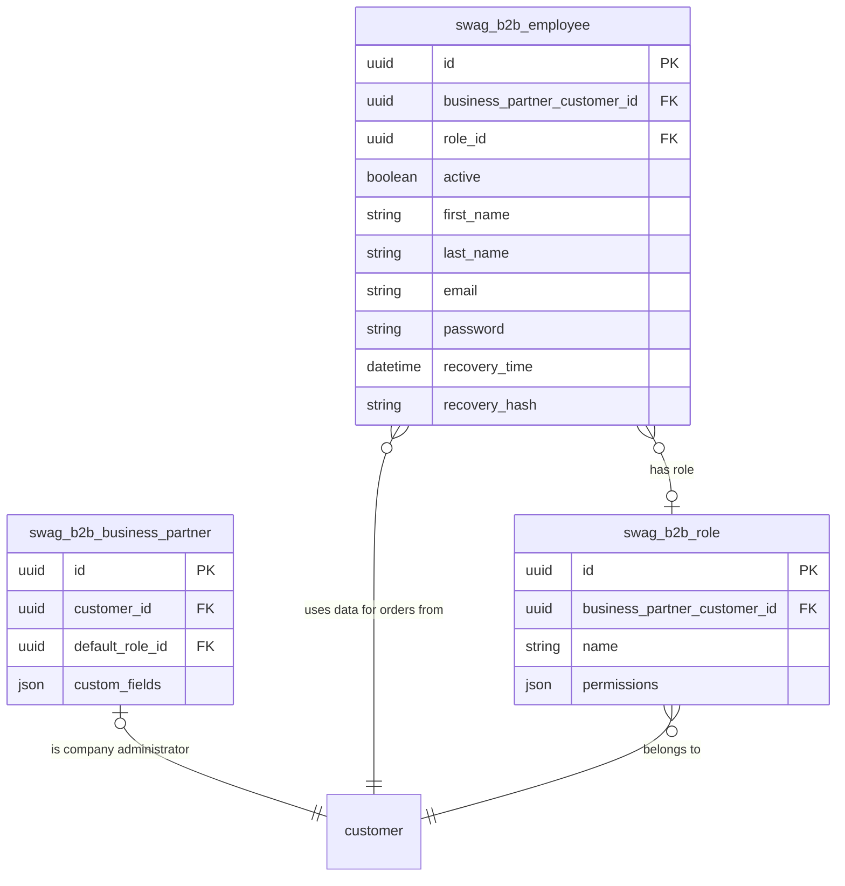
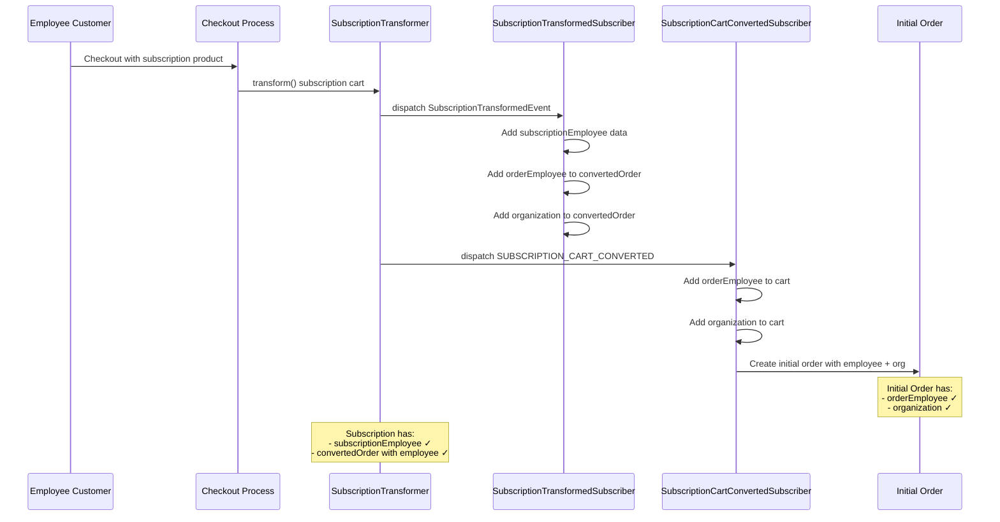
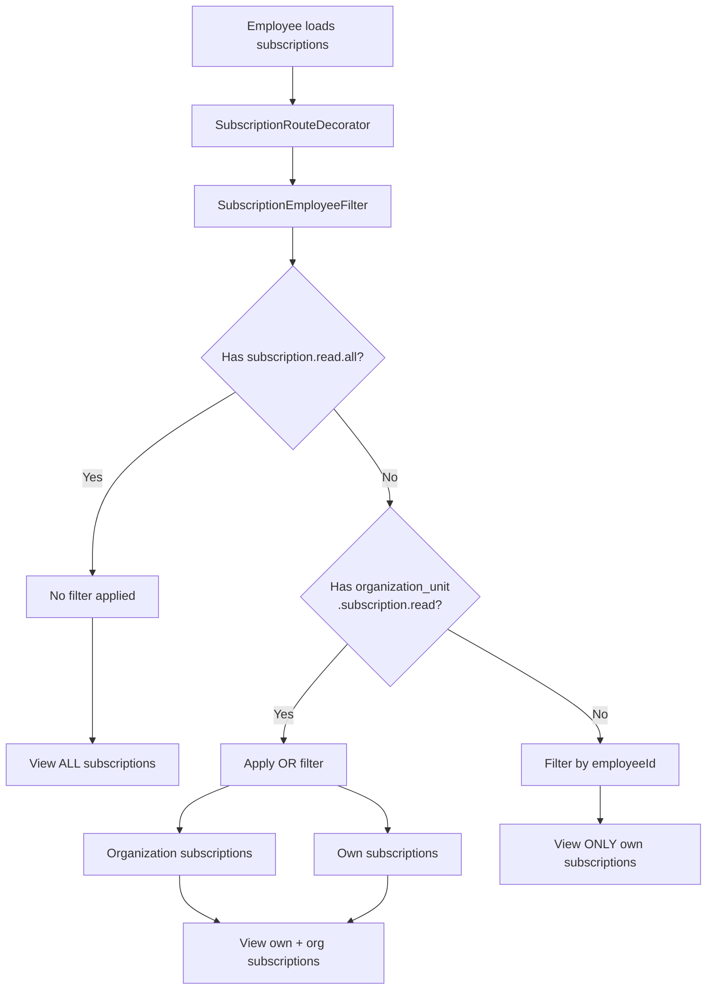
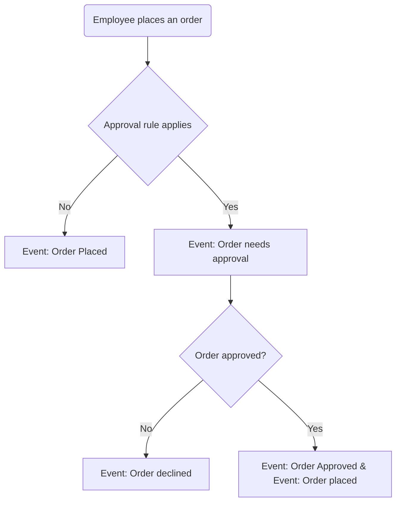
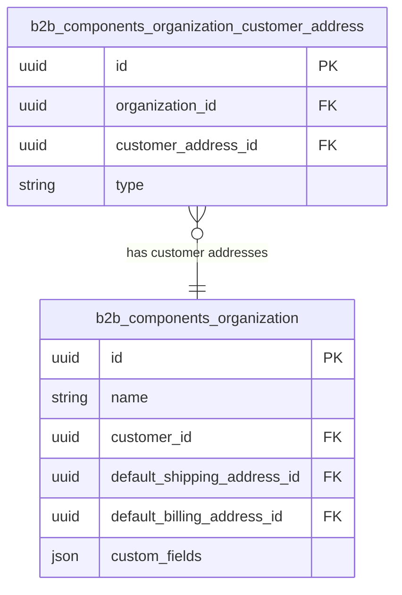
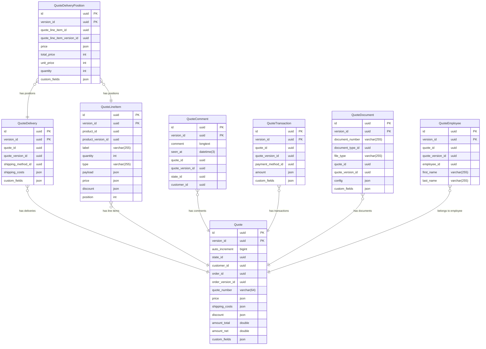
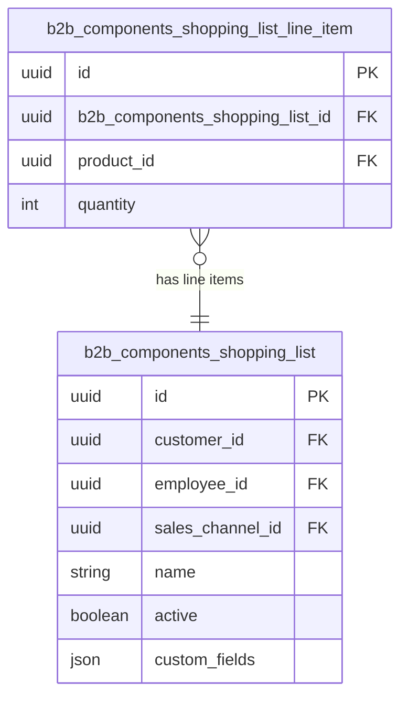

# PRODUCT EXTENSIONS OVERVIEW

Compiled excerpts from the Shopware Developer Documentation snapshot. Prefer live docs at [developer.shopware.com](https://developer.shopware.com/) when in doubt.

---

## Installation
**Source:** [products/extensions/advanced-search/installation.md](https://developer.shopware.com/docs/v6.6/products/extensions/advanced-search/installation.md)  
# Installation

This module requires the following:

* Advanced Search 2.0 is a licensed feature of the Commercial package. It is available for `Evolve` and `Beyond` plan.
* Opensearch server is up and running.
* `Shopware\Elasticsearch\Elasticsearch` bundle is enabled in `config/bundles.php`.
* On-prem environment configuration:

```text
OPENSEARCH_URL=http://localhost:9200
ES_MULTILINGUAL_INDEX=1
SHOPWARE_ES_ENABLED=1
SHOPWARE_ES_INDEXING_ENABLED=1
SHOPWARE_ES_INDEX_PREFIX=sw
```

* Commercial plugin version 5.5.0 onward is installed and activated.

---

---

## Introduction
**Source:** [products/extensions/b2b-components.md](https://developer.shopware.com/docs/v6.6/products/extensions/b2b-components.md)  
# Introduction

The B2B components enable you to enhance your shop with essential B2B functionalities. Below are the available components.

In the world of digital B2B commerce, where businesses engage with other companies, we emphasize this vital distinction through these specific features :

* **Employee Management** enables B2B Merchants to create a buyer platform for their business partners.

* **Quote Managements** covers Sales Representative related jobs around negotiating quotes with customers.

* **Order Approval** allows for a more controlled buying process by introducing an approval workflow.

* **Quick Order and Shopping List** takes care of distinctive B2B buying behaviors.

* **Organization Unit** allows for the configuration of more differentiated and specific access rights to meet the needs of businesses with complex structures.

* **Digital Sales Composables** aims to provide a set of composable frontends to cover more complex Sales Representative jobs.

## Configuring custom toggles for B2B components

The B2B components allow merchants to selectively choose and configure B2B features according to their needs. They offer merchants the ability to craft a tailored B2B ecommerce experience for their business partners while also allowing agencies to fine-tune Shopware to meet specific requirements. This means that B2B components can be individually activated or deactivated for each business partner within the shop.

The following articles will guide you how to do this by creating custom toggles via a plugin for B2B Components (Customer-specific features).

The **Customer-specific features** section on the Customer detail page allows the shop merchant to turn these B2B features on or off for a specific customer.


To achieve this, you need to address the following cases where functionality may be hidden:

1. If a merchant has not activated a feature for a particular customer, it should be hidden.
2. If the B2B admin has not granted an employee access to a specific feature, it should not be visible.

Considering these scenarios, we can ensure that the appropriate B2B features are displayed and accessible based on feature toggles and admin-granted permissions.

### Prerequisite

To improve organization and maintain a clear structure, it is advisable to relocate all B2B Components into the `B2B` folder within the Commercial plugin. By doing so, you can centralize the B2B-related functionality, making it easier to locate, manage, and maintain the codebase. This folder structure promotes better separation of concerns and enhances the overall modularity of the application.

```text
├── src
│   ├── B2B
│   │   ├── QuickOrder
│   │   ├── AnotherB2BComponent
│   │   │   CommercialB2BBundle.php
...
```

To ensure consistency and clarity, it is recommended to make your B2B Component extend `CommercialB2BBundle` instead of `CommercialBundle` and add the `type` as **B2B** attribute inside the `describeFeatures()` method of each B2B Component. This attribute will help identify and categorize the features specifically related to B2B functionality.

By including `type => 'B2B'` in the `describeFeatures()` method, you can distinguish B2B features from other types of features within your application. This will facilitate easier maintenance, organization, and identification of B2B-related functionalities, ensuring a streamlined development process.

For example, consider the following code snippet:

```php
namespace Shopware\Commercial\B2B\YourB2BComponent;

class YourB2BComponent extends CommercialB2BBundle
{
    public function describeFeatures(): array
    {
        return [
            [
                ...,
                'type' => self::TYPE_B2B,
            ],
        ];
    }
}
```

## Using feature toggle in Route/API/Controller

To determine if a customer is allowed to access a specific B2B feature, we will utilize the `isAllowed()` method from the `Shopware\Commercial\B2B\QuickOrder\Domain\CustomerSpecificFeature\CustomerSpecificFeatureService` service. This method accepts two parameters: the customer ID and the technical code of the B2B component.

We will place this check before every route, controller or API as follows:

```php
use Shopware\Commercial\B2B\QuickOrder\Domain\CustomerSpecificFeature\CustomerSpecificFeatureService;
 
class ApiController
{
    public function __construct(private readonly CustomerSpecificFeatureService $customerSpecificFeatureService)
    {
    }

    #[Route(
        path: '/your/path',
        name: 'path.name',
        defaults: ['_noStore' => false, '_loginRequired' => true],
        methods: ['GET'],
    )]
    public function view(Request $request, SalesChannelContext $salesChannelContext): Response
    {
        if (!$this->customerB2BFeatureService->isAllowed($salesChannelContext->getCustomerId(), 'QUICK_ORDER')) {
            throw CustomerSpecificFeatureException::notAllowed('QUICK_ORDER');
        }

        ...
    }
```

## Using feature toggle in Twig - Storefront

You can use a new Twig extension called `customerHasFeature()` to implement the functionality of retrieving customer-specific features in Twig templates. This method accepts only one parameter. The parameter is the technical code of the B2B component.

Here is an example implementation:

```php
namespace Shopware\Commercial\B2B\QuickOrder\Storefront\Framework\Twig\Extension;

class CustomerSpecificFeatureTwigExtension extends AbstractExtension
{
    public function getFunctions(): array
    {
        return [
            new TwigFunction('customerHasFeature', $this->isAllowed(...), ['needs_context' => true]),
        ];
    }

    public function isAllowed(array $twigContext, string $feature): bool
    {
        $customerId = null;
        if (\array_key_exists('context', $twigContext) && $twigContext['context'] instanceof SalesChannelContext) {
            $customerId = $twigContext['context']->getCustomerId();
        }
        
        if (!$customerId) {
            return false;
        }
        
        return $this->customerSpecificFeatureService->isAllowed($customerId, $feature);
    }
}
```

Use it to check if a specific feature is allowed for a given customer in Twig.

```html

    ...

```

---

---

## Guides
**Source:** [products/extensions/b2b-components/customer-specific-features.md](https://developer.shopware.com/docs/v6.5/products/extensions/b2b-components/customer-specific-features.md)  
# Guides

The following articles will guide you how to create custom toggles via a plugin for B2B Components (Customer-specific features).

---

---

## Introduction
**Source:** [products/extensions/b2b-components/customer-specific-features/feature-toggles.md](https://developer.shopware.com/docs/v6.5/products/extensions/b2b-components/customer-specific-features/feature-toggles.md)  
## Introduction

A new "Customer-specific features" section on the Customer detail page allows the shop merchant to turn B2B features on or off for a specific customer. This section aims to provide each customer with their own set of specific features, granting them access to certain B2B Components within the shop.


To achieve this, ACL (Access Control List) and address the following cases where functionality may be hidden:

1. If the merchant has not activated a feature for a particular customer, it should be hidden.
2. If the B2B admin has not granted an employee access to a specific feature, it should not be visible.

Considering these scenarios, we can ensure that the appropriate B2B features are displayed and accessible based on feature toggles and admin-granted permissions.

### Prerequisite

To improve organization and maintain a clear structure, it is advisable to relocate all B2B Components into the `B2B` folder within the Commercial plugin. By doing so, you can centralize the B2B-related functionality, making it easier to locate, manage, and maintain the codebase. This folder structure promotes better separation of concerns and enhances the overall modularity of the application.

```
├── src
│   ├── B2B
│   │   ├── QuickOrder
│   │   ├── AnotherB2BComponent
│   │   │   CommercialB2BBundle.php
...

```

To ensure consistency and clarity, it is recommended to make your B2B Component extend CommercialB2BBundle instead of CommercialBundle as usual and add the type => 'B2B' attribute inside the describeFeatures() method of each B2B Component. This attribute will help identify and categorize the features specifically related to B2B functionality.

By including `type => 'B2B'` in the `describeFeatures()` method, you can distinguish B2B features from other types of features within your application. This will facilitate easier maintenance, organization, and identification of B2B-related functionalities, ensuring a streamlined development process.

For example, consider the following code snippet:

```php
namespace Shopware\Commercial\B2B\YourB2BComponent;

class YourB2BComponent extends CommercialB2BBundle
{
    public function describeFeatures(): array
    {
        return [
            [
                ...,
                'type' => self::TYPE_B2B,
            ],
        ];
    }
}
```

## Using feature toggle in Route/API/Controller

### Using new service

To determine if a customer is allowed to access a specific B2B feature, we will utilize the `isAllowed()` method from the `Shopware\Commercial\B2B\QuickOrder\Domain\CustomerSpecificFeature\CustomerSpecificFeatureService` service. This method accepts two parameters: the customer ID and the technical code of the B2B component.

We will place this check before every route, controller or API as follows:

```php
use Shopware\Commercial\B2B\QuickOrder\Domain\CustomerSpecificFeature\CustomerSpecificFeatureService;
 
class ApiController
{
    public function __construct(private readonly CustomerSpecificFeatureService $customerSpecificFeatureService)
    {
    }

    #[Route(
        path: '/your/path',
        name: 'path.name',
        defaults: ['_noStore' => false, '_loginRequired' => true],
        methods: ['GET'],
    )]
    public function view(Request $request, SalesChannelContext $salesChannelContext): Response
    {
        if (!$this->customerB2BFeatureService->isAllowed($salesChannelContext->getCustomerId(), 'QUICK_ORDER')) {
            throw CustomerSpecificFeatureException::notAllowed('QUICK_ORDER');
        }

        ...
    }
```

## Using feature toggle in Twig - Storefront

#### New Twig function

You can use a new Twig extension called customerHasFeature() to implement the functionality of retrieving customer-specific features in Twig templates. This method accepts only one parameter. The parameter is the technical code of the B2B component.

Here's an example implementation:

```php
namespace Shopware\Commercial\B2B\QuickOrder\Storefront\Framework\Twig\Extension;

class CustomerSpecificFeatureTwigExtension extends AbstractExtension
{
    public function getFunctions(): array
    {
        return [
            new TwigFunction('customerHasFeature', $this->isAllowed(...), ['needs_context' => true]),
        ];
    }

    public function isAllowed(array $twigContext, string $feature): bool
    {
        $customerId = null;
        if (\array_key_exists('context', $twigContext) && $twigContext['context'] instanceof SalesChannelContext) {
            $customerId = $twigContext['context']->getCustomerId();
        }
        
        if (!$customerId) {
            return false;
        }
        
        return $this->customerSpecificFeatureService->isAllowed($customerId, $feature);
    }
}
```

Use it to check if a specific feature is allowed for a given customer in Twig.

```html

    ...

```

---

---

## Employee Management
**Source:** [products/extensions/b2b-components/employee-management.md](https://developer.shopware.com/docs/v6.6/products/extensions/b2b-components/employee-management.md)  
# Employee Management

A feature of the B2B Components includes employee, role, and permission management. It is implemented into both Storefront and Administration and supports their respective APIs.

## Basic idea

Employee management, as one of the B2B Components, is a feature that allows you to manage employees and their permissions as an extension to Shopware's account and customer management, but set into a company context. This means that employees are associated with a **company customer** and will act on behalf of that company, e.g., placing orders. Accordingly, employees can make use of addresses that have been defined by administrators of their company.

The **company customer** has the benefit of injecting company managed data into core processes without having to develop new employee processes from scratch or maintain multiple versions of these processes.

## Company customer

The company customer is a regular storefront customer but with a few additional properties. A customer's ID is used to associate employees with a company. Therefore, it is really easy to rely on Shopware's typical order relevant data like addresses. This allows us to keep using most core implementations, while only extending a few B2B related features, e.g., to reference an employee's actions.

## Role management

Employees are assigned roles that define their permissions and settings. These permissions can restrict or allow employees to perform certain actions, like ordering without approval or managing roles and employees. Refer to our guides section how permissions can be extended [via app](../employee-management/guides/creating-own-permissions-via-app.md) or [via plugin](../employee-management/guides/creating-own-permissions-via-plugin.md).

---

---

## Concepts
**Source:** [products/extensions/b2b-components/employee-management/concept.md](https://developer.shopware.com/docs/v6.5/products/extensions/b2b-components/employee-management/concept.md)  
# Concepts

This section includes the concepts related to Employee Management.

## Additional info

It's important to keep in mind that employees are uniquely identified via their email address.
When a new employee gets invited, a check will be performed to ensure that the email address is in use only once.

---

---

## API Route Restriction for Employees
**Source:** [products/extensions/b2b-components/employee-management/concept/api-route-restriction-for-employees.md](https://developer.shopware.com/docs/v6.5/products/extensions/b2b-components/employee-management/concept/api-route-restriction-for-employees.md)  
# API Route Restriction for Employees

## Overview

B2B employees and business partners share the same customer account. This can lead to inconsistency for all users of the shared account because they are allowed to change settings and data (both via Storefront and Store API), which are not related to the B2B permission system. Hence, it is decided to restrict most of the customer account routes by implementing a denylist pattern to prevent the illegal modification of customer data and settings, instead of replicating all customer features for employee accounts. All non-account related routes are still available for B2B employees.

## Denylist

The denylist can be found in the employee management config at: `Resources\config\employee_route_access.xml`. All denied routes are inside `<denied>` tags. The routes inside the `<allowed>` tags are not important for third-party developers because they are used for internal integration tests to remind developers to extend the list if new Store API account routes are added.

### Denylist Example

```xml
<?xml version="1.0" encoding="utf-8"?>
<routes xmlns:xsi="http://www.w3.org/2001/XMLSchema-instance" xsi:noNamespaceSchemaLocation="../Schema/Xml/employee-route-access-1.0.xsd">
    <denied>store-api.account.change-profile</denied>
    <denied>store-api.account.change-email</denied>
    <denied>...</denied>

    <allowed>store-api.account.login</allowed>
    <allowed>store-api.account.logout</allowed>
    <allowed>...</allowed>
</routes>
```

### How to load the Denylist

The denylist is loaded by using the `load` function in the `Shopware\Commercial\B2b\Domain\RouteAccess\EmployeeRouteAccessLoader` class. The return result is an associative array that includes arrays of all `allowed` and `denied` routes.

### Where is the Denylist loaded

The denylist is loaded in the `Shopware\Commercial\B2b\Subscriber\B2bRouteBlocker`, which listens to each controller event and validates the route access before the request reaches the controller. Illegal attempts cause an exception to be thrown.

### How to override the Denylist

It is possible to create additional `employee_route_access.xml` configs, which include new denied routes. After the config is ready, you can decorate the `Shopware\Commercial\B2b\Domain\RouteAccess\EmployeeRouteAccessLoader`, which supports recommended Shopware decoration pattern. Adapt the solution of the decorated `EmployeeRouteAccessLoader::load` function and return your own config.

#### Decoration Example

```php
<?php declare(strict_types=1);

namespace Shopware\Commercial\B2B\Domain\RouteAccess;

class DecoratedEmployeeRouteAccessLoader extends AbstractEmployeeRouteAccessLoader
{
    private const CONFIG = __DIR__ . '/../../Resources/config/new-custom-employee_route_access.xml';

    public function __construct(
        private readonly AbstractEmployeeRouteAccessLoader $decorated
    ) {
    }

    public function getDecorated(): AbstractEmployeeRouteAccessLoader
    {
        return $this->decorated;
    }

    public function load(): array
    {
        $oldConfig = $this->decorated->load();
        $customConfig = (array) @simplexml_load_file(self::CONFIG);

        // This example merges the old config with the new created custom config.
        // Return the $customConfig variable to override the old completely

        return array_merge_recursive($oldConfig, $customConfig);
    }
}
```

---

---

## Entities and schema
**Source:** [products/extensions/b2b-components/employee-management/concept/entities-and-schema.md](https://developer.shopware.com/docs/v6.5/products/extensions/b2b-components/employee-management/concept/entities-and-schema.md)  
# Entities and schema

## Entities

### Business Partner

The business partner entity contains additional B2B company data and therefore extends the basic storefront customer. Business partners are used to pool employees, roles and global settings.

### Employee

The employee entity represents a separate login within the context of the same business partner. This is to say that, employees operate on behalf of the linked business partner, facilitating actions like order placement. Additionally, these employees can be assigned specific roles.

### Role

The role entity represents a set of permissions that can be assigned to an employee. Permissions can restrict or allow employees to perform certain actions in the shop, like ordering or managing roles as well as employees.

## Schema



---

---

## Concepts
**Source:** [products/extensions/b2b-components/employee-management/concepts.md](https://developer.shopware.com/docs/v6.6/products/extensions/b2b-components/employee-management/concepts.md)  
# Concepts

This section includes the concepts related to Employee Management.

## Additional info

It's important to keep in mind that employees are uniquely identified via their email address.
When a new employee gets invited, a check will be performed to ensure that the email address is in use only once.

---

---

## Entities and schema
**Source:** [products/extensions/b2b-components/employee-management/concepts/entities-and-schema.md](https://developer.shopware.com/docs/v6.6/products/extensions/b2b-components/employee-management/concepts/entities-and-schema.md)  
# Entities and schema

## Entities

### Business Partner

The business partner entity contains additional B2B company data and therefore extends the basic storefront customer. Business partners are used to pool employees, roles and global settings.

### Employee

The employee entity represents a separate login within the context of the same business partner. This is to say that, employees operate on behalf of the linked business partner, facilitating actions like order placement. Additionally, these employees can be assigned specific roles.

### Role

The role entity represents a set of permissions that can be assigned to an employee. Permissions can restrict or allow employees to perform certain actions in the shop, like ordering or managing roles as well as employees.

## Schema


---

---

## Guides
**Source:** [products/extensions/b2b-components/employee-management/guides.md](https://developer.shopware.com/docs/v6.6/products/extensions/b2b-components/employee-management/guides.md)  
# Guides

The following articles gives you an idea of roles. Also it guides you on creating your own permissions via app or plugin for the B2B Employee Management component.

## B2B permissions

Use permissions to restrict access to certain information or functionalities within the B2B Components. For example, the B2B supervisor can restrict which employee can manage the company's employee accounts.

### Groups

Permissions are divided into individual groups that have a logical relationship to each other.

### Dependencies

A permission can be dependent on another permission, without which this permission cannot be used. For example, if a role is created with the permission to edit employee accounts, this role must also have the permission to view employee accounts. This is because the `employee.edit` permission depends on the `employee.read` permission.

### Shopware base permissions

The following permissions are already included and used in the B2B Employee Management component. More "base" permissions will be duly added with future B2B Components.

| Group | Permission | Dependencies  |
|---------|----------|-----------|
| employee | employee.read | |
| employee | employee.edit | employee.read |
| employee | employee.create | employee.read, employee.edit |
| employee | employee.delete | employee.read, employee.edit |
| order | order.read.all | |

---

---

## API Route Restriction for Employees
**Source:** [products/extensions/b2b-components/employee-management/guides/api-route-restriction-for-employees.md](https://developer.shopware.com/docs/v6.6/products/extensions/b2b-components/employee-management/guides/api-route-restriction-for-employees.md)  
# API Route Restriction for Employees

## Overview

B2B employees and business partners share the same customer account. This can lead to inconsistency for all users of the shared account because they are allowed to change settings and data (both via Storefront and Store API), which are not related to the B2B permission system. Hence, it is decided to restrict most of the customer account routes by implementing a denylist pattern to prevent the illegal modification of customer data and settings, instead of replicating all customer features for employee accounts. All non-account related routes are still available for B2B employees.

## Denylist

The denylist can be found in the employee management config at: `Resources\config\employee_route_access.xml`. All denied routes are inside `<denied>` tags. The routes inside the `<allowed>` tags are not important for third-party developers because they are used for internal integration tests to remind developers to extend the list if new Store API account routes are added.

### Denylist Example

```xml
<?xml version="1.0" encoding="utf-8"?>
<routes xmlns:xsi="http://www.w3.org/2001/XMLSchema-instance" xsi:noNamespaceSchemaLocation="../Schema/Xml/employee-route-access-1.0.xsd">
    <denied>store-api.account.change-profile</denied>
    <denied>store-api.account.change-email</denied>
    <denied>...</denied>

    <allowed>store-api.account.login</allowed>
    <allowed>store-api.account.logout</allowed>
    <allowed>...</allowed>
</routes>
```

### How to load the Denylist

The denylist is loaded by using the `load` function in the `Shopware\Commercial\B2b\Domain\RouteAccess\EmployeeRouteAccessLoader` class. The return result is an associative array that includes arrays of all `allowed` and `denied` routes.

### Where is the Denylist loaded

The denylist is loaded in the `Shopware\Commercial\B2b\Subscriber\B2bRouteBlocker`, which listens to each controller event and validates the route access before the request reaches the controller. Illegal attempts cause an exception to be thrown.

### How to override the Denylist

It is possible to create additional `employee_route_access.xml` configs, which include new denied routes. After the config is ready, you can decorate the `Shopware\Commercial\B2b\Domain\RouteAccess\EmployeeRouteAccessLoader`, which supports recommended Shopware decoration pattern. Adapt the solution of the decorated `EmployeeRouteAccessLoader::load` function and return your own config.

#### Decoration Example

```php
<?php declare(strict_types=1);

namespace Shopware\Commercial\B2B\Domain\RouteAccess;

class DecoratedEmployeeRouteAccessLoader extends AbstractEmployeeRouteAccessLoader
{
    private const CONFIG = __DIR__ . '/../../Resources/config/new-custom-employee_route_access.xml';

    public function __construct(
        private readonly AbstractEmployeeRouteAccessLoader $decorated
    ) {
    }

    public function getDecorated(): AbstractEmployeeRouteAccessLoader
    {
        return $this->decorated;
    }

    public function load(): array
    {
        $oldConfig = $this->decorated->load();
        $customConfig = (array) @simplexml_load_file(self::CONFIG);

        // This example merges the old config with the new created custom config.
        // Return the $customConfig variable to override the old completely

        return array_merge_recursive($oldConfig, $customConfig);
    }
}
```

---

---

## Employee Invitation
**Source:** [products/extensions/b2b-components/employee-management/guides/b2b-employee-invitation.md](https://developer.shopware.com/docs/v6.6/products/extensions/b2b-components/employee-management/guides/b2b-employee-invitation.md)  
# Employee Invitation

Employees can be created via Storefront, Store-api, and Administration.

* Storefront - Business partners can invite employees by logging-in to Storefront and navigating to the `employee` page. From there, they can add a new employee.
* Store API - One can utilize the `/store-api/employee/create` endpoint while logged in as a customer to invite employees.
* Administration - Merchants can invite employees by logging in to the administration interface. Selects the business partner customer, navigates to the `company` tab, and adds a new employee account in edit mode.

The invited employee receives an invitation mail that must be confirmed to set a password.

## The URL for the invitation acceptance

Upon invitation, the employee will receive an email requiring confirmation to set a password. This process will also activate the employee for the business partners company.
The default URL for the acceptance is `/account/business-partner/employee/invite/%%RECOVERHASH%%`, the recovery hash is used as a unique identifier and is only valid for the invitation of one employee.

### How to override the Invitation URL

The default URL can be replaced with a custom URL. This is helpful if you want to provide a custom endpoint.
To override it, you need to insert the URL as a string into the key-value system config with the key `b2b.employee.invitationURL`.

You can find more information about the system config here: [System Config](/guides/plugins/apps/configuration.md).

---

---

## B2B Employee invite / registration
**Source:** [products/extensions/b2b-components/employee-management/guides/b2b-employee-invite-registration.md](https://developer.shopware.com/docs/v6.5/products/extensions/b2b-components/employee-management/guides/b2b-employee-invite-registration.md)  
# B2B Employee invite / registration

Employees can be created via storefront and api to get an invite mail. This has to be later confirmed by the employee to set a password.

It’s possible to invite new employees or manage them via the API.

---

---

## B2B Roles
**Source:** [products/extensions/b2b-components/employee-management/guides/b2b-roles.md](https://developer.shopware.com/docs/v6.6/products/extensions/b2b-components/employee-management/guides/b2b-roles.md)  
# B2B Roles

Roles can be used to bind multiple permission to employees with contexts. Every employee can have one assigned role. Based on that role and the containing permission, the employee will get access to certain information and functionalities.

The business partner has the opportunity to create a **default** role that will be selected by default, when creating a new employee.

---

---

## Create Permissions via App
**Source:** [products/extensions/b2b-components/employee-management/guides/creating-own-permissions-via-app.md](https://developer.shopware.com/docs/v6.6/products/extensions/b2b-components/employee-management/guides/creating-own-permissions-via-app.md)  
# Create Permissions via App

The App needs to use the API to extend and create permissions. Therefore, the apps can send a request to the Store API and pass the required parameters to the `/store-api/permission` route.

After doing that, the already existing permissions created by Shopware or added by plugin, will be merged with the permission created by apps.

It is important to note that permissions have a unique name. So a permission named `employee.read` can neither be added by apps nor by plugins, because this name is already in use. So a new name can better be added by making use of snippets.

## Snippets

The Snippet for the new permissions has to be added to the following namespace: `b2b.role-edit.permissions.[name]`. The placeholder has to be replaced by the name of the new permission, e.g., `b2b.role-edit.permissions.order.delete`.

---

---

## Creating own permissions via plugin
**Source:** [products/extensions/b2b-components/employee-management/guides/creating-own-permissions-via-plugin.md](https://developer.shopware.com/docs/v6.6/products/extensions/b2b-components/employee-management/guides/creating-own-permissions-via-plugin.md)  
# Creating own permissions via plugin

This article explains how to create custom permissions using a plugin.

To create custom permissions, you will utilize the event subscriber concept in Symfony.
Create a new class called `PermissionCollectorSubscriber` that implements the `EventSubscriberInterface`:

```php
<?php declare(strict_types=1);

use Symfony\Component\EventDispatcher\EventSubscriberInterface;

class PermissionCollectorSubscriber implements EventSubscriberInterface
{
    public const OWN_ENTITY_GROUP = 'own_entity';

    // Here you define your custom permissions as constants
    public const OWN_ENTITY_READ = 'own_entity.read';
    
    public const OWN_ENTITY_EDIT = 'own_entity.edit';
    
    public const OWN_ENTITY_CREATE = 'own_entity.create';
    
    public const OWN_ENTITY_DELETE = 'own_entity.delete';

    public static function getSubscribedEvents(): array
    {
        return [
            PermissionCollectorEvent::NAME => [ 'onAddOwnPermissions' , 1000 ]
        ];
    }

    // This method is called when the PermissionCollectorEvent is triggered
    public function onAddOwnPermissions(PermissionCollectorEvent $event): void
    {
        $collection = $event->getCollection();

        // Here you add your custom permissions to the permission collection
        $collection->addPermission(self::EMPLOYEE_READ, self::OWN_ENTITY_GROUP, []);
        $collection->addPermission(self::EMPLOYEE_EDIT, self::OWN_ENTITY_GROUP, [ self::EMPLOYEE_READ ]);
        $collection->addPermission(self::EMPLOYEE_CREATE, self::OWN_ENTITY_GROUP, [ self::EMPLOYEE_READ, self::EMPLOYEE_EDIT ]);
        $collection->addPermission(self::EMPLOYEE_DELETE, self::OWN_ENTITY_GROUP, [ self::EMPLOYEE_READ, self::EMPLOYEE_EDIT ]);
    }
}
```

The `PermissionCollector` collects the permissions of all subscribers and then passes them to the storefront, where they can be attached to the role by the user.
If you want to check in the template if the user has this permission, the Twig function `isB2bAllowed` can be used:

```twig


{{ parent() }}


...

```

In controllers, the checking of permissions must happen via the employee's role:

```php
<?php declare(strict_types=1);
public function employeeList(Request $request, SalesChannelContext $context): Response
{
    if (!$context->getCustomer()->getEmployee()->getRole()->can(PermissionCollectorSubscriber::EMPLOYEE_READ)) {
        throw new PermissionDeniedException();
    }
...
}
```

---

---

## B2B Employee Integration for Subscriptions
**Source:** [products/extensions/b2b-components/employee-management/guides/subscription-integration.md](https://developer.shopware.com/docs/products/extensions/b2b-components/employee-management/guides/subscription-integration.md)  
*(Body truncated in this bundle; follow the link for the rest.)*

# B2B Employee Integration for Subscriptions

This guide describes how B2B Employees are integrated with the Subscription module, enabling employee-based subscription management and tracking within a B2B context.

## Overview

The B2B Employee Integration for Subscriptions extends subscription functionality to support B2B employee workflows without modifying the core Subscription module. All B2B-specific logic is contained within the B2B Employee Management module using decorators, extensions, and event subscribers.

This integration enables:

* **Permission-based subscription access** - Control which subscriptions employees can view
* **Employee tracking** - Track which employee created each subscription
* **Organization context preservation** - Maintain organization data throughout the subscription lifecycle

## Prerequisites

* Shopware 6.7 with Subscriptions extension
* B2B Components with Employee Management module
* Understanding of [Subscription concepts](../../../../extensions/subscriptions/concept.md)
* Understanding of [B2B Employee Management concepts](../concepts/index.md)

## Key Features

### Employee-Based Subscription Permissions

Employees can view subscriptions based on their assigned permissions:

| Permission                            | Access Level                                                           |
|---------------------------------------|------------------------------------------------------------------------|
| `subscription.read.all`               | View all subscriptions in the system                                   |
| `organization_unit.subscription.read` | View subscriptions from assigned organization unit + own subscriptions |
| (no permission)                       | View only own subscriptions                                            |

These permissions are checked when employees access subscription lists, ensuring data isolation and security in B2B contexts.

### Employee Tracking

Subscriptions track which employee created them through the `b2b_components_subscription_employee` association table. This enables:

* **Permission-based filtering** - Filter subscriptions by employee and organization
* **Employee context in orders** - Both initial and renewal orders maintain employee context
* **Audit trails** - Track which employee initiated each subscription

### Organization Context

Organization data is preserved throughout the subscription lifecycle:

* **Initial orders** - Organization data is added when a subscription is created during checkout
* **Renewal orders** - Organization data is maintained in later automated orders
* **Context preservation** - Organization information flows through all subscription-related processes

## Architecture

### Core Components

The integration is built using several key components in the B2B Employee Management module:

**Decorators:**

* `SubscriptionRouteDecorator` - Decorates `SubscriptionRoute` to apply permission-based filtering
* `SalesChannelContextServiceDecorator` - Adds employee context to subscription sales channel contexts

**Event Subscribers:**

* `SubscriptionTransformedSubscriber` - Adds employee and organization data during subscription creation
* `SubscriptionCartConvertedSubscriber` - Adds employee and organization data to initial orders
* `SubscriptionOrderPlacedSubscriber` - Maintains employee context in renewal orders

**Entity Extension:**

* `SubscriptionExtension` - Extends `SubscriptionDefinition` with `subscriptionEmployee` association
* `SubscriptionEmployeeDefinition` - Defines the subscription-employee relationship

**Filter Service:**

* `SubscriptionEmployeeFilter` - Implements permission-based subscription filtering logic

### Integration Patterns

The integration follows Shopware best practices:

**1. Decorator Pattern**

Instead of modifying core Subscription code, the integration uses decorators to extend functionality:

```php
// SubscriptionRouteDecorator wraps the core SubscriptionRoute
$this->decorated->load($request, $context, $criteria);
// Then applies employee-based filtering
$this->subscriptionEmployeeFilter->applyEmployeeFilter($criteria, $employee);
```

**2. Event-Based Integration**

Key subscription events are used to inject employee data:

* `SubscriptionTransformedEvent` - Fired when subscription is created from cart
* `SUBSCRIPTION_CART_CONVERTED` - Fired when subscription cart is converted to order
* `CheckoutOrderPlacedEvent` - Fired when renewal order is placed

**3. Entity Extension Pattern**

The `SubscriptionExtension` adds the employee association to subscriptions without modifying the core entity:

```php
new OneToOneAssociationField(
    'subscriptionEmployee',
    'id',
    'subscription_id',
    SubscriptionEmployeeDefinition::class,
    false
);
```

## Database Schema

### b2b\_components\_subscription\_employee Table

This table links subscriptions to the employees who created them:

| Column            | Type        | Description                            |
|-------------------|-------------|----------------------------------------|
| `id`              | BINARY(16)  | Primary key                            |
| `subscription_id` | BINARY(16)  | Foreign key to `subscription` (UNIQUE) |
| `employee_id`     | BINARY(16)  | Foreign key to `b2b_employee`          |
| `created_at`      | DATETIME(3) | Creation timestamp                     |
| `updated_at`      | DATETIME(3) | Update timestamp                       |

**Key characteristics:**

* One-to-one relationship between subscription and subscription\_employee
* `subscription_id` has a UNIQUE constraint ensuring one employee per subscription
* Foreign keys maintain referential integrity

## Technical Flows

### Initial Subscription Order Flow

When an employee checks out with a subscription product, the following flow occurs:



**Key Points:**

1. `SubscriptionTransformedSubscriber` adds employee and organization data to the subscription being created
2. `SubscriptionCartConvertedSubscriber` ensures the initial order contains employee and organization data
3. The subscription's `convertedOrder` field stores this data for future renewal orders

### Permission-Based Subscription Filtering

When an employee views their subscriptions, filtering is applied based on permissions:



**Permission Logic:**

* **No filter** (`subscription.read.all`) - Employee sees all subscriptions
* **OR filter** (`organization_unit.subscription.read`) - Employee sees their own subscriptions or subscriptions from their organization unit
* **Default filter** - Employee sees only subscriptions they created

## Developer Integration Points

### Accessing Employee Data from Subscriptions

To access the employee who created a subscription:

```php
use Shopware\Core\Framework\DataAbstractionLayer\Search\Criteria;

// Add association when loading subscriptions
$criteria = new Criteria();
$criteria->addAssociation('subscriptionEmployee.employee');

$subscription = $subscriptionRepository->search($criteria, $context)->first();

if ($subscription->getSubscriptionEmployee()) {
    $employee = $subscription->getSubscriptionEmployee()->getEmployee();
    // Access employee data
}
```

### Accessing Employee Data from Orders

Employee data is stored in order extensions:

```php
// For initial or renewal orders
$order = $orderRepository->search($criteria, $context)->first();

// Check if the order has employee context
$orderEmployee = $order->getExtension('orderEmployee');
if ($orderEmployee) {
    $employeeId = $orderEmployee->getEmployeeId();
}

// Check if the order has organization context
$organization = $order->getExtension('organization');
if ($organization) {
    $organizationId = $organization->getId();
}
```

### Event Subscribers

The integration provides several event subscribers you can use as reference:

**SubscriptionTransformedSubscriber** - Priority: 0

Listens to: `SubscriptionTransformedEvent`

Use case: Add custom data when a subscription is created from a cart

**SubscriptionCartConvertedSubscriber** - Priority: 0

Listens to: `SUBSCRIPTION_CART_CONVERTED` event

Use case: Modify the initial order data during subscription checkout

**SubscriptionOrderPlacedSubscriber** - Priority: 0

Listens to: `CheckoutOrderPlacedCriteriaEvent` and `CheckoutOrderPlacedEvent`

Use case: Add employee context to renewal orders

### Adding Custom Logic

To add custom B2B logic to subscriptions:

1. **Create a decorator** for subscription services (follow `SubscriptionRouteDecorator` pattern)
2. **Subscribe to subscription events** to inject your data
3. **Use entity extensions** to add custom associations without modifying core entities
4. **Check context state** instead of relying on event priorities for more robust integration

Example decorator pattern:

```php
use Shopware\Core\System\SalesChannel\SalesChannelContext;

class CustomSubscriptionServiceDecorator extends AbstractSubscriptionService
{
    public function __construct(
        private readonly AbstractSubscriptionService $decorated,
        private readonly CustomLogicService $customService
    ) {}

    public function getDecorated(): AbstractService
    {
        return $this->decorated;
    }

    public function someMethod(SalesChannelContext $context): void
    {
        // Your custom logic before
        $this->customService->doSomething($context);

        // Call decorated service
        $this->decorated->someMethod($context);

        // Your custom logic after
    }
}
```

## Related Documentation

* [Subscription Concept](../../../../extensions/subscriptions/concept.md) - Core subscription concepts
* [Mixed Checkout](../../../../extensions/subscriptions/guides/mixed-checkout.md) - Mixed cart checkout flow
* [Separate Checkout](../../../../extensions/subscriptions/guides/separate-checkout.md) - Separate subscription checkout
* [B2B Employee Management Concepts](../concepts/index.md) - Employee and role concepts
* [Creating Permissions via Plugin](./creating-own-permissions-via-plugin.md) - How to extend permissions
* [API Route Restriction](./api-route-re

… **Truncated.** Full document: https://developer.shopware.com/docs/products/extensions/b2b-components/employee-management/guides/subscription-integration.md


---

## Order approval component
**Source:** [products/extensions/b2b-components/order-approval.md](https://developer.shopware.com/docs/v6.6/products/extensions/b2b-components/order-approval.md)  
# Order approval component

Order approval component is a part of the B2B Employee Management. It allows you to define rules that determine which orders require approval and which employees can approve them. It also allows you to view all pending orders and approve or decline them.

## Requirements

* You need to have Employee Management component installed and activated (see [Employee Management](../employee-management/)).

---

---

## Entities and workflow
**Source:** [products/extensions/b2b-components/order-approval/01-entities-and-workflow.md](https://developer.shopware.com/docs/v6.5/products/extensions/b2b-components/order-approval/01-entities-and-workflow.md)  
# Entities and workflow

## Entities

### Approval Rule

The approval rule entity represents a set of conditions that need to be met for an order to be approved. These conditions might be based on the order's total value, the order's currency or orders placed by employees with a specific role. Each approval rule can be assigned to a reviewer with specific role, which means that only employees that only employees possessing that role are authorized to approve orders meeting the rule's conditions. Additionally, it can be assigned to a particular role, requiring employees with that role to seek approval for orders meeting the rule's criteria. The rule also includes a priority, dictating the sequence in which the rules are evaluated.

### Pending Order

The pending order entity represents an order that has been placed by an employee that requires approval. It contains the order's data, the employee that placed the order and the approval rule that matched the order.

## Workflow

The following diagram shows the workflow of the order approval component:



## Who can request approval?

* Employees holding the role designated as the "Effective role" in the approval rule corresponding to the order are authorized to request approval.

## Who can view pending orders?

* Employees with the "Can view all pending orders" permission can view all pending orders.
* Employees who requested approval for the order can view their pending orders.
* Business Partners can view all pending orders of their employees.

## Who can approve or decline pending orders?

* Employees with the "Can approve/decline all pending orders" permission can approve or decline all pending orders.
* Employees with the "Can approve/decline pending orders" permission can approve or decline pending orders that assigned to them.
* Business Partners can approve or decline all pending orders of their employees.

---

---

## Order approval permissions
**Source:** [products/extensions/b2b-components/order-approval/02-order-approval-permissions.md](https://developer.shopware.com/docs/v6.5/products/extensions/b2b-components/order-approval/02-order-approval-permissions.md)  
# Order approval permissions

Below you can find a list of all the order approval rules that are available in the order approval component. You can utilize these rules for assigning roles to your employees.

### Approval rule permissions

| Permission                  | Description                                   |
|-----------------------------|-----------------------------------------------|
| `Can create approval rules` | Allows the employee to create approval rules |
| `Can update approval rules` | Allows the employee to update approval rules |
| `Can delete approval rules` | Allows the employee to delete approval rules |
| `Can read approval rules`   | Allows the employee to view approval rules  |

### Pending order Permissions

| Permission                               | Description                                                         |
|------------------------------------------|---------------------------------------------------------------------|
| `Can approve/decline all pending orders` | Allows the employee to approve or decline all pending orders        |
| `Can approve/decline pending orders`     | Allows the employee to approve or decline assigned pending orders   |
| `Can view all pending orders`            | Allows the employee to view all pending orders                      |

---

---

## Order approval's payment process
**Source:** [products/extensions/b2b-components/order-approval/03-payment-process.md](https://developer.shopware.com/docs/v6.5/products/extensions/b2b-components/order-approval/03-payment-process.md)  
# Order approval's payment process

The payment process of the order approval component is the same as the payment process of the order component. You can select the payment method that you want to use for your orders; however unlike the standard order component, the payment process will be executed only after the order has been approved in case of the online payment method (Visa, PayPal, etc.).

## Customization

### Storefront

The payment process of the order approval component can be customized by extending or overriding this page `@OrderApproval/storefront/pending-order/page/pending-approval/detail.html.twig`

### Payment process

Normally, after reviewer approves the order, the payment process will be executed automatically. However, if you just want to approve the order without executing the payment process, you can subscribe to the `PendingOrderApprovedEvent` event and set the `PendingOrderApprovedEvent::shouldProceedPlaceOrder` to `false`. This event is dispatched in the `Shopware\Commercial\B2B\OrderApproval\Storefront\Controller\ApprovalPendingOrderController::order` method.

```PHP

use Shopware\Commercial\B2B\OrderApproval\Event\PendingOrderApprovedEvent;

class MySubscriber implements EventSubscriberInterface
{
    public static function getSubscribedEvents(): array
    {
        return [
            PendingOrderApprovedEvent::class => 'onPendingOrderApproved'
        ];
    }

    public function onPendingOrderApproved(PendingOrderApprovedEvent $event): void
    {
        $event->setShouldProceedPlaceOrder(false);
    }
}
```

---

---

## How to add a new approval condition
**Source:** [products/extensions/b2b-components/order-approval/04-add-new-approval-condition.md](https://developer.shopware.com/docs/v6.5/products/extensions/b2b-components/order-approval/04-add-new-approval-condition.md)  
# How to add a new approval condition

The order approval component provides a set of conditions for defining your approval rules. However, if you need to add a new condition, you can do so via an app or a plugin.

## Plugin

Each condition is represented by a class that extends the abstract class `Shopware\Commercial\B2B\OrderApproval\Domain\ApprovalRule\Rule\OrderApprovalRule`. To add a new condition, you need to create a new class that extends the `OrderApprovalRule` class and implements the `match` and `getConstraints` methods. The `match` method is used to determine if the condition is met, and the `getConstraints` method is used to define the field, value or operator constraints that can be used in the condition.

Example:

```PHP
<?php declare(strict_types=1);

namespace YourPluginNameSpace;

use Shopware\Commercial\B2B\OrderApproval\Domain\ApprovalRule\Rule\OrderApprovalRule;

class CartAmountRule extends OrderApprovalRule
{
    final public const RULE_NAME = self::PREFIX . 'cart-amount';

    public const AMOUNT = 1000;

    protected float $amount;

    /**
     * @internal
     */
    public function __construct(
        protected string $operator = self::OPERATOR_GTE,
        ?float $amount = self::AMOUNT
    ) {
        parent::__construct();
        $this->amount = (float) $amount;
    }

    /**
     * @throws UnsupportedOperatorException
     */
    public function match(RuleScope $scope): bool
    {
        if (!$scope instanceof CartRuleScope) {
            return false;
        }

        return RuleComparison::numeric($scope->getCart()->getPrice()->getTotalPrice(), $this->amount, $this->operator);
    }

    public function getConstraints(): array
    {
        return [
            'amount' => RuleConstraints::float(),
            'operator' => RuleConstraints::numericOperators(false),
        ];
    }

    public function getConfig(): RuleConfig
    {
        return (new RuleConfig())
            ->operatorSet(RuleConfig::OPERATOR_SET_NUMBER)
            ->numberField('amount');
    }
}
```

And then tag your class with the `shopware.approval_rule.definition` tag:

```XML
 <service id="YourPluginNameSpace\CartAmountRule" public="true">
    <tag name="shopware.approval_rule.definition"/>
 </service>
```

## App

We have not yet added support for extending custom `OrderApprovalRules` for the app.

---

---

## Entities and workflow
**Source:** [products/extensions/b2b-components/order-approval/concepts/01-entities-and-workflow.md](https://developer.shopware.com/docs/v6.6/products/extensions/b2b-components/order-approval/concepts/01-entities-and-workflow.md)  
# Entities and workflow

## Entities

### Approval Rule

The approval rule entity represents a set of conditions that need to be met for an order to be approved. These conditions might be based on the order's total value, the order's currency or orders placed by employees with a specific role. Each approval rule can be assigned to a reviewer with specific role, which means that only employees that only employees possessing that role are authorized to approve orders meeting the rule's conditions. Additionally, it can be assigned to a particular role, requiring employees with that role to seek approval for orders meeting the rule's criteria. The rule also includes a priority, dictating the sequence in which the rules are evaluated.

### Pending Order

The pending order entity represents an order that has been placed by an employee that requires approval. It contains the order's data, the employee that placed the order and the approval rule that matched the order.

## Workflow

The following diagram shows the workflow of the order approval component:


## Who can request approval?

* Employees holding the role designated as the "Effective role" in the approval rule corresponding to the order are authorized to request approval.

## Who can view pending orders?

* Employees with the "Can view all pending orders" permission can view all pending orders.
* Employees who requested approval for the order can view their pending orders.
* Business Partners can view all pending orders of their employees.

## Who can approve or decline pending orders?

* Employees with the "Can approve/decline all pending orders" permission can approve or decline all pending orders.
* Employees with the "Can approve/decline pending orders" permission can approve or decline pending orders that assigned to them.
* Business Partners can approve or decline all pending orders of their employees.

---

---

## Order approval permissions
**Source:** [products/extensions/b2b-components/order-approval/guides/02-order-approval-permissions.md](https://developer.shopware.com/docs/v6.6/products/extensions/b2b-components/order-approval/guides/02-order-approval-permissions.md)  
# Order approval permissions

Below, you can find a list of all the order approval rules that are available in the order approval component. You can utilize these rules for assigning roles to your employees.

## Approval rule permissions

| Permission                  | Description                                   |
|-----------------------------|-----------------------------------------------|
| `Can create approval rules` | Allows the employee to create approval rules |
| `Can update approval rules` | Allows the employee to update approval rules |
| `Can delete approval rules` | Allows the employee to delete approval rules |
| `Can read approval rules`   | Allows the employee to view approval rules  |

## Pending order Permissions

| Permission                               | Description                                                         |
|------------------------------------------|---------------------------------------------------------------------|
| `Can approve/decline all pending orders` | Allows the employee to approve or decline all pending orders        |
| `Can approve/decline pending orders`     | Allows the employee to approve or decline assigned pending orders   |
| `Can view all pending orders`            | Allows the employee to view all pending orders                      |

---

---

## Order approval's payment process
**Source:** [products/extensions/b2b-components/order-approval/guides/03-payment-process.md](https://developer.shopware.com/docs/v6.6/products/extensions/b2b-components/order-approval/guides/03-payment-process.md)  
# Order approval's payment process

The payment process of the order approval component is the same as the payment process of the order component. You can select the payment method that you want to use for your orders; however unlike the standard order component, the payment process will be executed only after the order has been approved in case of the online payment method (Visa, PayPal, etc.).

## Customization

### Storefront

The payment process of the order approval component can be customized by extending or overriding this page `@OrderApproval/storefront/pending-order/page/pending-approval/detail.html.twig`

### Payment process

Normally, after reviewer approves the order, the payment process will be executed automatically. However, if you just want to approve the order without executing the payment process, you can subscribe to the `PendingOrderApprovedEvent` event and set the `PendingOrderApprovedEvent::shouldProceedPlaceOrder` to `false`. This event is dispatched in the `Shopware\Commercial\B2B\OrderApproval\Storefront\Controller\ApprovalPendingOrderController::order` method.

```php

use Shopware\Commercial\B2B\OrderApproval\Event\PendingOrderApprovedEvent;

class MySubscriber implements EventSubscriberInterface
{
    public static function getSubscribedEvents(): array
    {
        return [
            PendingOrderApprovedEvent::class => 'onPendingOrderApproved'
        ];
    }

    public function onPendingOrderApproved(PendingOrderApprovedEvent $event): void
    {
        $event->setShouldProceedPlaceOrder(false);
    }
}
```

---

---

## How to add a new approval condition
**Source:** [products/extensions/b2b-components/order-approval/guides/04-add-new-approval-condition.md](https://developer.shopware.com/docs/v6.6/products/extensions/b2b-components/order-approval/guides/04-add-new-approval-condition.md)  
# How to add a new approval condition

The order approval component provides a set of conditions for defining your approval rules. However, if you need to add a new condition, you can do so via an app or a plugin.

## Plugin

To add a custom rule, following this document [Add custom rule](../../../../../guides/plugins/plugins/framework/rule/add-custom-rules.md)

Example:

```php
<?php declare(strict_types=1);

namespace YourPluginNameSpace;

use Shopware\Core\Framework\Rule\Rule;
use Shopware\Core\Framework\Rule\RuleComparison;
use Shopware\Core\Framework\Rule\RuleConfig;
use Shopware\Core\Framework\Rule\RuleConstraints;
use Shopware\Core\Framework\Rule\RuleScope;

class CartAmountRule extends Rule
{
    final public const RULE_NAME = 'totalCartAmount';

    public const AMOUNT = 1000;

    protected float $amount;

    /**
     * @internal
     */
    public function __construct(
        protected string $operator = self::OPERATOR_GTE,
        ?float $amount = self::AMOUNT
    ) {
        parent::__construct();
        $this->amount = (float) $amount;
    }

    /**
     * @throws UnsupportedOperatorException
     */
    public function match(RuleScope $scope): bool
    {
        if (!$scope instanceof CartRuleScope) {
            return false;
        }

        return RuleComparison::numeric($scope->getCart()->getPrice()->getTotalPrice(), $this->amount, $this->operator);
    }

    public function getConstraints(): array
    {
        return [
            'amount' => RuleConstraints::float(),
            'operator' => RuleConstraints::numericOperators(false),
        ];
    }

    public function getConfig(): RuleConfig
    {
        return (new RuleConfig())
            ->operatorSet(RuleConfig::OPERATOR_SET_NUMBER)
            ->numberField('amount');
    }
}
```

Then, we have to register it in our `services.xml` and tag it as `shopware.approval_rule.definition`

```xml
 <service id="YourPluginNameSpace\CartAmountRule" public="true">
    <tag name="shopware.approval_rule.definition"/>
 </service>
```

## App

::: info
Note that the approval rule conditions for app is introduced in Commercial plugin 6.4.0, and are not supported in previous versions.
:::

### Overview

Following the same methodology as [Add custom rule conditions](../../../../../guides/plugins/apps/rule-builder/add-custom-rule-conditions.md) in the Administration Rule Builder, approval custom conditions is configured with fields displayed on the Storefront Approval Rule detail page and the logic is defined within [App Scripts](../../../../../guides/plugins/apps/app-scripts/).

### Concepts

#### Folder structure

The folder structure is similar to [Add custom rule conditions](../../../../../guides/plugins/apps/rule-builder/add-custom-rule-conditions.md). An App Approval Rule Condition is defined in the `manifest.xml` file of your app and its condition logic is defined in app script file. The difference is all scripts for rule conditions must be placed inside `Resources/scripts/approval-rule-conditions` within the root directory of the app.

```text
└── DemoApp
    ├── Resources
    │   └── scripts                         // all scripts are stored in this folder
    │       ├── approval-rule-conditions    // reserved for scripts of approval rule conditions
    │       │   └── custom-condition.twig   // the file name may be freely chosen but must be identical to the corresponding `script` element within `rule-conditions` of `manifest.xml`
    │       └── ...
    └── manifest.xml
```

#### Manifest file

Similar to [Add custom rule conditions](../../../../../guides/plugins/apps/rule-builder/add-custom-rule-conditions.md), a condition's manifest file has `identifier`, `name` and `script`.

The `name` is a descriptive and translatable name for the condition. The name will be shown within the Condition's selection in the Storefront Approval Rule detail or create page.

Within the script tag, the path of the twig script file must include the `/approval-rule-conditions/` prefix.

Let's create a custom condition that compares the total price of the current shopping cart.

```xml
<?xml version="1.0" encoding="UTF-8"?>
<manifest xmlns:xsi="http://www.w3.org/2001/XMLSchema-instance" xsi:noNamespaceSchemaLocation="https://raw.githubusercontent.com/shopware/shopware/trunk/src/Core/Framework/App/Manifest/Schema/manifest-3.0.xsd">
    <meta>
        <!-- ... -->
    </meta>

    <rule-conditions>
        <rule-condition>
            <identifier>total_cart_amount</identifier>
            <name>Total cart amount</name>
            <group>approval</group>
            <script>/approval-rule-conditions/custom-condition.twig</script>
            <constraints>
                <single-select name="operator">
                    <placeholder>Choose an operator...</placeholder>
                    <options>
                        <option value="=">
                            <name>Is equal to</name>
                        </option>
                        <option value="!=">
                            <name>Is not equal to</name>
                        </option>
                        <option value=">">
                            <name>Is greater than</name>
                        </option>
                        <option value=">=">
                            <name>Is greater than or equal to</name>
                        </option>
                    </options>
                    <required>true</required>
                </single-select>
                <float name="amount">
                    <placeholder>Enter an amount...</placeholder>
                </float>
            </constraints>
        </rule-condition>
    </rule-conditions>
</manifest>

```

The fields in `constraints` tag are used for rendering `operators` and `value` fields.

::: info
Note that the value field is only supported with number fields (`float`, `int`), text fields (`text`), single-selection fields (`single-select`), and multi-selection fields (`multi-select`).
:::

This is how the custom condition appears on the Approval Rule detail page, the `Total cart amount` condition in added to condition selection list. In this case, the value is displayed as a number field that allows decimals, with each increment being 0.01. This is because the `float` tag is defined in the manifest file.


#### Scripts

Script logic is similar to [Add custom rule conditions](../../../../../guides/plugins/apps/rule-builder/add-custom-rule-conditions.md). Let's continue with our example by creating a script file that compares the current shopping cart's total price with the pre-established value in the approval rule.

```twig
// Resources/scripts/approval-rule-conditions/custom-condition.twig

    



```

In the example above, we first check whether we can retrieve the current cart from the instance of `RuleScope` and return `false` otherwise.

We then use the variables `operator` and `totalPrice`, provided by the constraints of the condition, to evaluate whether the total price in question matches the total price of the cart.

### Other examples

#### Text field


```xml
<!-- manifest.xml -->
<!-- ... -->
<rule-condition>
    <identifier>cart_tax_status_rule_script</identifier>
    <name>Customer's first name</name>
    <group>customer</group>
    <script>/approval-rule-conditions/custom-condition.twig</script>
    <constraints>
        <single-select name="operator">
            <options>
                <option value="=">
                    <name>Is equal to</name>
                </option>
                <option value="!=">
                    <name>Is not equal to</name>
                </option>
            </options>
        </single-select>
        <text name="firstName">
            <placeholder>Enter customer's first name</placeholder>
        </text>
    </constraints>
</rule-condition>
<!-- ... -->
```

```twig
// Resources/scripts/approval-rule-conditions/custom-condition.twig

    



```

#### Single-select


```xml
<!-- manifest.xml -->
<!-- ... -->
<rule-condition>
    <identifier>cart_tax_status_rule_script</identifier>
    <name>Cart tax status</name>
    <group>cart</group>
    <script>/approval-rule-conditions/custom-condition.twig</script>
    <constraints>
        <single-select name="operator">
            <options>
                <option value="=">
                    <name>Is equal to</name>
                </option>
                <option value="!=">
                    <name>Is not equal to</name>
                </option>
            </options>
        </single-select>
        <single-select name="taxStatus">
            <options>
                <option value="net">
                    <name>Net</name>
                </option>
                <option value="gross">
                    <name>Gross</name>
                </option>
            </options>
        </single-select>
    </constraints>
</rule-condition>
<!-- ... -->
```

```twig
// Resources/scripts/approval-rule-conditions/custom-condition.twig

    



```

#### Multi-select


```xml
<!-- manifest.xml -->
<!-- ... -->
<rule-condition>
    <identifier>cart_currency_rule_script</identifier>
    <name>Cart currency</name>
    <group>cart</group>
    <script>/approval-rule-conditions/cart-currency.twig</script>
    <constraints>
        <single-select name="operator">
            <options>
                <option value="=">
                    <name>Is one of</name>
                </option>
                <option value="!=">
                    <name>Is none of</name>
                </option>
            </options>
             <required>true</required>
        </single-select>
        <multi-select name="isoCode">
            <options>
                <option value="EUR">
                    <name>Euro</name>
                </option>
                <option value="USD">
                    <name>US-Dollar</name>
                </option>
                <option value="GBP">
                    <name>Pound</name>
                </option>
            </options>
            <required>true</required>
        </multi-select>
    </constraints>
 </rule-condition>
<!-- ... -->
```

```twig
// Resources/scripts/approval-rule-conditions/custom-condition.twig

    


```

---

---

## Organization unit component
**Source:** [products/extensions/b2b-components/organization-unit.md](https://developer.shopware.com/docs/v6.6/products/extensions/b2b-components/organization-unit.md)  
# Organization unit component

Organization unit component is a part of the B2B Employee Management. Each unit can have its own set of employees, and use specific payment and shipping methods. It will allow for the configuration of more differentiated and specific access rights to meet the needs of businesses with complex structures.

## Requirements

* You need to have Employee Management component installed and activated (see [Employee Management](../employee-management/)).

---

---

## Entities and schema
**Source:** [products/extensions/b2b-components/organization-unit/concepts/entities-and-schema.md](https://developer.shopware.com/docs/v6.6/products/extensions/b2b-components/organization-unit/concepts/entities-and-schema.md)  
# Entities and schema

## Entities

### Organization

The organization entity represents a structural unit within a customer account. Each organization has a name, belongs to a specific customer, and defines both a default billing address and a default shipping address, selected from the customer's addresses.
An organization can have multiple employees assigned to it and can also be assigned specific payment and shipping methods. These assignments define which options are available to employees of the organization during checkout.

### Organization Customer Address

The organization customer address entity defines a customer address that is assigned to a specific organization. It links a customer address to an organization and specifies whether the address is used for billing or shipping purposes.

## Schema



---

---

## What is an Attribute Entity
**Source:** [products/extensions/b2b-components/organization-unit/guides/extending-organization-entity.md](https://developer.shopware.com/docs/v6.6/products/extensions/b2b-components/organization-unit/guides/extending-organization-entity.md)  
# What is an Attribute Entity

An Attribute Entity uses PHP attributes (e.g. `#[Entity(...)]`, `#[Field(...)]`) to describe the structure of the entity instead of the traditional EntityDefinition and EntityCollection.
Unlike normal entities, attribute entities do not have a corresponding EntityDefinition class, which changes how you need to write extensions for them.

You can read more about using Attribute entities here: [Entities via attributes](../../../../../guides/plugins/plugins/framework/data-handling/entities-via-attributes.md).

## How to extend the Organization entity

When extending a normal entity, you usually refer to its EntityDefinition class in your extension. However, attribute entities like `OrganizationEntity` don't have such classes, you must reference them by their entity name string.

The entity name is the value provided in the #\[Entity(...)] attribute. For `OrganizationEntity`, that name is:

```php
#[Entity('b2b_components_organization')]
```

Even though `OrganizationEntity` does not have a traditional EntityDefinition class, Shopware still generates the definition and repository using the entity name.

| Type                        | Service name                                  |
|-----------------------------|-----------------------------------------------|
| Definition | `b2b_components_organization.definition` |
| Repository | `b2b_components_organization.repository` |

An example of an organization extension

```php
class OrganizationExtension extends EntityExtension
{
    public function extendFields(FieldCollection $collection): void
    {
        $collection->add(
            (new OneToManyAssociationField(
                'yourEntities',
                YourEntityDefinition::class,
                'organization_id'
            ))->addFlags(new CascadeDelete())
        );
    }

    public function getEntityName(): string
    {
        return 'b2b_components_organization';
    }
}
```

---

---

## How to identify the organization unit from the context
**Source:** [products/extensions/b2b-components/organization-unit/guides/how-to-identify-organization-from-context.md](https://developer.shopware.com/docs/v6.6/products/extensions/b2b-components/organization-unit/guides/how-to-identify-organization-from-context.md)  
# How to identify the organization unit from the context

To determine the organization unit linked to an employee, you can retrieve the employee entity from the sales channel context. This entity includes a reference to the organization the employee belongs to.

Here’s an example:

```php
...
$employee = $context->getCustomer()?->getExtension(SalesChannelContextFactoryDecorator::CUSTOMER_EMPLOYEE_EXTENSION);

if (!$employee instanceof EmployeeEntity) {
    return;
}

$organizationId = $employee->get('organizationId');
...
}
```

This code checks whether the current customer has an employee extension. If it does, it retrieves the employee entity and then accesses the `organizationId` property to get the ID of the organization unit associated with that employee.
You can use this `organizationId` to load data related to the organization or to control what the employee is allowed to access.

---

---

## Store API
**Source:** [products/extensions/b2b-components/organization-unit/guides/store-api.md](https://developer.shopware.com/docs/v6.6/products/extensions/b2b-components/organization-unit/guides/store-api.md)  
## Store API

Here are some of the actions you can perform on *Organization Unit* using the Store API.

### Create new organization unit

```http request
POST {url}/store-api/organization-unit {
    name: {string},
    defaultShippingAddressId: {uuid},
    defaultBillingAddressId: {uuid},
    employeeIds: {array of uuid},
    shippingAddressIds: {array of uuid},
    billingAddressIds: {array of uuid},
    paymentMethodIds: {array of uuid},
    shippingMethodIds: {array of uuid}
}
```

### Update organization unit

```http request
POST {url}/store-api/organization-unit/{id} {
    name: {string},
    defaultShippingAddressId: {uuid},
    defaultBillingAddressId: {uuid},
    employeeIds: {array of uuid},
    shippingAddressIds: {array of uuid},
    billingAddressIds: {array of uuid},
    paymentMethodIds: {array of uuid},
    shippingMethodIds: {array of uuid}
}
```

### Get organization unit

```http request
GET|POST {url}/store-api/organization-unit/{id}
```

### Get organization units

```http request
GET|POST {url}/store-api/organization-units
```

### Remove organization units

```http request
DELETE {url}/store-api/organization-unit {
    ids: {array}
}
```

For more details, refer to [B2B Organization Unit](https://shopware.stoplight.io/docs/store-api/branches/main/b286c1f43d395-shopware-store-api) from Store API docs.

---

---

## Quotes Management
**Source:** [products/extensions/b2b-components/quotes-management.md](https://developer.shopware.com/docs/v6.6/products/extensions/b2b-components/quotes-management.md)  
# Quotes Management

The Quote Management feature streamlines the B2B partnership process by enabling partners to seamlessly request and accept quotes without the need for time-consuming manual negotiations. The process begins with B2B partners populating their cart with desired products, after which they can initiate a quote request based on the contents of their cart. Once the request is submitted, B2B merchants have the ability to review the quote within the administration system. They can also apply discounts to individual product items within the quote to tailor the offer to the partner's needs. Subsequently, the modified quote is sent to the B2B partners for their consideration.

Partners are free to accept or decline the offer, and upon acceptance, they are guided through the seamless checkout process. The system then automatically generates an order based on the accepted quote, optimizing efficiency and ensuring a smooth transition from negotiation to transaction. This feature revolutionizes B2B interactions by reducing the need for extensive manual discussions and fostering a more efficient and collaborative environment for both partners and merchants.

---

---

## Entities and schema
**Source:** [products/extensions/b2b-components/quotes-management/concepts/entities-and-schema.md](https://developer.shopware.com/docs/v6.6/products/extensions/b2b-components/quotes-management/concepts/entities-and-schema.md)  
# Entities and schema

## Entities

### Quote

The quote entity stores fundamental information about each quote such as state, pricing, discount, associated users, customer and customers.

### Quote Delivery

The quote delivery represents the delivery information of a quote. It includes details such as the shipping method, earliest and latest shipping date.

### Quote Delivery Position

The quote delivery position represents the line items of a quote delivery. It has a quote line item, price, total price, unit price, quantity, and custom fields.

### Quote Line item

The quote line item represents the line items of a quote. Only product type is supported currently.

### Quote Transaction

The quote transaction entity captures payment amount and also allows saving an external reference.

### Quote Comment

The quote comment entity stores comments related to a quote.

### Quote Employee

The quote employee entity represents employees associated with a quote.

### Quote Document

The quote document entity represents documents associated with a quote.

## Schema



---

---

## Entities and schema
**Source:** [products/extensions/b2b-components/quotes-management/entities-and-schema.md](https://developer.shopware.com/docs/v6.5/products/extensions/b2b-components/quotes-management/entities-and-schema.md)  
# Entities and schema

## Entities

### Quote

The quote entity stores fundamental information about each quote such as state, pricing, discount, associated users, customer and customers.

### Quote Delivery

The quote delivery represents the delivery information of a quote. It includes details such as the shipping method, earliest and latest shipping date.

### Quote Delivery Position

The quote delivery position represents the line items of a quote delivery. It has a quote line item, price, total price, unit price, quantity, and custom fields.

### Quote Line item

The quote line item represents the line items of a quote. Only product type is supported currently.

### Quote Transaction

The quote transaction entity captures payment amount and also allows saving an external reference.

### Quote Comment

The quote comment entity stores comments related to a quote.

### Quote Employee

The quote employee entity represents employees associated with a quote.

### Quote Document

The quote document entity represents documents associated with a quote.

## Schema


---

---

## Quotes conversion
**Source:** [products/extensions/b2b-components/quotes-management/guides/quotes-conversion.md](https://developer.shopware.com/docs/v6.6/products/extensions/b2b-components/quotes-management/guides/quotes-conversion.md)  
# Quotes conversion

Customers can convert their shopping carts into quotes to facilitate seamless processing. There are two new services to handle the conversion process :

## Cart to quote converter

When a customer wants to request a quote for their shopping cart, the process involves converting a cart to an order and then proceeding to enrich the data for the quote. The method `convertToQuote` of class `Shopware\Commercial\B2B\QuoteManagement\Domain\CartToQuote\CartToQuoteConverter` is responsible for this process.

```php
use Shopware\Core\Checkout\Cart\Order\OrderConversionContext;
use Shopware\Core\Checkout\Cart\Cart;
use Shopware\Core\Checkout\Cart\Order\OrderConverter;

public function convertToQuote(Cart $cart, SalesChannelContext $context, OrderConversionContext $orderContext = null): Quote
    {
        $order = $this->orderConverter->convertToOrder($cart, $context, $orderContext);
        
        $quote = $order;
        
        //enrich quote data
        
        //enrich quote line-items
        
        return $quote;
    }
```

## Quote to cart converter

When a customer wants to place an order based on a quote, a new cart is created based on the quote data. The method `convertToCart` of class `Shopware\Commercial\B2B\QuoteManagement\Domain\QuoteToCart\QuoteToCartConverter` is responsible for this process.

```php
use Shopware\Core\Checkout\Cart\Cart;
use Shopware\Core\Framework\Uuid\Uuid;
use Shopware\Core\System\SalesChannel\SalesChannelContext;
use Shopware\Commercial\B2B\QuoteManagement\Entity\Quote\QuoteEntity;
use Shopware\Commercial\B2B\QuoteManagement\Domain\Transformer\QuoteLineItemTransformer;

public function convertToCart(QuoteEntity $quote, SalesChannelContext $context): Cart
    {
        
        $cart = new Cart(Uuid::randomHex());
        $cart->setPrice($quote->getPrice());

        $lineItems = QuoteLineItemTransformer::transformToLineItems($quote->getLineItems());
        $cart->setLineItems($lineItems);
        
        //enrich the cart
        
        return $cart;
    }
```

---

---

## Quotes conversion
**Source:** [products/extensions/b2b-components/quotes-management/quotes-conversion.md](https://developer.shopware.com/docs/v6.5/products/extensions/b2b-components/quotes-management/quotes-conversion.md)  
# Quotes conversion

Customers can convert their shopping carts into quotes to facilitate seamless processing. There are two new services to handle the conversion process :

## Cart to quote converter

When a customer wants to request a quote for their shopping cart, the process involves converting a cart to an order and then proceeding to enrich the data for the quote. The method `convertToQuote` of class `Shopware\Commercial\B2B\QuoteManagement\Domain\CartToQuote\CartToQuoteConverter` is responsible for this process.

```PHP
use Shopware\Core\Checkout\Cart\Order\OrderConversionContext;
use Shopware\Core\Checkout\Cart\Cart;
use Shopware\Core\Checkout\Cart\Order\OrderConverter;

public function convertToQuote(Cart $cart, SalesChannelContext $context, OrderConversionContext $orderContext = null): Quote
    {
        $order = $this->orderConverter->convertToOrder($cart, $context, $orderContext);
        
        $quote = $order;
        
        //enrich quote data
        
        //enrich quote line-items
        
        return $quote;
    }
```

## Quote to cart converter

When a customer wants to place an order based on a quote, a new cart is created based on the quote data. The method `convertToCart` of class `Shopware\Commercial\B2B\QuoteManagement\Domain\QuoteToCart\QuoteToCartConverter` is responsible for this process.

```PHP
use Shopware\Core\Checkout\Cart\Cart;
use Shopware\Core\Framework\Uuid\Uuid;
use Shopware\Core\System\SalesChannel\SalesChannelContext;
use Shopware\Commercial\B2B\QuoteManagement\Entity\Quote\QuoteEntity;
use Shopware\Commercial\B2B\QuoteManagement\Domain\Transformer\QuoteLineItemTransformer;

public function convertToCart(QuoteEntity $quote, SalesChannelContext $context): Cart
    {
        
        $cart = new Cart(Uuid::randomHex());
        $cart->setPrice($quote->getPrice());

        $lineItems = QuoteLineItemTransformer::transformToLineItems($quote->getLineItems());
        $cart->setLineItems($lineItems);
        
        //enrich the cart
        
        return $cart;
    }
```

---

---

## Shopping Lists
**Source:** [products/extensions/b2b-components/shopping-lists.md](https://developer.shopware.com/docs/v6.6/products/extensions/b2b-components/shopping-lists.md)  
# Shopping Lists

The *Shopping lists* component is designed to help users easily manage their shopping needs. It allows users to create, edit, and organize their shopping lists efficiently. With features such as item categorization, quantity tracking, and the ability to mark items as purchased, the *Shopping lists* ensure that users can shop with ease and never forget essential items. Whether you are planning for a weekly grocery trip or a special event, the *Shopping lists* component provides a simple and intuitive solution to keep track of all your shopping requirements.

---

---

## Entities and schema
**Source:** [products/extensions/b2b-components/shopping-lists/concepts/entities-and-schema.md](https://developer.shopware.com/docs/v6.6/products/extensions/b2b-components/shopping-lists/concepts/entities-and-schema.md)  
# Entities and schema

## Entities

### Shopping Lists

Shopping lists represent a list of products prepared for a customer or a sales channel. They show basic information about the product list, such as the name, customer, sales channel and so on.

### Line item

he Shopping List Line Item represents individual products within a shopping list. Each product in the shopping list is considered a line item.

## Schema



---

---

## Store API
**Source:** [products/extensions/b2b-components/shopping-lists/guides/api-and-pricing.md](https://developer.shopware.com/docs/v6.6/products/extensions/b2b-components/shopping-lists/guides/api-and-pricing.md)  
## Store API

Here are some the actions you can perform on *Shopping lists* with Store API.

### Create new shopping list

```http request
POST {url}/store-api/shopping-list {
    name: {string}
}
```

### Duplicate shopping list

```http request
POST {url}/store-api/shopping-list/{id}/duplicate {
    name: {string}
}
```

### Get shopping list

```http request
GET {url}/store-api/shopping-list/{id}
```

### Get shopping lists

```http request
GET {url}/store-api/shopping-lists
```

### Remove shopping lists

```http request
DELETE {url}/store-api/shopping-lists {
    ids: {array}
    }
```

### Get summary price shopping list

The shopping list price will be included in the API for getting the shopping list. However, if you want to directly get the shopping list summary price, you can use this API.

```http request
GET {url}/store-api/shopping-list/{id}/summary
```

For more details, refer to [B2B Shopping Lists](https://shopware.stoplight.io/docs/store-api/0789edb2e95b6-create-new-shopping-list) from Store API docs.

## Admin API

Shopping lists does not provide any special APIs. The Admin API offers CRUD operations for every entity within Shopware, and you can use it to work with shopping lists.

### Shopping lists price

A shopping lists shows a list of products. The prices of these products may change depending on the time, customers, and sales channels. Therefore, the price of each product and the total price of the shopping list will not be saved in the database but will be calculated when loading the shopping list.

The `Shopware\Commercial\B2B\ShoppingList\Subscriber\ShoppingListSubscriber` listens to any loading of a shopping list.

```php
class ShoppingListSubscriber implements EventSubscriberInterface
{
    ...
    public static function getSubscribedEvents(): array
    {
        return [
            self::SHOPPING_LIST_LOADED => 'adminLoadedForSpecificCustomer',
            self::SALES_CHANNEL_SHOPPING_LIST_LOADED => 'salesChannelLoaded',
            self::SALES_CHANNEL_SHOPPING_LIST_LINE_ITEM_LOADED => 'salesChannelLineItemLoaded',
        ];
    }
    ...
}
```

The `Shopware\Commercial\B2B\ShoppingList\Domain\Price\ShoppingListPriceCalculator::calculate` will process calculations for entities:

```php
class ShoppingListPriceCalculator extends AbstractShoppingListPriceCalculator
{
    ...
    public function calculate(iterable $shoppingLists, SalesChannelContext $context): void
    {
        $productIds = $this->getProductIds($shoppingLists);
        $products = $this->productRepository->search(new Criteria($productIds), $context)->getEntities();

        foreach ($shoppingLists as $entity) {
            $listPrices = new PriceCollection();

            if (!$entity->getLineItems() instanceof ShoppingListLineItemCollection) {
                $entity->setPrice($this->calculatedPrices($listPrices, $context));
                continue;
            }

            $this->processCalculatedLineItems($entity->getLineItems(), $products, $context);

            foreach ($entity->getLineItems() as $lineItem) {
                if (!$lineItem->getPrice()) {
                    continue;
                }

                $listPrices->add($lineItem->getPrice());
            }

            $entity->assign([
                'price' => $this->calculatedPrices($listPrices, $context),
            ]);
        }
    }
    ...
}
```

For loading a shopping list in the admin, to include the price of the shopping list and the price of the products, it is necessary to ensure that all shopping lists have the same customer. If not, the price will not be calculated.

Also, products can also be activated or deactivated at any time. The shopping lists will still store deactivated products, but they will not be included in the calculations when loading the shopping lists.

---

---

## B2B Suite Migration
**Source:** [products/extensions/b2b-suite-migration.md](https://developer.shopware.com/docs/products/extensions/b2b-suite-migration.md)  
# B2B Suite Migration

The B2B Suite Migration extension is designed to facilitate the migration of data from the B2B Suite to the B2B Components. This migration process is essential for merchants who want to transition from the legacy B2B Suite to the more modular and flexible B2B Components.

## Purpose

This section provides a comprehensive guide for developers to migrate data from B2B Suite to B2B Commercial. It covers the migration process, from high-level concepts to detailed execution and development instructions, ensuring a smooth and reliable transition. The content is structured into focused sections to help you understand, execute, and extend the migration process effectively.

::: warning
B2B Suite will no longer be supported starting Shopware 6.8. Plan your migration promptly to avoid disruptions.
:::

## Prerequisites

Please refer to the [B2B Suite Migration Prerequisites](./execution/prerequisites) section.

---

---

## Concept
**Source:** [products/extensions/b2b-suite-migration/concept.md](https://developer.shopware.com/docs/products/extensions/b2b-suite-migration/concept.md)  
# Concept

The migration process is designed to handle large datasets while maintaining data integrity. It uses three dedicated tables to track status, map records, and log errors. A message queue ensures scalability, and sequential migration respects entity relationships (e.g., migrating employees before quotes). Understanding these concepts is crucial before proceeding to execution.

## Migration Approach

The whole migration is executed in a message queue, allowing for scalable processing of large volumes of data. The migration is structured to ensure that all components and entities are migrated in the correct order, respecting their relationships and dependencies. All mappings fields and tables are defined via XML configuration files, which are processed by configurator. This modular approach allows for easy customization and extension of the migration process.

## Key Features

* **Message Queue**: Utilizes a message queue to process large volumes of data, ensuring scalability.
* **Sequential Migration**: Components (e.g., Employee, Budget, Quote, Shopping List) are migrated sequentially to respect entity relationships (e.g., employee records before budget).
* **Entity-Level Sequencing**: Within each component, entities (e.g., business partners, employees, roles) are migrated in the correct order.

::: info
Proper sequencing is critical to avoid dependency issues. Verify the migration order for your dataset.
:::

---

---

## Migration Tables
**Source:** [products/extensions/b2b-suite-migration/concept/migration-table.md](https://developer.shopware.com/docs/products/extensions/b2b-suite-migration/concept/migration-table.md)  
# Migration Tables

The migration process introduces three tables to manage and track data migration from B2B Suite to B2B Commercial:

1. **`b2b_components_migration_state`**\
   Tracks the status of the migration process for each entity.

2. **`b2b_components_migration_map`**\
   Maps records between B2B Suite and B2B Commercial, ensuring traceability.

3. **`b2b_components_migration_errors`**\
   Logs errors encountered during migration for troubleshooting.

::: info
These tables enable monitoring, verification, and debugging of the migration process.
:::

---

---

## Technical Terms and Concepts
**Source:** [products/extensions/b2b-suite-migration/concept/technical-terms-and-concepts.md](https://developer.shopware.com/docs/products/extensions/b2b-suite-migration/concept/technical-terms-and-concepts.md)  
# Technical Terms and Concepts

This section defines key technical terms and concepts used in the migration process from B2B Suite to B2B Commercial, providing clarity for developers navigating the migration.

## Component

A **component** is a distinct module within the B2B Commercial system, such as `B2B Commercial Employee Management`, `B2B Commercial Budget Management`, `B2B Commercial Quote Management`, or `B2B Commercial Shopping List`. Each component encapsulates a specific set of functionalities and associated data structures.

:::info
Components organize related entities and their migrations, ensuring modularity and maintainability.
:::

## Entity

An **entity** represents a specific type of data within a component. For example, within the `B2B Commercial Employee Management` component, entities include `Employee`, `Role`, and `Permission`. Each entity has its own attributes and behaviors, defined by its schema in the source and target tables.

## Configurator

A **configurator** is a PHP class that defines the migration process for a component’s entities. It specifies:

* Technical name of the component (e.g., `employee_management`).
* Field mappings between source and target tables (see [Field Mapping Configuration](../development/fields-mapping.md)).
* The XML configuration file path for mappings.

Configurator extends classes like `AbstractB2BMigrationConfigurator` or `AbstractB2BExtensionMigrationConfigurator` for base or extended migrations, respectively.

:::info
Configurator provides a structured way to customize and control the migration process for each component.
:::

## Handler

A **handler** is a PHP class that implements custom logic to transform data for specific fields during migration. Handlers are used when complex transformations are needed beyond simple mappings, ensuring data integrity and compatibility with B2B Commercial’s format. They are defined in the XML configuration and implemented via the `transform` method, as detailed in [Handler-Based Transformation](../development/handler.md).

:::info
Handlers are critical for handling complex data transformations, such as reformatting or combining multiple source fields.
:::

---

---

## Development
**Source:** [products/extensions/b2b-suite-migration/development.md](https://developer.shopware.com/docs/products/extensions/b2b-suite-migration/development.md)  
# Development

For developers looking to customize or extend the migration, this section provides guidance on adding new components, extending existing entities, and validating configurations. It includes detailed steps for creating configurator, defining XML mappings, and setting conditions or default values, enabling you to tailor the migration to your needs.

---

---

## Adding a New Component
**Source:** [products/extensions/b2b-suite-migration/development/adding-component.md](https://developer.shopware.com/docs/products/extensions/b2b-suite-migration/development/adding-component.md)  
# Adding a New Component

This section guides developers on adding a new component to the migration process.

## Register a Migration Configurator

* Create a class extending `Shopware\Commercial\B2B\B2BSuiteMigration\Core\Domain\MappingConfigurator\AbstractB2BMigrationConfigurator`.
* Define the component name in lowercase snake\_case in `getName()`.
* Specify the [XML mapping](#create-xml-mapping-file) path in `configPath()`.
* Tag the class with `b2b.migration.configurator`.
  **Example**:

  ```XML
  <service id="Shopware\Commercial\B2B\B2BSuiteMigration\Components\EmployeeManagement\EmployeeManagementMigrationConfigurator">
     <tag name="b2b.migration.configurator" priority="9000"/>
  </service>
  ```

  ```PHP
  class EmployeeManagementMigrationConfigurator extends AbstractB2BMigrationConfigurator
  {
    public function getName(): string
    {
        return 'employee_management';
    }

    public function configPath(): string
    {
        return 'path/to/your/xml/mapping/file.xml';
    }
    ...
  }
  ```

  * The `priority` attribute in the tag determines the order of execution among multiple configurator. Higher values execute first.
    :::info
    You can run this command to see the order of execution:

    ```bash
    php bin/console debug:container --tag=b2b.migration.configurator
    ```

    The default priorities for existing configurator are:

    * `EmployeeManagementMigrationConfigurator` has a priority of `9000`.
    * `QuoteB2BMigrationConfigurator` has a priority of `8000`.
    * `ShoppingListMigrationConfigurator` has a priority of `7000`.
    * `BudgetManagementMigrationConfigurator` has a priority of `5000`.
      :::

## Create XML Mapping File

### Entity Definition

```XML
<migration xmlns:xsi="http://www.w3.org/2001/XMLSchema-instance" xsi:noNamespaceSchemaLocation="../../../Core/Resources/Schema/Xml/migration-1.0.xsd">
 <entity>
   <name>migration_b2b_component_business_partner</name>
   <source>b2b_customer_data</source>
   <source_primary_key>customer_id</source_primary_key>
   <target>b2b_business_partner</target>
   <target_primary_key>id</target_primary_key>
   <conditions>
     <condition>foo = bar</condition>
   </conditions>
   <fields>
     ...
   </fields>
 </entity>
</migration>
```

* **name**: Unique migration process identifier.
* **source**: Source table name.
* **source\_primary\_key**: Source table primary key (default: `id`).
* **target**: Target table name.
* **target\_primary\_key**: Target table primary key (default: `id`).
* **conditions**: Optional conditions to filter source records (see [Conditions](#conditions)).
* **fields**: Field mappings between source and target tables (see [Field Mapping Configuration](./fields-mapping.md)).

## Conditions

```XML
<conditions>
    <condition>foo = bar</condition>
</conditions>
```

* Conditions allow you to filter which records from the source table are included in the migration process. They are defined in `<condition>` elements within the `<conditions>` block of the XML configuration for each entity.

**Example**:

```XML
<entity>
  <name>migration_b2b_component_business_partner</name>
  <source>b2b_customer_data</source>
  <target>b2b_business_partner</target>
  ...
  <conditions>
    <condition>is_debtor = 1</condition>
  </conditions>
  ...
</entity>
```

* **Explanation**: This filters the records from the `b2b_customer_data` source table (as specified in the XML configuration) to include only entries where the `is_debtor` field is set to `1`.
* **Key Points**:
  * Conditions are written as SQL-like expressions (e.g., `is_debtor = 1`, `status != 'inactive'`).
  * Multiple conditions can be specified, and they are combined with `AND` logic.

::: info
Ensure conditions are valid for the source table schema to avoid runtime errors.
:::

---

---

## Extending an Existing Migration
**Source:** [products/extensions/b2b-suite-migration/development/extending-migration.md](https://developer.shopware.com/docs/products/extensions/b2b-suite-migration/development/extending-migration.md)  
# Extending an Existing Migration

This section explains how to add new fields to an existing entity or introduce new entities to an existing component.

## Registering a New Extension Configurator

* Create a class extending `Shopware\Commercial\B2B\B2BSuiteMigration\Core\Domain\Extension\ExtensionConfigurator\AbstractB2BExtensionMigrationConfigurator`.
* Tag the class with `b2b.migration.configurator.extension` in the service definition.
* Specify the component to extend in the `getName` method.
* Provide the directory path to your XML configuration file in the `configPath` method.

  **Example**:

  ```XML
  <service id="MigrationExtension\B2BMigration\B2BExtensionMigrationConfigurator">
      <tag name="b2b.migration.configurator.extension"/>
  </service>
  ```

  ```PHP
  class B2BExtensionMigrationConfigurator extends AbstractB2BExtensionMigrationConfigurator
  {
    public function getName(): string
    {
        return 'employee_management';
    }

    public function configPath(): string
    {
        return __DIR__ . '/../../src/Resources/employee.xml';
    }
    ...
  }
  ```

## Adding new conditions to an existing entity

To add new conditions to an existing migration entity, you need to update the XML configuration.

### Update XML Configuration

Define the new conditions in an XML file using the `<conditions>` element.
**Example**:

```XML
<migration xmlns:xsi="http://www.w3.org/2001/XMLSchema-instance" xsi:noNamespaceSchemaLocation="../../../SwagCommercial/src/B2B/B2BSuiteMigration/Core/Resources/Schema/Xml/migration-extension-1.0.xsd">
    <entity>
        <name>migration_b2b_component_business_partner</name>
        <source>b2b_customer_data</source>
        <target>b2b_business_partner</target>
        <conditions>
          <condition>new_condition = value</condition>
          <condition>new_condition2 != value</condition>
        </conditions>
        <fields>
            ...
        </fields>
    </entity>
</migration>
```

**Note**: The `<conditions>` element allows you to specify additional filtering criteria for the migration entity. Each `<condition>` can be a simple SQL condition that will be applied to the source data. All of these conditions will be merged with the existing conditions defined in the base migration entity and applied together with `AND` logic.

## Adding New Fields to an Existing Entity

To add new fields to an existing migration entity, you need to update the XML configuration.

### Update XML Configuration

Define the new fields in an XML file using the `<entity-extension>` element.
**Example**:

```XML
<migration xmlns:xsi="http://www.w3.org/2001/XMLSchema-instance" xsi:noNamespaceSchemaLocation="../../../SwagCommercial/src/B2B/B2BSuiteMigration/Core/Resources/Schema/Xml/migration-extension-1.0.xsd">
    <entity-extension>
        <name>migration_b2b_component_business_partner</name>
        <fields>
            <field source="new_column" target="target_column"/>
        </fields>
    </entity-extension>
</migration>
```

* **name**: Must match the entity name defined in the base migration (e.g., `migration_b2b_component_business_partner`).
* **fields**: Follow the same mapping logic as described in [Field Mapping Configuration](./adding-component.md#field-mapping-configuration) (e.g., one-to-one, relational, or handler-based mappings).

::: info
Adding fields extends the existing entity without altering its original mappings.
:::

## Adding a New Entity to an Existing Component

To introduce a new entity to an existing component, define the entity in the XML configuration and update the extension configurator.

### Update XML Configuration

Define the new entity in the XML file using the `<entity>` element, similar to the base migration setup for [Entity](./adding-component.md#entity-definition).

**Example**:

```XML
<migration xmlns:xsi="http://www.w3.org/2001/XMLSchema-instance" xsi:noNamespaceSchemaLocation="../../../SwagCommercial/src/B2B/B2BSuiteMigration/Core/Resources/Schema/Xml/migration-extension-1.0.xsd">
    <entity>
        <name>migration_b2b_component_customer_specific_features</name>
        <source>customer</source>
        <target>customer_specific_features</target>
        <fields>
            <field source="id.b2b_business_partner[customer_id].customer_id" target="customer_id"/>
            <field target="features" handler="Shopware\Commercial\B2B\B2BSuiteMigration\Components\EmployeeManagement\DataTransformer\CustomerSpecificFeature\CustomerSpecificFeaturesTransformer"/>
        </fields>
    </entity>
</migration>
```

---

---

## Fields Mapping
**Source:** [products/extensions/b2b-suite-migration/development/fields-mapping.md](https://developer.shopware.com/docs/products/extensions/b2b-suite-migration/development/fields-mapping.md)  
# Fields Mapping

This section guides developers on how to create and configure field mappings for migrating data from B2B Suite to B2B Commercial.

## Fields

In the previous sections, we discussed how to create a component and its entities. Now, we will focus on how to define field mappings between source tables in B2B Suite and target tables in B2B Commercial.
**Example**:

```XML
<fields>
  <field source="customer_id" target="customer_id"/>
  <field source="created_at" target="created_at"/>
</fields>
```

## Field Mapping Configuration

Field mappings define how data is transferred from source tables in B2B Suite to target tables in B2B Commercial. These mappings are specified in the XML configuration within the `<fields>` element. This section explains the different mapping types and their syntax.

### One-to-One Mapping

A one-to-one mapping directly maps a field from the source table to a field in the target table.

**Example**:

```XML
<field source="customer_id" target="customer_id"/>
```

* **source**: The field name in the source table (e.g., `customer_id` in `b2b_customer_data`).
* **target**: The field name in the target table (e.g., `customer_id` in `b2b_business_partner`).

::: info
Use one-to-one mappings for straightforward field transfers where no transformation is needed.
:::

### Relational Mapping

Relational mappings allow you to map a field from a related table by joining through foreign keys. This is useful when the source table references data in another table.

**Example**:

```XML
<field source="context_owner_id.b2b_store_front_auth.customer_id" target="business_partner_customer_id"/>
```

**Explanation**:

Joins the source table to `b2b_store_front_auth` using `context_owner_id = b2b_store_front_auth.id`, then retrieves `customer_id` from `b2b_store_front_auth` and maps it to `business_partner_customer_id` in the target table.

#### 1. Basic Format

This is the example on how to define a basic relational mapping in the XML configuration:

```XML
<field source="foreign_field.foreign_table.field_of_foreign_table" target="target_field"/>
```

**Explanation**:

* `foreign_field`: The field in the source table used to join to the foreign table.
* `foreign_table`: The related table to join.
* `field_of_foreign_table`: The field to retrieve from the foreign table.

#### 2. Multiple Joins

Chain joins for deeper relationships

```XML
<field source="foo_id.foo.bar_id.bar.name" target="target_field"/>
```

**Explanation**:

Joins `source_table.foo_id` to `foo.id`, then `foo.bar_id` to `bar.id`, and retrieves `bar.name`.

#### 3. Custom Join Field

By default, joins use the `id` field of the foreign table. To use a different field, specify it in square brackets:

```XML
<field source="foreign_field.foreign_table[custom_field].field_of_foreign_table" target="target_field"/>
```

**Explanation**:

Joins `source_table.foo_id` to `foo.custom_field` instead of `foo.id`.

::: info
Ensure the foreign key relationships are valid to avoid errors during migration.
:::

### Handler-Based Mapping

In some cases, you may need to apply custom logic to transform data before mapping it to the target field(s). This is where **handlers** come into play.
Let's continue with the next [section](./handler.md) to understand how handlers work and how to implement them in your migration process.

---

---

## Handlers
**Source:** [products/extensions/b2b-suite-migration/development/handler.md](https://developer.shopware.com/docs/products/extensions/b2b-suite-migration/development/handler.md)  
# Handlers

This section guides developers on how to create and configure handlers for transforming data during the migration from B2B Suite to B2B Commercial. Handlers allow for custom logic to be applied to source data before it is mapped to target fields, enabling complex transformations and data processing.

## Handler-Based Transformation

As you notice, the previous examples of field mappings are straightforward. However, in some cases, you may need to apply custom logic to transform data before mapping it to the target field(s). This is where **handlers** come into play.

Handlers allow custom logic to transform data before mapping it to the target field(s). Handlers are PHP classes that process source data (if provided) and return values for the target field(s). A handler is specified in the XML configuration using the `handler` attribute within a `<field>` element, the value of which is the technical name of the handler class(It would be described in the section [How Handlers Work](#how-handlers-work)).

### 1. Options

* **With Source Field**:

  ```XML
  <field source="foo" target="permissions" handler="b2b.employee.employee_status_transformer"/>
  ```

  The handler takes the value of `foo` from the source table, applies transformation logic, and maps the result to `permissions`.

* **Without Source Field**:

  ```XML
  <field target="permissions" handler="b2b.employee.employee_status_transformer"/>
  ```

  The handler generates the value for `permissions` without requiring a source field, using custom logic.

### 2. Multiple Sources or Targets

* **Multiple Source Fields to One Target**:

  ```XML
  <field target="quote_number" handler="b2b.employee.employee_status_transformer">
      <source>currency_factor</source>
      <source>auth_id.b2b_store_front_auth.customer_id.customer.sales_channel_id.sales_channel.language_id</source>
      <source>auth_id.b2b_store_front_auth.customer_id.customer.sales_channel_id</source>
  </field>
  ```

  The handler processes multiple source fields (e.g., `currency_factor`, relational fields) to compute a single target value (`quote_number`).

* **Multiple Source Fields to Multiple Targets**:

  ```XML
  <field handler="b2b.employee.employee_status_transformer">
      <source>currency_factor</source>
      <source>auth_id.b2b_store_front_auth.customer_id.customer.sales_channel_id.sales_channel.language_id</source>

      <target>state_id</target>
      <target>expiration_date</target>
  </field>
  ```

  The handler processes multiple source fields and maps the results to multiple target fields (`state_id`, `expiration_date`).

* **Single Source Field to Multiple Targets**:

  ```XML
  <field source="converted_at" handler="b2b.employee.employee_status_transformer">
      <target>order_version_id</target>
      <target>order_id</target>
  </field>
  ```

  The handler transforms a single source field (`converted_at`) into multiple target fields (`order_version_id`, `order_id`).

## Handler Registration

To use a handler, implement a PHP class (e.g., `RolePermissionsTransformer`) that extends `Shopware\Commercial\B2B\B2BSuiteMigration\Core\Domain\DataTransformer\AbstractFieldTransformer` and tag it with `b2b.migration.transformer` in your service configuration.

```XML
<service id="Shopware\Commercial\B2B\B2BSuiteMigration\Components\QuoteManagement\DataTransformer\QuoteComment\StateTransformer" lazy="true">
    <argument type="service" id="Shopware\Core\Framework\Extensions\ExtensionDispatcher"/>

    <tag name="b2b.migration.transformer" />
</service>
```

The best practice is to mark this service as `lazy="true"` to improve performance by loading it only when needed.

## Handler Implementation

### Constructor

* Each handler must extend `AbstractFieldTransformer` and implement the required methods.
* Each handler's constructor must inject the `ExtensionDispatcher` service to allow for extension points and event handling.

```PHP
class StateTransformer extends AbstractFieldTransformer
{
    public function __construct(
        ExtensionDispatcher $extensions
    ) {
        parent::__construct($extensions);
    }
}
```

### Technical Name

Each handler must have to define a technical name in the `getName()` method, which is used in the XML configuration (`field` element's `handler` attribute). This name should be unique and descriptive. The `FieldTransformerRegistry` will use this name to identify and instantiate the handler during the migration process.

```PHP
...
public function getName(): string
{
    return 'b2b.employee.employee_status_transformer';
}
```

### Required Fields

Each handler must implement the `requiredFields` method to specify which source fields are required for the transformation.

```PHP
protected function requiredSourceFields(): array
{
  return ['foo', 'bar'];
}
```

**Example**:

1. If just one source field is required:

   ```XML
   <field source="foo" target="permissions" handler="b2b.employee.employee_status_transformer"/>
   ```

   ```PHP
   protected function requiredSourceFields(): array
   {
     return ['foo'];
   }
   ```

2. If multiple source fields are required:

   ```XML
   <field handler="b2b.employee.employee_status_transformer">
       <source>foo</source>
       <source>bar</source>
     
       <target>permissions</target>
   </field>
   ```

   ```PHP
   protected function requiredSourceFields(): array
   {
     return ['foo', 'bar'];
   }
   ```

### Transform Method

* Each handler must implement the `_transform` method with the following signature:

```PHP
protected function _transform(
    Field $field,
    array $sourceRecord,
): mixed
```

* **Parameters**:
  * **Field `$field`**: Represents the field configuration from the XML mapping. Use:
    * `$field->getSource()`: Retrieves the single source field name (if specified).
    * `$field->getSourceElements()`: Retrieves an array of source field names for multiple sources.
  * **array `$sourceRecord`**: Contains the data of the current record being migrated, with keys corresponding to source field names or relational paths.

* **Return Value**:
  * For a single target field: Return a single value (e.g., string, integer, or JSON-encoded string).
  * For multiple target fields: Return an associative array where keys are target field names and values are the corresponding transformed values.

#### Examples

***Example 1: Single Source to Single Target***

Transform a source field to determine an employee's status based on an `active` flag.

```XML
<entity>
  <name>migration_b2b_component_employee</name>
  <source>b2b_debtor_contact</source>
  <target>b2b_employee</target>
  <fields>
    <field source="active" target="status" handler="b2b.employee.employee_status_transformer"/>
  </fields>
</entity>
```

```PHP
public function transform(Field $field, array $sourceRecord): mixed
{
    $active = $sourceRecord[$field->getSource()] ?? 0;

    return $active ? EmployeeStatus::ACTIVE->value : EmployeeStatus::INACTIVE->value;
}
```

**Explanation**:

* The value of `$field->getSource()` is the plain string `active` - the column 'active' in the source table `b2b_debtor_contact`
* The value of this column `active` is retrieved from the `$sourceRecord` by using `$sourceRecord[$field->getSource()]`
* Checks if `$active` is truthy; returns `EmployeeStatus::ACTIVE->value` if true, or `EmployeeStatus::INACTIVE->value` if false.
* The handler returns a single value for the target field `status`.

***Example 2: Multiple Sources to multiple Target***
Transform multiple source fields to multiple target fields, such as generating an order ID and version ID.

```XML
<entity>
  <name>migration_b2b_component_quote_line_item</name>
  <source>b2b_line_item_reference</source>
  <target>quote_line_item</target>
  <fields>
    <field handler="b2b.quote_line_item.line_item_price_transformer">
      <source>list_id</source>
      <source>mode</source>
  
      <target>order_id</target>
      <target>order_version_id</target>
    </field>
  </fields>
</entity>
```

```PHP
public function transform(Field $field, array $sourceRecord): mixed
{
    ...
    if (!isset($field->getSourceElements()['list_id']) || !isset($field->getSourceElements()['mode'])) {
        // Handle missing required source fields
    }
    
    $listId = $sourceRecord['list_id'];
    $mode = $sourceRecord['mode'];
    // Perform transformation logic based on listId and mode
    return [
        'order_id' => $orderId,
        'order_version_id' => Uuid::fromHexToBytes(Defaults::LIVE_VERSION),
    ];
}
```

**Explanation**:

* `$field->getSourceElements()` retrieves the source fields `list_id` and `mode` which are present in the XML configuration - these are the columns in the source table `b2b_line_item_reference`.
* The handler retrieves values of 2 columns `list_id` and `mode` from source record of table `b2b_line_item_reference`.
* Returns an associative array with multiple target fields (`order_id`, `order_version_id`).

### Extending Handlers Transformation Logic

By default, handlers are designed to handle specific transformations. However, you can extend their functionality by subscribing to the corresponding event. We will publish the extension `B2BMigrationFieldTransformerExtension` (which is extended from `Shopware\Core\Framework\Extensions\Extension`) with the name is the technical name of the handler. This allows you to add custom logic to the transformation process without modifying the original handler code.

---

---

## Configuration Validation and Migration Execution
**Source:** [products/extensions/b2b-suite-migration/development/validation-and-run.md](https://developer.shopware.com/docs/products/extensions/b2b-suite-migration/development/validation-and-run.md)  
# Configuration Validation and Migration Execution

After configuring your migration, follow these steps:

1. Validate the configuration:
   Validate your migration configuration to ensure correctness before running the migration.

   ```bash
   bin/console b2b:migrate:validate
   ```

   * Checks the configuration for errors. Ensure the XML is well-formed and adheres to a valid schema. It will also verify if the fields and tables exist in the database; otherwise, it will throw an exception.
   * Provides hints to resolve issues if validation fails.

   ::: info
   Validation helps catch configuration errors early, saving time during migration.
   :::

2. Monitor progress (should be run in a separate terminal):

   ```bash
   bin/console b2b:migrate:progress --watch
   ```

3. Start the migration (ensure the queue worker is running):

   ```bash
   bin/console b2b:migrate:commercial
   ```

4. Review logs and errors in `b2b_components_migration_errors` to ensure a successful migration.

5. In case you want to roll back the migration, use:

   ```bash
   bin/console b2b:migrate:rollback
   ```

---

---

## Execution
**Source:** [products/extensions/b2b-suite-migration/execution.md](https://developer.shopware.com/docs/products/extensions/b2b-suite-migration/execution.md)  
# Execution

Executing the migration involves preparing your environment, running specific commands, and troubleshooting issues. Key steps include backing up data, ensuring the queue worker is active, and using console commands to start and monitor the migration. Detailed instructions ensure you can track progress and handle errors effectively.

---

---

## Prerequisites
**Source:** [products/extensions/b2b-suite-migration/execution/prerequisites.md](https://developer.shopware.com/docs/products/extensions/b2b-suite-migration/execution/prerequisites.md)  
# Prerequisites

Before starting the migration, complete the following steps:

## Backup Your Data

::: warning
If you are using B2B Commercial and already have data in it, you should back up your Database before initiating the migration. The migration is designed to add data to B2B Commercial and not remove any data from B2B Suite, having a backup ensures you can restore your data in case of any issues.
:::

## Queue Worker

Ensure the message queue worker is running to process migration tasks.

## Extension Version

Ensure your B2B Suite version is `4.9.3` or above.

## Component Requirements

### Budget Management

* Requires B2B Commercial version `7.6.0` or above.
* Note: The Organization Unit of the budget will be empty after migration and needs to be manually assigned in B2B Commercial.

---

---

## Running Migration
**Source:** [products/extensions/b2b-suite-migration/execution/running-migration.md](https://developer.shopware.com/docs/products/extensions/b2b-suite-migration/execution/running-migration.md)  
# Running Migration

This section describes how to execute and monitor the migration process.

## Commands

In this section, we will introduce two helpful commands:

* `b2b:migrate:commercial`: Start the migration process.
* `b2b:migrate:progress`: Check migration status.

For an optimal experience, we recommend running both commands simultaneously in separate terminal windows rather than sequentially. See details below.

### Start the Migration

#### 1. How to run the migration command

This command initiates the migration process, transferring all components and entities as defined in the configuration

```bash
bin/console b2b:migrate:commercial
```

#### 2. How to run the migration command with specific components

You could also specify which component to migrate. This is useful for testing or when you want to migrate specific components without affecting others. The name of the component should match the technical name defined in the [configurator](../concept/technical-terms-and-concepts.md#configurator).

```bash
bin/console b2b:migrate:commercial component_name_1 component_name_2
```

**Example**: To migrate only the `shopping_list` and `quote_management` components:

```bash
bin/console b2b:migrate:commercial quote_management shopping_list
```

**Note**: The `employee_management` component is a prerequisite for all other B2B components and is migrated first by default, regardless of the specified order. For instance, executing `bin/console b2b:migrate:commercial quote_management shopping_list` will migrate `employee_management` first, followed by `quote_management`, and then `shopping_list`. The order of components
listed in the command does not affect the migration sequence. The order of migration is determined by the priority of the configurators, which is defined in the service definition file. The configurator with the highest priority will be executed first.

#### 3. How to run the migration command with a specific batch size

To control the number of records processed in each batch, you can specify a batch size using the `--batch-size` option. This is useful for managing memory usage and performance during migration.

```bash
bin/console b2b:migrate:commercial --batch-size=100
```

**Note**: Adjust the batch size according to your system's capabilities and the size of the data being migrated.

::: info
This command utilizes the message queue system to process the migration in the background. Even after the command execution completes, the migration may still be ongoing. To monitor the migration status in real-time, run the `bin/console b2b:migrate:progress` command in a separate terminal window.
:::

## Component-Specific Notes

### Budget Management

::: warning
The Organization Unit of the budget will be empty after migration. This is expected behavior and you will need to manually assign each budget to organization units in B2B Commercial after the migration is complete.

**Note**: Budget Management feature is available from Commercial 7.6.0 and above.
:::

### Check Migration Status

This command provides real-time insights into the migration process, displaying progress and statistics in a table format.

The output includes the following columns:

* **Total**: Total records in the source table.
* **Valid**: Records meeting migration criteria.
* **Newly**: Records added post-migration start.
* **Migrated**: Successfully migrated records.
* **Pending**: Records awaiting migration.
* **Error**: Records that failed to migrate.

And the **Status** column will indicate the current state of the migration:

* `Complete`: Migration completed successfully.
* `Pending`: Waiting to start.
* `In progress`: Migration in progress.
* `Complete with error`: Errors occurred (check `b2b_components_migration_errors`).
* `Has new records`: New records detected in B2B Suite.

  ```bash
    bin/console b2b:migrate:progress
  ```

To monitor the migration process effectively, it is recommended to run this command in a separate terminal window while the migration is ongoing. This allows you to see real-time updates on the migration status. You could also add `--watch` option to automatically refresh the output every 5 seconds:

```bash
bin/console b2b:migrate:progress --watch
```

---

---

