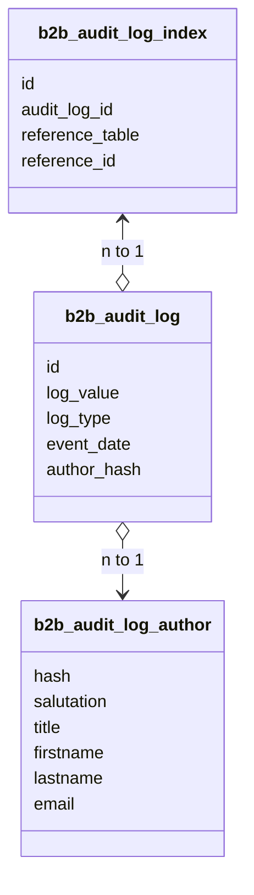

# PRODUCT EXTENSIONS OVERVIEW

Compiled excerpts from the Shopware Developer Documentation snapshot. Prefer live docs at [developer.shopware.com](https://developer.shopware.com/) when in doubt.

---

## Troubleshooting
**Source:** [products/extensions/b2b-suite-migration/execution/troubleshooting.md](https://developer.shopware.com/docs/products/extensions/b2b-suite-migration/execution/troubleshooting.md)  
# Troubleshooting

Address issues during migration with the following steps:

* **Check Errors**: Review the `b2b_components_migration_errors` table for detailed error logs if the status is `Complete with error`. This error is logged when the migration process encounters issues that prevent it from completing successfully.
* **New Records**: If `Has new records` appears in the output of the watch progress command, it indicates that new records were added during the migration process. This can happen if there are changes in the B2B Suite while the migration is running.

## Rollback Migration

If you need to revert the migration, you can roll back the changes made by the migration process. This will remove all migrated data from B2B Commercial and restore the state before migration.

What is this command doing?

* Deletes all records from the B2B Commercial tables that were migrated.
* Resets the migration state, mapping, and error tables to their initial state.
* Delete all messages from the message queue related to the migration.
* All data from B2B Suite will remain intact.

  ```bash
  bin/console b2b:migrate:rollback
  ```

### 1. Rollback Specific Components

Additionally, you can specify which component to roll back. This is useful if you want to revert specific components without affecting others. The name of the component should match the technical name defined in the [configurator](../concept/technical-terms-and-concepts.md#configurator).

```bash
bin/console b2b:migrate:rollback component_name_1 component_name_2
```

* **Example**: To roll back only the `shopping_list` and `quote_management` components:

  ```bash
  bin/console b2b:migrate:rollback quote_management shopping_list
  ```

**Note**: The `employee_management` component is a prerequisite for all other B2B components. Therefore, if you specify `employee_management` in the rollback command, it will roll back all other components as well.

:::info
The order of components listed in the command does not matter for rollback. The command will process all specified components in the reverse order of their migration sequence.
:::

### 2. Force Rollback

If you want to force the rollback command without confirming the deletion of data, you can use the `--force` or `-f` option:

```bash
bin/console b2b:migrate:rollback --force
```

### 3. Batch Size

Just like the migration command, you can specify a maximum batch size for the rollback operation. This is useful for managing memory usage and performance during the rollback.

```bash
bin/console b2b:migrate:rollback --batch-size=500
```

## Error Troubleshooting

If you encounter errors during migration, follow these steps to troubleshoot:

1. **Check Migration Errors**: Review the `b2b_components_migration_errors` table for detailed error logs. This table contains information about any issues encountered during the migration process, including the component, entity, and specific error messages.
2. Because the migration process executes in a batch mode, it is possible that some records were migrated successfully while others failed. In this case, all records that belong to this batch will be marked as `Error` and will not be migrated. All of them will be logged in the `b2b_components_migration_errors` table and link to the `b2b_components_migration_map` table. You can use this information to indicate which records were not migrated and why.

---

---

## References
**Source:** [products/extensions/b2b-suite-migration/references.md](https://developer.shopware.com/docs/products/extensions/b2b-suite-migration/references.md)  
# References

This section provides additional resources and references to help you understand the B2B Suite Migration process better. It includes links to related documentation, command references for executing migration tasks, and other relevant materials.

---

---

## References
**Source:** [products/extensions/b2b-suite-migration/references/references.md](https://developer.shopware.com/docs/products/extensions/b2b-suite-migration/references/references.md)  
# References

This section consolidates key command-line commands used throughout the migration process and provides instructions for configuring the batch size (`Chunk_size`) for message queues. It serves as a quick reference for developers executing or customizing the migration from B2B Suite to B2B Commercial.

## Command-Line Commands

The following table lists all console commands used in the migration process, along with their purpose and relevant handbook sections.

| Command                              | Purpose                                                                                                                                                                                                                                                                                | Reference                                                                         |
|--------------------------------------|----------------------------------------------------------------------------------------------------------------------------------------------------------------------------------------------------------------------------------------------------------------------------------------|-----------------------------------------------------------------------------------|
| `bin/console b2b:migrate:commercial` | Starts the migration process, transferring data from B2B Suite to B2B Commercial.- `--batch-size` to set batch size for deletion. - Arguments: `component_name_1 component_name_2` to specify components to migrate.                                                         | [Running the Migration](../execution/running-migration.md)                        |
| `bin/console b2b:migrate:validate`   | Validates the migration configuration (XML and configurator classes) for correctness.                                                                                                                                                                                                  | [Configuration Validation](../development/validation-and-run.md)                  |
| `bin/console b2b:migrate:progress`   | Displays the current migration status. - Use `--watch` for real-time updates.                                                                                                                                                                                                     | [Running the Migration](../execution/running-migration.md#check-migration-status) |
| `bin/console b2b:migrate:rollback`   | Reverts the migration, clearing migrated data from target tables while preserving source data.- `-f --force` to skip confirmation - `--batch-size` to set batch size for deletion. - Arguments: `component_name_1 component_name_2` to specify components to roll back. | [Troubleshooting](../execution/troubleshooting.md#rollback-migration)             |
::: info
Ensure the message queue worker is running before executing migration commands, as described in [Prerequisites](../execution/prerequisites.md)
:::

## Configuring Batch Size (Chunk size)

A **batch size** is a configuration parameter that determines how many records are processed in a single migration operation. It helps manage memory usage and performance during the migration process, allowing for efficient handling of large datasets.

### Current Configuration

The default batch size is set to 100, but it can be adjusted in several ways:

* By setting the `SHOPWARE_B2B_MIGRATION_BATCH_SIZE` environment variable in the `.env` file.
* By passing the `--batch-size` option when executing the migration command.

### Considerations

* **Smaller Batch Size (e.g., 50)**:
  * Reduces memory usage and load on the database and queue.
  * Suitable for environments with limited resources or when debugging.
  * Increases total migration time due to more frequent batch processing.
* **Larger Batch Size (e.g., 500)**:
  * Speeds up migration for large datasets by processing more records per batch.
  * May increase memory and CPU usage, risking timeouts in constrained environments.
* **Testing**: Test the new batch size in a staging environment to ensure stability.

:::warning
Changing the batch size without testing may lead to performance issues or timeouts. Always validate the configuration after modifications.
:::

---

---

## Role and Permission Mapping
**Source:** [products/extensions/b2b-suite-migration/references/role-permission-mapping.md](https://developer.shopware.com/docs/products/extensions/b2b-suite-migration/references/role-permission-mapping.md)  
*(Body truncated in this bundle; follow the link for the rest.)*

# Role and Permission Mapping

This section documents the role mappings from B2B Suite to B2B Commercial, detailing how permissions and roles are transformed during the migration. Roles define the permissions assigned to employees within the B2B Commercial, and dependencies ensure that related permissions are included to maintain functionality. This reference is essential for developers to understand how roles and permissions are structured in the new system.

## Permission Mapping

Below is the mapping of permissions from B2B Suite to B2B Commercial. Each permission from B2B Suite is mapped to a corresponding permission in B2B Commercial.

::: info
Some permissions in B2B Suite do not actually exist in B2B Commercial, because some features are not available in B2B Commercial. In this case, the permission would be mapped to nearest equivalent permission in B2B Commercial.
:::

| B2B Suite Role          | B2B Commercial Role                         | Dependencies                                                                                       | Category        |
|-------------------------|---------------------------------------------|----------------------------------------------------------------------------------------------------|-----------------|
| `address_assign`        | `organization_unit.shipping_address.create` | `organization_unit.billing_address.create`, `organization_unit.create`, `organization_unit.update` | Address         |
| `address_create`        | `organization_unit.shipping_address.create` | `organization_unit.billing_address.create`, `organization_unit.create`, `organization_unit.update` | Address         |
| `address_delete`        | `organization_unit.shipping_address.delete` | `organization_unit.billing_address.delete`                                                         | Address         |
| `address_detail`        | `organization_unit.shipping_address.update` | `organization_unit.billing_address.update`, `organization_unit.create`, `organization_unit.update` | Address         |
| `address_list`          | `organization_unit.read`                    | `organization_unit.create`, `organization_unit.update`                                             | Address         |
| `address_update`        | `organization_unit.shipping_address.update` | `organization_unit.create`, `organization_unit.update`                                             | Address         |
| `budget_assign`         | `approval_rule.create`                      | None                                                                                               | Budget          |
| `budget_create`         | `approval_rule.create`                      | None                                                                                               | Budget          |
| `budget_delete`         | `approval_rule.delete`                      | None                                                                                               | Budget          |
| `budget_detail`         | `approval_rule.read`                        | None                                                                                               | Budget          |
| `budget_list`           | `approval_rule.read`                        | None                                                                                               | Budget          |
| `budget_update`         | `approval_rule.update`                      | None                                                                                               | Budget          |
| `company_list`          | `organization_unit.read`                    | None                                                                                               | Company         |
| `contact_create`        | `employee.create`                           | `employee.read`, `employee.edit`, `role.read`                                                      | Contact         |
| `contact_delete`        | `employee.delete`                           | `employee.read`, `employee.edit`, `role.read`                                                      | Contact         |
| `contact_detail`        | `employee.read`                             | None                                                                                               | Contact         |
| `contact_list`          | `employee.read`                             | None                                                                                               | Contact         |
| `contact_update`        | `employee.edit`                             | `employee.read`, `role.read`                                                                       | Contact         |
| `contingent_assign`     | `approval_rule.create`                      | None                                                                                               | Contingent      |
| `contingent_create`     | `approval_rule.create`                      | None                                                                                               | Contingent      |
| `contingent_delete`     | `approval_rule.delete`                      | None                                                                                               | Contingent      |
| `contingent_detail`     | `approval_rule.read`                        | None                                                                                               | Contingent      |
| `contingent_list`       | `approval_rule.read`                        | None                                                                                               | Contingent      |
| `contingent_update`     | `approval_rule.update`                      | None                                                                                               | Contingent      |
| `contingentrule_create` | `approval_rule.create`                      | None                                                                                               | Contingent Rule |
| `contingentrule_delete` | `approval_rule.delete`                      | None                                                                                               | Contingent Rule |
| `contingentrule_detail` | `approval_rule.read`                        | None                                                                                               | Contingent Rule |
| `contingentrule_list`   | `approval_rule.read`                        | None                                                                                               | Contingent Rule |
| `contingentrule_update` | `approval_rule.update`                      | None                                                                                               | Contingent Rule |
| `fastorder_create`      | `quote.request`                             | None                                                                                               | Order           |
| `offer_create`          | `quote.request`                             | None                                                                                               | Order           |
| `offer_delete`          | `quote.decline`                             | None                                                                                               | Order           |
| `offer_detail`          | `quote.read.all`                            | None                                                                                               | Order           |
| `offer_list`            | `quote.read.all`                            | `organization_unit.quote.read`                                                                     | Order           |
| `offer_update`          | `quote.request_change`                      | `quote.accept`                                                                                     | Order           |
| `order_create`          | `organization_unit.order.read`              | None                                                                                               | Order           |
| `order_delete`          | `pending_order.approve_decline_all`         | `pending_order.read_all`, `pending_order.approve_decline`                                          | Order           |
| `order_detail`          | `order.read.all`                            | None                                                                                               | Order           |
| `order_list`            | `order.read.all`                            | None                                                                                               | Order           |
| `order_update`          | `order.read.all`                            | None                                                                                               | Order           |
| `role_assign`           | `role.create`                               | `role.read`, `role.edit`                                                                           | Role            |
| `role_create`           | `role.create`                               | `role.read`, `role.edit`                                                                           | Role            |
| `role_delete`           | `role.delete`                               | `role.read`, `role.edit`                                                                           | Role            |
| `role_detail`           | `role.edit`                                 | `role.read`                                                                                        | Role            |
| `role_list`             | `role.read`                                 | None                                                                                               | Role            |
| `role_update`           | `role.edit`                                 | `role.read`                                                                                        | Role            |
| `route_assign`          | `role.create`                               | `role.read`, `role.edit`                                                                           | Route           |
| `route_detail`          | `role.edit`                                 | `role.read`                                                                                        | Route           |
| `route_list`            | `role.read`                                 | None                                                                                               | Route           |

:::info
In case you want to override the default mapping, either to add new permissions or change existing ones, you can do so by subscribing to the `Shopware\Commercial\B2B\B2BSuiteMigration\Core\Domain\Event\B2BMigrationPermissionEvent` event. This allows you to customize permission mapping according to your specific requirements.
:::

## Role Mapping

B2B Suite and B2B Commercial have different approaches to role assignments, impacting how roles are migrated:

* **B2B Suite**: An employee can be assigned multiple roles, each with specific permissions, and may also have individual permissions not tied to a role.
* **B2B Commercial**: An employee is assigned a single role that contains all their permissions.

To handle this difference, the migration process uses the following cases to assign roles to employees in B2B Commercial:

1. **Single Role in B2B Suite**\
   If an employee in B2B Suite has only one role, that role is migrated to B2B Commercial as is, retaining its permissions and dependencies as defined in the role mapping table below.

2. **Multiple Roles in B2B Suite**\
   If an employee has multiple roles, these roles are merged into a single role in B2B Commercial. The new role includes all permissions from the original roles (includi

… **Truncated.** Full document: https://developer.shopware.com/docs/products/extensions/b2b-suite-migration/references/role-permission-mapping.md


---

## B2B Suite
**Source:** [products/extensions/b2b-suite.md](https://developer.shopware.com/docs/v6.6/products/extensions/b2b-suite.md)  
# B2B Suite

To build a robust B2B solution within the Shopware ecosystem, refer to this section which details every concept from scratch, including installation, system architecture, basic conventions, example plugins, Core, Administration, and Storefront component operations.

This section covers Shopware 6 related information on our B2B Suite. However, for information on Shopware 5, go through [B2B Suite Shopware 5 documentation](https://developers.shopware.com/shopware-enterprise/b2b-suite/).

---

---

## Concepts
**Source:** [products/extensions/b2b-suite/concept.md](https://developer.shopware.com/docs/v6.6/products/extensions/b2b-suite/concept.md)  
# Concepts

B2B Suite is a comprehensive software solution that facilitates efficient and seamless business-to-business transactions. It provides organizations with a complete set of tools and functionalities to enhance communication, collaboration, and transaction management with their trading partners. In this section, you will explore the key components of the B2B Suite, including its system architecture, the basic conventions of B2B, the method structure, and the line item list.

---

---

## Basic Conventions
**Source:** [products/extensions/b2b-suite/concept/basic-conventions.md](https://developer.shopware.com/docs/v6.6/products/extensions/b2b-suite/concept/basic-conventions.md)  
# Basic Conventions

## Codebase conventions

List of naming conventions the B2B Suite complies to:

| Group                                              | Practice                                                                             |
|----------------------------------------------------|--------------------------------------------------------------------------------------|
| DI Container                                       | All container ids look like `b2b_*.*`                                                |
| The first asterisk is the component name           |                                                                                      |
| The second asterisk is a class name abbreviation   |                                                                                      |
| Database                                           | All table names start with `b2b_`                                                    |
| All table names are in singular                    |                                                                                      |
| All field and table names are in snake case        |                                                                                      |
| Attributes                                         | All attribute names start with `swag_b2b_`                                           |
| Subscriber                                         | All subscriber methods are named in accordance with their function, not to the event |
| Tests                                              | All test methods are in snake case                                                   |
| All test methods start with `test_`                |                                                                                      |
| Templates                                          | All new layout modules are wrapped in `b2b--*` class containers                      |
| Modules reuse the template style of Shopware       |                                                                                      |
| CSS Selectors                                      | Three levels of selector depth as max                                                |
| Twig Blocks                                        | `` empty blocks are in one line    |                                                                                     |
| JavaScript                                         | The B2B Suite is written in TypeScript                                               |
| Storefront plugins                                 | File names end with \*.plugin.ts                                                      |
| Interfaces                                         | File names start with `I`, e.g., `IAjaxPanelEvent.ts`                                |
| Snippets                                           | The root snippet key is `b2b`                                                        |

## Entity naming conventions

Certain domain entities, such as Contact, Contingent Rule, and others, have different naming conventions in the B2B UI and the codebase. To make things easier to understand, here is a comparison between these entities' B2B UI to their corresponding names in English Storefronts:

| English term (Display name)                        | B2B-Suite term (Entity name)                      |
|----------------------------------------------------|---------------------------------------------------|
| Company administrator                              | Debtor                                            |
| Employee                                           | Contact                                           |
| Cart details                                       | Positions                                         |
| Quick order                                        | Fastorder                                         |
| Quote                                              | Offers                                            |
| Purchase restriction                               | Contingent                                        |
| Order restriction                                  | Contingent rule                                   |
| Product restriction                                | Contingent restrictions                           |

You can use the table above as a reference to identify a domain entity in the codebase when working with the B2B storefront.

---

---

## Line Item List
**Source:** [products/extensions/b2b-suite/concept/line-item-list.md](https://developer.shopware.com/docs/v6.6/products/extensions/b2b-suite/concept/line-item-list.md)  
# Line Item List

## Description

The LineItemList component is the central representation of product lists in the B2B Suite. The main design choices are:

* Central abstraction of product lists
* Minimal knowledge and inheritance of Shopware core services and data structures
* Persistable lists of products
* Guaranteed audit logging

The component is used across multiple different child components throughout the B2B Suite.


| Icon                                      |Description|
|---------------------------------------------|------------|
|  | Represents component |
|  | Represent context objects that contain the component specific information |
|  | Represents child components |

## Internal data structure

The component provides `LineItemList` and `LineItemReference` as its central entities. As the name suggests, a `LineItemReference` references line items.
In most cases, these line items will be products but may include other types (e.g., vouchers) that are valid purchasable items.

To make this work with the Shopware cart, order, and product listing, the `LineItemReferences` themselves can be set up by different entities.
Schematically a list that is not yet ordered looks like this:


Whereas an ordered list looks like this:


As you can see, each `LineItemReference` borrows data from Shopware data structures, but a user of these objects can solely
depend on the `LineItemReference` and `LineItemList` objects for unified access.

This basic pattern revolves against other data structures in the component as well.


As you can see, the specific data is abstracted away through the order context object.
An object that can either be generated during the Shopware checkout process or be created dynamically through the API.
The rule applies: *The B2B-Suite may store or provide ID's, without having an actual concept of what they refer to*.

These central data containers help provide a forward compatible structure for many B2B components.

---

---

## Method Structure
**Source:** [products/extensions/b2b-suite/concept/method-structure.md](https://developer.shopware.com/docs/v6.6/products/extensions/b2b-suite/concept/method-structure.md)  
# Method Structure

## Replaceable functions

Almost every function in the B2B Suite is replaceable, but not all are guaranteed to be compatible with every version change.
Only the framework domain has guaranteed rules to limit the changes of each method per release version.
The methods in other domains have dependencies on the Shopware core and have to be adjusted if changes are made.

### Protected functions in framework

Protected functions with an `@internal` comment aren't guaranteed to be compatible or changed to minor version changes.

Example:

```php
// <b2b root>/components/Common/Controller/GridHelper.php
<?php declare(strict_types=1);

namespace Shopware\B2B\Common\Controller;

[...]

class GridHelper
{    
    [...]
    
    /**
     * @internal
     */
    protected function extractLimitAndOffset(Request $request, SearchStruct $struct): void
    {
        $struct->offset = $request->getParam('offset', null);
        $struct->limit = $request->getParam('limit', null);
    }

    [...]
}
```

### Public functions in framework

Public functions are made to be compatible and not changed until the major version changes.

### TypeScript functions

TypeScript functions always have access modifiers and are completely typed with their arguments and return types.
Furthermore, the same deprecation rules you already know from other parts of Shopware apply here.

Example:

```typescript
export default class {
    public addClass(element: HTMLElement, name: string): void {
        element.classList.add(name);
    }
}
```

---

---

## System Architecture
**Source:** [products/extensions/b2b-suite/concept/system-architecture.md](https://developer.shopware.com/docs/v6.6/products/extensions/b2b-suite/concept/system-architecture.md)  
# System Architecture

The B2B Suite is a collection of loosely coupled, mostly uniform components packaged with a small example plugin and a common library.

## Component layering

A single component with all layers and the maximum of allowed dependencies looks like this:


The responsibilities from bottom to top:

| Layer       | Description                                                                                                                                                                                                      |
|-------------|------------------------------------------------------------------------------------------------------------------------------------------------------------------------------------------------------------------|
| Shop-Bridge | Bridges the broad Shopware interfaces to the specific framework requirements Implements interfaces provided by the frameworkSubscribes to Shopware events and calls framework services |
| Framework   | Contains the B2B specific Domain Requirements CRUD and assignment service logicThe specific use cases of the component                                                                  |
| REST-API    | REST access to the services                                                                                                                                                                                      |
| Frontend    | Controller as a service for frontend access                                                                                                                                                                      |
| B2B plugin  | Storefront access to the services                                                                                                                                                                               |

> Please notice: Apart from the framework, all other layers and dependencies are optional.

## Component dependencies

At the time of this writing, there were 39 different components, all built with the same structure. We sorted these components into four different complexes:

### Common - The one exception

There is a small library of shared functionality. It contains a few commonly used technical implementations shared between most components like exception classes, repository helpers, a dependency manager, or a REST-API router.

### User management

The user management is based on the `StoreFrontAuthentication` component and then provides `Contact` and `Debtor` entities which have `Address`es and `Role`s. These entities are mostly informational and CRUD based. Other parts of the system only depend on the `StoreFrontAuthentication` component but not the specific implementations as *Debtor* or *Contact*.


### ACL

The `acl` implementation is connected to most other entities provided by the B2B Suite.


### Order and contingent management

`ContingentGroups`s are connected to `Debtor`s and can have `acl` settings based on `Role`s or `Contact`s. `Order`s are personalized through the `StoreFrontAuthentication`.


### The whole picture

Most dependencies are directly derived from requirements. So, the dependency flow of the components should follow the basic business needs. There are a few exceptions, mainly the M:N assignment components, each representing a reset in complexity where a complex feature resolves itself into a context object for another use case. You can think of it like that.

* A Debtor can be created and updated through a service **=>** *The debtor is an **entity***
* A Debtor may be an entity connected to many workflows by its id **=>** *The Debtor is just the **context***

So, for the sake of completeness, this is the whole picture:


Everything you should get from that is that there is a left to right propagation of dependencies. The components on the left side can be useful entirely without the components on the right side.

---

---

## Concepts
**Source:** [products/extensions/b2b-suite/concepts.md](https://developer.shopware.com/docs/v6.4/products/extensions/b2b-suite/concepts.md)  
# Concepts

---

---

## Basic Conventions
**Source:** [products/extensions/b2b-suite/concepts/basic-conventions.md](https://developer.shopware.com/docs/v6.4/products/extensions/b2b-suite/concepts/basic-conventions.md)  
# Basic Conventions

This is the list of naming conventions the B2B Suite complies to:

| Group                                                                                              | Practice                                                                            |
|----------------------------------------------------------------------------------------------------|-------------------------------------------------------------------------------------|
| DI Container                                                                                       | All container ids look like `b2b_*.*`                                               |
| The first asterisk is the component name                                                            |                                                                                     |
| The second asterisk is a class name abbreviation                                                   |                                                                                     |
| Database                                                                                           | All table names start with `b2b_`                                                   |
| All table names are in singular                                                                |                                                                                     |
| All field and table names are in snake case                                                         |                                                                                     |
| Attributes                                                                                         | All attribute names start with `swag_b2b_`                                          |
| Subscriber                                                                                         | All subscriber methods are named in accordance with their function, not to the event  |
| Tests                                                                                              | All test methods are in snake case                                                  |
| All test methods start with `test_`                                                                |                                                                                     |
| Templates                                                                                          | All new layout modules are wrapped in `b2b--*` class containers                     |
| Modules reuse the template style of Shopware                                                       |                                                                                     |
| CSS Selectors                                                                                      | Three levels of selector depth as max                                                   |
| Twig Blocks                                                                                        |  empty blocks are in one line |                                                                                     |
| JavaScript                                                                                         | The B2B Suite is written in TypeScript                                              |
| Storefront plugins                                                                                 | File names end with \*.plugin.ts                                                     |
| Interfaces                                                                                         | File names start with `I`, e.g., `IAjaxPanelEvent.ts`                                |
| Snippets                                                                                           | The root snippet key is `b2b`                                                       |

---

---

## Line Item List
**Source:** [products/extensions/b2b-suite/concepts/line-item-list.md](https://developer.shopware.com/docs/v6.4/products/extensions/b2b-suite/concepts/line-item-list.md)  
# Line Item List

## Description

The LineItemList component is the central representation of product lists in the B2B Suite. The main design choices are:

* Central abstraction of product lists
* Minimal knowledge and inheritance of Shopware core services and data structures
* Persistable lists of products
* Guaranteed audit logging

The component is used across multiple different child components throughout the B2B Suite.


The yellow colored blocks represent components, while the smaller green ones are context objects that contain the component specific information.

## Internal data structure

The component provides `LineItemList` and `LineItemReference` as its central entities. As the name suggests, a `LineItemReference` references line items.
In most cases, these line items will be products but may include other types (e.g., vouchers) that are valid purchasable items.

To make this work with the Shopware cart, order, and product listing, the `LineItemReferences` themselves can be set up by different entities.
Schematically a list that is not yet ordered looks like this:


Whereas an ordered list looks like this:


As you can see, each `LineItemReference` borrows data from Shopware data structures, but a user of these objects can solely
depend on the `LineItemReference` and `LineItemList` objects for unified access.

This basic pattern revolves against other data structures in the component as well.


As you can see, the specific data is abstracted away through the order context object.
An object that can either be generated during the Shopware checkout process or be created dynamically through the API.
The rule applies: *The B2B-Suite may store or provide ID's, without having an actual concept of what they refer to*.

These central data containers help provide a forward compatible structure for many B2B components.

---

---

## Method Structure
**Source:** [products/extensions/b2b-suite/concepts/method-structure.md](https://developer.shopware.com/docs/v6.4/products/extensions/b2b-suite/concepts/method-structure.md)  
# Method Structure

## Replaceable functions

Almost every function in the B2B Suite is replaceable, but not all are guaranteed to be compatible with every version change.
Only the framework domain has guaranteed rules to limit the changes of each method per release version.
The methods in other domains have dependencies on the Shopware core and have to be adjusted if changes are made.

### Protected functions in framework

Protected functions with an `@internal` comment aren't guaranteed to be compatible or changed to minor version changes.

Example:

```php
// <b2b root>/components/Common/Controller/GridHelper.php
<?php declare(strict_types=1);

namespace Shopware\B2B\Common\Controller;

[...]

class GridHelper
{    
    [...]
    
    /**
     * @internal
     */
    protected function extractLimitAndOffset(Request $request, SearchStruct $struct): void
    {
        $struct->offset = $request->getParam('offset', null);
        $struct->limit = $request->getParam('limit', null);
    }

    [...]
}
```

### Public functions in framework

Public functions are made to be compatible and not changed until the major version changes.

### TypeScript functions

TypeScript functions always have access modifiers and are completely typed with their arguments and return types.
Furthermore, the same deprecation rules you already know from other parts of Shopware apply here.

Example:

```typescript
export default class {
    public addClass(element: HTMLElement, name: string): void {
        element.classList.add(name);
    }
}
```

---

---

## System Architecture
**Source:** [products/extensions/b2b-suite/concepts/system-architecture.md](https://developer.shopware.com/docs/v6.4/products/extensions/b2b-suite/concepts/system-architecture.md)  
# System Architecture

The B2B Suite is a collection of loosely coupled, mostly uniform components packaged with a small example plugin and a common library.

## Component layering

A single component with all layers and the maximum of allowed dependencies looks like this:


The responsibilities from bottom to top:

| Layer       | Description                                                                                                                                                                                                      |
|-------------|------------------------------------------------------------------------------------------------------------------------------------------------------------------------------------------------------------------|
| Shop-Bridge | Bridges the broad Shopware interfaces to the specific framework requirements Implements interfaces provided by the frameworkSubscribes to Shopware events and calls framework services |
| Framework   | Contains the B2B specific Domain Requirements CRUD and assignment service logicThe specific use cases of the component                                                                  |
| REST-API    | REST access to the services                                                                                                                                                                                      |
| Frontend    | Controller as a service for frontend access                                                                                                                                                                      |
| B2B plugin  | Storefront access to the services                                                                                                                                                                               |

> Please notice: Apart from the framework, all other layers and dependencies are optional.

## Component dependencies

At the time of this writing, there were 39 different components, all built with the same structure. We sorted these components into four different complexes:

### Common - The one exception

There is a small library of shared functionality. It contains a few commonly used technical implementations shared between most components like exception classes, repository helpers, a dependency manager, or a REST-API router.

### User management

The user management is based on the `StoreFrontAuthentication` component and then provides `Contact` and `Debtor` entities which have `Address`es and `Role`s. These entities are mostly informational and CRUD based. Other parts of the system only depend on the `StoreFrontAuthentication` component but not the specific implementations as *Debtor* or *Contact*.


### ACL

The `acl` implementation is connected to most other entities provided by the B2B Suite.


### Order and contingent management

`ContingentGroups`s are connected to `Debtor`s and can have `acl` settings based on `Role`s or `Contact`s. `Order`s are personalized through the `StoreFrontAuthentication`.


### The whole picture

Most dependencies are directly derived from requirements. So, the dependency flow of the components should follow the basic business needs. There are a few exceptions, mainly the M:N assignment components, each representing a reset in complexity where a complex feature resolves itself into a context object for another use case. You can think of it like that.

* A Debtor can be created and updated through a service **=>** *The debtor is an **entity***
* A Debtor may be an entity connected to many workflows by its id **=>** *The Debtor is just the **context***

So, for the sake of completeness, this is the whole picture:


Everything you should get from that is that there is a left to right propagation of dependencies. The components on the left side can be useful entirely without the components on the right side.

---

---

## Guides
**Source:** [products/extensions/b2b-suite/guides.md](https://developer.shopware.com/docs/v6.6/products/extensions/b2b-suite/guides.md)  
# Guides

This section will explore the B2B Suite installation process and the essential components - Core, Storefront, and Administration required for B2B operations.

---

---

## Administration
**Source:** [products/extensions/b2b-suite/guides/administration.md](https://developer.shopware.com/docs/v6.6/products/extensions/b2b-suite/guides/administration.md)  
# Administration

B2B Suite Administration modules are built following the official [Shopware Administration](https://developer.shopware.com/docs/guides/plugins/plugins/administration/) documentation. For a more in-depth guide, please refer to the [User documentation](https://docs.shopware.com/en/shopware-6-en/extensions/b2b-suite-administration).

---

---

## Core
**Source:** [products/extensions/b2b-suite/guides/core.md](https://developer.shopware.com/docs/v6.6/products/extensions/b2b-suite/guides/core.md)  
# Core

The B2B Suite Core component includes features such as dependency injection, REST API, CRUD service, audit log, exception handling, currency management, entity-based access control, storefront authentication, and more. These features enable efficient B2B transactions, data management, security, and integration with other systems.

---

---

## Assignment Service
**Source:** [products/extensions/b2b-suite/guides/core/assignment-service.md](https://developer.shopware.com/docs/v6.6/products/extensions/b2b-suite/guides/core/assignment-service.md)  
# Assignment Service

## Pattern

A repeating pattern used throughout the B2B Suite is the Assignment service.
The B2B Suite ships with many new entities and therefore provides the means to connect them to each other. This is done through M:N assignments.

The diagram below shows the usually implemented objects with their outside dependencies.


## Repository

Again the repository is the exclusive access layer to the storage engine.
Contrary to CRUD operations, there is no object but just plain integers (the primary keys).
The default repository will have these three methods relevant for the assignment:

```php
<?php declare(strict_types=1);

namespace Shopware\B2B\RoleContact\Framework;

use Doctrine\DBAL\Connection;
use Shopware\B2B\Common\Repository\DbalHelper;

class RoleContactRepository
{
    public function removeRoleContactAssignment(int $roleId, int $contactId)
    {
        [...]
    }

    public function assignRoleContact(int $roleId, int $contactId)
    {
        [...]
    }

    public function isMatchingDebtorForBothEntities(int $roleId, int $contactId): bool
    {
        [...]
    }
```

## Service

Services are even smaller. They contain the two relevant methods for assignment.
Internally they will check if the assignment is even allowed and throw exceptions if not.

```php
<?php declare(strict_types=1);

namespace Shopware\B2B\RoleContact\Framework;

/**
 * Assigns roles to contacts M:N
 */
class RoleContactAssignmentService
{
    public function assign(int $roleId, int $contactId)
    {
        [...]
    }

    public function removeAssignment(int $roleId, int $contactId)
    {
        [...]
    }
}
```

---

---

## Audit Log
**Source:** [products/extensions/b2b-suite/guides/core/audit-log.md](https://developer.shopware.com/docs/v6.6/products/extensions/b2b-suite/guides/core/audit-log.md)  
# Audit Log

[Download](../example-plugins/B2bAcl.zip) a plugin showcasing the topic.

## Description

The B2B Suite provides a general audit log that can be implemented in every component.
The audit log component can save different log types and author information like first name, last name, and email.
It provides a one-to-many association index.
The database structure is described in the graphic below:



As you can see, the database structure is very flat.
In the `b2b_audit_log` table, we save a log type and a serialized *AuditLogValueEntity*.
All required author information is saved in the `b2b_audit_log_author` table.

The `b2b_audit_log_index` saves all association data between an audit log and affected entities.
For example, if you change an order position, it would be nice to show this information in the main order view.

## A simple example

In this example, we will increase the quantity of an order position.
To create an audit log, you can use the following snippet:

```php
$auditLogValue = new AuditLogValueDiffEntity();
$auditLogValue->newValue = 'newValue';
$auditLogValue->oldValue = 'oldValue';

$auditLog = new AuditLogEntity();
$auditLog->logValue = $auditLogValue->toDatabaseString();
$auditLog->logType = 'changeOrderPosition';

$orderReferenceIndex = new AuditLogIndexEntity();
$orderReferenceIndex->referenceId = 10;
$orderReferenceIndex->referenceTable = OrderContextRepository::TABLE_NAME;

$this->auditLogService->createAuditLog($auditLog, $identity, [$orderReferenceIndex]);
```

With the following snippet, you can get all available audit logs:

```php
$auditLogSearchStruct = new AuditLogSearchStruct();
$auditLogs = $this->auditLogService->fetchList(OrderContextRepository::TABLE_NAME, 10, $auditLogSearchStruct);
```

---

---

## Storefront Authentication
**Source:** [products/extensions/b2b-suite/guides/core/authentication.md](https://developer.shopware.com/docs/v6.6/products/extensions/b2b-suite/guides/core/authentication.md)  
# Storefront Authentication

[Download](../example-plugins/B2bAuth.zip) a plugin showcasing how to add a provider. You can [download](../example-plugins/B2bLogin.zip) a plugin that exchange the login value.

## Description

The Storefront authentication component provides a common B2B interface for login, ownership, and authentication processes.
It extends the Shopware default authentication component and provides several benefits for developers:

* Use multiple different source tables for authentication
* Provide a unified Identity interface
* Provide a context for ownership

A schematic overview of the central usage of the Authentication component looks like this:


| Icon  |   Type   |                                                                                  Description                                                                                  |
|--------|:--------:|:-----------------------------------------------------------------------------------------------------------------------------------------------------------------------------:|
|   | Provider | Provides user identities. For example, a contact and a debtor are both valid B2B-Accounts that log in through the same user interface but do not share a common storage table |
|  | Context  |                            Uses the `Identity` as a context to determine what data should be shown. Usually, a simple debtor or tenant-like filter                             |
|  |  Owner   |                                                          Uses the `Identity` to store the specific owner of a record                                                          |

## Working with the identity as a context

The `StoreFrontAuthentication` component provides an identity representing the currently logged-in user,
that can easily be retrieved and inspected through `Shopware\B2B\StoreFrontAuthentication\Framework\AuthenticationService`.

Typically, you want to use the identity as a global criterion to secure so that the data does not leak from one debtor to another.
Therefore, you should add a `context_owner_id` to your MySQL table design.

```sql
CREATE TABLE IF NOT EXISTS `b2b_my` (
  `id` INT(11) NOT NULL AUTO_INCREMENT,
  `context_owner_id` INT(11) NOT NULL,
  [...]

  PRIMARY KEY (`id`),

  INDEX `b2b_my_auth_owner_id_IDX` (`context_owner_id`),

  CONSTRAINT `b2b_my_auth_owner_id_FK` FOREIGN KEY (`context_owner_id`)
    REFERENCES `b2b_store_front_auth` (`id`) ON UPDATE NO ACTION ON DELETE CASCADE
)
```

This modifier column allows you to store the context owner independent of the actual source table of the context owner.
You can access the current context owner always through the identity.

```php
[...]

/** @var AuthenticationService $authenticationService */
$authenticationService = $this->container->get('b2b_front_auth.authentication_service');

if (!$authenticationService->isB2b()) {
    throw new \Exception('User must be logged in');
}

$ownershipContext = $authenticationService
    ->getIdentity()
    ->getOwnershipContext();

echo 'The context owner id ' . $ownershipContext->contextOwnerId . '\n';

[...]
```

You can even load the whole identity through the `AuthenticationService`.

```php
[...]

$ownerIdentity = $authenticationService->getIdentityByAuthId($contextOwnerId);

[...]
```

## Working with the identity as an owner

Sometimes you want to flag records to be owned by certain identities.

```sql
CREATE TABLE IF NOT EXISTS `b2b_my` (
    `id` INT(11) NOT NULL AUTO_INCREMENT,
    `auth_id` INT(11) NULL DEFAULT NULL,

    [...]

    PRIMARY KEY (`id`),

    CONSTRAINT `b2b_my_auth_user_id_FK` FOREIGN KEY (`auth_id`)
      REFERENCES `b2b_store_front_auth` (`id`) ON UPDATE NO ACTION ON DELETE CASCADE
)
```

To fill this column, we again access the current identity, but instead of the `contextOwnerId`, we access the `authId`.

```php
[...]

$ownershipContext = $authenticationService
    ->getIdentity()
    ->getOwnershipContext();

echo 'The common identity id ' . $ownershipContext->authId . '\n';

[...]
```

The B2B Suite views the context owner as some kind of admin that, from the perspective of the authentication component, it owns all individual users and their data *(Of course the ACL component may overwrite this)*.

Therefore, commonly used queries are:

```php
/** @var Connection $connection */
$connection = $this->container->get('dbal_connection');
/** @var Identity $identity */
$identity = $this->container->get('b2b_front_auth.authentication_service')
    ->getIdentity();

// get all records relative to the user
$connection->fetchAll(
    'SELECT * FROM b2b_my my WHERE my.auth_id = :authId',
    [
        'authId' => $identity->getOwnershipContext()->authId->getValue(),
    ]
);

// get all records relative to the user's context owner
$connection->fetchAll(
    'SELECT * FROM b2b_my my WHERE my.auth_id IN (SELECT auth_id FROM b2b_store_front_auth WHERE context_owner_id = :identityContextOwnerId)',
    [
        'identityContextOwnerId' => $identity->getOwnershipContext()->contextOwnerId->getValue(),
    ]
);

// get all records relative to the current user or if the owner is logged in to the owner
$connection->fetchAll(
    'SELECT * FROM b2b_my my WHERE my.auth_id IN (SELECT auth_id FROM b2b_store_front_auth WHERE auth_id = :authId OR context_owner_id = :identityContextOwnerId)',
    [
        'authId' => $identity->getOwnershipContext()->authId,
        'identityContextOwnerId' => $identity->getOwnershipContext()->authId,
    ]
);
```

## Working with the identity as a provider

If you need another type of user, you can follow the `Contact` and `Debtor` implementations.
This guide will show you which classes need to be extended.

### Implement your own identity

The B2B Suites `Shopware\B2B\StoreFrontAuthentication\Framework\Identity` is an interface which means that every user has to re-implement it.

The interface acts as a factory for different contexts that are used throughout the B2B Suite. It contains:

* B2B Suite ids and data (e.g., auth id, context owner)
* Shopware glue (e.g., customer group id, password hash)

Therefore, it can be seen as a man in the middle between Shopware and the B2B Suite.

Example implementations are either: `Shopware\B2B\Debtor\Framework\DebtorIdentity` or `Shopware\B2B\Contact\Framework\ContactIdentity`.

### Implement your own CredentialsBuilder

In the *CredentialsBuilder*, you create the *CredentialsEntity*, which is used for logging in the B2B Suite.

```php
    public function createCredentials(array $parameters): AbstractCredentialsEntity
    {
        $entity = new CredentialsEntity();
    
        $entity->email = $parameters['email'];
        $entity->salesChannelId = IdValue::create($this->contextProvider->getSalesChannelContext()->getSalesChannel()->getId());
        $entity->customerScope = $this->systemConfigService->get('core.systemWideLoginRegistration.isCustomerBoundToSalesChannel');

        return $entity;
    }
```

The *CredentialsEntity* represents the data that is used for logging.

### Implement your own AuthenticationIdentityLoader

Next, you have to provide the means to register your identity on login. This is done through implementing `Shopware\B2B\StoreFrontAuthentication\Framework\AuthenticationIdentityLoaderInterface`.

The *LoginContextService* is passed as an argument to help you retrieve and create the appropriate auth and
context owner ids. Notice that the interface is designed to be chained to create dependent auth ids on the fly.

```php
[...]
    public function fetchIdentityByCredentials(CredentialsEntity $credentialsEntity, LoginContextService $contextService, bool $isApi = false): Identity
    {
        if (!$credentialsEntity->email) {
            throw new NotFoundException('Unable to handle context');
        }
        
        $entity = $this->yourEntityRepository->fetchOneByEmail($email);

        /** @var DebtorIdentity $debtorIdentity */
        $debtorIdentity = $this->debtorRepository->fetchIdentityById($entity->debtor->id, $contextService);
        
        $authId = $contextService->getAuthId(YourEntityRepository::class, $entity->id, $debtorIdentity->getAuthId());
        
        $this->yourEntityRepository->setAuthId($entity->id, $authId);
        
        return new YourEntityIdentity($authId, (int) $entity->id, YourEntityRepository::TABLE_NAME, $entity, $debtorIdentity);
    }
[...]
```

Finally, you register your authentication provider (in our case a repository) as a tagged service through the DIC.

```xml
<service id="b2b_my.contact_authentication_identity_loader" class="Shopware\B2B\My\AuthenticationIdentityLoader">
    [...]

    <tag name="b2b_front_auth.authentication_repository" />
</service>
```

## Sales representative

Both sales representative identities extend the debtor identity.
The sales representative identity is to log in as clients (debtors).

After logging in, the sales representative gets the sales representative debtor's identity.
This structure allows the original sales representative identity to be identified when logged in as a client.

As a sales representative debtor, he is actually logged in as the client with additional possibilities.

---

---

## CRUD Service
**Source:** [products/extensions/b2b-suite/guides/core/crud-service.md](https://developer.shopware.com/docs/v6.6/products/extensions/b2b-suite/guides/core/crud-service.md)  
# CRUD Service

[Download](../example-plugins/B2bAcl.zip) a plugin showcasing the topic.

## Pattern

A repeating pattern used throughout the B2B Suite is the CRUD service.
The B2B Suite ships with its own entities and therefore provides the means to create, update and delete them.
Although these entities may have special requirements, an exclusively used naming convention and pattern are used to implement all CRUD operations.

The diagram below shows the usually implemented objects with their outside dependencies:


## Entity

There always is an entity representing the data that has to be written.
Entities are uniquely identifiable storage objects with public properties and only a few convenience functions.
An example entity looks like this:

```php
<?php declare(strict_types=1);

namespace Shopware\B2B\Role\Framework;

use Shopware\B2B\Common\CrudEntity;
use Shopware\B2B\Common\IdValue;
use function get_object_vars;
use function property_exists;

class RoleEntity implements CrudEntity
{
    public IdValue $id;

    public string $name;

    public IdValue $contextOwnerId;

    public int $left;

    public int $right;

    public int $level;

    public bool $hasChildren;

    public array $children = [];

    public function __construct()
    {
        $this->id = IdValue::null();
        $this->contextOwnerId = IdValue::null();
    }

    public function isNew(): bool
    {
        return $this->id instanceof NullIdValue;
    }

    public function toDatabaseArray(): array
    {
        return [
            'id' => $this->id,
            'name' => $this->name,
            'context_owner_id' => $this->contextOwnerId->getStorageValue(),
        ];
    }

    public function fromDatabaseArray(array $roleData): CrudEntity
    {
        $this->id = IdValue::create($roleData['id']);
        $this->name = (string) $roleData['name'];
        $this->contextOwnerId = IdValue::create($roleData['context_owner_id']);
        $this->left = (int) $roleData['left'];
        $this->right = (int) $roleData['right'];
        $this->level = (int) $roleData['level'];
        $this->hasChildren = (bool) $roleData['hasChildren'];

        return $this;
    }

    public function setData(array $data)
    {
        foreach ($data as $key => $value) {
            if (!property_exists($this, $key)) {
                continue;
            }

            $this->{$key} = $value;
        }
    }

    public function toArray(): array
    {
        $vars = get_object_vars($this);
        
        foreach ($vars as $key => $var) {
            if ($var instanceof IdValue) {
                $vars[$key] = $var->getValue();
            }
        }

        return $vars;
    }

    public function jsonSerialize(): array
    {
        return $this->toArray();
    }
}
```

The convenience interface `Shopware\B2B\Common\CrudEntity` is not required to assign context to the object.
Furthermore, the definition of whether an entity can be stored or retrieved from storage can only securely be determined if corresponding repository methods exist.

## Repository

There always is a repository that handles all storage and retrieval functionality.
Contrary to Shopware default repositories, they do not use the ORM and do not expose queries.
A sample repository might look like this:

```php
<?php declare(strict_types=1);

namespace Shopware\B2B\Role\Framework;

use Doctrine\DBAL\Connection;
use Shopware\B2B\Acl\Framework\AclReadHelper;
use Shopware\B2B\Common\Controller\GridRepository;
use Shopware\B2B\Common\IdValue;
use Shopware\B2B\Common\Repository\CanNotInsertExistingRecordException;
use Shopware\B2B\Common\Repository\CanNotRemoveExistingRecordException;
use Shopware\B2B\Common\Repository\CanNotUpdateExistingRecordException;

class RoleRepository
{
    private Connection $connection;

    public function __construct(Connection $connection)
    {
        $this->connection = $connection;
    }

    /**
     * @throws NotFoundException
     */
    public function fetchOneById(int $id): CrudEntity
    {
        [...]
    }

    /**
     * @throws CanNotInsertExistingRecordException
     */
    public function addRole(RoleEntity $role): RoleEntity
    {
        [...]
    }

    /**
     * @throws CanNotUpdateExistingRecordException
     */
    public function updateRole(RoleEntity $role): RoleEntity
    {
        [...]
    }

    /**
     * @throws CanNotRemoveExistingRecordException
     */
    public function removeRole(RoleEntity $roleEntity): RoleEntity
    {
        [...]
    }
}
```

Since it seems to be a sufficient workload for a single object to interact with the storage layer, there is no additional validation. Everything that is solvable in PHP only is not part of this object.
Notice that the exceptions are all typed and can be caught easily by the implementation code.

## Validation service

Every entity has a corresponding `ValidationService`

```php
<?php declare(strict_types=1);

namespace Shopware\B2B\Role\Framework;

use Shopware\B2B\Common\Validator\ValidationBuilder;
use Shopware\B2B\Common\Validator\Validator;
use Symfony\Component\Validator\Validator\ValidatorInterface;

class RoleValidationService
{
    private ValidationBuilder $validationBuilder;

    private ValidatorInterface $validator;

    public function __construct(
        ValidationBuilder $validationBuilder,
        ValidatorInterface $validator
    ) {
        $this->validationBuilder = $validationBuilder;
        $this->validator = $validator;
    }

    public function createInsertValidation(RoleEntity $role): Validator
    {

        [...]

    }

    public function createUpdateValidation(RoleEntity $role): Validator
    {

        [...]

    }
```

It provides assertions that can be evaluated by a controller and printed to the user.

## CRUD service

Services are the real entry point to an entity. They are reusable and not dependent on any specific I/O mechanism.

They are not allowed to depend on HTTP implementations directly,
and therefore provide their own request classes that contain the source independent required raw data.
Notice that they are also used to initially filter a possibly larger request,
and they allow just the right data points to enter the service,
although the contents are validated by the `ValidationService`.

```php
<?php declare(strict_types=1);

namespace Shopware\B2B\Role\Framework;

use Shopware\B2B\Common\Service\AbstractCrudService;
use Shopware\B2B\Common\Service\CrudServiceRequest;

class RoleCrudService extends AbstractCrudService
{
    [...]

    public function createNewRecordRequest(array $data): CrudServiceRequest
    {
        return new CrudServiceRequest(
            $data,
            [
                'name',
                'contextOwnerId',
                'parentId',
            ]
        );
    }

    public function createExistingRecordRequest(array $data): CrudServiceRequest
    {
        return new CrudServiceRequest(
            $data,
            [
                'id',
                'name',
                'contextOwnerId',
            ]
        );
    }

    [...]
}
```

With a filled `CrudServiceRequest` you then call the actual action you want the service to perform.
Keep in mind that there may be other parameters required. For example, an `Identity` determines if the currently logged-in user may access the requested data.

```php
<?php declare(strict_types=1);

namespace Shopware\B2B\Role\Framework;

use Shopware\B2B\Common\Service\AbstractCrudService;
use Shopware\B2B\Common\Service\CrudServiceRequest;
use Shopware\B2B\Common\Validator\ValidationException

class RoleCrudService extends AbstractCrudService
{
    [...]

    /**
     * @throws ValidationException
     */
    public function create(CrudServiceRequest $request, OwnershipContext $ownershipContext): RoleEntity
    {
        [...]
    }

    /**
     * @throws ValidationException
     */
    public function update(CrudServiceRequest $request, OwnershipContext $ownershipContext): RoleEntity
    {
        [...]
    }

    public function remove(CrudServiceRequest $request, OwnershipContext $ownershipContext): RoleEntity
    {
        [...]
    }
    
    public function move(CrudServiceRequest $request, OwnershipContext $ownershipContext): RoleEntity
    {
        [...]
    }
}
```

---

---

## Currency
**Source:** [products/extensions/b2b-suite/guides/core/currency.md](https://developer.shopware.com/docs/v6.6/products/extensions/b2b-suite/guides/core/currency.md)  
# Currency

## Introduction

The Currency component provides the means for currency calculation in the B2B Suite. The following graph shows components depending on this component:


| Icon                                      |Description|
|---------------------------------------------|------------|
|  | Represents component |
|  | Represent context objects that contain the component specific information |
|  | Represents child components |

## Context

The Currency component provides an additional Context object (`Shopware\B2B\Currency\Framework\CurrencyContext`) containing a currency factor.
You can retrieve the default Context, which always contains the currently selected currency factor through the `Shopware\B2B\Currency\Framework\CurrencyService`.

```php
<?php declare(strict_types=1);

use Shopware\B2B\Currency\Framework\CurrencyContext;
use Shopware\B2B\Currency\Framework\CurrencyService;

class TestController
{
    private CurrencyService $currencyService;

    public function __construct(
        CurrencyService $currencyService
    ) {
        $this->currencyService = $currencyService;
    }

    public function testAction(): array
    {
        return [
            'currencyContext' => $this->currencyService->createCurrencyContext(),
        ];
    }
```

This way, you can either store the currency factor with a newly provided amount or retrieve recalculated data from your repository.

## Entity

All recalculable entities must implement the interface `Shopware\B2B\Currency\Framework\CurrencyAware`, which provides the means to access the currency data.

```php
use Shopware\B2B\Currency\Framework\CurrencyAware;

class MyEntity implements CurrencyAware
{
    public float $amount1;

    public float $amount2;

    private float $factor;

    public function getCurrencyFactor(): float
    {
        return $this->factor;
    }

    public function setCurrencyFactor(float $factor)
    {
        $this->factor = $factor;
    }

    /**
     * @return string[]
     */
    public function getAmountPropertyNames(): array
    {
        return [
            'amount1',
            'amount2',
        ];
    }
}
```

## Repository

The repository has to guarantee that every entity retrieved from storage has valid and, if necessary, recalculated money values.
The Currency component provides `Shopware\B2B\Currency\Framework\CurrencyCalculator` to help with this promise.
So a typical repository looks like this:

```php
<?php declare(strict_types=1);

use Shopware\B2B\Currency\Framework\CurrencyCalculator;

class Repository
{
    private CurrencyCalculator $currencyCalculator;

    public function __construct(
        CurrencyCalculator $currencyCalculator
    ) {
        $this->currencyCalculator = $currencyCalculator;
    }
}
```

### Calculating in PHP (preferred)

To recalculate an entity amount, the calculator provides two convenient functions.

* `recalculateAmount` for a single entity:

```php
    public function fetchOneById(int $id, CurrencyContext $currencyContext): CurrencyAware
    {
        [...] // load entity from Database

        $this->currencyCalculator->recalculateAmount($entity, $currencyContext);

        return $entity;
    }
```

* `recalculateAmounts` to recalculate an array of entities:

```php
    public function fetchList([...], CurrencyContext $currencyContext): array
    {
        [...] // load entities from Database

        //recalculate with the current amount
        $this->>currencyCalculator->recalculateAmounts($entities, $currencyContext);

        return $entities;
    }
```

### Calculating in SQL

Although calculation in PHP is the preferred way, it may sometimes be necessary to recalculate the amounts in SQL.
This is the case if you, for example, use a `GROUP BY` statement and try to create a sum.
For this case, the Currency component creates a SQL calculation snippet.

So if your original snippet looked like this:

```php
    public function fetchAmount(int $budgetId): float
    {
        return (float) $this-connection->fetchColumn(
            'SELECT SUM(amount) AS sum_amount FROM b2b_budget_transaction WHERE budget_id=:budgetId',
            ['budgetId' => $budgetId]
        )
    }
```

But it should actually look like this:

```php
    public function fetchAmount(int $budgetId, CurrencyContext $currencyContext): float
    {
        $transactionSnippet = $this->currencyCalculator
            ->getSqlCalculationPart('amount', 'currency_factor', $currencyContext);

        return (float) $this-connection->fetchColumn(
            'SELECT SUM(' . $transactionSnippet . ') AS sum_amount FROM b2b_budget_transaction WHERE budget_id=:budgetId',
            ['budgetId' => $budgetId]
        )
    }
```

---

---

## Dependency Injection
**Source:** [products/extensions/b2b-suite/guides/core/dependency-injection.md](https://developer.shopware.com/docs/v6.6/products/extensions/b2b-suite/guides/core/dependency-injection.md)  
# Dependency Injection

## Shopware DIC

The B2B Suite registers with the [DIC](../../../../../guides/plugins/plugins/plugin-fundamentals/dependency-injection) from Symfony.
Be sure you are familiar with the basic usage patterns and practices.
Especially [Service Decoration](../../../../../guides/plugins/plugins/plugin-fundamentals/adjusting-service#decorating-the-service) is an equally important extension point.

## Dependency Injection Extension B2B

The B2B Suite provides an abstract `DependencyInjectionConfiguration` class that is used throughout the Suite as an initializer of DI-Contents across all components.

```php
<?php declare(strict_types=1);

namespace Shopware\B2B\Common;

use Symfony\Component\DependencyInjection\Compiler\CompilerPassInterface;

abstract class DependencyInjectionConfiguration
{
    /**
     * @return string[] array of service xml files
     */
    abstract public function getServiceFiles(): array;

    /**
     * @return CompilerPassInterface[]
     */
    abstract public function getCompilerPasses(): array;

    /**
     * @return DependencyInjectionConfiguration[] child components required by this component
     */
    abstract public function getDependingConfigurations(): array;
}
```

Every macro layer of every component defines its own dependencies.
That way, you require the utmost components you want to use, and every other dependency is injected automatically.

For example, this code will enable the contact component of your plugin.

```php
<?php declare(strict_types=1);

namespace MyB2bPlugin;

use Shopware\B2B\Common\B2BContainerBuilder;
use Shopware\B2B\Contact\Framework\DependencyInjection\ContactFrameworkConfiguration
use Shopware\Components\Plugin;
use Symfony\Component\DependencyInjection\ContainerBuilder;

class MyB2bPlugin extends Plugin
{
    [...]

    public function build(ContainerBuilder $container)
    {
        $containerBuilder = B2BContainerBuilder::create();
        $containerBuilder->addConfiguration(new ContactFrameworkConfiguration());
        $containerBuilder->registerConfigurations($container);
    }
}
```

## Tags

Additionally, the B2B Suite heavily uses [Service Tags](https://symfony.com/doc/current/service_container/tags.html) as a more modern replacement for collect events.
They are used to help you extend central B2B services with custom logic. Take a look at the example plugins and their usage of that extension mechanism.

---

---

## Entity based ACL
**Source:** [products/extensions/b2b-suite/guides/core/entity-acl.md](https://developer.shopware.com/docs/v6.6/products/extensions/b2b-suite/guides/core/entity-acl.md)  
*(Body truncated in this bundle; follow the link for the rest.)*

# Entity based ACL

## Introduction

One of the core concepts of the B2B Suite is that all entities can be restricted through ACL settings.
Therefore, the package contains a component named ACL which provides a common base implementation for access restriction.

To guarantee a high level of flexibility, the ACL component has no dependencies on other parts of the framework.
**At its core, ACL is an implementation of an M:N relation management** in the database.
They provide the means of creating the tables, storing and removing the relation, and reading the information. This is implemented in a way that multiple relations (e.g., user and role) can be resolved to a single `true`/`false` result or joined in a query.

## Architecture

In order to understand the design decisions of the ACL component, we first take a look at the different requirements imposed on ACL.
As you can see in the graphic below, access control is basically a concern of every technical layer of the application.


The base ACL component described in this document provides functionality for repository filtering and service checks.
The [Authentication component](authentication) provides the context for the currently logged-in user and the [ACL route](../storefront/acl-routing) component then provides the ability to secure routes and means of inspection for allowed routes.

## Naming

| Name    |             Description             |
|---------|:-----------------------------------:|
| Context |          The user or role           |
| Subject | The entity that is allowed/denied |

## Data structure

The ACL is represented as M:N relation tables in the database and always looks like this:

```sql
CREATE TABLE `b2b_acl_*` (
    `id` INT(11) NOT NULL AUTO_INCREMENT,
    `entity_id` INT(11) NOT NULL, 
    `referenced_entity_id` INT(11) NOT NULL,
    `grantable` TINYINT(4) NOT NULL DEFAULT '0',
    
    [...]
);
```

| Case              |                                Description                                |
|-------------------|:-------------------------------------------------------------------------:|
| No record exists  |       The referenced entity is not accessible for the given context       |
| A record exists   |         The referenced entity is accessible for the given context         |
| Grantable is `1`  | The context may grant access to the referenced entity for other contexts  |

### Address ACL example

For example, let's look at the schema part responsible for storing the address access rights.


As you can see, the addresses (subject) can be allowed in two distinct contexts, either through a *role* or through a *contact*. In between these entities are two *ACL* tables holding the M:N relations.
On the left, you see the *ContactRole* table. This table holds the information of which contact is assigned to what roles.

This allows for a single query to select all allowed addresses of a particular user combined from the role and direct assignments.

## Usage

For this part, we stay at the address example. Since the ACL is directly implemented through the storage layer, there is no service
but just a repository for access and data manipulation. So we need an instance of `Shopware\B2B\Acl\Framework\AclRepository`.
The address ACL repository can be retrieved through the DIC by the `b2b_address.acl_repository` key.

The repository then provides the following methods. If you are already familiar with other ACL implementations, most methods will look quite familiar.

```php
<?php declare(strict_types=1);

namespace Shopware\B2B\Acl\Framework;

use Shopware\B2B\Acl\Framework\AclQuery;
use Shopware\B2B\Acl\Framework\AclUnsupportedContextException;
use Shopware\B2B\Common\IdValue;

class AclRepository
{
    /**
     * @throws AclUnsupportedContextException
     */
    public function allow($context, IdValue $subjectId, bool $grantable = false): void
    { 
        [...] 
    }

    /**
     * @throws AclUnsupportedContextException
     */
    public function allowAll($context, array $subjectIds, bool $grantable = false): void 
    { 
        [...] 
    }

    /**
     * @throws AclUnsupportedContextException
     */
    public function deny($context, IdValue $subjectId): void
    {
        [...]
    }

    /**
     * @throws AclUnsupportedContextException
     */
    public function denyAll($context, array $subjectIds): void
    {
        [...]
    }

    /**
     * @throws AclUnsupportedContextException
     */
    public function isAllowed($context, IdValue $subjectId): bool 
    { 
        [...] 
    }

    /**
     * @throws AclUnsupportedContextException
     */
    public function isGrantable($context, IdValue $subjectId): bool 
    { 
        [...] 
    }

    /**
     * @throws AclUnsupportedContextException
     * @return IdValue[]
     */
    public function getAllAllowedIds($context): array 
    { 
        [...] 
    }

    /**
     * @throws AclUnsupportedContextException
     */
    public function fetchAllGrantableIds($context): array 
    {
        [...] 
    }

    /**
     * @throws AclUnsupportedContextException
     */
    public function fetchAllDirectlyIds($context): array 
    { 
        [...] 
    }

    /**
     * @throws AclUnsupportedContextException
     */
    public function getUnionizedSqlQuery($context): AclQuery 
    { 
        [...] 
    }
}
```

Important commonalities are:

All methods act on a context. This context must be one of the following types:

* `Shopware\B2B\Contact\Framework\ContactEntity`
* `Shopware\B2B\StoreFrontAuthentication\Framework\Identity`
* `Shopware\B2B\StoreFrontAuthentication\Framework\OwnershipContext`
* `Shopware\B2B\Role\Framework\RoleEntity`
* `Shopware\B2B\Role\Framework\RoleAclGrantContext`
* `Shopware\B2B\Contact\Framework\ContactAclGrantContext`

The *AclGrantContext* and its accompanied *AclContextProvider* allow a component to use and select arbitrary ACL targets without
depending on the explicit implementation.

Depending on the provided context, the methods decide whether they utilize both tables or just one.

* Reading usually utilizes both.
* Writing utilizes only the directly related table.

If the provided context is not supported, a `Shopware\B2B\Acl\Framework\AclUnsupportedContextException` is thrown.

Debtors, for example, are unknown to the ACL, so all debtor identities will trigger the exception.

### Modifying entity access

A standard use case is to allow records to a user, this simple code snippet can do this:

```php
$aclAddressRepository = $this->container->get('b2b_address.acl_repository');
$contactRepository = $this->container->get('b2b_contact.repository');

$contact = $contactRepository->fetchOneById(1);

$aclAddressRepository->allow(
    $contact, // the contact 
    22, // the id of the address
    true // whether the contact may grant access to other contacts
);
```

We can then deny the access just by this:

```php
$aclAdressRepository->deny(
    $contact, // the contact 
    22, // the id of the address
);
```

or just set it not grantable, by

```php
$aclAdressRepository->allow(
    $contact, // the contact 
    22, // the id of the address
    false // whether the contact may grant access to other contacts
);
```

### Reading entity access

If you want to know whether a certain contact can access an entity, you can call `isAllowed`.

```php
$aclAdressRepository->isAllowed(
    $contact, // the contact 
    22, // the id of the address
);
```

Or you just want to check whether an entity can be granted by a contact.

```php
$aclAdressRepository->isGrantable(
    $contact, // the contact 
    22, // the id of the address
);
```

One of the more complex problems you might face is that you want to filter a query by ACL assignments (frontend listing).

This can be achieved by this snippet:

```php
<?php declare(strict_types=1);

namespace My\Namespace;

use Doctrine\DBAL\Query\QueryBuilder;
use Shopware\B2B\Acl\Framework\AclUnsupportedContextException;
use Shopware\B2B\StoreFrontAuthentication\Framework\OwnershipContext;

protected function applyAcl(OwnershipContext $context, QueryBuilder $query): void
{
    try {
        $aclQuery = $this->aclRepository->getUnionizedSqlQuery($context);

        $query->innerJoin(
            self::TABLE_ALIAS,
            '(' . $aclQuery->sql . ')',
            'acl_query',
            self::TABLE_ALIAS . '.id = acl_query.referenced_entity_id'
        );

        foreach ($aclQuery->params as $name => $value) {
            $query->setParameter($name, $value);
        }
    } catch (AclUnsupportedContextException $e) {
        // nth
    }
}
```

The `getUnionizedSqlQuery` method returns a `Shopware\B2B\Acl\Framework\AclQuery` instance that can then be used as a join in the DBAL `QueryBuilder`.
If you want to inspect the query yourself, be warned that it might look strange due to some performance tuning for MySQL.

## Extending the ACL

### Add a new Subject

The most common use case will be that you want to extend the ACL to span around your own entity.
How this is done can be observed in many places throughout the B2B Suite.
So let's take a look at the addresses again.

You first need to define the relations from role and contact to your entity.
This is achieved by creating small classes that contain particular information:

```php
<?php declare(strict_types=1);

namespace Shopware\B2B\Address\Framework;

use Shopware\B2B\Acl\Framework\AclTable;
use Shopware\B2B\Contact\Framework\AclTableContactContextResolver;

class AddressContactAclTable extends AclTable
{
    public function __construct()
    {
        parent::__construct(
            'contact_address', // name suffix
            'b2b_debtor_contact', // context table
            'id', // context primary key
            's_user_addresses', // subject table name
            'id' // subject primary key
        );
    }

    protected function getContextResolvers(): array
    {
        return [
            new AclTableContactContextResolver(),
        ];
    }
}
```

This is the implementation utilized to set up the `contact<->address` relation. In `__construct`, we set up the table and relation properties.
The `getContextResolver` method returns a utility class responsible for extracting the `id` from different context objects.
See further down below for additional information on this interface.

An identical class exists for the `role<->address` relation.

Now we need to tell the B2B Suite to create the necessary tables. In Shopware, this must be done during the plugin installation process.
Because the container is not yet set up with the B2B Suite services, we use a static factory method in the following code:

```php
use Shopware\B2B\Acl\Framework\AclDdlService;
use Shopware\B2B\Address\Framework\AddressContactTable;

AclDdlService::create()->createTable(new AddressContactTable());
```

Now the table exists, but we must still make the table definition accessible through the DIC, so the ACL component can set up appropriate repositories.
This is achieved through a tag in the service definition:

```xml
<service id="b2b_address.contact_acl_table" class="Shopware\B2B\Address\Framework\AddressContactAclTable">
    <tag name="b2b_acl.table"/>
</service>
```

Finally, we need to register the service in the DIC. This is done by this XML snippet:

```xml
<service id="b2b_address.acl_repository" class="Shopware\B2B\Acl\Framework\AclRepository">
    <factory service="b2b_acl.repository_factory" method="createRepository"/>
    <argument type="string">s_user_addresses</argument>
</service>
```

There we are; the addresses are ACL-ified entities.

### Add a new context

Since the ACL is so loosely coupled with the B2B Suite, it is possible to create your own complete subset of restrictions based on
other contexts than *contact* and *role*. For this, you have to create a different `Shopware\B2

… **Truncated.** Full document: https://developer.shopware.com/docs/v6.6/products/extensions/b2b-suite/guides/core/entity-acl.md


---

## Exception
**Source:** [products/extensions/b2b-suite/guides/core/exception.md](https://developer.shopware.com/docs/v6.6/products/extensions/b2b-suite/guides/core/exception.md)  
# Exception

## Translatable exception

To show the customer a translated exception message in the Shopware error controller, the exception must implement the `B2BTranslatableException` Interface.

```php
<?php declare(strict_types=1);

namespace Shopware\B2B\Common\Repository;

use DomainException;
use Shopware\B2B\Common\B2BTranslatableException;
use Throwable;

class NotAllowedRecordException extends DomainException implements B2BTranslatableException
{
    private string $translationMessage;

    private array $translationParams;

    public function __construct(
        $message = '',
        string $translationMessage = '',
        array $translationParams = [],
        $code = 0,
        Throwable $previous = null
    ) {
        parent::__construct($message, $code, $previous);

        $this->translationMessage = $translationMessage;
        $this->translationParams = $translationParams;
    }

    public function getTranslationMessage(): string
    {
        return $this->translationMessage;
    }

    public function getTranslationParams(): array
    {
        return $this->translationParams;
    }
}
```

The snippet key is a modified `translationMessage`.

```php
preg_replace('([^a-zA-Z0-9]+)', '', ucwords($exception->getTranslationMessage()))
```

Variables in the message will be replaced by the `string_replace()` method.
The identifiers are the keys of the `translationParams` array.

---

---

## Listing Service
**Source:** [products/extensions/b2b-suite/guides/core/listing-service.md](https://developer.shopware.com/docs/v6.6/products/extensions/b2b-suite/guides/core/listing-service.md)  
# Listing Service

[Download](../example-plugins/B2bAcl.zip) a plugin showcasing the topic.

## Pattern

A repeating pattern used throughout the B2B Suite is listing service.
The B2B Suite ships without an ORM but still has use for semi-automated basic listing and filtering capabilities.
To reduce the necessary duplications, there are common implementations for this.

The diagram below shows the usually implemented objects with their outside dependencies.


## Search struct

The globally used `SearchStruct` is a data container moving the requested filter, sorting, and pagination data from the HTTP request to the repository/query.

```php
<?php declare(strict_types=1);

namespace Shopware\B2B\Common\Repository;

use Shopware\B2B\Common\Filter\Filter;

class SearchStruct
{
    /**
     * @var Filter[]
     */
    public array $filters = [];

    public int $limit;

    public int $offset;

    public string $orderBy;

    public string $orderDirection = 'ASC';

    public string $searchTerm;
}
```

A more special `SearchStruct` is the `CompanyFilterStruct`. See the [Company](../../../../../products/extensions/b2b-suite/guides/storefront/company) module for more details.

## Repository

The repository has to implement `Shopware\B2B\Common\Controller\GridRepository` and therefore have these three methods:

```php
<?php declare(strict_types=1);

namespace My\Namespace;

use Shopware\B2B\Common\Controller\GridRepository;

class Repository implements GridRepository
{
    public function getMainTableAlias(): string;

    /**
     * @return string[]
     */
    public function getFullTextSearchFields(): array;

    public function getAdditionalSearchResourceAndFields(): array;
}
```

But more important than that, it has to handle the data encapsulated in `Shopware\B2B\Common\Repository\SearchStruct` and be able to provide a list of items and a total count of all accessible records.

```php
<?php declare(strict_types=1);

namespace My\Namespace;

use Shopware\B2B\Company\Framework\CompanyFilterStruct\ContactSearchStruct;
use Shopware\B2B\StoreFrontAuthentication\Framework\OwnershipContext;

class Repository
{
    public function fetchList(OwnershipContext $context, ContactSearchStruct $searchStruct): array
    {
        [...]
    }

    public function fetchTotalCount(OwnershipContext $context, ContactSearchStruct $contactSearchStruct): int
    {
        [...]
    }
}
```

Since this task is completely storage engine related, there is no further service abstraction, and every user of this functionality accesses the repository directly.

## Grid helper

The GridHelper binds the HTTP request data to the `SearchStruct` and provides the canonical build grid state array to be consumed by the frontend.

```php
<?php declare(strict_types=1);

namespace Shopware\B2B\Common\Controller;

use Shopware\B2B\Common\MvcExtension\Request;
use Shopware\B2B\Common\Repository\SearchStruct;

class GridHelper
{
    public function extractSearchDataInStoreFront(
        Request $request, 
        SearchStruct $struct
    ): void {
        [...]
    }

    public function getGridState(
        Request $request,
        SearchStruct $struct,
        array $data,
        int $maxPage,
        int $currentPage
    ): array {
        [...]
    }
}
```

---

---

## Overloading Classes
**Source:** [products/extensions/b2b-suite/guides/core/overload-classes.md](https://developer.shopware.com/docs/v6.6/products/extensions/b2b-suite/guides/core/overload-classes.md)  
# Overloading Classes

[Download](../example-plugins/B2bServiceExtension.zip) a plugin showcasing the topic.

## Description

To add new functionality or overload existing classes to change functionality, the B2B Suite uses the [Dependency Injection](../../../../../guides/plugins/plugins/plugin-fundamentals/dependency-injection) as an extension system instead of events and hooks, which Shopware uses.

### How does a services.xml look like

In the release package, our service.xml looks like this:

```xml
<?xml version="1.0" encoding="UTF-8" ?>
<container xmlns="http://symfony.com/schema/dic/services"
           xmlns:xsi="http://www.w3.org/2001/XMLSchema-instance"
           xsi:schemaLocation="http://symfony.com/schema/dic/services http://symfony.com/schema/dic/services/services-1.0.xsd">
    <parameters>
        <parameter key="b2b_role.repository_class">Shopware\B2B\Role\Framework\RoleRepository</parameter>
        [...]
    </parameters>
    <services>
        <service id="b2b_role.repository_abstract" abstract="true">
            <argument type="service" id="dbal_connection"/>
            <argument type="service" id="b2b_common.repository_dbal_helper"/>
        </service>
        [...]

        <service id="b2b_role.repository" class="%b2b_role.repository_class%" parent="b2b_role.repository_abstract"/>
        [...]
    </services>
</container>
```

For development (GitHub), it looks like this:

```xml
<?xml version="1.0" encoding="UTF-8" ?>
<container xmlns="http://symfony.com/schema/dic/services"
           xmlns:xsi="http://www.w3.org/2001/XMLSchema-instance"
           xsi:schemaLocation="http://symfony.com/schema/dic/services http://symfony.com/schema/dic/services/services-1.0.xsd">
    <services>
        <service id="b2b_role.repository" class="Shopware\B2B\Role\Framework\RoleRepository">
            <argument type="service" id="dbal_connection"/>
            <argument type="service" id="b2b_common.repository_dbal_helper"/>
        </service>

        <service id="b2b_role.grid_helper" class="Shopware\B2B\Common\Controller\GridHelper">
            <argument type="service" id="b2b_role.repository"/>
        </service>

        <service id="b2b_role.crud_service" class="Shopware\B2B\Role\Framework\RoleCrudService">
            <argument type="service" id="b2b_role.repository"/>
            <argument type="service" id="b2b_role.validation_service"/>
        </service>

        <service id="b2b_role.validation_service" class="Shopware\B2B\Role\Framework\RoleValidationService">
            <argument type="service" id="b2b_common.validation_builder"/>
            <argument type="service" id="validator"/>
        </service>

        <service id="b2b_role.acl_route_table" class="Shopware\B2B\Role\Framework\AclRouteAclTable">
            <tag name="b2b_acl.table"/>
        </service>
    </services>
</container>
```

We generate the new services.xml files for our package automatically.

### How do I use it

This is how the [whole system work](http://symfony.com/doc/current/service_container/parent_services.html).

You only have to change the parameter or overload the service id.

Your service file could look like this:

```xml
<?xml version="1.0" encoding="UTF-8" ?>
<container xmlns="http://symfony.com/schema/dic/services"
           xmlns:xsi="http://www.w3.org/2001/XMLSchema-instance"
           xsi:schemaLocation="http://symfony.com/schema/dic/services http://symfony.com/schema/dic/services/services-1.0.xsd">
    <services>
        <service id="b2b_role.repository" class="Your/Class" parent="b2b_role.repository_abstract">
            <argument id="Your/own/class" type="service"/>
        </service>
        [...]
    </services>
</container>
```

Just define a class with the same service id as our normal class and add our abstract class as the parent.
After that, add your own arguments or override ours.

An example of your class could look like this:

```php
<?php declare(strict_types=1);
    
[...]
    
class YourRoleRepository extends RoleRepository
{
    public array $myService;
        
    public function __construct()
    {
        $args = func_get_args();
        
        $this->myService = array_pop($args);       
        
        parent::__construct(... $args);
    }
         
    public function updateRole(RoleEntity $role): RoleEntity
    {
        // your stuff
    }
}
```

You extend the B2B class and just change any action you need.

### What is the profit

By building our extension system this way, we can still add and delete constructor arguments without breaking your plugins.
Also, we don't have to add too many interfaces to the B2B Suite.

### What are the problems with this approach

Since we don't know which plugin is loaded first, we can't say which class overload another one.
To prevent any random errors, you should only overload each class once.

---

---

## REST API
**Source:** [products/extensions/b2b-suite/guides/core/rest-api.md](https://developer.shopware.com/docs/v6.6/products/extensions/b2b-suite/guides/core/rest-api.md)  
# REST API

[Download](../example-plugins/B2bRestApi.zip) a plugin showcasing the topic.

We use swagger.io for the documentation of our B2B Suite endpoints.
The created [swagger.json](https://gitlab.com/shopware/shopware/enterprise/b2b/-/blob/minor/swagger.json) file can be displayed with [Swagger UI](https://swagger.io/tools/swagger-ui/).

## Description

The B2B Suite comes with its extension to the REST-API.
Contrary to Shopware own implementation that makes heavy use
of the Doctrine ORM the B2B Suite reuses the same services defined for the Storefront.

## A simple example

A REST-API Controller is just a plain old PHP-Class, registered to the DIC.
An action is a public method suffixed with `Action`.
It always gets called with the request implementation derived from Shopware default `Shopware\B2B\Common\MvcExtension\Request` as a parameter.

```php
<?php declare(strict_types=1);

namespace My\Namespace;

use Shopware\B2B\Common\MvcExtension\Request;

class MyApiController
{
    public function helloAction(Request $request): array
    {
        return ['message' => 'hello']; // will automatically be converted to JSON
    }
}
```

## Adding the route

Contrary to the default Shopware API, the B2B API provides deeply nested routes.
All routes can be found at `http://my-shop.de/api/b2b`.
To register your own routes, you must add a `RouteProvider` to the routing service.

First, we create the routing provider containing all routing information.
Routes themselves are defined as simple arrays, just like this:

```php
<?php declare(strict_types=1);

namespace My\Namespace\DependencyInjection;

use Shopware\B2B\Common\Routing\RouteProvider;

class MyApiRouteProvider implements RouteProvider
{
    public function getRoutes(): array
    {
        return [
            [
                'GET', // the HTTP method
                '/my/hello', // the sub-route will be concatenated to http://my-shop.de/api/b2b/my/hello
                'my.api_controller', // DIC controller id
                'hello' // action method name
            ],
        ];
    }
}
```

Now the route provider and the controller are registered to the DIC.

```xml
<service id="my.controller" class="My\Namespace\MyApiController"/>

<service id="my.api_route_provider" class="My\Namespace\DependencyInjection\MyApiRouteProvider">
    <tag name="b2b_common.rest_route_provider"/>
</service>
```

Notice that the route provider is tagged as a `b2b_common.rest_route_provider`.
This tag triggers when the route is registered.

## Complex routes

The used route parser is [FastRoute](https://github.com/nikic/FastRoute#defining-routes), which supports more powerful features that can also be used by the B2B API.
Refer to this linked documentation to learn more about placeholders and placeholder parsing.

If you want to use parameters, you have to define an order in which the parameters should be passed to the action:

```php
[
    'GET', // the HTTP method
    '/my/hello/{name}', // the sub-route will be concatenated to http://my-shop.de/api/b2b/my/hello/world
    'my.api_controller', // DIC controller id
    'hello' // action method name,
    ['name'] // define name as the first argument
]
```

And now, you can use the placeholders value as a parameter:

```php
<?php declare(strict_types=1);

public function helloAction(string $name, Request $request)
{
    return ['message' => 'hello ' . $name]; // will automatically be converted to JSON
}
```

---

---

## Store API
**Source:** [products/extensions/b2b-suite/guides/core/store-api.md](https://developer.shopware.com/docs/v6.6/products/extensions/b2b-suite/guides/core/store-api.md)  
# Store API

We use swagger.io for the documentation of our B2B Suite endpoints. The created [swagger.json](https://gitlab.com/shopware/shopware/enterprise/b2b/-/blob/minor/swagger.json) file can be displayed with [Swagger UI](https://swagger.io/tools/swagger-ui/).

## Description

The B2B Suite is compatible with the Shopware 6 Store API.

## Authentication

Every request needs two headers:

* **`sw-context-token`**: First, you will need to authenticate as a customer by sending a `POST` request to the `/account/login` route to obtain a context token.
* **`sw-access-key`**: The access key for the Store API can be found in the Administration when editing a SalesChannel.

Refer to the [Store API](https://shopware.stoplight.io/docs/store-api/ZG9jOjEwODA3NjQx-authentication-and-authorisation) guide to learn more about authentication.

## Route pattern

The route pattern is basically the same as in the Admin API but without the identity identifier because the identity is fetched from the context token.

### Route replacement examples

* `/api/b2b/debtor/address/type/` becomes `/store-api/b2b/address/type/`
* `/api/b2b/debtor/offer` becomes `/store-api/b2b/offer`
* `/api/b2b/debtor/order` becomes `/store-api/b2b/order`

---

---

## Example Plugins
**Source:** [products/extensions/b2b-suite/guides/example-plugins.md](https://developer.shopware.com/docs/v6.6/products/extensions/b2b-suite/guides/example-plugins.md)  
# Example Plugins

Here is a list of example plugins with descriptions to extend the B2B Suite:

| Plugin                                 | Description                                                                                            |
|----------------------------------------|--------------------------------------------------------------------------------------------------------|
| [B2bAcl](B2bAcl.zip)                   | A plugin to show our ACL implementation incl. frontend usage. It also shows the CRUD and listing usage |
| [B2bAjaxPanel](B2bAjaxPanel.zip)       | Example to show our Ajax Panels and how to use them                                                    |
| [B2bAuditLog](B2bAuditLog.zip)         | A implementation of our audit log component                                                            |
| [B2bAuth](B2bAuth.zip)                 | Login as a certain user                                                                                |
| [B2bLogin](B2bLogin.zip)               | Exchange the E-Mail login with a staff-number login                                                    |
| [B2bRestApi](B2bRestApi.zip)           | Plugin to show the `RestApi` Routing                                                                   |
| [B2bServiceExtension](B2bServiceExtension.zip) | Plugin to show how to extend a Service                                                         |
| [B2bTemplateExtension](B2bTemplateExtension.zip) | Plugin to show how to extend the **SwagB2bPlatform** templates                               |

---

---

## Installation
**Source:** [products/extensions/b2b-suite/guides/installation.md](https://developer.shopware.com/docs/v6.6/products/extensions/b2b-suite/guides/installation.md)  
# Installation

## General

We provide a Docker based solution, also mainly used by our developers.
These containers are also used in our continuous integration process. The supported functions are for both systems equal if the host system is based on Linux.

If you want to install the B2B Suite for the production environment, your system must fit the defined [system requirements](https://docs.shopware.com/en/shopware-6-en/first-steps/system-requirements?category=shopware-6-en/getting-started) for the Shopware Core.

### Minimum requirements

The B2B Suite is based on the minimum requirements of the Shopware Core.

Specific requirements for different versions B2B Suite:

* B2B Suite from 4.6.0 till 4.6.9
  * Shopware 6.4
  * PHP 7.4.3
  * MySQL 5.7.21
  * MariaDB 10.3.22

* B2B Suite 4.7.0 and above
  * Shopware 6.5

## Installation on a Linux based system

### Docker (recommended)

As a minimum requirement, we need a docker runtime with version 1.12.\* or higher. [psh.phar](https://github.com/shopwareLabs/psh) provides the following available Docker commands:

```bash
./psh.phar docker:start     # start & build containers
./psh.phar docker:ssh       # ssh access web server
./psh.phar docker:ssh-mysql # ssh access mysql
./psh.phar docker:status    # show running containers and network bridges
./psh.phar docker:stop      # stop the containers
./psh.phar docker:destroy   # clear the whole docker cache
```

To start the Docker environment, just type in your command line.

```bash
./psh.phar docker:start
```

Several containers are booted. Later you can login into your web container with:

```bash
./psh.phar docker:ssh
```

After that, you can start the initialization process by typing:

```bash
./psh.phar init
```

After a few minutes, our test environment should be available under the address [10.100.200.46](http://10.100.200.46).

To get a complete list of available commands, you can use:

```bash
./psh.phar
```

## Installation on an OS X based system

The following commands are available to create a MAC setup. Apache webserver, MySQL, and Ant are required. You can use the brew package manager to install them.

```bash
./psh.phar mac:init         # build installation
./psh.phar mac:start        # start apache, mysql 
./psh.phar mac:stop         # stop apache, mysql
./psh.phar mac:restart      # restart apache, mysql
```

You can change the database configuration in your own *.psh.yaml* file.

```yaml
mac:
    paths:
      - "dev-ops/mac/actions"
    const:
      DB_USER: "USERNAME"
      DB_PASSWORD: "PASSWORD"
      DB_HOST: "DB_HOST"
      SW_HOST: "SWHost"
```

For a better explanation, use the provided *.psh.yaml.dist* file as an example.

### Common

Once the environment has been booted successfully, you can use the common scripts to setup Shopware.

```bash
./psh.phar clear # remove vendor components and previously set state
./psh.phar init # init Composer, install plugins
./psh.phar unit # execute test suite
```

---

---

## Storefront
**Source:** [products/extensions/b2b-suite/guides/storefront.md](https://developer.shopware.com/docs/v6.6/products/extensions/b2b-suite/guides/storefront.md)  
# Storefront

The B2B Suite Storefront component includes features like Ajax panel, product search, complex views, model component, company management, ACL routing, and extensibility options for customization and enhanced user-friendly interface for B2B interactions.

---

---

## ACL and Routing
**Source:** [products/extensions/b2b-suite/guides/storefront/acl-routing.md](https://developer.shopware.com/docs/v6.6/products/extensions/b2b-suite/guides/storefront/acl-routing.md)  
# ACL and Routing

The ACL Routing component allows you to block Controller Actions for B2B users.
It relies on and extends the technologies already defined by the ACL component.
To accomplish this, the component directly maps an `action` in a given `controller` to a `resource` (= entity type) and `privilege` (= class of actions).
There are two core actions you should know: `index` and `detail`, as you can see in the following acl-config example below.

## Registering routes

All routes that need access rights need to be stored in the database.
The B2B Suite provides a service to simplify this process.
For it to work correctly, you need an array in a specific format structured like this:

```php
$myAclConfig =  [
    'contingentgroup' => //resource name
    [
        'B2bContingentGroup' => // controller name
        [
            'index' => 'list', // action name => privilege name
            [...]
            'detail' => 'detail',
        ],
    ],
];
```

This configuration array can then be synced to the database by using this service during installation:

```php
Shopware\B2B\AclRoute\Framework\AclRoutingUpdateService::create()
    ->addConfig($myAclConfig);
```

This way, you can easily create and store the resources.
Of course, to show a nice frontend, you must also provide snippets for translation.
The snippets get automatically created from resource and privilege names and are prefixed with `_acl_`.
So the resource `contingentgroup` needs a translation named `_acl_contingentgroup`.

## Privilege names

The default privileges are:

| Privilege name |                                    What it means                                    |
|:--------------:|:-----------------------------------------------------------------------------------:|
|     `list`     |                   Entity listing (e.g. indexActions, gridActions)                   |
|    `detail`    | Disabled forms, lists of assignments, but only the inspection, not the modification |
|    `create`    |                              Creation of new entities                               |
|    `delete`    |                            Removal of existing entities                             |
|    `update`    |                         Updating/changing existing entities                         |
|    `assign`    |                        Changing the assignment of the entity                        |
|     `free`     |                                   No restrictions                                   |

It is quite natural to map CRUD actions like this.
However, the assignment is a little less intuitive.
This should help:

* All assignment controllers belong to the resource on the right side of the assignment (e.g., the `B2BContactRole` controller is part of the `role` resource).
* All assignment listings have the detail privilege (e.g., `B2BContactRole:indexAction` is part of the `detail` privilege).
* All actions writing the assignment are part of the assign privilege (e.g. `B2BContactRole:assignAction` is part of the `assign` privilege).

## Automatic generation

You can autogenerate this format with the `RoutingIndexer`.
This service expects a format that is automatically created by the *IndexerService*.
This could be part of your deployment or testing workflow.

```php
require __DIR__ . '/../B2bContact.php';
$indexer = new Shopware\B2B\AclRoute\Framework\RoutingIndexer();
$indexer->generate(\Shopware_Controllers_Frontend_B2bContact::class, __DIR__ . '/my-acl-config.php');
```

The generated file looks like this:

```php
'NOT_MAPPED' => //resource name
      array(
          'B2bContingentGroup' => // controller name
              array(
                  'index' => 'NOT_MAPPED', // action name => privilege name
                  [...]
                  'detail' => 'NOT_MAPPED',
              ),
      ),
```

If you spot a privilege or resource that is called `NOT_MAPPED`,
the action is new, and you must update the file to add the correct privilege name.

## Template extension

The ACL implementation is safe at the PHP level.
Any route you have no access to will automatically be blocked, but for a better user experience, you should also extend the template to hide inaccessible actions.

```twig
<a href="{{ url("frontend.b2b." ~ page.route ~ ".assign") }}" class="{{ b2b_acl('b2broleaddress', 'assign') }}">
```

This will add a few vital CSS classes:

Allowed actions:

```html
<a [...] class="is--b2b-acl is--b2b-acl-controller-b2broleaddress is--b2b-acl-action-assign is--b2b-acl-allowed"/>
```

Denied actions:

```html
<a [...] class="is--b2b-acl is--b2b-acl-controller-b2broleaddress is--b2b-acl-action-assign is--b2b-acl-forbidden"/>
```

The default behavior is then just to hide the link by setting its display property to `display: none`.

But there are certain specials to this:

* applied to a `form` tag will remove the submit button and disable all form items.
* applied to a table row in the b2b default grid will mute the applied ajax panel action.

## Download

Refer here for [simple example plugin](../example-plugins/B2bAcl.zip).

---

---

## Ajax Panel
**Source:** [products/extensions/b2b-suite/guides/storefront/ajax-panel.md](https://developer.shopware.com/docs/v6.6/products/extensions/b2b-suite/guides/storefront/ajax-panel.md)  
# Ajax Panel

`AjaxPanel` is a mini-framework based on Storefront plugins. It mimics `iFrame` behavior by integrating content from different controller actions through ajax into a single view and intercepting, usually page changing events and transforming them into XHR-Requests.

The diagram below shows how this schematically behaves:


## Basic usage

The `AjaxPanel` plugin is part of the b2b frontend and will scan your page automatically for the trigger class `b2b--ajax-panel`.
The most basic ajax panel looks like this:

```twig
<div
    class="b2b--ajax-panel"
    data-url="{{ path('frontend.b2b.b2bcontact.grid') }}"
>
    <!-- will load content here -->
</div>
```

After the document is ready, the ajax panel will trigger an XHR GET-Request and replace its inner HTML with the responses content.
Now, all clicks on links and forms submitted inside the container will be changed to XHR-Requests.

## Extended usage

### Make links clickable

Any HTML element can be used to trigger a location change in an ajax panel, just add a class and set a destination:

```twig
<p class="ajax-panel-link" data-href="{{ path('frontend.b2b.b2bcontact.grid') }}">Click</p>
```

### Ignore links

It might be necessary that certain links in a panel really trigger the default behavior. You just have to add a class to the link or form:

```html
<a href="http://www.shopware.com" class="ignore--b2b-ajax-panel">Go to Shopware Home</a>

<form class="ignore--b2b-ajax-panel">
    [...]
</form>
```

### Link to a different panel

One panel can influence another one by defining and linking to an id.

```html
 <div ... data-id="foreign"></div>
 <a [...] data-target="foreign">Open in another component</a>
```

## Ajax panel plugins

The B2B Suite comes with a library of simple helper plugins to add behavior to the ajax panels.


As you can see, there is the `AjaxPanelPluginLoader` responsible for initializing and reinitializing plugins inside b2b-panels.
Let's take our last example and extend it with a form plugin:

```twig
<div
    class="b2b--ajax-panel"
    data-url="{{ path('frontend.b2b.b2bcontact.grid') }}"
    data-plugins="ajaxPanelFormDisable"
>
    <!-- will load content here -->
</div>
```

This will disable all form elements inside the panel during panel reload.

While few of them add very specific behavior to the grid or tab's views, there are also a few more commonly interesting plugins.

### Modal

The `b2bAjaxPanelModal` plugin helps to open ajax panel content in a modal dialog box. Let's extend our initial example:

```twig
<div
    class="b2b--ajax-panel b2b-modal-panel"
    data-url="{{ path('frontend.b2b.b2bcontact.grid') }}"
    data-plugins="ajaxPanelFormDisable"
>
    <!-- will load content here -->
</div>
```

This will open the content in a modal box.

### TriggerReload

Sometimes a change in one panel needs to trigger reload in another panel.
This might be the case if you are editing in a dialog and displaying a grid behind it.
In this case, you can just trigger reload on other panel id's, just like that:

```twig
<div class="b2b--ajax-panel" data-url="{{ path('frontend.b2b.b2bcontact.grid') }}" data-id="grid">
    <!-- grid -->
</div>

<div class="b2b--ajax-panel" data-url="{{ path('frontend.b2b.b2bcontact.edit') }}" data-ajax-panel-trigger-reload="grid">
    <!-- form -->
</div>
```

Now every change in the form view will trigger reload in the grid view.

### TreeSelect

This `TreeSelect` plugin allows to display a tree view with enabled drag and drop.
In the view the `div` element needs the class `is--b2b-tree-select-container` and the data attribute data-move-url="{{ path('frontend.b2b.b2brole.move') }}".
The controller has to implement a move action, which accepts the `roleId`, `relatedRoleId`, and the `type`.

Possible types:

* prev-sibling
* last-child
* next-sibling

---

---

## Company
**Source:** [products/extensions/b2b-suite/guides/storefront/company.md](https://developer.shopware.com/docs/v6.6/products/extensions/b2b-suite/guides/storefront/company.md)  
# Company

The company component acts as a container for role related entities by providing a minimalistic interface to the different components. This ensures shared functionality. The following graph shows components that are managed in this component:


| Icon                                      |Description|
|---------------------------------------------|------------|
|  | Represents component |
|  | Represent context objects that contain the component specific information |
|  | Represents child components |

## Context

A shared context for entity creation and update is provided via the `AclGrantContext` concept. Therefore the components do not have to depend on roles directly but rather on the company context.

## Create entity

To create a new entity (managed in the company component), you have to pass the parameter `grantContext` with an identifier of an `AclGrantContext`. The newly created entity is automatically assigned to the passed role.

## Company filter

The `CompanyFilterStruct` is used by the company module to filter and search for entities. It extends the `SearchStruct` by the `companyFilterType` and `aclGrantContext`. The correct filter type can be applied by the `CompanyFilterHelper`. Possible filter types are in the list below:

| Filter name   |                        What it applies                         |
|:---------------:|:--------------------------------------------------------------:|
| acl           |  Shows only entities which are visible to this `grantContext`  |
| assignment    |      Shows only entities assigned to this `grantContext`       |
| inheritance   | Shows only entities which are visible to this or inherited `grantContext`s                          |

---

---

## Complex Views
**Source:** [products/extensions/b2b-suite/guides/storefront/complex-views.md](https://developer.shopware.com/docs/v6.6/products/extensions/b2b-suite/guides/storefront/complex-views.md)  
# Complex Views

The B2B Suite comes with a whole UI providing Administration like features in the frontend. The structure is reflected in the naming of the several controller classes. Each controller then uses a canonical naming scheme. The example below shows the *ContactController* with all its assignment controllers.


As you can see, every controller is associated with one specific component.

## Controller structure

The controller naming is very straightforward. It always looks like this:

```
B2bContact - contact listing
├── B2bContactRole - role <-> contact assignment
├── B2bContactAddress - address <-> contact assignment
├── B2bContactContingent - contingent <-> contact assignment
├── B2bContactRoute - route <-> contact assignment
```

We distinguish here between *root controller* and *sub-controller*. A root controller does not require parameters to be passed. It provides a basic page layout and CRUD actions on a single entity. Contrary, a sub-controller depends on a context (usually a selected id) from requests and provides auxiliary actions, like assignments, in this context.

## Root controller

The root controller usually looks like this:

```php
<?php declare(strict_types=1);

namespace My\Namespace;

class RootController
{
    /**
    * Provides the page layout and displays a listing containing the entities
    */
    public function indexAction() { [...] }
    
    /**
    * Display an empty form or optionally errors and the invalid entries
    */
    public function newAction() { [...] }

    /**
    * Post only!
    *
    * Store new entity. If invalid input, forward to `newAction`. If successful, forward to `detailAction`.
    */
    public function createAction() { [...] }

    /**
    * Provides a detailed layout. Usually a modal box containing a navigation and initially selecting the `editAction`.
    *
    */
    public function detailAction() { [...] }

    /**
    * Display the Form containing all stored data.
    */
    public function editAction() { [...] }

    /**
     * Post only!
     *
     * Store updates to the entity, forwards to `editAction`.
     */
    public function updateAction() { [...] }

    /**
     * Post only!
     *
     * Removes a record, forwards to `indexAction`.
     */
     public function removeAction() { [...] }
}
```

As you can see, there are a few `POST` only actions. These are solely for data processing and do not have a view of their own. This decision was made to provide small and simple to understand methods, easing the handling for extension developers. So actually, there are fewer views than actions:

```
├── index.html.twig - the listing grid
├── detail.html.twig - the modal dialog layout with navigation and extends modal.html.twig
├── edit.html.twig - edit an existing entity and extends modal.html.twig
├── _edit.html.twig - extends modal-content.html.twig
├── new.html.twig - extends modal.html.twig
├── _new.html.twig - extends modal-content.html.twig
├── _form.html.twig - the internal usage only form for edit and new
```

## Sub-controller

The sub-controller depends on parameters to get the context it should act on. A typical assignment controller looks like this:

```php
<?php declare(strict_types=1);

namespace My\Namespace;

class SubController
{
    /**
     * Provides the layout for the controller and contains the listing
     */
    public function indexAction() { [...] }

    /**
     * Post only!
     *
     * Assign two id's to each other
     */
    public function assignAction() { [...] }
}
```

Since `POST` only actions never have views, these controllers only have one view:

```
├── index.html.twig - contains entity listing
```

## Modal component

You can find more information about the modal component in this article: [B2B Suite Modal Component](modal-component)

---

---

## How to Extend the Storefront (Shopware 6)
**Source:** [products/extensions/b2b-suite/guides/storefront/how-to-extend-the-storefront.md](https://developer.shopware.com/docs/v6.6/products/extensions/b2b-suite/guides/storefront/how-to-extend-the-storefront.md)  
# How to Extend the Storefront (Shopware 6)

In order to be able to extend the templates of the B2B Suite with another plugin, you have to make sure to register a `TemplateNamespaceHierarchyBuilder` in your plugin.

## Registering a TemplateNamespaceHierarchyBuilder

Register the `TemplateNamespaceHierarchyBuilder` by tagging it in the `services.xml` file of your plugin.

```xml
<?xml version="1.0" encoding="UTF-8" ?>
<container xmlns="http://symfony.com/schema/dic/services"
           xmlns:xsi="http://www.w3.org/2001/XMLSchema-instance"
           xsi:schemaLocation="http://symfony.com/schema/dic/services http://symfony.com/schema/dic/services/services-1.0.xsd">
    <services>
        <service id="MyPlugin\Framework\Adapter\Twig\NamespaceHierarchy\TemplateNamespaceHierarchyBuilder">
            <tag name="shopware.twig.hierarchy_builder" priority="750"/>
        </service>
    </services>
</container>
```

The really important part here is the priority. `750` should work fine for most cases, but if you are having problems here, play around with the priority.

## The TemplateNamespaceHierarchyBuilder service

The `TemplateNamespaceHierarchyBuilder` looks like this. Please replace `MyPlugin` with the name of your plugin.

```php
<?php declare(strict_types=1);

namespace MyPlugin\Framework\Adapter\Twig\NamespaceHierarchy;

use Shopware\Core\Framework\Adapter\Twig\NamespaceHierarchy\TemplateNamespaceHierarchyBuilderInterface;
use function array_merge;

class TemplateNamespaceHierarchyBuilder implements TemplateNamespaceHierarchyBuilderInterface
{
    public function buildNamespaceHierarchy(array $namespaceHierarchy): array
    {
        return array_merge($namespaceHierarchy, ['MyPlugin']);
    }
}
```

---

---

## Modal Component
**Source:** [products/extensions/b2b-suite/guides/storefront/modal-component.md](https://developer.shopware.com/docs/v6.6/products/extensions/b2b-suite/guides/storefront/modal-component.md)  
# Modal Component

This article explains the B2B modal component. We are using the modal view for an entity detail information window which holds additional content for the selected grid item. We use two different templates for this approach. The base modal template `(components/SwagB2bPlatform/Resources/views/storefront/_partials/_b2bmodal/_modal.html.twig)` is responsible for the base structure of the modal box. In this template, you can find multiple twig blocks, which are for the navigation inside the modal and the content area.

In the B2B Suite, the content block will be extended with the second modal template (`components/SwagB2bPlatform/Resources/views/storefront/_partials/_b2bmodal/_modal-content.html.twig`). The content template can be configured with different variables to improve the user experience with a fixed top and bottom bar. We are using these bars for filtering, sorting, and pagination.

There are many advantages to extending this template instead of building your own modal view.

* Same experience for every view.
* No additional CSS classes are required.
* Easy modal modifications because every view uses the same classes.

The modal component comes with different states:

* Simple content holder
* Content delivered by an ajax panel
* Split view with sidebar navigation and an ajax ready content
* Fixed top and bottom bar for action buttons and pagination

## Modal with simple content

```twig





    Modal Title



    Modal Content

```

## Modal with navigation

If you would like to have a navigation sidebar inside the modal window, you can set the navigation variable to `true`.

```twig





    Modal Title



    <li>
        <a class="b2b--tab-link">
            Navigation Link
        </a>
    </li>



    Modal Content

```

## Modal with navigation and ajax panel content

```twig





    Modal Title



    <li>
        <a class="b2b--tab-link">
            Navigation Link
        </a>
    </li>



    <div class="b2b--ajax-panel" data-id="example-panel" data-url="{url}"></div>

```

### Ajax panel template for modal content

The modal content template has different options for fixed inner containers. The top and bottom bars can be enabled or disabled. The correct styling for each combination of settings will be applied automatically, so you don't have to take care of the styling. We use the top bar always for action buttons like "create element" and the bottom bar could be used for "pagination" for instance.

```twig





    Modal Content Headline



    Modal Actions



    Modal Content



    Modal Bottom

```

---

---

## Product Search
**Source:** [products/extensions/b2b-suite/guides/storefront/product-search.md](https://developer.shopware.com/docs/v6.6/products/extensions/b2b-suite/guides/storefront/product-search.md)  
# Product Search

Our product search is a small Storefront plugin that allows you to create input fields with autocompletion for products.
A small example is shown below. The plugin deactivates the default autocompletion for this field from your browser.

## Elasticsearch

While using Elasticsearch, you have to enable the variants filter in the filter menu of the basic settings to show all variants in the product search.


---

---

## Commercial
**Source:** [products/extensions/commercial.md](https://developer.shopware.com/docs/v6.6/products/extensions/commercial.md)  
# Commercial

The Shopware 6 commercial feature-set comprises myriad features, the sum of which provide additional support for businesses which require extended functionality within the Shopware 6 ecosystem.

## Plugin structure

The commercial plugin is structured as a group of nested sub-bundles. [Plugins](../../../concepts/extensions/plugins-concept) concept explains you more about this.

## Setup

Installation of the commercial plugin does not require special guidance. The installation steps are detailed in our [Plugin Base Guide](../../../guides/plugins/plugins/plugin-base-guide#install-your-plugin).

This plugin contains various features, which are covered in our docs as well.

::: warning
In accordance with a Shopware merchant's active account configuration, features within the plugin will be in *active* or *inactive* (whilst still being installed within the Shopware codebase). Pay close attention to any install information or special conditions for the provided features.
:::

## Licensing

On installation, the commercial plugin tries to fetch the license key using the logged-in Shopware Account. If this can't be fetched, the plugin can be installed, but all features are deactivated. If you log into your Shopware Account, you can fetch the license key again using `bin/console commercial:license:update`.

For further debugging you can run the command:

```bash
bin/console commercial:license:info
```

which will show the current license key, whether it is set, and when it expires.

## Disable Features

::: info
This Feature is available since 6.6.10.0
:::

The commercial plugin consists of multiple features. Since you may not need all the Features included with the plugin, you can specify with the `SHOPWARE_COMMERCIAL_ENABLED_BUNDLES` environment variable all commercial bundles you want to be enabled.

Example environment variable:

```text
SHOPWARE_COMMERCIAL_ENABLED_BUNDLES=CustomPricing,Subscription
```

You can find all bundle names using this command:

```bash
./bin/console debug:container --parameter kernel.bundles --format=json
```

---

---

## Migration Assistant
**Source:** [products/extensions/migration-assistant.md](https://developer.shopware.com/docs/v6.6/products/extensions/migration-assistant.md)  
# Migration Assistant

To either migrate data (products, customers, etc.) from the existing shop system to Shopware 6 or to update them, you need to establish a connection between a data source (existing shop, e.g., Shopware 5) and Shopware 6. The Migration Assistant makes it possible to connect these two systems. Once the connection is established, it can be accessed at any time. After the first complete migration, individual datasets can also be migrated or updated as needed.

Lets learn more about this extension in the following sections.

---

---

