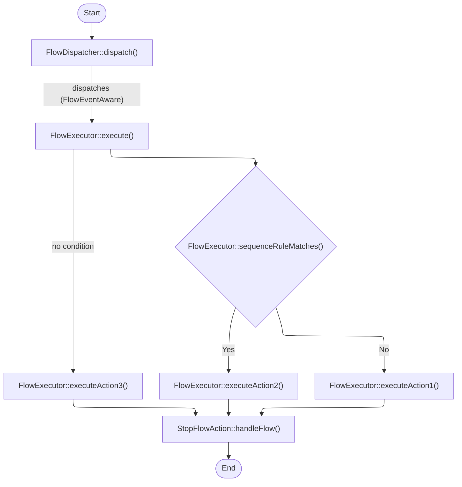
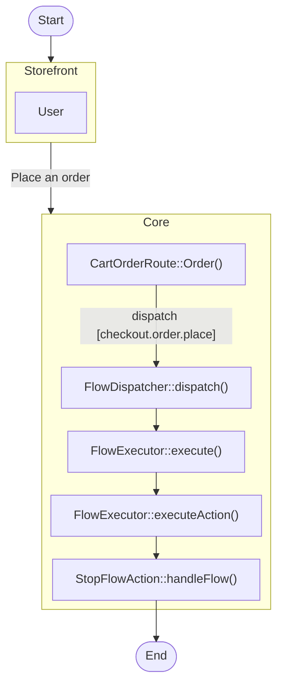
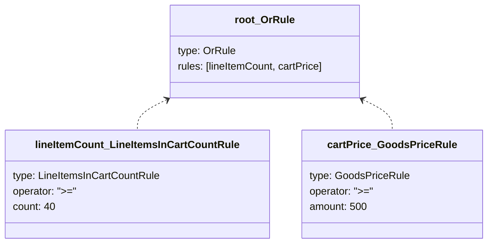
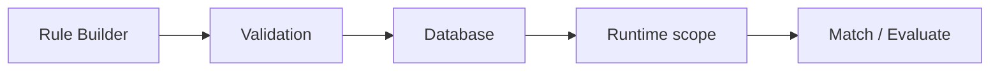
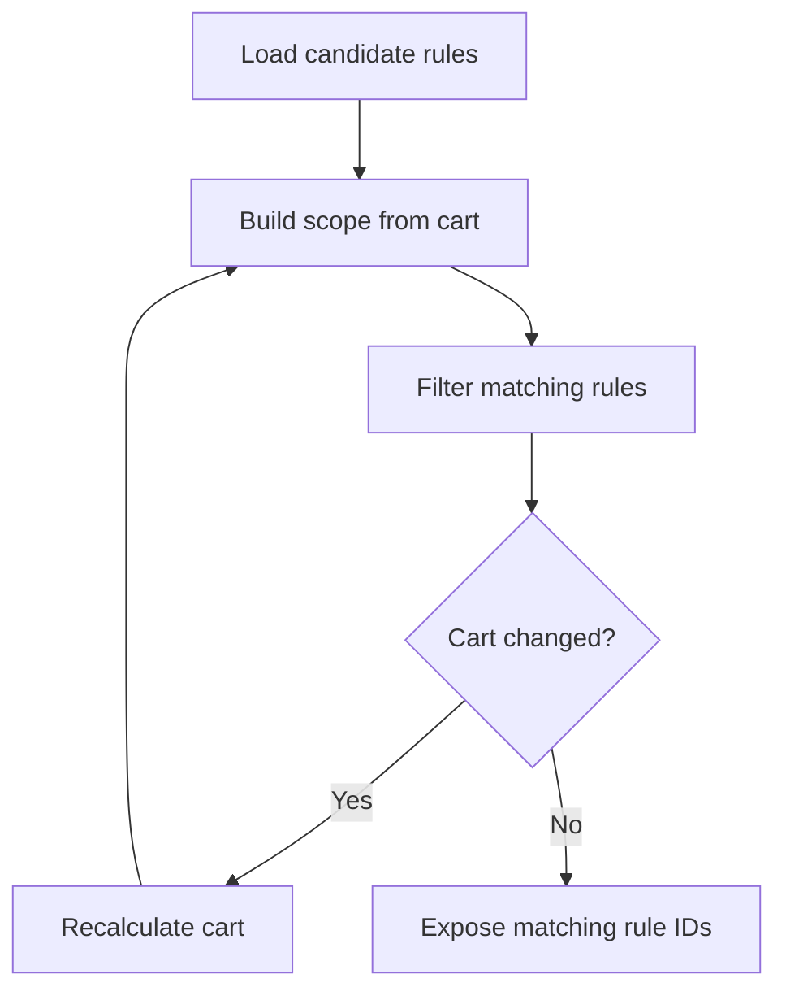
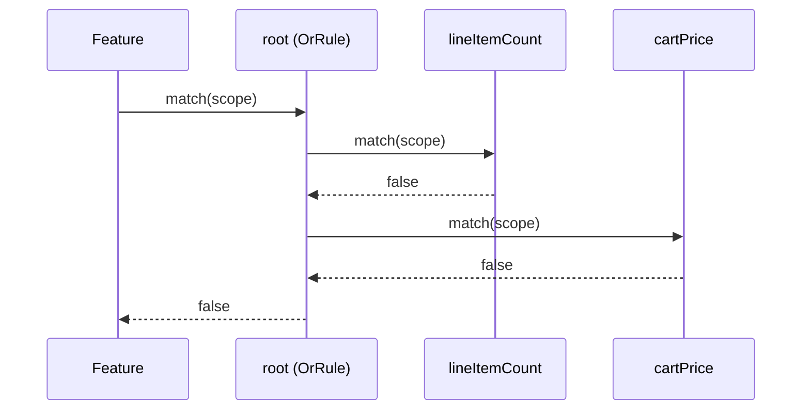
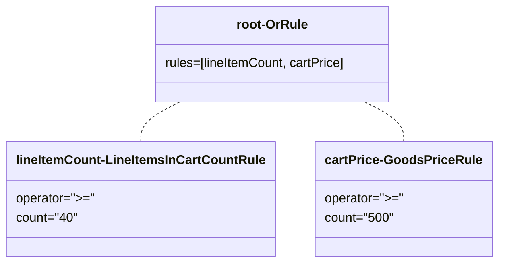
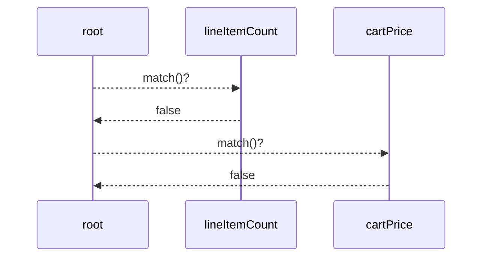

# RULES FLOWS AUTOMATION

Compiled excerpts from the Shopware Developer Documentation snapshot. Prefer live docs at [developer.shopware.com](https://developer.shopware.com/) when in doubt.

---

## Flow Builder
**Source:** [concepts/framework/flow-concept.md](https://developer.shopware.com/docs/v6.6/concepts/framework/flow-concept.md)  
# Flow Builder

Flow Builder is a Shopware automation solution for shop owners with great adaptability and flexibility. With Flow Builder, you can build workflows to automate tasks tailored to your business needs without programming knowledge.

## Flow

A flow is an automation process in your business. From here, you can specify which actions are triggered by a trigger. Additionally, you can define conditions for these actions under which the actions are to be executed. If multiple flows with the same trigger exist, the priority point will decide which flow will perform first.

## Trigger

A trigger is an event that starts the flow and detects the event from the Storefront or the application. A trigger could have multiple actions.

## Condition

A condition is a business rule to determine whether the action should be executed.

## Action

An action is a task that executes on a trigger or when certain conditions are met.

A special action called "Stop flow" stops any further action in the flow sequence.

## Flow Templates

A flow template is a pre-created [flow](#flow).

The flow library contains the flow template listing that is shipped with Shopware. Two main ways to create a flow template in the template library are by [apps](../../guides/plugins/plugins/framework/flow/) and [plugins](../../guides/plugins/apps/flow-builder/).

We can help merchants reduce the complexity of creating an automation process in their business by using a flow template rather than building a flow. As a merchant, you may design a flow more easily by using the flow templates. So you don't have to create complicated flows on your own.

You can view the details of a flow template just like a regular flow. However, flow templates can't be modified.

## How a flow sequence is evaluated

In Shopware, you have multiple interfaces and classes for different types of events. For Flow Builder, those triggers mentioned above are implements from the *Aware* interface.

Once the action on the Storefront or from the app happens, the FlowDispatcher will dispatch FlowEventAware to the FlowExecutor. From here, the FlowExecutor will check the condition to decide whether to execute the action.



Here is an example flow of what happens in the system when an order is placed on the Storefront.



---

---

## Rule system
**Source:** [concepts/framework/rule-system.md](https://developer.shopware.com/docs/concepts/framework/rule-system.md)  
# Rule system

Shopware provides a generic **rule system** that allows you to describe business conditions as composable rules. These rules are evaluated against a specific context, such as a cart, an order, or a customer and are used across multiple domains like checkout, promotions, and flows.

On top of this rule system, the **Rule Builder** is the Administration feature that lets users configure and combine rule conditions visually.

## Example scenario

The power of the rule system can be illustrated with a simple scenario:

**"If a customer orders a car, a pair of sunglasses will be free in the same order."**

This relies on multiple different data points:

* A product called "car"
* A product called "sunglasses"

Both are independent, separately buyable, and stored in the database.

* The whole state of a single cart
* The quantity of a line item

This is a runtime concept in memory, resulting in the adjustment of a single line item's price, which in turn changes the whole calculation of the cart.

The rule system sits right in the middle of this scenario, providing the necessary mapping information to get from point A (`car` is in the cart) to point B (`sunglasses` are free), without embedding this logic directly into the cart.

## Where rules are used

The rule system is cross-domain and used in multiple parts of Shopware, including among others:

* **Checkout and cart:**
  Controlling availability and behavior of shipping methods, payment methods, and product prices based on the current cart and customer.

* **Promotions:**
  Applying or restricting promotions depending on the customer, cart content, or other criteria.

* **Flow Builder:**
  Defining rule conditions, controlling flow behavior and outcome, based on order, checkout, customer or product context.

---

---

## Rule concepts
**Source:** [concepts/framework/rule-system/rule-concepts.md](https://developer.shopware.com/docs/concepts/framework/rule-system/rule-concepts.md)  
# Rule concepts

## Rule

A **rule** represents a single condition that can be evaluated to either `true` or `false`.

Rules can represent very different things (customer attributes, cart content, dates, tags, and more), but they follow the same contract: they evaluate against a given scope and return a boolean.


### Responsibilities

A rule answers a specific question, such as "Does the customer belong to the standard customer group?" or "Is the cart total greater than 50?".

### Input

A rule does not fetch the data needed for the evaluation on its own. Instead, it receives all required data through a **rule scope**.

### Output

A rule always returns a boolean result and has no side effects. It does not modify the cart, orders, or any other state.

## Rule scopes

A **rule scope** defines the context in which a rule is evaluated and provides the data that is available for the evaluation.

### Context carrier

The scope provides access to the technical context (`Context`, `SalesChannelContext`) and, depending on the use case, domain-specific data, such as the current cart, customer, order, or products.

### Specialization

Different parts of the system use different scopes. For example:

* `CheckoutRuleScope` provides access to the `SalesChannelContext` (customer, sales channel, currency, etc.).
* `CartRuleScope` extends `CheckoutRuleScope` and adds access to the current cart.
* `FlowRuleScope` includes checkout information plus the related order.

Rules depend only on what the scope exposes to them. This keeps rule implementations focused and makes them reusable across features that share the same scope.

## Container rules

Rules can be **combined into trees** using special rules called **container rules**. Container rules do not evaluate any conditions on their own, but instead combine the results of other rules using logical operators.

### Logical composition

Container rules implement logical behavior such as:

* "All of these conditions must match" (`AndRule`)
* "At least one of these conditions must match" (`OrRule`)
* "This condition must not match" (`NotRule`)

### Tree structure

A complete rule definition is represented as a tree:

* Container nodes (AND, OR, NOT, etc.)
* Leaf nodes (concrete rule conditions that check a single condition)

The following diagram shows an example rule tree with an `OrRule` container and two leaf conditions:



This tree structure allows for complex rule definitions that can express a wide variety of conditions with the same building blocks.

## Operators and comparisons

Most rules compare values (for example, a number, string or date) against a given input using standardized **operators**.

Conceptually, a rule can be read as: "Compare **this input value** from the scope with **this configured value** using **this operator**".

### Standard operator set

Common operators include:

* Equality or inequality (`=`, `!=`)
* Ranges (`<`, `<=`, `>`, `>=`)
* Emptiness checks (`empty`)

### Consistent semantics

Rules that compare similar types of values (numbers, strings, dates, IDs) share consistent comparison semantics (`RuleComparison`). This makes behavior predictable across different rules, contexts, and domains.

## Rule configuration

Each rule condition defines which operators it supports in **the rule config** (`RuleConfig`). The Rule Builder uses this information to present the correct operator choices and fields in the administration UI. You can think of the rule config as the **UI contract** for a rule: it defines what users can enter and how it is presented. The rule config declares:

### Operator set

A rule defines which operators are valid for its comparison. For example, a numeric rule might support range operators (`<`, `>`, etc.), while string-based rules might only support equality checks (`=`, `!=`).

### Field definitions

A rule describes each configurable field by:

* **Name:** Identifier of the field (for example `amount` or `customerGroupId`).
* **Type:** How the field is represented in the UI (for example `number`, `text`, `date`).
* **Additional config:** Extra information the UI needs (for example, available options for select fields, a unit for number fields, or a placeholder for text fields).

## Rule constraints

To ensure that rules are configured correctly, each rule also defines **rule constraints** (`RuleConstraints`). These constraints describe what counts as a valid configuration for a rule. They are used to validate rule payloads before evaluating them.

### Value constraints

A rule can specify which kinds of values are allowed for each property, for example:

* A number field must be present and must contain a numeric value.
* A string field must not be blank.
* A list of IDs must contain valid identifiers.

### Operator constraints

A rule can also restrict which operator values are allowed. For example, a rule might only allow equality checks (`=`, `!=`) and disallow range comparisons (`<`, `>`).

---

---

## Rule evaluation
**Source:** [concepts/framework/rule-system/rule-evaluation.md](https://developer.shopware.com/docs/concepts/framework/rule-system/rule-evaluation.md)  
# Rule evaluation

The lifecycle of rule evaluation from UI to decision-making can be summarized as follows:

1. The Rule Builder lets a user create a rule tree (containers and conditions).
2. The rule system validates each condition against the corresponding rule class from the registry.
3. Valid rule and rule condition records are stored in the database.
4. At runtime, a domain builds an appropriate rule scope and, if needed, computes matching rules for that scope in advance.
5. Features either filter by rule IDs exposed on the context or evaluate a specific rule tree directly by calling it.



The sections below explain the individual steps in more detail.

## 1. From Rule Builder to stored rule definition

### 1.1. Rule trees and conditions

When a user configures a rule in the Rule Builder:

* The **visual tree** is mapped to a `rule` entity representing the whole rule and multiple `rule_condition` records representing both container nodes and leaf conditions.
* The tree structure is stored via `parent_id` references between `rule_condition` records.
* Each `rule_condition` has a **type** that maps to a rule class (implementing `Rule`) and stores its configured values (operator, thresholds, IDs, etc.) in a `value` JSON field.

So the Rule Builder is building the **structure and configuration** that will later be hydrated into a tree of `Rule` objects for evaluation.

### 1.2. Validation

Before writes are accepted, `RuleValidator` validates each condition. It subscribes to write events and inspects commands targeting `RuleConditionEntity`. For each condition, it:

* Resolves the condition type to a rule class via the `RuleConditionRegistry`.
* Instantiates the rule and uses its constraints to understand which fields and operators are valid.

If the payload does not match what the rule class declares (wrong fields, types, operators), the write is rejected.

## 2. Preparing evaluation

Rules do not fetch data themselves, they always evaluate against a provided **rule scope**.

### 2.1. Rule scope specification

The abstract `RuleScope` defines the minimal contract for evaluation. Domains extend it to add domain-specific data.

* `CheckoutRuleScope` - base for checkout-related rules.
* `CartRuleScope` - adds access to cart data.
* `FlowRuleScope` - adds access to order data.
* `LineItemScope` - focuses on a single line item.

### 2.2. Scope owners

Different parts of the system are responsible for constructing scopes:

* **Cart / Checkout:** `CartRuleLoader` is the main entry point for cart and checkout rule evaluation, building the necessary scopes and evaluating rules against them.

* **Flows:** `FlowRuleScopeBuilder` is responsible for building `FlowRuleScope`. It reconstructs a cart-like context from an order and runs data collectors so rules see realistic checkout data.

* **Line items:** Classes like `AnyRuleLineItemMatcher` construct `LineItemScope` when they need to test rules against individual line items.

The important point is: rules themselves are pure functions that depend only on the scope they receive. They do not depend on a global state.

## 3. Matching rules

For some domains (checkout), the system evaluates all rules upfront and exposes the IDs of matching rules in the context so features can filter by them.

### 3.1. Candidate loading

`CartRuleLoader` is central for checkout. It uses the `AbstractRuleLoader` to load a collection of rules and narrows these to context-relevant rules before evaluating anything.

### 3.2. Iterative matching

To determine which of these candidates actually match the current cart context, `CartRuleLoader` builds the scope and uses `RuleCollection::filterMatchingRules(...)` to keep only rules whose payload rule tree evaluates to `true` for that scope. The matching rule IDs are then exposed on the `SalesChannelContext`.

Because the set of matching rules can affect cart processors (promotions, shipping, etc.) which in turn change the cart, the loader may need to iterate:



The result is a **self-consistent pair** of (cart, matching rule IDs) in the context.

## 4. Rules at runtime

Once rules are validated and the context knows which rules match, features can consume them in two ways.

### 4.1. ID-based decisions

Features that only need to know "is this entity available in the current context?" attach a rule ID then filter by IDs exposed on the context. For example:

* Entities like `shipping_method`, `payment_method` or `tax_provider` have an `availability_rule_id` field.
* Items with availability rules are allowed if their rule ID is in `SalesChannelContext::getRuleIds()`.

### 4.2. Direct evaluation

Other features need to evaluate a particular rule against a specific scope (flow, cart calculation, etc.). In these cases, the feature fetches the rule tree from the database, builds the appropriate scope for the current need and calls `Rule::match(RuleScope $scope)` on the root rule.

The following sequence shows how a container rule delegates to its children:



Since the `OrRule` requires at least one child to match, and both return `false`, the entire rule evaluates to `false`.

---

---

## Rules
**Source:** [concepts/framework/rules.md](https://developer.shopware.com/docs/v6.6/concepts/framework/rules.md)  
# Rules

The rule system pervades Shopware 6. It solves the problem of calculating the cart differently based on the context ([`SalesChannel`](../commerce/catalog/sales-channels), `CustomerGroup`, etc) and the current state ([`LineItems`](../commerce/checkout-concept/cart#line-items), `Amount`, etc), but user controlled and decoupled from the [cart](../commerce/checkout-concept/cart) itself. In theory, [every part of Shopware 6](../../resources/references/core-reference/rules-reference) can contribute to the set of available rules.

## Scenario

The problem solved by the rule system can be imagined by the following scenario:

**"If a customer orders a car, a pair of sunglasses will be free in the same order."**

This relies on multiple different data points:

* A product called car
* A product called sunglasses

Both are independent, separately buyable, and stored in the database.

* The whole state of a single cart
* The quantity of a line item

This is a runtime concept in memory, resulting in the adjustment of a single line item's price, which in turn changes the whole calculation of the cart.

In this example, the rule system sits right in the middle of the scenario, providing the necessary mapping information to get from point a (`car` is in the cart) to point b (`sunglasses` are free).

## Rule Design

The center of the rule system is the `Rule`. It is realized as a variant of the [Specification pattern](https://en.wikipedia.org/wiki/Specification_pattern) but omits the name due to a few key differences.

* Storable, retrievable and identifiable through the [Data Abstraction Layer](../../guides/plugins/plugins/framework/data-handling/).
* A `RuleScope` parameter instead of any arbitrary object
* `match` instead of `isSatisfiedBy`

As well as a Specification class, a Rule class represents a condition to fulfill. It implements the `match(RuleScope $scope)` function to validate user defined values against a runtime state. See the following object diagram for a better understanding:



This will result in the following call order:



As you can see, a single rule can either contain user defined values or other user defined rules. These are Container rules. The rule system here bears some resemblance to the [SearchCriteria](../../guides/plugins/plugins/framework/data-handling/reading-data#Filtering), although independent. A Search Criteria is the representation of a query that gets translated and executed through the storage engine. The rule matches in-memory in PHP and does not access the underlying storage.

The last building block is the **Rule Scope**. The Scope contains the current runtime state of the application and is necessary to match the data. The whole picture is visualized in the next diagram:


## Connection to the System

Following Shopware 6s data-driven approach, the rule objects are stored in the database and used to trigger behavior in the cart through the associations present.

For more insights on the rule validation, take a look at the [Cart documentation](../commerce/checkout-concept/cart)

---

---

## Flow
**Source:** [guides/plugins/plugins/framework/flow.md](https://developer.shopware.com/docs/v6.6/guides/plugins/plugins/framework/flow.md)  
# Flow

The flow builder plugin allows businesses to create and manage custom workflows and automation within the e-commerce platform, enhancing efficiency and streamlining processes. The flow builder mainly comprises actions and triggers.

The customizable flow actions allow the automation of various tasks or processes, while the custom flow triggers are the events or conditions that initiate the execution of this flow. These customizations can be defined and executed within the flow builder enabling businesses to respond dynamically to specific events or changes in their e-commerce platform.

---

---

## Action transactions
**Source:** [guides/plugins/plugins/framework/flow/action-transactions.md](https://developer.shopware.com/docs/v6.6/guides/plugins/plugins/framework/flow/action-transactions.md)  
# Action transactions

## Overview

In this guide, you will learn how to run your action code inside a transaction. This may be important for you if you want to graciously handle rollbacks in certain scenarios. We have implemented various abstractions to ease this process; however, you need to opt in.

For some more background, please see the ADR [Action Transactions](../../../../../resources/references/adr/2024-02-11-transactional-flow-actions).

## Prerequisites

In order to make your action run inside a database transaction, you will need an existing Flow Action. Therefore, you can refer to the [Add Flow Builder Action Guide.](./add-flow-builder-action)

## Run your action inside a transaction

All you have to do is to implement the `Shopware\Core\Content\Flow\Dispatching\TransactionalAction` interface. It does not have any methods to implement.

When your action implements the interface the Flow Dispatcher will wrap your action in a transaction. If an exception is thrown, it will be caught, the transaction will be rolled back, and an error is logged.

::: code-group

```php [{plugin root}/src/Core/Content/Flow/Dispatching/Action/CreateTagAction.php]
<?php declare(strict_types=1);

namespace Swag\CreateTagAction\Core\Content\Flow\Dispatching\Action;

use Shopware\Core\Content\Flow\Dispatching\Action\FlowAction;
use Shopware\Core\Content\Flow\Dispatching\TransactionalAction;

class CreateTagAction extends FlowAction implements TransactionalAction
{
    public function handleFlow(StorableFlow $flow): void
    {        
        //do stuff - will be wrapped in a transaction
    }  
}
```

:::

## Force a rollback

You can also force the Flow Dispatcher to roll back the transaction by throwing an instance of `\Shopware\Core\Content\Flow\Dispatching\TransactionFailedException`. You can use the static `because` method to create the exception from another one. Eg:

::: code-group

```php [{plugin root}/src/Core/Content/Flow/Dispatching/Action/CreateTagAction.php]
<?php declare(strict_types=1);

namespace Swag\CreateTagAction\Core\Content\Flow\Dispatching\Action;

use Shopware\Core\Content\Flow\Dispatching\Action\FlowAction;
use Shopware\Core\Content\Flow\Dispatching\TransactionalAction;

class CreateTagAction extends FlowAction implements TransactionalAction
{
    public function handleFlow(StorableFlow $flow): void
    {        
        try {
            //search for some record
            $entity = $this->repo->find(...);
        } catch (NotFoundException $e) {
            throw TransactionFailedException::because($e);
        }
    }  
}
```

## Under what circumstances will the transaction be rolled back?

The transaction will be rollback if either of the following are true:

1. If Doctrine throws an instance of `Doctrine\DBAL\Exception` during commit.
2. If the action throws an instance of `TransactionFailedException` during execution.
3. If another non-handled exception is thrown during the action execution.

If the transaction fails, then an error will be logged.

Also, if the transaction has been performed inside a nested transaction without save points enabled (which is the default in Shopware), the exception will be rethrown.
This is because the calling code knows something went wrong and is able to handle it correctly, by rolling back instead of committing. In this scenario, the connection will be marked as rollback only.

---

---

## Add custom flow Action
**Source:** [guides/plugins/plugins/framework/flow/add-flow-builder-action.md](https://developer.shopware.com/docs/v6.6/guides/plugins/plugins/framework/flow/add-flow-builder-action.md)  
*(Body truncated in this bundle; follow the link for the rest.)*

# Add custom flow Action

## Overview

In this guide, you'll learn how to create custom flow action in Shopware. The flow builder uses actions to perform business tasks. This example will introduce a new custom action called `create tags`.

## Prerequisites

In order to add your own custom flow action for your plugin, you first need a plugin as base. Therefore, you can refer to the [Plugin Base Guide.](../../plugin-base-guide)

You also should be familiar with the [Dependency Injection container](../../plugin-fundamentals/dependency-injection) as this is used to register your custom flow action and [Listening to events](../../plugin-fundamentals/listening-to-events#creating-your-own-subscriber) to create a subscriber class.

It might be helpful to gather some general understanding about the [concept of Flow Builder](../../../../../concepts/framework/flow-concept) as well.

## Existing triggers and actions

You can refer to the [Flow reference](../../../../../resources/references/core-reference/flow-reference) to read triggers and actions detail.

## Create custom flow action

To create a custom flow action, firstly you have to make a plugin and install it. Refer to the [Plugin Base Guide](../../plugin-base-guide.md) to do it. For instance, lets create a plugin named `CreateTagAction`. You must implement both backend (PHP) code and a user interface in the Administration to manage it. Let's start with the PHP part first, which handles the main logic of our action. After that, there will be an example to show your new actions in the Administration.

## Creating flow action in PHP

### Create new Aware interface

First of all, we need to define an aware interface for your own action. I intended to create the `CreateTagAction`, so I need to create a related aware named `TagAware`, will be placed in directory `<plugin root>/src/Core/Framework/Event`. Our new interface has to extend from interfaces `Shopware\Core\Framework\Event\FLowEventAware`:

```php
// <plugin root>/src/Core/Framework/Event/TagAware.php
<?php declare(strict_types=1);
namespace Swag\ExamplePlugin\Core\Framework\Event;
use Shopware\Core\Framework\Event\FlowEventAware;
use Shopware\Core\Framework\Event\IsFlowEventAware;

#[IsFlowEventAware]
interface TagAware extends FlowEventAware
{
    ...

    public const TAG = 'tag';

    public const TAG_ID = 'tagId';

    public function getTag();

    ...
}
```

### Create new action

In this example, we will name it `CreateTagAction`. It will be placed in the directory `<plugin root>/src/Core/Content/Flow/Dispatching/Action`. Below you can find an example implementation:

```php
// <plugin root>/src/Core/Content/Flow/Dispatching/Action/CreateTagAction.php
<?php declare(strict_types=1);

namespace Swag\CreateTagAction\Core\Content\Flow\Dispatching\Action;

use Shopware\Core\Content\Flow\Dispatching\Action\FlowAction;
use Shopware\Core\Content\Flow\Dispatching\StorableFlow;
use Shopware\Core\Framework\DataAbstractionLayer\EntityRepository;
use Shopware\Core\Framework\Uuid\Uuid;
use Swag\CreateTagAction\Core\Framework\Event\TagAware;

class CreateTagAction extends FlowAction
{
    private EntityRepository $tagRepository;

    public function __construct(EntityRepository $tagRepository)
    {
        // you would need this repository to create a tag
        $this->tagRepository = $tagRepository;
    }

    public static function getName(): string
    {
        // your own action name
        return 'action.create.tag';
    }

    public function requirements(): array
    {
        return [TagAware::class];
    }

    public function handleFlow(StorableFlow $flow): void
    {
        // config is the config data when created a flow sequence
        $config = $flow->getConfig();

        // make sure your tags data exists
        if (!\array_key_exists('tags', $config)) {
            return;
        }

        $tags = $config['tags'];

        // just a step to make sure you're dispatching correct action
        if (!$flow->hasStore(TagAware::TAG_ID) || empty($tags)) {
            return;
        }

        // get tag id
        $tagId = $flow->getStore(TagAware::TAG_ID);

        // get tag
        $tag = $flow->getData(TagAware::TAG);

        $tagData = [];
        foreach ($tags as $tag) {
            $tagData[] = [
                'id' => Uuid::randomHex(),
                'name' => $tag,
            ];
        }

        // simply create tags
        $this->tagRepository->create($tagData, $flow->getContext());
    }
}
```

As you can see, several methods are already implemented:

* `__constructor`: This only defines the default expected value. This is overwritten at runtime with the actual value, that the shop owner set in the Administration.
* `getName`: Returns a unique technical name for your action.
* `requirements`: This defines which interfaces the action belongs to.
* `handleFlow`: Use this method to handle your action stuff.
  * Use `$flow->getStore($key)` if you want to get the data from aware interfaces. E.g: `tag_id` in `TagAware`, `customer_id` from `CustomerAware` and so on.
  * Use `$flow->getData($key)` if you want to get the data from original events or additional data. E.g: `tag`, `customer`, `contactFormData` and so on.

You also need to register this action in the container as a service. Make sure to define a tag `<tag name="flow.action" priority="600">` at `<plugin root>/src/Resources/config/services.xml`. This tag will ensure that your action is included in the response of the *`/api/_info/flow-actions.json`* API. The priority attribute will determine the order of the action in the API response.

```XML
// <plugin root>/src/Resources/config/services.xml
<service id="Swag\CreateTagAction\Core\Content\Flow\Dispatching\Action\CreateTagAction">
    <argument type="service" id="tag.repository" />
    <tag name="flow.action" priority="600" key="action.create.tag"/>
</service>
```

Great, your own action is created completely. Let's go to the next step.

### Define action scope

In this step, you will know how to define your action scope for `CreateTagAction`.
There are three scopes for the `CreateTagAction`:

* Available for all *already Events*.
* Available for only one or multiple *already Events.*
* Available for new event (new event from this plugin).

#### `CreateTagAction` available for all *already Events*

* Just define the empty array in `CreateTagAction::requirements`

```php
    // plugin root>/src/Core/Content/Flow/Dispatching/Action/CreateTagAction.php
    ...

    public function requirements(): array
    {
        return [];
    }

    ...
```

That means when you define the requirements like the code above, all triggers in the flow builder can define the action `CreateTagAction` for the next progress.


Here, the action name is empty as the action name snippet is not yet defined.

#### `CreateTagAction` available for only one or multiple *already Events*

Make the `CreateTagAction` available for all events related to Order and Customer.

```php
    // <plugin root>/src/Core/Content/Flow/Dispatching/Action/CreateTagAction.php
    ...

    public function requirements(): array
    {
        return [OrderAware::class, CustomerAware::class];
    }

    ...
```

#### `CreateTagAction` available for new event

* For this case, you can define a new event and make the `CreateTagAction` available for this event.

* Event must implement the `TagAware`

```php
// <plugin root>/src/Core/Content/Flow/Subscriber/BusinessEventCollectorSubscriber.php
<?php declare(strict_types=1);

namespace Swag\CreateTagAction\Core\Content\Event;

use Shopware\Core\Framework\Context;
use Shopware\Core\Framework\Event\EventData\EntityType;
use Shopware\Core\Framework\Event\EventData\EventDataCollection;
use Shopware\Core\System\Tag\TagDefinition;
use Shopware\Core\System\Tag\TagEntity;
use Swag\CreateTagAction\Core\Framework\Event\TagAware;
use Symfony\Contracts\EventDispatcher\Event;

class BasicExampleEvent extends Event implements TagAware
{
    public const EVENT_NAME = 'example.event';

    private TagEntity $tag;

    private Context $context;

    public function __construct(Context $context, TagEntity $tag)
    {
        $this->tag = $tag;
        $this->context = $context;
    }

    public function getName(): string
    {
        return self::EVENT_NAME;
    }

    public static function getAvailableData(): EventDataCollection
    {
        return (new EventDataCollection())
            ->add('tag', new EntityType(TagDefinition::class));
    }

    public function getContext(): Context
    {
        return $this->context;
    }

    public function getTag(): TagEntity
    {
        return $this->tag;
    }
}
```

* Define the `TagAware` in `CreateTagAction::requirements`

```php
    // <plugin root>/src/Core/Content/Flow/Dispatching/Action/CreateTagAction.php
    ...

    public function requirements(): array
    {
        return [TagAware::class];
    }

    ...
```

* To show the new event in Flow Builder Triggers list

```php
// <plugin root>/src/Core/Content/Subscriber/BusinessEventCollectorSubscriber.php
<?php declare(strict_types=1);
namespace Swag\CreateTagAction\Core\Content\Subscriber;

use Shopware\Core\Framework\Event\BusinessEventCollector;
use Shopware\Core\Framework\Event\BusinessEventCollectorEvent;
use Swag\CreateTagAction\Core\Content\Event\BasicExampleEvent;
use Symfony\Component\EventDispatcher\EventSubscriberInterface;

class BusinessEventCollectorSubscriber implements EventSubscriberInterface
{
    private BusinessEventCollector $businessEventCollector;

    public function __construct(BusinessEventCollector $businessEventCollector)
    {
        $this->businessEventCollector = $businessEventCollector;
    }

    public static function getSubscribedEvents()
    {
        return [
            BusinessEventCollectorEvent::NAME => 'onAddExampleEvent',
        ];
    }

    public function onAddExampleEvent(BusinessEventCollectorEvent $event): void
    {
        $collection = $event->getCollection();

        $definition = $this->businessEventCollector->define(BasicExampleEvent::class);

        if (!$definition) {
            return;
        }

        $collection->set($definition->getName(), $definition);
    }
}
```

And don't forget to register your subscriber to the container at `<plugin root>/src/Resources/config/services.xml`.

```xml
<service id="Swag\CreateTagAction\Core\Content\Subscriber\BusinessEventCollectorSubscriber">
    <argument type="service" id="Shopware\Core\Framework\Event\BusinessEventCollector"/>
    <tag name="kernel.event_subscriber"/>
</service>
```

* Define the Event snippet

```json
// <plugin root>/src/Resources/app/administration/src/module/sw-flow/snippet/en-GB.json
{
  "sw-flow": {
    "triggers": {
      "example": "Example",
      "event": "Event"
    }
  }
}
```


Well, you have successfully created your custom action in Backend in PHP.

## Add custom action in Administration

After we are done with the PHP code, `action.create.tag` is received from the response of `/api/_info/flow-actions.json`. However, the custom action displays in the action list without label. These further steps in Administration will help you show the action label and add configuration for it.

To see the action list, we select a Trigger, for example \[example\event], from the Trigger drop-down in the Flow tab. After that, we choose option `ACTION (THEN)`. An action component appears with an action list.


### Step 1: Show action label in action list

First, we need to define information like `constants`, `snippets` to show on the

… **Truncated.** Full document: https://developer.shopware.com/docs/v6.6/guides/plugins/plugins/framework/flow/add-flow-builder-action.md


---

## Add custom flow trigger
**Source:** [guides/plugins/plugins/framework/flow/add-flow-builder-trigger.md](https://developer.shopware.com/docs/v6.6/guides/plugins/plugins/framework/flow/add-flow-builder-trigger.md)  
*(Body truncated in this bundle; follow the link for the rest.)*

# Add custom flow trigger

::: info
This functionality is available starting with Shopware 6.4.6.0
:::

## Overview

In this guide, you'll learn how to create a custom flow trigger in Shopware. Triggers are used by the flow builder. This example will introduce a new custom trigger. The shop owner is then able to define what to do with the new trigger.

## Prerequisites

In order to add your own custom flow trigger for your plugin, you first need a plugin as base. Therefore, you can refer to the [Plugin Base Guide](../../plugin-base-guide).

You also should be familiar with [Add custom event](../event/add-custom-event) to know how to create an event. Please refer to the [Flow Builder concept](../../../../../concepts/framework/flow-concept)
for better integration later.

## Existing triggers and actions

You can refer to the [Flow reference](../../../../../resources/references/core-reference/flow-reference) to read triggers and actions detail.

## Event interfaces and classes

Any event that implements one of these interfaces will be available in the trigger list of the Flow Builder module in Administration. Besides, the event will have the ability to execute the action that belongs to the interface.

* `FlowEventAware`: This interface is the base for every flow builder trigger. It provides the `availableData` and `name` of the event.

* `MailAware`: This interface provides `MailRecipientStruct` and `salesChannelId`.

* `OrderAware`: This interface provides `orderId`, which is used to add tags, sendmail or generate documents, etc...

* `CustomerAware`: This interface same as `OrderAware` but for customer, which provide `customerId`, used to add tags, remove tags, sendmail, etc...

* `UserAware`: This interface provides `userId` for all actions related to the user.

* `SalesChannelAware`: This interface simply provides `salesChannelId`.

## Create custom flow trigger

To create a custom flow trigger, firstly you have to create a plugin and install it, you can refer to the [Plugin Base Guide](../../plugin-base-guide) to do it. I will create a plugin named `ExamplePlugin`. There will be an example to actually show your new trigger in the Administration.

### Create a new trigger (event)

In this example, we will name it ExampleEvent to some actions related to customers when dispatching this event. It will be placed in the directory `<plugin root>/src/Core/Checkout/Customer/Event`. Our new event has to implement Shopware\Core\Framework\Event\CustomerAware interface to enable actions requiring this Aware.

Below you can find an example implementation:

```php
// <plugin root>/src/Core/Checkout/Customer/Event/ExampleEvent.php
<?php declare(strict_types=1);

namespace Swag\ExamplePlugin\Core\Checkout\Customer\Event;

use Shopware\Core\Checkout\Customer\CustomerDefinition;
use Shopware\Core\Checkout\Customer\CustomerEntity;
use Shopware\Core\Framework\Context;
use Shopware\Core\Framework\Event\CustomerAware;
use Shopware\Core\Framework\Event\FlowEventAware;
use Shopware\Core\Framework\Event\EventData\EntityType;
use Shopware\Core\Framework\Event\EventData\EventDataCollection;
use Symfony\Contracts\EventDispatcher\Event;

class ExampleEvent extends Event implements CustomerAware, FlowEventAware
{
    public const EVENT_NAME = 'example.event';

    private CustomerEntity $customer;

    private Context $context;

    public function __construct(Context $context, CustomerEntity $customer)
    {
        $this->customer = $customer;
        $this->context = $context;
    }

    public function getName(): string
    {
        return self::EVENT_NAME;
    }

    public function getCustomer(): CustomerEntity
    {
        return $this->customer;
    }

    public function getCustomerId(): string
    {
        return $this->customer->getId();
    }

    public static function getAvailableData(): EventDataCollection
    {
        return (new EventDataCollection())
            ->add('customer', new EntityType(CustomerDefinition::class));
    }

    public function getContext(): Context
    {
        return $this->context;
    }
}
```

::: info
Available starting with Shopware 6.5.0.0
:::

From 6.5, in Flow Builder, the original event will be deprecated and we will only use a class `StorableFlow`. All event data will be stored in the `StorableFlow`, hence the `getAvailableData` function can no more be used to get data from the Flow Builder.

We have created many Aware interfaces. These Aware are the conditions to restore event data in Flow Builder via `FlowStorer` respective.

| Aware interface | Storer respective |
| :--- | :--- |
| Shopware\Core\Content\Flow\Dispatching\Aware\ScalarValuesAware | Shopware\Core\Content\Flow\Dispatching\Storer\ScalarValuesStorer |
| Shopware\Core\Content\Flow\Dispatching\Aware\ConfirmUrlAware | Shopware\Core\Content\Flow\Dispatching\Storer\ConfirmUrlStorer |
| Shopware\Core\Content\Flow\Dispatching\Aware\ContactFormDataAware | Shopware\Core\Content\Flow\Dispatching\Storer\ContactFormDataStorer |
| Shopware\Core\Content\Flow\Dispatching\Aware\ContentsAware | Shopware\Core\Content\Flow\Dispatching\Storer\ContentsStorer |
| Shopware\Core\Content\Flow\Dispatching\Aware\ContextTokenAware | Shopware\Core\Content\Flow\Dispatching\Storer\ContextTokenStorer |
| Shopware\Core\Content\Flow\Dispatching\Aware\CustomerGroupAware | Shopware\Core\Content\Flow\Dispatching\Storer\CustomerGroupStorer |
| Shopware\Core\Content\Flow\Dispatching\Aware\CustomerRecoveryAware | Shopware\Core\Content\Flow\Dispatching\Storer\CustomerRecoveryStorer |
| Shopware\Core\Framework\Event\CustomerAware | Shopware\Core\Content\Flow\Dispatching\Storer\CustomerStorer |
| Shopware\Core\Framework\Event\MailAware | Shopware\Core\Content\Flow\Dispatching\Storer\MailStorer |
| Shopware\Core\Content\Flow\Dispatching\Aware\MessageAware | Shopware\Core\Content\Flow\Dispatching\Storer\MessageStorer |
| Shopware\Core\Content\Flow\Dispatching\Aware\NewsletterRecipientAware | Shopware\Core\Content\Flow\Dispatching\Storer\NewsletterRecipientStorer |
| Shopware\Core\Framework\Event\OrderAware | Shopware\Core\Content\Flow\Dispatching\Storer\OrderStorer |
| Shopware\Core\Content\Flow\Dispatching\Aware\OrderTransactionAware | Shopware\Core\Content\Flow\Dispatching\Storer\OrderTransactionStorer |
| Shopware\Core\Framework\Event\ProductAware | Shopware\Core\Content\Flow\Dispatching\Storer\ProductStorer |
| Shopware\Core\Framework\Event\UserAware | Shopware\Core\Content\Flow\Dispatching\Storer\UserStorer |

```php
<?php declare(strict_types=1);

namespace Swag\ExamplePlugin\Core\Checkout\Customer\Event;

use Shopware\Core\Checkout\Customer\CustomerEntity;
use Shopware\Core\Framework\Event\CustomerAware;
use Shopware\Core\Framework\Event\ShopNameAware;
use Shopware\Core\Framework\Event\EventData\EventDataCollection;
use Symfony\Contracts\EventDispatcher\Event;

class ExampleEvent extends Event implements CustomerAware, ShopNameAware
{
    public const EVENT_NAME = 'example.event';

    private CustomerEntity $customer;

    public function __construct(CustomerEntity $customer, string $shopName)
    {
        $this->customer = $customer;
        $this->shopName = $shopName;
    }

    public function getName(): string
    {
        return self::EVENT_NAME;
    }

    public function getCustomerId(): string
    {
        return $this->customer->getId();
    }

    public static function getAvailableData(): EventDataCollection
    {
        return (new EventDataCollection());
    }

    public function getShopName(): string
    {
        return $this->shopName;
    }
}
```

In the example above, to get the `customerId` and `shopName` data events, you need to store these data via `CustomerStorer` and `ShopNameStorer`.

```php
class CustomerStorer extends FlowStorer
{
	public function store(FlowEventAware $event, array $stored): array
	{
    		if (!$event instanceof CustomerAware || isset($stored['customerId'])) {
        		return $stored;
    		}

    		$stored['customerId'] = $event->getCustomerId();

    		return $stored;
	}

	public function restore(StorableFlow $storable): void
	{
    		if (!$storable->hasStore('customerId')) {
        		return;
    		}

   		$storable->setData('customer', $this->getCustomer($storable->getStore('customerId')));
	}

	private function getCustomer(string $customerId): Customer
	{
		// load customer via $customerId
		
		return $customer;
	}
}
```

```php
class ShopNameStorer extends FlowStorer
{
    public function store(FlowEventAware $event, array $stored): array
    {
        if (!$event instanceof ShopNameAware || isset($stored['shopName'])) {
            return $stored;
        }

        $stored['shopName'] = $event->getShopName();

        return $stored;
    }

    public function restore(StorableFlow $storable): void
    {
        if (!$storable->hasStore('shopName')) {
            return;
        }

        $storable->setData('shopName', $storable->getStore('shopName'));
    }
}
```

We already have Aware interfaces, but if you want to use the custom data that is not available, you can define a new Aware interface and a Storer respectively.

```php
<?php declare(strict_types=1);

namespace Swag\ExamplePlugin\Core\Checkout\Customer\Event;

use Shopware\Core\Framework\Event\CustomExampleDataAware;
use Shopware\Core\Framework\Event\EventData\EventDataCollection;
use Symfony\Contracts\EventDispatcher\Event;

class ExampleEvent extends Event implements CustomExampleDataAware
{
    public const EVENT_NAME = 'example.event';

    private string $customExampleData;

    public function __construct(string $customExampleData)
    {
        $this->customExampleData = $customExampleData;
    }

    public function getName(): string
    {
        return self::EVENT_NAME;
    }

    public function getCustomExampleData(): string
    {
        return $this->customExampleData;
    }

    public static function getAvailableData(): EventDataCollection
    {
        return (new EventDataCollection());
    }
}
```

Aware:

```php
#[IsFlowEventAware]
interface CustomExampleDataAware extends FlowEventAware
{
    public const CUSTOM_EXAMPLE_DATA = 'customExampleData';

    public function getCustomExampleData(): string;
}
```

Storer respective:

```php
class CustomExampleDataStorer extends FlowStorer
{
    public function store(FlowEventAware $event, array $stored): array
    {
        if (!$event instanceof CustomExampleDataAware || isset($stored[CustomExampleDataAware::CUSTOM_EXAMPLE_DATA])) {
            return $stored;
        }

        $stored[CustomExampleDataAware::CUSTOM_EXAMPLE_DATA] = $event->getCustomExampleData();

        return $stored;
    }

    public function restore(StorableFlow $storable): void
    {
        if (!$storable->hasStore(CustomExampleDataAware::CUSTOM_EXAMPLE_DATA)) {
            return;
        }

        $storable->setData(CustomExampleDataAware::CUSTOM_EXAMPLE_DATA, $storable->getStore(CustomExampleDataAware::CUSTOM_EXAMPLE_DATA));
    }
}
```

In Flow Actions, you can get the data easily via `getStore` and `getData`.

```php
class SendMailAction
{
	public function handleFlow(StorableFlow $flow)
	{
		$shopName = $flow->getStore('shopName');
		$customer = $flow->getData('customer');
		$customExampleData = $flow->getData('customExampleData');
	}
}
```

Take a look at the [Add Flow Builder Action](../../../../../guides/plugins/plugins/framework/flow/add-flow-builder-action.md) section of the guide for how to use data in Flow Actions.

### Add your new event to the flow trigger list

At this step, you need to add your new event to the flow trigger list, let us see the code below:

```php
// <plugin root>/src/Core/Checkout/Customer/Subscriber/BusinessEventCollectorSubscriber.php
<?php declare(strict_types=1);

namespace Swag\ExamplePlugin\Core\Checkout\Customer\Subscriber;

use Shopware\Core\Framework\Event\BusinessEventCollector;
use Shopware\Core\Framework\Event\BusinessEventCollectorEvent;
use Swag\ExamplePlugin\Core\Checkout\Customer\Event\ExampleEvent;
use Symfony

… **Truncated.** Full document: https://developer.shopware.com/docs/v6.6/guides/plugins/plugins/framework/flow/add-flow-builder-trigger.md


---

## Rule
**Source:** [guides/plugins/plugins/framework/rule.md](https://developer.shopware.com/docs/v6.6/guides/plugins/plugins/framework/rule.md)  
# Rule

The Rule Builder allows users to add custom rules to create dynamic conditions and actions within the e-commerce platform. Using the Rule Builder, you can define specific criteria based on various attributes, such as customer data, cart contents, order details, or other relevant factors. These custom rules can then trigger specific actions, such as applying discounts, displaying personalized content, or adjusting pricing based on specific conditions. The Rule Builder empowers businesses to create highly tailored and automated experiences for their customers, enhancing the flexibility and customization options within the Shopware framework.

---

---

## Add Custom Rules
**Source:** [guides/plugins/plugins/framework/rule/add-custom-rules.md](https://developer.shopware.com/docs/v6.6/guides/plugins/plugins/framework/rule/add-custom-rules.md)  
*(Body truncated in this bundle; follow the link for the rest.)*

# Add Custom Rules

## Overview

In this guide you will learn how to create rules in Shopware. Rules are used by the rule builder.

This example will introduce a new rule, which checks if it is the first monday of the month or not. The shop owner is then able to react on this specific day every month with special prices or dispatch methods.

## Prerequisites

In order to add your own custom rules for your plugin, you first need a plugin as base. Therefore, you can refer to the [Plugin Base Guide](../../plugin-base-guide).

You also should be familiar with the [Dependency Injection container](../../plugin-fundamentals/dependency-injection) as this is used to register your custom rule.

It might be helpful to gather some general understanding about the concept of [Rules](../../../../../concepts/framework/rules) as well.

## Create custom rule

To create a custom rule, we have to implement both backend (PHP) code and a user interface in the Administration to manage it. Let's start with the PHP part first, which basically handles the main logic of our rule. After that, there will be an example to actually show your new rule in the Administration.

### Creating rule in PHP

First of all, we need a new Rule class. In this example, we name it as `FirstMondayOfTheMonthRule`. It will be placed in the directory `<plugin root>/src/Core/Rule`. Our new class has to extend from the abstract class `Shopware\Core\Framework\Rule\Rule`. Below you can find an example implementation.

```php
// <plugin root>/src/Core/Rule/FirstMondayOfTheMonthRule.php
<?php declare(strict_types=1);

namespace SwagCustomRules\Core\Rule;

use Shopware\Core\Framework\Rule\Rule;
use Shopware\Core\Framework\Rule\RuleScope;
use Symfony\Component\Validator\Constraints\Type;

class FirstMondayOfTheMonthRule extends Rule
{
    protected bool $isFirstMondayOfTheMonth;

    public function __construct()
    {
        parent::__construct();

        // Will be overwritten at runtime. Reflects the expected value.
        $this->isFirstMondayOfTheMonth = false;
    }

    public function getName(): string
    {
        return 'first_monday';
    }

    public function match(RuleScope $scope): bool
    {
        $isFirstMondayOfTheMonth = $this->isCurrentlyFirstMondayOfTheMonth(date("Y-m-d") );

        // Checks if the shop owner set the rule to "First monday => Yes"
        if ($this->isFirstMondayOfTheMonth) {
            // Shop administrator wants the rule to match if there's currently the first monday of the month.
            return $isFirstMondayOfTheMonth;
        }

        // Shop administrator wants the rule to match if there's currently NOT the first monday of the month.
        return !$isFirstMondayOfTheMonth;
    }

    public function getConstraints(): array
    {
        return [
            'isFirstMondayOfTheMonth' => [new Type('bool')]
        ];
    }

    private function isCurrentlyFirstMondayOfTheMonth($dateString)
    {
        $date = new \DateTime($dateString);
        $dayOfWeek = (int) $date->format('w');
        
        // Check if it's Monday (1 is Monday)
        if ($dayOfWeek !== 1) {
            return false;
        }

        // Check if the date is within the first seven days of the month
        $dayOfMonth = (int) $date->format('j');
        if ($dayOfMonth > 7) {
            return false;
        }

        // If it passed both checks, it's the first Thursday of the month
        return true;
    }
}
```

As you can see, several methods are already implemented:

* `__constructor`: This only defines the default expected value. This is overwritten at runtime with the actual value, that the shop owner set in the Administration.
* `getName`: Returns a unique technical name for your rule.
* `match`: This checks whether the rule applies. Accordingly, a boolean is returned whether the rule applies or not.
* `getConstraints`: This method returns an array of the possible fields and its types. You could also return the `NotBlank` class here, to require this field.

After we've created our rule class, we have to register it in our `services.xml` and tag it as `shopware.rule.definition`.
Please keep in mind: The variables to be used in the rule have to be 'protected' and not 'private', otherwise they won't work properly.

::: warning
Never execute database queries or any other time-consuming operations within the `match()` method of your rule, as it will drastically impact the performance of your store. Stick to the rule scope when evaluating whether your rule matches or not.
:::

```php
// Scope usage: Check if the customer is logged in 
$customer = $scope->getSalesChannelContext()->getCustomer();
$loggedIn = $customer !== null;
```

It is possible to add config to our rule. This makes it possible to skip the [Custom rule component](#custom-rule-component) and the [Custom rule Administration template](#custom-rule-administration-template) parts.

```php
    public function getConfig(): RuleConfig
    {
        return (new RuleConfig())->booleanField('isFirstMondayOfTheMonth');
    }
```

when [Showing rule in the Administration](#showing-rule-in-the-administration) we would not use a custom component but we would render the `sw-condition-generic` component.

### Active rules

You can access all active rules by using the `getRuleIds` method of the context.

```php
$context->getRuleIds();
```

### Showing rule in the Administration

Now we want to implement our new rule in the Administration so that we can manage it. To achieve this, we have to call the `addCondition` method of the [RuleConditionService](https://github.com/shopware/shopware/blob/v6.6.0.0/src/Administration/Resources/app/administration/src/app/service/rule-condition.service.ts), by decorating this service. The decoration of services in the Administration will be covered in our [Adding services](../../administration/add-custom-service#Decorating%20a%20service) guide.

Create a new directory called `<plugin root>/src/Resources/app/administration/src/decorator`. In this directory we create a new file called `rule-condition-service-decoration.js`.

```javascript
// <plugin root>src/Resources/app/administration/src/decorator/rule-condition-service-decoration.js
import '../../core/component/swag-first-monday';

Shopware.Application.addServiceProviderDecorator('ruleConditionDataProviderService', (ruleConditionService) => {
    ruleConditionService.addCondition('first_monday', {
        component: 'swag-first-monday',
        label: 'Is first monday of the month',
        scopes: ['global']
    });

    return ruleConditionService;
});
```

As you can see, this is decorating the `RuleConditionService` by using its name `ruleConditionDataProviderService`. The decoration adds a new condition called `first_monday`. Make sure to match the name we have used in the `getName` method in PHP. Next, we define the component, in our case, `swag-first-monday`, which is responsible for rendering the rule inside the Administration. We will create this component in the next step. Furthermore, we defined a label, which will be displayed in the rule builder selection. The last option is the scope, which in our case is `global`, as we have not specified a specific one in our core class.

We also have to create a `main.js` file in our Administration sources directory and import the decorator file we've created above. The `main.js` file is used as an entry point to load Administration modules from Shopware plugins:

```javascript
// <plugin root>/src/Resources/app/administration/src/main.js
import './decorator/rule-condition-service-decoration';
```

::: info
It may be possible that rules, with your newly created condition, aren't selectable in some places inside the Administration — for example, inside the promotion module. That is because rules are "context-aware". To learn more about that feature [click here](#context-awareness)
:::

#### Creating a new group in the administration

The rule will now be added to the list of rules in the admin. It might be useful to create a new group for your rules. We can create a new group by using the `upsertGroup` method of the [RuleConditionService](https://github.com/shopware/shopware/blob/v6.6.0.0/src/Administration/Resources/app/administration/src/app/service/rule-condition.service.ts).

```javascript
  // <plugin root>src/Resources/app/administration/src/decorator/rule-condition-service-decoration.js
  Shopware.Application.addServiceProviderDecorator('ruleConditionDataProviderService', (ruleConditionService) => {
      ruleConditionService.upsertGroup('days_of_the_month', {
        id: 'days_of_the_month',
        name: 'Days of the month',
      });
  
      return ruleConditionService;
  });
```

Now that we have our group, we have to link this group to our condition. This is easily done by adding the `group` property to our condition.

```javascript
// <plugin root>src/Resources/app/administration/src/decorator/rule-condition-service-decoration.js
import '../../core/component/swag-first-monday';

Shopware.Application.addServiceProviderDecorator('ruleConditionDataProviderService', (ruleConditionService) => {
    ruleConditionService.addCondition('first_monday', {
        component: 'swag-first-monday',
        label: 'Is first monday of the month',
        scopes: ['global'],
        group: 'days_of_the_month', // [!code focus]
    });

    return ruleConditionService;
});
```

### Custom rule component

Now that you have registered your rule to the Administration, you would still be lacking the actual component `swag-first-monday`. As you have already defined a path for it in your service decoration, create the following directory: `<plugin root>/src/Resources/app/administration/src/core/component/swag-first-monday`. If you are unfamiliar with creating components in Shopware, refer to the [add your own component](../../administration/add-custom-component) section.

Here's an example of what this component could look like:

```javascript
// <plugin root>/src/Resources/app/administration/src/core/component/swag-first-monday/index.js
import template from './swag-first-monday.html.twig';

Shopware.Component.extend('swag-first-monday', 'sw-condition-base', {
    template,

    computed: {
        selectValues() {
            return [
                {
                    label: this.$tc('global.sw-condition.condition.yes'),
                    value: true
                },
                {
                    label: this.$tc('global.sw-condition.condition.no'),
                    value: false
                }
            ];
        },

        isFirstMondayOfTheMonth: {
            get() {
                this.ensureValueExist();

                if (this.condition.value.isFirstMondayOfTheMonth == null) {
                    this.condition.value.isFirstMondayOfTheMonth = false;
                }

                return this.condition.value.isFirstMondayOfTheMonth;
            },
            set(isFirstMondayOfTheMonth) {
                this.ensureValueExist();
                this.condition.value = { ...this.condition.value, isFirstMondayOfTheMonth };
            }
        }
    }
});
```

As you can see, our `swag-first-monday` has to extend from the `sw-condition-base` component and has to bring a custom template, which will be explained in the next step. Let's have a look at each property and method. The first computed property is `selectValues`, which returns an array containing the values "true" and "false". Those will be used in the template later on, as they will be the selectable options for the shop administrator. Do not get confused by the call `this.$tc\('global.sw-condition.condition.yes'\)`; it's just loading a translation by its name, in this case, "Yes" and "No".

::: info
When dealing with boolean values, make sure to always return strings here.
:::

The second and last computed property is `isFirstMondayOfTheMonth`, which uses a getter and setter to define the value of the condition.

### C

… **Truncated.** Full document: https://developer.shopware.com/docs/v6.6/guides/plugins/plugins/framework/rule/add-custom-rules.md


---

