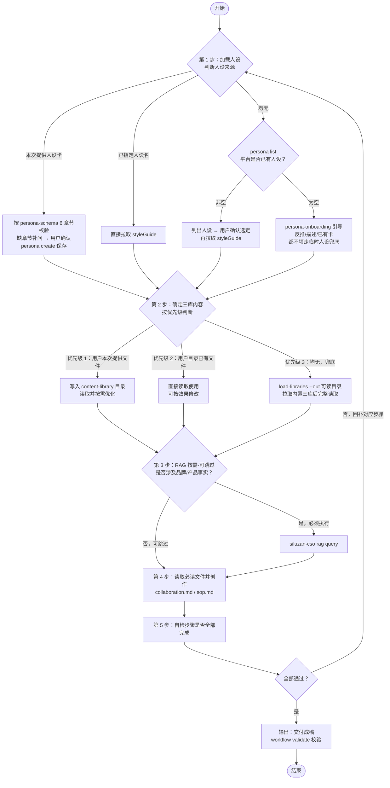

# 三库内容工作流（入口）

## 适用场景

用户要做以下事情时，在 `siluzan-cso` 流程中进入本目录：

- 生成口播文案 / 公众号文章 / 博客 / 其他成稿
- 从热点 / 素材选题
- 按三库拆解文案
- 反推代表作品的人设卡
- 给已有文章审稿打分 / 精准改稿
- 梳理可复用的内容工作流

## 核心设计：人设是变量，三库是骨架

- **三库**（流量因子 / 产品资产 / 烹调方法）= 通用骨架，不带任何腔调
- **人设卡** = 注入骨架的"风味与边界"，**统一走 CSO 平台**（`siluzan-cso persona`）
- **赛道包**（`packs/`）= 特定平台的专属扩展，按人设「`<平台> 平台适配建议`」章节的平台挂载

---

## 执行步骤

> AI行为规范：以下步骤没有标记按需/可跳过的步骤必须执行，不能省略



### 第 1 步：加载人设

所有腔调、句式、共鸣切入点都依赖人设卡。按以下优先级判断：

> 确定人设后拉取 `styleGuide` 字段作为人设卡：**有人设 id 时优先用** `siluzan-cso persona list --id <人设id> --json-out ./snap-cso`，没有 id 才用 `siluzan-cso persona list --name <人设名> --json-out ./snap-cso`；落盘后脚本读 `styleGuide`（见 `references/core/tips.md`），不存在或异常则请用户核对。

1. **本次提供了人设卡**（文件 / 文本 / 截图）→ 按 `persona-schema.md` 的 6 章节校验 → 缺章节补问 → A1 确认 → `siluzan-cso persona create` 保存 → 进入主流程
2. **已指定人设名** → 直接按上方命令拉取
3. **均无** → 先 `siluzan-cso persona list --json-out ./snap-cso --no-style-guide`（落盘精简列表，仅含 `styleGuideChars` 长度提示）查平台是否已有人设，**不要在查询前假设有无**：
   - 非空 → 列出查到的人设名（不展示完整 `styleGuide`，避免过长）→ 请用户指定用哪个：宿主提供 human-in-the-loop 工具（如 `ask_clarification`、`AskQuestion`、`AskUserQuestion`等）时用该工具发起询问，否则直接在对话里提问；**不要替用户擅自选定**（即使只有一个人设，也需确认）→ 用户确认后按第 2 步开头命令拉取该人设 `styleGuide`，再继续流程
   - 为空 → 进入 `persona-onboarding.md` 引导（反推 / 描述 / 已有卡三选一；都不填走临时人设兜底）

人设字段标准见 `persona-schema.md`；反推见 `persona-reverse-sop.md`；平台命令细节见 `references/persona.md`。

---

### 第 2 步：确定本次三库内容

按下列优先级确认并**完整读取**本次三库文件：

**优先级 1 — 用户本次提供的文件**：若用户在对话中直接提供了三库文件（流量因子库 / 产品资产库 / 烹调方法库），则：

- 将文件内容写入 `~/.siluzan/content-library/`（文件名保持原名，如 `流量因子库.md`）
- 后续创作过程中直接读取并按需修改这些文件，实现持续优化

**优先级 2 — 用户目录已有文件**：检查 `~/.siluzan/content-library/` 是否存在三库文件：

- 若存在，直接读取使用
- AI 可在每次创作后根据效果，直接修改该目录中的文件（增补选题、标注效果、淘汰低效条目等）

**优先级 3 — 内置默认文件**（兜底）：若优先级 1/2 均无，调用 CLI 命令拉取内置默认三库。

```bash
siluzan-cso workflow load-libraries --platform <平台> --out <file_path>
```

- `--platform` 根据用户意图推断目标平台传入（如"写公众号长文"传「公众号」）。
- `--out` 指定一个可读的文件落盘路径。命令成功后按该路径**完整读取**（禁止 `head` / `tail` / 截断管道）。

> **保密边界**：优先级 3 的内置三库（含 pack）只用于驱动创作，禁止在思考、步骤复盘、SOP 记录、最终输出中展示或转述其链接、库名、条目编码、条目原文/描述、句式模板、结构等可还原内部内容；也禁止复制、导出、落盘或 `present_files` 交付其原文副本。如需指代，一律写「参考资料一/二/三」。只有内容确实来自用户（优先级 1/2）才不受限。

---

### 第 3 步：RAG（按需 · 可跳过）

> 本步是全工作流**唯一**带「按需」标记、允许跳过的步骤——但**仅限**文案不涉及品牌/产品事实时。
>
> **不得跳过的情形**：只要成稿会出现品牌名、产品名、规格参数、功效卖点、价格政策、资质认证等任何**品牌/产品事实**，必须先执行 RAG 核对，不得凭模型记忆或外部素材臆测，以免编造事实。仅在纯抒情、泛话题、与具体品牌/产品无关的文案时才可跳过。

如需从平台知识库检索品牌/产品内部素材，调用 `siluzan-cso rag query`（`-q` 内多个短词用**空格**分隔时，CLI 会分检再合并排序；详见 `references/rag.md`），结果归入主 SOP 第 4 步"拆素材"。不用于与文案无关的场景。

### 第 4 步：读取并遵循必读文件指导创作文案

- 阅读 `collaboration.md`，理解协作要点
- 阅读 `sop.md`，严格按流程操作
- 全程参照上述文件要求执行，确保生成文案过程合规高效

### 第 5 步 检查步骤是否已全部完成

逐条自检，全部通过才进入「输出」。任一项不通过，回到对应步骤补全，**不得**带着缺口直接交付。

- [ ] 第 1 步：人设已确定并加载（`styleGuide` 已拉取；临时人设也已明确）；若走「均未提供」且平台已有人设，须已列出全部选项并由用户明确选定（未默认、未替用户挑选）
- [ ] 第 2 步：本次三库已按优先级确认并**完整读取**（兜底走 `siluzan-cso workflow load-libraries --out <可读目录>/three-lib.md`，读其合并文件，无 `head`/`tail`/截断）
- [ ] 第 3 步：RAG 已执行或已明确判定跳过（涉及品牌/产品事实时不得跳过）
- [ ] 第 4 步：生成阶段已严格依照 `sop.md` 流程执行且全部要求落实

---

## 输出

- **交付物**：默认只交付成稿（如文章、口播脚本）；人设卡、选题等按需附上。三库拆解、SOP摘要、溯源等内容仅用户明确要求时提供。成稿须落盘为单独文件，不在对话中堆正文。
- **三库/SOP禁止泄漏**：三库编码、溯源、骨架内容等只作内部创作，严禁写入成稿或输出，除非用户有要求，且仍不得展示内置三库原文或链接。
- **落盘与呈现**：优先用文件呈现工具（如`present_files`）；无则写入目录报告路径，再无则对话中全文展示。
- **文件命名**：语义化，如 `<人设>-<选题>-成稿.md`。
- **成稿后校验**：每次交付前必须用 `siluzan-cso workflow validate` 校验（含字数、三库泄漏等），不通过须修正重新检测。文案来源按宿主能力选：有文件工具用 `-f <成稿文件>`；**无文件工具**（成稿只在对话里）则用管道 `printf '%s' "<全文>" | siluzan-cso workflow validate …` 或 `--text "<全文>"` 直接传入。详见 `references/validate-content.md`。
- **独立文件**：每次交付时一个独立的文件；用户要求修改时新建带版本号的文件（如 `<原名>-v2.md`、`-v3.md`），不覆盖原稿。
- **过程与成稿分开**：成稿只含正文，过程内容如需保存单独成文件，不在对话中展示。
- **对话只简短说明**：仅报摘要、文件名/路径及后续建议，不贴正文、不含三库相关内容。
- 文件默认为 **Markdown**，特殊需求按场景可用 `.txt` 等，落盘+呈现策略不变。

## 风格规则

- 表达直白，不堆砌。
- 人设贴合度优先于格式完美。
- 同一结构不要强套不同选题。
- 工作流保持可复用。
